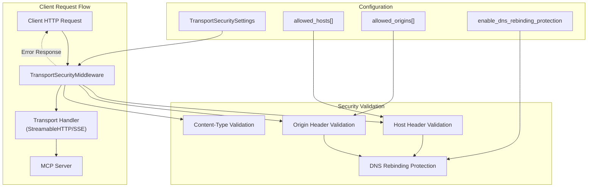
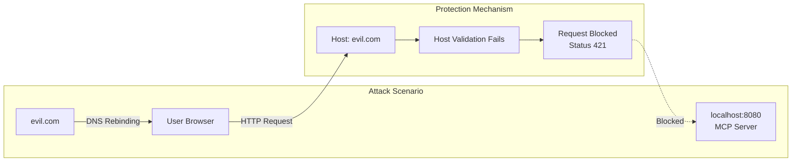
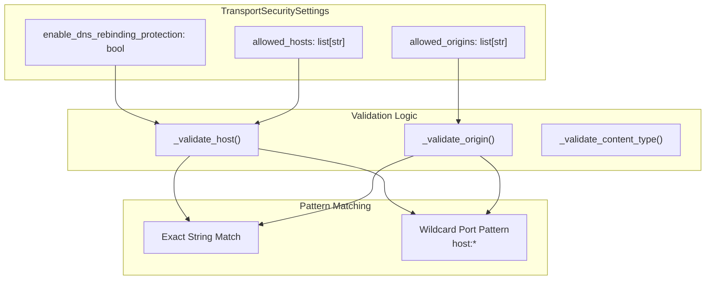
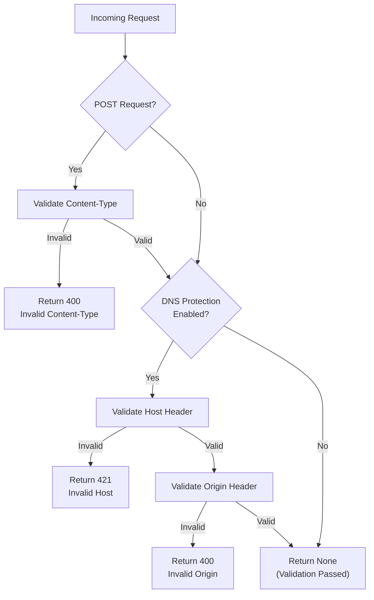
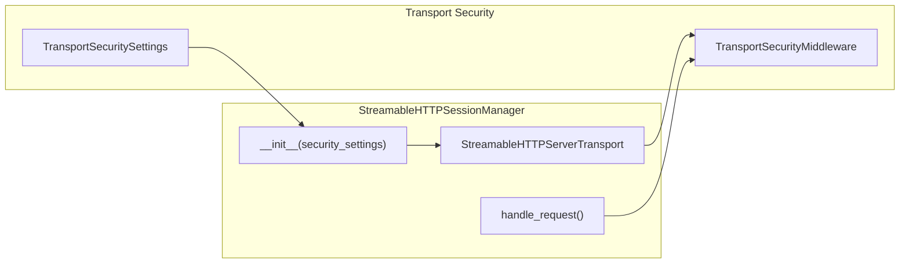
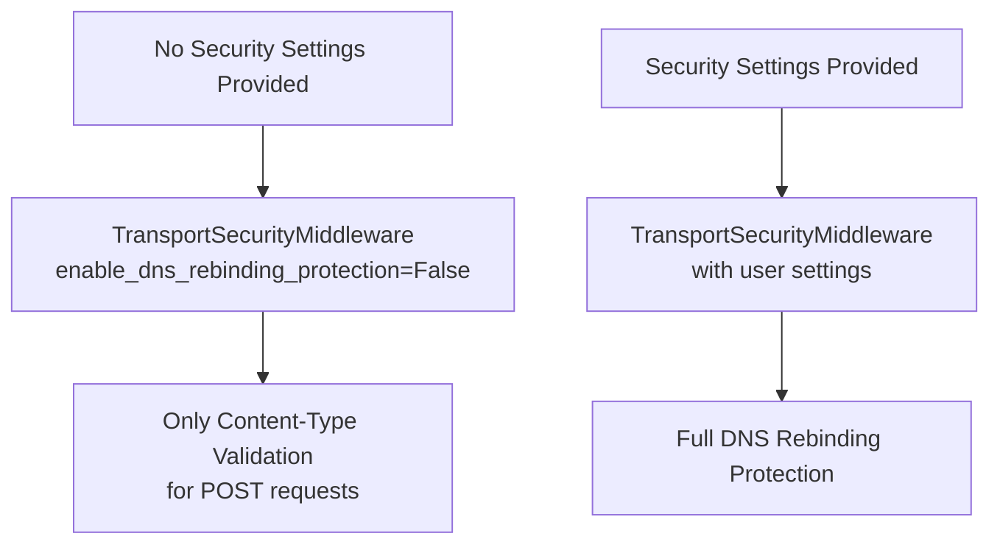
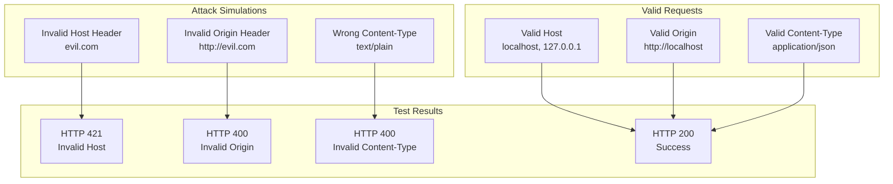

This document covers the security features implemented for MCP transport layers, focusing on DNS rebinding protection and request validation middleware. The security system provides configurable protection against malicious cross-origin requests targeting locally-hosted MCP servers.

For information about specific transport implementations, see [StreamableHTTP Transport](#5.1), [SSE Transport](#5.2), and [WebSocket Transport](#5.4). For authentication mechanisms, see [Authentication & Security](#7).

## Security Architecture Overview

The transport security system implements a middleware-based architecture that validates incoming HTTP requests before they reach the MCP protocol handlers. The system is designed to prevent DNS rebinding attacks while maintaining compatibility with legitimate client connections.



Sources: [src/mcp/server/transport_security.py:37-128](), [src/mcp/server/streamable_http_manager.py:24-68]()

## DNS Rebinding Protection

DNS rebinding attacks occur when malicious websites trick browsers into making requests to local servers using specially crafted DNS responses. The MCP security system prevents these attacks by validating request headers that browsers automatically include.

### Threat Model

| Attack Vector | Validation Method | HTTP Status | Error Message |
|---------------|-------------------|-------------|---------------|
| Malicious Host header | Host whitelist validation | 421 | "Invalid Host header" |
| Cross-origin requests | Origin header validation | 400 | "Invalid Origin header" |
| Wrong content type | Content-Type validation | 400 | "Invalid Content-Type header" |



Sources: [src/mcp/server/transport_security.py:45-66](), [tests/server/test_streamable_http_security.py:110-136]()

## Configuration Settings

The `TransportSecuritySettings` class provides flexible configuration for security features:

### Basic Configuration

```python
TransportSecuritySettings(
    enable_dns_rebinding_protection=True,
    allowed_hosts=["localhost", "127.0.0.1:8080"],
    allowed_origins=["http://localhost", "http://127.0.0.1:8080"]
)
```

### Wildcard Port Patterns

The system supports wildcard port patterns for development environments:

| Pattern | Matches | Example |
|---------|---------|---------|
| `"localhost:*"` | Any port on localhost | `localhost:3000`, `localhost:8080` |
| `"127.0.0.1:*"` | Any port on 127.0.0.1 | `127.0.0.1:5000`, `127.0.0.1:9999` |
| `"http://localhost:*"` | Any port in origins | `http://localhost:3000` |



Sources: [src/mcp/server/transport_security.py:12-35](), [src/mcp/server/transport_security.py:56-63](), [tests/server/test_sse_security.py:226-256]()

## Security Middleware Implementation

The `TransportSecurityMiddleware` class implements the core validation logic:

### Validation Methods

| Method | Purpose | Returns |
|--------|---------|---------|
| `_validate_host()` | Validates Host header against whitelist | `bool` |
| `_validate_origin()` | Validates Origin header (optional) | `bool` |
| `_validate_content_type()` | Ensures JSON content type for POST | `bool` |
| `validate_request()` | Main validation entry point | `Response | None` |

### Validation Flow



Sources: [src/mcp/server/transport_security.py:102-128](), [src/mcp/server/transport_security.py:89-101]()

## Transport Integration

Security middleware integrates with multiple transport types through a common pattern:

### StreamableHTTP Integration

The `StreamableHTTPSessionManager` accepts security settings and passes them to transport instances:



### SSE Integration

The `SseServerTransport` similarly integrates security validation:

| Transport Type | Security Integration Point | Error Handling |
|----------------|----------------------------|----------------|
| StreamableHTTP | `StreamableHTTPServerTransport` constructor | Middleware returns error response |
| SSE | `SseServerTransport` constructor | Validation in `connect_sse()` |
| WebSocket | Not implemented | N/A |
| STDIO | Not applicable | Local process communication |

Sources: [src/mcp/server/streamable_http_manager.py:62-68](), [src/mcp/server/streamable_http_manager.py:224-229](), [tests/server/test_sse_security.py:45-58]()

## Default Security Behavior

The security system uses conservative defaults to maintain backward compatibility:

### Default Settings

| Setting | Default Value | Rationale |
|---------|---------------|-----------|
| `enable_dns_rebinding_protection` | `True` in settings, `False` in middleware | Backwards compatibility |
| `allowed_hosts` | `[]` (empty list) | Must be explicitly configured |
| `allowed_origins` | `[]` (empty list) | Must be explicitly configured |

### Backward Compatibility



Sources: [src/mcp/server/transport_security.py:40-43](), [src/mcp/server/transport_security.py:114-115]()

## Testing and Validation

The security system includes comprehensive tests covering various attack scenarios and configuration options:

### Test Coverage

| Test Category | File | Key Test Cases |
|---------------|------|----------------|
| StreamableHTTP Security | `test_streamable_http_security.py` | Host/Origin validation, Content-Type checks |
| SSE Security | `test_sse_security.py` | GET/POST validation, wildcard patterns |
| Integration | Both files | Real server processes, multiprocessing tests |

### Security Test Scenarios



Sources: [tests/server/test_streamable_http_security.py:85-294](), [tests/server/test_sse_security.py:78-294]()