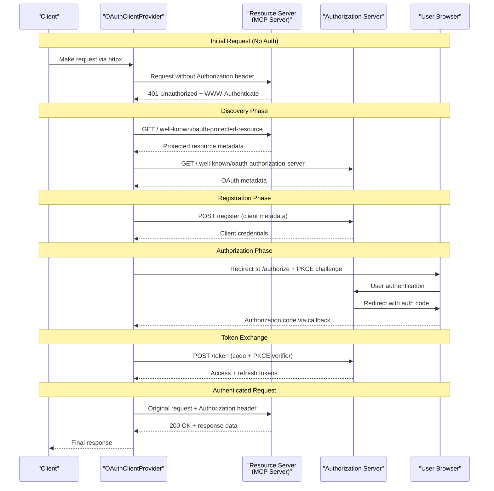
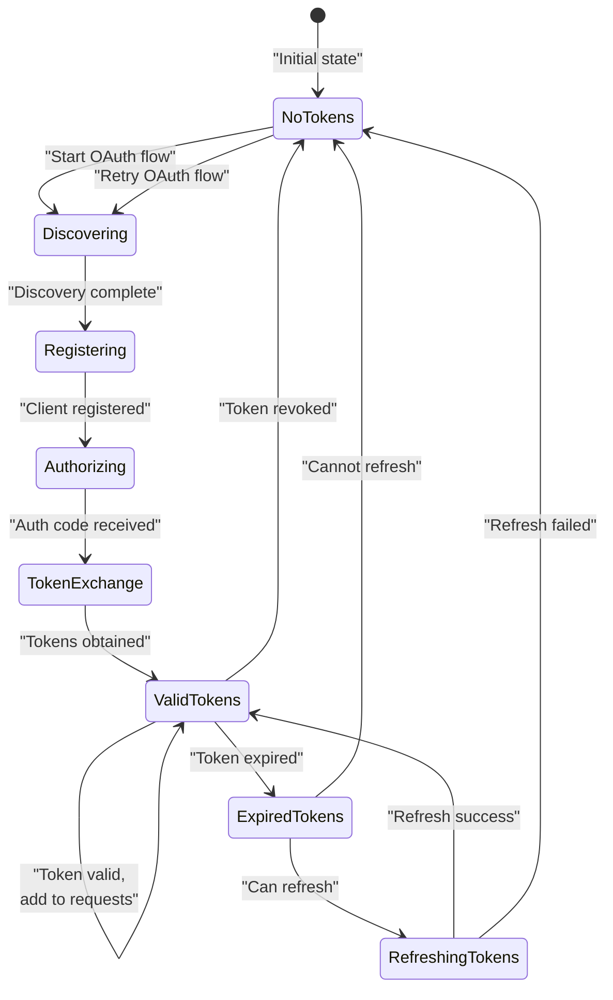

```

Sources: [src/mcp/client/auth.py:49-62](), [tests/client/test_auth.py:82-107]()

## Authentication Flow

### Complete OAuth Flow Sequence



Sources: [src/mcp/client/auth.py:485-552](), [tests/client/test_auth.py:575-701]()

### Discovery Mechanisms

The client implements multiple discovery mechanisms for maximum compatibility:

**1. RFC 9728 Protected Resource Discovery**
- Extracts resource metadata URL from `WWW-Authenticate` header
- Falls back to `/.well-known/oauth-protected-resource`
- Discovers authorization server URLs

**2. OAuth Metadata Discovery with Fallback**
The client tries multiple discovery URLs in order:
1. `/.well-known/oauth-authorization-server{path}` (RFC 8414 path-aware)
2. `/.well-known/oauth-authorization-server` (OAuth root)
3. `/.well-known/openid-configuration{path}` (OIDC path-aware)
4. `{server_url}/.well-known/openid-configuration` (OIDC fallback)

```python
def _get_discovery_urls(self) -> list[str]:
    urls = []
    # Path-aware OAuth discovery
    if parsed.path and parsed.path != "/":
        oauth_path = f"/.well-known/oauth-authorization-server{parsed.path.rstrip('/')}"
        urls.append(urljoin(base_url, oauth_path))
    # Additional fallback URLs...
```

Sources: [src/mcp/client/auth.py:254-279](), [src/mcp/client/auth.py:231-253](), [tests/client/test_auth.py:252-365]()

### WWW-Authenticate Header Parsing

Supports RFC 9728 resource metadata discovery via `WWW-Authenticate` header parsing:

```python
def _extract_resource_metadata_from_www_auth(self, response: httpx.Response) -> str | None:
    # Pattern: resource_metadata="url" or resource_metadata=url
    pattern = r'resource_metadata=(?:"([^"]+)"|([^\s,]+))'
    match = re.search(pattern, www_auth_header)
    return match.group(1) or match.group(2) if match else None
```

**Supported Header Formats:**
- `Bearer resource_metadata="https://api.example.com/.well-known/oauth-protected-resource"`
- `Bearer resource_metadata=https://api.example.com/metadata`
- `Bearer realm="api", resource_metadata="https://api.example.com/metadata", error="insufficient_scope"`

Sources: [src/mcp/client/auth.py:207-229](), [tests/client/test_auth.py:782-900]()

## Token Management

### Token Lifecycle



### Token Validation and Refresh

**Token Validity Checking:**
```python
def is_token_valid(self) -> bool:
    return bool(
        self.current_tokens
        and self.current_tokens.access_token
        and (not self.token_expiry_time or time.time() <= self.token_expiry_time)
    )

def can_refresh_token(self) -> bool:
    return bool(
        self.current_tokens 
        and self.current_tokens.refresh_token 
        and self.client_info
    )
```

**Automatic Refresh Logic:**
The provider automatically attempts token refresh when:
1. Current token is expired but refresh token exists
2. Client information is available for authentication
3. Refresh fails trigger full re-authentication

Sources: [src/mcp/client/auth.py:127-143](), [src/mcp/client/auth.py:494-502](), [src/mcp/client/auth.py:411-462]()

### Resource Parameter Handling

Implements RFC 8707 resource parameter inclusion based on protocol version and protected resource metadata:

```python
def should_include_resource_param(self, protocol_version: str | None = None) -> bool:
    # Always include if protected resource metadata is available
    if self.protected_resource_metadata is not None:
        return True
    
    # Include for protocol version 2025-06-18 or later
    if protocol_version:
        return protocol_version >= "2025-06-18"
    
    return False
```

**Resource URL Calculation:**
- Uses protected resource metadata if available and valid
- Falls back to canonical server URL derived from MCP endpoint
- Validates hierarchical resource relationships

Sources: [src/mcp/client/auth.py:159-177](), [src/mcp/client/auth.py:144-158](), [tests/client/test_auth.py:459-534]()

## Token Storage

### TokenStorage Protocol

The `TokenStorage` protocol defines the interface for persistent token storage:

```python
class TokenStorage(Protocol):
    async def get_tokens(self) -> OAuthToken | None: ...
    async def set_tokens(self, tokens: OAuthToken) -> None: ...
    async def get_client_info(self) -> OAuthClientInformationFull | None: ...
    async def set_client_info(self, client_info: OAuthClientInformationFull) -> None: ...
```

**Implementation Requirements:**
- **Persistence**: Tokens should survive application restarts
- **Security**: Secure storage with appropriate encryption
- **Concurrency**: Thread-safe access patterns
- **Cleanup**: Automatic removal of expired tokens

**Example Storage Implementation:**
```python
class MockTokenStorage:
    def __init__(self):
        self._tokens: OAuthToken | None = None
        self._client_info: OAuthClientInformationFull | None = None
    
    async def get_tokens(self) -> OAuthToken | None:
        return self._tokens
    
    async def set_tokens(self, tokens: OAuthToken) -> None:
        self._tokens = tokens
```

Sources: [src/mcp/client/auth.py:64-82](), [tests/client/test_auth.py:17-35]()

## Error Handling

### Exception Hierarchy

| Exception | Usage | Common Causes |
|-----------|-------|---------------|
| `OAuthFlowError` | Base OAuth flow errors | Network issues, invalid configuration |
| `OAuthTokenError` | Token-specific errors | Invalid tokens, expired refresh tokens |
| `OAuthRegistrationError` | Client registration failures | Invalid metadata, server rejection |

**Error Recovery Strategies:**
- **Network errors**: Automatic retry with exponential backoff
- **Invalid tokens**: Clear stored tokens and restart OAuth flow
- **Registration failures**: Log error details for debugging
- **Authorization failures**: Clear state and prompt re-authentication

```python
try:
    # OAuth flow operations
    await oauth_provider._handle_token_response(response)
except OAuthTokenError as e:
    logger.warning(f"Token operation failed: {e}")
    oauth_provider.context.clear_tokens()
    # Trigger re-authentication
```

Sources: [src/mcp/client/auth.py:37-47](), [src/mcp/client/auth.py:388-410](), [src/mcp/client/auth.py:442-462]()

## Integration Examples

### Basic Usage with HTTP Client

```python
from mcp.client.auth import OAuthClientProvider
from mcp.shared.auth import OAuthClientMetadata