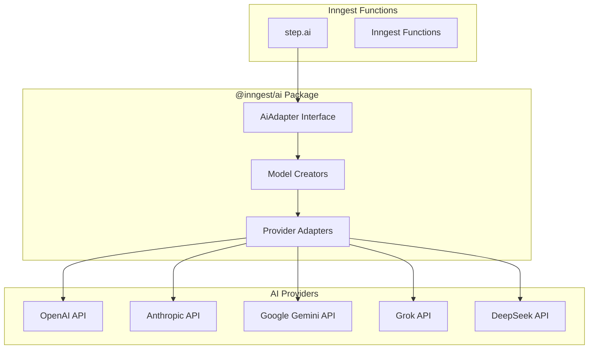
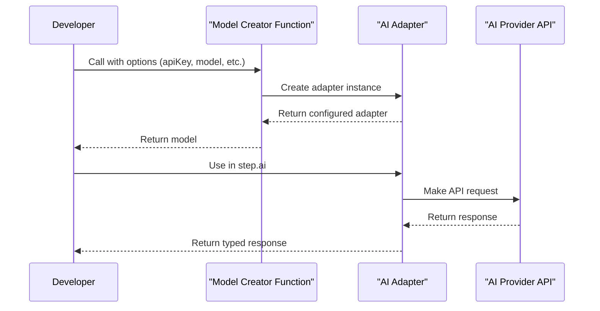
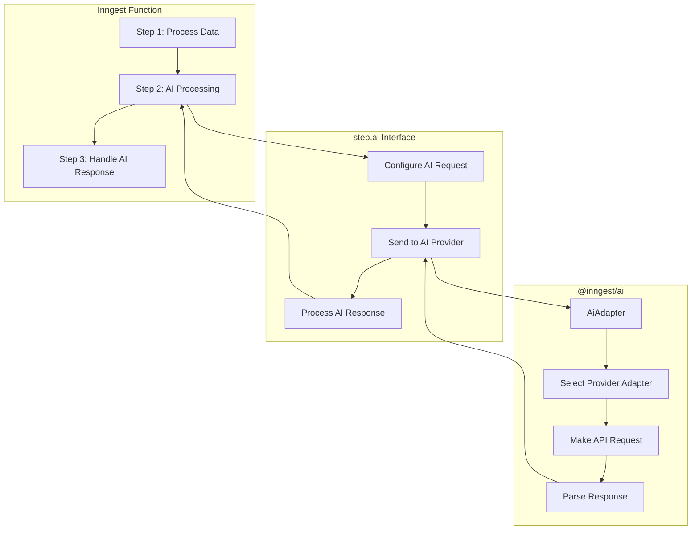

This document details the `@inngest/ai` package which provides a standardized interface for interacting with various AI models and services within Inngest functions. It enables developers to utilize AI capabilities from providers like OpenAI, Anthropic, Gemini, and more, with consistent patterns and type safety.

For information about the general Inngest extensions system, see [Extensions](#4).

## Overview



Sources: [packages/ai/src/adapter.ts](), [packages/ai/package.json]()

The AI Integration package provides:

1. A unified interface for working with different AI models
2. Type-safe adapters for popular AI providers
3. Helper functions for creating and configuring AI models
4. Consistent error handling and response parsing

## Architecture

```mermaid
classDiagram
    class AiAdapter {
        +format: string
        +options: any
        +url?: string
        +headers?: Record~string, string~
        +authKey: string
        +onCall?(model, body): void
        +~types: { input: any, output: any }
    }
    
    class OpenAiAiAdapter {
        +format: "openai-chat"
        +~types: { input: OpenAIInput, output: OpenAIOutput }
    }
    
    class AnthropicAiAdapter {
        +format: "anthropic"
        +~types: { input: AnthropicInput, output: AnthropicOutput }
    }
    
    class GeminiAiAdapter {
        +format: "gemini"
        +~types: { input: GeminiInput, output: GeminiOutput }
    }
    
    class GrokAiAdapter {
        +format: "grok"
        +~types: { input: GrokInput, output: GrokOutput }
    }
    
    AiAdapter <|-- OpenAiAiAdapter
    AiAdapter <|-- AnthropicAiAdapter
    AiAdapter <|-- GeminiAiAdapter
    AiAdapter <|-- GrokAiAdapter
    
    class ModelCreator {
        <<function>>
        +create(options): AiAdapter
    }
    
    ModelCreator --> AiAdapter: creates
```

Sources: [packages/ai/src/adapter.ts](), [packages/ai/src/adapters/openai.ts](), [packages/ai/src/adapters/anthropic.ts]()

The core of the AI integration is the `AiAdapter` interface, which defines the contract that all AI model adapters must implement. This ensures a consistent API across different AI providers, allowing for easy switching between models while maintaining type safety.

## Supported AI Providers

The package currently supports the following AI providers:

| Provider | Format | Models | Features |
|----------|--------|--------|----------|
| OpenAI | `openai-chat` | GPT-4.1, GPT-4.1-mini, GPT-4o, GPT-4, GPT-3.5-turbo, etc. | Text generation, function calling |
| Anthropic | `anthropic` | Claude 3.5 Haiku/Sonnet/Opus, Claude 3, Claude 2.1, etc. | Text generation, tool use, PDF parsing |
| Google | `gemini` | Gemini models | Text generation |
| xAI | `grok` | Grok models (via OpenAI compatibility) | Text generation |
| DeepSeek | Via OpenAI compatibility | DeepSeek models | Text generation |

Sources: [packages/ai/src/models/openai.ts](), [packages/ai/src/adapters/anthropic.ts](), [packages/ai/CHANGELOG.md]()

## Using AI Models

### Model Creation

AI models are created using model creator functions that configure the appropriate adapter:



Sources: [packages/ai/src/models/openai.ts]()

### OpenAI Example

The OpenAI model creator configures an adapter for OpenAI's chat completion API:

```typescript
const openAiModel = openai({
  model: "gpt-4o",
  apiKey: "your-api-key", // Optional, defaults to OPENAI_API_KEY env var
  baseUrl: "https://api.openai.com/v1/", // Optional
  defaultParameters: { // Optional
    temperature: 0.7,
    max_tokens: 1000
  }
});
```

Sources: [packages/ai/src/models/openai.ts:10-35]()

### Anthropic Example

For Anthropic's Claude models:

```typescript
const anthropicModel = anthropic({
  model: "claude-3-opus-20240229",
  apiKey: "your-api-key" // Optional, defaults to ANTHROPIC_API_KEY env var
});
```

Sources: [packages/ai/src/adapters/anthropic.ts]()

## Input and Output Types

Each adapter defines its own input and output types that match the API of the specific provider:

### OpenAI Types

The OpenAI adapter accepts inputs with a structure that includes:

- `messages`: An array of messages with roles and content
- `model`: The model ID to use
- Various parameters like `temperature`, `max_tokens`, etc.

And produces outputs with:

- `id`: A unique identifier for the completion
- `choices`: An array of generated responses
- `usage`: Token usage statistics

Sources: [packages/ai/src/adapters/openai.ts:10-685]()

### Anthropic Types

The Anthropic adapter has a similar structure but with Claude-specific fields:

- Input includes `messages`, `model`, `system` prompts, etc.
- Output includes the generated content, stop reason, and usage statistics
- Support for tool calling and multimedia content

Sources: [packages/ai/src/adapters/anthropic.ts:16-654]()

## Advanced Features

### PDF Parsing with Claude

Anthropic Claude models support document processing capabilities:

```typescript
// Example of sending a PDF document to Claude
const messages = [
  {
    role: "user",
    content: [
      {
        type: "document",
        source: {
          type: "base64",
          media_type: "application/pdf",
          data: "base64EncodedPdfData"
        }
      },
      {
        type: "text",
        text: "Summarize this document"
      }
    ]
  }
];
```

Sources: [packages/ai/src/adapters/anthropic.ts:127-140](), [packages/ai/CHANGELOG.md:34-35]()

### Tool Use / Function Calling

Both OpenAI and Anthropic adapters support tool use (function calling):

```typescript
// Example tool definition for OpenAI
const tools = [
  {
    type: "function",
    function: {
      name: "get_weather",
      description: "Get the current weather in a location",
      parameters: {
        type: "object",
        properties: {
          location: {
            type: "string",
            description: "The city and state"
          }
        },
        required: ["location"]
      }
    }
  }
];
```

Sources: [packages/ai/src/adapters/openai.ts:271-314](), [packages/ai/src/adapters/anthropic.ts:554-629]()

## Environment Variables

The package supports the following environment variables for setting API keys:

- `OPENAI_API_KEY`: Default API key for OpenAI models
- `ANTHROPIC_API_KEY`: Default API key for Anthropic models

Sources: [packages/ai/src/models/openai.ts:14]()

## Recent Updates

Recent additions to the package include:

- Support for GPT-4.1 models
- Gemini adapter and Grok OpenAI-compatible support
- Support for Anthropic Claude document parsing (PDFs)
- Ability to set default parameters for models
- Improved error typing and response handling

Sources: [packages/ai/CHANGELOG.md:3-70]()

## Integration with Inngest

The `@inngest/ai` package is designed to be used seamlessly with Inngest functions, typically via the `step.ai` interface. This allows for AI capabilities to be integrated directly into your workflows.



Sources: [packages/ai/package.json](), [packages/ai/src/adapter.ts]()

## Conclusion

The `@inngest/ai` package provides a powerful, type-safe, and unified interface for integrating various AI models into your Inngest functions. By abstracting away the differences between AI providers, it enables developers to easily switch between models and leverage advanced AI capabilities while maintaining a consistent code structure.

For information about other Inngest extensions, see [Extensions](#4).