This document provides a guide for developers working on or contributing to the Inngest repository. It covers the development environment, build processes, and release workflows. For more specific information about the build process details, see [Build Process](#7.1), and for information about releases, see [Release Process](#7.2).

## Development Environment Setup

To work with the Inngest codebase, you'll need to set up your development environment correctly.

### Prerequisites

- Node.js (check package.json for the recommended version)
- pnpm package manager (required, enforced by preinstall script)

### Getting Started

1. Clone the repository
2. Install dependencies using pnpm

```bash
git clone https://github.com/inngest/inngest-js
cd inngest-js
pnpm install
```

Sources: [package.json:1-10](), [README.md:134-137]()

## Repository Structure

The Inngest repository is organized as a monorepo using pnpm workspaces, containing multiple packages that make up the Inngest ecosystem.

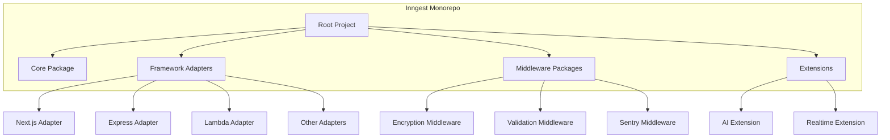

Sources: [package.json:1-19]()

## Build and Development Process

The build process in Inngest is handled through pnpm scripts that coordinate building across all packages in the monorepo.

### Development Workflow

The following diagram illustrates the typical development workflow:

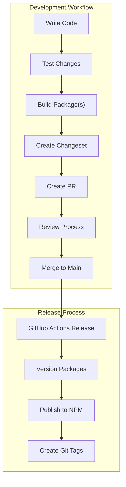

### Build Commands

The repository uses pnpm scripts to manage the build process:

```bash
# Build all packages
pnpm run build

# Run build scripts recursively in all packages
pnpm run --if-present --recursive build
```

Sources: [package.json:2-9]()

## Release Process

Inngest uses a structured release process with Changesets for version management and GitHub Actions for automation.

### Release Workflow

The release process is automated via GitHub Actions and triggered when code is pushed to the main branch or version branches (v*.x).

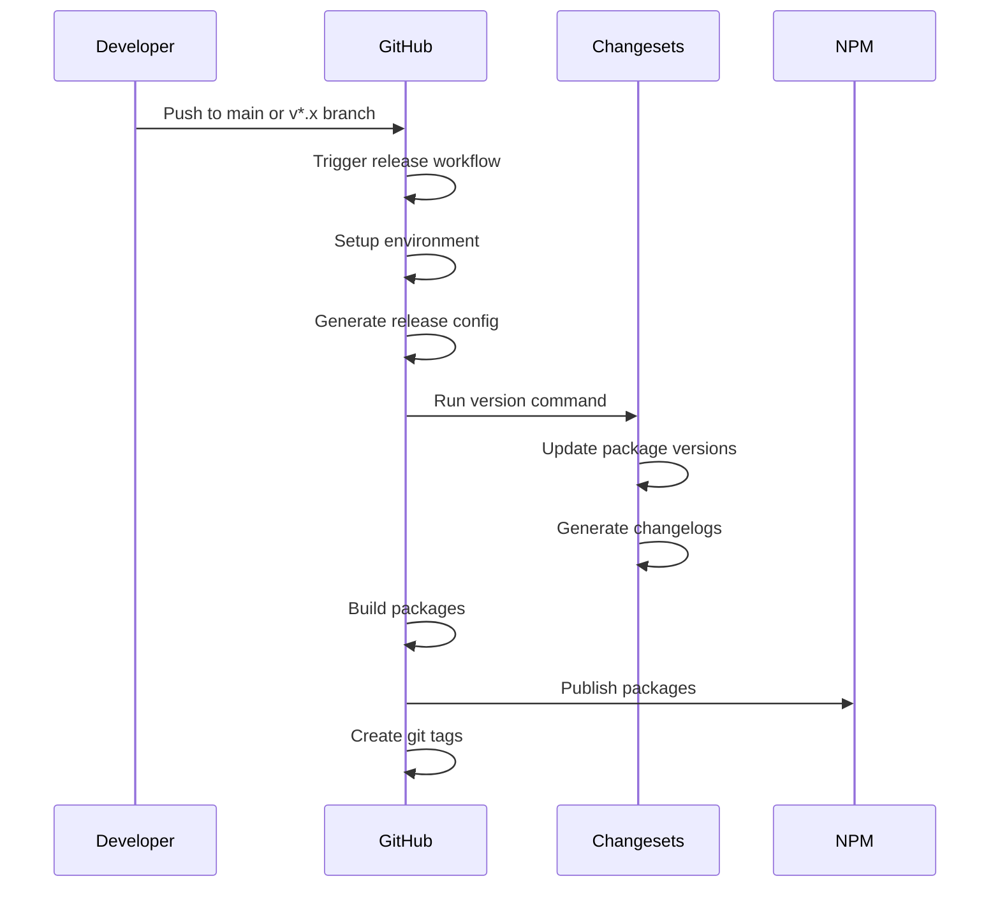

### Changesets

Inngest uses Changesets to manage versioning and changelogs:

1. Developers create changeset files describing their changes
2. The Changesets CLI reads these files during the release process
3. Package versions are updated according to changeset specifications
4. Changelogs are generated based on changesets

### Release Scripts

The following scripts are used during the release process:

- `release:version`: Runs Changesets version command to update package versions
- `release:publish`: Publishes packages to npm
- `release:tag`: Creates git tags for the release
- `release:all`: Combines build, publish, and tag steps

Sources: [package.json:2-10](), [.github/workflows/release.yml:1-46](), [scripts/generateReleaseConfig.js:1-28]()

## CI/CD Pipeline

The continuous integration and deployment pipeline is managed through GitHub Actions.

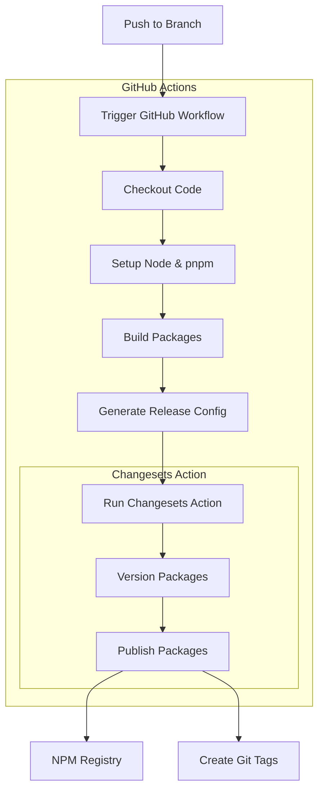

### Release Configuration

The release configuration is dynamically generated using the `generateReleaseConfig.js` script, which creates a Changesets config based on the current branch:

```javascript
// Config includes settings for:
// - Changelog generation
// - Access level (public)
// - Base branch determination
// - Internal dependency updates
```

Sources: [.github/workflows/release.yml:10-45](), [scripts/generateReleaseConfig.js:4-14]()

## Contributing

Contributions to Inngest follow a standard GitHub workflow:

1. Fork the repository
2. Create a feature branch
3. Make changes
4. Add tests if applicable
5. Create a changeset to describe your changes
6. Submit a pull request

For more detailed contribution guidelines, see the CONTRIBUTING.md file in the repository.

Sources: [README.md:135-137]()

# Build Process


This page documents the build process for the Inngest JavaScript SDK repository. It covers the development environment setup, build tools, and how packages are built and prepared for distribution. For information about the release process after building, see [Release Process](#7.2).

## Overview

The Inngest repository uses a monorepo structure managed with pnpm workspaces. The build system is designed to build all packages in the correct order, handling interdependencies while ensuring consistent output across the codebase.

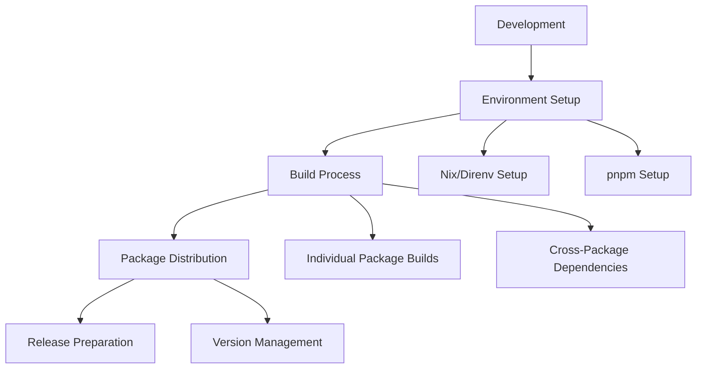

Sources: [package.json:2-10](), [flake.nix:1-52]()

## Development Environment Setup

The Inngest repository supports two primary development environment setups: Nix-based and standard pnpm-based. The Nix approach provides a more reproducible environment but requires additional tools.

### Nix Development Environment

The repository includes a Nix flake configuration that sets up a consistent development environment with the correct Node.js version and tools.

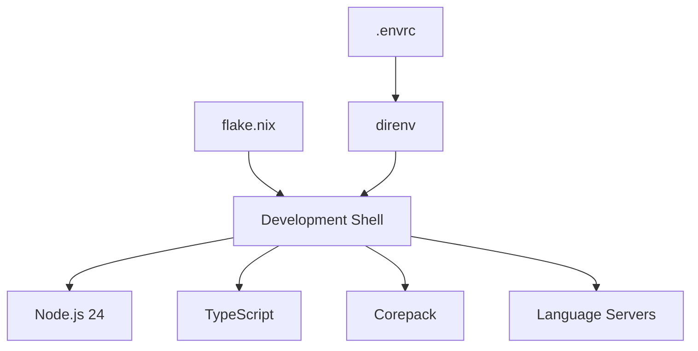

To use the Nix environment:

1. Install Nix and direnv
2. Run `direnv allow` in the repository root
3. The environment will automatically activate when you enter the directory

The Nix configuration ensures everyone uses the same Node.js version (24) and tools, preventing inconsistencies between developers.

Sources: [flake.nix:1-52](), [.envrc:1-2]()

### Standard pnpm Setup

If you're not using Nix, you can use pnpm directly:

1. Ensure Node.js 16+ is installed
2. Install pnpm: `npm install -g pnpm`
3. Run `pnpm install` in the repository root

The repository enforces pnpm usage through the `preinstall` script, which prevents using npm or yarn.

Sources: [package.json:3]()

## Build System Architecture

The build system uses pnpm's recursive command execution to build all packages in the correct order based on their dependencies.

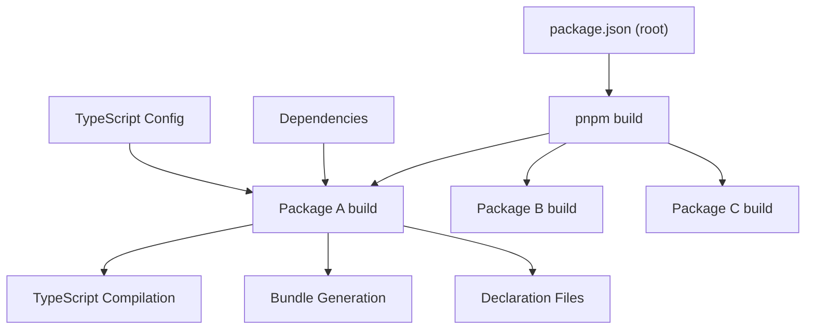

Sources: [package.json:5]()

## Build Commands

The main build commands are defined in the root `package.json`:

| Command | Description |
|---------|-------------|
| `pnpm build` | Builds all packages in the repository |
| `pnpm release:all` | Builds all packages and runs the release process |
| `pnpm release:version` | Updates package versions using changesets |
| `pnpm release:publish` | Publishes packages to the registry |
| `pnpm release:tag` | Creates git tags for the release |

Sources: [package.json:2-10]()

## Package Build Process

Each package in the Inngest repository has its own build configuration, typically using TypeScript compilation. The build process generally includes:

1. TypeScript compilation
2. Generation of declaration files (`.d.ts`)
3. Creation of source maps
4. Bundle generation (if applicable)

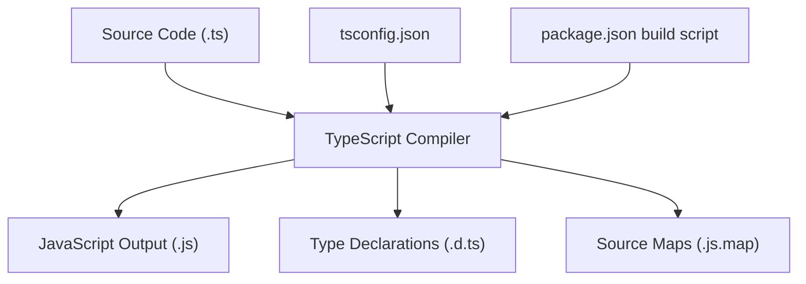

Sources: [examples/connect-example/tsconfig.json:1-111]()

## Dependency Management

The repository uses pnpm workspaces to manage dependencies between packages. This allows packages to reference each other using local workspace links during development.

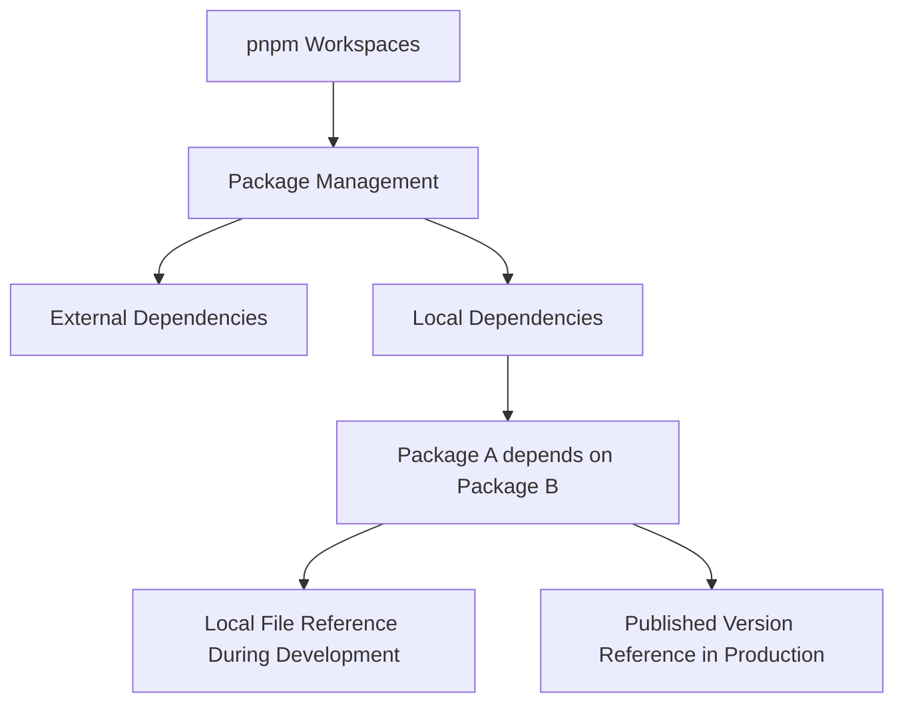

In example packages, local dependencies are sometimes referenced using file paths, as seen in the connect-example:

Sources: [examples/connect-example/package.json:16]()

## Build Artifacts and Ignored Files

The build process generates various artifacts that are not committed to the repository:

- `node_modules` directories
- Distribution files (usually in `dist` directories)
- Environment files (`.env`)

These are specified in the `.gitignore` file to prevent them from being committed.

Sources: [.gitignore:1-10]()

## Versioning and Release Management

The repository uses Changesets for versioning and changelog generation. This allows for controlled updates to package versions and documentation of changes between releases.

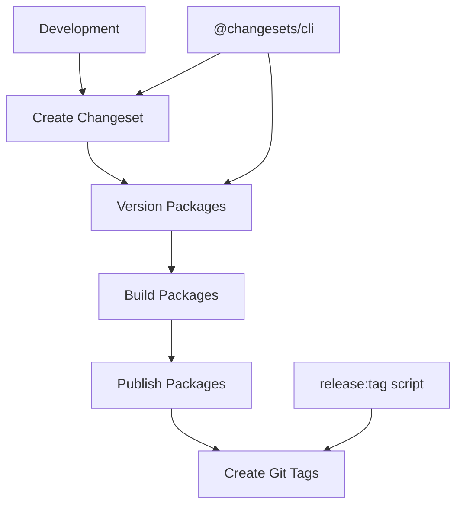

The release process is handled by the scripts in the root `package.json`, with the actual versioning performed by Changesets.

Sources: [package.json:4-9](), [package.json:14-17]()

## Continuous Integration

The build process is integrated into CI workflows, which use the same pnpm commands to ensure consistency between local development and CI environments.

For more details about how packages are published after being built, see the [Release Process](#7.2) documentation.

# Release Process


This document describes the automated release process for the Inngest repository. It covers how releases are versioned, built, published to npm, and tagged in git. For information about the build process itself, see [Build Process](#7.1).

## Overview of the Release System

The Inngest repository uses [Changesets](https://github.com/changesets/changesets) to manage versioning and changelog generation across packages. The release process is largely automated using GitHub Actions workflows.

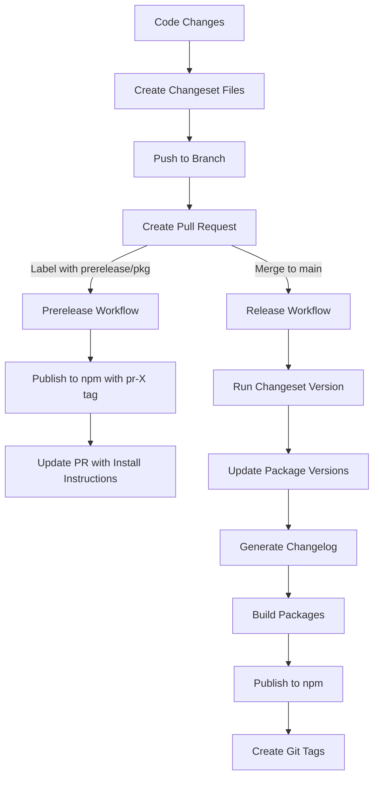

Sources: [.github/workflows/release.yml:1-46](), [.github/workflows/prerelease.yml:1-91](), [package.json:1-19]()

## Release Scripts

The release process is orchestrated through a set of npm scripts defined in the root `package.json`:

| Script | Purpose |
| ------ | ------- |
| `release:all` | Main release script that builds, publishes, and tags |
| `release:version` | Updates package versions using changesets |
| `release:publish` | Publishes packages to npm |
| `release:tag` | Creates git tags for the release |

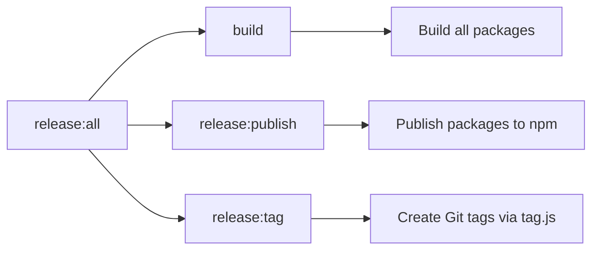

Sources: [package.json:2-10]()

## Automated GitHub Workflows

### Main Release Workflow

The main release process is triggered automatically when code is pushed to the `main` branch or a version branch (e.g., `v1.x`). It:

1. Checks out the code repository
2. Sets up the build environment
3. Generates release configuration
4. Runs the changeset action to:
   - Update versions
   - Generate changelogs
   - Publish packages to npm
   - Create a release commit

This workflow requires specific permissions and uses npm tokens stored as GitHub secrets for authentication.

Sources: [.github/workflows/release.yml:1-46](), [scripts/generateReleaseConfig.js:1-28]()

### Prerelease Workflow

The prerelease workflow creates test versions of packages for pull requests. It's triggered when:

1. A PR is created, updated, or reopened
2. A PR is labeled with a specific prerelease label (e.g., `prerelease/inngest`)

For labeled PRs, it:

1. Builds the relevant packages
2. Publishes them to npm with a tag matching the PR number (e.g., `pr-123`)
3. Updates the PR with a comment containing installation instructions

This allows for easy testing of changes before they're merged into the main branch.

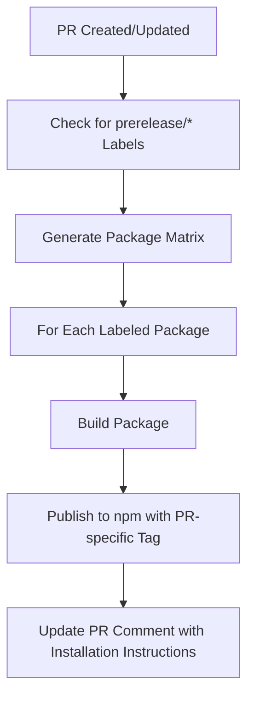

Sources: [.github/workflows/prerelease.yml:1-91]()

## Release Configuration

The release configuration is generated dynamically using `scripts/generateReleaseConfig.js`. This script creates a `.changeset/config.json` file that controls the behavior of changesets.

The configuration specifies:

- The changelog generator to use
- Access levels for packages (public)
- The base branch for releases
- How internal dependencies should be updated
- Whether to commit changes

Sources: [scripts/generateReleaseConfig.js:1-28]()

## Package Release Process

The Inngest repository contains multiple packages:

- `inngest` (main SDK)
- Various middleware packages (e.g., `middleware-sentry`, `middleware-encryption`)
- Extensions like `ai` and `realtime`

When a release is performed, each package is:

1. Built using its specific build process
2. Versioned according to its changesets
3. Published to npm with the appropriate tag
4. Tagged in git with its version

For packages that depend on each other, the release process ensures versions are correctly updated.

Sources: [.github/workflows/prerelease.yml:21-33](), [package.json:7-8]()

## Creating a Release Manually

While most releases happen automatically, you can trigger a release manually by:

1. Ensuring all changesets are in place with `npx changeset` (creates files in the `.changeset` directory)
2. Running `pnpm run release:version` to update versions and generate changelogs
3. Running `pnpm run release:all` to build, publish, and tag the release

However, this should generally be avoided in favor of the automated process.

Sources: [package.json:4-8]()

## Best Practices

1. Always create changesets when making significant changes
2. For testing changes, use the prerelease process by adding the appropriate label to your PR
3. Allow the automated workflow to handle final releases rather than publishing manually
4. Ensure all tests pass before merging to main to trigger a release