Event handling is a core concept in the Inngest JS SDK. This page explains how events are structured, sent, validated, and processed within the system. Events are the primary mechanism for triggering function executions and for communication between Inngest functions.

For information about function execution flow, see [Function Execution](#2.2). For details on sending events from steps within a function, see [Step Tools](#2.3).

## Event Structure and Types

At its core, Inngest uses a standardized event payload structure defined by the `EventPayload` interface.

```mermaid
classDiagram
    class EventPayload {
        name: string
        data: any
        id?: string
        user?: any
        ts?: number
        v?: string
    }
    
    class MinimalEventPayload {
        id?: string
        data?: any
        user?: any
        v?: string
    }
    
    EventPayload --|> MinimalEventPayload: extends
    
    class FailureEventPayload {
        name: "inngest/function.failed"
        data: {
            function_id: string
            run_id: string
            error: JsonError
            event: EventPayload
        }
    }
    
    class FinishedEventPayload {
        name: "inngest/function.finished"
        data: {
            function_id: string
            run_id: string
            correlation_id?: string
            result?: unknown
            error?: JsonError
        }
    }
    
    class ScheduledTimerEventPayload {
        name: "inngest/scheduled.timer"
        data: {
            cron: string
        }
        id: string
    }
    
    EventPayload <|-- FailureEventPayload: specialized
    EventPayload <|-- FinishedEventPayload: specialized
    EventPayload <|-- ScheduledTimerEventPayload: specialized
```

The primary fields in an event include:

| Field | Type | Required | Description |
|-------|------|----------|-------------|
| `name` | string | Yes | Unique identifier for the event type (e.g., "user/created") |
| `data` | object | No | Payload data associated with the event |
| `id` | string | No | Unique ID for idempotent event processing |
| `user` | object | No | User data associated with the event |
| `ts` | number | No | Timestamp in milliseconds since epoch |
| `v` | string | No | Event schema version |

Special internal events include:
- `inngest/function.failed`: Emitted when a function fails after exhausting retries
- `inngest/function.finished`: Emitted when a function completes (success or failure)
- `inngest/function.invoked`: Emitted when a function is invoked
- `inngest/function.cancelled`: Emitted when a function execution is cancelled
- `inngest/scheduled.timer`: Emitted for scheduled cron-based functions

Sources: [packages/inngest/src/types.ts:484-541](packages/inngest/src/types.ts:484-541), [packages/inngest/src/helpers/consts.ts:157-167](packages/inngest/src/helpers/consts.ts:157-167)

## Event Schemas

The `EventSchemas` class provides a type-safe mechanism to define and validate event structures. This helps ensure consistent event formats and enables static type checking in TypeScript.

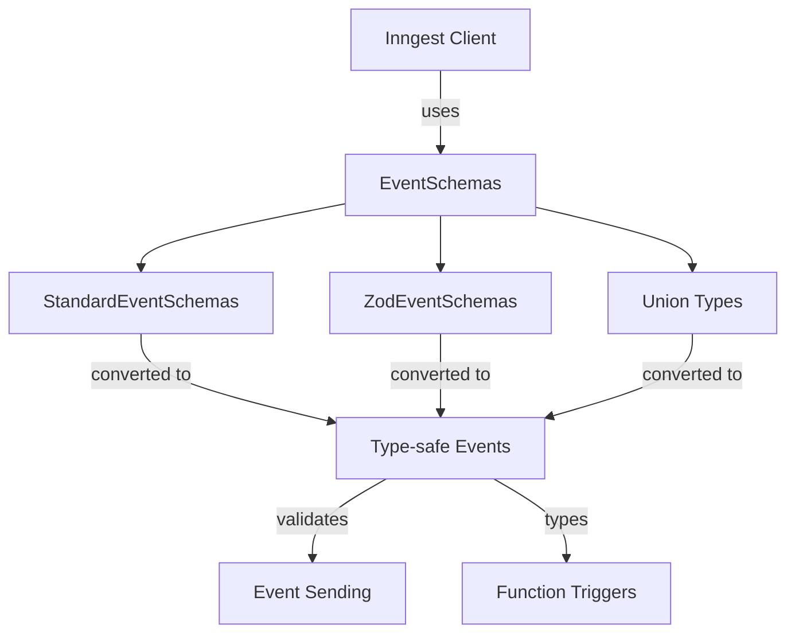

### Schema Definition Methods

The `EventSchemas` class provides several methods to define event schemas:

1. **Using Records**:
   ```typescript
   new EventSchemas().fromRecord<{
     "user/created": {
       data: { id: string; email: string }
     }
   }>()
   ```

2. **Using Zod**:
   ```typescript
   new EventSchemas().fromZod({
     "user/created": {
       data: z.object({
         id: z.string(),
         email: z.string().email()
       })
     }
   })
   ```

3. **Using Unions**:
   ```typescript
   type UserEvents = 
     | { name: "user/created"; data: { id: string } }
     | { name: "user/deleted"; data: { id: string } };
   
   new EventSchemas().fromUnion<UserEvents>()
   ```

4. **Using Generated Types**:
   ```typescript
   new EventSchemas().fromGenerated<GeneratedTypes>()
   ```

Sources: [packages/inngest/src/components/EventSchemas.ts:256-401](packages/inngest/src/components/EventSchemas.ts:256-401), [packages/inngest/src/components/EventSchemas.test.ts:67-366](packages/inngest/src/components/EventSchemas.test.ts:67-366)

## Sending Events

The Inngest client's `send` method is the primary way to send events to Inngest.

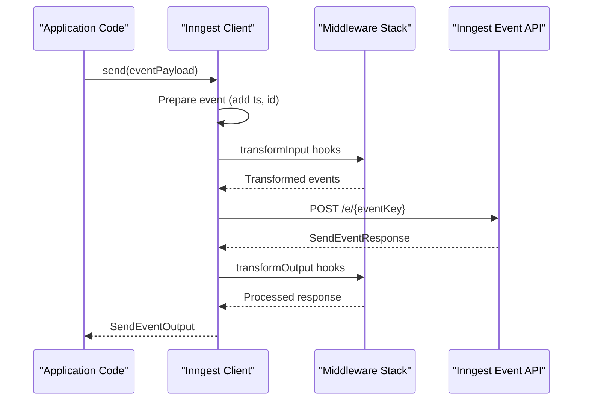

### Event Sending Process

When sending events:

1. The client prepares the event payload:
   - Adds timestamp (`ts`) if not provided
   - Ensures all events have a `data` field (empty object if none)
   - Adds seed headers for idempotency

2. Event middleware is applied, which can transform the events before sending

3. The event is sent to the Inngest API endpoint

4. The response is processed through middleware and returned to the caller

### Example Usage

```typescript
// Send a single event
await inngest.send({
  name: "user/created",
  data: { id: "123", name: "John Doe" }
});

// Send multiple events
await inngest.send([
  { name: "payment/initiated", data: { amount: 100 } },
  { name: "log/action", data: { action: "payment_attempt" } }
]);

// Send with environment targeting
await inngest.send({ name: "test/event", data: {} }, { env: "staging" });
```

Sources: [packages/inngest/src/components/Inngest.ts:441-641](packages/inngest/src/components/Inngest.ts:441-641), [packages/inngest/src/components/Inngest.test.ts:138-508](packages/inngest/src/components/Inngest.test.ts:138-508)

## Event Reception and Function Triggering

Inngest uses events to trigger function executions. When creating a function, you specify which events should trigger it through the function configuration.

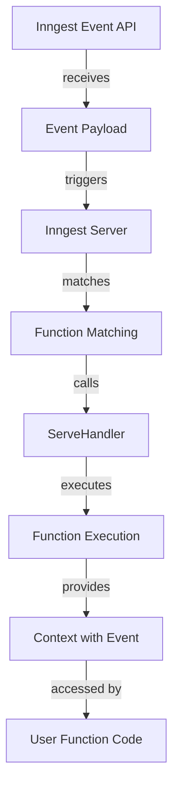

### Function Triggering Configuration

When defining an Inngest function, you specify which events should trigger it:

```typescript
inngest.createFunction(
  { id: "welcome-new-user" },
  { event: "user/created" },  // Event trigger
  async ({ event, step }) => {
    // event.name === "user/created"
    // event.data contains the event payload
  }
);
```

Multiple event triggers can be specified:

```typescript
inngest.createFunction(
  { id: "process-user-changes" },
  [
    { event: "user/created" },
    { event: "user/updated" }
  ],
  async ({ event, events }) => {
    // event is the primary triggering event
    // events contains all matched events
  }
);
```

### Event Context in Functions

Inside a function handler, event data is available through the `event` property of the context object:

```typescript
inngest.createFunction(
  { id: "my-function" },
  { event: "app/event" },
  async ({ event, step }) => {
    // Access event data
    console.log(event.name);    // "app/event"
    console.log(event.data);    // The event payload
    console.log(event.user);    // User data if present
    console.log(event.ts);      // Timestamp
  }
);
```

For functions triggered by multiple events, all matching events are available in the `events` array. The `event` property contains the primary triggering event.

Sources: [packages/inngest/src/types.ts:386-410](packages/inngest/src/types.ts:386-410), [packages/inngest/src/components/InngestCommHandler.ts:850-862](packages/inngest/src/components/InngestCommHandler.ts:850-862)

## Event Validation

Events are validated both at compile-time (when using TypeScript) and at runtime to ensure they meet the expected structure.

### Compile-Time Validation

When using TypeScript and `EventSchemas`, the compiler will check that events match the defined schemas:

```typescript
const inngest = new Inngest({
  id: "my-app",
  schemas: new EventSchemas().fromRecord<{
    "user/created": {
      data: { id: string; name: string }
    }
  }>()
});

// This will type-check
await inngest.send({
  name: "user/created",
  data: { id: "123", name: "John" }
});

// This will cause a TypeScript error due to missing name field
await inngest.send({
  name: "user/created",
  data: { id: "123" }
});
```

### Runtime Validation

When sending events, the SDK performs various runtime validations:

1. Ensures mandatory fields like `name` are present
2. Adds default values for optional fields when missing
3. Formats the event for transmission to the Inngest API

If validation fails, an error is thrown with a descriptive message.

Sources: [packages/inngest/src/components/Inngest.ts:465-538](packages/inngest/src/components/Inngest.ts:465-538), [packages/inngest/src/types.ts:543-584](packages/inngest/src/types.ts:543-584)

## Event Middleware

Middleware provides a way to transform events before they are sent or process responses after events are sent. This is useful for adding common fields, performing validation, or handling errors.

### Built-in Middleware

Inngest includes built-in middleware like the logger middleware, which adds a logger to the function context and records function execution details.

### Custom Event Middleware

You can create custom middleware to transform events:

```typescript
const middleware = new InngestMiddleware({
  name: "Add Timestamp",
  init() {
    return {
      onSendEvent() {
        return {
          transformInput({ payloads }) {
            // Add a custom field to all outgoing events
            return {
              payloads: payloads.map(event => ({
                ...event,
                data: {
                  ...event.data,
                  processedAt: new Date().toISOString()
                }
              }))
            };
          }
        };
      }
    };
  }
});

const inngest = new Inngest({
  id: "my-app",
  middleware: [middleware]
});
```

The middleware hooks relevant to event handling include:

- `onSendEvent().transformInput()`: Transform events before they're sent
- `onSendEvent().transformOutput()`: Transform the response after sending events
- `onFunctionRun().transformInput()`: Modify the event context before function execution

Sources: [packages/inngest/src/components/Inngest.ts:737-797](packages/inngest/src/components/Inngest.ts:737-797), [packages/inngest/src/middleware/dependencyInjection.ts:1-32](packages/inngest/src/middleware/dependencyInjection.ts:1-32)

## Event Error Handling

Errors encountered during event sending are handled in several ways:

1. **Network Failures**: The SDK will automatically retry sending events with exponential backoff
2. **Validation Errors**: Detailed error messages help identify issues with event payloads
3. **Server Errors**: HTTP status codes and error messages from the Inngest API are propagated

### Error Serialization

When errors occur within functions, they are serialized to ensure they can be properly transmitted and displayed:

```typescript
try {
  // Function code
} catch (err) {
  // Error is serialized using serializeError()
  // This preserves error name, message, stack, and cause chain
}
```

The serialized errors maintain their structure, including the error cause chain, allowing for better debugging and error handling.

Sources: [packages/inngest/src/helpers/errors.ts:53-163](packages/inngest/src/helpers/errors.ts:53-163), [packages/inngest/src/components/Inngest.ts:342-386](packages/inngest/src/components/Inngest.ts:342-386)

## Internal Events System

Inngest uses a set of internal events to manage function lifecycle and provide visibility into function execution.

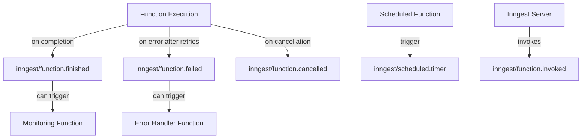

### System Event Types

Internal events have specialized payloads:

| Event | Purpose | Payload |
|-------|---------|---------|
| `inngest/function.failed` | Indicates function failure after retries | `function_id`, `run_id`, `error`, `event` |
| `inngest/function.finished` | Signals function completion | `function_id`, `run_id`, `correlation_id`, `result` or `error` |  
| `inngest/function.cancelled` | Indicates function cancellation | `function_id`, `run_id`, `correlation_id` |
| `inngest/scheduled.timer` | Triggers scheduled functions | `cron` |
| `inngest/function.invoked` | Indicates function invocation | Depends on the triggering event |

### Using System Events

You can create functions that react to these internal events, for example:

```typescript
// Handle function failures
inngest.createFunction(
  { id: "handle-failures" },
  { event: "inngest/function.failed" },
  async ({ event }) => {
    const { function_id, error, run_id } = event.data;
    // Alert, log, or take recovery actions
  }
);
```

Sources: [packages/inngest/src/helpers/consts.ts:157-167](packages/inngest/src/helpers/consts.ts:157-167), [packages/inngest/src/types.ts:84-144](packages/inngest/src/types.ts:84-144)

## Development Mode Event Handling

When running in development mode, the Inngest SDK can route events to a local development server instead of the Inngest cloud platform.

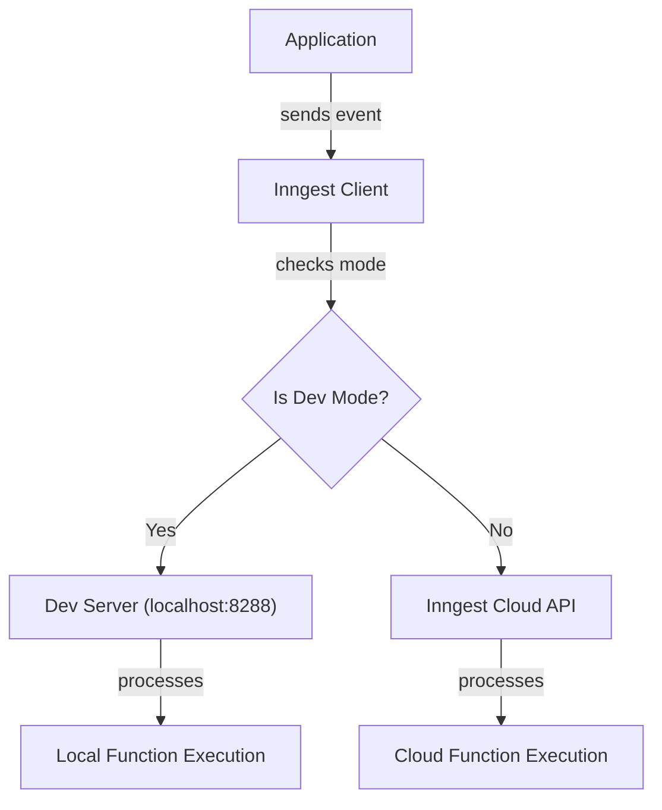

Development mode can be enabled through:

1. Setting `isDev: true` in the Inngest client options
2. Setting the `INNGEST_DEV=1` environment variable
3. Setting `INNGEST_DEV=http://localhost:8288` to specify a custom dev server URL

The SDK will automatically detect the dev server if available and route events accordingly.

Sources: [packages/inngest/src/components/Inngest.ts:597-604](packages/inngest/src/components/Inngest.ts:597-604), [packages/inngest/src/helpers/env.ts:197-235](packages/inngest/src/helpers/env.ts:197-235)

## Environment-specific Event Targeting

Events can be targeted to specific environments using the `env` option:

```typescript
// Send to the default environment
await inngest.send({ name: "event", data: {} });

// Send to the "staging" environment
await inngest.send({ name: "event", data: {} }, { env: "staging" });
```

The environment can be specified through several mechanisms (in order of precedence):

1. The `env` option in the `send()` method call
2. The `env` option in the Inngest client constructor
3. The `INNGEST_ENV` environment variable
4. Platform-specific environment variables (Vercel, Netlify, etc.)

Sources: [packages/inngest/src/helpers/env.ts:244-258](packages/inngest/src/helpers/env.ts:244-258), [packages/inngest/src/components/Inngest.ts:299-327](packages/inngest/src/components/Inngest.ts:299-327)

## Conclusion

Event handling is fundamental to the Inngest system. The SDK provides a robust and type-safe mechanism for defining, sending, and processing events. The event schema system ensures consistency, while middleware allows for flexible transformations and extensions of the event pipeline.

Understanding these event handling concepts is essential for building reliable and maintainable event-driven applications with Inngest.

# Framework Integrations


This document covers Inngest's framework integration adapters, which enable Inngest functions to be served and registered within various JavaScript frameworks. These adapters provide framework-specific handling of HTTP requests and responses, allowing your Inngest functions to be triggered by events regardless of the environment they run in.

## Overview of Framework Adapters

Inngest framework adapters translate between your chosen framework's HTTP request/response patterns and Inngest's internal communication requirements. Each adapter is designed to feel native to the framework it supports while providing consistent functionality across all environments.

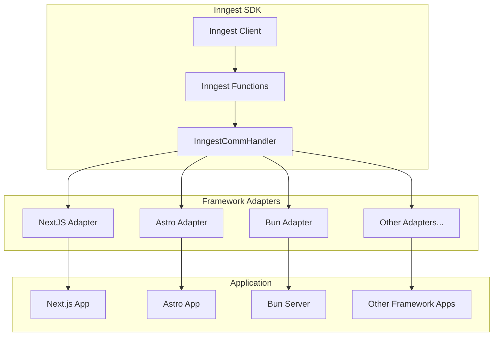

Sources: [packages/inngest/src/next.ts](), [packages/inngest/src/astro.ts](), [packages/inngest/src/bun.ts]()

## Common Adapter Architecture

All framework adapters share a common underlying architecture, which uses the `InngestCommHandler` component to handle the communication between the Inngest service and your application. The adapters differ primarily in how they:

1. Parse incoming requests
2. Extract headers, body, and URL information
3. Format responses according to the framework's expectations

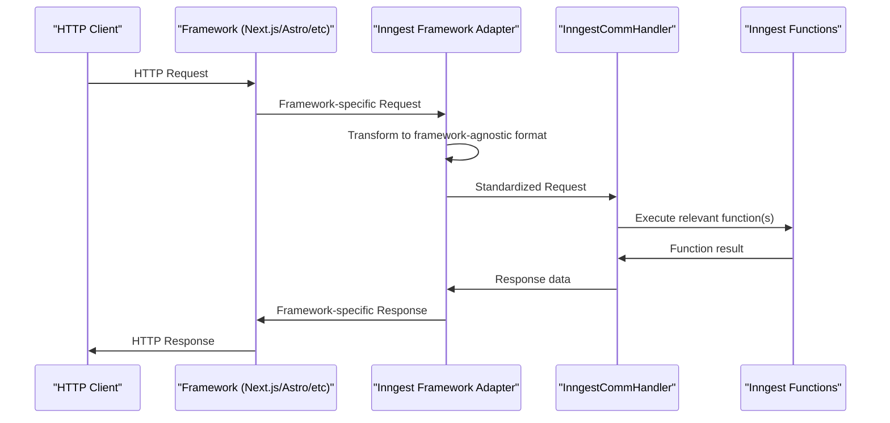

Sources: [packages/inngest/src/next.ts:102-253](), [packages/inngest/src/astro.ts:50-65](), [packages/inngest/src/bun.ts:66-74]()

## Framework-Specific Adapters

### Next.js Integration

The Next.js adapter supports Next.js versions 12 and above, in both serverless and edge runtime environments. It handles the differences between the Pages Router and App Router patterns.

#### Usage Patterns

For Next.js 12 or the Pages Router:

```javascript
// pages/api/inngest.js
export default serve({ client: inngest, functions: [fn1, fn2] });
```

For Next.js 13+ with the App Router:

```javascript
// app/api/inngest/route.js
export const { GET, POST, PUT } = serve({
  client: inngest,
  functions: [fn1, fn2],
});
```

#### Implementation Details

The Next.js adapter:
- Detects the Next.js environment (serverless vs. edge)
- Handles different response patterns based on the environment
- Manages URL detection and header extraction
- Supports backwards compatibility with Next.js 12 while working with newer versions

Sources: [packages/inngest/src/next.ts:94-299]()

### Astro Integration

The Astro adapter provides a simple way to integrate Inngest functions into Astro applications.

#### Usage Pattern

```javascript
// src/pages/api/inngest.js
export const { GET, POST, PUT } = serve({
  client: inngest,
  functions: [fn1, fn2],
});
```

#### Implementation Details

The Astro adapter provides a streamlined implementation that leverages Astro's native handling of Request and Response objects, making it simpler than the Next.js adapter.

Sources: [packages/inngest/src/astro.ts:42-79]()

### Bun Integration

The Bun adapter enables integration with Bun's HTTP server.

#### Usage Pattern

```javascript
// server.ts
import { serve } from "inngest/bun";
import { functions, inngest } from "./inngest";

Bun.serve({
  port: 3000,
  fetch(request: Request) {
    const url = new URL(request.url);

    if (url.pathname === "/api/inngest") {
      return serve({ client: inngest, functions })(request);
    }

    return new Response("Not found", { status: 404 });
  },
});
```

#### Implementation Details

The Bun adapter actually uses the edge adapter internally, providing a thin wrapper that sets the framework name to "bun" for analytics and debugging purposes.

Sources: [packages/inngest/src/bun.ts:65-75]()

## Common Integration Patterns

Across all framework adapters, you'll notice these common patterns:

1. **The `serve` function**: All adapters export a `serve` function that takes options including:
   - `client`: Your Inngest client instance
   - `functions`: An array of Inngest functions to register
   - Optional configuration (like `serveHost`)

2. **HTTP Method Handling**: All adapters support GET, POST, and PUT methods which are required for:
   - GET: Function registration and health checks
   - POST: Event reception and function execution
   - PUT: Long-running function continuation

3. **Framework Name Identification**: Each adapter sets a `frameworkName` constant that identifies the framework for analytics and debugging.

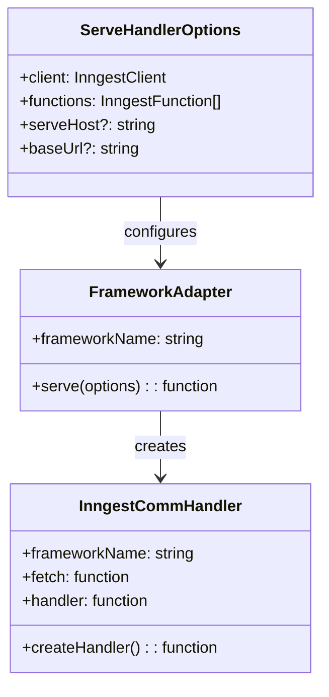

Sources: [packages/inngest/src/next.ts:37-299](), [packages/inngest/src/astro.ts:26-79](), [packages/inngest/src/bun.ts:38-75]()

## Request Processing

Each adapter transforms framework-specific request objects into a standardized format for the InngestCommHandler. This transformation extracts:

1. Request body (for receiving events)
2. Headers (for authentication and metadata)
3. HTTP method (GET/POST/PUT)
4. URL and query parameters

After processing by the InngestCommHandler, the response is transformed back into the framework-specific format before being returned to the client.

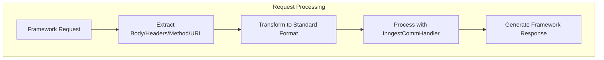

Sources: [packages/inngest/src/next.ts:105-251](), [packages/inngest/src/astro.ts:54-64]()

## Conclusion

Framework adapters are a critical part of the Inngest SDK, enabling seamless integration with various JavaScript frameworks. They abstract away the complexity of different HTTP handling patterns across frameworks, providing a consistent experience for developers using Inngest.

When implementing Inngest in your application, choose the appropriate adapter for your framework and follow the usage pattern shown above. The adapter will handle the communication details, allowing you to focus on writing your business logic in Inngest functions.

# Worker Connection


The Worker Connection system provides a persistent communication channel between client applications and the Inngest Gateway. It enables serverless function execution by establishing a WebSocket connection that allows registering functions, receiving execution requests, and returning results. This document explains the architecture, protocol, and lifecycle of the worker connection system.

## Purpose and Scope

This document covers:
- How the Worker Connection system establishes and maintains connections
- The communication protocol between workers and the Inngest Gateway
- Connection lifecycle and state management
- Execution request handling and response processing
- Error handling and reconnection strategies

For information about function execution that happens over this connection, see [Function Execution](#2.2).

## System Overview

The Worker Connection system creates a persistent WebSocket connection between client applications and the Inngest Gateway, enabling real-time communication for function execution. It provides reliability through automatic reconnection, message buffering, and proper connection lifecycle management.

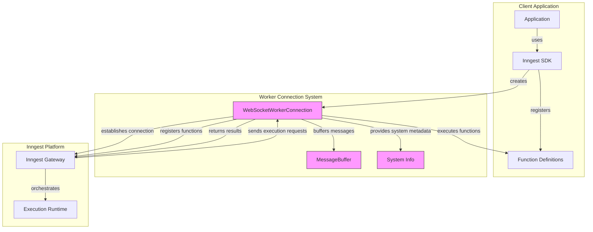

Sources: [packages/inngest/src/components/connect/index.ts:87-1184](), [packages/inngest/src/components/connect/buffer.ts:10-104](), [packages/inngest/src/components/connect/os.ts:1-141]()

## Connection Lifecycle

The Worker Connection follows a well-defined state machine that represents its lifecycle stages.

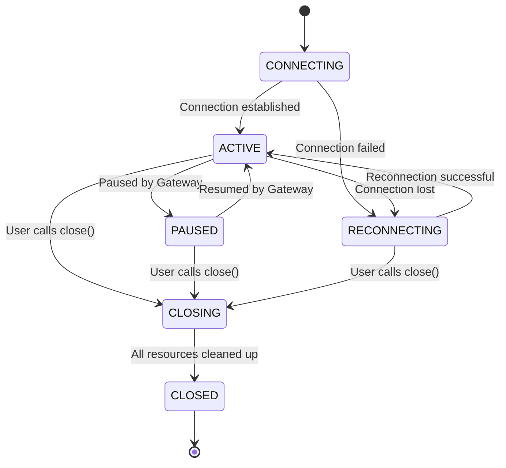

Sources: [packages/inngest/src/components/connect/types.ts:41-48](), [packages/inngest/src/components/connect/index.ts:95-255]()

### Connection States

The connection can be in one of the following states:

| State | Description |
|-------|-------------|
| CONNECTING | Initial state when establishing a connection |
| ACTIVE | Connection is established and functioning normally |
| PAUSED | Connection is temporarily paused |
| RECONNECTING | Connection was lost and is being re-established |
| CLOSING | Connection is being gracefully closed |
| CLOSED | Connection is fully closed and all resources are released |

Sources: [packages/inngest/src/components/connect/types.ts:41-48]()

### Connection Establishment

The connection establishment process involves several steps:

1. Initial API handshake with the Inngest Gateway
2. WebSocket connection setup
3. Authentication and function registration
4. Connection readiness confirmation

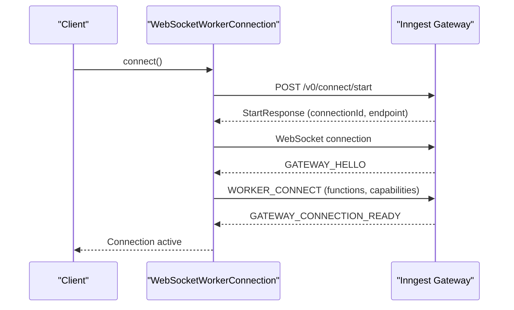

Sources: [packages/inngest/src/components/connect/index.ts:281-550](), [packages/inngest/src/components/connect/index.ts:613-848]()

## Communication Protocol

The Worker Connection system uses a binary protocol based on Protocol Buffers for communication. Messages are sent as `ConnectMessage` objects with a specific message type and binary payload.

### Message Types

The system defines various message types for different purposes:

| Message Type | Direction | Purpose |
|--------------|-----------|---------|
| GATEWAY_HELLO | Gateway → Worker | Initiates the connection |
| WORKER_CONNECT | Worker → Gateway | Registers functions and capabilities |
| GATEWAY_CONNECTION_READY | Gateway → Worker | Confirms connection is ready |
| GATEWAY_EXECUTOR_REQUEST | Gateway → Worker | Requests function execution |
| WORKER_REQUEST_ACK | Worker → Gateway | Acknowledges execution request |
| WORKER_REPLY | Worker → Gateway | Returns execution result |
| WORKER_REPLY_ACK | Gateway → Worker | Acknowledges result received |
| GATEWAY_HEARTBEAT | Gateway → Worker | Keeps connection alive |
| GATEWAY_CLOSING | Gateway → Worker | Indicates gateway is closing |
| WORKER_REQUEST_EXTEND_LEASE | Worker → Gateway | Extends execution lease |
| WORKER_REQUEST_EXTEND_LEASE_ACK | Gateway → Worker | Acknowledges lease extension |

Sources: [packages/inngest/src/components/connect/protobuf/connect.proto:8-23](), [packages/inngest/src/proto/src/components/connect/protobuf/connect.ts:13-116]()

### Function Execution Flow

When a function is triggered, the execution follows this sequence:

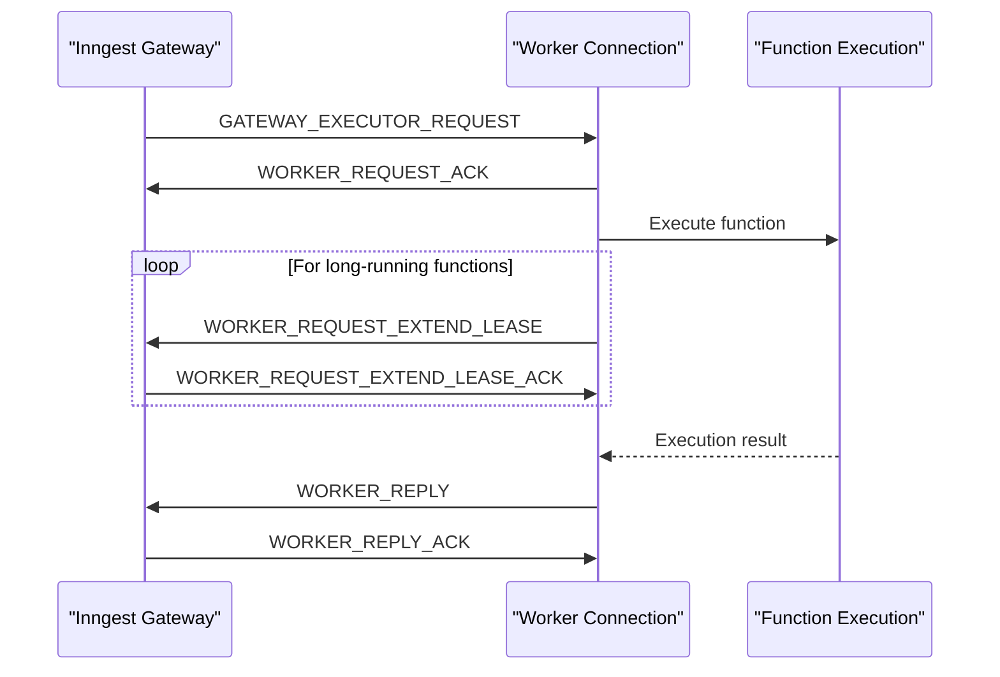

Sources: [packages/inngest/src/components/connect/index.ts:974-1132]()

## Implementation Details

### Worker Connection Class

The main implementation is in the `WebSocketWorkerConnection` class, which handles:

1. Connection establishment and maintenance
2. Function registration
3. Message processing
4. Execution request handling
5. Error recovery and reconnection

Sources: [packages/inngest/src/components/connect/index.ts:87-1184]()

### Message Buffer

The `MessageBuffer` class ensures message delivery even during connection issues by:

1. Buffering messages when the connection is down
2. Tracking pending messages awaiting acknowledgment
3. Flushing messages when the connection is re-established

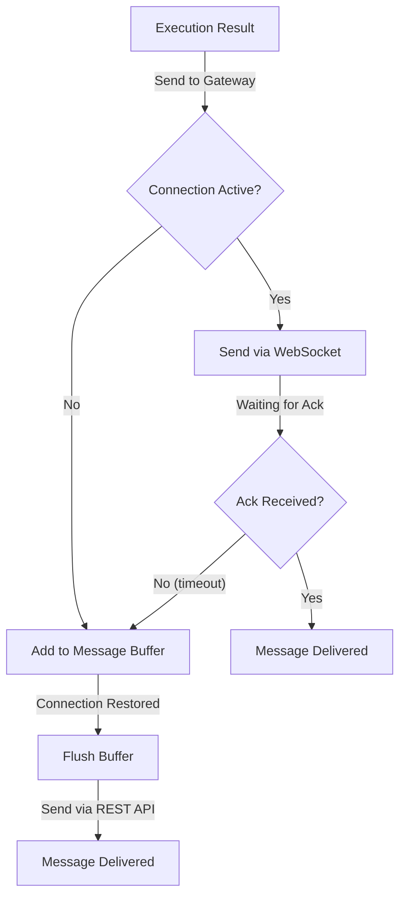

Sources: [packages/inngest/src/components/connect/buffer.ts:10-104]()

### Error Handling and Reconnection

The system handles various error scenarios:

1. Authentication failures with fallback signing key support
2. Network connectivity issues with exponential backoff reconnection
3. Gateway draining with graceful reconnection
4. Connection limits with appropriate user feedback

Sources: [packages/inngest/src/components/connect/index.ts:497-546](), [packages/inngest/src/components/connect/util.ts:3-58]()

## Usage Example

The Worker Connection is used by creating a connection with the `connect` function, providing application clients and function definitions:

```typescript
connect({
  apps: [
    {
      client: app1,
      functions: [
        app1.createFunction(
          { id: "test-function" },
          { event: "app/event" },
          async ({ step }) => {
            // Function implementation
          }
        ),
      ],
    },
  ],
  instanceId: "my-worker",
}).then(async (conn) => {
  console.log("Connected!");
  await conn.closed;
});
```

Sources: [examples/connect-example/index.ts:1-74]()

### Configuration Options

The `connect` function accepts several configuration options:

| Option | Description |
|--------|-------------|
| apps | Array of client instances and their functions |
| instanceId | Stable identifier for the worker (defaults to hostname) |
| signingKey | Authentication key for the Inngest Gateway |
| signingKeyFallback | Fallback authentication key |
| handleShutdownSignals | Signals to handle for graceful shutdown (defaults to SIGINT, SIGTERM) |
| rewriteGatewayEndpoint | Function to rewrite gateway endpoint URLs |

Sources: [packages/inngest/src/components/connect/types.ts:12-32]()

## Cross-Platform Support

The worker connection system includes adaptations for different JavaScript environments:

| Environment | Support |
|-------------|---------|
| Node.js | Full support with system information |
| Deno | Full support with system information |
| Browsers | Basic support with limited system information |
| Bun | Full support with system information |

Sources: [packages/inngest/src/components/connect/os.ts:1-141]()

## System Architecture

The following diagram shows how the Worker Connection fits into the larger Inngest system architecture:

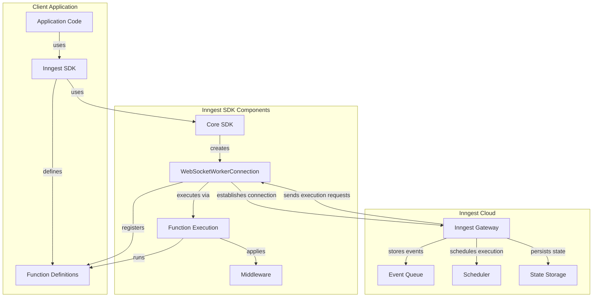

Sources: [packages/inngest/src/components/connect/index.ts:1-1184]()