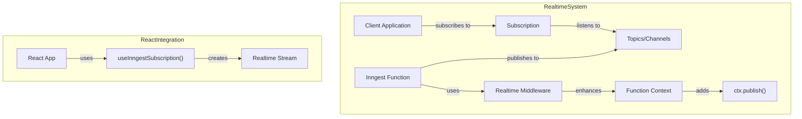
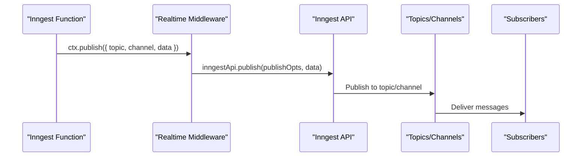
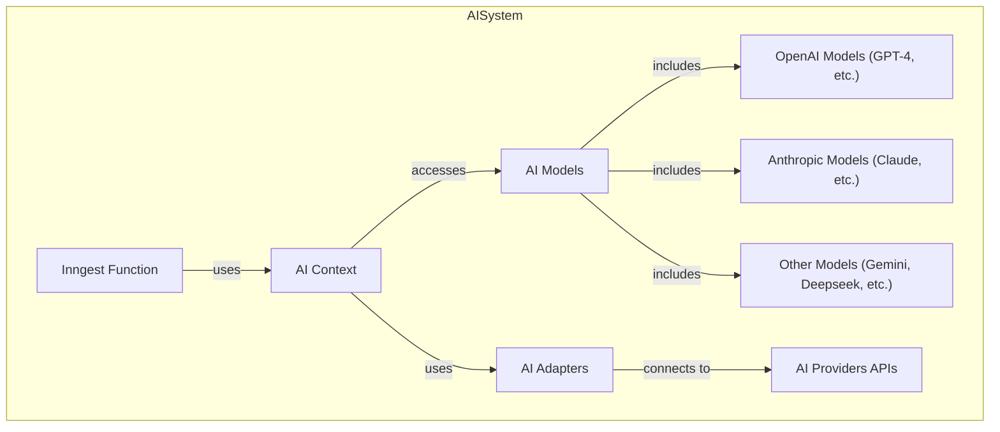
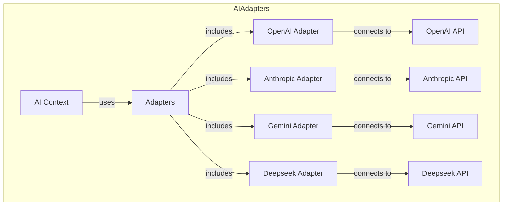
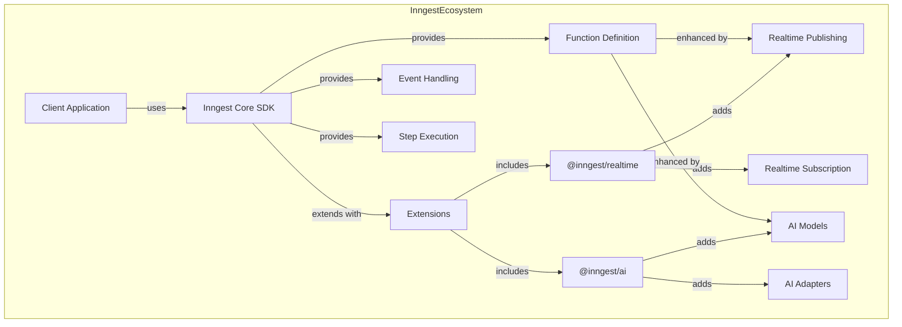

Extensions in the Inngest ecosystem provide additional specialized functionality beyond the core SDK. These modular packages can be integrated with your Inngest implementation to enhance its capabilities in specific domains.

## Overview of Available Extensions

Inngest currently offers two main extensions:

1. **Realtime** (`@inngest/realtime`): Enables realtime publish/subscribe capabilities for sending and receiving updates
2. **AI** (`@inngest/ai`): Provides AI model integrations and adapters for working with various AI providers

These extensions are designed to integrate seamlessly with the Core SDK ([Core SDK](#2)) while providing specialized functionality for specific use cases.

## Realtime Extension

The Realtime extension (`@inngest/realtime`) adds publish/subscribe functionality to Inngest, allowing you to send realtime updates from your functions and subscribe to these updates from your applications.

### Architecture



Sources: packages/realtime/package.json, packages/realtime/src/middleware.ts

### Publishing Messages

The Realtime extension provides a middleware that adds a `publish` function to the Inngest function context. This allows you to publish messages to topics/channels directly from your Inngest functions.



Sources: packages/realtime/src/middleware.ts

The middleware implementation in [packages/realtime/src/middleware.ts:6-68]() adds the `publish` function to the function context, which allows any Inngest function to publish messages to topics/channels.

### Subscribing to Messages

On the client side, you can subscribe to topics/channels to receive realtime updates. The Realtime extension provides both a direct API and React hooks for this purpose.

For React applications, the `useInngestSubscription()` hook simplifies the subscription process:

```typescript
// In a React component
import { useInngestSubscription } from "@inngest/realtime/hooks";

function Dashboard({ token, userId }) {
  const { data, status } = useInngestSubscription({
    token,
    channel: "user-dashboard",
    topics: ["updates"],
  });
  
  // Render dashboard with realtime updates...
}
```

Sources: packages/realtime/package.json, packages/realtime/CHANGELOG.md

### Stream Handling

The Realtime extension provides methods for handling streams of data:

| Method | Description |
|--------|-------------|
| `getJsonStream()` | Returns a stream of parsed JSON objects |
| `getEncodedStream()` | Returns a stream encoded for use in HTTP responses |

These methods help you work with realtime data in different contexts, such as server-side applications or web APIs.

Sources: packages/realtime/CHANGELOG.md

## AI Extension

The AI extension (`@inngest/ai`) integrates various AI models and providers with Inngest, enabling you to use AI capabilities within your Inngest functions.

### Architecture



Sources: packages/ai/package.json, packages/ai/CHANGELOG.md

### Supported Models

The AI extension supports various AI models from different providers:

| Provider | Models |
|----------|--------|
| **OpenAI** | GPT-4, GPT-4-mini, GPT-4.1, GPT-4.1-mini, GPT-3.5-turbo, GPT-4.5-preview |
| **Anthropic** | Claude, Claude Instant |
| **Google** | Gemini |
| **Other** | Deepseek, Grok (via OpenAI-compatible API) |

Sources: packages/ai/CHANGELOG.md

### AI Adapters

The AI extension provides adapters for different AI providers, allowing you to use their models with a consistent interface:



Sources: packages/ai/package.json, packages/ai/CHANGELOG.md

### Key Features

The AI extension provides several important capabilities:

1. **Comprehensive Model Support**: Support for models from OpenAI, Anthropic, Google, etc.
2. **Type-Safe Interfaces**: Fully typed interfaces for working with AI models
3. **Default Parameters**: Ability to set default parameters for models
4. **Document Processing**: Support for document parsing capabilities (e.g., PDF parsing with Anthropic Claude)
5. **Error Handling**: Typed error outputs for better error management

Sources: packages/ai/CHANGELOG.md

## Integration with Core SDK

Both extensions integrate seamlessly with the Inngest Core SDK:



Sources: packages/realtime/package.json, packages/ai/package.json

## Usage Examples

### Using the Realtime Extension

To publish messages from an Inngest function:

```typescript
// In your Inngest function
export const myFunction = inngest.createFunction(
  { id: "my-function" },
  { event: "app/event" },
  async ({ event, step, ctx }) => {
    // Process event...
    
    // Publish an update
    await ctx.publish({
      topic: "updates",
      channel: "user-dashboard",
      data: { userId: event.data.userId, status: "completed" }
    });
    
    return { success: true };
  }
);
```

Sources: packages/realtime/src/middleware.ts

### Using the AI Extension

To use AI models in an Inngest function:

```typescript
// In your Inngest function
export const generateContent = inngest.createFunction(
  { id: "generate-content" },
  { event: "content/requested" },
  async ({ event, step, ctx }) => {
    const response = await step.ai.streamingChatCompletions({
      model: "gpt-4",
      messages: [
        { role: "system", content: "You are a helpful assistant." },
        { role: "user", content: event.data.prompt }
      ]
    });
    
    return { 
      content: response.choices[0].message.content,
      usage: response.usage
    };
  }
);
```

Sources: packages/ai/package.json, packages/ai/CHANGELOG.md

## Package Information

The extensions are published as separate NPM packages:

| Extension | Package | Version |
|-----------|---------|---------|
| Realtime | @inngest/realtime | 0.3.1 |
| AI | @inngest/ai | 0.1.4 |

Each package includes specific exports for its functionality:

- **@inngest/realtime**: Main functionality and React hooks
- **@inngest/ai**: Main functionality, models, and adapters

Sources: packages/realtime/package.json, packages/ai/package.json, packages/realtime/jsr.json, packages/ai/jsr.json

## Conclusion

Inngest Extensions provide powerful specialized capabilities beyond the core SDK. The Realtime extension enables building interactive, realtime applications while the AI extension facilitates integration with modern AI services. Both extensions are designed with type safety and developer experience in mind, making it easy to add these advanced features to your Inngest-powered applications.

For more detailed information about specific extension capabilities, refer to the AI Integration ([AI Integration](#4.1)) and Realtime System ([Realtime System](#4.2)) documentation.