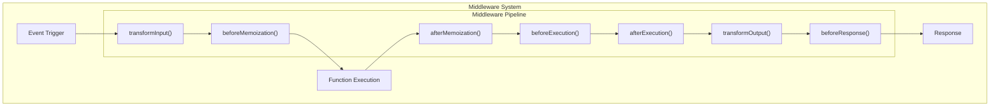
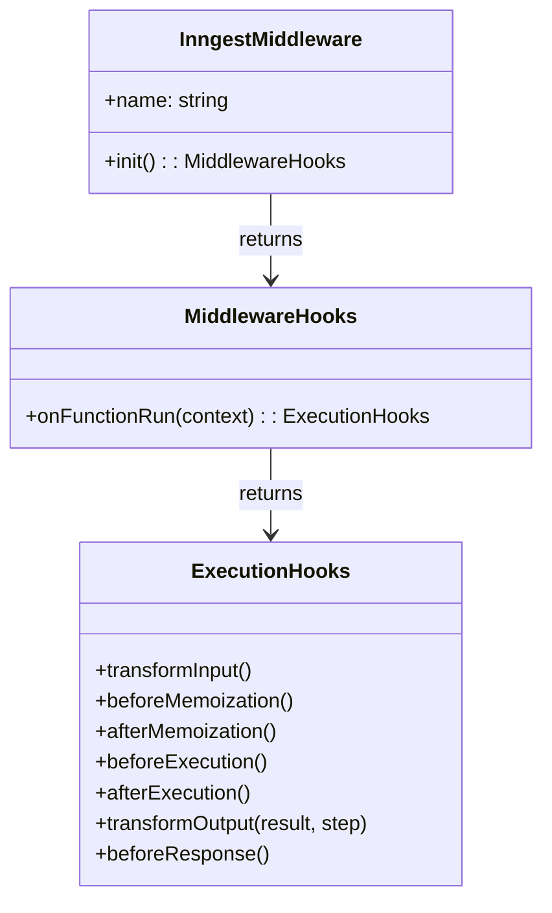
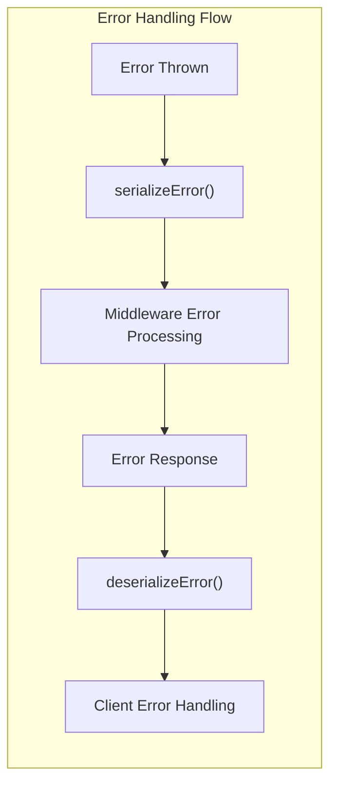
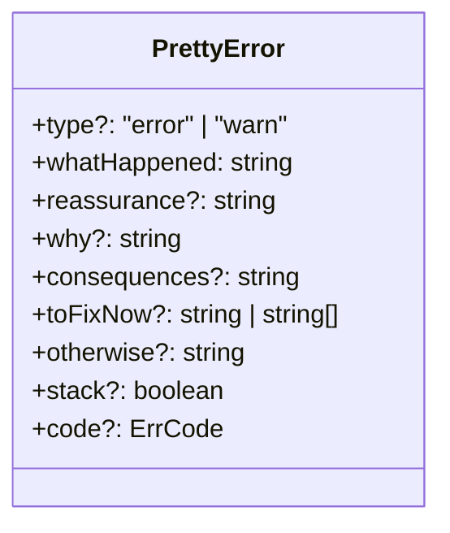
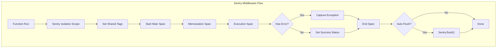
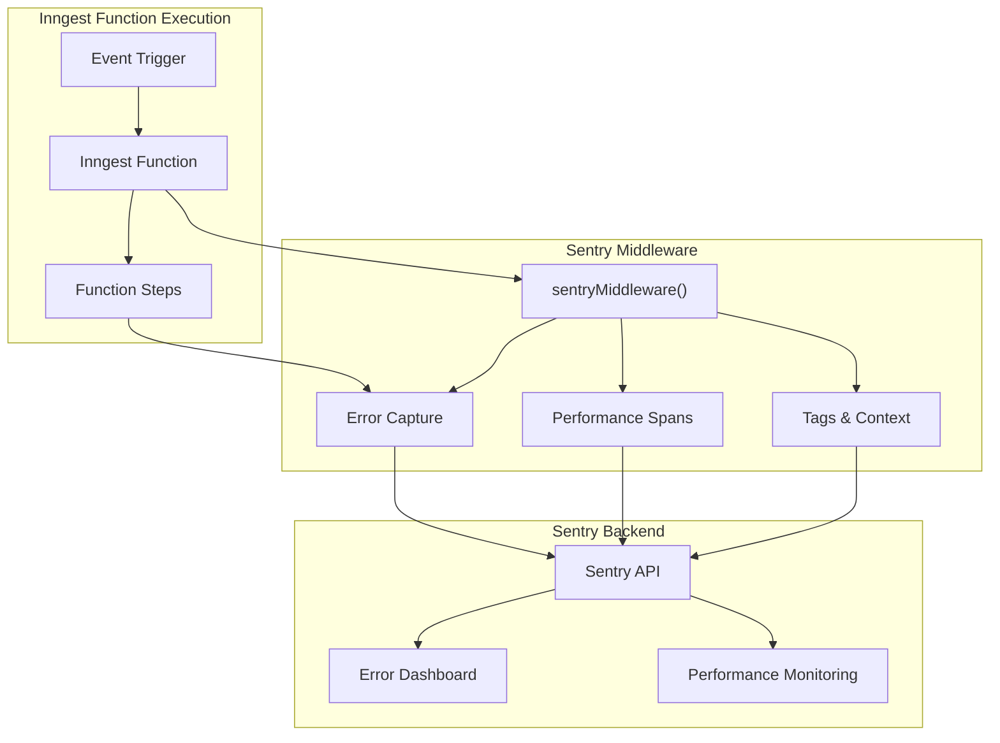

This document provides a comprehensive overview of the middleware system and error handling capabilities in the Inngest JavaScript SDK. These components are essential for extending functionality, customizing the execution flow, and properly managing errors within Inngest functions.

For specific information about the Sentry integration middleware, see [Sentry Integration](#5.1).

## 1. Middleware System Overview

Inngest's middleware architecture allows developers to extend and customize the behavior of function executions. Middleware can intercept and modify inputs and outputs, inject dependencies, perform logging, error handling, and more.



Sources: [packages/inngest/src/middleware/dependencyInjection.ts](), [packages/middleware-sentry/src/middleware.ts]()

### 1.1 Creating Middleware

Middleware in Inngest is created using the `InngestMiddleware` class. Each middleware implements one or more lifecycle hooks that get called during function execution.



Sources: [packages/inngest/src/middleware/dependencyInjection.ts](), [packages/middleware-sentry/src/middleware.ts]()

### 1.2 Middleware Lifecycle Hooks

Middleware can implement the following hooks:

| Hook | Description | Typical Use Cases |
| ---- | ----------- | ----------------- |
| `transformInput` | Modify input before function execution | Dependency injection, input validation |
| `beforeMemoization` | Runs before step memoization | Performance tracking, logging |
| `afterMemoization` | Runs after step memoization | Performance tracking, logging |
| `beforeExecution` | Runs before function execution | Performance tracking, setup |
| `afterExecution` | Runs after function execution | Performance tracking, cleanup |
| `transformOutput` | Modify step output | Error handling, output formatting |
| `beforeResponse` | Runs before sending response | Cleanup, finalization |

Sources: [packages/middleware-sentry/src/middleware.ts]()

### 1.3 Example: Dependency Injection Middleware

The SDK includes a built-in dependency injection middleware that allows adding properties to the function context:

```typescript
dependencyInjectionMiddleware({
  db: databaseConnection,
  logger: customLogger,
})
```

This middleware transforms the input by adding the provided context to the function's `ctx` parameter.

Sources: [packages/inngest/src/middleware/dependencyInjection.ts]()

## 2. Error Handling

Inngest provides robust error handling capabilities that include error serialization, deserialization, formatting, and special error types.



Sources: [packages/inngest/src/helpers/errors.ts]()

### 2.1 Error Serialization and Deserialization

Errors in JavaScript don't serialize well to JSON by default. Inngest provides utilities to properly serialize and deserialize errors:

| Function | Purpose |
| -------- | ------- |
| `serializeError` | Converts an error to a serializable format with preserved properties |
| `deserializeError` | Converts a serialized error back to a proper Error instance |
| `isSerializedError` | Checks if an object is a serialized error |

These functions handle preserving error names, messages, stack traces, and even causes for nested errors.

Sources: [packages/inngest/src/helpers/errors.ts:53-263]()

### 2.2 Pretty Error Formatting

Inngest includes a `prettyError` utility that creates consistent, user-friendly error messages:



The `prettyError` function formats these properties into a well-structured error message that provides clear guidance on what happened and how to fix it.

Sources: [packages/inngest/src/helpers/errors.ts:295-504]()

### 2.3 Special Error Types

Inngest includes special error types for specific scenarios:

| Error Type | Purpose |
| ---------- | ------- |
| `NonRetriableError` | Indicates an error that should not be retried |
| `OutgoingResultError` | Internal error used for outgoing operations with errors |

Sources: [packages/inngest/src/helpers/errors.ts:12-530]()

### 2.4 Error Codes

Inngest defines error codes for specific error scenarios:

```typescript
export enum ErrCode {
  NESTING_STEPS = "NESTING_STEPS",
  NON_DETERMINISTIC_FUNCTION = "NON_DETERMINISTIC_FUNCTION",
  ASYNC_DETECTED_AFTER_MEMOIZATION = "ASYNC_DETECTED_AFTER_MEMOIZATION",
  STEP_USED_AFTER_ASYNC = "STEP_USED_AFTER_ASYNC",
  AUTOMATIC_PARALLEL_INDEXING = "AUTOMATIC_PARALLEL_INDEXING",
}
```

These codes help identify and handle specific types of errors consistently.

Sources: [packages/inngest/src/helpers/errors.ts:265-293]()

## 3. Sentry Middleware

The `@inngest/middleware-sentry` package provides integration with Sentry for error reporting and performance monitoring of Inngest functions.



Sources: [packages/middleware-sentry/src/middleware.ts]()

### 3.1 Sentry Middleware Configuration

The Sentry middleware can be configured with options:

```typescript
sentryMiddleware({
  disableAutomaticFlush: false // Default is false
})
```

By default, the middleware automatically flushes events to Sentry after each function run, which is important in serverless environments.

Sources: [packages/middleware-sentry/src/middleware.ts:12-25](), [packages/middleware-sentry/src/middleware.ts:64-69]()

### 3.2 Monitoring and Reporting

The Sentry middleware provides:

1. Performance monitoring via spans for the overall function run, memoization, and execution
2. Error tracking that captures exceptions and related context
3. Rich context via tags and transaction naming 
4. Access to Sentry API via the middleware context (`ctx.sentry`)

Monitored information includes:
- Function ID and name
- Event ID and name 
- Run ID
- Step names and operations
- Error details

Sources: [packages/middleware-sentry/src/middleware.ts:75-188]()

## 4. Best Practices

### 4.1 Using Middleware

1. **Register middleware when creating the Inngest client:**
   ```typescript
   const inngest = new Inngest({
     id: "my-app",
     middleware: [
       dependencyInjectionMiddleware({ logger, db }),
       sentryMiddleware(),
       // other middleware
     ]
   });
   ```

2. **Keep middleware focused:**
   Each middleware should have a clear responsibility rather than trying to do too much.

3. **Order matters:**
   Middleware executes in the order defined, so consider dependencies between middleware.

Sources: [packages/inngest/src/middleware/dependencyInjection.test.ts]()

### 4.2 Error Handling Best Practices

1. **Use NonRetriableError for failures that shouldn't be retried:**
   ```typescript
   throw new NonRetriableError("This error should not be retried");
   ```

2. **Use prettyError for user-friendly error messages:**
   ```typescript
   throw new Error(prettyError({
     whatHappened: "Database connection failed",
     why: "The database credentials may be incorrect",
     toFixNow: "Check your environment variables",
   }));
   ```

3. **Handle and log errors in your functions:**
   ```typescript
   try {
     // function logic
   } catch (err) {
     // Log error or use middleware context
     return { error: err };
   }
   ```

Sources: [packages/inngest/src/helpers/errors.ts]()

## 5. Building Custom Middleware

To create custom middleware:

1. Use the `InngestMiddleware` class
2. Define the appropriate lifecycle hooks
3. Return the transformed data or perform side effects

Example pattern:

```typescript
const myMiddleware = (options) => {
  return new InngestMiddleware({
    name: "my-middleware",
    init({ client }) {
      return {
        onFunctionRun({ ctx, fn }) {
          return {
            transformInput() {
              // Modify input
              return { ctx: { myCustomProp: "value" } };
            },
            transformOutput({ result }) {
              // Handle errors or modify output
              if (result.error) {
                // Do something with the error
              }
              return { data: result.data };
            }
          };
        }
      };
    }
  });
};
```

Sources: [packages/middleware-sentry/src/middleware.ts](), [packages/inngest/src/middleware/dependencyInjection.ts]()

# Sentry Integration


This documentation covers the Sentry middleware for Inngest, a package that enables error and performance monitoring of your Inngest functions through Sentry. For general information about middleware in Inngest, see [Middleware and Error Handling](#5).

## Overview

The `@inngest/middleware-sentry` package provides seamless integration between Inngest functions and Sentry's error tracking and performance monitoring capabilities. This middleware automatically:

- Captures errors that occur during function execution
- Creates performance spans for measuring execution time
- Adds useful context to Sentry events such as function names, event IDs, and run IDs
- Manages the Sentry scope to ensure proper isolation between function runs



Sources: [packages/middleware-sentry/src/middleware.ts:1-196]()

## Installation

### 1. Install the package

```bash