This document provides a comprehensive introduction to the Inngest JavaScript/TypeScript SDK repository. Inngest is a reliability layer for modern applications, combining durable execution, events, and queues into a platform with built-in observability. The SDK enables developers to build serverless event-driven systems, background jobs, and scheduled tasks without additional infrastructure.

For detailed information about specific components, see the [Architecture](#1.1) and [Packages](#1.2) pages.

## What is Inngest?

Inngest provides a foundation for building reliable, event-driven applications. It allows you to write background processing logic in your existing codebase and deploy it to any serverless platform.

Key capabilities include:
- Background job processing
- Scheduled and cron jobs
- Serverless queues
- Step functions with durable execution
- Event-driven workflows
- Reliable webhook handling with retries

Sources: [packages/inngest/package.json:1-328](), [packages/inngest/README.md:1-138]()

## High-Level Architecture

```mermaid
flowchart TB
    subgraph "Application Layer"
        App["Client Application"]
        App -->|uses| SDK["Inngest SDK"]
    end
    
    subgraph "Inngest SDK Core Components"
        SDK --> Core["Core Functionality"]
        SDK --> Frameworks["Framework Adapters"]
        SDK --> Events["Event System"]
        
        Core --> Types["Type System"]
        Core --> FnExecution["Function Execution"]
        Core --> StepTools["Step Tools"]
        
        Events --> EventSend["Event Sending"]
        Events --> EventHandler["Event Handling"]
        
        Frameworks --> NextAdapter["Next.js"]
        Frameworks --> ExpressAdapter["Express"]
        Frameworks --> CloudflareAdapter["Cloudflare"]
        Frameworks --> OtherAdapters["Many Others..."]
    end
    
    subgraph "Execution Layer"
        SDK -->|connects to| InngestGateway["Inngest Gateway"]
        InngestGateway --> Connect["Worker Connection"]
        InngestGateway --> Functions["Function Orchestration"]
    end
    
    subgraph "Extensions"
        SDK --> Extensions["Extensions"]
        Extensions --> AI["AI Module"]
        Extensions --> Realtime["Realtime Module"]
    end
    
    subgraph "Middleware Layer"
        SDK -->|uses| Middleware["Middleware"]
        Middleware --> Encryption["Encryption"]
        Middleware --> Validation["Validation"]
        Middleware --> Sentry["Sentry/Error Handling"]
    end
```

The diagram above illustrates how the Inngest SDK interacts with your application and the Inngest service. The SDK provides the client interface for defining functions, sending events, and handling incoming function execution requests from the Inngest gateway.

Sources: [packages/inngest/package.json:35-156](), [packages/inngest/README.md:60-117]()

## Core Functionality

The Inngest SDK provides several key features:

1. **Function Definition**: Create functions that respond to specific events
2. **Event Handling**: Send and receive typed events
3. **Framework Integration**: Serve Inngest functions via your preferred framework
4. **Step Execution**: Run durable steps within functions
5. **Worker Connection**: Connect to the Inngest gateway for direct function invocation

### Function Definition & Execution Flow

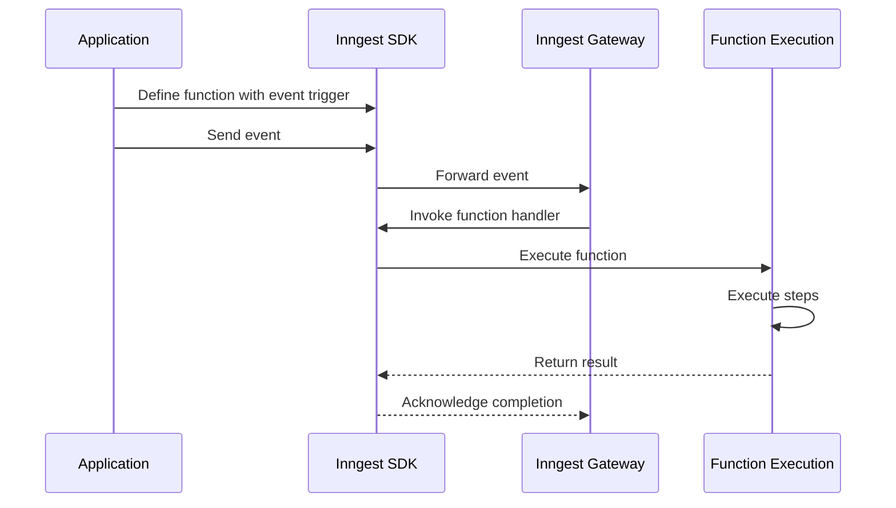

The Inngest SDK allows you to define functions that execute in response to events. When an event is sent, it triggers the relevant functions, which execute with durable steps and built-in retry logic.

Sources: [packages/inngest/README.md:62-84]()

## Using Inngest

### Installation

```
npm install inngest
```

### Creating a Client

```typescript
import { Inngest } from "inngest";

const inngest = new Inngest({ id: "my-app" });
```

### Defining a Function

```typescript
export const userOnboarding = inngest.createFunction(
  { id: "user-onboarding" },
  { event: "app/user.signup" },
  async ({ event, step }) => {
    await step.run("Send welcome email", async () => {
      // Email sending logic here
    });
    
    await step.sleep("Wait for 3 days", "3d");
    
    await step.run("Send follow-up email", async () => {
      // Follow-up email logic here
    });
  }
);
```

### Serving Functions

```typescript
// Using Next.js adapter
import { serve } from "inngest/next";
import { userOnboarding } from "./functions";

export default serve(inngest, [userOnboarding]);
```

### Sending Events

```typescript
await inngest.send("app/user.signup", {
  data: {
    userId: "123",
    email: "user@example.com"
  }
});
```

Sources: [packages/inngest/README.md:54-117]()

## Framework Support

Inngest provides adapters for numerous frameworks and platforms, allowing you to integrate it into your existing applications seamlessly.

| Framework | Import Path | 
|-----------|-------------|
| Next.js | `inngest/next` |
| Express | `inngest/express` |
| Cloudflare | `inngest/cloudflare` |
| AWS Lambda | `inngest/lambda` |
| Remix | `inngest/remix` |
| SvelteKit | `inngest/sveltekit` |
| Astro | `inngest/astro` |
| Deno Fresh | `inngest/deno/fresh` |
| Hono | `inngest/hono` |
| Fastify | `inngest/fastify` |
| Node.js | `inngest/node` |

These adapters handle incoming requests from the Inngest service and route them to the appropriate function handlers.

Sources: [packages/inngest/package.json:35-156]()

## Package Structure

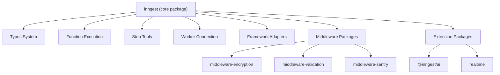

The Inngest repository is organized into several packages that provide different functionality. The core `inngest` package contains the main SDK functionality, while additional packages provide middleware, extensions, and testing utilities.

Sources: [packages/inngest/package.json:1-328](), [pnpm-lock.yaml:77-501]()

## Versioning and Development

Inngest follows semantic versioning. The current version is specified in the package.json file. Development involves testing across multiple TypeScript versions and Node.js environments to ensure broad compatibility.

The minimum supported Node.js version is 14, and TypeScript version is 4.7+.

Sources: [packages/inngest/package.json:3-4](), [packages/inngest/package.json:325-327](), [.github/workflows/pr.yml:16-261]()

# Architecture


This document provides a detailed overview of the architectural design and core components of the Inngest JavaScript SDK. It explains how the different parts of the system interact to provide durable execution, event handling, and workflow orchestration capabilities.

For information about specific packages in the repository, see [Packages](#1.2).

## Core Architecture Overview

The Inngest SDK follows a modular architecture designed to provide reliability and flexibility across different JavaScript environments. At its core, the SDK enables defining serverless functions that are triggered by events, executing durable workflows, and communicating with the Inngest platform.

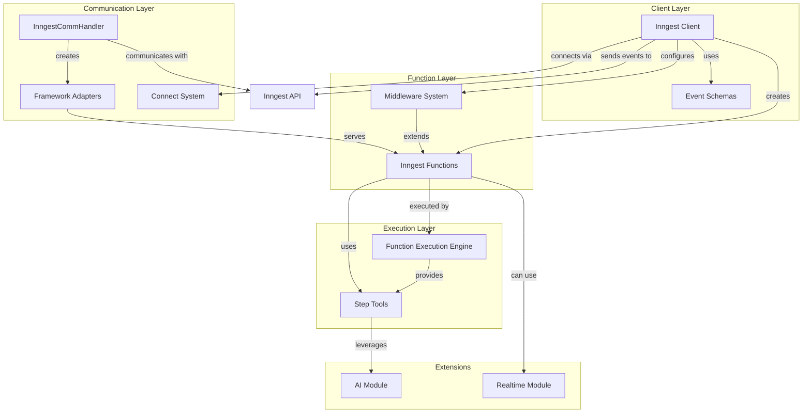

Sources: [packages/inngest/package.json:1-328](),(packages/inngest/src/components/Inngest.ts:1-1181),[packages/inngest/src/index.ts:1-109]()

## Client System

The Inngest client is the primary entry point for interacting with the SDK. It provides methods for creating functions, sending events, and configuring middleware.

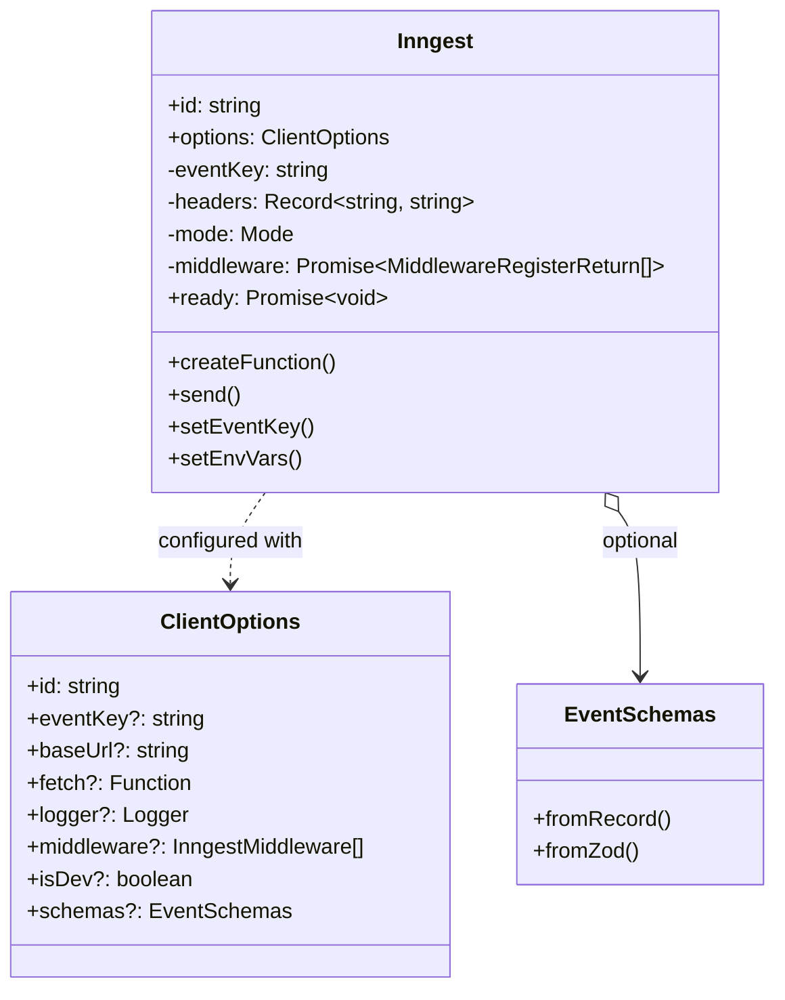

The `Inngest` class serves as the main client and is responsible for:

1. **Configuration Management**: Handles client settings, API endpoints, and environment detection
2. **Event Sending**: Provides methods to send events to the Inngest platform
3. **Function Creation**: Creates function definitions that can respond to events
4. **Middleware Initialization**: Sets up and manages middleware for extending functionality

### Environment Detection

The client supports different execution environments (development vs. production) through a mode system. It automatically detects the environment based on environment variables or explicit configuration.

Sources: [packages/inngest/src/components/Inngest.ts:1-1181](),(packages/inngest/src/helpers/env.ts:1-600)

## Function System

Inngest functions are defined using the `createFunction` method on the client. Each function is represented by an `InngestFunction` instance that encapsulates the function's configuration and handler.

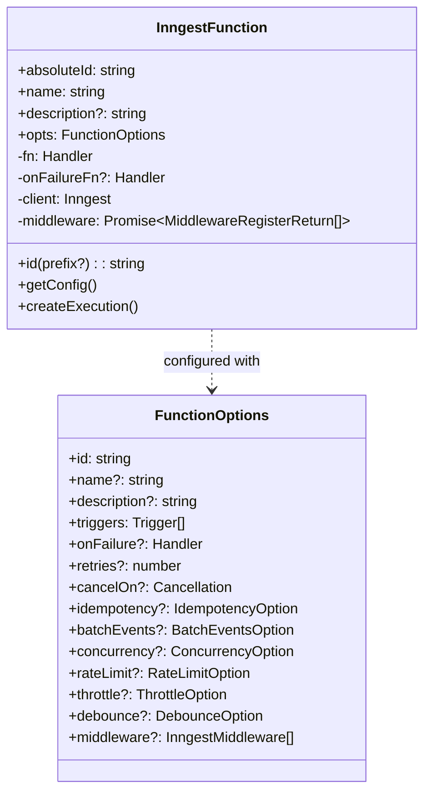

The function system provides:

1. **Event Triggering**: Functions can be triggered by events or cron schedules
2. **Configuration Options**: Support for retries, concurrency control, rate limiting, etc.
3. **Middleware Support**: Function-specific middleware can be applied
4. **Failure Handling**: Optional handlers for when a function fails

Sources: [packages/inngest/src/components/InngestFunction.ts:1-573](),(packages/inngest/src/components/Inngest.ts:400-650)

## Execution Engine

The execution engine is responsible for running functions and managing their state. It implements a step-based execution model that allows for durable, resumable execution.

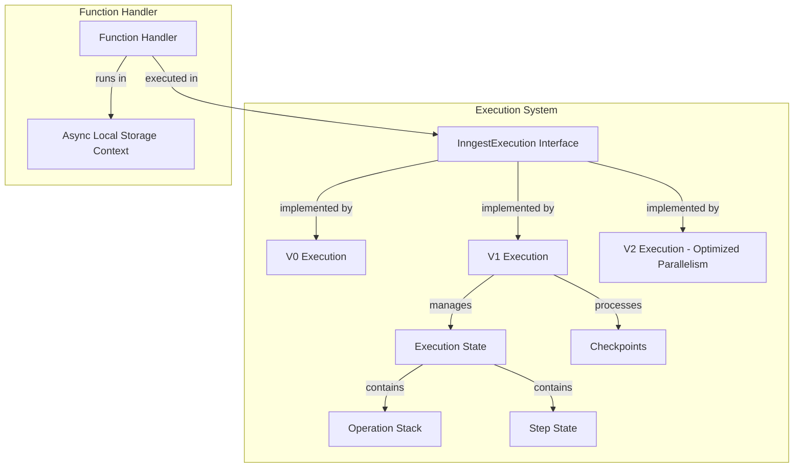

The execution engine features:

1. **Multiple Versions**: Different implementations (v0, v1, v2) with increasing capabilities
2. **State Management**: Tracks the state of function execution and steps
3. **Checkpoint System**: Creates checkpoints during execution to enable resumability
4. **Step Execution**: Manages the execution of individual steps within a function
5. **Optimized Parallelism**: V2 engine provides improved parallel execution capabilities

Sources: [packages/inngest/src/components/execution/InngestExecution.ts:1-220](),(packages/inngest/src/components/execution/v1.ts:1-1500),[packages/inngest/src/components/InngestFunction.ts:104-300]()

## Step Tools

Step tools provide the building blocks for creating workflows within Inngest functions. They allow for expressing complex business logic with durability guarantees.

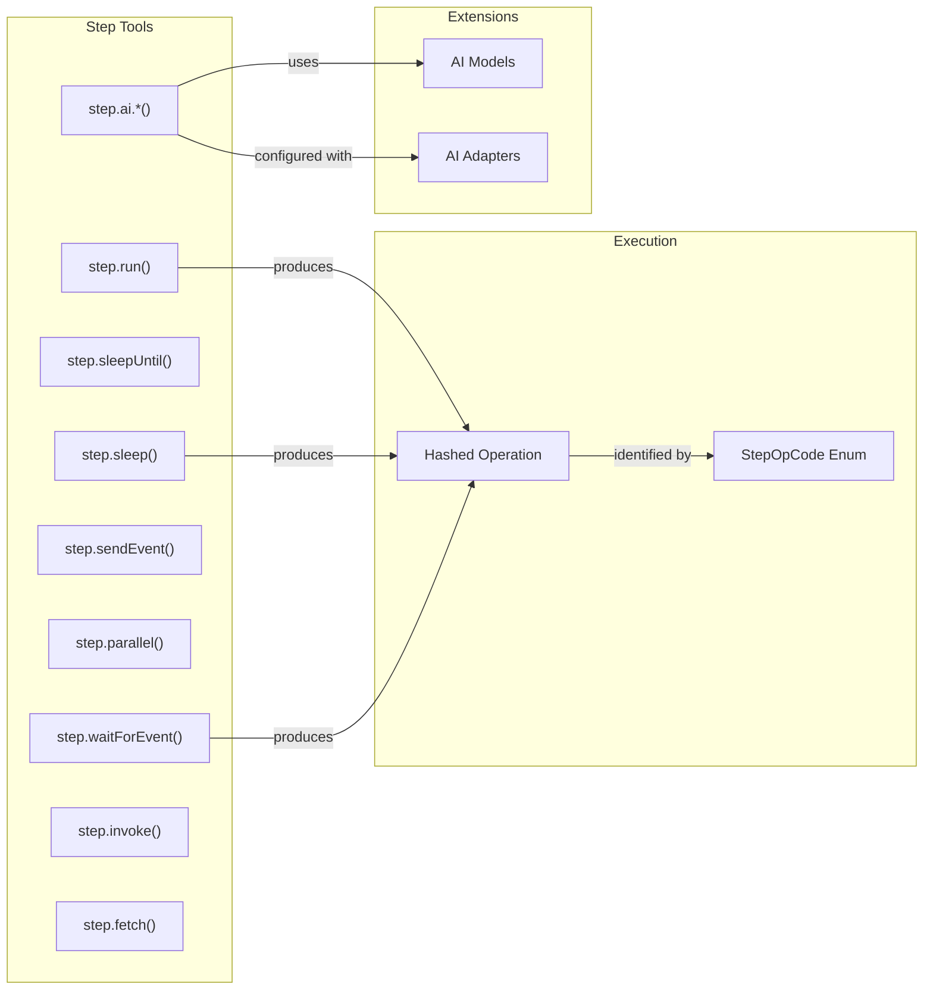

The main step tools include:

1. **`step.run()`**: Executes a function as a durable step
2. **`step.sleep()`**: Pauses execution for a specified duration
3. **`step.sleepUntil()`**: Pauses execution until a specific time
4. **`step.waitForEvent()`**: Waits for a specific event to occur
5. **`step.sendEvent()`**: Sends events to Inngest
6. **`step.parallel()`**: Executes steps in parallel
7. **`step.ai.**()`**: AI-specific operations using OpenAI, Anthropic, etc.
8. **`step.invoke()`**: Invokes another Inngest function
9. **`step.fetch()`**: Durable fetch that is automatically retried

Sources: [packages/inngest/src/components/InngestStepTools.ts:1-1200](),(packages/inngest/src/types.ts:177-257)

## Communication Layer

The communication layer handles HTTP communication between the SDK and the Inngest platform. It includes the `InngestCommHandler` class, which provides a framework-agnostic way to handle HTTP requests and responses.

```mermaid
classDiagram
    class InngestCommHandler {
        +id: string
        +handler: Handler
        #frameworkName: string
        #signingKey: string
        #mode: Mode
        -fns: Record~string, {fn: InngestFunction, onFailure: boolean}~
        +createHandler()
        #validateRequest()
        #handleRequest()
        #serve()
    }
    
    class ServeHandlerOptions {
        +client: Inngest
        +functions: InngestFunction[]
        +signingKey?: string
        +serveHost?: string
        +servePath?: string
        +logLevel?: LogLevel
        +streaming?: boolean|"allow"|"force"
    }
    
    class Handler {
        <<interface>>
        +method(): string
        +body(): Promise~any~
        +headers(key: string): string
        +url(): URL
        +transformResponse(response: HandlerResponse): any
    }
    
    InngestCommHandler ..> ServeHandlerOptions : configured with
    InngestCommHandler --> Handler : uses
```

The communication layer provides:

1. **Framework Adapters**: Support for various frameworks like Next.js, Express, Cloudflare, etc.
2. **Request Handling**: Processing of incoming HTTP requests from Inngest
3. **Response Transformation**: Converting internal responses to framework-specific formats
4. **Authentication**: Validating requests using signing keys
5. **Function Registration**: Registering functions with the Inngest platform

### Framework Adapters

The SDK includes adapters for various frameworks, allowing it to integrate with different JavaScript environments:

```mermaid
graph TD
    InngestCommHandler["InngestCommHandler"]
    
    subgraph "Web Frameworks"
        NextAdapter["Next.js"]
        ExpressAdapter["Express"]
        FastifyAdapter["Fastify"]
        KoaAdapter["Koa"]
        AstroAdapter["Astro"]
        RemixAdapter["Remix"]
        SvelteKitAdapter["SvelteKit"]
        HonoAdapter["Hono"]
        NitroAdapter["Nitro"]
    end
    
    subgraph "Serverless Platforms"
        LambdaAdapter["AWS Lambda"]
        EdgeAdapter["Edge Functions"]
        CloudflareAdapter["Cloudflare Workers"]
        VercelAdapter["Vercel Functions"]
    end
    
    InngestCommHandler -->|creates| NextAdapter
    InngestCommHandler -->|creates| ExpressAdapter
    InngestCommHandler -->|creates| FastifyAdapter
    InngestCommHandler -->|creates| KoaAdapter
    InngestCommHandler -->|creates| LambdaAdapter
    InngestCommHandler -->|creates| CloudflareAdapter
    InngestCommHandler -->|creates| EdgeAdapter
    InngestCommHandler -->|creates| AstroAdapter
    InngestCommHandler -->|creates| RemixAdapter
    InngestCommHandler -->|creates| SvelteKitAdapter
    InngestCommHandler -->|creates| HonoAdapter
    InngestCommHandler -->|creates| NitroAdapter
```

Sources: [packages/inngest/src/components/InngestCommHandler.ts:1-1200](),(packages/inngest/package.json:35-155)

## Connect System

The Connect system enables direct WebSocket-based communication with the Inngest gateway, providing an alternative to HTTP-based communication for certain environments.

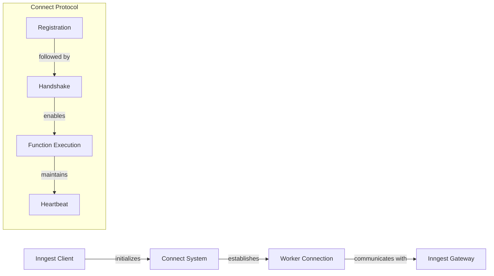

The Connect system provides:

1. **WebSocket Connection**: Direct connection to the Inngest gateway
2. **Worker Registration**: Registration of workers with the Inngest platform
3. **Function Execution**: WebSocket-based function execution
4. **Reconnection**: Automatic reconnection in case of connection loss

Sources: [packages/inngest/CHANGELOG.md:380-384](),(packages/inngest/CHANGELOG.md:380-390)

## Middleware System

The middleware system enables extending and customizing the SDK's behavior through a set of hooks and transformations.

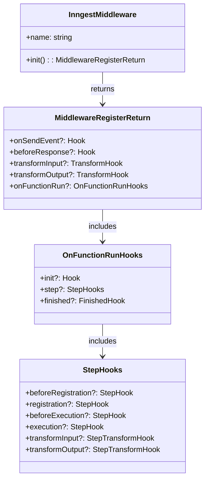

The middleware system provides:

1. **Event Hooks**: Modify events before they are sent
2. **Function Hooks**: Extend function behavior before, during, and after execution
3. **Step Hooks**: Customize step behavior
4. **Input/Output Transformation**: Transform function and step inputs and outputs
5. **Response Hooks**: Modify responses before they are sent back to Inngest

### Built-in Middleware

The SDK includes several built-in middleware components:

1. **Logger Middleware**: Provides logging capabilities
2. **Dependency Injection Middleware**: Allows adding dependencies to function context
3. **AI Middleware**: Enhances AI capabilities
4. **Realtime Middleware**: Supports realtime communication

Additional middleware packages are available separately:

1. **Encryption Middleware**: Encrypts sensitive data
2. **Validation Middleware**: Validates events and function inputs
3. **Sentry Middleware**: Integrates with Sentry for error tracking

Sources: [packages/inngest/src/components/InngestMiddleware.ts:1-800](),(packages/inngest/src/middleware/dependencyInjection.js),(packages/middleware-encryption/package.json),(packages/middleware-validation/package.json)

## Event Schema System

The event schema system provides type safety and validation for events using TypeScript types and optional Zod schemas.

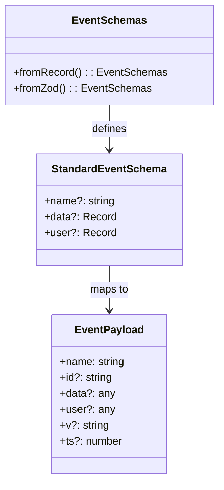

The event schema system provides:

1. **Type Definitions**: TypeScript types for events
2. **Schema Validation**: Optional validation using Zod schemas
3. **Internal Events**: Support for internal Inngest events like function invocations
4. **Wildcard Events**: Support for wildcard event patterns like `app/blog.post.*`

Sources: [packages/inngest/src/components/EventSchemas.ts:1-300](),(packages/inngest/src/types.ts:486-541)

## Error Handling

The SDK includes a robust error handling system with specialized error types and serialization capabilities.

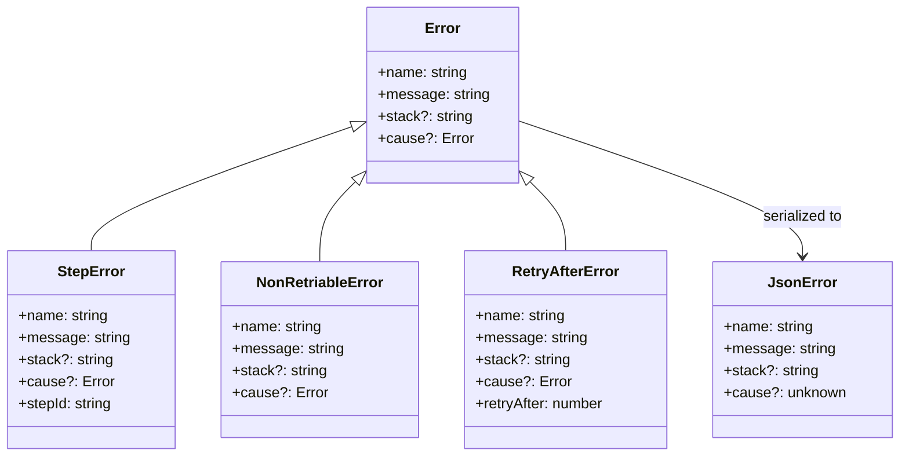

The error handling system provides:

1. **Specialized Error Types**: 
   - `StepError`: For errors in specific steps
   - `NonRetriableError`: For errors that should not be retried
   - `RetryAfterError`: For errors that should be retried after a delay

2. **Error Serialization**: Converting errors to JSON and back
3. **Recursive Error Handling**: Support for nested errors with causes

Sources: [packages/inngest/src/types.ts:37-77](),(packages/inngest/src/components/StepError.js),(packages/inngest/src/components/NonRetriableError.js)

## Extensions

The SDK includes several extensions for additional functionality:

### AI Extension

The AI extension provides tools for working with AI models:

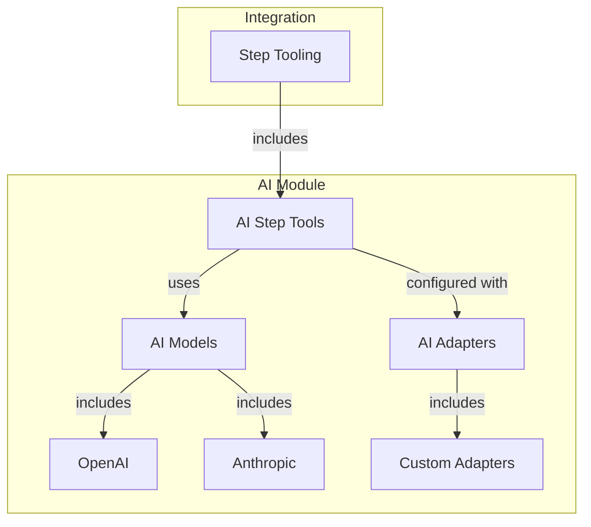

### Realtime Extension

The realtime extension enables realtime updates and communication:

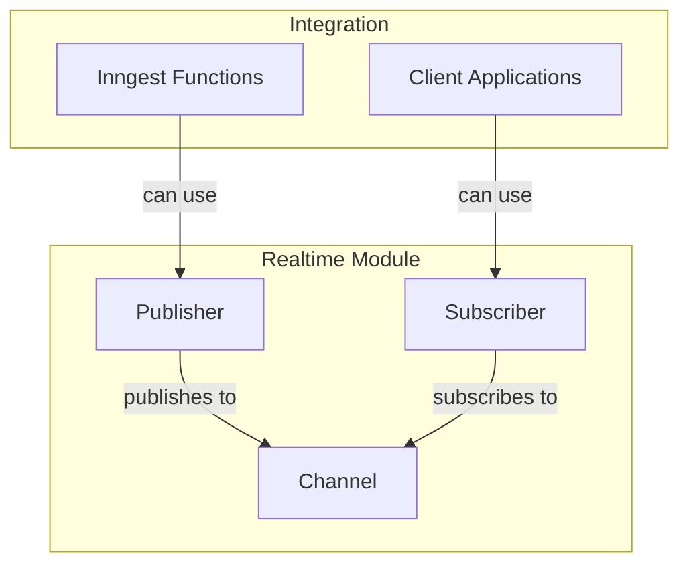

Sources: [packages/inngest/CHANGELOG.md:519-534](),(packages/realtime/package.json:430-484)

## Build and Runtime Considerations

The Inngest SDK supports a wide range of JavaScript environments and build targets:

1. **Supported Node.js Versions**: 14+
2. **TypeScript Support**: TypeScript 4.7+
3. **Framework Compatibility**: Support for various frameworks and serverless platforms
4. **Export Formats**: CommonJS and ESM support
5. **Bundle Size**: Optimized for minimal bundle size

The SDK also includes careful consideration for:

1. **Async Context**: Maintaining context across async boundaries
2. **Error Serialization**: Cross-platform error handling
3. **Environment Detection**: Automatically detecting development vs. production environments
4. **Fetch Compatibility**: Support for various fetch implementations

Sources: [packages/inngest/package.json:325-327](),(packages/inngest/src/helpers/env.ts:1-100)

## Conclusion

The Inngest JavaScript SDK provides a robust and flexible architecture for building durable, event-driven applications. Through its modular design, comprehensive middleware system, and framework adaptability, it enables developers to build reliable workflows across various JavaScript environments.

The architecture balances type safety, extensibility, and performance, while providing powerful tools for building complex business logic with reliability guarantees.