This document provides an overview of the package architecture in the Inngest repository, describing the relationship between the core SDK and its various extension packages. For information about how these packages integrate into the overall architecture, see [Architecture](#1.1).

## Package Ecosystem

Inngest is organized as a monorepo containing several packages that work together to provide a complete event-driven workflow platform. The core SDK package serves as the foundation, with several extension packages providing additional capabilities.

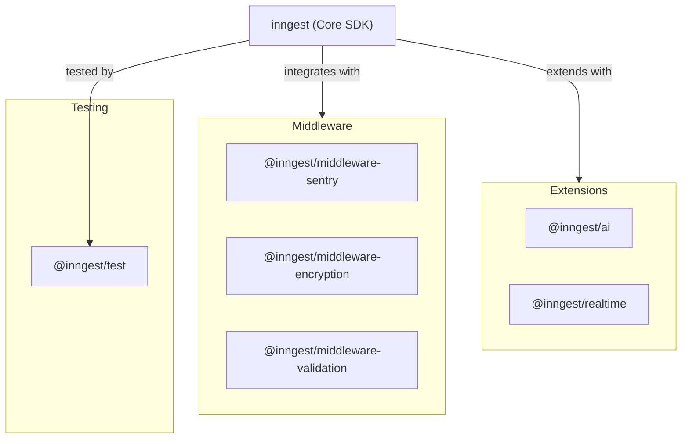

Sources: [packages/inngest/package.json:1-328](), [packages/ai/package.json:1-59](), [packages/realtime/package.json:1-70](), [packages/test/package.json:1-52](), [packages/middleware-sentry/package.json:1-52]()

## Core SDK (`inngest`)

The primary package is `inngest`, which provides the core SDK functionality. This package offers the foundation for defining functions, handling events, and connecting to the Inngest platform.

### Version and Dependencies

Current version: 3.35.1

Key dependencies:
- `@inngest/ai`: AI integration package
- `@opentelemetry`: For tracing and instrumentation
- `zod`: For schema validation
- `temporal-polyfill`: For timing and duration functionalities

Sources: [packages/inngest/package.json:1-328]()

### Export Structure

The core SDK exposes multiple entry points for different frameworks and use cases:

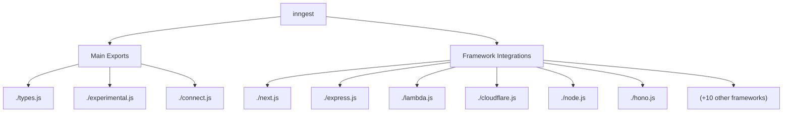

Sources: [packages/inngest/package.json:35-156](), [packages/inngest/jsr.json:1-42]()

## Extension Packages

Inngest provides extension packages that add specialized functionality to the core SDK.

### AI Package (`@inngest/ai`)

The AI package facilitates integration with various AI models and providers.

- **Version**: 0.1.4
- **Main exports**: 
  - `.`: Main package entry point
  - `./models`: AI model definitions
  - `./adapters`: Adapters for various AI providers

Supports multiple AI models including GPT-4.1, GPT-4.1-mini, Gemini, Claude, and more.

Sources: [packages/ai/package.json:1-59](), [packages/ai/jsr.json:1-14](), [packages/ai/CHANGELOG.md:1-71]()

### Realtime Package (`@inngest/realtime`)

The Realtime package enables realtime updates and subscriptions to function executions.

- **Version**: 0.3.1
- **Exports**:
  - `.`: Main package entry point
  - `./hooks`: React hooks for realtime updates

Features include:
- Stream management and subscription tokens
- Channel-based messaging
- React integration through hooks
- Middleware for publishing messages

Depends on the core `inngest` package.

Sources: [packages/realtime/package.json:1-70](), [packages/realtime/jsr.json:1-13](), [packages/realtime/CHANGELOG.md:1-106](), [packages/realtime/src/middleware.ts:1-69]()

## Middleware Packages

Middleware packages add additional functionality to the core SDK through the middleware system.

### Sentry Middleware (`@inngest/middleware-sentry`)

- **Version**: 0.1.2
- **Purpose**: Integrates Sentry for error tracking and performance monitoring
- **Features**:
  - Captures errors during function execution
  - Creates performance spans for different execution phases
  - Sets tags with Inngest metadata
  - Automatically flushes events (configurable)

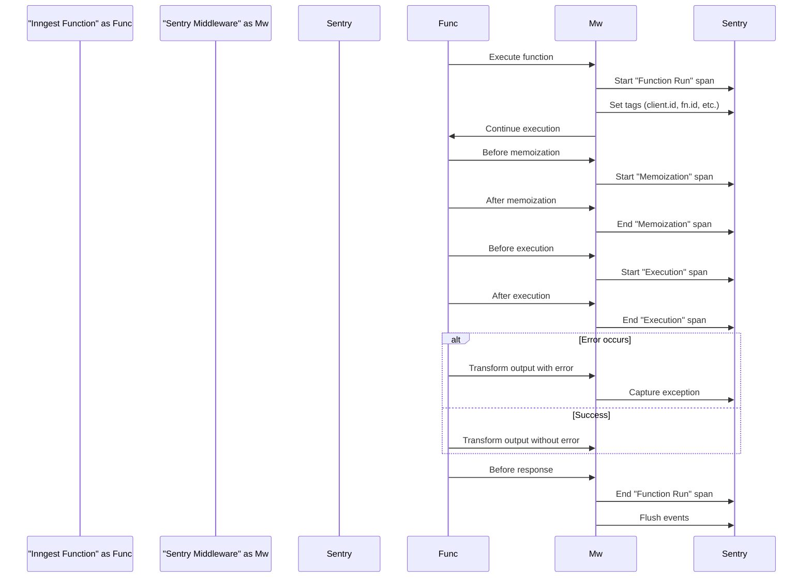

Sources: [packages/middleware-sentry/package.json:1-52](), [packages/middleware-sentry/src/middleware.ts:1-197](), [packages/middleware-sentry/CHANGELOG.md:1-22]()

### Other Middleware

The repository includes additional middleware packages:

- **Encryption Middleware** (`@inngest/middleware-encryption`): Provides encryption capabilities
- **Validation Middleware** (`@inngest/middleware-validation`): Adds validation for events and data

Both packages depend on the core `inngest` package.

Sources: [.github/workflows/pr.yml:151-179]()

## Testing Package (`@inngest/test`)

- **Version**: 0.1.6
- **Purpose**: Provides utilities for testing Inngest functions
- **Dependencies**:
  - `inngest`: Core SDK
  - `tinyspy`: For spying on function calls
  - `ulid`: For generating unique IDs

The package helps developers write tests for their Inngest functions by providing a simplified API for testing.

Sources: [packages/test/package.json:1-52](), [packages/test/jsr.json:1-13](), [packages/test/CHANGELOG.md:1-45]()

## Package Distribution

All packages are distributed through:

1. **npm registry**: Standard JavaScript package distribution
2. **JSR**: JavaScript Registry (indicated by `jsr.json` files)

Each package follows semantic versioning and includes its own changelog for tracking updates.

Sources: [packages/inngest/package.json:7-9](), [packages/inngest/jsr.json:1-42](), [packages/ai/jsr.json:1-14](), [packages/realtime/jsr.json:1-13](), [packages/test/jsr.json:1-13](), [packages/middleware-sentry/jsr.json:1-13]()

## Package Dependencies Table

| Package | Version | Dependencies on other Inngest packages |
|---------|---------|---------------------------------------|
| `inngest` | 3.35.1 | `@inngest/ai@0.1.3` |
| `@inngest/ai` | 0.1.4 | none |
| `@inngest/realtime` | 0.3.1 | `inngest@^3.34.2` |
| `@inngest/test` | 0.1.6 | `inngest@^3.31.1` |
| `@inngest/middleware-sentry` | 0.1.2 | `inngest@^3.19.11` (peer dependency) |
| `@inngest/middleware-encryption` | (not detailed) | `inngest` (dependency) |
| `@inngest/middleware-validation` | (not detailed) | `inngest` (dependency) |

Sources: [packages/inngest/package.json:201-224](), [packages/realtime/package.json:63-68](), [packages/test/package.json:43-47](), [packages/middleware-sentry/package.json:46-50](), [packages/ai/package.json:47-50]()

# Core SDK


The Core SDK is the foundational component of the Inngest platform, providing the essential functionality for creating event-driven serverless functions. It serves as the interface between your application code and the Inngest infrastructure, enabling you to define, execute, and monitor background jobs, scheduled tasks, and event-driven workflows.

For information about specific aspects of the Core SDK, see:
- [Types and Interfaces](#2.1) for the core type system
- [Function Execution](#2.2) for execution details including middleware and state management
- [Step Tools](#2.3) for function building blocks like `step.run`, `step.sendEvent`
- [Event Handling](#2.4) for event processing and validation
- [Framework Integrations](#2.5) for framework-specific adapters

## Architecture

The Core SDK is designed with a modular architecture that enables it to work across multiple JavaScript frameworks and environments.

Diagram: Core SDK Architecture

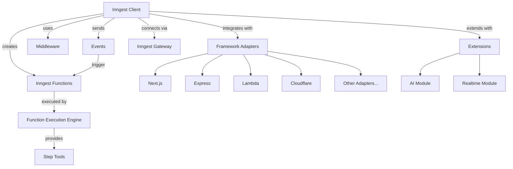

Sources: packages/inngest/package.json, packages/inngest/README.md

## Key Components

The Core SDK consists of several interconnected components that enable the creation and execution of serverless functions:

| Component | Description |
|-----------|-------------|
| **Inngest Client** | The main entry point for the SDK, used to create functions, send events, and configure middleware |
| **Events** | Messages with a name and data payload that trigger function execution |
| **Functions** | Serverless event handlers that execute when matching events are received |
| **Function Execution Engine** | Responsible for running functions and managing their lifecycle |
| **Step Tools** | Utilities for building workflow steps, handling retries, and managing state |
| **Middleware** | Extension points that modify the behavior of the SDK during event handling and function execution |
| **Framework Adapters** | Integration layers for various JavaScript frameworks |
| **Extensions** | Additional modules like AI and Realtime that extend the SDK's functionality |

Sources: packages/inngest/package.json, packages/inngest/README.md, packages/inngest/CHANGELOG.md

## Core Functionality

### Client Initialization

To use Inngest, you first need to initialize the client:

```typescript
import { Inngest } from "inngest";

const inngest = new Inngest({ id: "my-app" });
```

The client can be configured with options such as API keys, environment variables, middleware, and more:

```typescript
const inngest = new Inngest({
  id: "my-app",
  middleware: [myMiddleware],
  env: process.env.NODE_ENV === "production" 
    ? "production" 
    : "dev"
});
```

Sources: packages/inngest/README.md

### Creating Functions

Functions are defined using the `createFunction` method:

```typescript
const userOnboarding = inngest.createFunction(
  { id: "user-onboarding" },  // Function configuration
  { event: "app/user.signup" },  // Trigger
  async ({ event, step }) => {  // Handler function
    // Function implementation
    await step.run("Send welcome email", async () => {
      await sendEmail(event.data.email, "welcome");
    });
  }
);
```

Functions can be configured with additional options like descriptions, timeouts, and concurrency limits:

```typescript
inngest.createFunction(
  { 
    id: "process-payment", 
    description: "Process payment and update order status",
    timeout: 300, // 5 minutes in seconds
    concurrency: {
      limit: 5 // Maximum number of concurrent executions
    }
  },
  { event: "order/payment.submitted" },
  async ({ event, step }) => {
    // Implementation
  }
);
```

Sources: packages/inngest/README.md, packages/inngest/CHANGELOG.md

### Sending Events

Events can be sent using the `send` method of the client:

```typescript
await inngest.send({
  name: "app/user.signup",
  data: {
    userId: "123",
    email: "user@example.com",
    name: "John Doe"
  }
});

// Or with the shorthand syntax:
await inngest.send("app/user.signup", {
  data: {
    userId: "123",
    email: "user@example.com",
    name: "John Doe"
  }
});
```

You can also send multiple events in a single request:

```typescript
await inngest.send([
  {
    name: "app/user.signup",
    data: {
      userId: "123",
      email: "user@example.com"
    }
  },
  {
    name: "app/analytics.event",
    data: {
      action: "new_signup",
      userId: "123"
    }
  }
]);
```

Sources: packages/inngest/README.md

### Serving Functions

To make functions available for invocation by Inngest, you need to serve them using a framework adapter:

```typescript
// Next.js adapter example
import { serve } from "inngest/next";

export default serve(inngest, [userOnboarding, otherFunction]);
```

Different adapters are available for various frameworks:

```typescript
// Express adapter
import { serve } from "inngest/express";
app.use('/api/inngest', serve(inngest, [myFunction]));

// AWS Lambda adapter
import { serve } from "inngest/lambda";
export const handler = serve(inngest, [myFunction]);

// And many others
```

Diagram: Framework Adapters

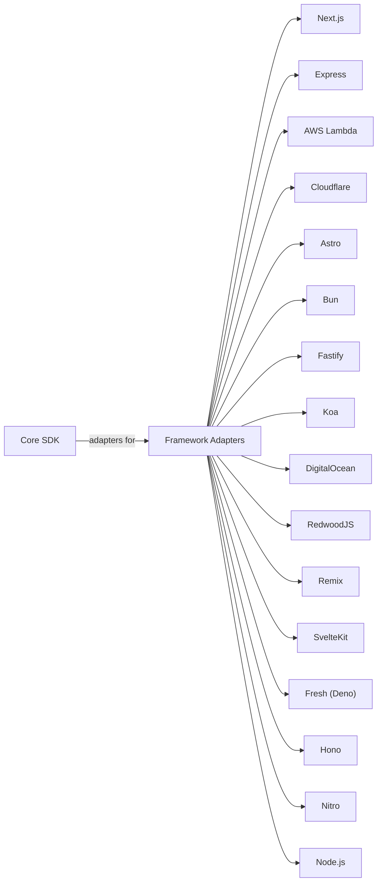

Sources: packages/inngest/package.json, packages/inngest/README.md

## Advanced Features

### Step Tools

The `step` object provides tools for building complex workflows:

```typescript
inngest.createFunction(
  { id: "order-processing" },
  { event: "order/placed" },
  async ({ event, step }) => {
    // Run a step
    const result = await step.run("Process payment", async () => {
      return processPayment(event.data.orderId);
    });
    
    // Send an event
    await step.sendEvent("Order payment processed", {
      name: "order/payment.processed",
      data: {
        orderId: event.data.orderId,
        status: result.status
      }
    });
    
    // Sleep for a duration
    await step.sleep("Wait for fulfillment", "5m");
    
    // Wait for a specific event
    const shipment = await step.waitForEvent("Wait for shipment", {
      event: "order/shipment.created",
      timeout: "1h",
      match: { id: event.data.orderId }
    });
  }
);
```

For more detailed information on step tools, see [Step Tools](#2.3).

Sources: packages/inngest/README.md, packages/inngest/CHANGELOG.md

### Middleware

Middleware provides ways to extend and modify the behavior of the SDK:

```typescript
const loggingMiddleware = new InngestMiddleware({
  name: "logging-middleware",
  init() {
    return {
      onFunctionRun: {
        async beforeExecution({ event, context }) {
          console.log(`Executing function for event: ${event.name}`);
        },
        async afterExecution({ event, context, result }) {
          console.log(`Function execution completed: ${result.status}`);
        },
        async finished({ result }) {
          console.log(`Function run finished with status: ${result.status}`);
        },
      },
    };
  },
});

const inngest = new Inngest({
  id: "my-app",
  middleware: [loggingMiddleware],
});
```

Inngest provides official middleware packages:
- Encryption middleware for data security
- Validation middleware for event schema validation
- Sentry middleware for error tracking
- Dependency injection middleware for providing services to functions

Sources: packages/inngest/CHANGELOG.md

### Connect System

For applications that don't expose public HTTP endpoints or need to process events in real-time, Inngest provides a Connect system:

```typescript
import { connect } from "inngest/connect";

const inngest = new Inngest({ id: "my-app" });

// Connect to the Inngest Gateway
connect(inngest, { 
  functions: [myFunction1, myFunction2],
  appVersion: "1.0.0" // Optional version identifier
});
```

The Connect system establishes a persistent WebSocket connection to the Inngest Gateway, allowing bidirectional communication.

For more details on the Connect system, see [Worker Connection](#3).

Sources: packages/inngest/CHANGELOG.md

### AI Integration

The SDK includes integration with AI models:

```typescript
inngest.createFunction(
  { id: "content-moderation" },
  { event: "content/submitted" },
  async ({ event, step }) => {
    // Use OpenAI
    const openaiResult = await step.ai.openai({
      model: "gpt-4",
      messages: [
        { role: "system", content: "You are a content moderator." },
        { role: "user", content: event.data.content }
      ]
    });
    
    // Use Anthropic
    const anthropicResult = await step.ai.anthropic({
      model: "claude-3-opus-20240229",
      messages: [
        { role: "user", content: event.data.content }
      ]
    });
  }
);
```

For more information on AI integration, see [AI Integration](#4.1).

Sources: packages/inngest/CHANGELOG.md

### Temporal API Support

The SDK supports the [Temporal API](https://tc39.es/proposal-temporal/) for date and time operations:

```typescript
inngest.createFunction(
  { id: "scheduling-example" },
  { event: "schedule/demo" },
  async ({ event, step }) => {
    // Sleep with Temporal.Duration
    await step.sleep("Short delay", Temporal.Duration.from({ seconds: 30 }));
    
    // Sleep until specific time
    await step.sleepUntil(
      "Wait until specific time",
      Temporal.Instant.from("2024-06-01T09:00:00Z")
    );
    
    // Sleep until time in specific timezone
    await step.sleepUntil(
      "Wait until time in London",
      Temporal.ZonedDateTime.from("2024-06-01T09:00[Europe/London]")
    );
  }
);
```

Sources: packages/inngest/CHANGELOG.md

### Fetch Support

The SDK provides a durable `fetch` implementation that automatically turns any API call into a durable step when used within an Inngest function:

```typescript
import { fetch } from "inngest";

inngest.createFunction(
  { id: "api-calls" },
  { event: "api/request" },
  async ({ event, step }) => {
    // This will be automatically traced and retried if it fails
    const response = await fetch("https://api.example.com/data");
    const data = await response.json();
    
    // Same effect using step.fetch
    const otherResponse = await step.fetch("https://api.example.com/other");
  }
);

// Can be used with libraries that accept custom fetch implementations
const api = new MyApiClient({ fetch });
```

Sources: packages/inngest/CHANGELOG.md

## Summary

The Core SDK provides the foundation for building event-driven serverless functions with Inngest. It offers a rich set of tools for defining functions, sending events, and building complex workflows with steps, sleeps, and event triggers. Through framework adapters, it integrates with a wide range of JavaScript environments, making it possible to use Inngest in virtually any serverless setting.

For more detailed information about specific aspects of the SDK, refer to the linked pages in the introduction.

# Types and Interfaces


This document explains the core type system that provides structure to the Inngest SDK. It covers the key types and interfaces used throughout the SDK, their relationships, and how they enable Inngest's event-driven function execution model.

For information about function execution models, see [Function Execution](#2.2).

## Overview of the Type System

The Inngest type system is designed to provide type safety and structure throughout the SDK. It includes types for events, function contexts, operations, configuration, and utility purposes.

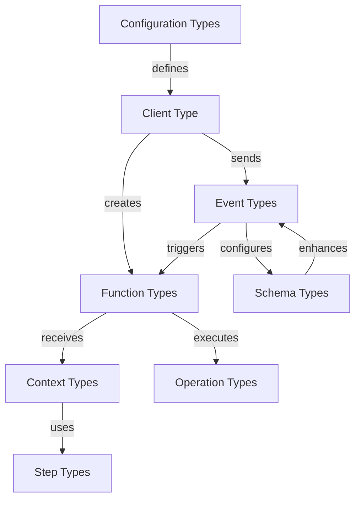

Sources:
- [packages/inngest/src/types.ts]()
- [packages/inngest/src/components/EventSchemas.ts]()
- [packages/inngest/src/components/Inngest.ts]()

## Event Types

Events are at the core of Inngest, serving as both triggers for functions and as outputs from functions.

### EventPayload

The primary event interface is `EventPayload`, which represents the structure of a single event:

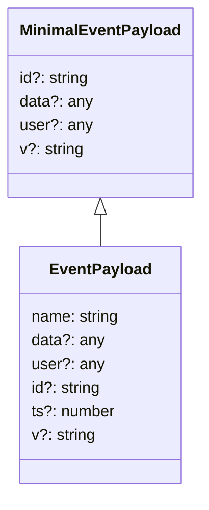

The `EventPayload` interface contains:

- `name`: A unique identifier for the event type (e.g., "user/created")
- `data`: Any data relevant to the event
- `user`: User data associated with the event
- `id`: A unique ID for idempotent processing
- `ts`: Timestamp in milliseconds since epoch
- `v`: Optional schema version

For simpler cases where you're not sending an event directly, the `MinimalEventPayload` omits the `name` field.

Sources:
- [packages/inngest/src/types.ts:487-541]()

### Special Event Types

Inngest includes several special event types for internal purposes:

- `FailureEventPayload`: Sent when a function fails after exhausting retries
- `FinishedEventPayload`: Sent when a function completes (success or failure)
- `InvokedEventPayload`: Generic function invocation event
- `ScheduledTimerEventPayload`: Sent to a function triggered by a cron schedule

```mermaid
classDiagram
    class EventPayload {
        name: string
        data?: any
        user?: any
        id?: string
        ts?: number
        v?: string
    }
    
    class FailureEventPayload {
        name: "inngest/function.failed"
        data: {
            function_id: string
            run_id: string
            error: JsonError
            event: EventPayload
        }
    }
    
    class FinishedEventPayload {
        name: "inngest/function.finished"
        data: {
            function_id: string
            run_id: string
            correlation_id?: string
            error?: JsonError
            result?: unknown
        }
    }
    
    class InvokedEventPayload {
        name: "inngest/function.invoked"
        [other EventPayload fields]
    }
    
    class ScheduledTimerEventPayload {
        name: "inngest/scheduled.timer"
        data: {
            cron: string
        }
    }
    
    EventPayload <|-- FailureEventPayload
    EventPayload <|-- FinishedEventPayload
    EventPayload <|-- InvokedEventPayload
    EventPayload <|-- ScheduledTimerEventPayload
```

Sources:
- [packages/inngest/src/types.ts:84-171]()
- [packages/inngest/src/helpers/consts.ts:157-167]()

## Event Schemas

Event schemas provide type safety when sending events and defining function triggers.

### EventSchemas Class

The `EventSchemas` class offers multiple ways to define your event types:

```mermaid
classDiagram
    class EventSchemas {
        fromGenerated<T>(): EventSchemas
        fromRecord<T>(): EventSchemas
        fromUnion<T>(): EventSchemas
        fromZod<T>(schemas): EventSchemas
    }
    
    class StandardEventSchema {
        name?: string
        data?: Record~string, any~
        user?: Record~string, any~
    }
    
    class ZodEventSchemas {
        [eventName: string]: {
            data?: ZodSchema
            user?: ZodSchema
        }
    }
    
    EventSchemas ..> StandardEventSchema: "uses"
    EventSchemas ..> ZodEventSchemas: "uses"
```

You can define schemas using:

1. TypeScript types with `fromRecord<T>()`
2. Zod schemas with `fromZod<T>()`
3. Union types with `fromUnion<T>()`
4. Generated Inngest types with `fromGenerated<T>()`

Example usage in client initialization:

```typescript
const inngest = new Inngest({
  id: "my-app",
  schemas: new EventSchemas().fromZod({
    "app/user.created": {
      data: z.object({
        id: z.string(),
        name: z.string(),
      }),
    },
  }),
});
```

Sources:
- [packages/inngest/src/components/EventSchemas.ts:257-401]()
- [packages/inngest/src/components/EventSchemas.test.ts:16-581]()

## Context and Handler Types

Function handlers receive context objects that provide access to event data, step tools, and execution state.

### Context Types

```mermaid
classDiagram
    class BaseContext {
        event: EventPayload
        events: EventPayload[]
        runId: string
        step: StepTools
        attempt: number
    }
    
    class Context {
        "extends BaseContext with overrides"
    }
    
    class Handler {
        (ctx: Context): unknown
    }
    
    BaseContext <|-- Context
    Context --> Handler: "used by"
```

The `BaseContext` interface includes:

- `event`: The event that triggered the function
- `events`: An array of events (useful in batched scenarios)
- `runId`: Unique ID for this function execution
- `step`: Tools for creating steps in the function
- `attempt`: Current attempt number (starting from 0)

The `Context` type extends `BaseContext` with optional user-defined or middleware-provided properties.

Sources:
- [packages/inngest/src/types.ts:386-452]()

### Handler Function

The `Handler` type represents the function that gets executed when an event triggers a function:

```typescript
type Handler<TClient, TTriggers, TOverrides> = (
  ctx: Context<TClient, TTriggers, TOverrides>
) => unknown;
```

Handlers receive a context object and can return any value.

Sources:
- [packages/inngest/src/types.ts:442-452]()

## Operation Types

Operations (Ops) represent steps that functions execute and are used to communicate with the Inngest platform.

### Op Types

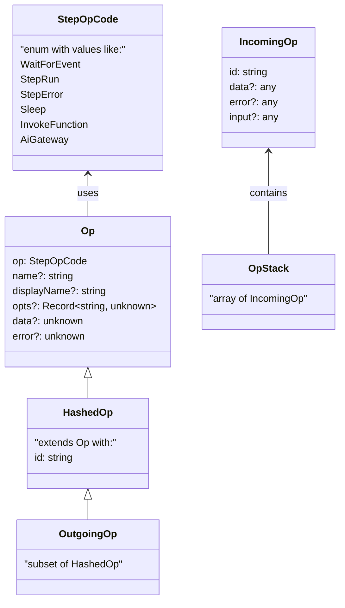

The key operation types are:

- `StepOpCode`: Enum for different operation types
- `Op`: Base operation type
- `HashedOp`: Operation with a unique ID
- `OutgoingOp`: Operation sent to Inngest
- `IncomingOp`: Operation received from Inngest
- `OpStack`: Stack of operations during execution

Operations represent actions like running code (`StepRun`), handling errors (`StepError`), waiting for events (`WaitForEvent`), sleeping (`Sleep`), or invoking other functions (`InvokeFunction`).

Sources:
- [packages/inngest/src/types.ts:177-294]()

## Configuration Types

Inngest provides several configuration types to customize the behavior of clients and functions.

### Client and Function Configuration

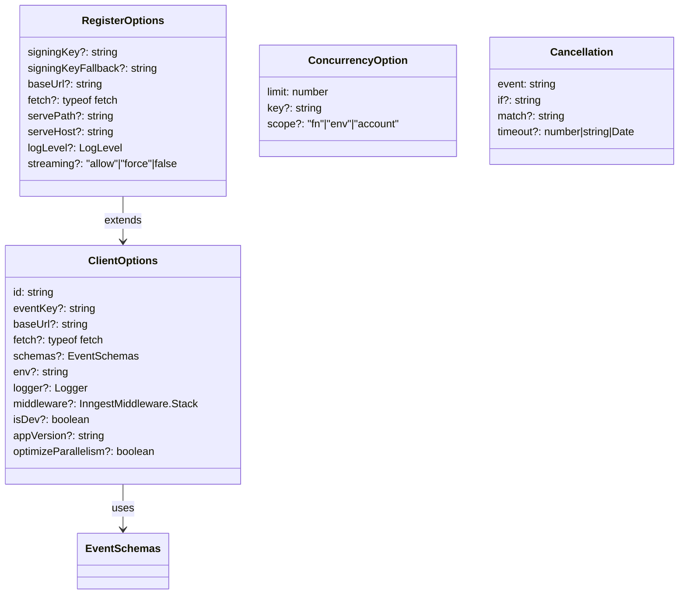

The main configuration types are:

- `ClientOptions`: Configures the Inngest client
- `RegisterOptions`: Configures function registration
- `ConcurrencyOption`: Controls function concurrency
- `Cancellation`: Configures function cancellation behavior
- `FunctionConfig`: Represents a function's configuration for syncing

These options allow you to customize authentication, URLs, concurrency, rate limiting, and more.

Sources:
- [packages/inngest/src/types.ts:638-1076]()

## Utility Types

Inngest includes numerous utility types that help with type transformations and checks.

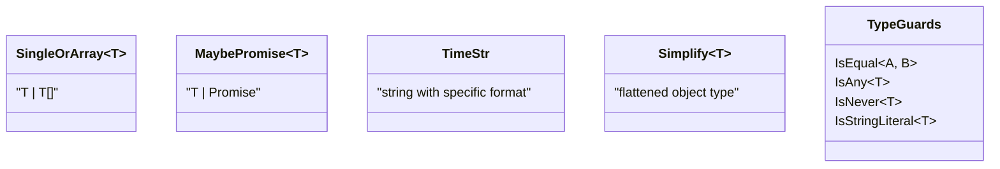

Some of the most useful utility types include:

- `SingleOrArray<T>`: A value that can be either a single item or an array
- `MaybePromise<T>`: A value or a promise of that value
- `TimeStr`: A string format for durations like "1h30m15s"
- `Simplify<T>`: Flattens complex types for better readability
- Type guards like `IsEqual<A, B>`, `IsAny<T>`, `IsNever<T>`

These utility types are used throughout the codebase to provide better type safety and developer experience.

Sources:
- [packages/inngest/src/helpers/types.ts:6-397]()
- [packages/inngest/src/types.ts:310-312]()

## Client and Function Relationship

The following diagram illustrates how the Inngest client and functions are related through types:

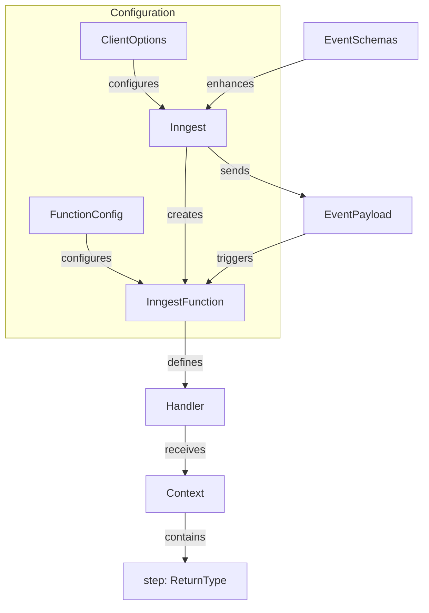

This flow shows:

1. The `Inngest` client is created with `ClientOptions`
2. The client creates `InngestFunction` instances
3. Functions define handlers that receive context objects
4. Context objects contain step tools for function execution
5. `EventSchemas` enhance the client with type information
6. Events flow through the system as triggers and outputs

Sources:
- [packages/inngest/src/components/Inngest.ts:101-721]()
- [packages/inngest/src/index.ts:40-108]()

## Type Flow in Function Execution

To understand how these types interact during function execution:

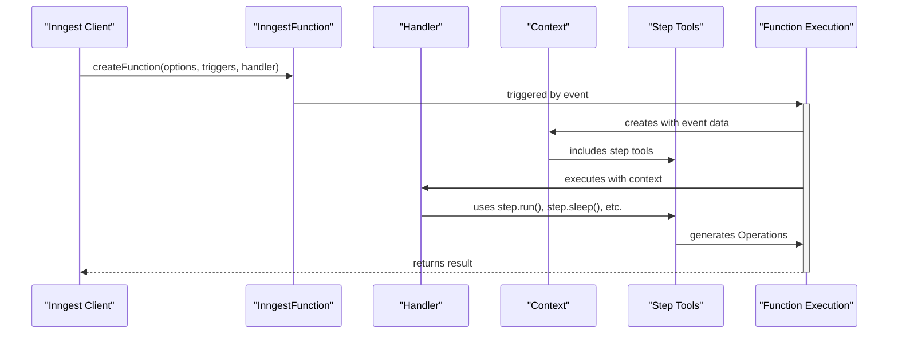

This sequence shows:

1. The client creates a function with options, triggers, and a handler
2. When triggered by an event, the function execution begins
3. A context object is created with event data and step tools
4. The handler is executed with the context
5. The handler uses step tools to perform operations
6. Operations are processed by the execution engine
7. Results are returned to the client

Sources:
- [packages/inngest/src/components/InngestCommHandler.ts:223-897]()
- [packages/inngest/src/test/helpers.ts:90-161]()

## Table of Core Types

Here's a summary of the most important types in the Inngest SDK:

| Category | Type | Purpose |
|----------|------|---------|
| Events | `EventPayload` | Structure of an event |
| | `MinimalEventPayload` | Minimal event structure |
| | `FailureEventPayload` | Event for function failure |
| Schemas | `EventSchemas` | Type-safe event definitions |
| | `StandardEventSchema` | Basic event shape |
| Context | `BaseContext` | Base function context |
| | `Context` | Customizable function context |
| | `Handler` | Function handler receiving context |
| Operations | `Op` | Base operation |
| | `HashedOp` | Operation with an ID |
| | `OutgoingOp` | Operation sent to Inngest |
| | `OpStack` | Stack of operations |
| Configuration | `ClientOptions` | Inngest client configuration |
| | `RegisterOptions` | Function registration options |
| | `ConcurrencyOption` | Concurrency settings |
| | `FunctionConfig` | Function configuration |
| Utility | `TimeStr` | Time string format |
| | `SingleOrArray<T>` | Single value or array |
| | `MaybePromise<T>` | Value or promise |

Sources:
- [packages/inngest/src/types.ts]()
- [packages/inngest/src/helpers/types.ts]()
- [packages/inngest/src/components/EventSchemas.ts]()

## Conclusion

The type system in Inngest provides a solid foundation for building robust, type-safe event-driven applications. By understanding these core types and their relationships, you can effectively leverage the full power of the Inngest SDK while maintaining type safety and code clarity.

This type system enables key features like:

- Type-safe event definitions and validation
- Strongly-typed function handlers
- Comprehensive function configuration
- Flexible middleware capabilities
- Robust error handling

For more information on how these types are used in function execution, see [Function Execution](#2.2).

# Function Execution


This document explains how Inngest executes functions, including the execution lifecycle, middleware integration, state management, and step execution. For information about specific step tools used within functions, see [Step Tools](#2.3).

## Overview

Inngest's function execution system is responsible for running user-defined functions in response to events, managing their state across potential retries, handling steps for long-running operations, and integrating middleware. 

The execution system implements features like:
- Idempotent execution with automatic memoization
- Step-based workflow execution
- Middleware hooks for customizing execution behavior
- Error handling and retry management
- Built-in instrumentation (logging, OpenTelemetry, etc.)

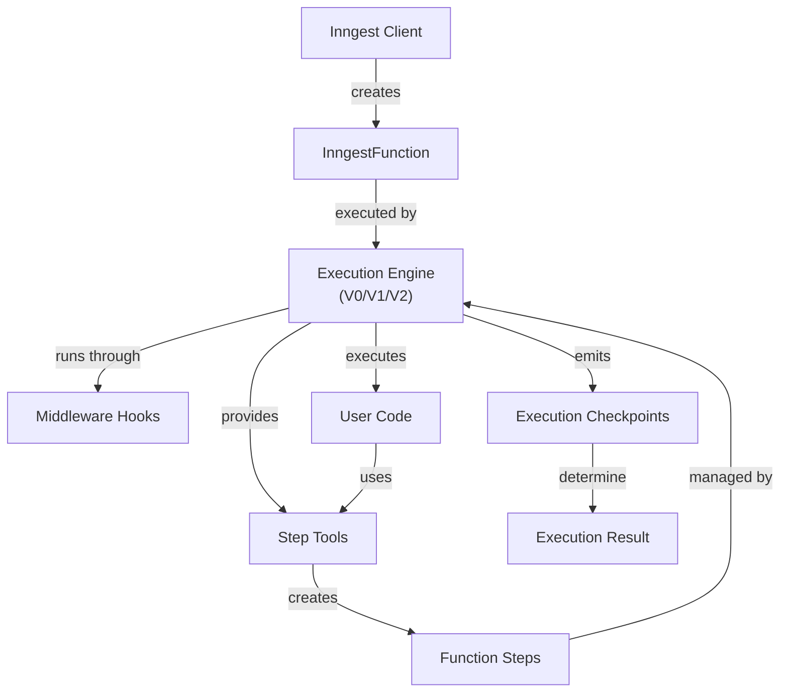

Sources: [packages/inngest/src/components/execution/InngestExecution.ts:45-120](), [packages/inngest/src/components/execution/v1.ts:56-118]()

## Execution Versions

Inngest supports multiple execution versions that represent different implementations of the execution engine:

| Version | Status | Description |
|---------|--------|-------------|
| V0 | Legacy | Original implementation |
| V1 | Current | Default execution version with improved step handling |
| V2 | Experimental | Next-generation execution engine |

The execution version is determined by either:
1. The version specified in the function request from Inngest
2. Defaulting to `PREFERRED_EXECUTION_VERSION` (currently V1)

Source: [packages/inngest/src/components/execution/InngestExecution.ts:53-74](), [packages/inngest/src/helpers/functions.ts:86-105]()

## Execution Lifecycle

When an Inngest function is invoked, it follows this execution flow:

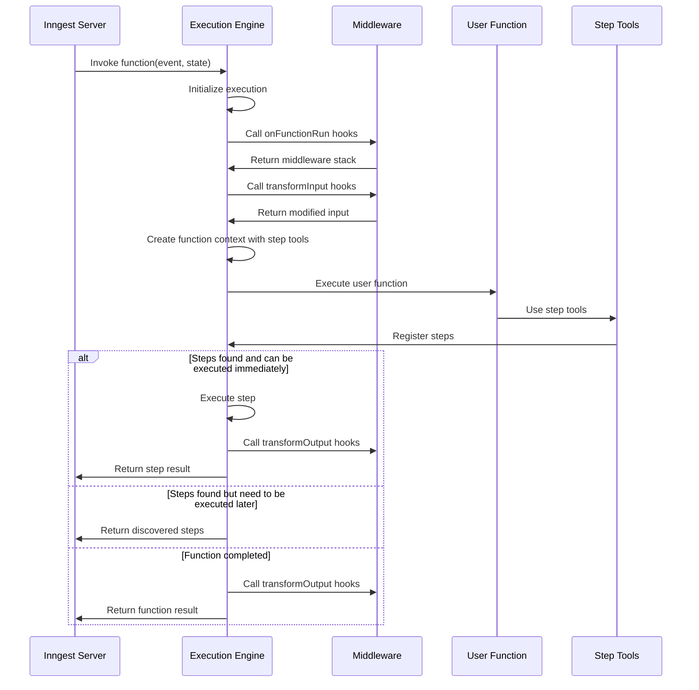

Sources: [packages/inngest/src/components/execution/v1.ts:134-165](), [packages/inngest/src/components/execution/v1.ts:507-546](), [packages/inngest/src/components/InngestMiddleware.ts:126-224]()

## Execution State Management

Each execution maintains state about discovered steps, the function context, and execution progress. This state includes:

1. **Step State** - Information about steps from previous executions
2. **Operation Stack** - The sequence of operations to execute
3. **Function Context** - The context object passed to the user function
4. **Middleware Hooks** - Registered middleware hooks
5. **Execution Checkpoints** - The current stage of execution

Source: [packages/inngest/src/components/execution/v1.ts:634-677](), [packages/inngest/src/components/execution/InngestExecution.ts:29-52]()

## Checkpoints

Checkpoints are the core mechanism for managing the execution flow. They represent different states that an execution can be in:

| Checkpoint Type | Description |
|-----------------|-------------|
| `function-resolved` | The user function completed successfully |
| `function-rejected` | The user function threw an error |
| `steps-found` | New steps were discovered |
| `step-not-found` | A requested step couldn't be found |

Each checkpoint type has a corresponding handler that determines what happens next in the execution.

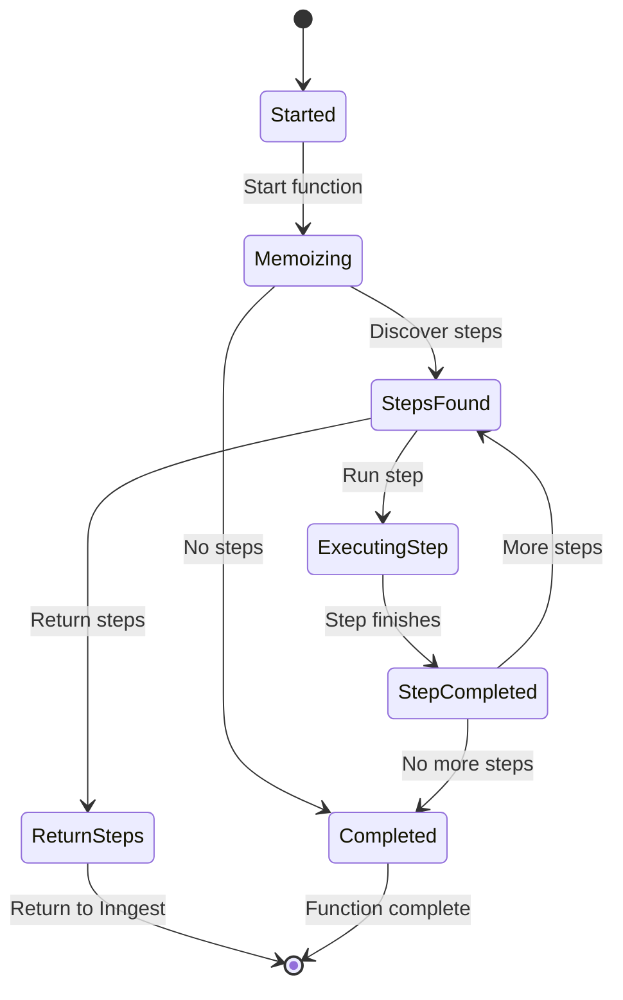

Sources: [packages/inngest/src/components/execution/v1.ts:122-255](), [packages/inngest/src/components/execution/v1.ts:1122-1135]()

## Step Execution

Steps are the core building blocks of Inngest workflows. When a step is executed:

1. The step is marked as executing
2. Middleware hooks are called
3. The step function is executed
4. The result is transformed
5. The step is marked as completed

Steps can be executed immediately or deferred for later execution by Inngest. The execution engine decides this based on:
- Whether a specific step was requested to run
- Whether immediate execution is disabled
- Whether the step can be executed immediately (early execution)

Sources: [packages/inngest/src/components/execution/v1.ts:264-283](), [packages/inngest/src/components/execution/v1.ts:446-502]()

## Step Discovery

When the user function calls step tools like `step.run()` or `step.sleep()`, these steps are discovered and tracked:

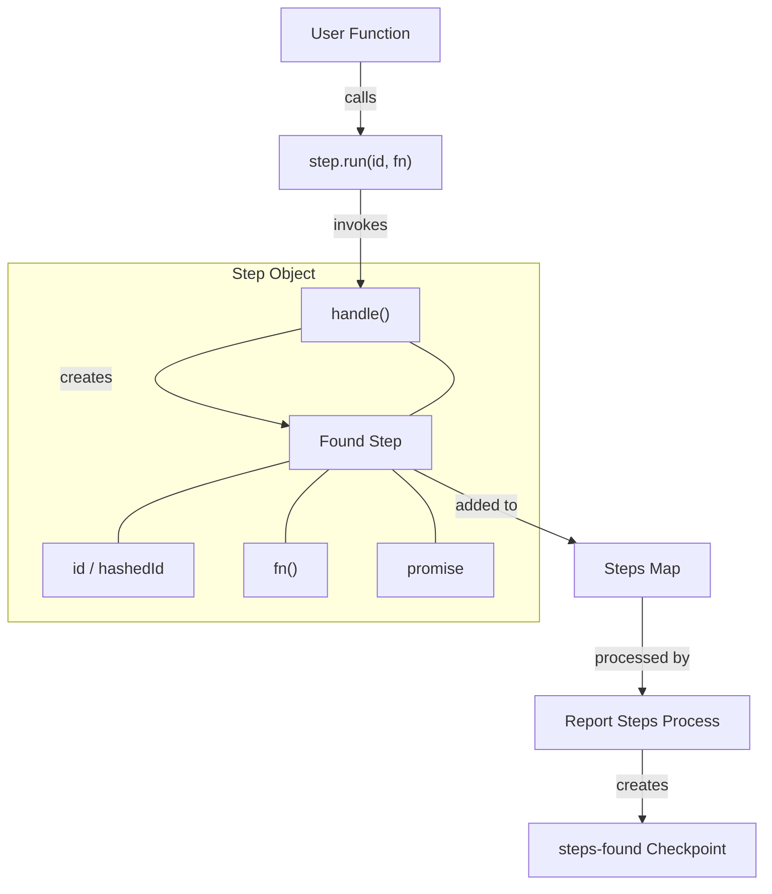

Sources: [packages/inngest/src/components/execution/v1.ts:862-1039](), [packages/inngest/src/components/InngestStepTools.ts:147-632]()

## Middleware Integration

Middleware can hook into various stages of the execution lifecycle:

| Hook | Description |
|------|-------------|
| `transformInput` | Modify the input before execution starts |
| `beforeMemoization` | Called before the function starts to memoize |
| `afterMemoization` | Called after the function has finished memoizing |
| `beforeExecution` | Called before the function starts to execute |
| `afterExecution` | Called after the function has finished executing |
| `transformOutput` | Modify the output before it's returned |
| `finished` | Called when the function has a final response |
| `beforeResponse` | Called before the response is sent |

The execution engine creates a middleware hook stack for the function and calls the appropriate hooks at each stage of execution.

Sources: [packages/inngest/src/components/InngestMiddleware.ts:231-434](), [packages/inngest/src/components/execution/v1.ts:552-633](), [packages/inngest/src/components/execution/v1.ts:1082-1119]()

## Error Handling

The execution system handles errors through:

1. **Error Serialization** - Converting errors to a serializable format
2. **Retriable vs. Non-Retriable Errors** - Determining if an error should be retried
3. **Error Transformation** - Applying middleware transformations to errors
4. **Step Error Handling** - Managing errors in individual steps

Special error classes:
- `NonRetriableError` - Indicates that the error should not be retried
- `RetryAfterError` - Indicates that the error should be retried after a specific time
- `StepError` - Represents an error that occurred in a specific step

Sources: [packages/inngest/src/components/execution/v1.ts:574-633]()

## Function Context and Step Tools

The execution engine creates a context object that is passed to the user function, containing:

1. **Event Data** - The triggering event data
2. **Step Tools** - Tools for building workflows (step.run, step.sleep, etc.)
3. **Custom Context** - Additional context from middleware

Step tools are created dynamically for each function execution using `createStepTools()`.

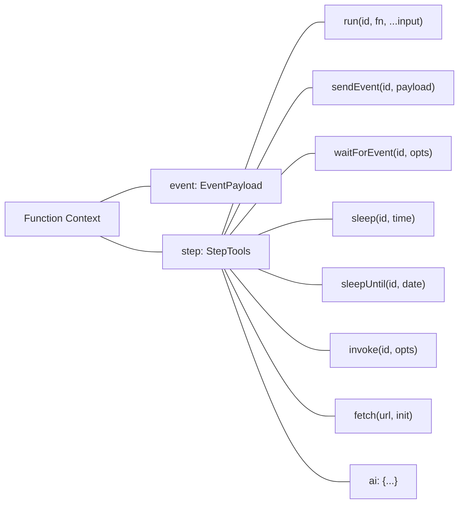

Sources: [packages/inngest/src/components/execution/v1.ts:683-1042](), [packages/inngest/src/components/InngestStepTools.ts:147-632]()

## Execution Results

After executing a function or step, the execution engine returns one of these result types:

| Result Type | Description |
|-------------|-------------|
| `function-resolved` | Function completed successfully with data |
| `function-rejected` | Function completed with an error |
| `steps-found` | New steps were discovered |
| `step-ran` | A step was executed |
| `step-not-found` | A requested step couldn't be found |

Each result type contains the execution context, operations state, and result-specific data.

Source: [packages/inngest/src/components/execution/InngestExecution.ts:11-30]()

## AsyncContext and OpenTelemetry

The execution engine uses AsyncLocalStorage (when available) to maintain execution context across asynchronous boundaries. This enables:

1. Access to the current execution context from anywhere in the code
2. OpenTelemetry integration for distributed tracing
3. Instrumentation of function execution

Source: [packages/inngest/src/components/execution/als.ts:1-75](), [packages/inngest/src/components/execution/v1.ts:98-132]()

## API Integration

The execution engine communicates with the Inngest API to:
1. Retrieve run steps for memoization
2. Get batched events
3. Publish results and events

Source: [packages/inngest/src/api/api.ts:115-140](), [packages/inngest/src/api/schema.ts:1-77]()

## Execution Creation

Execution instances are created using factory functions for each version. The `InngestFunction` class selects the appropriate factory based on the requested version:

```mermaid
flowchart TD
    InngestFunction["InngestFunction"] -->|creates execution| CreateExecution["createExecution()"]
    CreateExecution -->|decides version| VersionHandlers["Version Handlers"]
    VersionHandlers -->|V0| V0Factory["createV0InngestExecution()"]
    VersionHandlers -->|V1| V1Factory["createV1InngestExecution()"]
    VersionHandlers -->|V2| V2Factory["createV2InngestExecution()"]
    
    V0Factory -->|creates| V0Execution["V0InngestExecution"]
    V1Factory -->|creates| V1Execution["V1InngestExecution"]
    V2Factory -->|creates| V2Execution["V2InngestExecution"]
    
    V0Execution -.->|inherits from| BaseExecution["InngestExecution"]
    V1Execution -.->|inherits from| BaseExecution
    V2Execution -.->|inherits from| BaseExecution
```

Sources: [packages/inngest/src/components/InngestFunction.ts:256-272](), [packages/inngest/src/components/execution/v0.ts:49-52](), [packages/inngest/src/components/execution/v1.ts:56-59](), [packages/inngest/src/components/execution/v2.ts:55-58]()

# Step Tools


Step Tools are the core workflow building primitives provided by the Inngest SDK. They enable you to create reliable, deterministic, and independently retryable operations within your functions. This document explains what Step Tools are, how they work, and how to use them effectively in your Inngest functions.

## Purpose and Overview

Step Tools serve as the fundamental units of work in Inngest functions. They provide various capabilities including:

- Running business logic with automatic retries
- Sending events
- Waiting for specific events to occur
- Managing time-based operations like delays and scheduling
- Invoking other functions
- Making HTTP requests
- Interacting with AI models

Each step in your function is automatically tracked by Inngest's execution engine, allowing for memoization, deterministic execution, and independent retries of individual steps when failures occur.

For information about the function execution model that powers Step Tools, see [Function Execution](#2.2).

## Architecture and Integration

Step Tools are dynamically created for each function execution and are accessible through the `step` property in the function context. They are designed to interact with Inngest's execution engine to provide memoization, retries, and step tracking.

```mermaid
flowchart TB
    subgraph "Inngest Function Execution"
        FnContext["Function Context"]
        StepTools["Step Tools"]
        ExecutionEngine["Execution Engine"]
        FnState["Function State"]
        
        FnContext -->|"contains"| StepTools
        StepTools -->|"reports steps to"| ExecutionEngine
        ExecutionEngine -->|"manages"| FnState
        FnState -->|"determines execution of"| StepTools
    end
    
    Client["User Code"] -->|"invokes"| FnContext
```

Sources: [packages/inngest/src/components/InngestStepTools.ts:148-632](packages/inngest/src/components/InngestStepTools.ts:148-632), [packages/inngest/src/components/execution/v1.ts:56-1120](packages/inngest/src/components/execution/v1.ts:56-1120)

### Step Tool Creation

Step Tools are created by the `createStepTools` function, which is called by the execution engine during function initialization. This function returns an object with various methods that can be used to define steps in your workflow.

Each Step Tool method follows a similar pattern:
1. Accept a step ID or options and function-specific parameters
2. Generate a unique operation descriptor
3. Register the step with the execution engine
4. Return a promise that resolves when the step completes

```mermaid
sequenceDiagram
    participant User as "User Code"
    participant Step as "Step Tool"
    participant Handler as "Step Handler"
    participant Engine as "Execution Engine"
    
    User->>Step: step.run("stepId", async () => { /* logic */ })
    Step->>Handler: stepHandler({args, matchOp, opts})
    Handler->>Engine: Register step & create promise
    Engine-->>Handler: Track step state
    Handler-->>Step: Return promise
    Step-->>User: Await promise result
    
    Note over Engine: When step should execute
    Engine->>Handler: Execute step function
    Handler->>User: Run user logic
    User-->>Handler: Return result
    Handler-->>Engine: Report step completion
    Engine-->>Step: Resolve promise with result
    Step-->>User: Function continues
```

Sources: [packages/inngest/src/components/InngestStepTools.ts:96-146](packages/inngest/src/components/InngestStepTools.ts:96-146), [packages/inngest/src/components/execution/v1.ts:264-502](packages/inngest/src/components/execution/v1.ts:264-502)

## Available Step Tools

Inngest provides a rich set of Step Tools to handle various workflow scenarios:

```mermaid
classDiagram
    class StepTools {
        +run(id, fn, ...args) Promise
        +sendEvent(id, payload) Promise
        +waitForEvent(id, opts) Promise
        +sleep(id, time) Promise
        +sleepUntil(id, time) Promise
        +invoke(id, opts) Promise
        +fetch(url, init) Promise
        +ai Object
    }
    
    class AITools {
        +infer(id, options) Promise
        +wrap(id, fn, ...args) Promise
        +models Object
    }
    
    StepTools --> AITools : ai
```

Sources: [packages/inngest/src/components/InngestStepTools.ts:254-602](packages/inngest/src/components/InngestStepTools.ts:254-602)

### Core Business Logic Tool: step.run()

The most fundamental Step Tool is `step.run()`, which executes business logic as a retry-safe step.

```typescript
await step.run("unique-step-id", async () => {
  // Business logic here
  return result;
});
```

This tool ensures that the provided function:
- Is executed only once across retries
- Can be independently retried if it fails
- Has its inputs and outputs tracked for visibility

Sources: [packages/inngest/src/components/InngestStepTools.ts:366-366](packages/inngest/src/components/InngestStepTools.ts:366-366), [packages/inngest/src/components/InngestStepTools.ts:190-246](packages/inngest/src/components/InngestStepTools.ts:190-246)

### Event Tools

#### step.sendEvent()

This tool sends events to Inngest in a retry-safe manner:

```typescript
await step.sendEvent("send-notification-event", {
  name: "app/notification.sent",
  data: { userId: "123", message: "Hello!" }
});
```

It ensures that events are sent exactly once, even if the function is retried.

Sources: [packages/inngest/src/components/InngestStepTools.ts:281-303](packages/inngest/src/components/InngestStepTools.ts:281-303)

#### step.waitForEvent()

This tool pauses execution until a specific event is received:

```typescript
const event = await step.waitForEvent("wait-for-payment", {
  event: "app/payment.completed",
  timeout: "1h",
  match: "data.orderId" // Optional matching condition
});
```

It allows workflows to react to external events and can be configured with timeout and matching conditions.

Sources: [packages/inngest/src/components/InngestStepTools.ts:314-352](packages/inngest/src/components/InngestStepTools.ts:314-352), [packages/inngest/src/components/InngestStepTools.ts:685-745](packages/inngest/src/components/InngestStepTools.ts:685-745)

### Time-based Tools

#### step.sleep()

This tool pauses execution for a specified duration:

```typescript
await step.sleep("delay-30-seconds", "30s");
```

Sources: [packages/inngest/src/components/InngestStepTools.ts:432-458](packages/inngest/src/components/InngestStepTools.ts:432-458)

#### step.sleepUntil()

This tool pauses execution until a specific time:

```typescript
await step.sleepUntil("wait-until-tomorrow", new Date(tomorrow));
```

Sources: [packages/inngest/src/components/InngestStepTools.ts:466-508](packages/inngest/src/components/InngestStepTools.ts:466-508)

### Function Invocation: step.invoke()

This tool invokes another Inngest function:

```typescript
const result = await step.invoke("run-other-function", {
  function: otherFunction, // or a string ID
  data: { /* input data */ }
});
```

It allows composition of functions and can be used to create modular workflows.

Sources: [packages/inngest/src/components/InngestStepTools.ts:518-592](packages/inngest/src/components/InngestStepTools.ts:518-592), [packages/inngest/src/components/InngestStepTools.ts:651-679](packages/inngest/src/components/InngestStepTools.ts:651-679)

### HTTP Tool: step.fetch()

This tool provides a durable, retry-safe fetch implementation:

```typescript
const response = await step.fetch("https://api.example.com/data", {
  method: "POST",
  body: JSON.stringify({ key: "value" })
});
```

Sources: [packages/inngest/src/components/InngestStepTools.ts:594-602](packages/inngest/src/components/InngestStepTools.ts:594-602)

### AI Tools

#### step.ai.infer()

This tool runs AI inference operations:

```typescript
const completion = await step.ai.infer("generate-text", {
  model: step.ai.models.openai({ model: "gpt-4" }),
  body: {
    messages: [{ role: "user", content: "Hello!" }]
  }
});
```

Sources: [packages/inngest/src/components/InngestStepTools.ts:378-402](packages/inngest/src/components/InngestStepTools.ts:378-402), [packages/inngest/src/components/InngestStepTools.ts:750-775](packages/inngest/src/components/InngestStepTools.ts:750-775)

#### step.ai.wrap()

This tool wraps AI-related functions for better observability:

```typescript
await step.ai.wrap("call-embeddings-api", async () => {
  // AI function logic
});
```

Sources: [packages/inngest/src/components/InngestStepTools.ts:412-412](packages/inngest/src/components/InngestStepTools.ts:412-412)

## How Step Tools Work Internally

Step Tools rely on a sophisticated execution engine to provide deterministic behavior and retry capabilities.

### Step Identification and Memoization

Each step is uniquely identified using a combination of:
- The user-provided ID
- The operation type
- The step's position in the execution flow

This identification ensures that steps are properly tracked and memoized across function runs.

```mermaid
flowchart TD
    subgraph "Step Identification Process"
        StepInvocation["Step Tool Invocation"] -->|"User provides"| StepID["Step ID/Options"]
        StepID -->|"Combined with"| StepType["Operation Type"]
        StepType -->|"Creates"| OpObject["Operation Object"]
        OpObject -->|"Hashed to"| HashedID["Unique Hashed ID"]
        HashedID -->|"Used for"| Tracking["Step Tracking & Memoization"]
    end
```

Sources: [packages/inngest/src/components/execution/v1.ts:872-927](packages/inngest/src/components/execution/v1.ts:872-927), [packages/inngest/src/components/execution/v1.ts:40-82](packages/inngest/src/components/execution/v1.ts:40-82)

### Step Execution Flow

The internal execution flow of a step involves:

1. **Registration**: When a step is encountered, it's registered with the execution engine
2. **State Check**: The engine checks if the step has already been executed
3. **Execution Decision**: Based on the state, the engine decides whether to execute the step
4. **Memoization**: The step's result is memoized for future retries

```mermaid
stateDiagram-v2
    [*] --> StepEncountered
    StepEncountered --> CheckState: Register with engine
    
    state CheckState {
        [*] --> StateExists
        StateExists --> Yes: Skip execution
        StateExists --> No: Execute step
        Yes --> [*]: Return memoized result
        No --> [*]: Proceed to execution
    }
    
    CheckState --> ExecuteStep: If not memoized
    ExecuteStep --> StoreResult: Save result
    StoreResult --> [*]: Return result
    
    CheckState --> ReturnMemoized: If memoized
    ReturnMemoized --> [*]
```

Sources: [packages/inngest/src/components/execution/v1.ts:137-165](packages/inngest/src/components/execution/v1.ts:137-165), [packages/inngest/src/components/execution/v1.ts:264-339](packages/inngest/src/components/execution/v1.ts:264-339)

### Parallel Step Handling

The execution engine includes sophisticated handling for parallel steps:

- Steps executed in parallel are automatically indexed with unique IDs
- The engine detects potential non-determinism in parallel execution
- Warnings are provided for problematic patterns like nested steps

Sources: [packages/inngest/src/components/execution/v1.ts:765-791](packages/inngest/src/components/execution/v1.ts:765-791), [packages/inngest/src/components/execution/v1.ts:913-927](packages/inngest/src/components/execution/v1.ts:913-927)

### Error Handling and Retries

Step Tool errors are captured and processed by the execution engine:

- Errors can be marked as retriable or non-retriable
- Custom error types like `NonRetriableError` and `RetryAfterError` provide fine-grained control
- Error serialization ensures proper error handling across retries

Sources: [packages/inngest/src/components/execution/v1.ts:574-632](packages/inngest/src/components/execution/v1.ts:574-632)

## Best Practices for Using Step Tools

1. **Use unique step IDs**: Provide meaningful, unique IDs for each step to ensure proper tracking and debugging.

2. **Wrap all asynchronous operations in steps**: Use `step.run()` for all business logic to make your workflows more resilient.

3. **Prefer Step Tools over direct alternatives**: Use `step.sendEvent()` instead of direct event sending and `step.fetch()` instead of global `fetch()`.

4. **Avoid nesting steps**: Steps should not be nested within other steps, as this can lead to unexpected behavior.

5. **Handle errors appropriately**: Consider which errors should be retriable and which should not.

6. **Ensure deterministic execution**: Steps should produce the same results when given the same inputs to ensure predictable behavior across retries.

Sources: [packages/inngest/src/components/execution/v1.ts:882-910](packages/inngest/src/components/execution/v1.ts:882-910), [packages/inngest/src/components/InngestStepTools.ts:254-602](packages/inngest/src/components/InngestStepTools.ts:254-602)

## Step Tools in the Execution Lifecycle

Step Tools are deeply integrated with Inngest's execution lifecycle, interacting with the execution engine at various points:

```mermaid
flowchart TB
    subgraph "Execution Lifecycle"
        Init["Initialize Function"] --> Mem["Memoization Phase"]
        Mem --> Exec["Execution Phase"]
        Exec --> Resp["Response Phase"]
    end
    
    subgraph "Step Tools Integration"
        StepTools["Create Step Tools"] --> Mem
        StepReg["Register Steps"] --> Mem
        StepExec["Execute Steps"] --> Exec
        StepMem["Memoize Results"] --> Resp
    end
```

The execution engine maintains function state throughout this lifecycle, ensuring that steps are properly tracked, executed, and memoized.

Sources: [packages/inngest/src/components/execution/v1.ts:99-165](packages/inngest/src/components/execution/v1.ts:99-165), [packages/inngest/src/components/execution/InngestExecution.ts:9-118](packages/inngest/src/components/execution/InngestExecution.ts:9-118)

## Conclusion

Step Tools are a powerful abstraction that enable the creation of reliable, deterministic workflows in Inngest. By understanding how they work and following best practices, you can build robust applications that gracefully handle failures and scale efficiently.