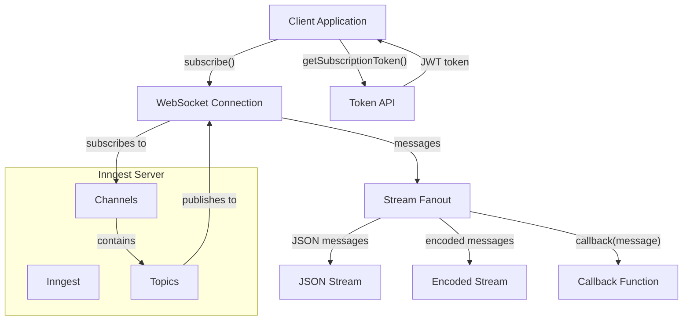
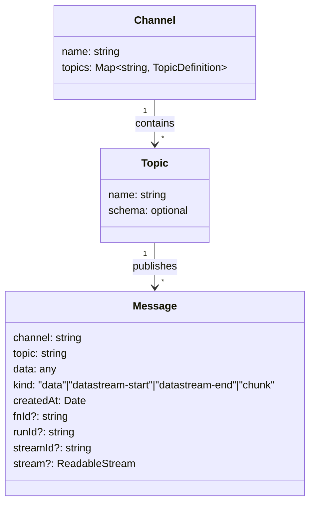
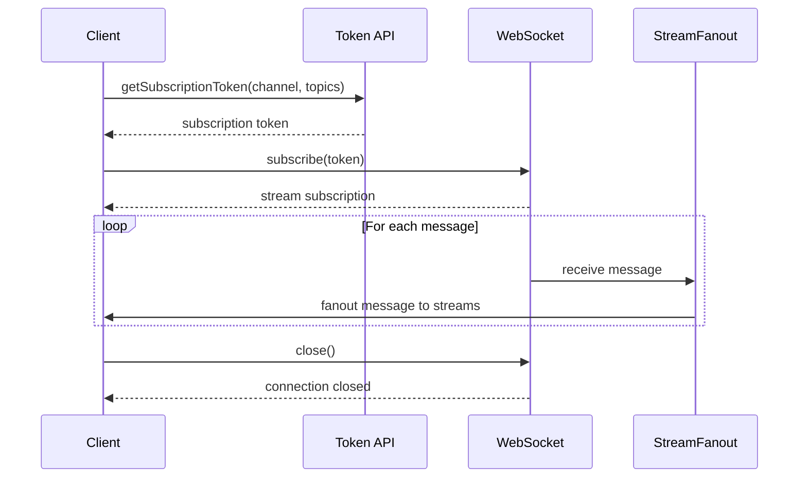

The Inngest Realtime System provides publish/subscribe capabilities for receiving updates from Inngest in real-time. It enables bidirectional communication between your application and Inngest, allowing you to receive streaming updates when events occur or functions run.

## Overview

The `@inngest/realtime` package enables real-time communication with Inngest via WebSockets. It provides a type-safe way to define channels and topics, subscribe to them, and receive messages as they occur.

Key capabilities include:
- Subscribing to channels and topics
- Receiving real-time messages via WebSockets
- Streaming message data using standard Web APIs
- Validating message payloads with schemas
- React hooks for easy integration with React applications



Sources: [packages/realtime/src/subscribe/helpers.ts:10-87](), [packages/realtime/src/subscribe/TokenSubscription.ts:12-525]()

## Core Concepts

### Channels and Topics

The Realtime system organizes messages into channels and topics:

- **Channel**: A named group of topics, like a room or namespace
- **Topic**: A specific type of message within a channel

Channels can be static (fixed name) or dynamic (generated name), and topics can have optional schemas for validation.



Sources: [packages/realtime/src/index.test.ts:64-72](), [packages/realtime/src/subscribe/TokenSubscription.ts:147-201]()

### Subscription Flow

When subscribing to real-time updates, the following flow occurs:

1. Obtain a subscription token (either directly or via `getSubscriptionToken()`)
2. Call `subscribe()` with the token to establish a WebSocket connection
3. Receive and process messages via Stream API or callback function



Sources: [packages/realtime/src/subscribe/helpers.ts:10-87](), [packages/realtime/src/subscribe/TokenSubscription.ts:102-400]()

## Core Components

### TokenSubscription

The `TokenSubscription` class manages the WebSocket connection and message processing. It:

- Establishes and maintains the WebSocket connection
- Processes incoming messages
- Routes messages to the appropriate streams
- Handles stream data validation and transformation

Sources: [packages/realtime/src/subscribe/TokenSubscription.ts:12-525]()

### StreamFanout

The `StreamFanout` class distributes messages to multiple output streams, enabling one subscription to feed multiple consumers. It handles:

- Creating output streams with optional transformation
- Writing to all registered streams
- Managing stream backpressure
- Closing streams when the connection terminates

Sources: [packages/realtime/src/subscribe/StreamFanout.ts:4-82]()

## API Reference

### Subscription Functions

#### `subscribe()`

Creates a subscription to a channel and set of topics, returning a `ReadableStream` of messages.

```typescript
const stream = await subscribe({
  channel: "my-channel",
  topics: ["created", "updated"],
});

// With callback
await subscribe(
  { channel: "my-channel", topics: ["created", "updated"] },
  (message) => console.log(message)
);
```

Sources: [packages/realtime/src/subscribe/helpers.ts:10-87]()

#### `getSubscriptionToken()`

Retrieves a token for subscribing to a channel and topics.

```typescript
const token = await getSubscriptionToken(app, {
  channel: "my-channel",
  topics: ["created", "updated"],
});

const stream = await subscribe(token);
```

Sources: [packages/realtime/src/subscribe/helpers.ts:92-142]()

### React Hooks

#### `useInngestSubscription()`

A React hook for subscribing to real-time updates in a React component.

```typescript
const { data, latestData, freshData, error, state } = useInngestSubscription({
  token: subscriptionToken,
  refreshToken: async () => await getNewToken(),
  enabled: true,
  bufferInterval: 100,
});
```

The hook returns:
- `data`: All messages received since mount
- `latestData`: The most recent message
- `freshData`: New messages since the last buffer interval
- `error`: Any subscription error
- `state`: Current subscription state

Sources: [packages/realtime/src/hooks.ts:47-220]()

## Message Types

The Realtime system supports different types of messages:

| Message Kind | Description | Properties |
|--------------|-------------|------------|
| `data` | Regular message with a data payload | `channel`, `topic`, `data`, `createdAt`, `fnId?`, `runId?` |
| `datastream-start` | Indicates the start of a stream | `channel`, `topic`, `data` (stream ID), `streamId`, `stream` |
| `datastream-end` | Indicates the end of a stream | `channel`, `topic`, `data` (stream ID), `streamId`, `stream` |
| `chunk` | A piece of data in a stream | `channel`, `topic`, `data`, `streamId`, `stream` |

Sources: [packages/realtime/src/subscribe/TokenSubscription.ts:165-380]()

## Environment Configuration

The Realtime system can be configured using environment variables:

| Variable | Description |
|----------|-------------|
| `INNGEST_DEV` | Set to `true` to connect to the local dev server |
| `INNGEST_BASE_URL` | Custom base URL for the Inngest API |
| `INNGEST_API_BASE_URL` | Custom base URL for the Inngest API (alternative) |
| `INNGEST_SIGNING_KEY` | Signing key for authentication |
| `INNGEST_SIGNING_KEY_FALLBACK` | Fallback signing key |

The system also supports various framework-specific public environment variables (e.g., `NEXT_PUBLIC_*`, `REACT_APP_*`).

Sources: [packages/realtime/src/env.ts:29-110](), [packages/realtime/src/api.ts:4-83]()

## Stream Processing

When subscribing to real-time updates, you can consume messages in several ways:

### Using Stream API

```typescript
const stream = await subscribe({
  channel: "my-channel",
  topics: ["created", "updated"],
});

// Using for-await-of
for await (const message of stream) {
  console.log(message);
}

// Using reader
const reader = stream.getReader();
while (true) {
  const { done, value } = await reader.read();
  if (done) break;
  console.log(value);
}
```

### Using Callback Function

```typescript
await subscribe(
  { channel: "my-channel", topics: ["created", "updated"] },
  (message) => console.log(message)
);
```

### Getting Different Stream Formats

```typescript
const stream = await subscribe({...});

// Get JSON stream
const jsonStream = stream.getJsonStream();

// Get encoded stream (for Response objects)
const encodedStream = stream.getEncodedStream();
```

Sources: [packages/realtime/src/subscribe/TokenSubscription.ts:489-524]()

## Integration with Inngest Functions

The Realtime system can be used to publish messages from Inngest functions using the `realtimeMiddleware`:

```typescript
import { Inngest } from "inngest";
import { realtimeMiddleware } from "@inngest/realtime";

const inngest = new Inngest({
  id: "my-app",
  middleware: [realtimeMiddleware()],
});

const fn = inngest.createFunction(
  { id: "my-function" },
  { event: "app/event" },
  async ({ event, step, publish }) => {
    // Publish a message to a channel/topic
    await publish({
      channel: "my-channel",
      topic: "created",
      data: { id: "123", name: "Example" },
    });
  }
);
```

Sources: [packages/realtime/src/middleware.ts:6-68]()

## Usage Examples

### Basic Subscription

```typescript
import { subscribe } from "@inngest/realtime";

// Subscribe to a channel and topics
const stream = await subscribe({
  channel: "my-channel",
  topics: ["created", "updated"],
});

// Process messages
for await (const message of stream) {
  if (message.topic === "created") {
    console.log("New item created:", message.data);
  } else if (message.topic === "updated") {
    console.log("Item updated:", message.data);
  }
}
```

### With React

```typescript
import { useInngestSubscription } from "@inngest/realtime/hooks";

function MyComponent() {
  const { data, latestData, error, state } = useInngestSubscription({
    token: {
      channel: "my-channel",
      topics: ["created", "updated"],
      key: "my-token", // Optional, will attempt to fetch if not provided
    },
  });

  if (state === "connecting") {
    return <div>Connecting...</div>;
  }

  if (error) {
    return <div>Error: {error.message}</div>;
  }

  return (
    <div>
      <h2>Latest message: {latestData?.topic}</h2>
      <pre>{JSON.stringify(latestData?.data, null, 2)}</pre>
      
      <h2>All messages:</h2>
      <ul>
        {data.map((msg, i) => (
          <li key={i}>
            {msg.topic}: {JSON.stringify(msg.data)}
          </li>
        ))}
      </ul>
    </div>
  );
}
```

Sources: [packages/realtime/src/hooks.ts:47-220]()

## Conclusion

The Inngest Realtime System provides a robust, type-safe way to receive real-time updates from Inngest. It leverages modern Web APIs like WebSockets and Streams to deliver messages efficiently, with support for schema validation and React integration.

For more information about the Core SDK that powers Inngest's event processing, see [Core SDK](#2).