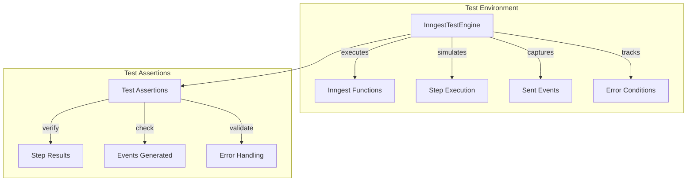
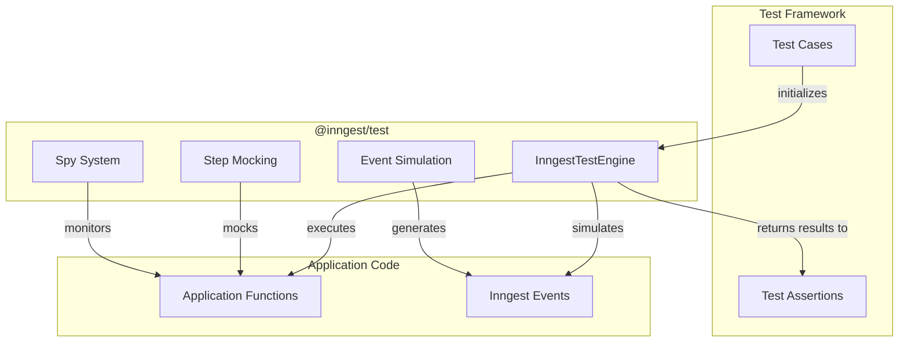
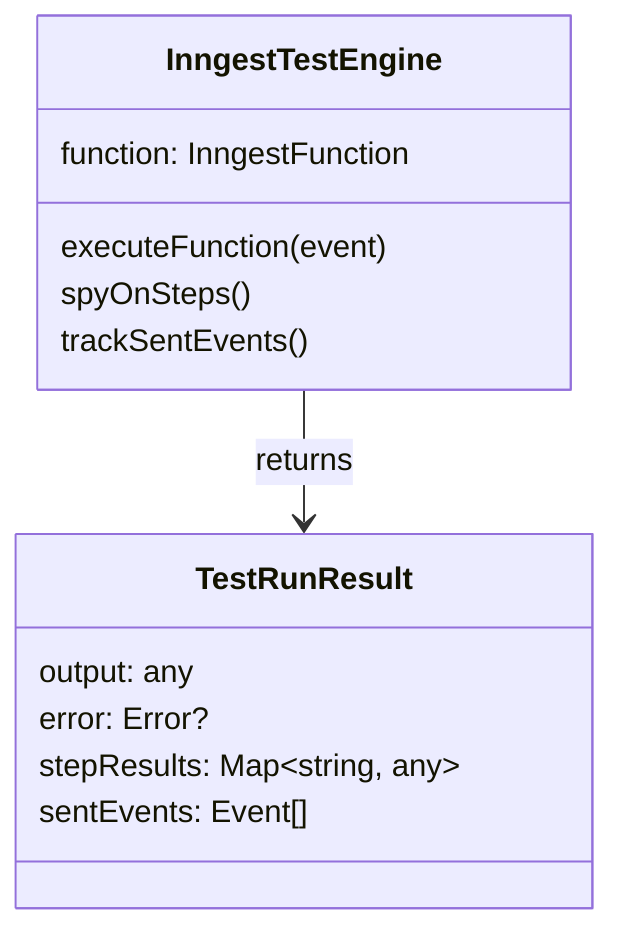
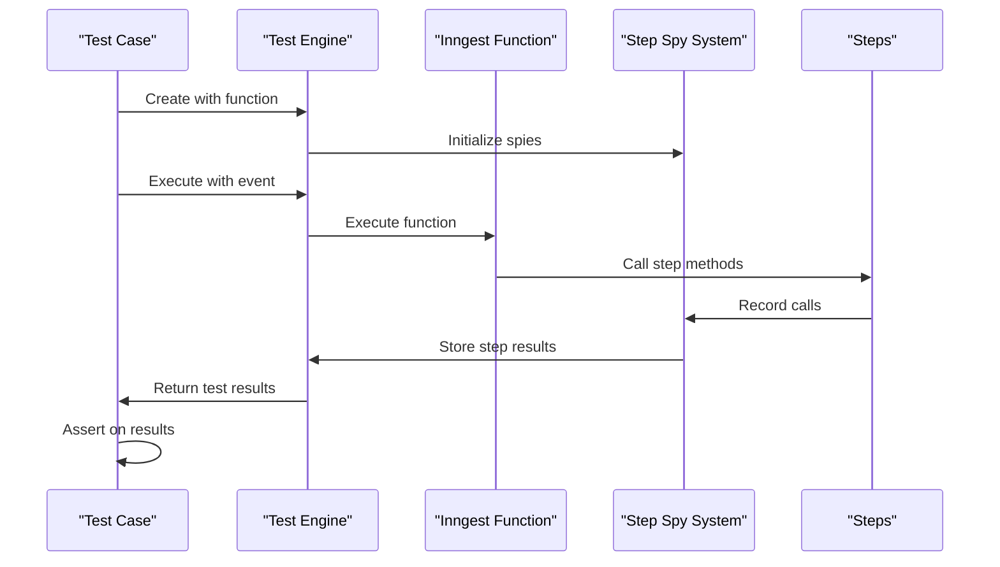
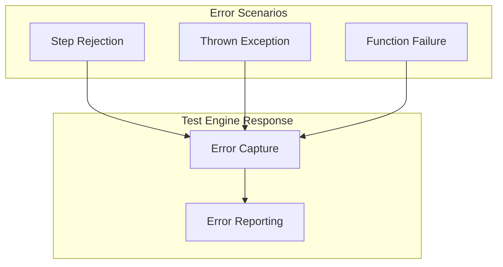
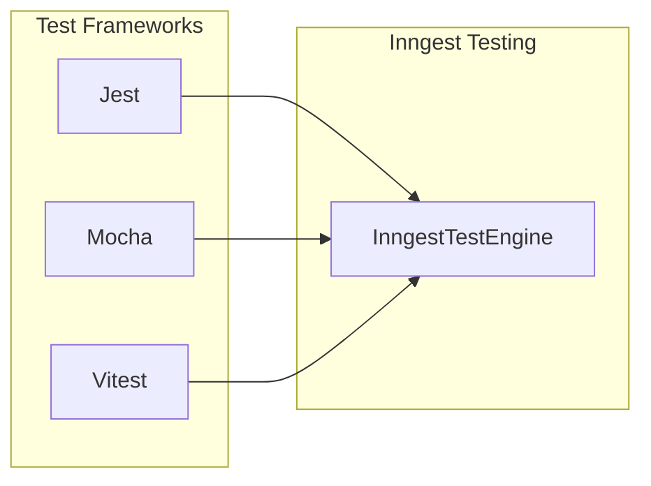

This document provides comprehensive documentation on testing utilities and practices for Inngest functions. The `@inngest/test` package offers specialized tooling designed to simplify the testing of Inngest functions without requiring a live connection to the Inngest platform.

## Overview of Inngest Testing

The `@inngest/test` package provides a simulated execution environment that allows developers to verify the behavior of their Inngest functions in isolation. This enables unit and integration testing of function logic, step execution, event handling, and error scenarios.

Sources: [packages/test/package.json:1-51](), [packages/test/CHANGELOG.md:1-49]()

## Testing Architecture

The Inngest testing system is designed to simulate the execution environment that your Inngest functions run in, making it possible to test function behavior without requiring a connection to the Inngest platform.

Sources: [packages/test/package.json:43-46](), [packages/test/CHANGELOG.md:5-7]()

## The Test Engine

The `InngestTestEngine` is the core component of the testing system. It provides a simulated environment for executing Inngest functions and capturing their behavior.

The `InngestTestEngine` is designed to be flexible, supporting Inngest functions from different versions of the `inngest` package. This makes it easy to test functions regardless of the specific version your project is using.

Sources: [packages/test/CHANGELOG.md:5-7]()

## Testing Functions

To test an Inngest function, you create an instance of the `InngestTestEngine` with your function and then execute it with a test event.

The test engine executes your function and captures:
- Function output
- Results from each step
- Any events sent during execution
- Errors that occur during execution

By examining these outputs, you can verify that your function behaves as expected under various conditions.

Sources: [packages/test/CHANGELOG.md:26-42]()

## Automatic Spying

The `@inngest/test` package includes automatic spying functionality that monitors calls to step methods (like `step.run`, `step.sendEvent`, etc.). This allows you to verify that your steps are being called with the correct parameters without having to manually set up spies.

The spy system is designed to work with all step methods, including nested methods like `step.**`.

Sources: [packages/test/CHANGELOG.md:26-30]()

## Error Handling

The testing package provides robust error handling, allowing you to test how your functions behave when errors occur. When a step rejects or throws an error, the test engine captures this and includes it in the test results.

This allows you to verify that your function's error handling works correctly and that errors are properly captured and reported.

Sources: [packages/test/CHANGELOG.md:32-42]()

## Example Usage

While I don't have direct access to example code, based on the package structure and changelog, a typical test using `@inngest/test` might follow this pattern:

1. Import your Inngest function and the test engine
2. Create a test engine instance with your function
3. Execute the function with a test event
4. Assert on the results

This approach allows you to thoroughly test your Inngest functions, including their step execution, event sending, and error handling capabilities.

## Dependencies

The `@inngest/test` package has the following dependencies:

| Dependency | Purpose |
|------------|---------|
| `inngest`  | Core Inngest functionality |
| `tinyspy`  | Provides spying capabilities for monitoring function and step execution |
| `ulid`     | Generates unique identifiers for test events and executions |

Sources: [packages/test/package.json:43-46]()

## Recent Improvements

Recent improvements to the testing package include:

- Loosened typing for `InngestTestEngine` to support functions from different versions of Inngest
- Fixed issues with steps running twice in some scenarios
- Improved error reporting when steps reject or throw errors
- Enhanced automatic spying to better handle `step.**` methods
- Simplified the public API for easier test creation

Sources: [packages/test/CHANGELOG.md:1-49]()

## Integration with Test Frameworks

The `@inngest/test` package is designed to work with popular JavaScript testing frameworks like Jest, Mocha, or Vitest. It provides a framework-agnostic API that can be integrated into your existing test suite.

This flexibility allows you to use the testing tools you're already familiar with while taking advantage of the specialized capabilities of the Inngest testing package.

Sources: [packages/test/package.json:1-51]()