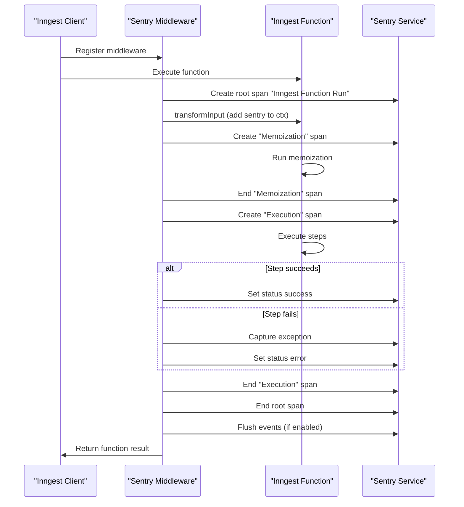
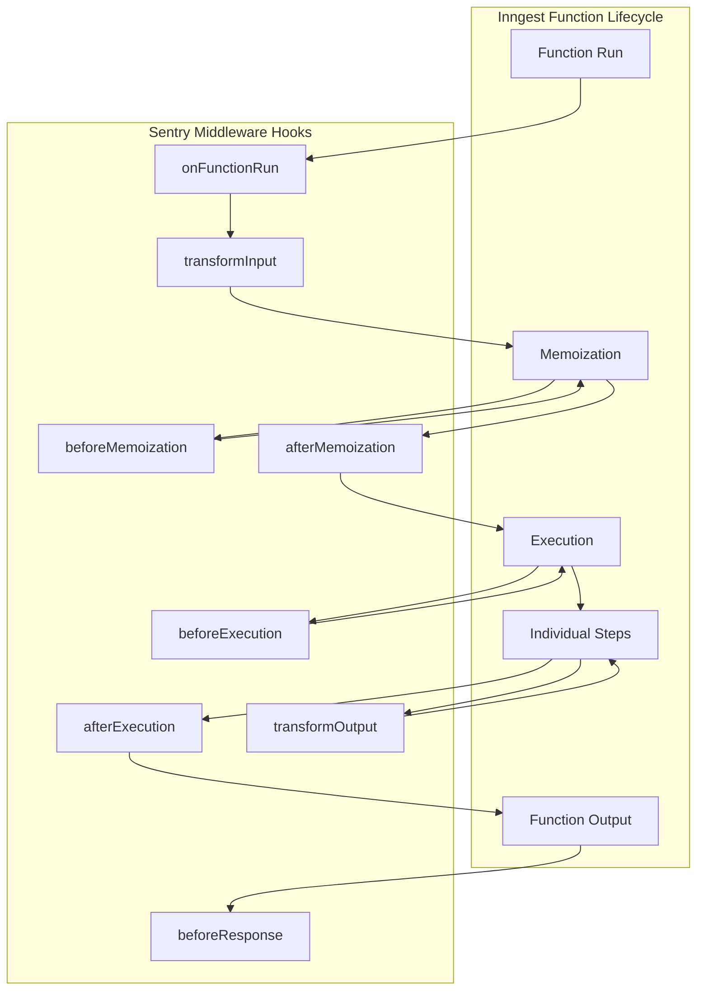
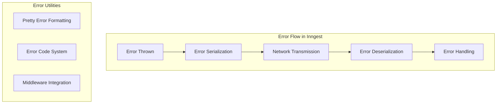
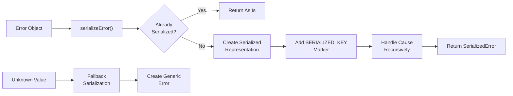
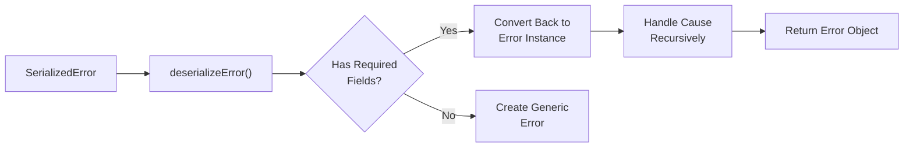
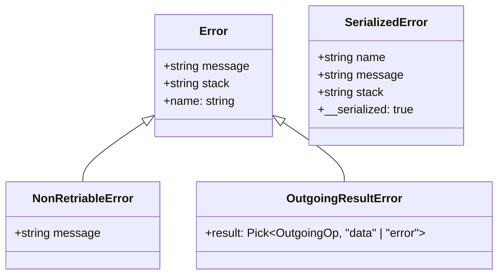
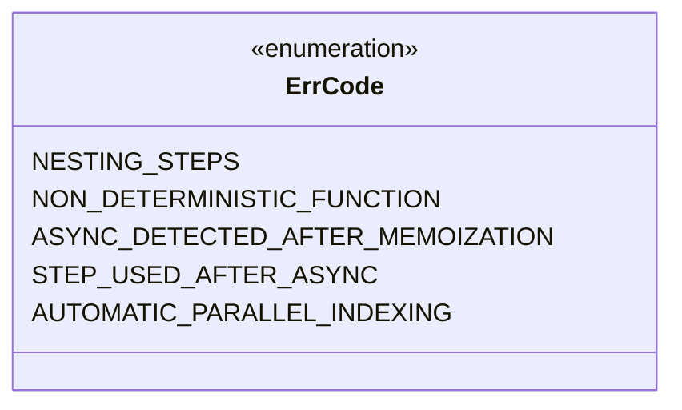
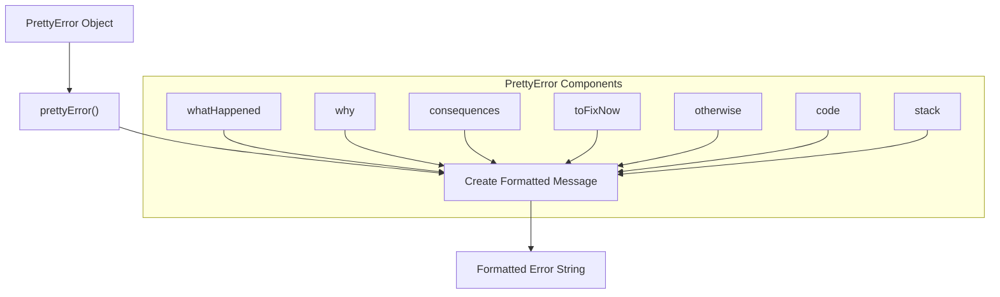
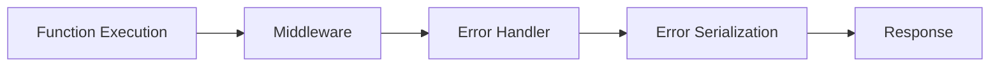

pnpm add @inngest/middleware-sentry
```

### 2. Set up Sentry

Ensure that Sentry is properly initialized in your application before using this middleware. This typically involves:

```javascript
import * as Sentry from "@sentry/node";

Sentry.init({
  dsn: "your-sentry-dsn",
  // Other Sentry configuration options
});
```

Sources: [packages/middleware-sentry/package.json:1-51](), [packages/middleware-sentry/src/middleware.ts:61-62]()

## Usage

### Basic Implementation

```javascript
import { Inngest } from "inngest";
import { sentryMiddleware } from "@inngest/middleware-sentry";

// Create an Inngest client with the Sentry middleware
const inngest = new Inngest({
  id: "my-app",
  middleware: [
    sentryMiddleware()
  ]
});

// Define your functions as usual
inngest.createFunction(
  { id: "example-function" },
  { event: "app/event" },
  async ({ event, step }) => {
    // Your function logic here
  }
);
```

### Accessing Sentry in Your Functions

The middleware adds a `sentry` property to the context that you can use directly in your functions:

```javascript
inngest.createFunction(
  { id: "example-with-sentry" },
  { event: "app/event" },
  async ({ event, step, ctx }) => {
    // Access the Sentry client directly
    ctx.sentry.captureMessage("Custom message");
    
    // Create custom spans
    return await ctx.sentry.startSpan({ name: "Custom Operation" }, async () => {
      // Operation code here
      return result;
    });
  }
);
```

Sources: [packages/middleware-sentry/src/middleware.ts:64-196](), [packages/middleware-sentry/src/middleware.ts:104-106]()

## How It Works



Sources: [packages/middleware-sentry/src/middleware.ts:74-189]()

### Middleware Components and Flow

The Sentry middleware integrates at various points in the Inngest function execution lifecycle:

1. **Function Run Initialization**: Creates a root span for the entire function execution
2. **Context Augmentation**: Adds the Sentry client to the function context
3. **Memoization Tracking**: Creates spans before and after the memoization phase
4. **Execution Tracking**: Creates spans to track the actual function execution
5. **Error Handling**: Captures any errors that occur during function execution
6. **Finalization**: Ends all spans and optionally flushes events to Sentry



Sources: [packages/middleware-sentry/src/middleware.ts:74-185]()

## Configuration Options

The `sentryMiddleware` function accepts an options object with the following properties:

| Option | Type | Default | Description |
|--------|------|---------|-------------|
| `disableAutomaticFlush` | boolean | `false` | If `true`, the middleware will not automatically flush events after each function run. This can be useful if you want to control when events are sent to Sentry, or leave it to Sentry's default behavior. By default (`false`), automatic flushing is enabled to ensure that events are sent in serverless environments where the runtime may be terminated when the function returns. |

Example with options:

```javascript
import { Inngest } from "inngest";
import { sentryMiddleware } from "@inngest/middleware-sentry";

const inngest = new Inngest({
  id: "my-app",
  middleware: [
    sentryMiddleware({
      disableAutomaticFlush: true
    })
  ]
});
```

Sources: [packages/middleware-sentry/src/middleware.ts:12-25](), [packages/middleware-sentry/src/middleware.ts:182-184]()

## Sentry Contextual Data

The middleware automatically attaches the following tags and context to every Sentry event:

| Tag | Description |
|-----|-------------|
| `inngest.client.id` | The ID of the Inngest client |
| `inngest.function.id` | The ID of the function being executed |
| `inngest.function.name` | The name of the function |
| `inngest.event.id` | The ID of the event that triggered the function |
| `inngest.event.name` | The name of the event |
| `inngest.run.id` | The ID of the current function run |
| `inngest.step.name` | The name of the current step (if applicable) |
| `inngest.step.op` | The operation of the current step (if applicable) |

Additionally, the middleware includes the full event data as a serialized JSON string attribute.

Sources: [packages/middleware-sentry/src/middleware.ts:76-83](), [packages/middleware-sentry/src/middleware.ts:153-156](), [packages/middleware-sentry/src/middleware.ts:154-158]()

## Performance Monitoring

The middleware creates the following performance spans to help you monitor your function execution:

1. **Inngest Function Run**: Overall span covering the entire function execution
2. **Memoization**: Span covering the memoization phase of function execution
3. **Execution**: Span covering the actual execution of function steps

These spans provide insights into where time is being spent in your functions and can help identify performance bottlenecks.

Sources: [packages/middleware-sentry/src/middleware.ts:90-99](), [packages/middleware-sentry/src/middleware.ts:111-125](), [packages/middleware-sentry/src/middleware.ts:132-145]()

## Version History

| Version | Key Changes |
|---------|-------------|
| 0.1.2 | Updated to use Sentry's withIsolationScope |
| 0.1.1 | Added event ID as a Sentry tag; Set Sentry transaction name according to Inngest function |
| 0.1.0 | Initial release |

Sources: [packages/middleware-sentry/CHANGELOG.md:1-22]()

## Compatibility

The Sentry middleware requires:

- Inngest version 3.0.0 or higher
- Sentry Core version 8.0.0 or higher
- Sentry Types version 8.0.0 or higher

Sources: [packages/middleware-sentry/package.json:46-50]()

# Error Handling


This document describes the error handling system in the Inngest JavaScript SDK. It covers how errors are serialized, deserialized, formatted, and managed throughout the SDK, ensuring that errors can be effectively communicated between the client application and the Inngest service.

## Overview

Error handling in Inngest addresses several key challenges:

1. Serializing JavaScript Error objects that don't naturally convert to JSON
2. Preserving error context across network boundaries
3. Providing informative, actionable error messages to developers
4. Supporting custom error types for specific error scenarios



Sources: [packages/inngest/src/helpers/errors.ts:1-576]()

## Error Serialization

Since JavaScript Error objects don't serialize well to JSON, Inngest implements a custom serialization system to ensure errors can be transmitted over the network while preserving their important properties.

### Serialization Process



The serialization process:

1. Checks if the error is already serialized
2. Converts the error to a serializable form
3. Adds a marker to identify it as a serialized error
4. Recursively handles any error causes
5. Provides fallbacks for unexpected values

Sources: [packages/inngest/src/helpers/errors.ts:53-163]()

### Deserialization Process



The deserialization process converts serialized errors back into proper Error instances that can be used in code.

Sources: [packages/inngest/src/helpers/errors.ts:216-263]()

## Error Types

Inngest supports several error types to handle different error scenarios.



### NonRetriableError

`NonRetriableError` is a custom error type that signals that a function execution should not be retried. This error type is registered with the error serialization system so it can be correctly transmitted and recognized.

### OutgoingResultError

The `OutgoingResultError` is used internally to indicate that an outgoing operation contains an error. It separates the error instance from the serialized data that's sent back to Inngest.

Sources: [packages/inngest/src/helpers/errors.ts:523-530]()

## Error Codes

Inngest defines an enum of error codes that identify specific error conditions:



These error codes are used in error messages to provide more context about what went wrong.

Sources: [packages/inngest/src/helpers/errors.ts:265-293]()

## Pretty Error Formatting

Inngest includes a system for creating well-formatted, informative error messages called "Pretty Errors." These provide structured information about an error, including:



### Pretty Error Structure

A pretty error includes:

- **whatHappened**: A concise description of the error
- **why**: An explanation of why the error occurred
- **consequences**: The impact of the error
- **toFixNow**: Steps to resolve the issue
- **otherwise**: Alternative actions or additional resources
- **code**: A reference code for the error
- **stack**: Optional stack trace information

Sources: [packages/inngest/src/helpers/errors.ts:295-357](), [packages/inngest/src/helpers/errors.ts:442-504]()

### Pretty Error Example

When a function mixes step-based and non-step-based async logic, Inngest generates a pretty error message with clear guidance on how to fix the issue.

Sources: [packages/inngest/src/helpers/errors.ts:562-575]()

## Utility Functions

Inngest provides several utility functions for working with errors:

### rethrowError

Creates a function that rethrows an error with a prefix added to the message, adding context to errors:

```typescript
await doSomeAction().catch(rethrowError("Failed to do some action"));
```

Sources: [packages/inngest/src/helpers/errors.ts:544-556]()

### minifyPrettyError

Simplifies pretty errors for cleaner output by removing formatting and extracting the essential message.

Sources: [packages/inngest/src/helpers/errors.ts:366-401]()

### getErrorMessage

Safely extracts error messages from objects that may or may not be proper Error instances.

Sources: [packages/inngest/src/helpers/errors.ts:426-433]()

### isSerializedError

Checks if an object or string is a serialized error created by the `serializeError` function.

Sources: [packages/inngest/src/helpers/errors.ts:169-207]()

## Integration with Middleware

Errors in Inngest can be enhanced through middleware. For example, dependency injection middleware can provide additional context to errors:



The dependency injection middleware allows adding contextual information to the function input, which can be useful for error handling and logging.

Sources: [packages/inngest/src/middleware/dependencyInjection.ts:1-32]()

## Best Practices

When working with errors in Inngest:

1. **Use Custom Error Types**: Use `NonRetriableError` to indicate that a function execution should not be retried.

2. **Add Context to Errors**: Use `rethrowError` to add context when rethrowing errors:
   ```typescript
   try {
     // operation
   } catch (err) {
     throw rethrowError("Context about the error")(err);
   }
   ```

3. **Check for Serialized Errors**: Use `isSerializedError` to determine if an error has already been serialized.

4. **Provide Actionable Error Messages**: Structure error messages to include what happened, why, and how to fix it.

Sources: [packages/inngest/src/helpers/errors.ts:1-576]()