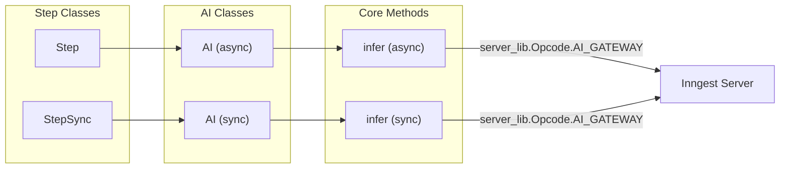
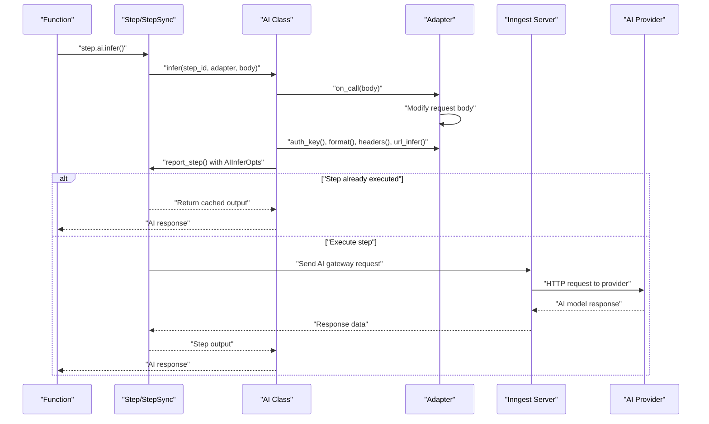

The AI Integration system provides experimental support for making AI model calls within Inngest functions through a unified adapter interface. This system offloads AI inference requests to the Inngest server, allowing functions to avoid consuming compute resources while waiting for AI model responses.

For information about general step execution, see [Steps](#3.3). For middleware and function lifecycle management, see [Middleware System](#5).

## Architecture Overview

The AI integration system is built around the adapter pattern, providing a consistent interface for multiple AI providers while handling provider-specific request formats and authentication methods.

```mermaid
graph TB
    subgraph "Step Execution Layer"
        SA["Step (Async)"]
        SS["StepSync (Sync)"]
        AI_A["AI (Async)"]
        AI_S["AI (Sync)"]
    end
    
    subgraph "Adapter Layer"
        BA["BaseAdapter"]
        OA["OpenAI Adapter"]
        AA["Anthropic Adapter"]
        GA["Gemini Adapter"]
        GRA["Grok Adapter"]
        DA["DeepSeek Adapter"]
    end
    
    subgraph "Inngest Infrastructure"
        IS["Inngest Server"]
        AG["AI Gateway"]
    end
    
    subgraph "AI Providers"
        OAI["OpenAI API"]
        ANT["Anthropic API"]
        GEM["Gemini API"]
        GRO["Grok API"]
        DS["DeepSeek API"]
    end
    
    SA --> AI_A
    SS --> AI_S
    AI_A --> BA
    AI_S --> BA
    
    BA <|.. OA
    BA <|.. AA
    BA <|.. GA
    BA <|.. GRA
    BA <|.. DA
    
    AI_A --> IS
    AI_S --> IS
    IS --> AG
    
    AG --> OAI
    AG --> ANT
    AG --> GEM
    AG --> GRO
    AG --> DS
    
    OA -.-> OAI
    AA -.-> ANT
    GA -.-> GEM
    GRA -.-> GRO
    DA -.-> DS
```

**Sources:** `pkg/inngest/inngest/_internal/step_lib/step_async.py:412-466`, `pkg/inngest/inngest/_internal/step_lib/step_sync.py:400-454`, `pkg/inngest/inngest/experimental/ai/base.py:1-38`

## AI Step Integration

AI functionality is accessed through the `ai` property on both async and sync step objects. The `AI` class provides the `infer` method for making model calls.



**Sources:** `pkg/inngest/inngest/_internal/step_lib/step_async.py:26-44`, `pkg/inngest/inngest/_internal/step_lib/step_sync.py:24-42`

## Adapter Pattern Implementation

The `BaseAdapter` protocol defines the interface that all AI provider adapters must implement. Each adapter handles provider-specific authentication, URL construction, request formatting, and response processing.

| Adapter | Provider | Format | Authentication |
|---------|----------|---------|----------------|
| `OpenAI` | OpenAI API | `openai-chat` | API Key |
| `Anthropic` | Anthropic API | `anthropic` | API Key |
| `Gemini` | Google Gemini | `gemini` | API Key |
| `Grok` | xAI Grok | `openai-chat` | API Key |
| `DeepSeek` | DeepSeek | `openai-chat` | API Key |

### BaseAdapter Protocol

The `BaseAdapter` protocol defines five required methods:

- `auth_key()` - Returns authentication key
- `format()` - Returns provider-specific format identifier
- `headers()` - Returns additional HTTP headers
- `on_call(body)` - Modifies request body before sending
- `url_infer()` - Returns inference endpoint URL

**Sources:** `pkg/inngest/inngest/experimental/ai/base.py:4-37`, `pkg/inngest/inngest/experimental/ai/openai.py:6-67`, `pkg/inngest/inngest/experimental/ai/anthropic.py:6-67`

## Step Execution Flow

The AI inference execution follows the standard step execution pattern with specialized handling for AI gateway operations.



**Sources:** `pkg/inngest/inngest/_internal/step_lib/step_async.py:416-466`, `pkg/inngest/inngest/_internal/step_lib/step_sync.py:404-454`

## Configuration and Usage

### Adapter Configuration

Each adapter requires provider-specific configuration including API keys, base URLs, and default models:

```python
# Example adapter configurations from smoke test
openai_adapter = OpenAIAdapter(
    auth_key="sk-...",
    model="o4-mini-2025-04-16"
)

anthropic_adapter = AnthropicAdapter(
    auth_key="sk-ant-...", 
    model="claude-3-5-sonnet-latest"
)
```

### AIInferOpts Structure

The `AIInferOpts` class in `base.py` encapsulates the parameters sent to the Inngest server:

- `auth_key` - Provider authentication key
- `body` - Request body for the AI model
- `format` - Provider format identifier  
- `headers` - Additional HTTP headers
- `url` - Provider inference endpoint URL

**Sources:** `pkg/inngest/inngest/_internal/step_lib/base.py`, `tests/smoke_tests/model_adapters/app.py:22-45`

## Provider-Specific Details

### Request Format Variations

Different providers require different request body formats:

| Provider | Request Format | Required Fields |
|----------|----------------|-----------------|
| OpenAI/DeepSeek/Grok | `{"messages": [...]}` | `messages` |
| Anthropic | `{"messages": [...], "max_tokens": N}` | `messages`, `max_tokens` |
| Gemini | `{"contents": [{"parts": [...]}]}` | `contents` |

### URL Construction

Each adapter constructs provider-specific URLs:

- **OpenAI/DeepSeek/Grok**: `{base_url}/chat/completions`
- **Anthropic**: `{base_url}/messages`  
- **Gemini**: `{base_url}/models/{model}:generateContent?key={api_key}`

**Sources:** `pkg/inngest/inngest/experimental/ai/openai.py:62-67`, `pkg/inngest/inngest/experimental/ai/anthropic.py:62-67`, `pkg/inngest/inngest/experimental/ai/gemini.py:64-72`

## Testing Infrastructure

The AI integration includes comprehensive testing through both unit tests and smoke tests.

### Unit Test Structure

The `ai_infer` test case validates:
- Request/response handling through HTTP proxy
- Adapter configuration and header injection
- Step output processing and caching
- Both sync and async execution paths

### Smoke Test Coverage

The smoke test validates all supported providers with real API calls, testing:
- Successful API communication
- Provider-specific request formats  
- Response parsing for each provider format
- Error handling for API failures

**Sources:** `tests/test_inngest/test_function/cases/ai_infer.py:13-177`, `tests/smoke_tests/model_adapters/app.py:106-181`

## Error Handling and Limitations

The AI integration system handles errors at multiple levels:

- **Adapter validation**: Invalid configuration raises exceptions during setup
- **Step execution**: API errors are captured and returned as step errors
- **Response processing**: Malformed responses are handled gracefully
- **Experimental status**: Interface subject to change without notice

The system operates as an experimental feature with the interface marked as subject to change. All AI calls are routed through the Inngest server's AI gateway, eliminating compute usage during inference wait times.

**Sources:** `pkg/inngest/inngest/_internal/step_lib/step_async.py:423-428`, `pkg/inngest/inngest/_internal/step_lib/step_sync.py:411-416`