This document describes the overall system architecture of the Inngest Python SDK, including its layered design, core components, and key design principles. The architecture enables event-driven workflow orchestration with step-by-step function execution across multiple Python web frameworks.

For detailed information about individual packages and their organization, see [Package Structure](#2.1). For framework-specific integration patterns, see [Framework Integration](#4). For the step execution system design, see [Steps](#3.3).

## System Overview

The Inngest Python SDK follows a layered architecture that separates concerns between user applications, framework integration, core SDK functionality, and external communication.

### High-Level Architecture

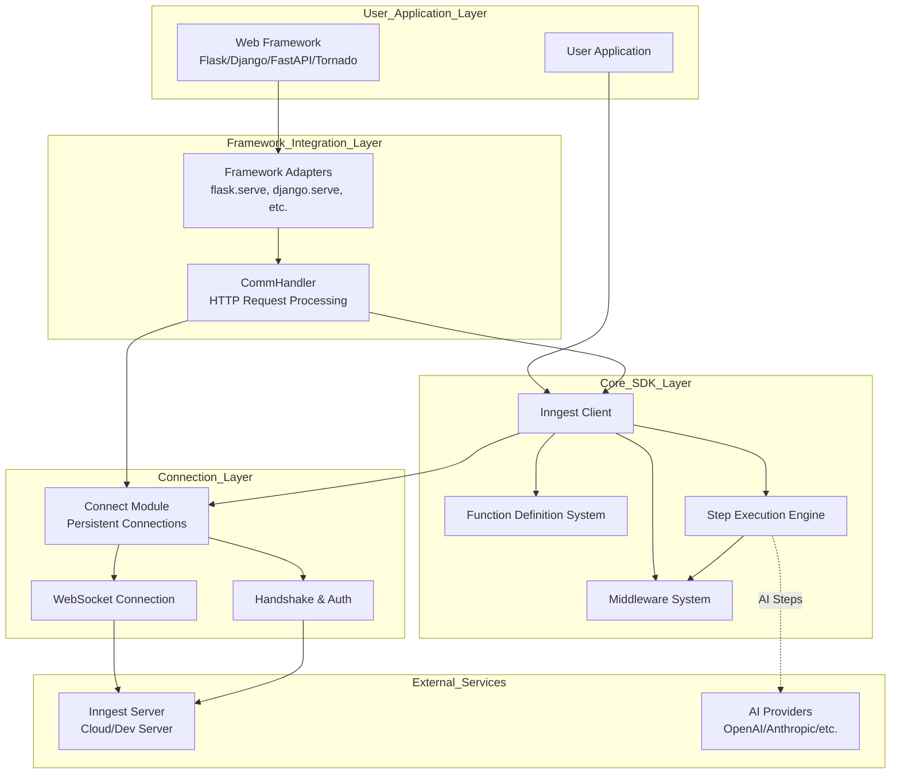

**Sources:** [README.md:26-207](), [pyproject.toml:1-46](), [CONTRIBUTING.md:78-91]()

## Core System Layers

### User Application Layer

The top layer consists of user applications built with supported Python web frameworks. The SDK supports multiple frameworks through a unified interface while maintaining framework-specific optimizations.

**Supported Frameworks:**
- Django (>=5.0)
- FastAPI (>=0.110.0) 
- Flask (>=3.0.0)
- Tornado (>=6.4)
- DigitalOcean Functions

**Sources:** [README.md:29-36](), [pyproject.toml:10-41]()

### Framework Integration Layer

This layer provides framework-agnostic communication between user applications and the core SDK through the `CommHandler` system and framework-specific adapters.

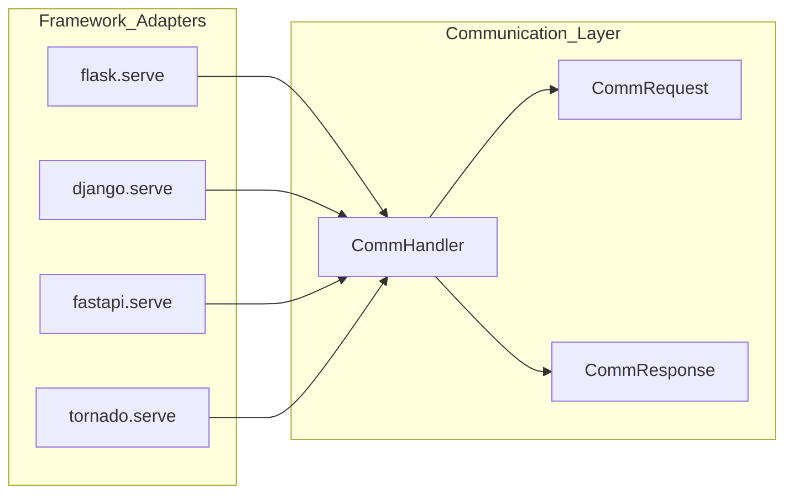

**Sources:** [CONTRIBUTING.md:85]()

### Core SDK Layer

The heart of the system contains four primary components:

#### Inngest Client
The main entry point for users, managing app configuration and function registration. Key responsibilities include:
- App identification (`app_id`)
- Environment management (`is_production`)
- Function registration and discovery
- Event sending capabilities

#### Function Definition System
Manages user-defined functions through decorators and configuration:
- `@inngest_client.create_function()` decorator
- Function configuration (`FunctionConfig`)
- Function options (`FunctionOpts`)
- Trigger event definitions

#### Step Execution Engine
Provides durable execution with automatic retries and state management:
- Synchronous steps (`StepSync`)
- Asynchronous steps (`Step`)
- Step operations (`step.run`, `step.invoke`, `step.send_event`, etc.)
- State memoization (`StepMemos`)

#### Middleware System
Enables function execution interception and modification:
- Middleware manager (`MiddlewareManager`)
- Async and sync middleware support
- Lifecycle hooks for function execution

**Sources:** [README.md:55-191](), [CONTRIBUTING.md:84-90]()

## Component Relationships

### Core Component Interaction

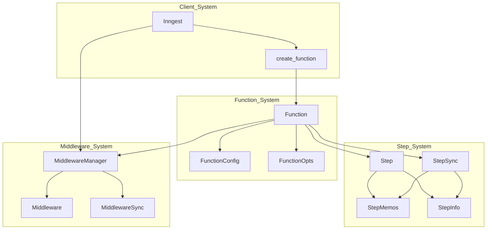

**Sources:** [README.md:65-76](), [README.md:113-149]()

### Communication Flow

The SDK handles three main types of HTTP requests from the Inngest server:

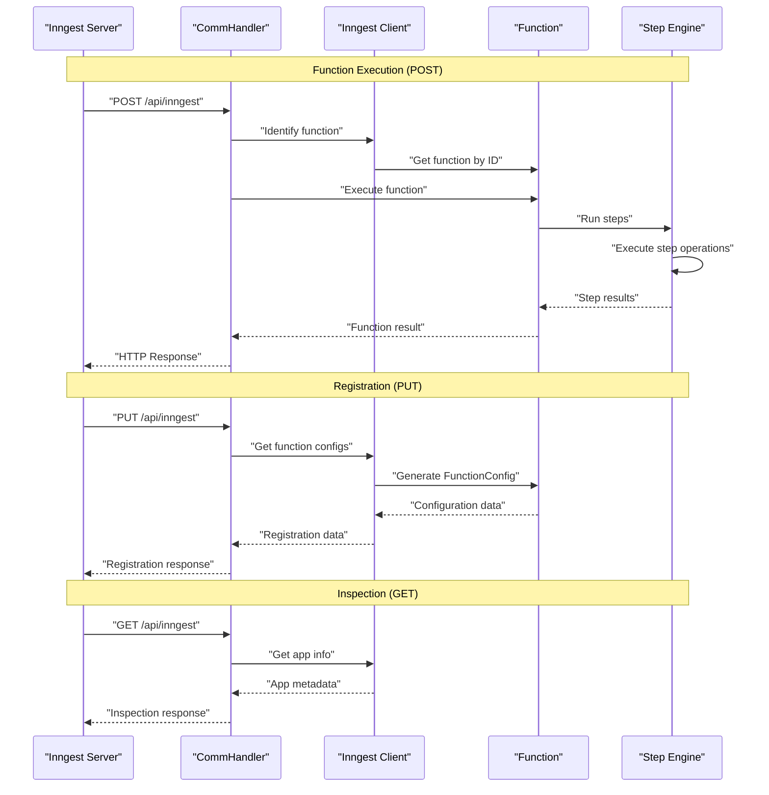

**Sources:** [CONTRIBUTING.md:85]()

## Design Principles

### Framework Agnostic Core
The core SDK components are designed to work independently of any specific web framework. Framework-specific code is isolated in adapter modules, enabling easy addition of new framework support.

### Async/Sync Compatibility
The SDK supports both synchronous and asynchronous programming models:
- `Step` for async functions
- `StepSync` for sync functions
- Mixed usage within the same application

**Sources:** [README.md:45](), [README.md:162-177]()

### Modular Architecture
Internal modules follow a clear separation of concerns:

| Module | Purpose |
|--------|---------|
| `client_lib` | Inngest client for sending events |
| `comm` | Framework-agnostic communication layer |
| `env` | Runtime environment handling |
| `function` | User function data structures |
| `net` | General networking functionality |
| `result` | Error-as-values wrapper types |
| `types` | Low-level type annotations |

**Sources:** [CONTRIBUTING.md:84-91]()

### Development Infrastructure
The architecture includes comprehensive development and testing support:

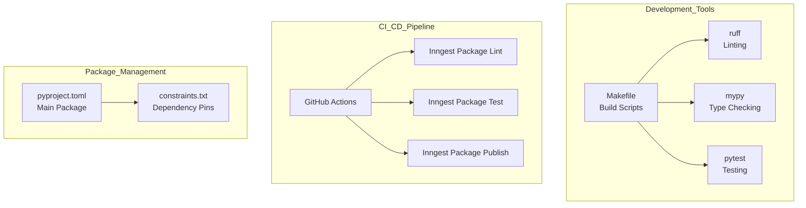

**Sources:** [Makefile:1-43](), [pyproject.toml:1-46](), [CONTRIBUTING.md:29-64]()

### Runtime Environment Support
The SDK adapts to different runtime environments:
- **Development:** Local dev server integration
- **Production:** Inngest Cloud with authentication and signing
- **Testing:** Comprehensive test infrastructure

**Sources:** [README.md:194-206](), [pkg/inngest/inngest/experimental/dev_server/command_runner.py:1-133]()

# Package Structure


This document describes the organization of packages within the Inngest Python SDK repository, including the main SDK package, encryption package, and test infrastructure. For information about system components within these packages, see [System Components](#2.3). For dependency management and framework compatibility details, see [Dependencies and Requirements](#2.2).

## Repository Organization

The Inngest Python SDK repository follows a multi-package structure with clear separation of concerns. The repository contains two main distributable packages and associated test suites, organized to support independent versioning and deployment.

### Package Layout

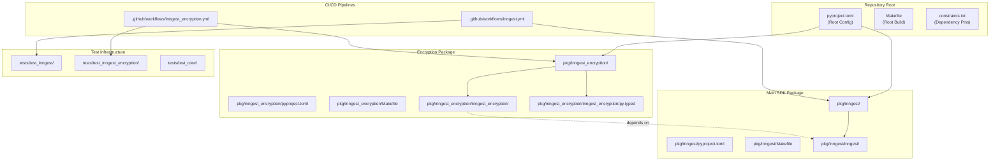

**Sources:** [pyproject.toml:1-46](), [.github/workflows/inngest.yml:1-136](), [.github/workflows/inngest_encryption.yml:1-121](), [pkg/inngest_encryption/pyproject.toml:1-45]()

## Main SDK Package

The primary SDK package is located in `pkg/inngest/` and contains the core Inngest functionality including the client, function system, step execution engine, and framework integrations.

### Package Configuration

| Property | Value |
|----------|-------|
| Package Name | `inngest` |
| Location | `pkg/inngest/` |
| Build System | `python -m build` |
| Minimum Python | `>=3.10` |

The main package includes all core functionality for event-driven workflow orchestration, framework integrations for Flask, Django, FastAPI, and Tornado, and the experimental connection and AI systems.

**Sources:** [pkg/inngest/Makefile:1-35](), [.github/workflows/inngest.yml:46-135]()

## Encryption Package

The encryption package provides cryptographic functionality as a separate, optional package that extends the main SDK.

### Encryption Package Structure

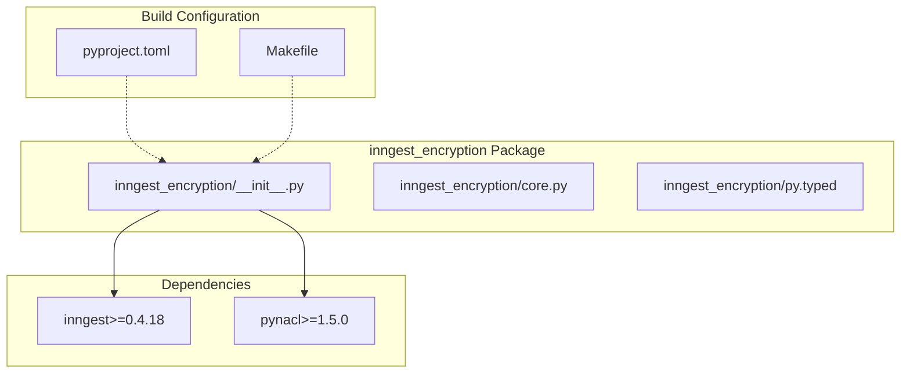

### Package Configuration

| Property | Value |
|----------|-------|
| Package Name | `inngest_encryption` |
| Version | `0.1.0` |
| Location | `pkg/inngest_encryption/` |
| Dependencies | `inngest>=0.4.18`, `pynacl>=1.5.0` |
| Development Status | Alpha |

The encryption package is versioned independently from the main SDK and includes type hints via the `py.typed` marker file.

**Sources:** [pkg/inngest_encryption/pyproject.toml:1-45](), [pkg/inngest_encryption/inngest_encryption/py.typed:1](), [pkg/inngest_encryption/Makefile:1-33]()

## Test Organization

The test infrastructure is organized to match the package structure with separate test suites for each package and shared test utilities.

### Test Structure

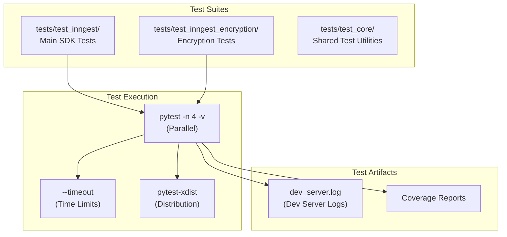

### Test Configuration

| Package | Test Location | Execution | Timeout |
|---------|---------------|-----------|---------|
| Main SDK | `tests/test_inngest/` | `pytest -n 4 -v` | 10 minutes |
| Encryption | `tests/test_inngest_encryption/` | `pytest -n 4 -v` | 2 minutes |

Tests run in parallel using `pytest-xdist` with 4 workers and include integration tests that start local dev servers for testing.

**Sources:** [pkg/inngest/Makefile:13-15](), [pkg/inngest_encryption/Makefile:15-17](), [.github/workflows/inngest.yml:44-52]()

## Build and CI/CD Structure

Each package has independent build processes and CI/CD pipelines supporting separate versioning and deployment cycles.

### CI/CD Pipeline Structure

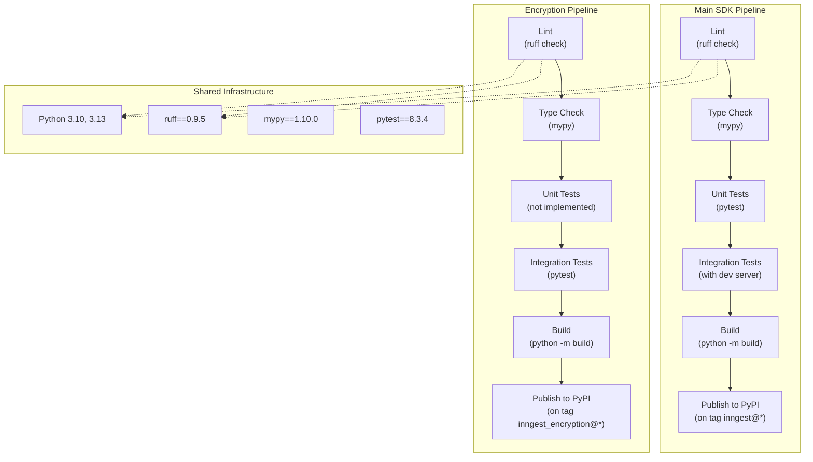

### Package Dependencies

The encryption package maintains a dependency on the main SDK package, requiring a minimum version for compatibility.

| Dependency | Constraint | Purpose |
|------------|------------|---------|
| `inngest` | `>=0.4.18` | Core SDK functionality |
| `pynacl` | `>=1.5.0` | Cryptographic operations |

The encryption package uses `MYPYPATH=../inngest` to reference the main package during type checking, enabling proper type resolution across package boundaries.

**Sources:** [.github/workflows/inngest.yml:71-101](), [.github/workflows/inngest_encryption.yml:56-86](), [pkg/inngest_encryption/pyproject.toml:17](), [pkg/inngest_encryption/Makefile:1]()

# Dependencies and Requirements


This document outlines the dependency management strategy, Python version requirements, and framework compatibility for the Inngest Python SDK. It covers both runtime dependencies required for core functionality and optional dependencies for framework integrations and development workflows.

For information about package structure and organization, see [Package Structure](#2.1). For details about framework-specific integration patterns, see [Framework Integration](#4).

## Python Version Requirements

The Inngest Python SDK requires Python 3.10 or higher. This requirement is enforced through the project configuration and maintained consistently across all development and testing environments.

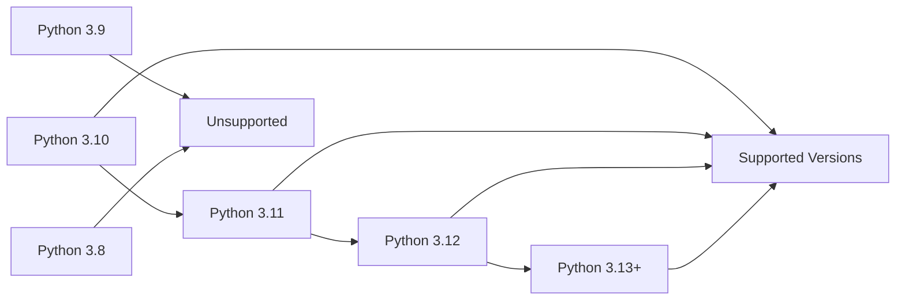

**Python Version Configuration**

The Python version requirement is specified in the project configuration and enforced across all environments:

- **Project Definition**: [pyproject.toml:7]() specifies `requires-python = ">=3.10"`
- **Development Environment**: [.python-version:1]() pins development to Python 3.10
- **CI/CD Pipeline**: [.github/workflows/other.yml:24,40,56]() uses Python 3.10 for all testing workflows

Sources: [pyproject.toml:7](), [.python-version:1](), [.github/workflows/other.yml:24,40,56]()

## Core Runtime Dependencies

The SDK maintains a minimal set of core runtime dependencies to ensure compatibility and reduce dependency conflicts. Core dependencies are constrained to specific minimum versions to ensure API stability.

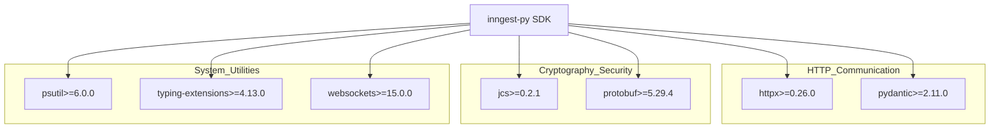

**Core Dependency Categories**

| Category | Dependencies | Purpose |
|----------|-------------|---------|
| HTTP Communication | `httpx`, `pydantic` | Event sending, data validation |
| Cryptography & Security | `jcs`, `protobuf` | Message signing, protocol buffers |
| System Utilities | `psutil`, `typing-extensions`, `websockets` | System monitoring, type hints, WebSocket connections |

**Version Constraints**

The SDK uses a constraint-based approach to dependency management. Minimum versions are specified in [constraints.txt:4-10]() to ensure compatibility while allowing flexibility for consumers:

- `httpx==0.26.0` - HTTP client for event sending and API communication
- `jcs==0.2.1` - JSON Canonical Serialization for cryptographic operations
- `protobuf==5.29.4` - Protocol buffer support for connect module
- `psutil==6.0.0` - System process utilities for development server
- `pydantic==2.11.0` - Data validation and serialization
- `typing-extensions==4.13.0` - Extended type hints for Python compatibility
- `websockets==15.0.0` - WebSocket support for persistent connections

Sources: [constraints.txt:4-10](), [pyproject.toml:7]()

## Framework Compatibility

The SDK provides optional integrations for multiple Python web frameworks. Framework-specific dependencies are included in the development environment but not required for runtime usage.

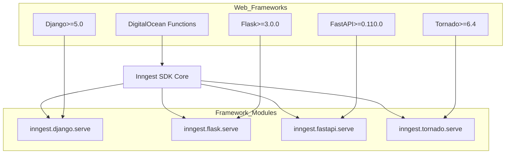

**Supported Framework Versions**

The SDK supports the following web frameworks with their minimum required versions:

- **Django**: Version 5.0+ ([pyproject.toml:11]())
- **Flask**: Version 3.0.0+ ([pyproject.toml:12]())
- **FastAPI**: Version 0.110.0+ ([pyproject.toml:18]())
- **Tornado**: Version 6.4+ ([pyproject.toml:30]())
- **DigitalOcean Functions**: Built-in support without additional dependencies

**Framework-Specific Dependencies**

Additional dependencies may be required for specific framework integrations:

- **Django**: `django-types==0.19.1` for type hints ([pyproject.toml:17]())
- **Flask**: Werkzeug version constraints to maintain compatibility ([pyproject.toml:37-40]())
- **FastAPI**: `uvicorn==0.23.2` for ASGI server support ([pyproject.toml:35]())
- **Type Checking**: Framework-specific type stubs for development ([pyproject.toml:31,33,34]())

Sources: [pkg/inngest/README.md:29-35](), [pyproject.toml:11,12,18,30]()

## Development Dependencies

Development dependencies are organized as optional extras to support various development workflows including testing, linting, type checking, and cloud integrations.

**Development Dependency Categories**

| Category | Dependencies | Purpose |
|----------|-------------|---------|
| Testing Framework | `pytest`, `pytest-django`, `pytest-timeout`, `pytest-xdist` | Unit testing, Django integration testing, parallel test execution |
| Code Quality | `ruff`, `mypy` | Linting, formatting, static type checking |
| Build Tools | `build`, `toml` | Package building, configuration parsing |
| Cloud Integrations | `boto3`, `boto3-stubs`, `moto` | AWS S3 integration, mocking |
| Security | `cryptography`, `pynacl` | Encryption, signing operations |
| Monitoring | `sentry-sdk`, `structlog` | Error tracking, structured logging |

**Development Environment Setup**

All development dependencies are specified in the `extra` optional dependency group:

```python
[project.optional-dependencies]
extra = [
    # Testing
    "pytest==8.3.4",
    "pytest-django==4.7.0", 
    "pytest-timeout==2.3.1",
    "pytest-xdist[psutil]==3.3.1",
    
    # Code Quality
    "ruff==0.9.5",
    "mypy==1.10.0",
    
    # Framework Support
    "Django==5.0",
    "Flask==3.0.0",
    "fastapi==0.110.0",
    "tornado==6.4",
    
    # Additional tooling...
]
```

Sources: [pyproject.toml:9-41]()

## Dependency Management Strategy

The SDK employs a multi-layered dependency management approach to balance flexibility for consumers with stability for the core functionality.

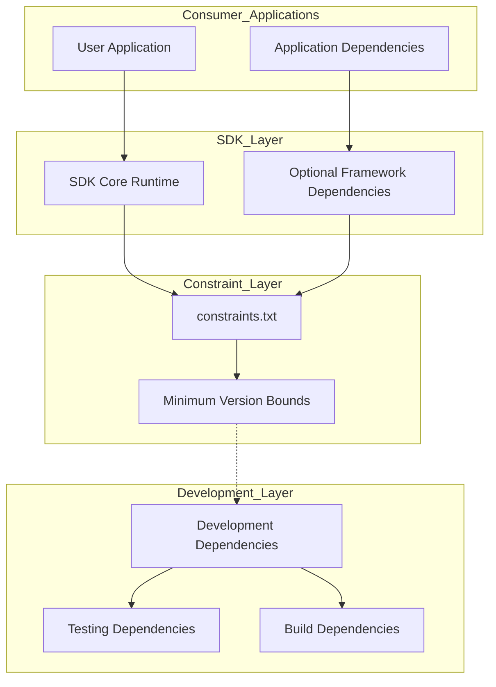

**Constraint Management Philosophy**

The constraint system ensures that the SDK works with the lowest supported versions of dependencies while not restricting consumers to those versions:

1. **Minimum Version Testing**: [constraints.txt:1-3]() constrains development to minimum supported versions
2. **Consumer Flexibility**: Consumers can use newer versions of dependencies in their applications
3. **Compatibility Assurance**: CI/CD pipeline tests against minimum versions to prevent regression

**Version Pinning Strategy**

- **Runtime Dependencies**: Use minimum version constraints (`>=x.y.z`)
- **Development Dependencies**: Pin to specific versions for reproducible builds
- **Framework Dependencies**: Specify minimum compatible versions with known working ranges
- **Constraint File**: Lock to minimum versions for testing compatibility

Sources: [constraints.txt:1-11](), [pyproject.toml:9-41]()

## Version Constraints and Compatibility

The SDK maintains strict version constraints to ensure compatibility across different deployment environments while providing flexibility for integration with existing applications.

**Critical Version Constraints**

Several dependencies have specific version constraints due to compatibility requirements:

1. **Werkzeug Constraint**: Versions 3.1+ are temporarily excluded due to breaking changes affecting Flask compatibility ([pyproject.toml:37-40]())
2. **Python Version Floor**: Python 3.10+ required for modern typing features and async/await improvements
3. **Framework Minimums**: Each supported framework has a minimum version requirement to ensure API compatibility

**Compatibility Testing Matrix**

The SDK is tested against:
- Multiple Python versions (3.10+)
- Minimum and maximum supported framework versions
- Various dependency version combinations through constraint files

Sources: [pyproject.toml:37-40](), [constraints.txt:1-11](), [.github/workflows/other.yml:1-67]()