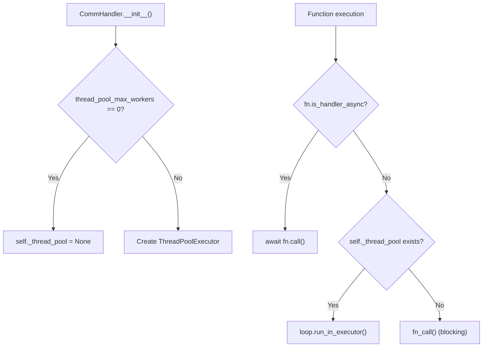

@app.route("/api/inngest", methods=["GET", "POST", "PUT"])
async def inngest_api():
    comm_req = comm_lib.CommRequest(...)
    return await handler.post(comm_req)
```

**Sources:** [pkg/inngest/inngest/flask.py:70-113](), [pkg/inngest/inngest/flask.py:115-158]()

### Django Integration

Django integration includes Django 5+ async support with automatic version detection and CSRF exemption.

```python
# URL pattern creation
django.urls.path(
    "api/inngest",
    django.views.decorators.csrf.csrf_exempt(inngest_api),
)
```

**Sources:** [pkg/inngest/inngest/django.py:118-123](), [pkg/inngest/inngest/django.py:133-142]()

### FastAPI Integration

FastAPI provides the most complete integration with full async support and optional streaming responses.

```python
@app.get("/api/inngest")
async def get_api_inngest(request: fastapi.Request):
    return handler.get_sync(comm_lib.CommRequest(...))

@app.post("/api/inngest") 
async def post_inngest_api(request: fastapi.Request):
    return await handler.post(comm_lib.CommRequest(...))
```

**Sources:** [pkg/inngest/inngest/fast_api.py:51-68](), [pkg/inngest/inngest/fast_api.py:70-87]()

### Tornado Integration

Tornado integration uses a custom `RequestHandler` subclass with sync-only execution.

```python
class InngestHandler(tornado.web.RequestHandler):
    def get(self):
        comm_res = handler.get_sync(comm_lib.CommRequest(...))
        self._write_comm_response(comm_res)
        
    def post(self):
        comm_res = handler.post_sync(comm_lib.CommRequest(...))
        self._write_comm_response(comm_res)
```

**Sources:** [pkg/inngest/inngest/tornado.py:49-104]()

### DigitalOcean Functions Integration

DigitalOcean integration handles the serverless function format with special URL path construction.

```python
def main(event: dict, context: _Context) -> _Response:
    http = _EventHTTP.from_raw(event["http"])
    path = "/api/v1/web" + context.function_name
    request_url = urllib.parse.urljoin(context.api_host, path)
    
    comm_req = comm_lib.CommRequest(
        body=_to_body_bytes(http.body),
        headers=http.headers,
        request_url=request_url,
        ...
    )
```

**Sources:** [pkg/inngest/inngest/digital_ocean.py:50-94](), [pkg/inngest/inngest/digital_ocean.py:76-80]()

## Thread Pool Management

The `CommHandler` includes intelligent thread pool management for executing sync functions in async contexts.

### Thread Pool Decision Logic



**Sources:** [pkg/inngest/inngest/_internal/comm_lib/handler.py:65-89](), [pkg/inngest/inngest/_internal/comm_lib/handler.py:229-236]()

## Configuration and Environment

Framework integrations support common configuration options for customizing the serve behavior.

### Configuration Parameters

| Parameter | Type | Purpose | Default |
|-----------|------|---------|---------|
| `serve_origin` | `Optional[str]` | Override the base URL | Request origin |
| `serve_path` | `Optional[str]` | Custom endpoint path | `/api/inngest` |
| `streaming` | `Optional[Streaming]` | Enable streaming responses | Framework dependent |

**Sources:** [pkg/inngest/inngest/_internal/const.py:8](), [pkg/inngest/inngest/_internal/const.py:56-64]()