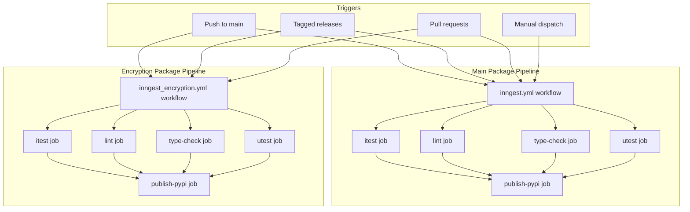
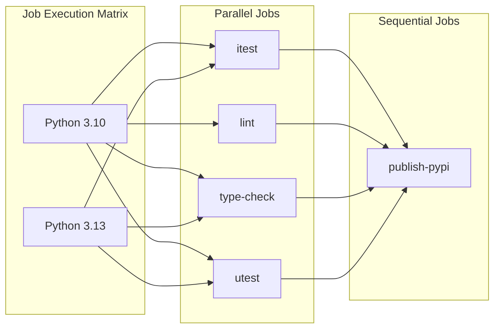
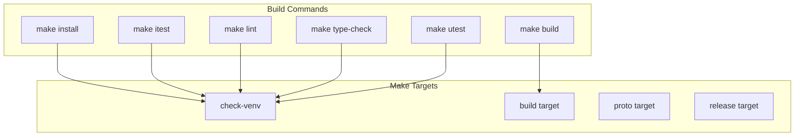
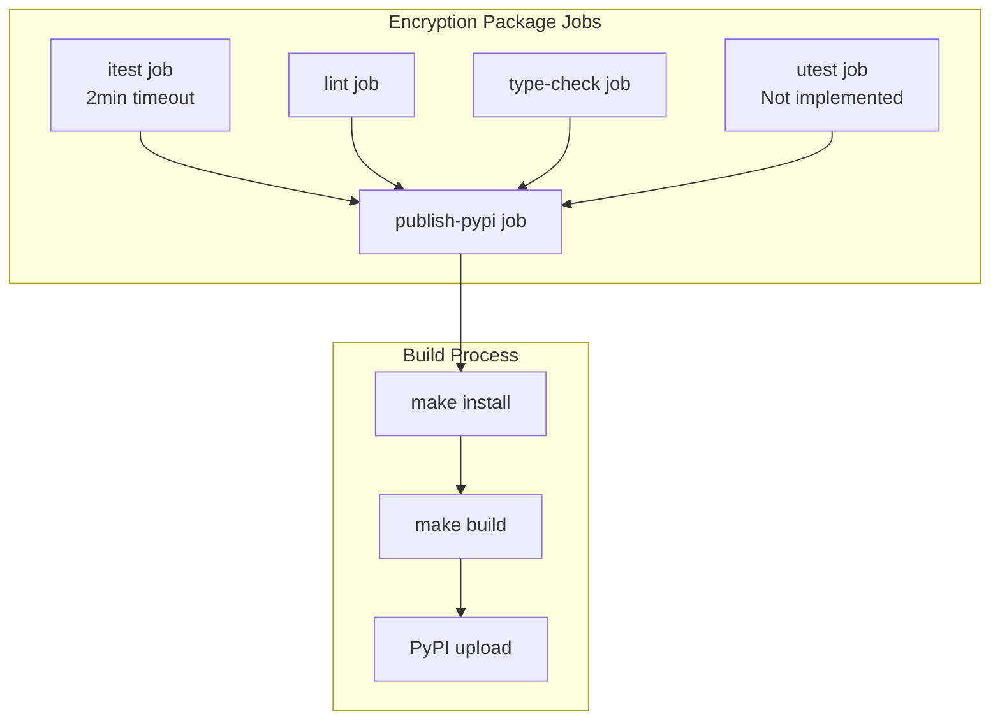
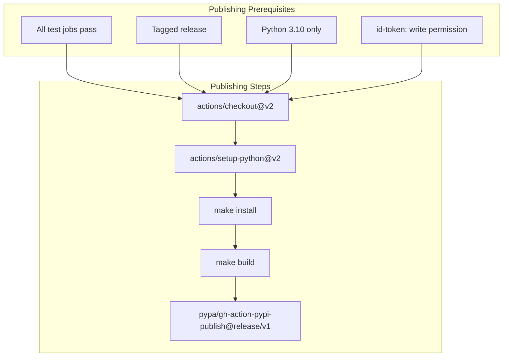

The CI/CD pipeline automates testing, building, and publishing of the Inngest Python SDK packages. This document covers the continuous integration workflows, build processes, and deployment strategies for both the main `inngest` package and the separate `inngest_encryption` package.

For local development setup and testing strategies, see [Local Development](#8.1) and [Testing Guide](#8.2).

## Pipeline Architecture

The CI/CD system consists of two parallel GitHub Actions workflows that handle the main SDK package and encryption package independently. Each workflow implements a comprehensive testing and deployment pipeline with multiple quality gates.

Sources: [.github/workflows/inngest.yml:1-136](), [.github/workflows/inngest_encryption.yml:1-121]()

## Main Package Pipeline

The main Inngest SDK pipeline is defined in the `inngest.yml` workflow and handles the core package located at `pkg/inngest/`. The pipeline supports Python versions 3.10 and 3.13 and includes comprehensive testing and quality checks.

### Workflow Configuration

The workflow triggers on multiple events with specific path filters to optimize execution:

| Trigger | Conditions |
|---------|------------|
| Push | `main` branch and tags |
| Pull Request | Changes to Python files, Makefiles, configuration files |
| Manual | `workflow_dispatch` event |

Sources: [.github/workflows/inngest.yml:3-28](), [.github/workflows/inngest.yml:32-34](), [.github/workflows/inngest.yml:73-77]()

### Testing Jobs

The pipeline includes four distinct testing phases:

**Integration Testing (`itest`)**
- Timeout: 10 minutes
- Runs `make itest` command
- Uploads dev server logs on failure
- Tests against live dev server instance

**Unit Testing (`utest`)**
- Executes isolated unit tests
- Runs `make utest` command
- No external dependencies

**Linting (`lint`)**
- Code quality checks using `ruff`
- Runs `make lint` command
- Enforces style guidelines

**Type Checking (`type-check`)**
- Static type analysis using `mypy`
- Runs `make type-check` command
- Validates type annotations

Sources: [.github/workflows/inngest.yml:30-52](), [.github/workflows/inngest.yml:120-135](), [.github/workflows/inngest.yml:54-69](), [.github/workflows/inngest.yml:103-118]()

### Build Process

The build process utilizes Make targets defined in the package Makefile:

Sources: [pkg/inngest/Makefile:1-35](), [.github/workflows/inngest.yml:43](), [.github/workflows/inngest.yml:95-96]()

## Encryption Package Pipeline

The encryption package pipeline mirrors the main package structure but operates independently with its own workflow and build process.

### Package-Specific Configuration

The encryption package has distinct characteristics:

| Aspect | Configuration |
|--------|--------------|
| Package Location | `pkg/inngest_encryption/` |
| Tag Pattern | `inngest_encryption@*` |
| Dependencies | `inngest>=0.4.18`, `pynacl>=1.5.0` |
| Timeout | 2 minutes (shorter than main package) |

Sources: [.github/workflows/inngest_encryption.yml:21-37](), [.github/workflows/inngest_encryption.yml:66](), [pkg/inngest_encryption/pyproject.toml:17]()

### Build Environment

The encryption package uses a specialized build environment:

- `MYPYPATH` set to `../inngest` for type checking
- Separate test directory at `tests/test_inngest_encryption`
- Protocol buffer generation not required (unlike main package)

Sources: [pkg/inngest_encryption/Makefile:1](), [pkg/inngest_encryption/Makefile:17]()

## Publication and Release Process

Both packages implement a controlled release process that requires explicit tagging and includes security measures for PyPI publishing.

### Release Triggers

Publication only occurs for tagged releases with specific patterns:

| Package | Tag Pattern | Example |
|---------|-------------|---------|
| Main Package | `inngest@*` | `inngest@1.2.3` |
| Encryption Package | `inngest_encryption@*` | `inngest_encryption@0.1.0` |

### PyPI Publishing Configuration

The publishing process uses GitHub's OIDC provider for secure authentication with PyPI, eliminating the need for long-lived API tokens.

Sources: [.github/workflows/inngest.yml:71-101](), [.github/workflows/inngest_encryption.yml:56-86](), [.github/workflows/inngest.yml:82-83]()

### Version Management

Release automation includes version validation through Makefile targets:

- `make release` command validates version consistency
- Git tag creation tied to `pyproject.toml` version
- Automatic tag pushing on successful validation

Sources: [pkg/inngest/Makefile:25-26](), [pkg/inngest_encryption/Makefile:23-24]()

## Environment and Dependencies

The CI/CD pipeline manages dependencies through several mechanisms:

### Python Version Support

Both workflows test against Python 3.10 and 3.13, ensuring compatibility across the supported version range defined in `pyproject.toml` files.

### Dependency Management

- Root-level `constraints.txt` pins specific versions
- Virtual environment validation in Makefiles
- Separate dependency trees for main and encryption packages

### Environment Variables

| Variable | Purpose | Workflow |
|----------|---------|----------|
| `DEV_SERVER_LOGS` | Enable dev server logging | Main package only |
| `MYPYPATH` | Type checking path | Encryption package |
| `CI` | Skip venv check in CI | Both packages |

Sources: [.github/workflows/inngest.yml:26-27](), [pkg/inngest_encryption/Makefile:1](), [pkg/inngest/Makefile:8-13]()