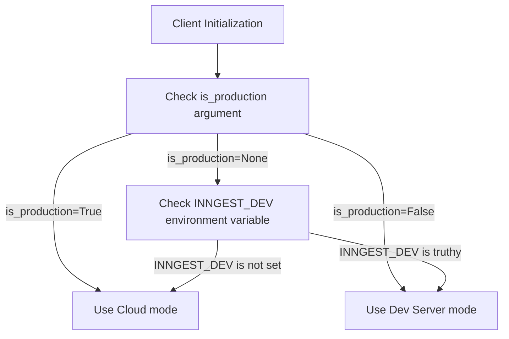

inngest_client = inngest.Inngest(
    app_id="my_app",
    is_production=os.getenv("INNGEST_DEV") is None
)
```

Sources: [README.md:60-63](), [README.md:202-205]()

### Environment Variables

The client automatically detects and uses the following environment variables:

| Environment Variable | Purpose |
|----------------------|---------|
| `INNGEST_EVENT_KEY` | Authentication key for sending events |
| `INNGEST_SIGNING_KEY` | Authentication key for signing requests |
| `INNGEST_SIGNING_KEY_FALLBACK` | Fallback signing key for request validation |
| `INNGEST_DEV` | When truthy, enables development mode |
| `INNGEST_BASE_URL` | Custom base URL for the Inngest service |

Sources: [pkg/inngest/inngest/_internal/client_lib/client.py:99-122](), [.env.example:1-13]()

## Client Mode Selection

The client operates in one of two modes:



Sources: [pkg/inngest/inngest/_internal/client_lib/client.py:528-549]()

## Core Client Methods

### Creating Functions

The `create_function()` method registers a function with Inngest and returns a decorator that can be applied to your function handler.

Parameters for `create_function()`:

| Parameter | Type | Required | Description |
|-----------|------|----------|-------------|
| `fn_id` | str | Yes | Unique function identifier |
| `trigger` | TriggerEvent/TriggerCron | Yes | Event or cron trigger to run the function |
| `name` | str | No | Human-readable function name |
| `retries` | int | No | Number of retry attempts on failure |
| `on_failure` | function | No | Function to call when this function fails |
| `middleware` | list | No | Function-specific middleware |
| Various options | Various | No | Throttling, debouncing, concurrency, etc. |

Sources: [pkg/inngest/inngest/_internal/client_lib/client.py:186-274]()

### Sending Events

The client provides two methods for sending events:

1. `send()` - Asynchronous method for sending events
2. `send_sync()` - Synchronous method for sending events

```python