## Purpose and Scope

The Connection System provides experimental support for persistent WebSocket connections between Inngest functions and the Inngest server. This system enables real-time function execution without the traditional HTTP request/response model used by framework integrations. The connection system handles authentication, connection lifecycle management, reconnection logic, and graceful shutdown.

For HTTP-based function serving through web frameworks, see [Framework Integration](#4). For the core function execution model, see [Steps](#3.3).

## Core Components

The connection system is implemented in the `inngest.connect` module and centers around several key classes and functions:

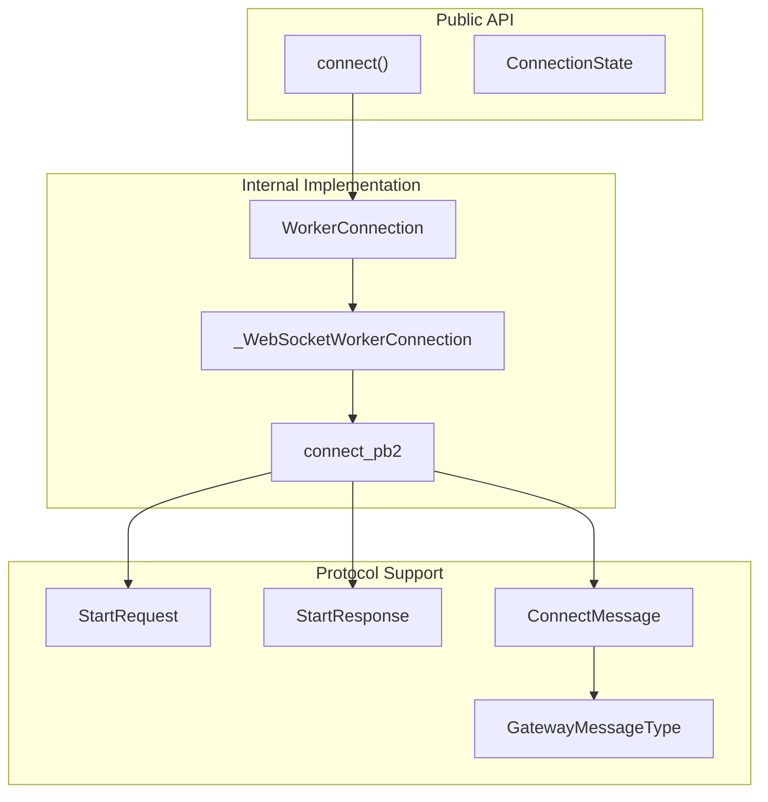
```mermaid
graph TB
    subgraph "Public API"
        connect["connect()"]
        ConnectionState["ConnectionState"]
    end
    
    subgraph "Internal Implementation"
        WorkerConnection["WorkerConnection"]
        WebSocketWorkerConnection["_WebSocketWorkerConnection"]
        ConnectPB2["connect_pb2"]
    end
    
    subgraph "Protocol Support"
        StartRequest["StartRequest"]
        StartResponse["StartResponse"]
        ConnectMessage["ConnectMessage"]
        GatewayMessageType["GatewayMessageType"]
    end
    
    connect --> WorkerConnection
    WorkerConnection --> WebSocketWorkerConnection
    WebSocketWorkerConnection --> ConnectPB2
    ConnectPB2 --> StartRequest
    ConnectPB2 --> StartResponse
    ConnectPB2 --> ConnectMessage
    ConnectMessage --> GatewayMessageType
```

The `connect()` function serves as the main entry point, accepting a list of tuples containing `Inngest` clients and their associated functions. The `ConnectionState` enum tracks connection status through states: `CONNECTING`, `ACTIVE`, `RECONNECTING`, `CLOSING`, and `CLOSED`.

**Sources:** [tests/test_inngest/test_connect/test_drain.py:6](), [tests/test_inngest/test_connect/base.py:12-17]()

## Connection Lifecycle

The connection system manages a well-defined lifecycle with state transitions:

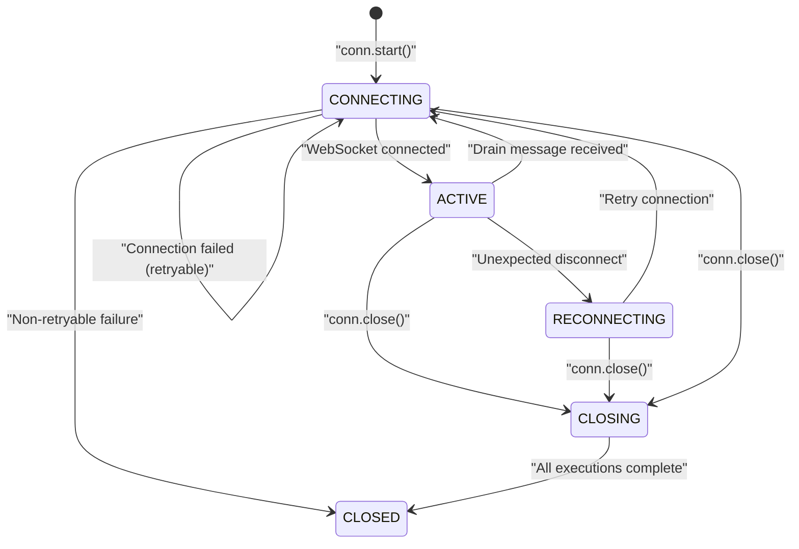
```mermaid
stateDiagram-v2
    [*] --> CONNECTING: "conn.start()"
    CONNECTING --> ACTIVE: "WebSocket connected"
    ACTIVE --> RECONNECTING: "Unexpected disconnect"
    ACTIVE --> CONNECTING: "Drain message received"
    RECONNECTING --> CONNECTING: "Retry connection"
    CONNECTING --> CONNECTING: "Connection failed (retryable)"
    CONNECTING --> CLOSED: "Non-retryable failure"
    ACTIVE --> CLOSING: "conn.close()"
    CLOSING --> CLOSED: "All executions complete"
    RECONNECTING --> CLOSING: "conn.close()"
    CONNECTING --> CLOSING: "conn.close()"
```

The lifecycle begins when `conn.start()` is called, transitioning the connection to the `CONNECTING` state. Upon successful WebSocket establishment, the state moves to `ACTIVE`. The system handles various disconnect scenarios differently - unexpected disconnects trigger `RECONNECTING` state, while drain messages from the server cause a graceful reconnect through `CONNECTING`.

**Sources:** [tests/test_inngest/test_connect/test_drain.py:55-60](), [tests/test_inngest/test_connect/test_reconnect.py:54-60](), [tests/test_inngest/test_connect/test_close.py:66-71]()

## Authentication and Handshake

The connection system implements a sophisticated authentication mechanism that varies based on production mode:

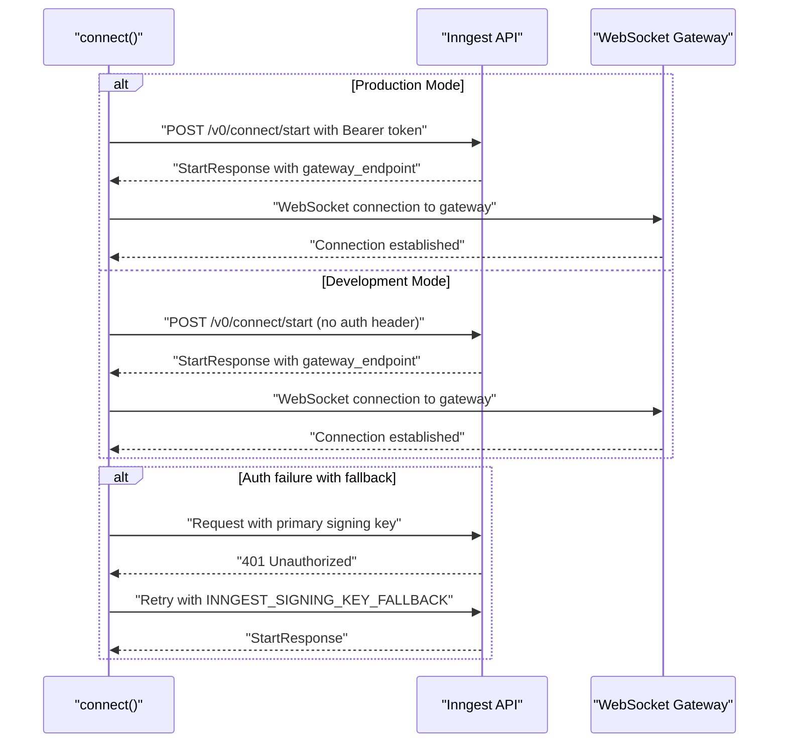
```mermaid
sequenceDiagram
    participant Client as "connect()"
    participant API as "Inngest API"
    participant WS as "WebSocket Gateway"
    
    alt Production Mode
        Client->>API: "POST /v0/connect/start with Bearer token"
        API-->>Client: "StartResponse with gateway_endpoint"
        Client->>WS: "WebSocket connection to gateway"
        WS-->>Client: "Connection established"
    else Development Mode
        Client->>API: "POST /v0/connect/start (no auth header)"
        API-->>Client: "StartResponse with gateway_endpoint"
        Client->>WS: "WebSocket connection to gateway"
        WS-->>Client: "Connection established"
    end
    
    alt Auth failure with fallback
        Client->>API: "Request with primary signing key"
        API-->>Client: "401 Unauthorized"
        Client->>API: "Retry with INNGEST_SIGNING_KEY_FALLBACK"
        API-->>Client: "StartResponse"
    end
```

In production mode (`is_production=True`), the system sends an authorization header derived from the signing key. Development mode omits authentication headers. The system supports signing key fallback through the `INNGEST_SIGNING_KEY_FALLBACK` environment variable, automatically retrying with the fallback key on 401 responses.

**Sources:** [tests/test_inngest/test_connect/test_init_handshake.py:66-70](), [tests/test_inngest/test_connect/test_init_handshake.py:148-161](), [tests/test_inngest/test_connect/test_init_handshake.py:212-213]()

## Reconnection and Error Handling

The connection system implements robust reconnection logic to handle various failure scenarios:

| Scenario | Trigger | State Transition | Behavior |
|----------|---------|------------------|----------|
| Unexpected Disconnect | WebSocket connection drops | `ACTIVE` → `RECONNECTING` | Automatic retry with backoff |
| Gateway Drain | `GATEWAY_CLOSING` message | `ACTIVE` → `CONNECTING` | Immediate reconnection attempt |
| Auth Failure | 401 response | Exception raised | No retry for non-retryable errors |
| Network Error | Connection timeout | `CONNECTING` → `CONNECTING` | Retry with exponential backoff |

The `abort_conns()` method in the WebSocket proxy test infrastructure simulates abrupt connection termination to test reconnection behavior. The system distinguishes between retryable errors (network issues) and non-retryable errors (authentication failures).

**Sources:** [tests/test_inngest/test_connect/test_reconnect.py:44-52](), [tests/test_inngest/test_connect/test_drain.py:44-52](), [pkg/test_core/test_core/ws_proxy.py:100-107]()

## Graceful Shutdown and Signal Handling

The connection system provides comprehensive graceful shutdown capabilities:

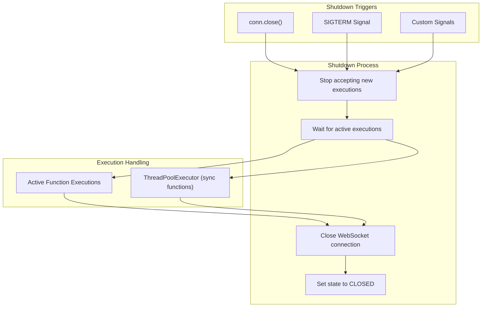
```mermaid
graph TD
    subgraph "Shutdown Triggers"
        Manual["conn.close()"]
        SIGTERM["SIGTERM Signal"]
        CustomSignal["Custom Signals"]
    end
    
    subgraph "Shutdown Process"
        StopAccepting["Stop accepting new executions"]
        WaitActive["Wait for active executions"]
        CloseWS["Close WebSocket connection"]
        SetClosed["Set state to CLOSED"]
    end
    
    subgraph "Execution Handling"
        ActiveExec["Active Function Executions"]
        ThreadPool["ThreadPoolExecutor (sync functions)"]
    end
    
    Manual --> StopAccepting
    SIGTERM --> StopAccepting
    CustomSignal --> StopAccepting
    
    StopAccepting --> WaitActive
    WaitActive --> ActiveExec
    WaitActive --> ThreadPool
    ActiveExec --> CloseWS
    ThreadPool --> CloseWS
    CloseWS --> SetClosed
```

The system supports configurable shutdown signals through the `shutdown_signals` parameter in `connect()`. By default, it handles `SIGTERM`, but can be configured to respond to custom signals like `SIGUSR1`. During shutdown, the system waits for all active function executions to complete before closing the connection.

Concurrent sync functions are supported through a shared `ThreadPoolExecutor`, allowing multiple synchronous functions to run simultaneously without blocking the event loop.

**Sources:** [tests/test_inngest/test_connect/test_signals.py:183-186](), [tests/test_inngest/test_connect/test_concurrent_sync_functions.py:31-40](), [tests/test_inngest/test_connect/test_wait_for_execution_request.py:34-37]()

## Testing Infrastructure

The connection system includes comprehensive testing infrastructure built around proxy components:

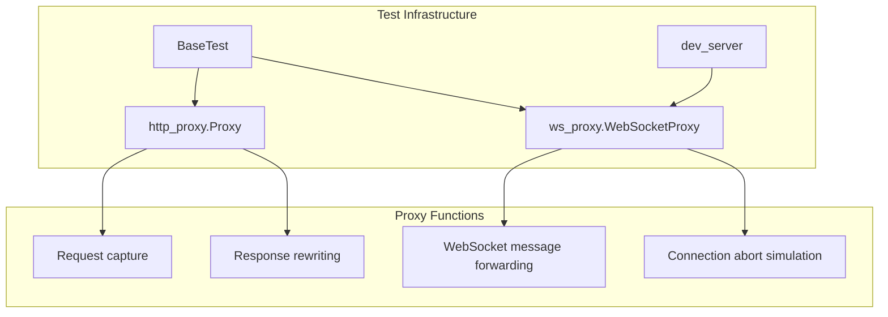
```mermaid
graph TB
    subgraph "Test Infrastructure"
        BaseTest["BaseTest"]
        HTTPProxy["http_proxy.Proxy"]
        WSProxy["ws_proxy.WebSocketProxy"]
        DevServer["dev_server"]
    end
    
    subgraph "Proxy Functions"
        RequestCapture["Request capture"]
        ResponseRewrite["Response rewriting"]
        MessageForwarding["WebSocket message forwarding"]
        ConnectionAbort["Connection abort simulation"]
    end
    
    BaseTest --> HTTPProxy
    BaseTest --> WSProxy
    HTTPProxy --> RequestCapture
    HTTPProxy --> ResponseRewrite
    WSProxy --> MessageForwarding
    WSProxy --> ConnectionAbort
    DevServer --> WSProxy
```

The `BaseTest` class provides `create_proxies()` method that sets up HTTP and WebSocket proxies for testing. The HTTP proxy captures requests and can rewrite responses, particularly modifying `StartResponse` messages to redirect WebSocket connections to the test proxy. The WebSocket proxy forwards messages bidirectionally and provides methods like `send_to_clients()` and `abort_conns()` for simulating various network conditions.

The `collect_states()` helper function tracks connection state changes throughout test execution, enabling verification of expected state transitions.

**Sources:** [tests/test_inngest/test_connect/base.py:38-90](), [tests/test_inngest/test_connect/base.py:93-98](), [pkg/test_core/test_core/ws_proxy.py:13-34](), [pkg/test_core/test_core/ws_proxy.py:47-53]()

# Connection Overview


The Inngest Python SDK connection system provides persistent communication between your application and Inngest servers. This experimental feature enables real-time function execution through WebSocket connections, offering an alternative to traditional HTTP-based function invocation.

The connection system handles authentication, maintains persistent connections, and automatically manages reconnection scenarios. For detailed information about connection states, reconnection logic, and graceful shutdown procedures, see [Connection Lifecycle](6.2).

## System Architecture

The connection system bridges your Inngest functions with the Inngest platform through persistent WebSocket connections. The system consists of connection management, authentication, and message handling components.

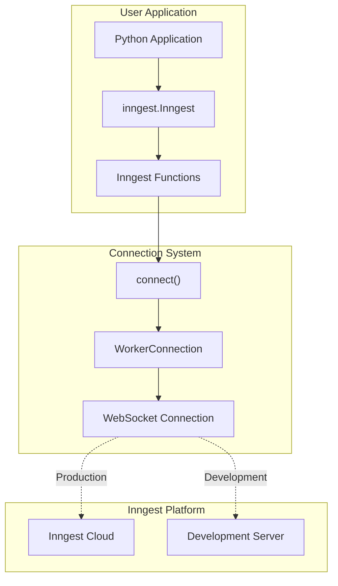
```mermaid
graph TB
    subgraph "User Application"
        APP["Python Application"]
        CLIENT["inngest.Inngest"]
        FUNCTIONS["Inngest Functions"]
    end
    
    subgraph "Connection System"
        CONNECT["connect()"]
        WORKER_CONN["WorkerConnection"]
        WS_CONN["WebSocket Connection"]
    end
    
    subgraph "Inngest Platform"
        CLOUD["Inngest Cloud"]
        DEV_SERVER["Development Server"]
    end
    
    APP --> CLIENT
    CLIENT --> FUNCTIONS
    FUNCTIONS --> CONNECT
    CONNECT --> WORKER_CONN
    WORKER_CONN --> WS_CONN
    
    WS_CONN -.->|"Production"| CLOUD
    WS_CONN -.->|"Development"| DEV_SERVER
```

Sources: [inngest/connect/connect.py:11-38](), [inngest/connect/connection.py:64-146]()

## Core Components

The connection system is built around these key components:

| Component | Purpose | File Location |
|-----------|---------|---------------|
| `connect()` | Main entry point for creating connections | [inngest/connect/connect.py]() |
| `WorkerConnection` | Abstract base for connection implementations | [inngest/connect/connection.py]() |
| `_WebSocketWorkerConnection` | WebSocket-based connection implementation | [inngest/connect/connection.py]() |
| `ConnectionState` | Enum defining connection states (CONNECTING, ACTIVE, etc.) | [inngest/connect/models.py]() |
| Connection Handlers | Message processors for different protocol operations | [inngest/connect/*_handler.py]() |

Sources: [inngest/connect/connect.py:11-38](), [inngest/connect/connection.py:31-146](), [inngest/connect/models.py:13-38]()

## WebSocket Communication

The connection system uses WebSocket protocol for bidirectional communication with Inngest servers. Messages are encoded as Protocol Buffer binary data and include various message types for initialization, execution requests, heartbeats, and lifecycle management.

### Message Flow

```mermaid
sequenceDiagram
    participant SDK as "Python SDK"
    participant WS as "WebSocket Connection" 
    participant INNGEST as "Inngest Server"
    
    SDK->>WS: "Establish connection"
    WS->>INNGEST: "WebSocket handshake"
    INNGEST->>WS: "Connection accepted"
    
    WS->>INNGEST: "Register functions (protobuf)"
    INNGEST->>WS: "Registration confirmed"
    
    loop "Function Execution"
        INNGEST->>WS: "Execution request (protobuf)"
        WS->>SDK: "Invoke function"
        SDK->>WS: "Function result"
        WS->>INNGEST: "Execution response (protobuf)"
    end
    
    WS<->>INNGEST: "Periodic heartbeats"
```

Sources: [inngest/connect/connection.py:221-270](), [inngest/connect/_internal/connect_pb2.py]()

### Protocol Details

The WebSocket connection uses a custom protocol defined in Protocol Buffer format. Key message types include:

| Message Type | Purpose |
|--------------|---------|
| `ConnInitRequest` | Initial connection setup |
| `ExecutorRequest` | Function execution requests |
| `ExecutorResponse` | Function execution results |
| `HeartbeatRequest/Response` | Connection keep-alive |
| `DrainRequest` | Graceful shutdown initiation |

Sources: [inngest/connect/_internal/connect_pb2.py](), [inngest/connect/connection.py:221-270]()

## Authentication Mechanisms

The connection system implements different authentication strategies based on the environment and configuration.

### Cloud Authentication

For production environments, the system uses bearer token authentication derived from signing keys:

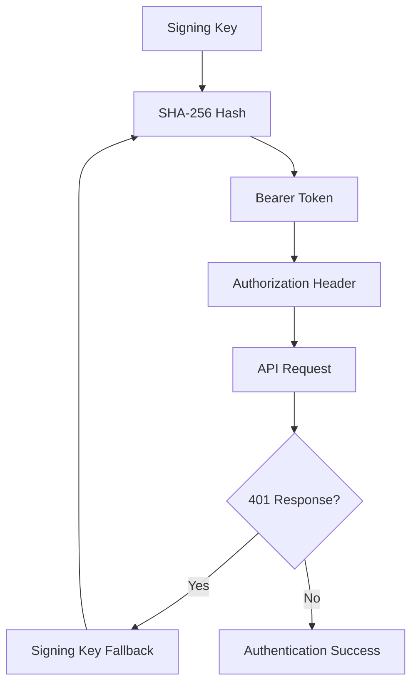
```mermaid
flowchart TD
    SIGNING_KEY["Signing Key"] --> HASH["SHA-256 Hash"]
    HASH --> TOKEN["Bearer Token"]
    TOKEN --> AUTH_HEADER["Authorization Header"]
    
    AUTH_HEADER --> API_REQUEST["API Request"]
    API_REQUEST --> FALLBACK{"401 Response?"}
    FALLBACK -->|"Yes"| FALLBACK_KEY["Signing Key Fallback"]
    FALLBACK_KEY --> HASH
    FALLBACK -->|"No"| SUCCESS["Authentication Success"]
```

Sources: [tests/test_inngest/test_connect/test_init_handshake.py:66-70](), [tests/test_inngest/test_connect/test_init_handshake.py:149-160]()

### Development Authentication

In development mode (`is_production=False`), no authorization header is sent in the initial API request:

| Environment | Authentication Method |
|-------------|----------------------|
| Production (`is_production=True`) | Bearer token from signing key hash |
| Development (`is_production=False`) | No authentication required |
| Signing Key Fallback | Secondary signing key for auth retry |

Sources: [tests/test_inngest/test_connect/test_init_handshake.py:163-213](), [tests/test_inngest/test_connect/test_init_handshake.py:73-161]()

### Authentication Flow

The authentication process includes automatic fallback mechanisms:

1. Primary authentication using main signing key
2. Fallback to secondary signing key on 401 responses  
3. Error handling for non-retryable authentication failures

Sources: [tests/test_inngest/test_connect/test_init_handshake.py:73-161](), [tests/test_inngest/test_connect/test_init_handshake.py:215-265]()

## SDK Integration

The connection system integrates with the broader Inngest SDK through the `connect()` function, which accepts Inngest clients and their associated functions.

### Basic Usage Pattern

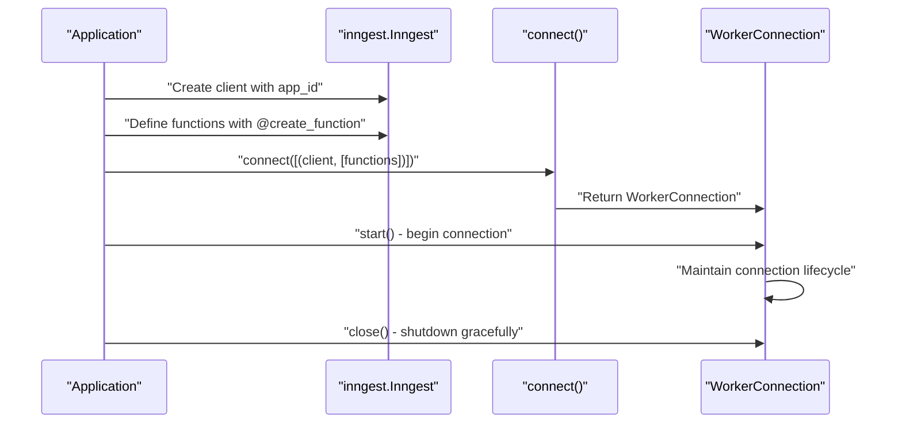
```mermaid
sequenceDiagram
    participant APP as "Application"
    participant CLIENT as "inngest.Inngest"
    participant CONNECT as "connect()"
    participant CONN as "WorkerConnection"
    
    APP->>CLIENT: "Create client with app_id"
    APP->>CLIENT: "Define functions with @create_function"
    APP->>CONNECT: "connect([(client, [functions])])"
    CONNECT->>CONN: "Return WorkerConnection"
    APP->>CONN: "start() - begin connection"
    CONN->>CONN: "Maintain connection lifecycle"
    APP->>CONN: "close() - shutdown gracefully"
```

Sources: [inngest/connect/connect.py:11-38](), [tests/test_inngest/test_connect/test_init_handshake.py:46-71]()

### Integration Points

| Integration Point | Description |
|------------------|-------------|
| Function Registration | Automatic registration of functions with Inngest platform |
| Execution Handling | Real-time function invocation through WebSocket messages |
| Framework Independence | Works alongside existing HTTP-based framework integrations |
| State Management | Maintains connection state across application lifecycle |

Sources: [inngest/connect/execution_handler.py:66-185](), [inngest/connect/connect.py:11-38]()

## Development vs Production Environments

The connection system automatically adapts behavior based on the environment configuration.

### Environment Detection

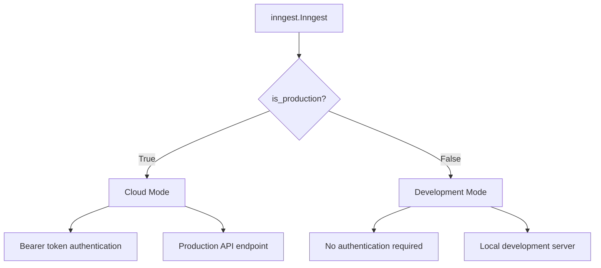
```mermaid
flowchart TD
    CLIENT["inngest.Inngest"] --> PRODUCTION_CHECK{"is_production?"}
    PRODUCTION_CHECK -->|"True"| CLOUD_MODE["Cloud Mode"]
    PRODUCTION_CHECK -->|"False"| DEV_MODE["Development Mode"]
    
    CLOUD_MODE --> CLOUD_AUTH["Bearer token authentication"]
    CLOUD_MODE --> CLOUD_ENDPOINT["Production API endpoint"]
    
    DEV_MODE --> DEV_AUTH["No authentication required"]
    DEV_MODE --> DEV_ENDPOINT["Local development server"]
```

Sources: [tests/test_inngest/test_connect/test_init_handshake.py:19-71](), [tests/test_inngest/test_connect/test_init_handshake.py:163-213]()

### Environment Differences

| Aspect | Production | Development |
|--------|------------|-------------|
| Authentication | Required (signing key) | Not required |
| Server Endpoint | Inngest Cloud API | Local dev server |
| Connection Security | TLS/WSS | Plain WebSocket |
| Function Registration | Persistent | Session-based |

Sources: [tests/test_inngest/test_connect/test_init_handshake.py](), [inngest/connect/connection.py:272-322]()

## Execution Handling

The `_ExecutionHandler` processes execution requests from the Inngest server and manages function executions.

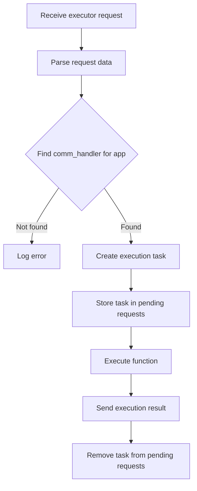
```mermaid
flowchart TD
    A["Receive executor request"] --> B["Parse request data"]
    B --> C{"Find comm_handler for app"}
    C -->|"Not found"| D["Log error"]
    C -->|"Found"| E["Create execution task"]
    E --> F["Store task in pending requests"]
    F --> G["Execute function"]
    G --> H["Send execution result"]
    H --> I["Remove task from pending requests"]
```

Sources: [inngest/experimental/connect/execution_handler.py:66-85](), [inngest/experimental/connect/execution_handler.py:80-185]()

## Lease Extension Mechanism

For long-running functions, the execution handler periodically extends leases to prevent timeouts.

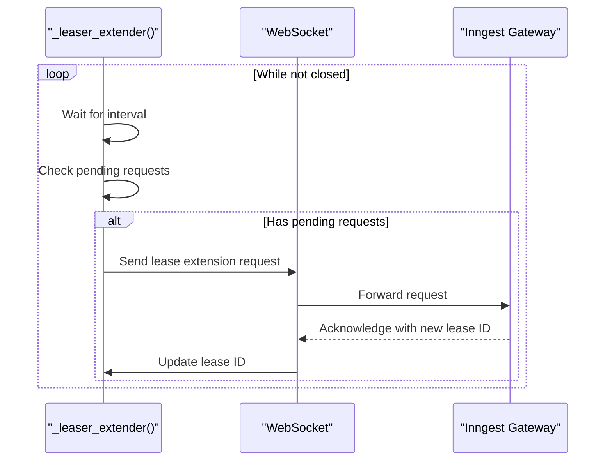
```mermaid
sequenceDiagram
    participant LeaseExtender as "_leaser_extender()"
    participant WS as "WebSocket"
    participant Gateway as "Inngest Gateway"
    
    loop While not closed
        LeaseExtender->>LeaseExtender: Wait for interval
        LeaseExtender->>LeaseExtender: Check pending requests
        alt Has pending requests
            LeaseExtender->>WS: Send lease extension request
            WS->>Gateway: Forward request
            Gateway-->>WS: Acknowledge with new lease ID
            WS->>LeaseExtender: Update lease ID
        end
    end
```

Sources: [inngest/experimental/connect/execution_handler.py:205-242](), [inngest/experimental/connect/execution_handler.py:186-204]()

## Graceful Shutdown

The WebSocket connection supports graceful shutdown, allowing pending tasks to complete before closing.

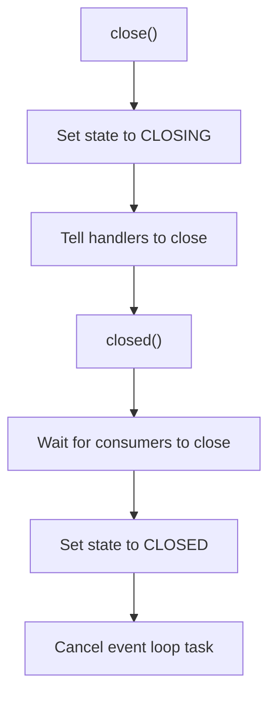
```mermaid
flowchart TD
    A["close()"] --> B["Set state to CLOSING"]
    B --> C["Tell handlers to close"]
    C --> D["closed()"]
    D --> E["Wait for consumers to close"]
    E --> F["Set state to CLOSED"]
    F --> G["Cancel event loop task"]
```

Sources: [inngest/experimental/connect/connection.py:326-365]()

## Development Server Integration

The WebSocket connection system integrates with the development server for local testing and development.

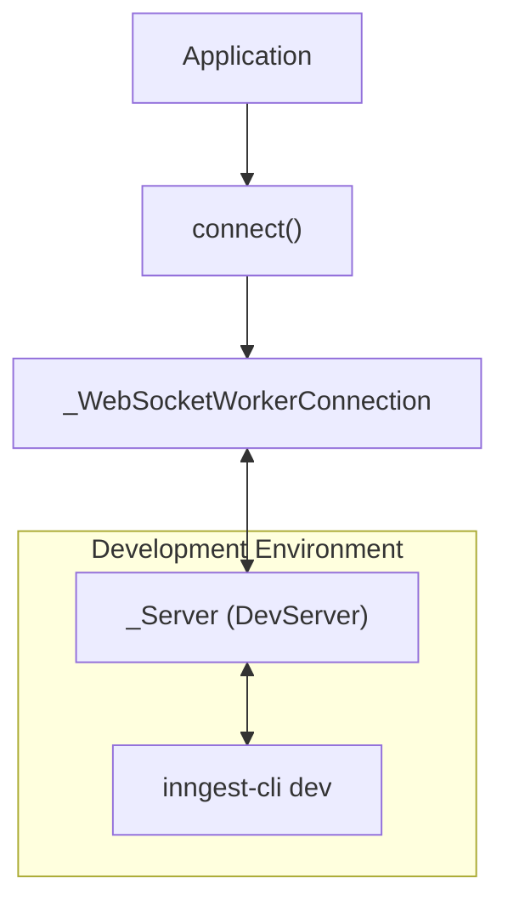
```mermaid
flowchart TD
    A["Application"] --> B["connect()"]
    B --> C["_WebSocketWorkerConnection"]
    
    subgraph "Development Environment"
        D["_Server (DevServer)"]
        E["inngest-cli dev"]
    end
    
    C <--> D
    D <--> E
```

Sources: [inngest/experimental/dev_server/dev_server.py:15-93]()

## Code Organization

The WebSocket connection system is organized into several modular components:

| File | Primary Contents |
|------|-----------------|
| `connection.py` | `_WebSocketWorkerConnection` implementation |
| `models.py` | `ConnectionState` enum and `_State` dataclass |
| `connect.py` | Public `connect()` function |
| `execution_handler.py` | `_ExecutionHandler` for handling execution requests |
| `drain_handler.py` | `_DrainHandler` for graceful shutdown |
| `base_handler.py` | Base class for all handlers |
| `consts.py` | Constants like protocol version and heartbeat interval |

Sources: [inngest/experimental/connect/connection.py](), [inngest/experimental/connect/models.py](), [inngest/experimental/connect/connect.py](), [inngest/experimental/connect/execution_handler.py](), [inngest/experimental/connect/drain_handler.py](), [inngest/experimental/connect/base_handler.py](), [inngest/experimental/connect/consts.py]()

## Usage Example

To use the WebSocket Connection in your application, you create an Inngest client and functions, then pass them to the `connect()` function:

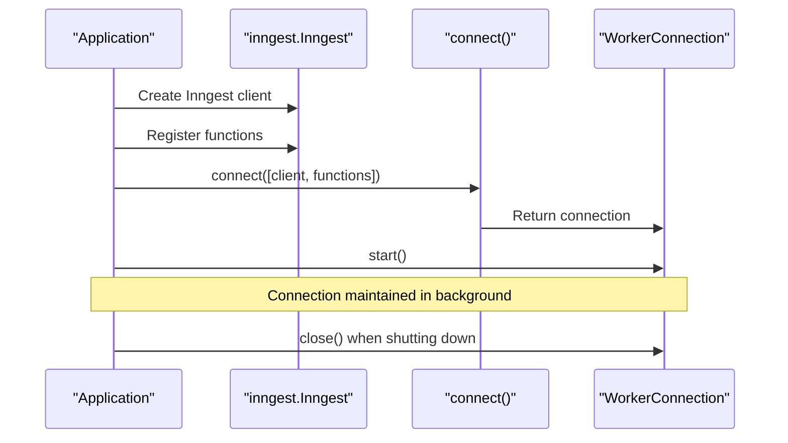
```mermaid
sequenceDiagram
    participant App as "Application"
    participant Client as "inngest.Inngest"
    participant Connect as "connect()"
    participant WSConn as "WorkerConnection"
    
    App->>Client: Create Inngest client
    App->>Client: Register functions
    App->>Connect: connect([client, functions])
    Connect->>WSConn: Return connection
    App->>WSConn: start()
    
    Note over App, WSConn: Connection maintained in background
    
    App->>WSConn: close() when shutting down
```

Sources: [inngest/experimental/connect/connect.py:11-38]()

The WebSocket Connection system provides a reliable, persistent communication channel between your application and the Inngest server, enabling durable function execution in distributed environments.

# Connection Lifecycle


This document explains the lifecycle of connections between the Inngest Python SDK and the Inngest server, covering how connections are established, maintained, and terminated. The connection system enables persistent communication for executing functions in response to events.

## Connection States Overview

The Inngest SDK connection system maintains a well-defined state machine to track the status of its connection to the Inngest server. The `ConnectionState` enum defines the possible states that a connection can be in.

**Connection State Machine**

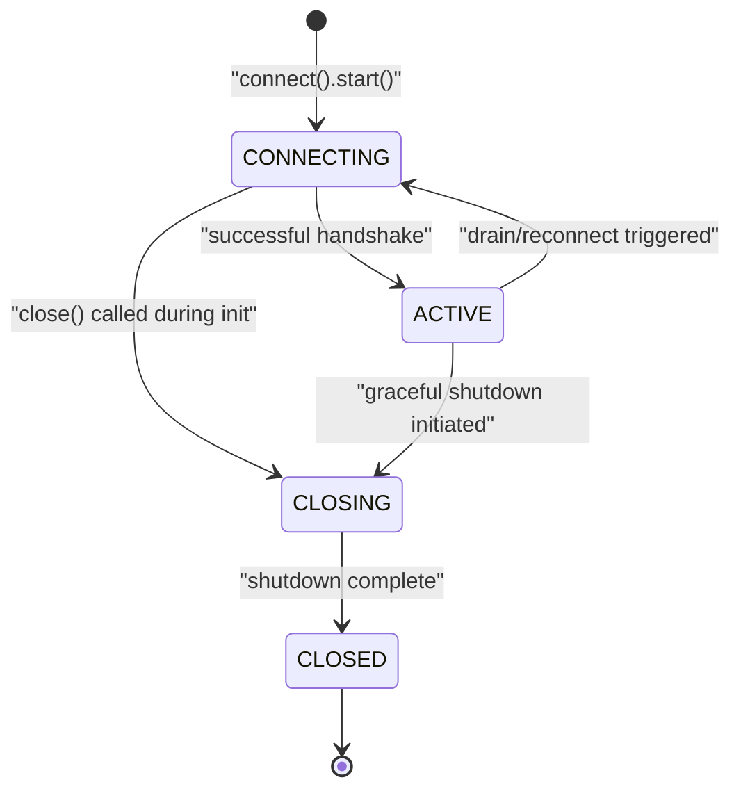
```mermaid
stateDiagram-v2
    [*] --> CONNECTING: "connect().start()"
    CONNECTING --> ACTIVE: "successful handshake"
    CONNECTING --> CLOSING: "close() called during init"
    ACTIVE --> CONNECTING: "drain/reconnect triggered"
    ACTIVE --> CLOSING: "graceful shutdown initiated"
    CLOSING --> CLOSED: "shutdown complete"
    CLOSED --> [*]
```

**Connection States:**

| State | Description |
|-------|-------------|
| `CONNECTING` | Initial state when establishing a connection |
| `ACTIVE` | Connection successfully established and operational |
| `CLOSING` | Connection is in the process of shutting down |
| `CLOSED` | Connection has been terminated |

Sources: [tests/test_inngest/test_connect/test_drain.py:55-60](), [tests/test_inngest/test_connect/test_close.py:66-71](), [tests/test_inngest/test_connect/test_wait_for_execution_request.py:65-70]()

## Connection Initialization Flow

The connection initialization process establishes a persistent connection to the Inngest server for function execution.

**Connection Setup Sequence**

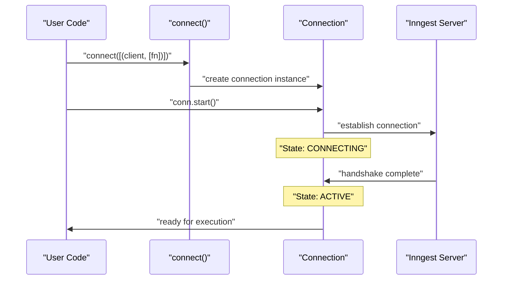
```mermaid
sequenceDiagram
    participant User as "User Code"
    participant connect as "connect()"
    participant conn as "Connection"
    participant Server as "Inngest Server"
    
    User->>connect: "connect([(client, [fn])])"
    connect->>conn: "create connection instance"
    User->>conn: "conn.start()"
    conn->>Server: "establish connection"
    Note over conn: "State: CONNECTING"
    Server->>conn: "handshake complete"
    Note over conn: "State: ACTIVE"
    conn->>User: "ready for execution"
```

### Creating a Connection

Connections are created using the `connect()` function, which takes a list of tuples containing Inngest clients and their associated functions:

```python
from inngest.connect import connect

conn = connect([(client, [fn])])
```

The connection is started by calling the `start()` method, which begins the connection establishment process and transitions the state to `CONNECTING`.

### Connection State Transitions

The connection progresses through states that can be monitored using `wait_for_state()`:

```python
await conn.wait_for_state(ConnectionState.ACTIVE)
```

Sources: [tests/test_inngest/test_connect/test_drain.py:34-41](), [tests/test_inngest/test_connect/test_close.py:41-45](), [tests/test_inngest/test_connect/test_concurrent_sync_functions.py:41-45]()

## Connection API Overview

The connection system provides a clean public API for managing persistent connections to the Inngest server.

**Connection Interface**

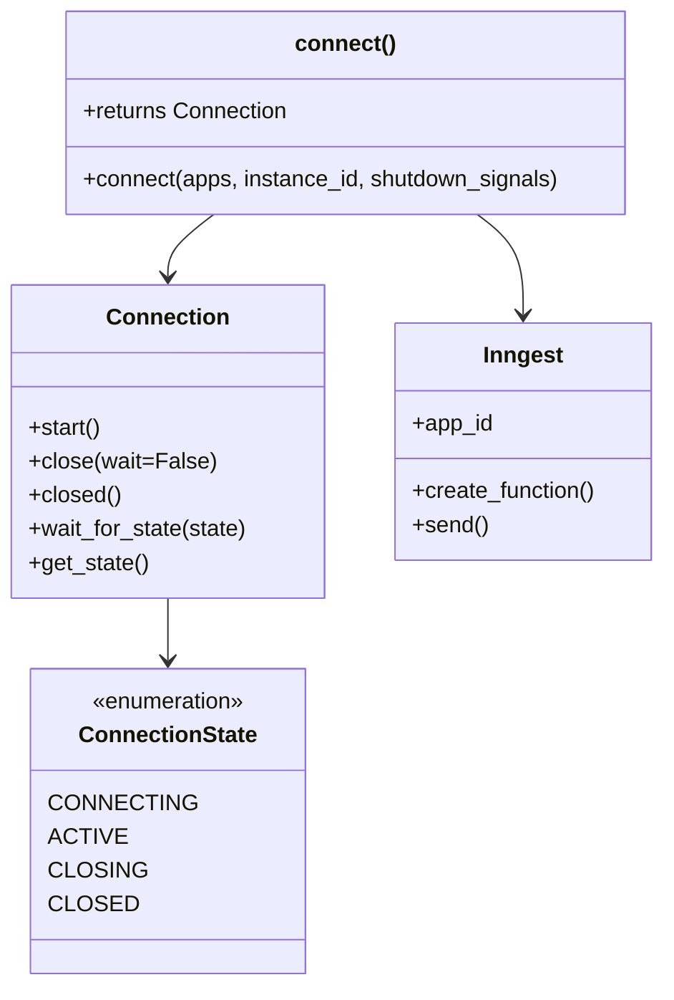
```mermaid
classDiagram
    class connect_function["connect()"] {
        +connect(apps, instance_id, shutdown_signals)
        +returns Connection
    }
    
    class Connection {
        +start()
        +close(wait=False)
        +closed()
        +wait_for_state(state)
        +get_state()
    }
    
    class ConnectionState {
        <<enumeration>>
        CONNECTING
        ACTIVE
        CLOSING
        CLOSED
    }
    
    class InngestClient["Inngest"] {
        +app_id
        +create_function()
        +send()
    }
    
    connect_function --> Connection
    Connection --> ConnectionState
    connect_function --> InngestClient
```

### Key Methods

| Method | Description |
|--------|-------------|
| `connect(apps)` | Creates a connection from list of (client, functions) tuples |
| `start()` | Begins connection establishment process |
| `close(wait=False)` | Initiates graceful shutdown |
| `closed()` | Waits for connection to be fully closed |
| `wait_for_state(state)` | Blocks until connection reaches specified state |

### Function Registration

Functions are registered with the connection by passing them in the `connect()` call:

```python
conn = connect([
    (client1, [function1, function2]),
    (client2, [function3])
])
```

Sources: [tests/test_inngest/test_connect/test_drain.py:34](), [tests/test_inngest/test_connect/test_close.py:41](), [tests/test_inngest/test_connect/test_concurrent_sync_functions.py:41]()

## Function Execution via Connection

Once a connection is established, the Inngest server sends execution requests for registered functions through the persistent connection.

**Execution Flow**

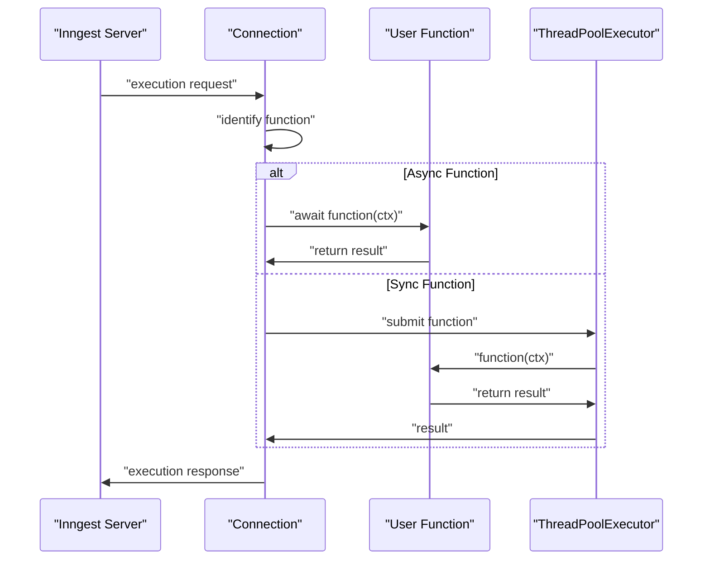
```mermaid
sequenceDiagram
    participant Server as "Inngest Server"
    participant Connection as "Connection"
    participant Function as "User Function"
    participant ThreadPool as "ThreadPoolExecutor"
    
    Server->>Connection: "execution request"
    Connection->>Connection: "identify function"
    
    alt Async Function
        Connection->>Function: "await function(ctx)"
        Function->>Connection: "return result"
    else Sync Function
        Connection->>ThreadPool: "submit function"
        ThreadPool->>Function: "function(ctx)"
        Function->>ThreadPool: "return result"
        ThreadPool->>Connection: "result"
    end
    
    Connection->>Server: "execution response"
```

### Concurrent Execution

The connection system supports concurrent execution of functions:

- **Async functions**: Run directly in the event loop
- **Sync functions**: Execute in a shared `ThreadPoolExecutor` to avoid blocking the event loop

This enables multiple functions to run simultaneously without blocking each other.

### Function Context

Each function execution receives a context object containing:
- `run_id`: Unique identifier for the function execution
- Event data that triggered the function
- Step execution capabilities

Sources: [tests/test_inngest/test_connect/test_concurrent_sync_functions.py:26-40](), [tests/test_inngest/test_connect/test_close.py:28-39]()

## Connection Termination

The connection system supports graceful shutdown with proper cleanup and execution completion.

### Graceful Shutdown Process

Graceful shutdown is initiated by calling the `close()` method:

**Shutdown Sequence**

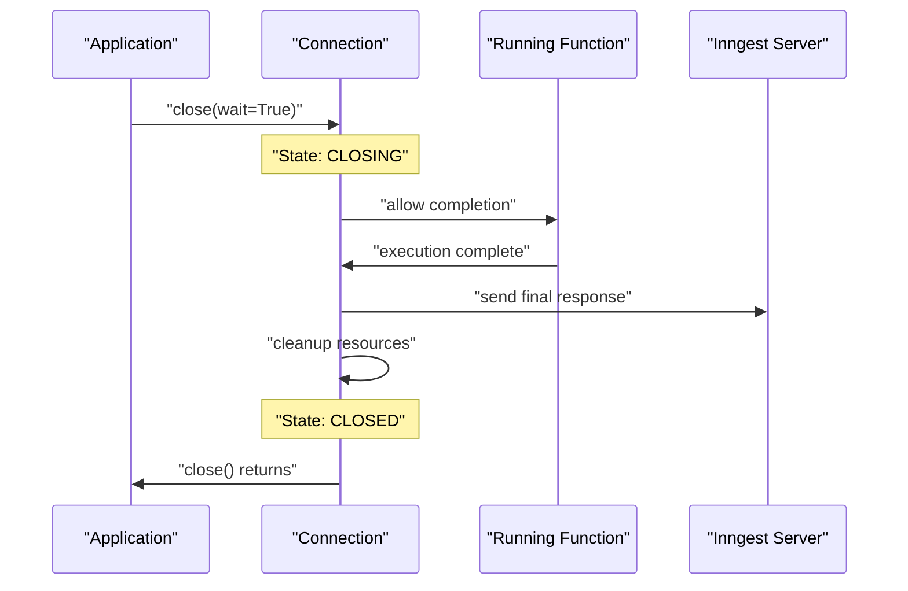
```mermaid
sequenceDiagram
    participant App as "Application"
    participant Connection as "Connection"
    participant Function as "Running Function"
    participant Server as "Inngest Server"
    
    App->>Connection: "close(wait=True)"
    Note over Connection: "State: CLOSING"
    Connection->>Function: "allow completion"
    Function->>Connection: "execution complete"
    Connection->>Server: "send final response"
    Connection->>Connection: "cleanup resources"
    Note over Connection: "State: CLOSED"
    Connection->>App: "close() returns"
```

### Wait for Execution Completion

When `close(wait=True)` is called, the connection waits for in-progress function executions to complete before fully shutting down:

1. Connection state transitions to `CLOSING`
2. No new executions are accepted
3. Existing executions are allowed to complete
4. Connection fully closes once all executions finish

This ensures that function runs are not interrupted during shutdown.

### Signal Handling

The connection system can be configured to handle OS signals for graceful shutdown:

```python
conn = connect(
    [(client, [fn])],
    shutdown_signals=[signal.SIGTERM, signal.SIGUSR1]
)
```

When a configured signal is received, the connection automatically initiates graceful shutdown, allowing functions to complete before terminating.

Sources: [tests/test_inngest/test_connect/test_close.py:49-71](), [tests/test_inngest/test_connect/test_wait_for_execution_request.py:49-70](), [tests/test_inngest/test_connect/test_signals.py:58-74]()

## Reconnection and Drain Handling

The connection system includes automatic reconnection capabilities to handle network issues and server maintenance.

### Drain Mechanism

The Inngest server can send a drain message (`GATEWAY_CLOSING`) to indicate that the current gateway is shutting down:

**Drain and Reconnect Flow**

```mermaid
sequenceDiagram
    participant Connection as "Connection"
    participant Gateway as "Current Gateway"
    participant NewGateway as "New Gateway"
    
    Note over Connection: "State: ACTIVE"
    Gateway->>Connection: "GATEWAY_CLOSING message"
    Note over Connection: "Drain triggered"
    Connection->>Gateway: "close current connection"
    Note over Connection: "State: CONNECTING"
    Connection->>NewGateway: "establish new connection"
    Note over Connection: "State: ACTIVE"
```

When a drain is received:

1. The connection automatically closes the current WebSocket
2. State transitions back to `CONNECTING`
3. A new connection is established to a different gateway
4. Function registration and execution resume normally

### Reconnection States

The reconnection process involves cycling through connection states:

```
ACTIVE → CONNECTING → ACTIVE (successful reconnection)
```

This ensures continuous availability even during server maintenance windows.

Sources: [tests/test_inngest/test_connect/test_drain.py:44-60]()

## Testing and Debugging Connections

The SDK includes comprehensive testing utilities for connection lifecycle testing, particularly focusing on reconnection scenarios.

```mermaid
flowchart TD
    subgraph "Test Infrastructure"
        TP["_Proxies"]
        WSP["WebSocketProxy"]
        HP["HTTP_Proxy"]
    end
    
    subgraph "Tests"
        RC["TestReconnect"]
        IH["TestAPIRequestHeaders"]
    end
    
    TP --> WSP
    TP --> HP
    RC --> TP
    IH --> HP
    
    WSP --> |"abort_conns()"| RC
```

The test infrastructure allows:

1. Mocking the Inngest API and gateway
2. Simulating connection failures by aborting WebSocket connections
3. Verifying that the SDK correctly reconnects after failures
4. Testing authentication header handling in different modes (development vs production)

Sources: [tests/test_inngest/test_connect/test_reconnect.py:12-60](), [tests/test_inngest/test_connect/base.py:38-94](), [pkg/test_core/test_core/ws_proxy.py:13-107]()

## Conclusion

The connection lifecycle in the Inngest Python SDK encompasses a complete flow from initialization through various states to termination. The system is designed to be resilient, with built-in reconnection capabilities and proper error handling. The modular architecture with specialized handlers enables clean separation of concerns while maintaining a coherent connection management system.

Understanding the connection lifecycle is essential for developers integrating Inngest into their applications, especially in production environments where connection reliability is critical.