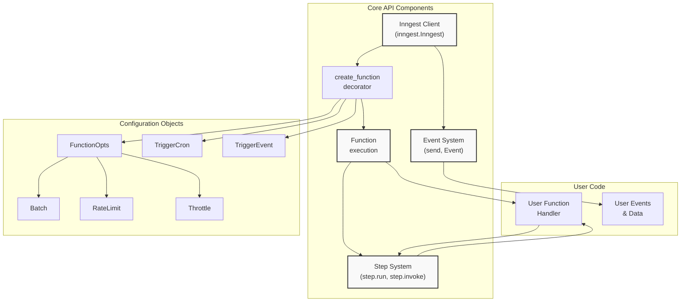
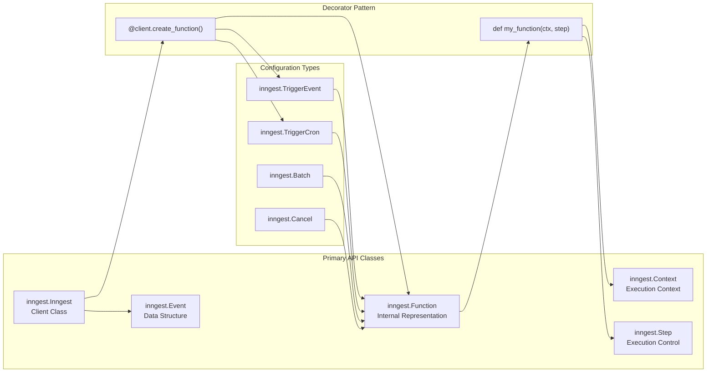
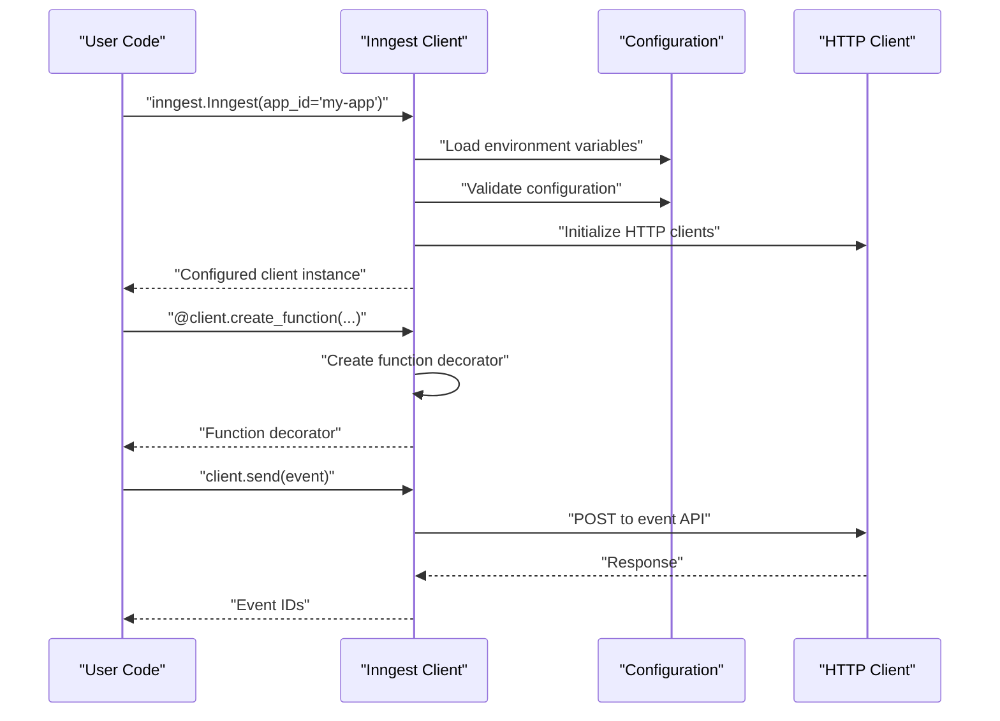
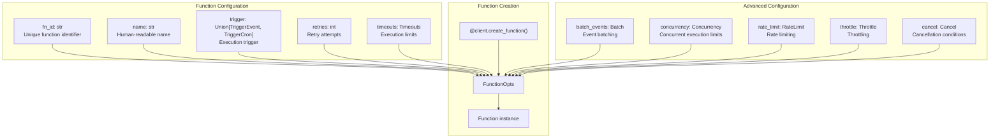
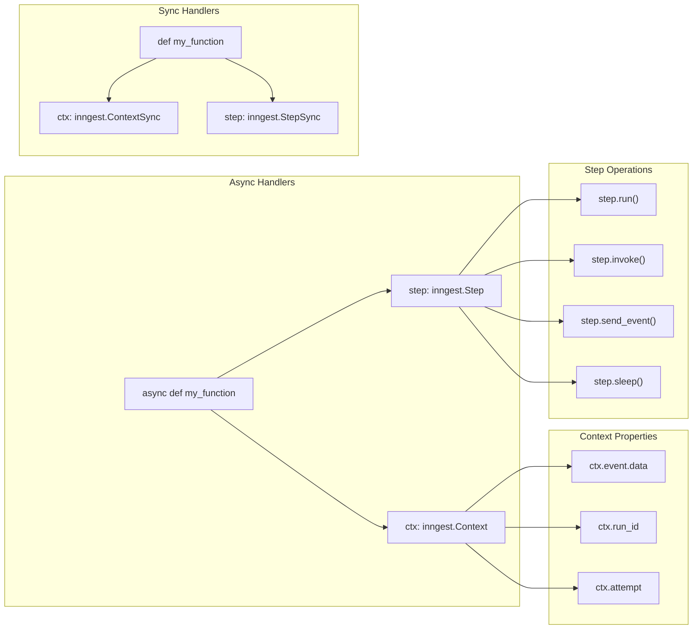
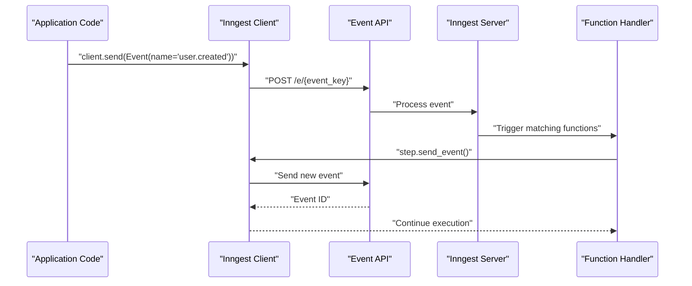
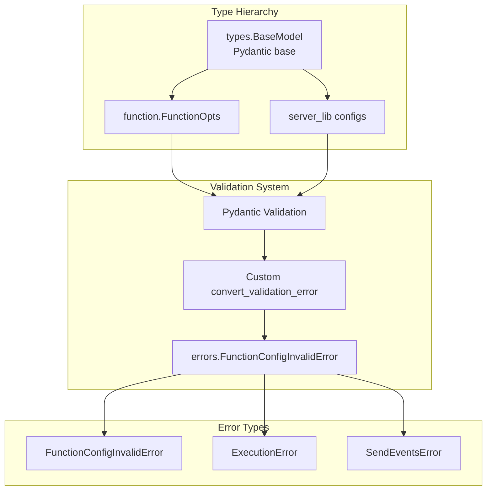
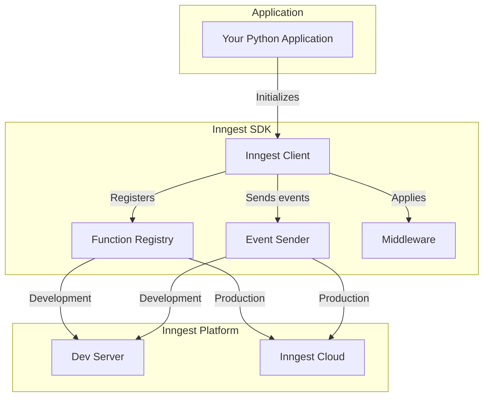

This document provides a comprehensive overview of the main user-facing APIs in the Inngest Python SDK. The Core API encompasses the essential classes and methods developers use to create event-driven functions, manage execution flow, and interact with the Inngest platform.

The Core API consists of four primary components: the Inngest client for initialization and configuration, function definition and registration, step-based execution control, and event sending/handling. For detailed information about framework-specific integration, see [Framework Integration](#4). For advanced middleware functionality, see [Middleware System](#5).



**Core API Architecture Overview**

Sources: [README.md:24-207](), [pkg/inngest/inngest/_internal/client_lib/client.py:41-301](), [pkg/inngest/inngest/_internal/function.py:65-350]()

## API Surface and Entry Points

The Core API provides a clean, decorator-based interface that follows Python conventions. The main entry point is the `Inngest` client class, which serves as both a configuration container and function factory.



**API Entry Points and Decorator Pattern**

The API design follows a fluent interface pattern where the `Inngest` client creates function decorators that return configured `Function` objects. This provides type safety and clear separation of concerns.

Sources: [pkg/inngest/inngest/_internal/client_lib/client.py:205-301](), [pkg/inngest/inngest/_internal/function.py:107-129]()

## Client Initialization and Configuration

The `Inngest` client class serves as the primary configuration point and factory for creating functions. It manages authentication, server endpoints, and global settings that apply to all functions created by that client instance.

| Parameter | Type | Purpose |
|-----------|------|---------|
| `app_id` | `str` | Unique identifier for the application |
| `is_production` | `bool` | Controls server endpoint and security settings |
| `api_base_url` | `str` | Custom Inngest API endpoint |
| `event_api_base_url` | `str` | Custom event API endpoint |
| `event_key` | `str` | Authentication key for event sending |
| `signing_key` | `str` | Request signature verification key |
| `middleware` | `list` | Global middleware applied to all functions |



**Client Initialization Flow**

The client initialization process loads configuration from multiple sources including constructor arguments, environment variables, and defaults. It establishes both synchronous and asynchronous HTTP clients for different use cases.

Sources: [pkg/inngest/inngest/_internal/client_lib/client.py:68-153](), [pkg/inngest/inngest/_internal/client_lib/client.py:614-636]()

## Function Definition System

Functions are defined using the `create_function` decorator, which accepts configuration parameters and returns a decorator that can be applied to user-defined handler functions. The system supports both synchronous and asynchronous handlers.



**Function Configuration Options**

The function configuration system provides extensive control over execution behavior, from basic retry logic to advanced features like event batching and rate limiting.

Sources: [pkg/inngest/inngest/_internal/function.py:29-64](), [pkg/inngest/inngest/_internal/client_lib/client.py:205-301](), [pkg/inngest/inngest/_internal/server_lib/registration.py:22-202]()

## Handler Function Signatures

Inngest functions receive two primary parameters: a context object containing execution metadata and event data, and a step object for controlling execution flow. The system supports both async and sync variants.



**Handler Function Interface**

The handler interface provides access to execution context and step-based control flow. Both sync and async variants follow the same pattern but use different base classes for type safety.

Sources: [README.md:67-76](), [README.md:117-149](), [README.md:169-177]()

## Event System Integration

The Core API provides methods for sending events both from within functions and from external application code. Events are the primary mechanism for triggering function execution and inter-function communication.



**Event Flow and Function Triggering**

Events flow through the system to trigger function execution and enable inter-function communication. The API provides both synchronous and asynchronous event sending methods.

| Method | Usage | Return Type |
|--------|-------|-------------|
| `client.send()` | Async event sending | `list[str]` (event IDs) |
| `client.send_sync()` | Sync event sending | `list[str]` (event IDs) |
| `step.send_event()` | Send from within function | Event ID |

Sources: [pkg/inngest/inngest/_internal/client_lib/client.py:452-585](), [README.md:179-191]()

## Type System and Error Handling

The Core API uses Python's type system extensively to provide compile-time safety and runtime validation. Configuration objects inherit from `BaseModel` and provide automatic validation and serialization.



**Type System and Validation Architecture**

The type system provides runtime validation and clear error messages for configuration issues. All configuration classes implement custom error conversion to provide Inngest-specific error messages.

Sources: [pkg/inngest/inngest/_internal/function.py:58-62](), [pkg/inngest/inngest/_internal/server_lib/registration.py:14-20]()

# Inngest Client


The Inngest Client is the central component of the Inngest Python SDK that enables applications to interact with the Inngest service. It provides functionality for registering serverless functions, sending events, and managing the communication between your application and the Inngest platform. This document focuses on the client's initialization, configuration options, and core methods.

For information about defining functions with the client, see [Functions](#3.2). For details on event handling, see [Events](#3.4).

## Overview

The Inngest Client initializes the connection to the Inngest service and serves as the primary interface for registering functions and sending events. It can operate in either development mode with the local Dev Server or production mode connecting to Inngest Cloud.



Sources: [pkg/inngest/inngest/_internal/client_lib/client.py:32-85](), [README.md:60-63]()

## Client Initialization

The Inngest Client is instantiated with configuration parameters that determine how it communicates with the Inngest service.

### Constructor Parameters

| Parameter | Type | Required | Description |
|-----------|------|----------|-------------|
| `app_id` | str | Yes | Unique identifier for your application |
| `is_production` | bool | No | Whether to use production mode (Inngest Cloud) or development mode (Dev Server) |
| `api_base_url` | str | No | Custom base URL for the Inngest API |
| `event_api_base_url` | str | No | Custom base URL for the Inngest Event API |
| `event_key` | str | No | Authentication key for sending events |
| `signing_key` | str | No | Authentication key for validating requests |
| `env` | str | No | Branch environment name |
| `logger` | Logger | No | Custom logger |
| `middleware` | list | No | List of middleware to use |

Sources: [pkg/inngest/inngest/_internal/client_lib/client.py:59-89]()

### Example Initialization

Basic client initialization:

```python
import inngest