This document provides a comprehensive guide for developers working with or contributing to the Inngest Python SDK. It covers setting up a development environment, running tests, and understanding the continuous integration and deployment pipeline.

## Development Environment Setup

Setting up a development environment for the Inngest Python SDK requires Python 3.10 or newer. The SDK supports Python versions from 3.10 up to 3.13 as specified in the project configuration.

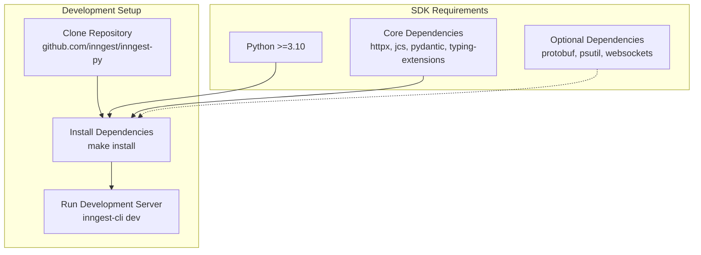

The project uses a Makefile for common development tasks including installation, testing, and building. To set up your development environment:

1. Clone the repository
2. Run `make install` to install all dependencies
3. Run tests with `make utest` (unit tests) or `make itest` (integration tests)

Sources: [pkg/inngest/pyproject.toml:1-36](), [.github/workflows/inngest.yml:42-45]()

## Local Development Server

The Inngest SDK integrates with the Inngest CLI development server for local testing of functions. The `dev_server` module manages a subprocess that runs `inngest-cli dev` with specific configuration.

### Development Server Architecture

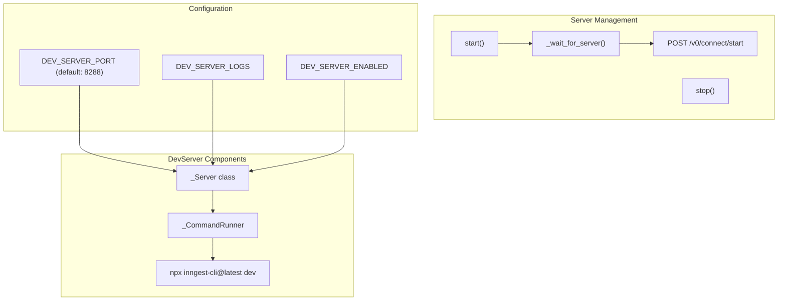

The development server implementation includes:

- **Process Management**: Uses `subprocess.Popen` to run the Inngest CLI dev server
- **Health Checking**: Polls the `/v0/connect/start` endpoint until the server is ready
- **Configuration**: Supports environment variables for port, logging, and enabling/disabling
- **Artifact Collection**: Optionally writes logs to `artifacts/dev_server.log` for debugging

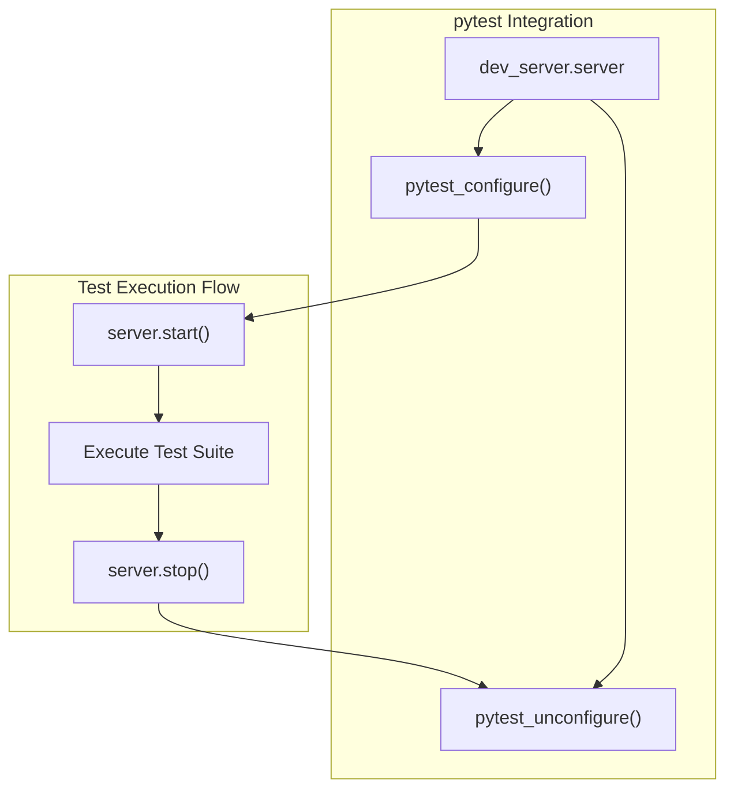

The development server is automatically managed by pytest hooks in both test packages, ensuring a clean test environment for each test run.

Sources: [pkg/inngest/inngest/experimental/dev_server/dev_server.py:15-94](), [tests/test_inngest/conftest.py:5-10](), [tests/test_inngest_encryption/conftest.py:5-10]()

## Testing Infrastructure

The Inngest Python SDK employs a comprehensive testing infrastructure with specialized test helpers, GraphQL API integration, and structured test case patterns.

### Test Organization and Architecture

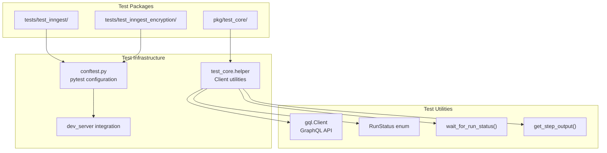

### Test Helper System

The `test_core.helper` module provides essential utilities for interacting with the development server's GraphQL API:

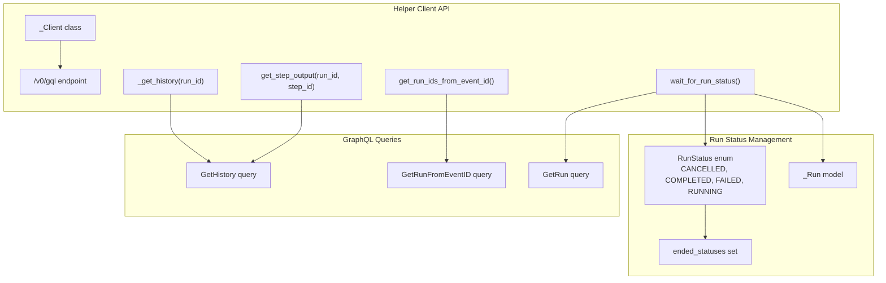

### Test Case Patterns

Test cases follow a structured pattern with case-based organization:

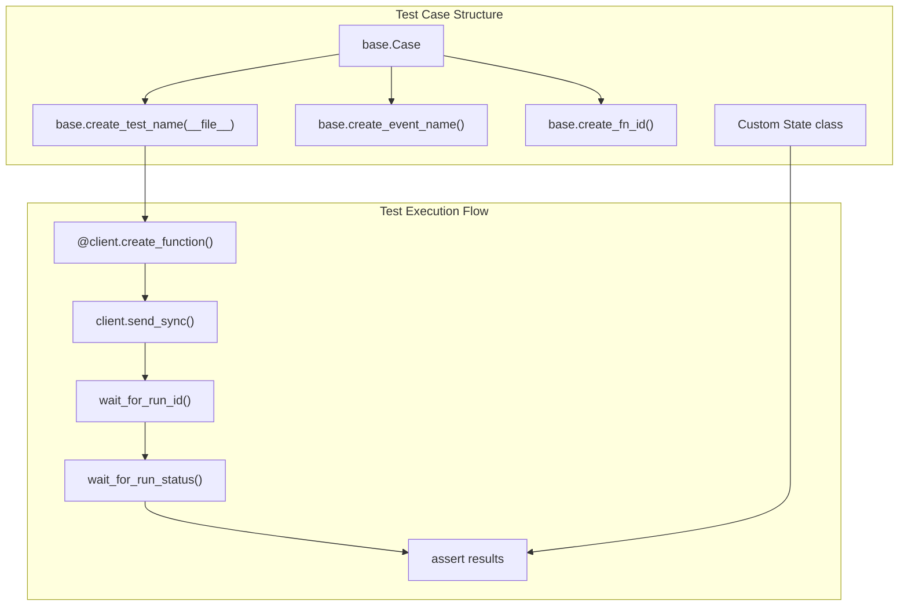

Test cases are organized in separate files under feature directories (e.g., `test_function/cases/`, `test_registration/cases/`) with each test implementing a complete scenario from function creation to result verification.

Sources: [pkg/test_core/test_core/helper.py:33-216](), [tests/test_inngest/test_function/cases/middleware_parallel_steps.py:26-161](), [tests/conftest.py:3-6]()

### Middleware and Parallel Step Testing

The SDK includes specialized tests for complex scenarios like middleware integration and parallel step execution:

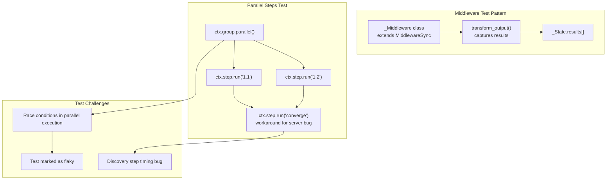

The parallel steps test demonstrates several important patterns:
- **Middleware Integration**: Custom middleware classes capture step execution results
- **State Management**: Test state classes collect results across async execution
- **Parallel Execution**: Using `ctx.group.parallel()` for concurrent step execution
- **Known Issues**: Workarounds for server-side bugs and race conditions

Test cases include both sync and async variants, with helper functions like `base.asyncify()` to convert sync functions for async contexts.

Sources: [tests/test_inngest/test_function/cases/middleware_parallel_steps.py:1-172]()

## CI/CD Pipeline

The Inngest Python SDK uses GitHub Actions for continuous integration and deployment. The pipeline ensures that all code changes are tested across multiple Python versions before being released.

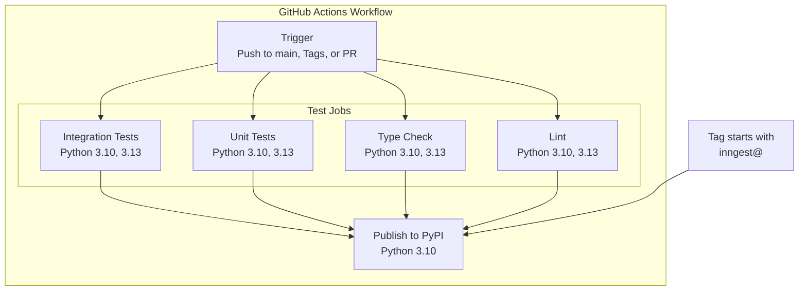

The CI/CD pipeline includes:

1. **Integration Testing**: Runs the integration test suite on Python 3.10 and 3.13
2. **Unit Testing**: Runs the unit test suite on Python 3.10 and 3.13
3. **Type Checking**: Verifies type annotations on Python 3.10 and 3.13
4. **Linting**: Checks code style and quality on Python 3.10 and 3.13
5. **PyPI Publication**: Publishes the package to PyPI when a tag starting with "inngest@" is pushed

The pipeline runs on push to main, tags, and pull requests that affect Python code, Makefiles, pyproject.toml files, or GitHub Actions configuration.

Sources: [.github/workflows/inngest.yml:1-136](), [.github/workflows/inngest_encryption.yml:1-121]()

### Package Publication Process

When a new release is tagged with a version prefixed by "inngest@" or "inngest_encryption@", the GitHub Actions workflow will automatically build the package and publish it to PyPI.

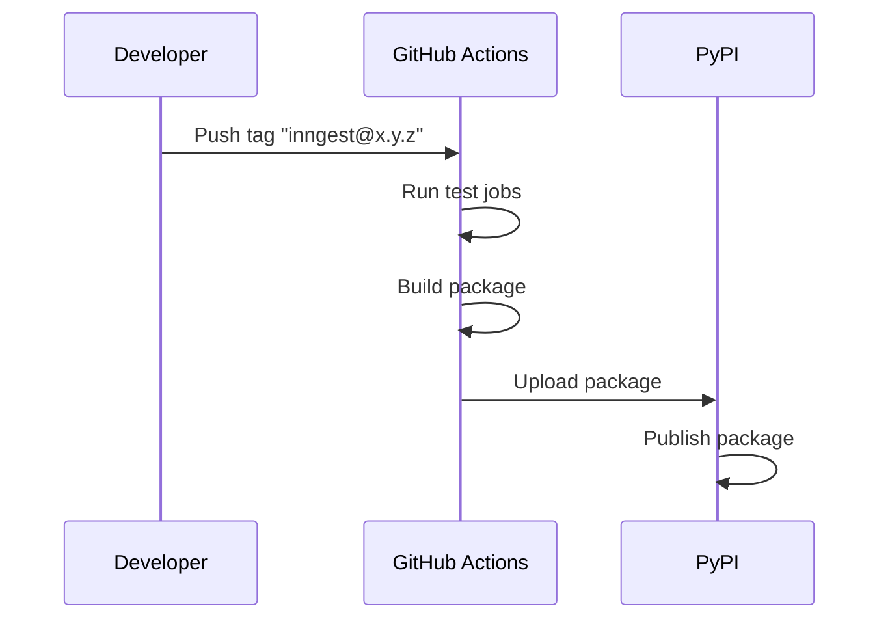

The publication process uses GitHub's OIDC token for secure publishing to PyPI without storing credentials in the repository.

Sources: [.github/workflows/inngest.yml:71-102](), [.github/workflows/inngest_encryption.yml:56-86]()

## Cloud Environment Testing

The SDK includes comprehensive tests for cloud environment integration, including branch environment support and request signing validation.

### Cloud Branch Environment Test Pattern

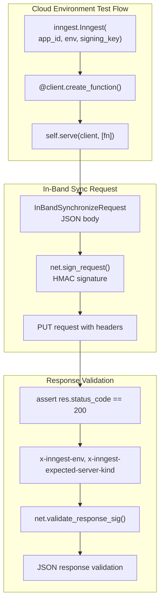

### Environment Configuration Details

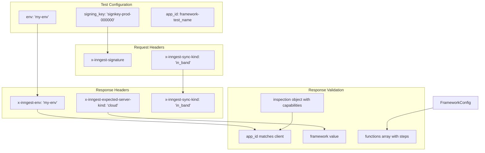

The test validates that the SDK properly:
- Signs requests using HMAC with the provided signing key
- Includes environment information in response headers
- Returns correctly formatted function configuration data
- Validates response signatures from the cloud service
- Includes comprehensive inspection data with SDK capabilities

Sources: [tests/test_inngest/test_registration/cases/cloud_branch_env.py:12-122]()

## Debugging and Troubleshooting

For easier debugging during development and CI, the SDK includes features to capture and report information about test failures.

### Dev Server Logs

The CI/CD pipeline includes a step to upload development server logs as artifacts when tests fail, making it easier to diagnose issues.

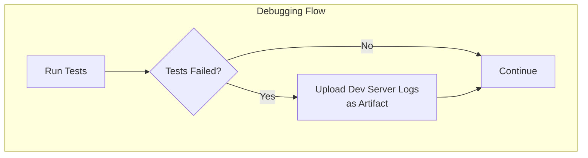

The server logs are written to `./tests/test_inngest/artifacts/dev_server.log` and are automatically uploaded to GitHub Actions when tests fail in the CI environment.

Sources: [.github/workflows/inngest.yml:47-52]()

## Special Testing Considerations

Some SDK features require special testing approaches due to their asynchronous or concurrent nature.

### Testing Parallel Steps

Testing parallel steps can be challenging due to race conditions inherent in parallel execution. Some tests for parallel steps are marked as expected to fail (`@pytest.mark.xfail`) until parallelism improvements are implemented.

Sources: [tests/test_inngest/test_function/cases/middleware_parallel_steps.py:1-6](), [tests/test_inngest/test_function/cases/middleware_parallel_steps.py:88-88]()

## Development Roadmap

The codebase includes comments indicating planned improvements, such as:

1. Parallelism improvements to address flakiness in parallel step tests
2. Checks to ensure that git tags match package versions during publishing

These upcoming changes are documented in code comments and can be found throughout the codebase.

Sources: [tests/test_inngest/test_function/cases/middleware_parallel_steps.py:87-88](), [.github/workflows/inngest.yml:80-81]()