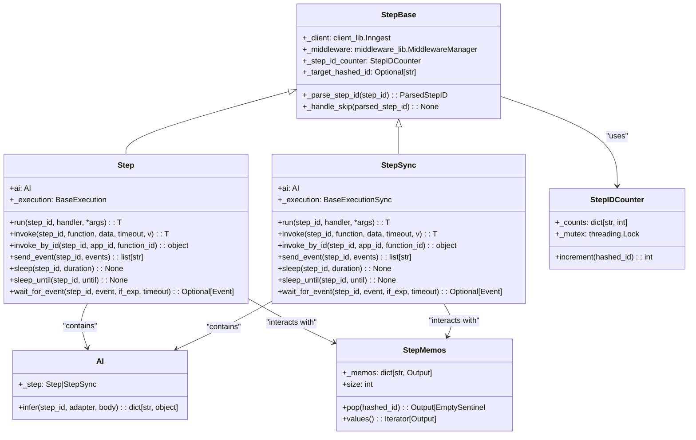
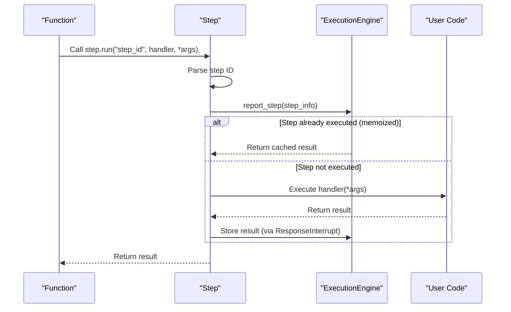

trigger = inngest.TriggerEvent(
    event="app/user.updated",
    expression="event.data.status == 'active'"
)
```

### Cron Triggers

Cron triggers run functions on a schedule using cron expressions:

```python
# Run every day at midnight
trigger = inngest.TriggerCron(cron="0 0 * * *")
```

Functions can have multiple triggers by passing a list to the `trigger` parameter:

```python
@inngest_client.create_function(
    fn_id="multi_trigger_function",
    trigger=[
        inngest.TriggerEvent(event="app/event.one"),
        inngest.TriggerEvent(event="app/event.two"),
        inngest.TriggerCron(cron="0 * * * *")  # Every hour
    ]
)
```

Sources: [pkg/inngest/inngest/_internal/function.py:69-70](), [pkg/inngest/inngest/_internal/client_lib/client.py:208-212]()

## Function Configuration Options

Functions support various configuration options for controlling execution behavior:

### Retries

```python
@inngest_client.create_function(
    fn_id="function_with_retries",
    trigger=inngest.TriggerEvent(event="app/my.event"),
    retries=3  # Retry up to 3 times on failure
)
```

### Concurrency

```python
@inngest_client.create_function(
    fn_id="limited_concurrency",
    trigger=inngest.TriggerEvent(event="app/high.volume"),
    concurrency=[
        inngest.Concurrency(limit=5)  # Limit to 5 concurrent executions
    ]
)
```

### Idempotency

```python
@inngest_client.create_function(
    fn_id="idempotent_processor",
    trigger=inngest.TriggerEvent(event="app/payment"),
    idempotency="event.data.transaction_id"  # Deduplicate by transaction ID
)
```

Sources: [pkg/inngest/inngest/_internal/client_lib/client.py:186-273](), [pkg/inngest/inngest/_internal/function.py:29-60]()

## Production Considerations

When using Inngest functions in production:

1. Set `is_production=True` in the Inngest client or omit the `INNGEST_DEV` environment variable
2. Set the `INNGEST_EVENT_KEY` and `INNGEST_SIGNING_KEY` environment variables
3. Register all functions with your web framework using the appropriate `serve` function

```python
inngest_client = inngest.Inngest(
    app_id="my_app",
    is_production=os.getenv("INNGEST_DEV") is None,
)
```

Sources: [README.md:193-205]()

# Steps


Steps are a core feature of the Inngest Python SDK that enable durable, idempotent execution of code within functions. They act as discrete units of work that retry on failure and run exactly once on success. This document explains how steps work, their implementation, and the operations they support.

For information about the larger function system that contains steps, see [Functions](#3.2).

## Step Architecture

The Inngest SDK provides two step implementations: asynchronous (`Step`) and synchronous (`StepSync`), both inheriting from a common base class. Each step works with the execution engine to provide memoization and idempotency.

### Core Step Classes



### Step Opcode System

Steps communicate with the Inngest server using specific opcodes that define the type of operation:

| Opcode | Purpose | Used By |
|--------|---------|---------|
| `STEP_RUN` | Execute user code with memoization | `step.run()` |
| `INVOKE` | Call another Inngest function | `step.invoke()` |
| `SLEEP` | Pause execution for duration | `step.sleep()` |
| `WAIT_FOR_EVENT` | Wait for specific event | `step.wait_for_event()` |
| `AI_GATEWAY` | AI model inference | `step.ai.infer()` |
| `STEP_ERROR` | Capture step errors | Error handling |

Sources: [pkg/inngest/inngest/_internal/step_lib/base.py:83-125](), [pkg/inngest/inngest/_internal/step_lib/step_async.py:26-44](), [pkg/inngest/inngest/_internal/step_lib/step_sync.py:24-42](), [pkg/inngest/inngest/_internal/server_lib/consts.py:72-79]()

## Step Execution Flow

When a step is executed, the following sequence occurs to ensure durability and idempotency:



Sources: [pkg/inngest/inngest/_internal/step_lib/step_async.py:160-236](), [pkg/inngest/inngest/_internal/step_lib/step_sync.py:145-215](), [pkg/inngest/inngest/_internal/execution_lib/v0.py:54-106]()

## Step Operations

### Step.run

The most common step operation is `run`, which executes a handler function and memoizes its result:

```python
def _fetch_data(id):
    res = requests.get(f"https://api.example.com/data/{id}")
    return res.json()

# The step will run once and memoize the result
data = step.run("fetch_data", _fetch_data, user_id)
```

Key characteristics of `step.run`:
- Takes a step ID, handler function, and optional arguments for the handler
- Memoizes the result, so repeated executions return the cached value
- Automatically retries on failures (except for non-retriable errors)
- Supports both synchronous and asynchronous handlers
- Uses `STEP_RUN` opcode internally to communicate with Inngest server
- Handles nested step detection and throws `NestedStepInterrupt` when detected

#### Step Targeting

The step system supports targeting specific steps during execution. When `_target_hashed_id` is set, only the targeted step executes while others are skipped via `SkipInterrupt`:

```python