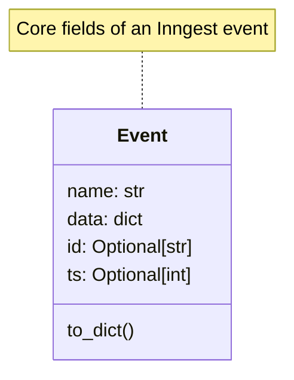
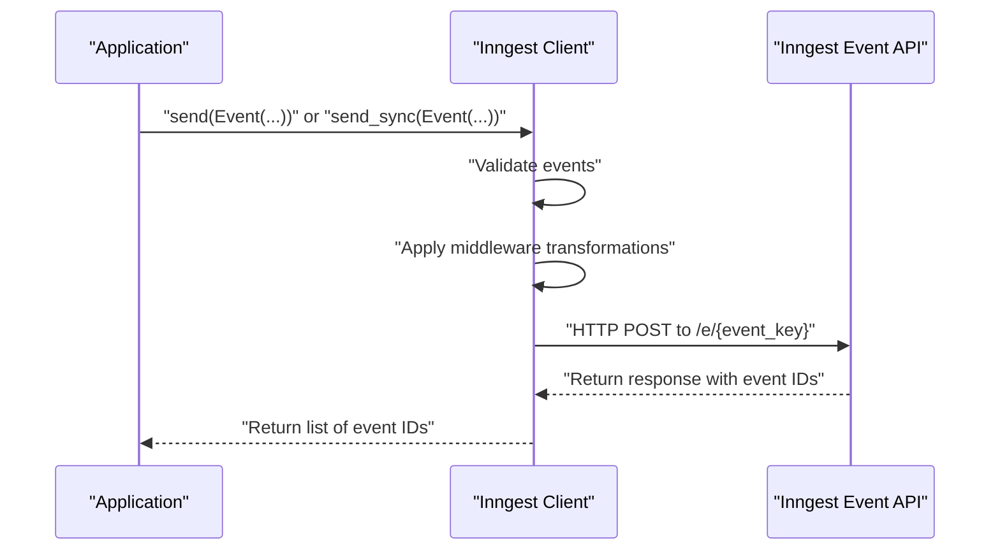

This page documents the event handling system in the Inngest Python SDK. Events are a fundamental component that enable event-driven architectures by serving as messages that trigger function execution and carry data between systems. For information about defining functions that respond to events, see [Functions](#3.2).

## Event Structure and Lifecycle

Events in Inngest have a defined structure and follow a lifecycle from creation to function execution.



Sources: [pkg/inngest/inngest/_internal/client_lib/client.py:424-475]()

Each event contains:

- `name`: Event type identifier (e.g., "app/user.created")
- `data`: JSON-serializable payload containing event information
- `id`: Optional unique identifier (auto-generated if not provided)
- `ts`: Optional timestamp in milliseconds (defaults to current time)

## Sending Events

The Inngest client provides both synchronous and asynchronous methods for sending events to trigger functions.



Sources: [pkg/inngest/inngest/_internal/client_lib/client.py:424-475](), [pkg/inngest/inngest/_internal/client_lib/client.py:476-522]()

### Sending Events Programmatically

There are two primary methods for sending events:

#### Asynchronous API

```python