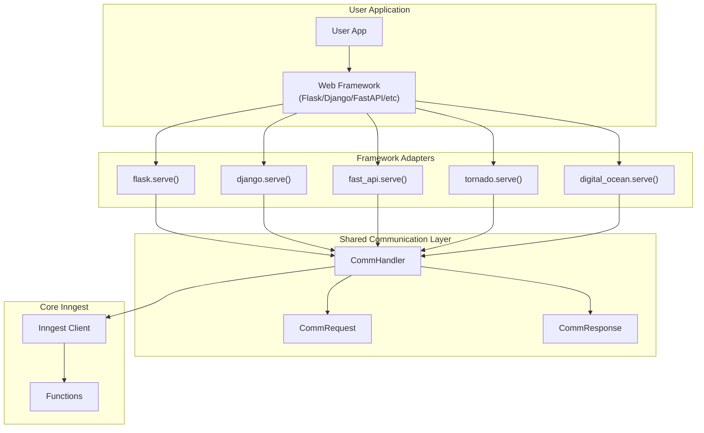
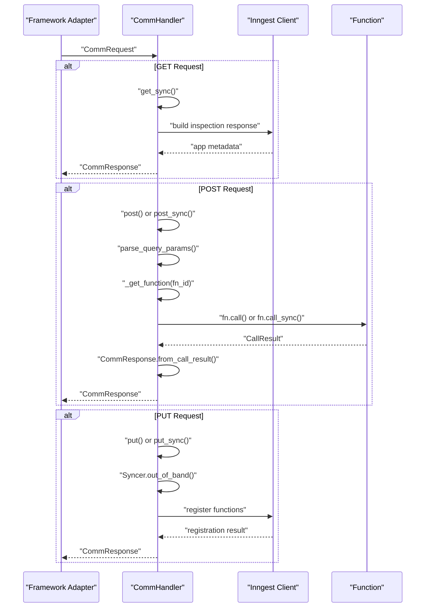
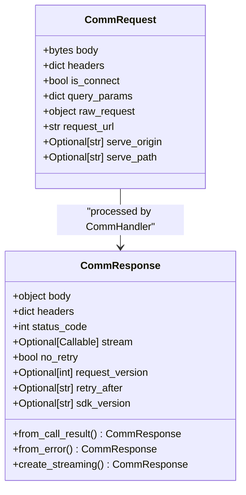

## Purpose and Scope

This document covers the framework integration system that enables Inngest functions to be served through various Python web frameworks. The integration layer provides a unified interface for handling HTTP requests from the Inngest server while adapting to framework-specific patterns and conventions.

For information about the core Inngest client and function definition, see [Core API](#3). For details about the underlying communication protocol and request handling, the relevant components are covered in [System Components](#2.3).

## Architecture Overview

The framework integration system follows a common adapter pattern where each supported framework implements a `serve()` function that creates framework-specific HTTP handlers while delegating core logic to a shared `CommHandler`.

### Framework Integration Architecture



**Sources:** [pkg/inngest/inngest/flask.py:20-27](), [pkg/inngest/inngest/django.py:27-33](), [pkg/inngest/inngest/fast_api.py:21-29](), [pkg/inngest/inngest/tornado.py:21-28](), [pkg/inngest/inngest/digital_ocean.py:24-30](), [pkg/inngest/inngest/_internal/comm_lib/handler.py:32-40]()

## Supported Frameworks

The SDK provides native integration for five Python web frameworks, each implementing the same core interface with framework-specific adaptations.

### Framework Implementations

| Framework | Module | Async Support | Streaming Support |
|-----------|---------|---------------|-------------------|
| Flask | `inngest.flask` | Yes | No |
| Django | `inngest.django` | Yes (Django 5+) | No |
| FastAPI | `inngest.fast_api` | Yes | Yes |
| Tornado | `inngest.tornado` | No | No |
| DigitalOcean Functions | `inngest.digital_ocean` | No | No |

**Sources:** [pkg/inngest/inngest/flask.py:17](), [pkg/inngest/inngest/django.py:24](), [pkg/inngest/inngest/fast_api.py:18](), [pkg/inngest/inngest/tornado.py:18](), [pkg/inngest/inngest/digital_ocean.py:21]()

### Common Serve Function Pattern

All framework integrations follow the same `serve()` function signature:

```python
def serve(
    app_or_client: FrameworkApp | client_lib.Inngest,
    client_or_functions: client_lib.Inngest | list[function.Function],
    functions: list[function.Function] | None = None,
    *,
    serve_origin: Optional[str] = None,
    serve_path: Optional[str] = None,
) -> FrameworkSpecificReturn
```

**Sources:** [pkg/inngest/inngest/flask.py:20-27](), [pkg/inngest/inngest/django.py:27-33](), [pkg/inngest/inngest/fast_api.py:21-29]()

## CommHandler: The Core Communication Layer

The `CommHandler` class serves as the central communication hub that processes all HTTP requests from the Inngest server regardless of the originating framework.

### CommHandler Request Processing Flow



**Sources:** [pkg/inngest/inngest/_internal/comm_lib/handler.py:101-244](), [pkg/inngest/inngest/_internal/comm_lib/handler.py:246-339](), [pkg/inngest/inngest/_internal/comm_lib/handler.py:404-433]()

### CommHandler Key Methods

The `CommHandler` class provides both async and sync versions of HTTP method handlers:

- `post()` / `post_sync()` - Execute Inngest functions
- `get_sync()` - Handle inspection requests (function discovery)
- `put()` / `put_sync()` - Handle function registration/synchronization

**Sources:** [pkg/inngest/inngest/_internal/comm_lib/handler.py:101](), [pkg/inngest/inngest/_internal/comm_lib/handler.py:246](), [pkg/inngest/inngest/_internal/comm_lib/handler.py:366](), [pkg/inngest/inngest/_internal/comm_lib/handler.py:404](), [pkg/inngest/inngest/_internal/comm_lib/handler.py:435]()

## Request/Response Model

The communication layer uses standardized request and response models that abstract away framework-specific HTTP handling.

### CommRequest and CommResponse Structure



**Sources:** [pkg/inngest/inngest/_internal/comm_lib/models.py:18-30](), [pkg/inngest/inngest/_internal/comm_lib/models.py:32-47]()

## Framework-Specific Implementation Details

### Flask Integration

Flask integration supports both sync and async modes, automatically detecting the mode based on function signatures.

```python