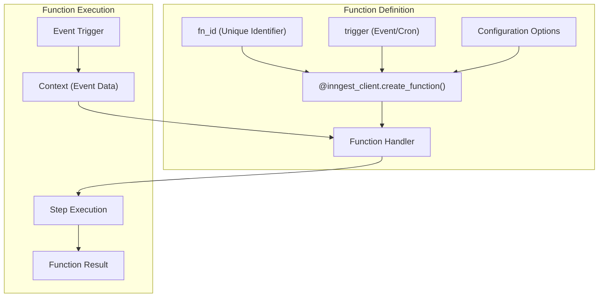
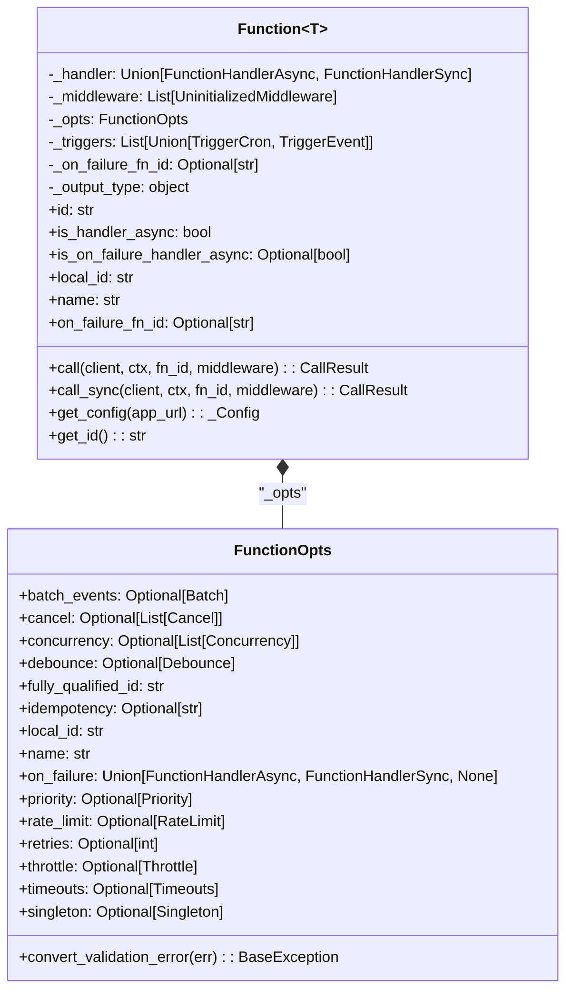
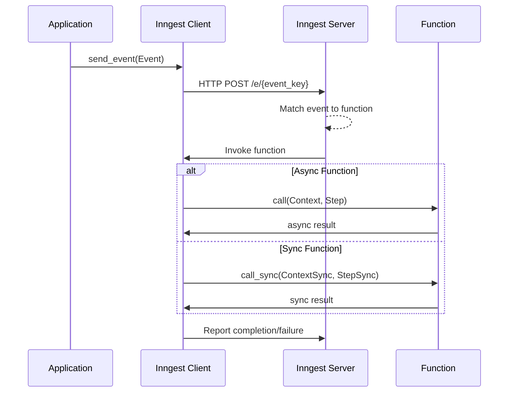
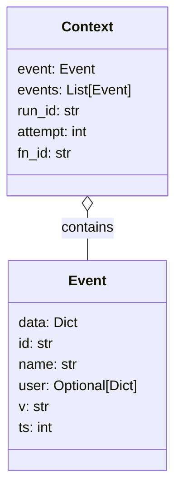
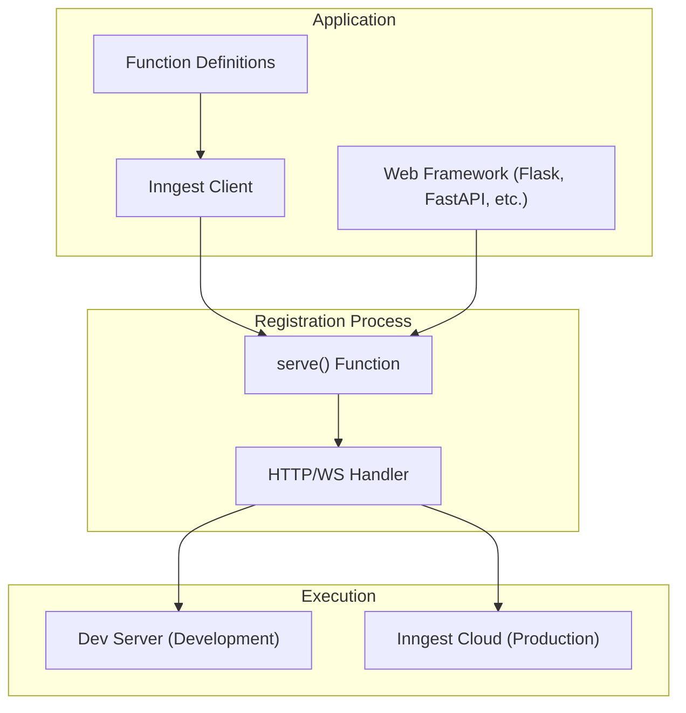

This page documents the creation, configuration, and execution of functions in the Inngest Python SDK. Functions are the core building blocks of Inngest applications, allowing you to define event-driven, durable workflows. For information about steps within functions, see [Steps](#3.3).

## What are Inngest Functions?

Inngest functions are serverless event-driven functions that run in response to triggers. They provide automatic durability, idempotency, and resilience through the Inngest execution engine. Functions can be synchronous or asynchronous and can contain steps that act as transactional units of work.



Sources: [README.md:51-87](), [pkg/inngest/inngest/_internal/function.py:63-102]()

## Function Definition

Functions are defined using the `create_function` decorator provided by the Inngest client. This decorator transforms a regular Python function into an Inngest function that can be triggered by events or schedules.

### Basic Function Structure

Function Class Structure



Sources: [pkg/inngest/inngest/_internal/function.py:65-102](), [pkg/inngest/inngest/_internal/function.py:29-63]()

### Creating a Function

To create a function, use the `create_function` decorator from the Inngest client:

```python
@inngest_client.create_function(
    fn_id="find_person",
    trigger=inngest.TriggerEvent(event="app/person.find"),
)
def fetch_person(
    ctx: inngest.Context,
    step: inngest.StepSync,
) -> dict:
    person_id = ctx.event.data["person_id"]
    # Function implementation...
    return result
```

The `create_function` decorator supports numerous configuration options:

| Parameter | Type | Description |
|-----------|------|-------------|
| `fn_id` | str | Required unique identifier for the function |
| `trigger` | Trigger/List[Trigger] | Event or cron trigger that invokes the function |
| `name` | Optional[str] | Human-readable name (defaults to `fn_id`) |
| `retries` | Optional[int] | Number of times to retry the function |
| `on_failure` | Optional[Function] | Handler to call when the function fails |
| `idempotency` | Optional[str] | Expression to prevent duplicate event processing |
| `concurrency` | Optional[List[Concurrency]] | Concurrency control configuration |
| `batch_events` | Optional[Batch] | Event batching configuration |
| `debounce` | Optional[Debounce] | Debouncing configuration |
| `throttle` | Optional[Throttle] | Throttling configuration |
| `middleware` | Optional[List[Middleware]] | Function-specific middleware |

Sources: [pkg/inngest/inngest/_internal/client_lib/client.py:186-273](), [README.md:51-87]()

## Function Execution Flow

When an event that matches a function's trigger is received, Inngest initiates a function execution. The basic flow of function execution is as follows:



Sources: [pkg/inngest/inngest/_internal/function.py:143-229](), [README.md:179-191]()

### Function Context

Every function receives a context (`ctx`) parameter that contains information about the event that triggered the function, along with metadata about the current execution:



The context provides access to:
- The triggering event (`ctx.event`)
- A list of all events for batched functions (`ctx.events`) 
- Run information (`ctx.run_id`, `ctx.attempt`, `ctx.fn_id`)

Sources: [pkg/inngest/inngest/_internal/execution_lib/__init__.py:1-28]()

## Synchronous vs Asynchronous Functions

Inngest supports both synchronous and asynchronous functions. You can choose the style that best fits your application.

### Synchronous Function

```python
@inngest_client.create_function(
    fn_id="sync_function",
    trigger=inngest.TriggerEvent(event="app/sync.event"),
)
def my_sync_function(
    ctx: inngest.ContextSync,
    step: inngest.StepSync,
) -> dict:
    # Synchronous implementation
    return {"result": "done"}
```

### Asynchronous Function

```python
@inngest_client.create_function(
    fn_id="async_function",
    trigger=inngest.TriggerEvent(event="app/async.event"),
)
async def my_async_function(
    ctx: inngest.Context,
    step: inngest.Step,
) -> dict:
    # Asynchronous implementation
    return {"result": "done"}
```

Note that you can mix synchronous and asynchronous functions in the same application, but a single function must be consistently sync or async, including its failure handler.

Sources: [README.md:45-176](), [pkg/inngest/inngest/_internal/function_test.py:1-56]()

## Error Handling

Functions can specify an `on_failure` handler that will be called if the main function fails:

```python
def handle_failure(ctx: inngest.ContextSync, step: inngest.StepSync) -> None:
    # Handle the failure
    pass

@inngest_client.create_function(
    fn_id="function_with_failure_handler",
    trigger=inngest.TriggerEvent(event="app/my.event"),
    on_failure=handle_failure,
)
def my_function(ctx: inngest.ContextSync, step: inngest.StepSync) -> dict:
    # Implementation that might fail
    return result
```

Important restrictions:
- An async function must have an async `on_failure` handler
- A sync function must have a sync `on_failure` handler

The failure handler receives the same context as the original function, with additional error information.

Sources: [pkg/inngest/inngest/_internal/function.py:125-141](), [pkg/inngest/inngest/_internal/function_test.py:7-56]()

## Registering Functions

After defining functions, they must be registered with the Inngest server to be executed:



Framework-specific serve functions are used to register functions:

```python
# Flask example
inngest.flask.serve(
    app,              # Flask app
    inngest_client,   # Inngest client
    [function1, function2, ...]  # List of functions
)
```

Sources: [README.md:77-86](), [README.md:193-205]()

## Function Triggers

Functions can be triggered by events or cron schedules:

### Event Triggers

Event triggers respond to events with specific names and optional filter expressions:

```python