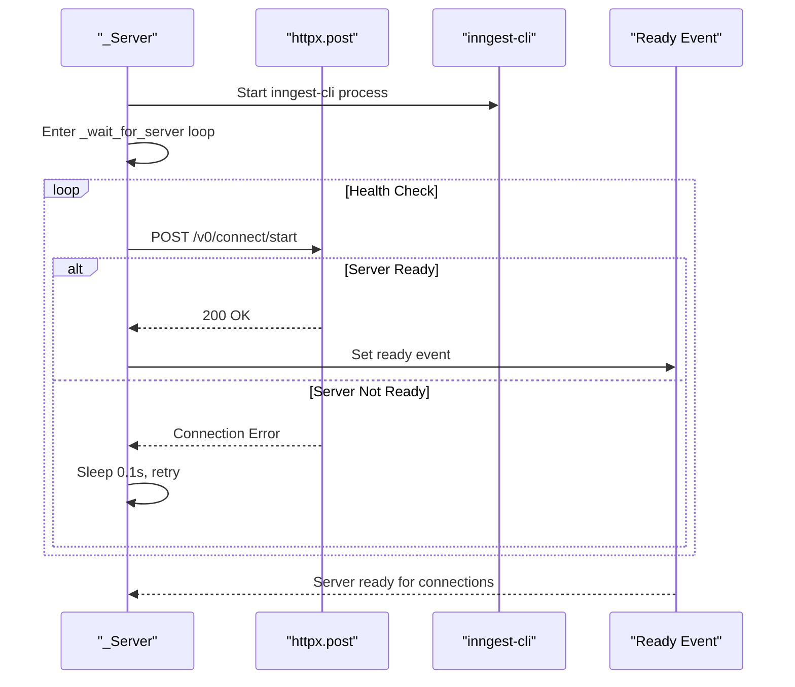
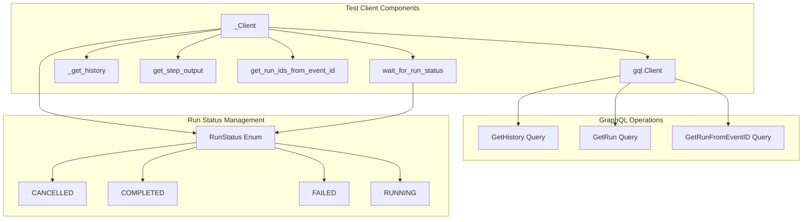
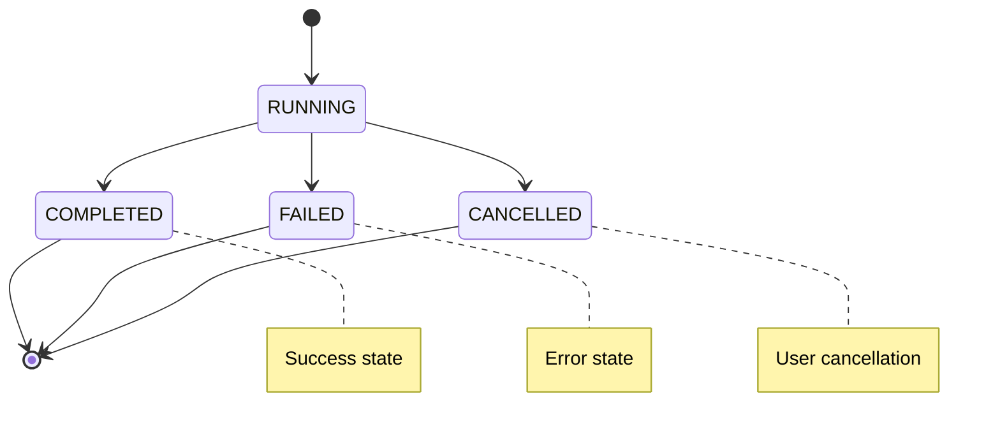
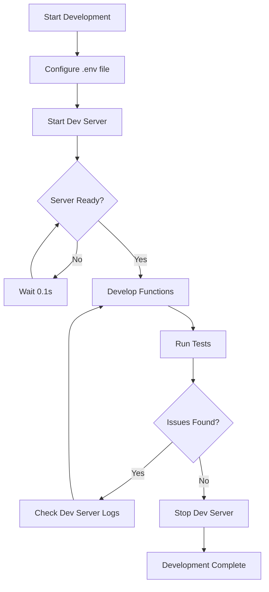
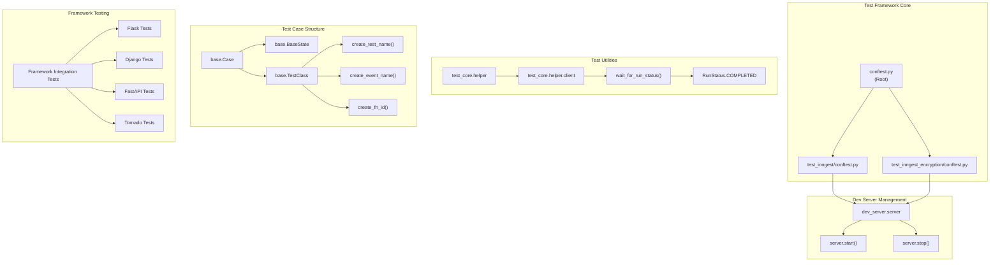
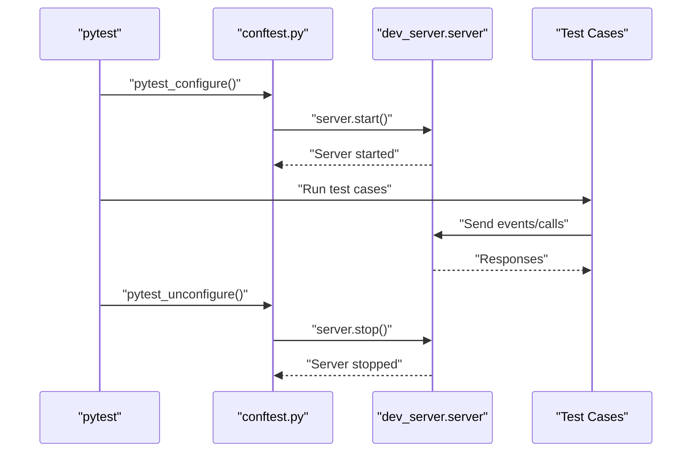
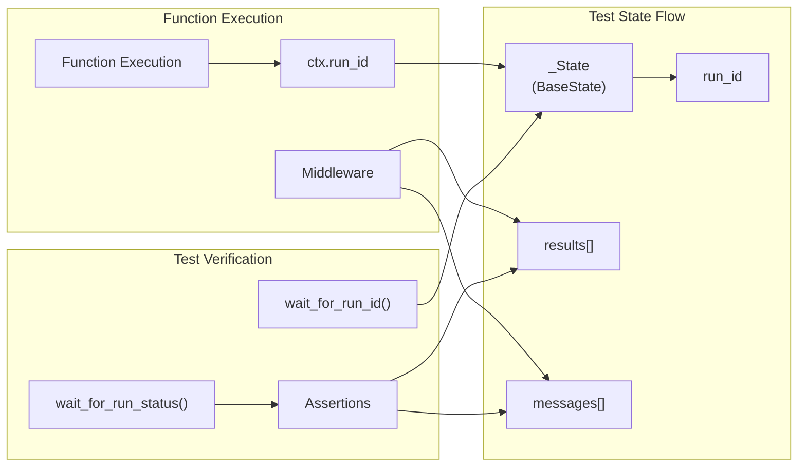
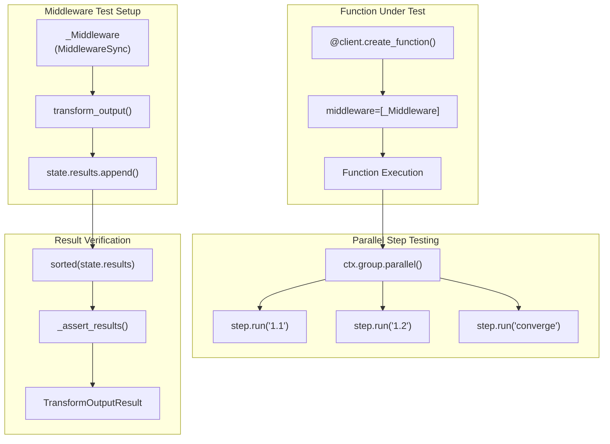
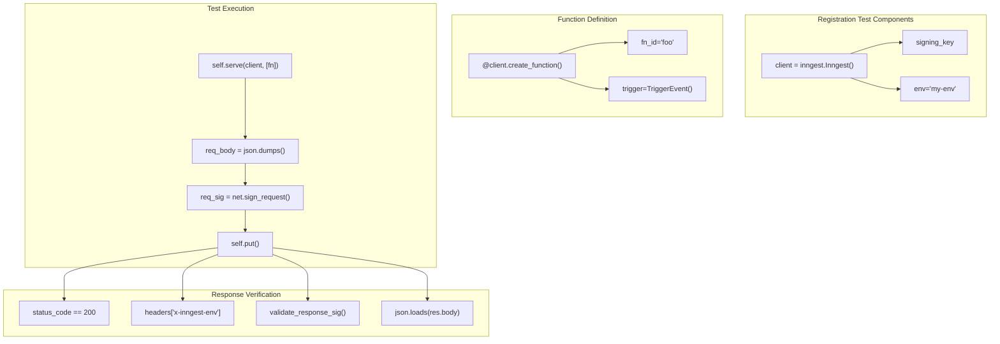
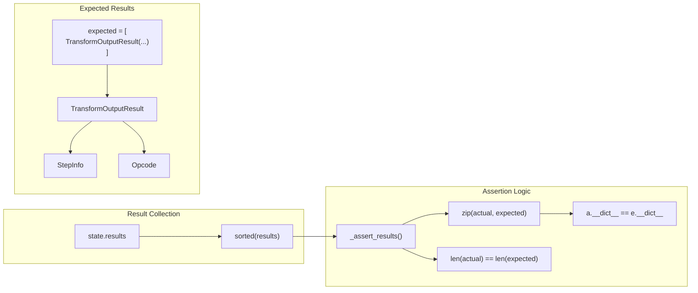

## Purpose and Scope

This document covers the local development environment setup for the Inngest Python SDK, including the dev server configuration, environment management, and testing integration. It focuses on the tools and processes developers use to run and test Inngest functions locally during development.

For information about testing strategies and test infrastructure, see [Testing Guide](#8.2). For CI/CD pipeline details, see [CI/CD Pipeline](#8.3).

## Dev Server Overview

The Inngest Python SDK uses a local development server powered by the `inngest-cli` to simulate the Inngest platform during development. This dev server enables function execution, event handling, and debugging without requiring a connection to the production Inngest service.

### Dev Server Architecture

```mermaid
graph TB
    subgraph "Local Development Environment"
        DS[_Server] --> CR[_CommandRunner]
        DS --> "npx inngest-cli dev"
        DS --> "HTTP Endpoints"
    end
    
    subgraph "SDK Integration"
        TC[test_core.helper._Client] --> GQL[GraphQL Client]
        TC --> "Function Run Queries"
        TC --> "Event Tracking"
    end
    
    subgraph "Configuration"
        ENV[".env.example"] --> "DEV_SERVER_PORT"
        ENV --> "DEV_SERVER_ENABLED" 
        ENV --> "DEV_SERVER_LOGS"
        ENV --> "INNGEST_BASE_URL"
    end
    
    DS --> TC
    GQL --> DS
    ENV --> DS
    
    "npx inngest-cli dev" --> "Port 8288"
    "HTTP Endpoints" --> "/v0/connect/start"
    "HTTP Endpoints" --> "/v0/gql"
```

Sources: [pkg/inngest/inngest/experimental/dev_server/dev_server.py:15-94](), [pkg/test_core/test_core/helper.py:33-216](), [.env.example:1-13]()

### Server Lifecycle Management

The `_Server` class in the dev server module manages the complete lifecycle of the local development server:

| Phase | Method | Description |
|-------|--------|-------------|
| Initialization | `__init__()` | Sets up port configuration and command runner |
| Startup | `start()` | Launches inngest-cli and waits for readiness |
| Health Check | `_wait_for_server()` | Polls `/v0/connect/start` endpoint |
| Shutdown | `stop()` | Terminates the dev server process |

The server automatically detects availability by polling the health endpoint until it receives a 200 response, as implemented in [pkg/inngest/inngest/experimental/dev_server/dev_server.py:64-78]().

Sources: [pkg/inngest/inngest/experimental/dev_server/dev_server.py:15-94]()

## Environment Configuration

Local development configuration is managed through environment variables, with examples provided in the `.env.example` file.

### Core Environment Variables

```mermaid
graph LR
    subgraph "Dev Server Config"
        DSP["DEV_SERVER_PORT<br/>Default: 8288"]
        DSE["DEV_SERVER_ENABLED<br/>Default: 1"]
        DSL["DEV_SERVER_LOGS<br/>Default: 0"]
    end
    
    subgraph "Inngest Connection"
        IBU["INNGEST_BASE_URL<br/>http://localhost:8288"]
        IEK["INNGEST_EVENT_KEY<br/>Optional for dev"]
        ISK["INNGEST_SIGNING_KEY<br/>Optional for dev"]
    end
    
    subgraph "Feature Toggles"
        EC["ENABLE_CRONS<br/>Default: disabled"]
    end
    
    DSP --> "Server Port Configuration"
    DSE --> "Enable/Disable Dev Server"
    DSL --> "Log File Generation"
    IBU --> "SDK Connection Target"
```

### Configuration Examples

The development environment supports multiple connection modes:

**Local Dev Server (Default)**
```bash
INNGEST_BASE_URL=http://localhost:8288
```

**Cloud Development**
```bash
INNGEST_BASE_URL=http://localhost:8090
INNGEST_EVENT_KEY=your_event_key
INNGEST_SIGNING_KEY=your_signing_key
```

Sources: [.env.example:1-13]()

## Dev Server Implementation

### Command Execution

The dev server uses the `_CommandRunner` class to manage the `inngest-cli` process with configurable logging:

```mermaid
graph TB
    subgraph "Process Management"
        CR[_CommandRunner] --> CMD["npx --yes inngest-cli@latest dev"]
        CMD --> ARGS["--no-discovery --no-poll --port {port}"]
        CR --> LOG["Optional Log File"]
    end
    
    subgraph "Server Instance"
        S[_Server] --> PORT["Port: DEV_SERVER_PORT or 8288"]
        S --> ENABLED["Enabled: DEV_SERVER_ENABLED != '0'"]
        S --> READY["Ready Event Threading"]
    end
    
    CR --> S
    LOG --> "artifacts/dev_server.log"
    READY --> "HTTP Health Check Loop"
```

The server initialization process includes:

1. **Port Resolution**: Uses `DEV_SERVER_PORT` environment variable or defaults to 8288 [pkg/inngest/inngest/experimental/dev_server/dev_server.py:21-27]()
2. **Log Configuration**: Creates `artifacts/dev_server.log` when `DEV_SERVER_LOGS=1` [pkg/inngest/inngest/experimental/dev_server/dev_server.py:29-37]()
3. **Command Setup**: Constructs the inngest-cli command with required flags [pkg/inngest/inngest/experimental/dev_server/dev_server.py:39-42]()

Sources: [pkg/inngest/inngest/experimental/dev_server/dev_server.py:15-94]()

### Health Check and Readiness

The dev server implements a robust health check mechanism to ensure the service is ready before proceeding with tests or development tasks:



Sources: [pkg/inngest/inngest/experimental/dev_server/dev_server.py:64-78]()

## Testing Integration

The test infrastructure provides a comprehensive client for interacting with the dev server through GraphQL queries.

### Test Client Architecture



### Query Operations

The test client supports several key operations for function testing:

| Operation | Purpose | GraphQL Query |
|-----------|---------|---------------|
| `_get_history()` | Retrieve function execution history | `GetHistory` |
| `get_step_output()` | Get output from specific step | `GetHistory` + `historyItemOutput` |
| `get_run_ids_from_event_id()` | Map events to function runs | `GetRunFromEventID` |
| `wait_for_run_status()` | Poll for run completion | `GetRun` |

Each operation includes timeout handling and retry logic appropriate for test environments [pkg/test_core/test_core/helper.py:113-200]().

Sources: [pkg/test_core/test_core/helper.py:33-216]()

### Run Status Tracking

The testing system defines a comprehensive status enumeration for tracking function execution:



The `ended_statuses` set includes `CANCELLED`, `COMPLETED`, and `FAILED`, allowing the test client to detect when function execution has concluded [pkg/test_core/test_core/helper.py:24-30]().

Sources: [pkg/test_core/test_core/helper.py:17-31]()

## Local Development Workflow

### Development Setup Process



### Key Development Commands

The typical development workflow involves these operations:

1. **Environment Setup**: Copy `.env.example` to `.env` and configure variables
2. **Server Management**: The dev server starts automatically when needed by the SDK
3. **Function Testing**: Use the test client to verify function behavior
4. **Debugging**: Enable logging with `DEV_SERVER_LOGS=1` for troubleshooting

### Server Instance Access

The dev server is accessible as a singleton instance through `inngest.experimental.dev_server.server`, providing a consistent interface across the SDK [pkg/inngest/inngest/experimental/dev_server/dev_server.py:93-94]().

Sources: [pkg/inngest/inngest/experimental/dev_server/dev_server.py:93-94](), [pkg/test_core/test_core/helper.py:35](), [.env.example:1-13]()

# Testing Guide


This document provides a comprehensive guide to testing Inngest functions and the SDK itself. It covers the test infrastructure, testing patterns, and best practices for writing reliable tests for event-driven workflows.

For information about local development setup, see [Local Development](#8.1). For details about the CI/CD pipeline that runs these tests, see [CI/CD Pipeline](#8.3).

## Purpose and Scope

The Inngest Python SDK includes a robust testing framework that enables:
- Testing individual Inngest functions in isolation
- Integration testing with the Inngest dev server
- Testing framework-specific integrations (Flask, Django, FastAPI, Tornado)
- Testing middleware behavior and execution flow
- Validating function registration and synchronization

The testing system is built on pytest and includes specialized utilities for working with Inngest's event-driven architecture.

## Test Infrastructure Overview

The testing infrastructure consists of several key components that work together to provide a comprehensive testing environment:

### Test Infrastructure Components



Sources: [tests/conftest.py:1-7](), [tests/test_inngest/conftest.py:1-11](), [tests/test_inngest_encryption/conftest.py:1-11]()

### Dev Server Lifecycle Management

The test infrastructure automatically manages the Inngest dev server lifecycle during test execution:



Sources: [tests/test_inngest/conftest.py:5-10](), [tests/test_inngest_encryption/conftest.py:5-10]()

## Test Organization and Patterns

### Test Case Structure

Tests are organized using a consistent case-based pattern that provides reusable test infrastructure:

| Component | Purpose | Key Features |
|-----------|---------|--------------|
| `base.Case` | Test case container | Holds function, test runner, and metadata |
| `base.BaseState` | State management | Tracks run IDs and test state across execution |
| `base.TestClass` | Test execution context | Provides client interaction methods |
| `base.create_test_name()` | Naming convention | Generates consistent test names from file paths |
| `base.create_event_name()` | Event naming | Creates framework-specific event names |
| `base.create_fn_id()` | Function identification | Generates unique function IDs for tests |

Sources: [tests/test_inngest/test_function/cases/middleware_parallel_steps.py:15-34]()

### Common Testing Patterns

#### State Management Pattern

Tests use a state management pattern to track execution across asynchronous function calls:



Sources: [tests/test_inngest/test_function/cases/middleware_parallel_steps.py:20-24](), [tests/test_inngest/test_function/cases/middleware_parallel_steps.py:49-50](), [tests/test_inngest/test_function/cases/middleware_parallel_steps.py:95-101]()

#### Middleware Testing Pattern

The SDK includes comprehensive middleware testing that validates transformation and execution flow:



Sources: [tests/test_inngest/test_function/cases/middleware_parallel_steps.py:36-42](), [tests/test_inngest/test_function/cases/middleware_parallel_steps.py:43-48](), [tests/test_inngest/test_function/cases/middleware_parallel_steps.py:52-65]()

## Framework Integration Testing

### Registration Testing Pattern

The SDK includes comprehensive tests for function registration across different deployment scenarios:



Sources: [tests/test_inngest/test_registration/cases/cloud_branch_env.py:19-25](), [tests/test_inngest/test_registration/cases/cloud_branch_env.py:27-34](), [tests/test_inngest/test_registration/cases/cloud_branch_env.py:37-54]()

## Test Execution and Utilities

### Test Helper Functions

The testing infrastructure provides specialized utilities for common testing scenarios:

| Utility | Purpose | Usage Pattern |
|---------|---------|---------------|
| `test_core.helper.client.wait_for_run_status()` | Wait for function completion | Async polling for run status |
| `base.create_test_name(__file__)` | Generate test names | Consistent naming from file paths |
| `base.create_event_name(framework, test_name)` | Generate event names | Framework-specific event naming |
| `net.sign_request()` | Request signing | Security verification for registration |
| `net.validate_response_sig()` | Response validation | Verify signed responses |

Sources: [tests/test_inngest/test_function/cases/middleware_parallel_steps.py:98-101](), [tests/test_inngest/test_function/cases/middleware_parallel_steps.py:31-33](), [tests/test_inngest/test_registration/cases/cloud_branch_env.py:43-46]()

### Assertion Patterns

The testing framework uses specialized assertion patterns for validating complex results:



Sources: [tests/test_inngest/test_function/cases/middleware_parallel_steps.py:103-151](), [tests/test_inngest/test_function/cases/middleware_parallel_steps.py:164-172]()

## Running Tests

### Configuration and Setup

The testing system uses pytest with specialized configuration:

```bash
# Assert rewrite registration for better error messages
pytest.register_assert_rewrite("test_inngest")
pytest.register_assert_rewrite("test_inngest_encryption")
```

### Test Categories

The test suite is organized into several categories:

| Category | Location | Purpose |
|----------|----------|---------|
| Core Function Tests | `tests/test_inngest/test_function/` | Function execution and step behavior |
| Registration Tests | `tests/test_inngest/test_registration/` | Function registration and sync |
| Framework Tests | `tests/test_inngest/test_*/` | Framework-specific integration |
| Encryption Tests | `tests/test_inngest_encryption/` | Encryption functionality |
| Connect Tests | `tests/test_inngest/test_connect/` | Connection system testing |

Sources: [tests/conftest.py:3-6]()

## Writing New Tests

### Test Case Creation Pattern

When creating new tests, follow the established case pattern:

1. **Create State Class**: Extend `base.BaseState` for test state management
2. **Define Test Function**: Use the case creation pattern with proper naming
3. **Implement Test Logic**: Include proper async/sync handling and assertions
4. **Add Verification**: Use helper utilities for run status verification

### Key Testing Considerations

- **Race Conditions**: Some tests may be flaky due to parallel execution timing
- **Dev Server Dependency**: Tests require the dev server to be running
- **Framework Compatibility**: Tests should work across all supported frameworks
- **State Management**: Use proper state tracking for async function execution
- **Error Handling**: Include proper error scenarios and edge cases

Sources: [tests/test_inngest/test_function/cases/middleware_parallel_steps.py:1-6]()