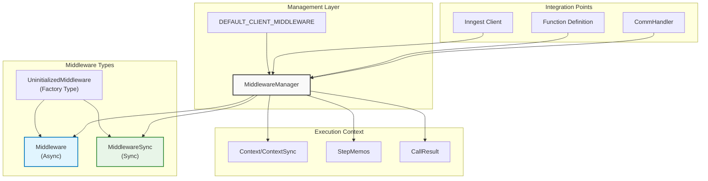
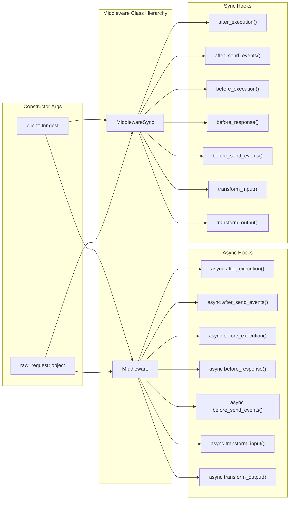
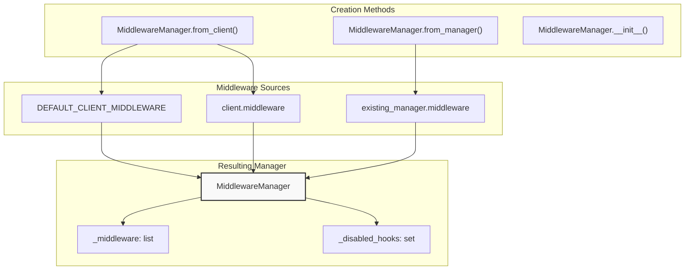
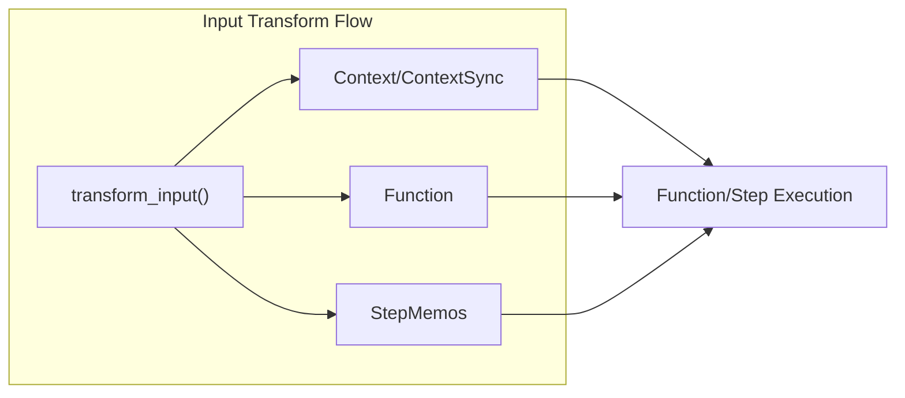
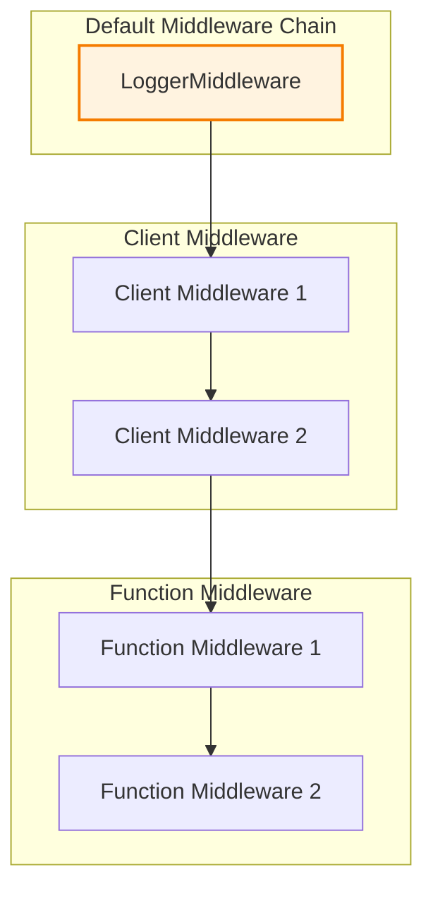
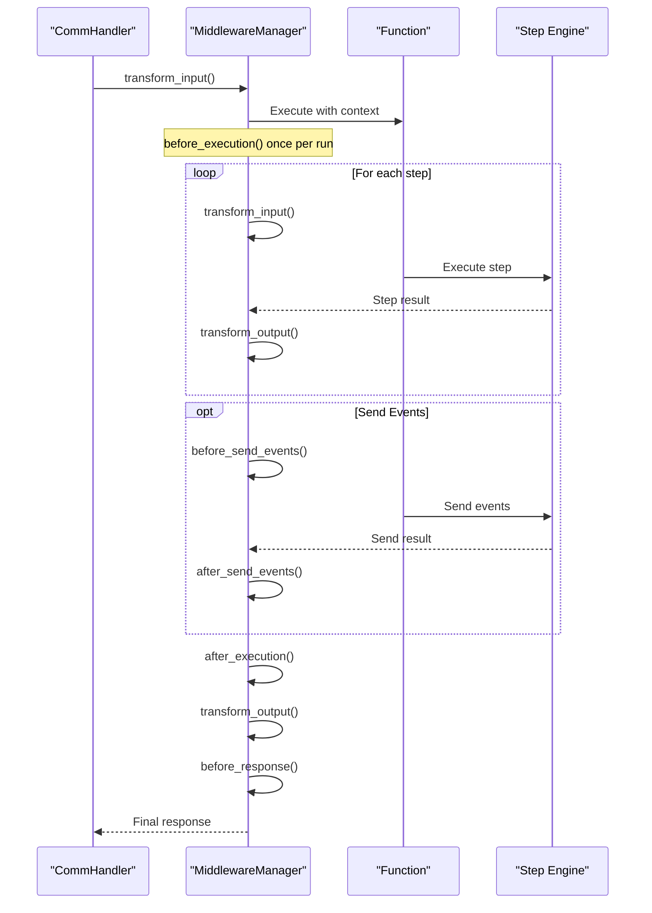

## Purpose and Scope

The middleware system provides extensible hooks into the Inngest function execution lifecycle, allowing developers to intercept, modify, and observe function behavior at key points during execution. This system enables cross-cutting concerns like logging, authentication, request transformation, and response modification.

For information about framework-specific integration patterns, see [Framework Integration](#4). For details about the step execution system that middleware can intercept, see [Steps](#3.3).

## System Overview

The middleware system is built around two primary patterns: lifecycle hooks and transformation capabilities. Middleware classes implement specific hook methods that are called at defined points during function execution, while a centralized manager orchestrates the execution order and handles both synchronous and asynchronous middleware.



Sources: [pkg/inngest/inngest/_internal/middleware_lib/middleware.py:18-188](), [pkg/inngest/inngest/_internal/middleware_lib/manager.py:35-322]()

## Middleware Base Classes

The system provides two base middleware classes that correspond to synchronous and asynchronous execution contexts:

### Middleware (Async)

The `Middleware` class provides asynchronous lifecycle hooks for functions that use `async`/`await` patterns. All hook methods are coroutines that can perform asynchronous operations.

| Hook Method | Purpose | Call Timing |
|-------------|---------|-------------|
| `before_execution()` | Setup before code execution | Once per execution context |
| `after_execution()` | Cleanup after code execution | Once per execution context (reverse order) |
| `transform_input()` | Modify function/step inputs | Before each function/step call |
| `transform_output()` | Modify function/step outputs | After each function/step return (reverse order) |
| `before_send_events()` | Intercept event sending | Before `step.send_event` calls |
| `after_send_events()` | Handle event send results | After `step.send_event` calls (reverse order) |
| `before_response()` | Final processing before response | Before HTTP response sent |

### MiddlewareSync (Sync)

The `MiddlewareSync` class provides identical hooks but with synchronous method signatures for use with non-async functions.



Sources: [pkg/inngest/inngest/_internal/middleware_lib/middleware.py:18-87](), [pkg/inngest/inngest/_internal/middleware_lib/middleware.py:89-160]()

## Middleware Manager

The `MiddlewareManager` class orchestrates middleware execution and handles the complexity of running both synchronous and asynchronous middleware in the correct order. It maintains the middleware chain and provides both async and sync execution methods for each hook.

### Manager Creation Patterns

The manager supports multiple instantiation patterns:



### Execution Order Logic

The manager implements specific ordering rules for different hook types:

- **Forward order**: `before_execution`, `transform_input`, `before_send_events`, `before_response`
- **Reverse order**: `after_execution`, `transform_output`, `after_send_events`

This ensures that setup hooks run in registration order while cleanup hooks run in reverse, creating proper nesting behavior.

Sources: [pkg/inngest/inngest/_internal/middleware_lib/manager.py:35-82](), [pkg/inngest/inngest/_internal/middleware_lib/manager.py:83-322]()

## Transform Operations

Middleware can modify both inputs and outputs during function execution through transform hooks:

### Input Transformation

The `transform_input` hook receives the execution context, function definition, and step memos, allowing middleware to modify these objects before execution:



### Output Transformation

The `transform_output` hook receives a `TransformOutputResult` object containing the execution result and optional step information:

| Field | Type | Purpose | Mutable |
|-------|------|---------|---------|
| `error` | `Optional[Exception]` | Execution error if any | Yes |
| `output` | `object` | Function/step return value | Yes |
| `step` | `Optional[TransformOutputStepInfo]` | Step metadata | No |

Sources: [pkg/inngest/inngest/_internal/middleware_lib/middleware.py:168-188](), [pkg/inngest/inngest/_internal/middleware_lib/manager.py:237-322]()

## Configuration and Usage

### Client-Level Middleware

Middleware can be configured at the client level, applying to all functions registered with that client:

```python
client = inngest.Inngest(
    app_id="my-app",
    middleware=[MyMiddleware, AnotherMiddleware]
)
```

### Function-Level Middleware

Individual functions can specify their own middleware in addition to client-level middleware:

```python
@client.create_function(
    fn_id="my-function",
    middleware=[FunctionSpecificMiddleware],
    trigger=inngest.TriggerEvent(event="my-event")
)
def my_function(ctx):
    # function logic
```

### Default Middleware

The system includes default middleware that is automatically added to all clients:



Sources: [pkg/inngest/inngest/_internal/middleware_lib/manager.py:32-64](), [tests/test_inngest/test_client/test_client_middleware.py:141-147](), [tests/test_inngest/test_function/cases/function_middleware.py:120-124]()

## Execution Integration

The middleware system integrates deeply with the function execution pipeline, with hooks called at specific points during the request lifecycle:



### Hook Execution Context

Each middleware hook receives specific context appropriate to its execution point:

- `before_execution`/`after_execution`: Called once per function run
- `transform_input`/`transform_output`: Called for each function and step execution
- `before_send_events`/`after_send_events`: Called around event sending operations
- `before_response`: Called before final HTTP response

Sources: [tests/test_inngest/test_function/cases/function_middleware.py:181-209](), [tests/test_inngest/test_function/cases/middleware_order.py:84-110](), [tests/test_inngest/test_client/test_client_middleware.py:43-66]()