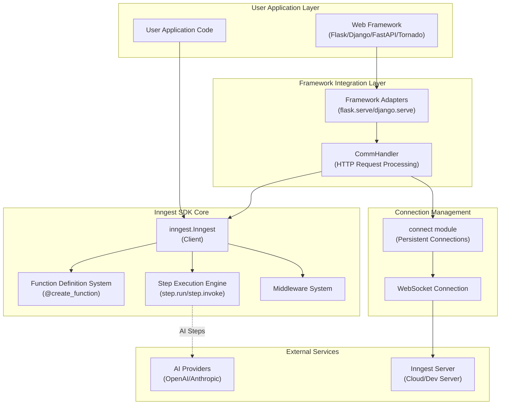
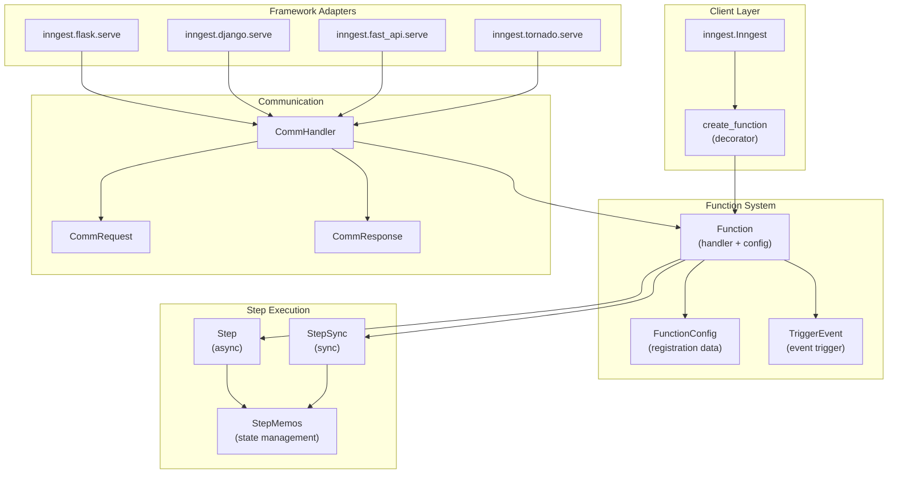

## Purpose and Scope

The Inngest Python SDK is an event-driven workflow orchestration library that enables developers to build durable functions and background jobs without requiring separate queueing infrastructure. This document provides an overview of the SDK's architecture, core components, and capabilities.

This overview covers the high-level system design and main user-facing APIs. For detailed information about specific subsystems, see:
- Architecture details: [Architecture](#2)
- Core API usage: [Core API](#3)
- Framework-specific integration: [Framework Integration](#4)
- Advanced connection features: [Connection System](#6)
- Development and testing workflows: [Development and Testing](#8)

Sources: [README.md:24-28](), [pkg/inngest/README.md:24-28]()

## Core Capabilities

The Inngest Python SDK provides several key capabilities for building resilient, event-driven applications:

### Durable Function Execution
Functions are automatically backed by queues with built-in retry logic and state management. Each step in a function acts as a code-level transaction that retries on failure and runs once on success.

### Multi-Framework Support
The SDK integrates with popular Python web frameworks:

| Framework | Minimum Version | Integration Module |
|-----------|-----------------|-------------------|
| DigitalOcean Functions | N/A | `inngest.digital_ocean` |
| Django | `>=5.0` | `inngest.django` |
| FastAPI | `>=0.110.0` | `inngest.fast_api` |
| Flask | `>=3.0.0` | `inngest.flask` |
| Tornado | `>=6.4` | `inngest.tornado` |

### Step-Based Execution
Functions can be broken down into discrete steps using `step.run()`, `step.invoke()`, `step.send_event()`, and other step operations. Each step maintains its own execution context and can be retried independently.

### Event-Driven Architecture
Functions are triggered by events and can send events to trigger other functions, enabling complex workflow orchestration.

Sources: [README.md:29-37](), [README.md:89-91](), [CONTRIBUTING.md:78-91]()

## System Architecture Overview

The Inngest Python SDK follows a layered architecture that separates concerns between user application code, framework integration, core SDK functionality, and external service communication.

### High-Level Architecture

Sources: [README.md:55-87](), [CONTRIBUTING.md:84-91]()

### Core Component Relationships

Sources: [README.md:60-63](), [README.md:65-68](), [README.md:113-119]()

## Core Concepts

### Inngest Client
The `inngest.Inngest` class serves as the primary entry point for the SDK. It manages application identity, production mode settings, and provides the `create_function` decorator for defining event-driven functions.

### Functions and Events
Functions are defined using the `@inngest_client.create_function()` decorator with configuration including function ID and trigger events. Functions receive a `Context` object containing event data and a `Step` object for executing durable operations.

### Step Operations
The step system provides several key operations:
- `step.run()` - Execute functions with automatic retry logic
- `step.invoke()` - Call other Inngest functions
- `step.send_event()` - Send events to trigger workflows
- `step.sleep()` - Pause execution for specified durations
- `step.wait_for_event()` - Wait for specific events before continuing

### Framework Integration
Each supported framework has a dedicated serve function (e.g., `inngest.flask.serve()`) that handles HTTP request routing and integrates the SDK with the framework's request/response cycle.

Sources: [README.md:60-63](), [README.md:113-149](), [README.md:183-191]()

## Development Environment

The SDK includes comprehensive development and testing infrastructure:

### Package Structure
The repository is organized into multiple packages:
- Main SDK package at `pkg/inngest/`
- Encryption utilities at `pkg/inngest_encryption/`
- Test core utilities at `pkg/test_core/`

### Development Tools
Development workflow is managed through a `Makefile` with targets for:
- `format` and `format-check` - Code formatting with ruff
- `lint` - Code linting across all packages
- `type-check` - Type checking with mypy
- `utest` and `itest` - Unit and integration testing

### Constraints and Dependencies
Dependencies are managed through `constraints.txt` to ensure compatibility with minimum supported versions, including core dependencies like `httpx>=0.26.0`, `pydantic>=2.11.0`, and `websockets>=15.0.0`.

Sources: [Makefile:7-42](), [constraints.txt:1-11](), [CONTRIBUTING.md:1-6]()