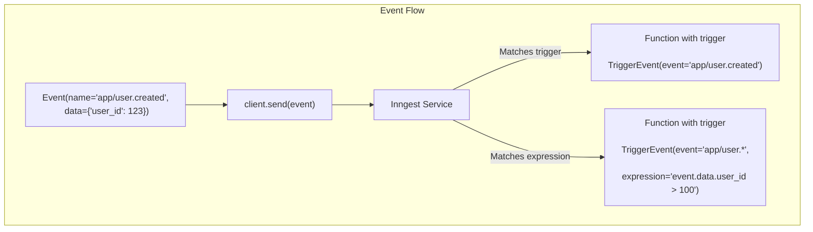
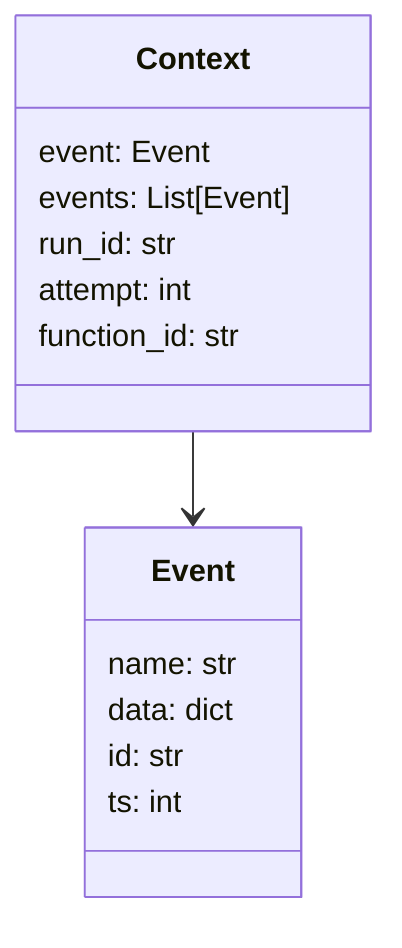

await inngest_client.send([
    inngest.Event(name="app/user.created", data={"user_id": 123}),
    inngest.Event(name="app/email.sent", data={"recipient": "user@example.com"})
])
```

#### Synchronous API

```python
# Send a single event
inngest_client.send_sync(inngest.Event(
    name="app/user.created", 
    data={"user_id": 123, "name": "Jane"}
))

# Send multiple events
inngest_client.send_sync([
    inngest.Event(name="app/user.created", data={"user_id": 123}),
    inngest.Event(name="app/email.sent", data={"recipient": "user@example.com"})
])
```

Both methods return a list of event IDs that were created.

Sources: [README.md:179-191]()

## Using Events as Triggers

Functions in Inngest are triggered by events. When defining a function, you specify which events should trigger its execution.



Sources: [pkg/inngest/inngest/_internal/function.py:63-143](), [README.md:53-101]()

### Simple Event Triggers

The most basic trigger matches events by their name:

```python
@inngest_client.create_function(
    fn_id="welcome_new_user",
    trigger=inngest.TriggerEvent(event="app/user.created"),
)
def welcome_new_user(ctx: inngest.Context, step: inngest.Step):
    user_id = ctx.event.data["user_id"]
    # Function implementation...
```

### Event Triggers with Expressions

You can also use expressions to filter events based on their data:

```python
@inngest_client.create_function(
    fn_id="handle_premium_users",
    trigger=inngest.TriggerEvent(
        event="app/user.created",
        expression="event.data.plan == 'premium'"
    ),
)
def handle_premium_users(ctx: inngest.Context, step: inngest.Step):
    # Only triggers for premium users
    user_id = ctx.event.data["user_id"]
    # Function implementation...
```

### Multiple Event Triggers

A function can be triggered by multiple different events:

```python
@inngest_client.create_function(
    fn_id="track_user_activity",
    trigger=[
        inngest.TriggerEvent(event="app/user.login"),
        inngest.TriggerEvent(event="app/user.logout"),
    ],
)
def track_user_activity(ctx: inngest.Context, step: inngest.Step):
    # Handles both login and logout events
    user_id = ctx.event.data["user_id"]
    event_type = ctx.event.name  # "app/user.login" or "app/user.logout"
    # Function implementation...
```

Sources: [pkg/inngest/inngest/_internal/function.py:103-123]()

## Accessing Event Data in Functions

When a function is triggered by an event, the event data is available in the function's context.



Sources: [pkg/inngest/inngest/_internal/execution_lib/__init__.py:1-29]()

You can access the triggering event and its data in your function:

```python
@inngest_client.create_function(
    fn_id="process_order",
    trigger=inngest.TriggerEvent(event="app/order.created"),
)
def process_order(ctx: inngest.Context, step: inngest.Step):
    # Access the event that triggered this function
    event_name = ctx.event.name  # "app/order.created"
    
    # Access the event data
    order_id = ctx.event.data["order_id"]
    customer_name = ctx.event.data.get("customer_name", "Unknown")
    
    # Access the event ID and timestamp
    event_id = ctx.event.id
    event_time = ctx.event.ts
```

## Event-Based Function Configuration

In addition to basic triggers, Inngest provides several event-based configuration options for functions:

| Configuration | Description | Example |
|---------------|-------------|---------|
| `batch_events` | Process multiple events in a single function invocation | `batch_events=inngest.Batch(max_size=10, timeout="30s")` |
| `debounce` | Delay function execution until event activity settles | `debounce=inngest.Debounce(key="event.data.user_id", timeout="5m")` |
| `throttle` | Limit function execution rate based on a key | `throttle=inngest.Throttle(key="event.data.user_id", rate="10/m")` |
| `idempotency` | Prevent duplicate events from triggering a function | `idempotency="event.data.transaction_id"` |
| `concurrency` | Control parallel execution of functions | `concurrency=[inngest.Concurrency(key="event.data.account_id", limit=5)]` |

Sources: [pkg/inngest/inngest/_internal/function.py:29-62](), [pkg/inngest/inngest/_internal/client_lib/client.py:186-217]()

## Environment Configuration

Events require proper configuration for authentication and routing:

- `INNGEST_EVENT_KEY`: Required for sending events in production
- `INNGEST_SIGNING_KEY`: Required for verifying requests in production
- `is_production`: Controls whether to use the Dev Server (local) or Inngest Cloud (production)

```python
inngest_client = inngest.Inngest(
    app_id="my_app",
    is_production=os.getenv("INNGEST_DEV") is None,  # Use env var to control mode
)
```

In development mode, events are sent to the local Dev Server. In production mode, events are sent to Inngest Cloud with proper authentication.

Sources: [README.md:193-206]()

## Best Practices

1. **Event Naming Convention**: Use a consistent pattern like `domain/entity.action` (e.g., "app/user.created")

2. **Event Data Structure**: Include only necessary data in events, keeping them lightweight yet complete

3. **Event Validation**: Validate event data in your function handler and handle missing fields gracefully

4. **Idempotent Functions**: Design functions to be idempotent so they can safely process the same event multiple times

5. **Error Handling**: Use the `on_failure` handler to gracefully handle errors in event processing:

```python
@inngest_client.create_function(
    fn_id="process_payment",
    trigger=inngest.TriggerEvent(event="app/payment.created"),
    on_failure=handle_payment_failure,  # Separate function to handle failures
)
def process_payment(ctx: inngest.Context, step: inngest.Step):
    # Payment processing logic...
```

Sources: [pkg/inngest/inngest/_internal/function_test.py:1-56]()