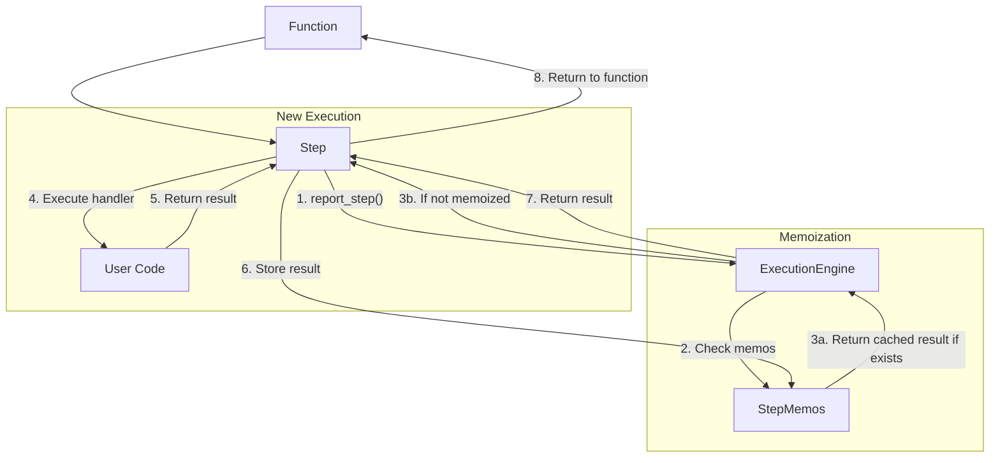

tomorrow = datetime.datetime.now() + datetime.timedelta(days=1)
step.sleep_until("wait_until_tomorrow", tomorrow)
```

Sources: [pkg/inngest/inngest/_internal/step_lib/step_async.py:303-356](), [pkg/inngest/inngest/_internal/step_lib/step_sync.py:280-333]()

### Step.wait_for_event

`wait_for_event` pauses execution until a specific event is received or a timeout occurs:

```python
# Wait for an event for up to 30 seconds
event = step.wait_for_event(
    "wait_for_payment",
    event="app/payment.completed",
    if_exp="data.user_id == 123",  # Optional condition
    timeout=30000  # milliseconds
)

if event is None:
    # Timeout occurred
    print("Payment timed out")
else:
    # Event was received
    print(f"Payment completed: {event.data}")
```

Sources: [pkg/inngest/inngest/_internal/step_lib/step_async.py:358-411](), [pkg/inngest/inngest/_internal/step_lib/step_sync.py:335-388]()

## Memoization and Idempotency

Steps achieve idempotency through a memoization system managed by the execution engine. This system ensures that each step executes exactly once, even if the function is retried multiple times.



The `StepMemos` class in `base.py` handles the storage and retrieval of step results:

```python
# Simplified representation of the memoization system
{
    "hashed_step_id_1": Output(data=result_1),
    "hashed_step_id_2": Output(data=result_2),
    "hashed_step_id_3": Output(error=MemoizedError(...))
}
```

When a step fails with a retriable error, the function is retried but already completed steps are skipped by using their memoized results.

Sources: [pkg/inngest/inngest/_internal/step_lib/base.py:18-80](), [pkg/inngest/inngest/_internal/execution_lib/v0.py:54-106]()

## Step IDs and Deduplication

The step ID is a critical component for memoization. Each step requires a string ID that is:

1. Hashed to create a unique identifier for memoization
2. Visible in the Inngest dashboard for debugging
3. Used to determine if steps should be skipped during retries

The SDK handles duplicate step IDs by appending sequence numbers:

```python