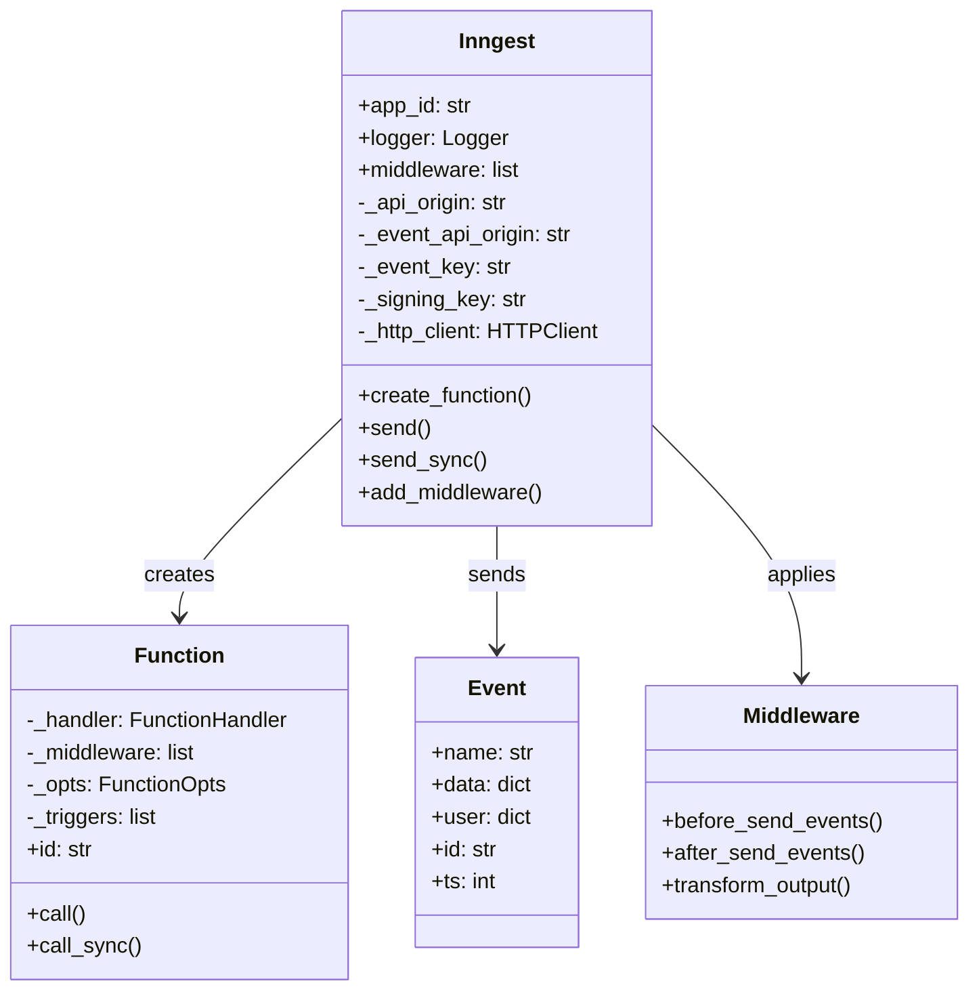
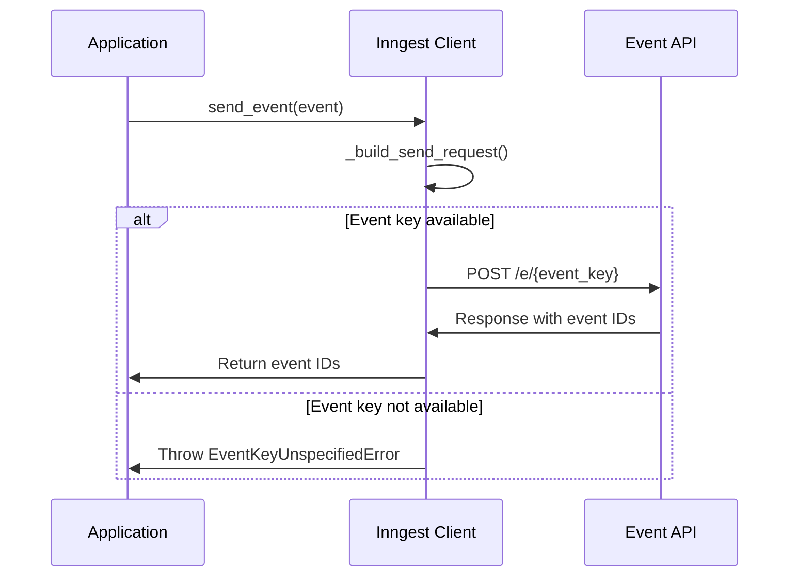

client.send_sync(inngest.Event(name="app/user.created", data={"id": "123"}))
```

Sources: [pkg/inngest/inngest/_internal/client_lib/client.py:424-522](), [README.md:184-190]()

## Client Architecture

The Inngest Client interacts with various components of the system:



Sources: [pkg/inngest/inngest/_internal/client_lib/client.py:32-526](), [pkg/inngest/inngest/_internal/function.py:63-326]()

## Connection Management

The client manages connections to two Inngest endpoints:

1. **API Origin** - Used for function registration and management
2. **Event API Origin** - Used for sending events

These endpoints are determined based on:
- Custom URLs provided during initialization
- Environment variables
- Whether the client is in production or development mode

Sources: [pkg/inngest/inngest/_internal/client_lib/client.py:116-127]()

## HTTP Communication

The client uses HTTP clients to communicate with the Inngest service:



Sources: [pkg/inngest/inngest/_internal/client_lib/client.py:132-177](), [pkg/inngest/inngest/_internal/client_lib/client.py:424-522]()

## Additional Features

### Middleware Support

The client supports middleware that can intercept and modify events and function execution:

```python
# Add middleware to the client
client.add_middleware(my_middleware)

# Add middleware to a specific function
@client.create_function(
    fn_id="my_function",
    trigger=inngest.TriggerEvent(event="app/event"),
    middleware=[my_function_middleware]
)
def my_handler(ctx, step):
    return {"result": "success"}
```

Sources: [pkg/inngest/inngest/_internal/client_lib/client.py:180-184](), [pkg/inngest/inngest/_internal/client_lib/client.py:195-197]()

### Environment and Branch Support

The client supports different environments through:
- The `env` parameter during initialization
- The branch information in the signing key

This enables testing in branch environments without affecting the production environment.

Sources: [pkg/inngest/inngest/_internal/client_lib/client.py:109-117]()

## Production Considerations

When using the client in production:

1. Set `is_production=True` or omit `INNGEST_DEV` environment variable
2. Provide the `INNGEST_EVENT_KEY` and `INNGEST_SIGNING_KEY` environment variables
3. Ensure proper error handling for event sending operations

Sources: [README.md:193-205]()