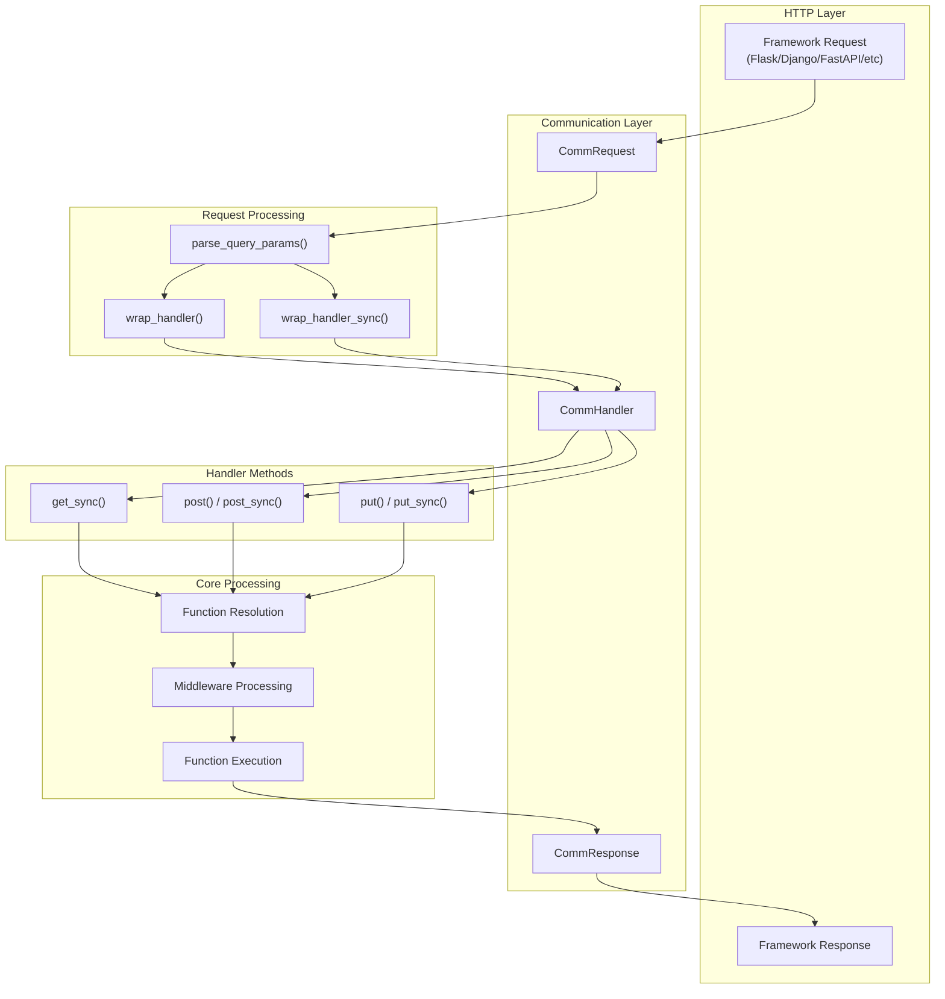
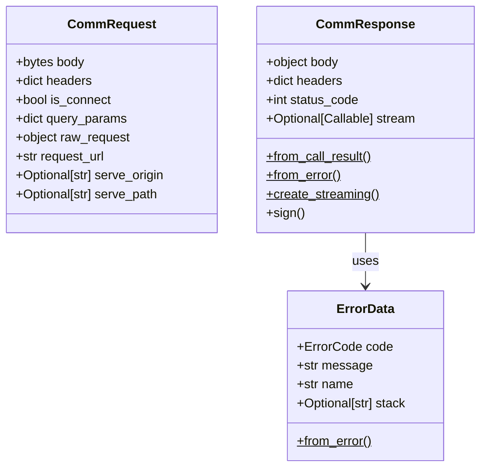
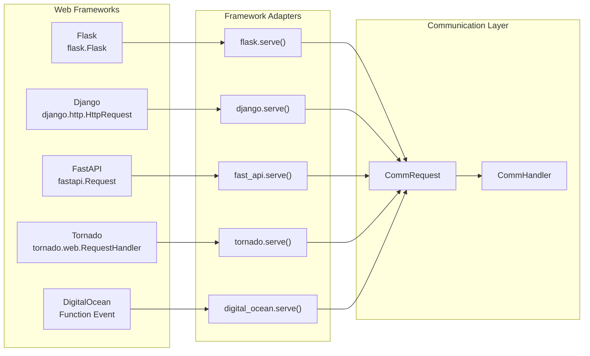
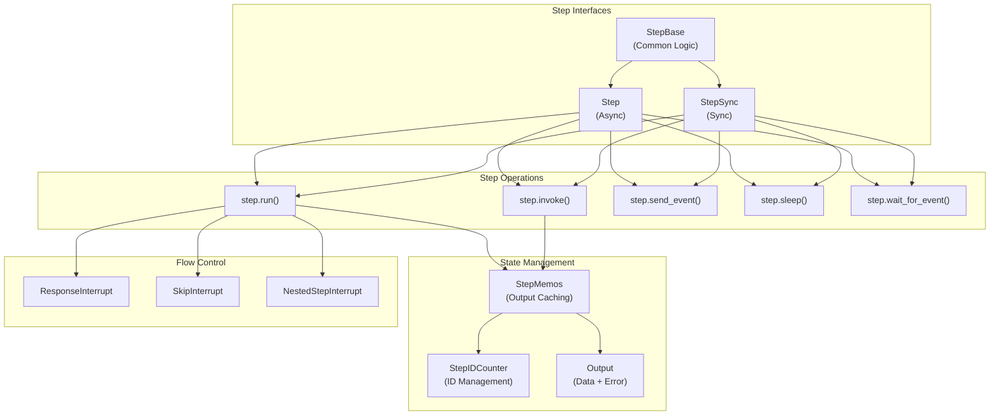
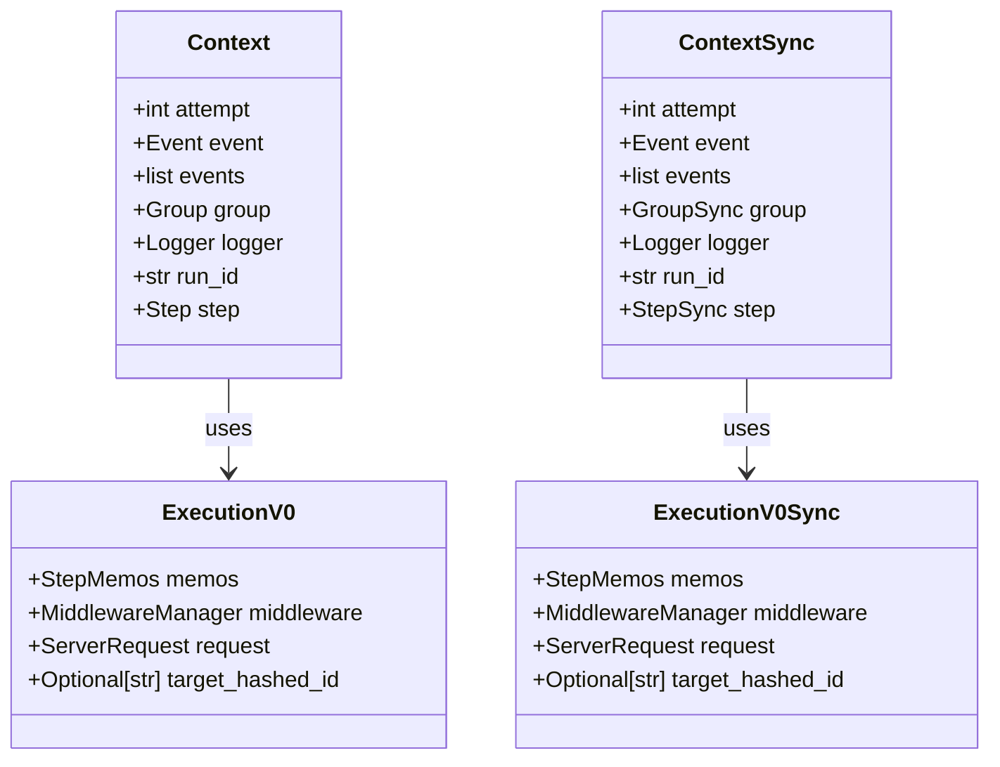
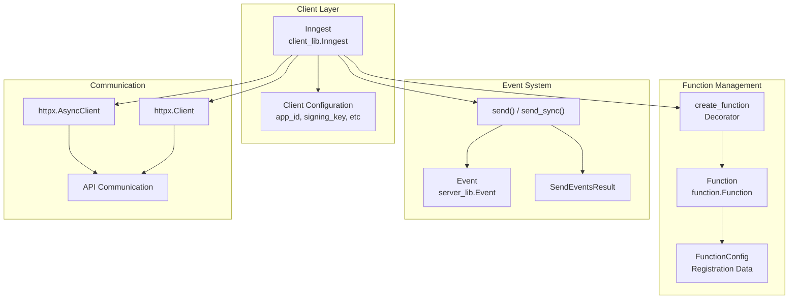
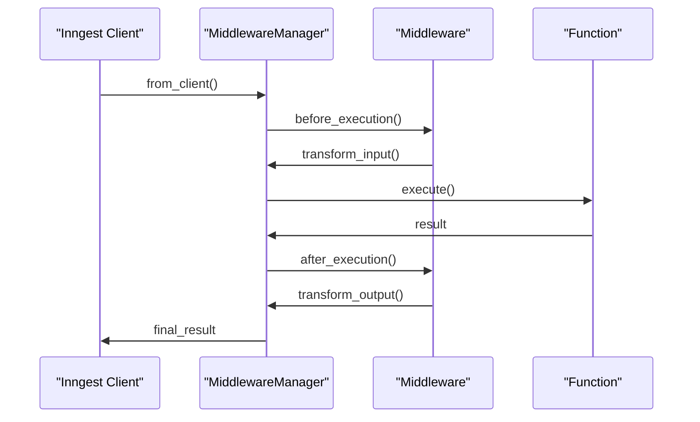
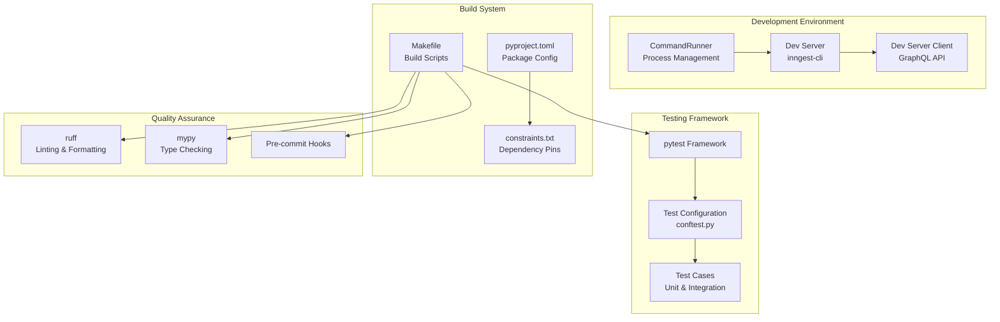

This document provides an overview of the major system components within the Inngest Python SDK, detailing their architecture, interactions, and implementation. It covers the core communication layer, framework integration adapters, step execution engine, and supporting infrastructure that enables event-driven workflow orchestration.

For information about the overall package organization, see [Package Structure](#2.1). For details on framework-specific integration patterns, see [Framework Integration](#4).

## Core Communication System

The communication system forms the backbone of the Inngest SDK, handling HTTP requests from the Inngest server and routing them to appropriate handlers. The system is built around three key components that work together to process incoming requests and generate responses.

### Communication Flow Architecture

Sources: [pkg/inngest/inngest/_internal/comm_lib/handler.py:32-465](), [pkg/inngest/inngest/_internal/comm_lib/models.py:18-31](), [pkg/inngest/inngest/_internal/comm_lib/utils.py]()

### CommHandler Class

The `CommHandler` class serves as the central request processor, implementing both synchronous and asynchronous execution patterns. It manages function resolution, middleware execution, and response generation.

| Property | Type | Purpose |
|----------|------|---------|
| `_client` | `client_lib.Inngest` | Reference to the Inngest client instance |
| `_fns` | `dict[str, function.Function]` | Registered functions indexed by ID |
| `_framework` | `server_lib.Framework` | Target web framework type |
| `_mode` | `server_lib.ServerKind` | Execution mode (dev/production) |
| `_thread_pool` | `ThreadPoolExecutor` | Thread pool for sync function execution |

The handler supports three HTTP methods:
- **GET**: Function inspection and discovery ([handler.py:366-402]())
- **POST**: Function execution ([handler.py:102-244]())
- **PUT**: Function registration and synchronization ([handler.py:405-433]())

Sources: [pkg/inngest/inngest/_internal/comm_lib/handler.py:41-100]()

### Request and Response Models

Sources: [pkg/inngest/inngest/_internal/comm_lib/models.py:18-46](), [pkg/inngest/inngest/_internal/comm_lib/models.py:342-366]()

## Framework Integration Layer

The framework integration layer provides adapters that bridge web frameworks with the core communication system. Each adapter implements framework-specific request handling while maintaining a consistent interface to the underlying SDK.

### Framework Adapter Architecture

Sources: [pkg/inngest/inngest/flask.py:20-68](), [pkg/inngest/inngest/django.py:27-73](), [pkg/inngest/inngest/fast_api.py:21-49](), [pkg/inngest/inngest/tornado.py:21-47](), [pkg/inngest/inngest/digital_ocean.py:24-48]()

### Framework-Specific Implementations

Each framework adapter implements the `serve()` function with framework-specific characteristics:

| Framework | Async Support | Streaming Support | Handler Pattern |
|-----------|---------------|-------------------|-----------------|
| Flask | Mixed (auto-detect) | No | Route decorator |
| Django | Mixed (version-based) | No | URL pattern |
| FastAPI | Full | Yes | Route decorator |
| Tornado | Sync only | No | Request handler class |
| DigitalOcean | Sync only | No | Function wrapper |

The adapters handle:
- Request parsing and normalization
- Response formatting and serialization
- Framework-specific routing and middleware
- Async/sync execution mode detection

Sources: [pkg/inngest/inngest/flask.py:48-68](), [pkg/inngest/inngest/django.py:54-73](), [pkg/inngest/inngest/fast_api.py:44-49]()

## Step Execution Engine

The step execution engine manages the execution of individual steps within Inngest functions, providing memoization, error handling, and flow control capabilities.

### Step Execution Components

Sources: [pkg/inngest/inngest/_internal/step_lib/__init__.py](), [pkg/inngest/inngest/_internal/execution_lib.py]()

### Execution Context Management

The execution system maintains context information throughout function execution:

Sources: [pkg/inngest/inngest/_internal/execution_lib.py]()

## Client and Function Management

The client system manages Inngest configuration, function registration, and event communication with external services.

### Client Architecture

Sources: [pkg/inngest/inngest/_internal/client_lib.py](), [pkg/inngest/inngest/_internal/function.py](), [pkg/inngest/inngest/__init__.py:3-60]()

### Function Registration Process

The function registration process involves several stages:

1. **Function Definition**: Using the `@client.create_function()` decorator
2. **Configuration Generation**: Creating `FunctionConfig` objects
3. **Registration**: Synchronizing with Inngest server via PUT requests
4. **Execution**: Handling incoming POST requests for function execution

Sources: [pkg/inngest/inngest/_internal/comm_lib/handler.py:405-465](), [pkg/inngest/inngest/_internal/comm_lib/handler.py:763-777]()

## Middleware System

The middleware system provides hooks for intercepting and modifying function execution at various stages.

### Middleware Processing Flow

Sources: [pkg/inngest/inngest/_internal/middleware_lib.py]()

## Development and Testing Infrastructure

The SDK includes comprehensive development and testing infrastructure to support local development, CI/CD, and integration testing.

### Development Tools Architecture

Sources: [pkg/inngest/inngest/experimental/dev_server/command_runner.py:13-133](), [Makefile:1-43](), [CONTRIBUTING.md:78-91]()

### Package Organization

The system is organized into multiple packages with clear separation of concerns:

| Package | Purpose |
|---------|---------|
| `pkg/inngest` | Main SDK package with core functionality |
| `pkg/inngest_encryption` | Encryption utilities and extensions |
| `pkg/test_core` | Shared testing infrastructure |
| `examples/` | Framework-specific example applications |

Sources: [Makefile:13-19](), [CONTRIBUTING.md:1-77]()

The modular architecture enables independent development, testing, and deployment of different SDK components while maintaining consistent interfaces and behavior across all supported frameworks.