This document covers Inngest's external API layer, including both the modern V2 gRPC/HTTP service and the legacy V1 HTTP API. These services provide external access to account management, function execution, and system health endpoints.

For information about internal service communication and the Connect Gateway system, see [Connect Gateway and WebSocket Workers](#2.4). For details about function execution mechanics, see [Executor and Function Execution](#2.2).

## Architecture Overview

The API layer consists of two primary services: a modern V2 gRPC service with automatic HTTP gateway generation, and a legacy V1 HTTP API that handles function execution checkpointing.

### API Service Architecture

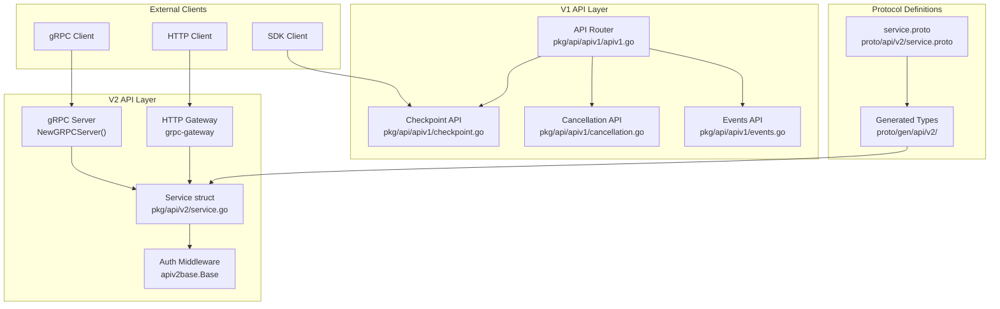

**Sources:** [pkg/api/v2/service.go:16-36](), [pkg/api/apiv1/apiv1.go:74-91](), [proto/api/v2/service.proto:34-821]()

## V2 gRPC Service Implementation

The V2 API service implements a modern gRPC-first design with automatic HTTP REST endpoint generation using grpc-gateway.

### Service Structure

The core `Service` struct implements the generated `V2Server` interface:

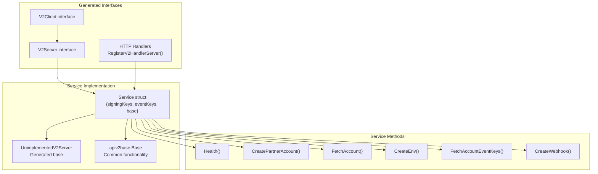

**Sources:** [pkg/api/v2/service.go:16-36](), [proto/gen/api/v2/service_grpc.pb.go:171-187](), [proto/gen/api/v2/service.pb.gw.go:336-341]()

### Dual Protocol Support

The service simultaneously supports both gRPC and HTTP protocols through different server configurations:

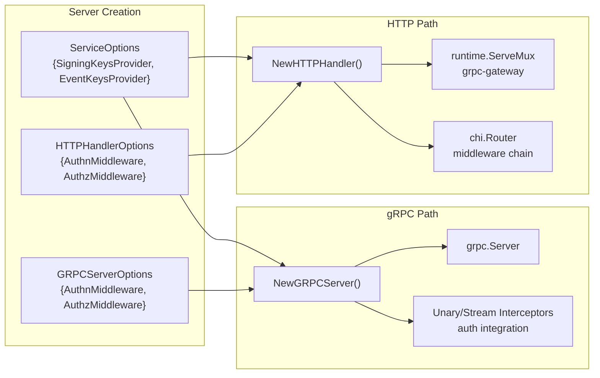

**Sources:** [pkg/api/v2/service.go:44-66](), [pkg/api/v2/service.go:73-132]()

## V1 Legacy API

The V1 API provides HTTP-only endpoints focused on function execution lifecycle management and system monitoring.

### Core API Components

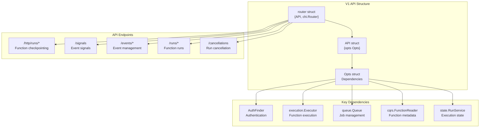

**Sources:** [pkg/api/apiv1/apiv1.go:23-72](), [pkg/api/apiv1/apiv1.go:102-161]()

### Checkpoint API for Function Execution

The checkpoint API enables SDK-based function execution by providing stateful function run management:

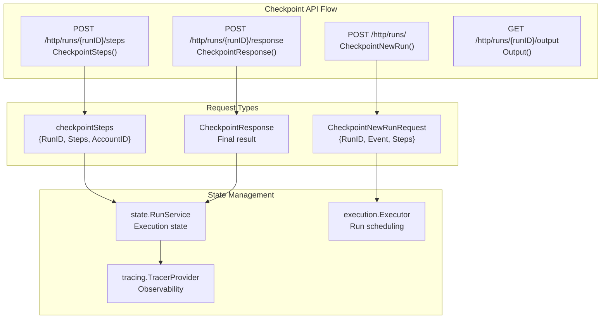

**Sources:** [pkg/api/apiv1/checkpoint.go:111-197](), [pkg/api/apiv1/checkpoint.go:205-224](), [pkg/api/apiv1/checkpoint_types.go:58-77]()

## Authentication and Authorization

Both API versions implement layered authentication and authorization using HTTP middleware that integrates with gRPC interceptors.

### Auth Integration Pattern

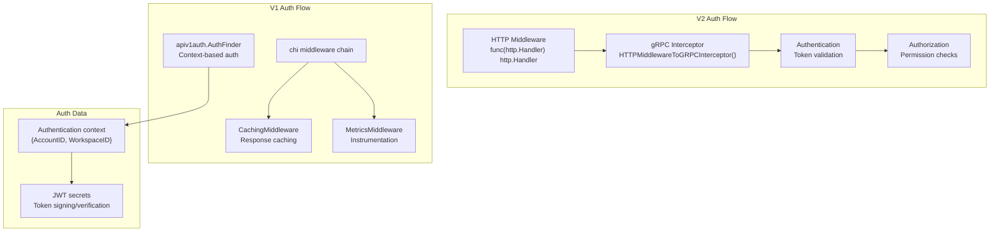

**Sources:** [pkg/api/v2/service.go:98-101](), [pkg/api/apiv1/apiv1.go:119-132](), [pkg/api/apiv1/apiv1auth/]()

## Protocol Buffer Definitions

The V2 API uses Protocol Buffers for type-safe service definitions with automatic code generation for multiple languages.

### Service Definition Structure

The service definition in `proto/api/v2/service.proto` defines the complete API surface:

| RPC Method | HTTP Mapping | Purpose |
|------------|--------------|---------|
| `Health` | `GET /health` | System health check |
| `CreatePartnerAccount` | `POST /partner/accounts` | Partner account creation |
| `FetchAccount` | `GET /account` | User account retrieval |
| `CreateEnv` | `POST /envs` | Environment creation |
| `FetchAccountEventKeys` | `GET /keys/events` | Event key management |
| `CreateWebhook` | `POST /env/webhooks` | Webhook configuration |

**Sources:** [proto/api/v2/service.proto:34-821]()

### Generated Code Structure

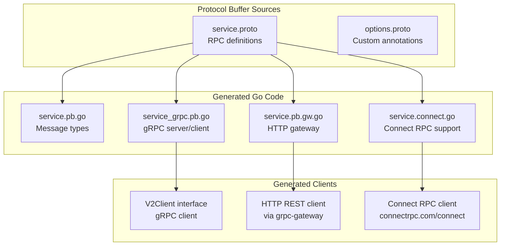

**Sources:** [proto/gen/api/v2/service.pb.go:1-10](), [proto/gen/api/v2/service_grpc.pb.go:1-10](), [proto/gen/api/v2/service.pb.gw.go:1-10](), [proto/gen/api/v2/apiv2connect/service.connect.go:1-10]()

## Error Handling and Response Patterns

Both API versions implement consistent error handling with proper HTTP status codes and structured error responses.

### V2 Error Response Pattern

The V2 API uses structured error responses defined in Protocol Buffers:

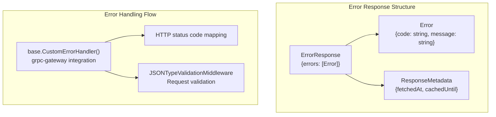

**Sources:** [pkg/api/v2/service.go:78-80](), [proto/api/v2/service.proto:840-847]()

### V1 Error Handling

The V1 API uses the `publicerr` package for consistent error responses:

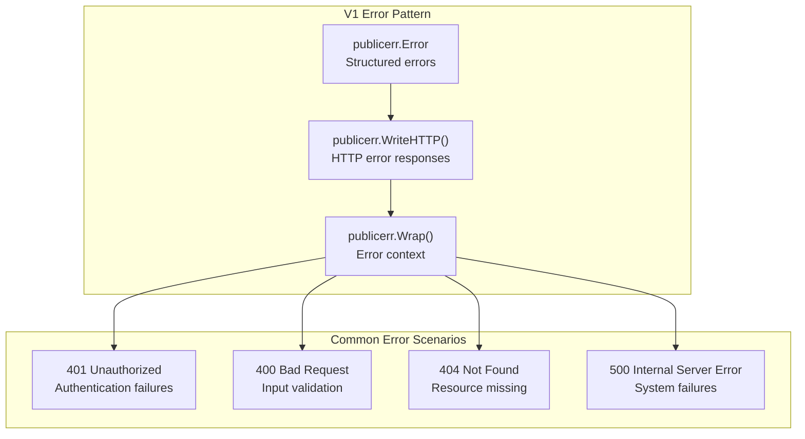

**Sources:** [pkg/api/apiv1/checkpoint.go:116-117](), [pkg/api/apiv1/cancellation.go:26-27](), [pkg/api/apiv1/events.go:30-31]()

# CQRS and Data Layer

## Purpose and Scope

This document covers Inngest's Command Query Responsibility Segregation (CQRS) implementation and data layer architecture. The CQRS system provides a unified interface for database operations across multiple database backends (PostgreSQL and SQLite), handles entity persistence for apps, functions, events, runs, and traces, and integrates with the execution system for state management.

For information about specific API endpoints that use this data layer, see [API Services and gRPC](#6.1). For details about tracing data collection and observability, see [Tracing and Observability](#6.3).

## CQRS Architecture Overview

The CQRS system is built around the `cqrs.Manager` interface, which provides unified access to all database operations. The core implementation uses a wrapper pattern to abstract database-specific details while maintaining type safety through SQLC-generated code.

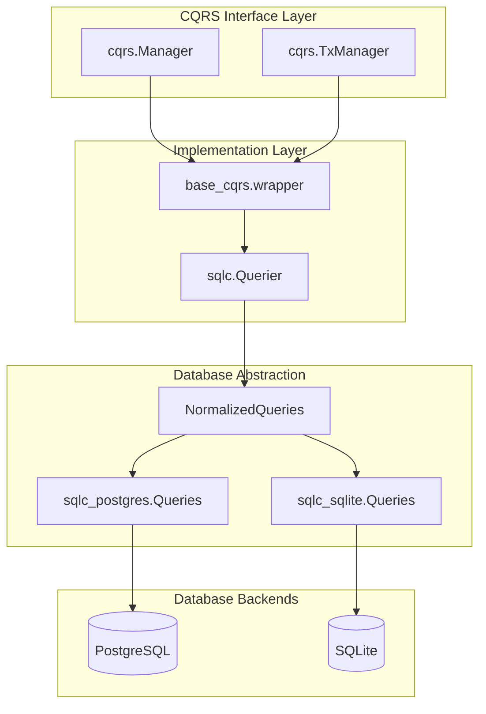

The `wrapper` struct implements both `cqrs.Manager` and `cqrs.TxManager` interfaces, providing seamless transaction management and database operations. The system automatically detects the database driver and routes operations through the appropriate SQLC-generated queries.

Sources: [pkg/cqrs/base_cqrs/cqrs.go:58-67](), [pkg/cqrs/base_cqrs/cqrs.go:69-75]()

## Database Backend Selection and Normalization

Inngest supports both PostgreSQL and SQLite backends through a normalization layer that ensures consistent interfaces across different database systems. The `NewQueries` function determines the appropriate backend based on the driver string.

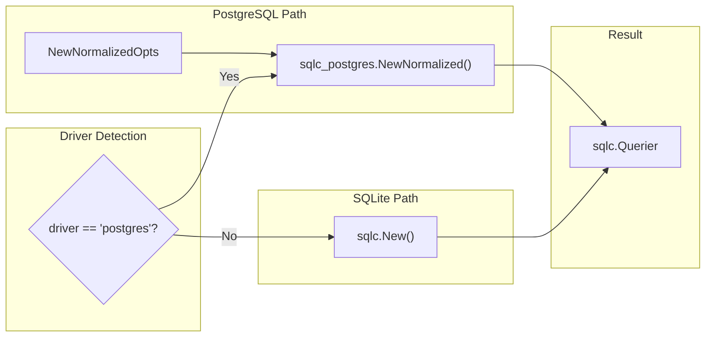

The PostgreSQL backend includes connection pooling configuration through `NewNormalizedOpts`, while SQLite uses simpler direct queries. The normalization layer in `db_normalization.go` converts PostgreSQL-specific responses to match the SQLite interface, ensuring API consistency.

Sources: [pkg/cqrs/base_cqrs/cqrs.go:48-56](), [pkg/cqrs/base_cqrs/sqlc/postgres/db_normalization.go:21-29]()

## Entity Management System

The CQRS layer manages several core entities within Inngest's execution model. Each entity has dedicated CRUD operations and specific business logic handling.

### Core Entity Types

| Entity | Purpose | Key Operations |
|--------|---------|----------------|
| `cqrs.App` | Application registration and metadata | `UpsertApp`, `GetAppByURL`, `UpdateAppError` |
| `cqrs.Function` | Function definitions and configuration | `InsertFunction`, `GetFunctionsByAppID`, `UpdateFunctionConfig` |
| `cqrs.Event` | Event ingestion and storage | `InsertEvent`, `GetEventsByExpressions`, `GetEventsIDbound` |
| `cqrs.FunctionRun` | Function execution tracking | `InsertFunctionRun`, `GetFunctionRun`, `GetFunctionRunsTimebound` |
| `cqrs.OtelSpan` | OpenTelemetry span data | `GetSpansByRunID`, `GetSpansByDebugSessionID` |

### App Management Operations

The system provides comprehensive app lifecycle management with automatic URL normalization and checksum-based deduplication:

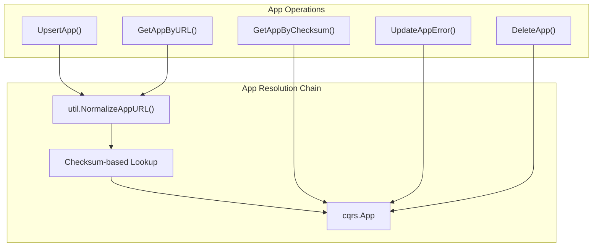

Sources: [pkg/cqrs/base_cqrs/cqrs.go:648-675](), [pkg/cqrs/base_cqrs/cqrs.go:619-627]()

## Transaction Management

The CQRS system provides transaction support through the `TxManager` interface, allowing atomic operations across multiple database calls. Transactions are managed through the `WithTx` method pattern.

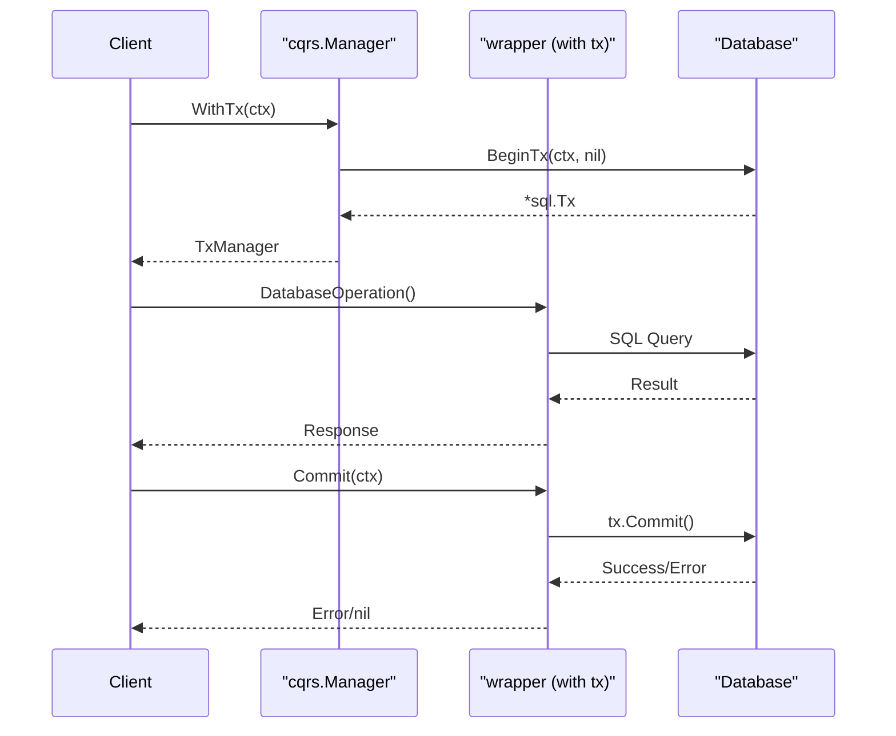

The transaction wrapper maintains the same interface as the non-transactional version, allowing transparent operation switching. Failed transactions can be rolled back using the `Rollback` method.

Sources: [pkg/cqrs/base_cqrs/cqrs.go:435-458](), [pkg/cqrs/base_cqrs/cqrs.go:460-466]()

## OpenTelemetry Span Processing

The CQRS layer includes sophisticated OpenTelemetry span processing capabilities, converting raw span data into structured entities with support for debugging and trace visualization.

### Span Data Transformation

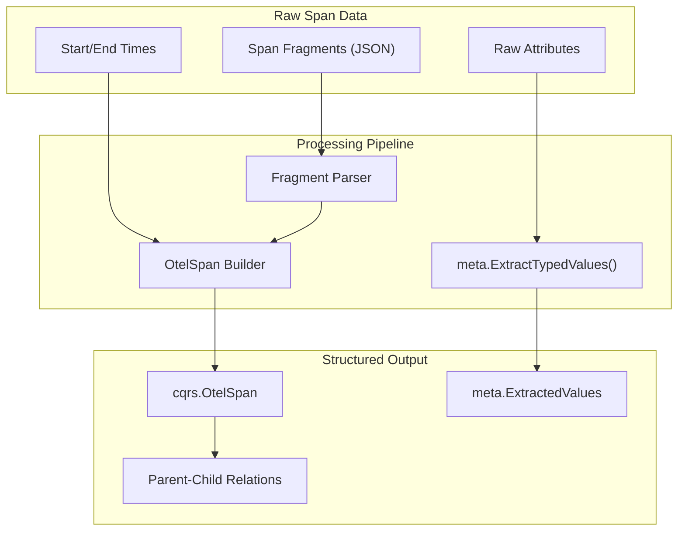

The system handles complex span relationships, including dynamic span IDs for step execution tracking and debug session management. Special processing handles I/O references and span output encoding.

Sources: [pkg/cqrs/base_cqrs/cqrs.go:160-349](), [pkg/cqrs/base_cqrs/cqrs.go:351-370]()

## Queue Snapshot Management

The CQRS system includes functionality for managing execution queue snapshots, providing point-in-time queue state persistence for recovery and debugging purposes.

### Snapshot Storage Strategy

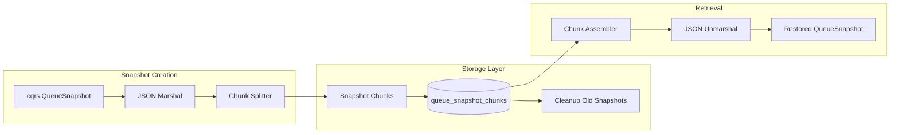

Snapshots are automatically chunked based on `consts.StartMaxQueueChunkSize` to handle large queue states, and old snapshots are cleaned up asynchronously to prevent storage bloat.

Sources: [pkg/cqrs/base_cqrs/cqrs.go:514-563](), [pkg/cqrs/base_cqrs/cqrs.go:468-489]()

## Integration with Tracing System

The data layer integrates closely with Inngest's tracing system through the `tracer_sqlc.go` implementation, which exports OpenTelemetry spans directly to the database for persistence and analysis.

### Tracing Data Flow

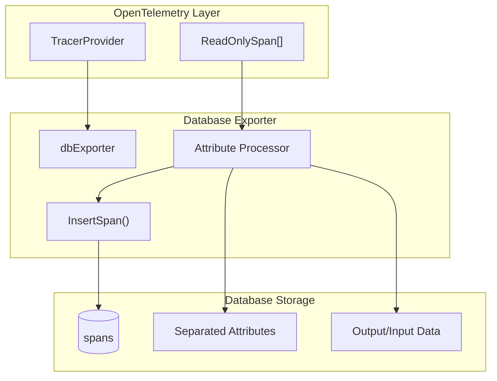

The exporter processes spans by extracting key attributes like `RunID`, `AppID`, `FunctionID`, and separating large payload data (input/output) from the main attributes for efficient storage and querying.

Sources: [pkg/tracing/tracer_sqlc.go:18-24](), [pkg/tracing/tracer_sqlc.go:26-262]()