This document covers the build tooling, compilation process, and automated release workflows for the Inngest platform. It explains how the Go-based CLI and development server are built, packaged, and distributed across multiple platforms and package managers.

For information about the development server itself, see [Development Server and Local Environment](#4.1). For details about the UI build process specifically, see [UI Architecture and Component System](#5.3).

## Overview

The Inngest build system supports multiple distribution channels and deployment targets through a combination of Make, GoReleaser, and GitHub Actions. The primary artifact is a single Go binary that serves as both the CLI tool and development server, distributed via GitHub Releases, Docker Hub, and npm.

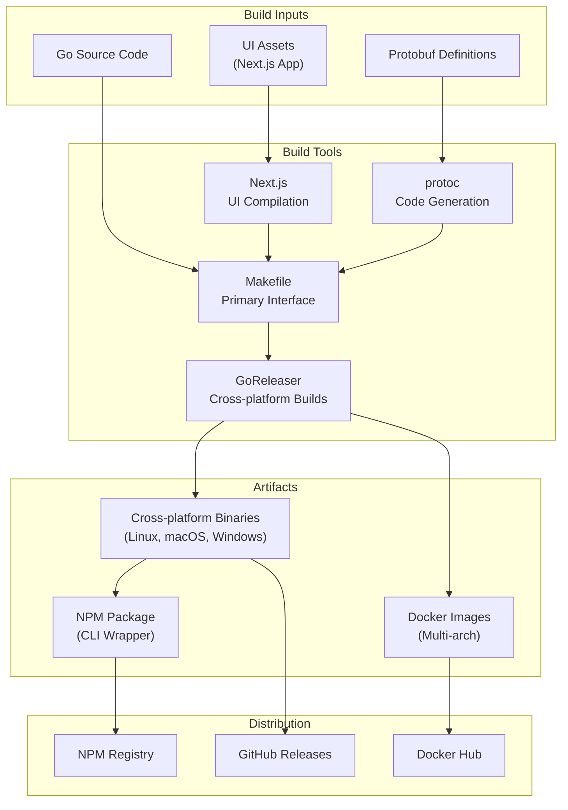

Sources: [Makefile:1-100](), [.goreleaser.yml:1-93](), [.github/workflows/release.yml:1-78]()

## Build System Architecture

### Makefile Interface

The `Makefile` serves as the primary interface for all build operations, providing standardized targets for development and release workflows.

| Target | Purpose | Key Commands |
|--------|---------|--------------|
| `dev` | Development builds | `goreleaser build --single-target --snapshot` |
| `build` | Production builds | `goreleaser build` |
| `test` | Testing and linting | `go test`, `golangci-lint run` |
| `build-ui` | UI compilation | `pnpm build` in dev-server-ui |
| `docs` | API documentation | `protoc --openapiv2_out` |
| `protobuf` | Protocol buffer code generation | `buf generate` |

The build process follows a dependency chain where UI assets must be compiled before the Go binary build:

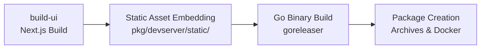

Sources: [Makefile:64-69](), [Makefile:87-89]()

### GoReleaser Configuration

GoReleaser handles cross-platform compilation and packaging through the `.goreleaser.yml` configuration:

**Build Matrix:**
- **Platforms**: Linux, macOS, Windows
- **Architectures**: amd64, arm64
- **Output**: Single `inngest` binary with embedded version information

**Key Build Features:**
- CGO disabled for static binaries
- Version and commit hash injection via ldflags
- UI assets embedded at build time
- Multi-architecture Docker images with manifest creation

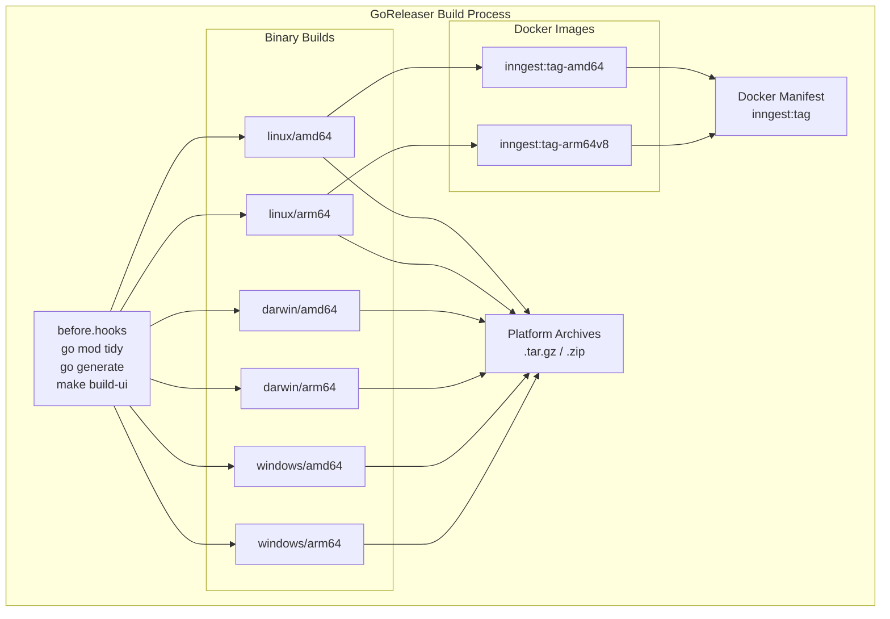

Sources: [.goreleaser.yml:1-6](), [.goreleaser.yml:7-23](), [.goreleaser.yml:24-66]()

### NPM Package Distribution

The npm package in the `npm/` directory provides a Node.js wrapper that downloads the appropriate binary for the user's platform:

**Package Structure:**
- `package.json`: Defines CLI entry points and dependencies
- `postinstall.ts`: Platform detection and binary download logic  
- `tsconfig.json`: TypeScript compilation configuration

**Platform Detection Logic:**

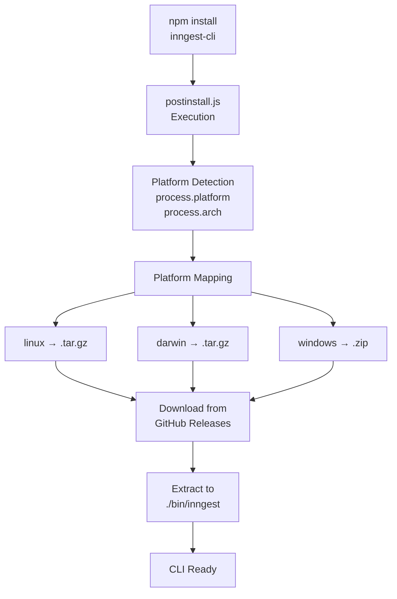

The `postinstall.ts` script maps Node.js platform identifiers to Go build targets and downloads the appropriate binary from GitHub Releases.

Sources: [npm/package.json:1-42](), [npm/postinstall.ts:14-44](), [npm/postinstall.ts:48-66]()

## CI/CD Pipeline

### GitHub Actions Workflows

The release process is orchestrated through multiple GitHub Actions workflows:

**Release Workflow (`.github/workflows/release.yml`):**
- **Trigger**: Git tags matching `v*` pattern
- **GoReleaser Job**: Builds binaries and Docker images
- **NPM Job**: Publishes package to npm registry
- **Dependency**: NPM job waits for GoReleaser completion

**Testing Workflows:**
- `go.yaml`: Go unit tests and linting
- `e2e.yml`: End-to-end testing with TypeScript and Go SDKs
- `components_test.yml`: UI component testing
- `dev_server_ui.yml`: Development server UI testing

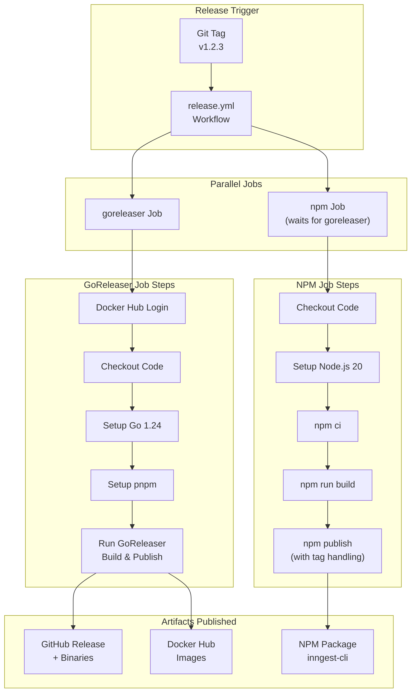

Sources: [.github/workflows/release.yml:8-44](), [.github/workflows/release.yml:45-78]()

### Testing Integration

The CI/CD pipeline includes comprehensive testing before releases:

**Test Matrix:**
- **Unit Tests**: Go packages with race detection
- **E2E Tests**: Integration testing with SDK implementations
- **UI Tests**: Component and application-level testing
- **Platform Coverage**: Linux, macOS, Windows across multiple Node.js/Go versions

**Key Testing Features:**
- Parallel test execution with matrix strategies
- Coverage reporting to Codecov
- Experimental feature flag testing (e.g., `EXPERIMENTAL_KEY_QUEUES_ENABLE`)

Sources: [.github/workflows/go.yaml:36-64](), [.github/workflows/e2e.yml:18-83]()

## Release Process

### Versioning and Tagging

The release process follows semantic versioning with Git tags:

**Release Types:**
- **Stable**: `v1.2.3` → Published as `latest` on npm
- **Pre-release**: `v1.2.3-beta.1` → Published with tag `beta` on npm
- **Alpha**: `v1.2.3-alpha.1` → Published with tag `alpha` on npm

**Release Creation Process:**

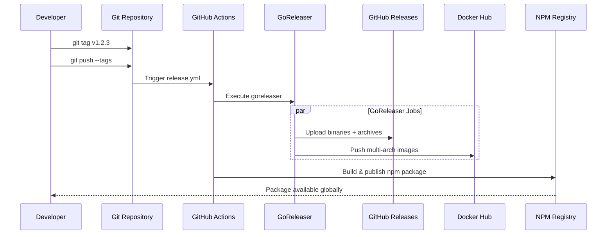

**Version Injection:**
The build process injects version information into the binary at compile time:

- `github.com/inngest/inngest/pkg/inngest/version.Version={{.Version}}`
- `github.com/inngest/inngest/pkg/inngest/version.Hash={{.ShortCommit}}`

Sources: [.goreleaser.yml:12-15](), [docs/RELEASING.md:1-34]()

### Distribution Channels

**GitHub Releases:**
- Cross-platform binaries (6 targets)
- Source archives
- Checksums for verification
- Automatic changelog generation

**Docker Hub:**
- Multi-architecture images (`inngest/inngest`)
- Platform-specific tags and unified manifests
- Based on Alpine Linux for minimal size

**NPM Registry:**
- Package name: `inngest-cli`
- Binary aliases: `inngest` and `inngest-cli`
- Platform-aware postinstall script
- Pre-release tag support

Sources: [.goreleaser.yml:67-93](), [npm/package.json:11-14](), [install.sh:1-311]()

## Development Tools Integration

### Nix Development Environment

The `flake.nix` provides a reproducible development environment with all necessary tools:

**Included Tools:**
- Go toolchain and linting tools
- Protocol buffer compilers
- Node.js and TypeScript tools
- Language servers for development

**Usage:**
```bash
nix develop  # Enter development shell
make dev     # Build development version
```

### Platform-Specific Tooling

**Cross-compilation Support:**
- `xgo` target in Makefile for alternative cross-compilation
- Platform-specific build flags and optimizations
- Support for both development and production builds

**Installation Script:**
The `install.sh` script provides direct binary installation without package managers, supporting platform detection and checksum verification.

Sources: [flake.nix:75-121](), [Makefile:15-16](), [install.sh:284-310]()

# User Interface and Dashboard


The Inngest Dashboard UI is a comprehensive web application that provides monitoring, visualization, and management capabilities for serverless functions, events, and applications. Built with Next.js and React, it offers real-time insights into function executions, billing management, and system observability through a modern, responsive interface.

The dashboard integrates with Inngest's GraphQL API to provide type-safe data access and real-time updates for monitoring function performance, debugging issues, and managing account settings.

## Architecture Overview

The dashboard follows a layered architecture with clear separation between presentation, data access, and business logic. The system is organized as a Next.js application with TypeScript, GraphQL integration, and a comprehensive component system.

**Dashboard Application Architecture**

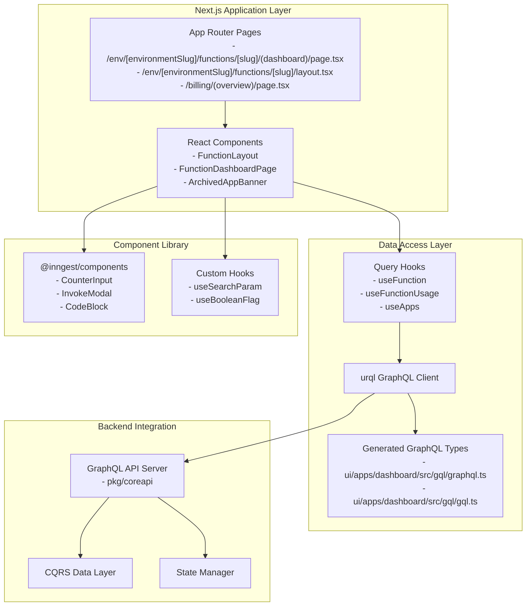

The architecture consists of three main layers:

1. **Application Layer**: Next.js pages and route handlers implementing the dashboard UI
2. **Data Access Layer**: GraphQL client with auto-generated types and custom query hooks  
3. **Component Library**: Reusable UI components and utilities shared across applications

Sources:
- [ui/apps/dashboard/src/app/(organization-active)/(dashboard)/env/[environmentSlug]/functions/[slug]/layout.tsx:1-162]()
- [ui/apps/dashboard/src/app/(organization-active)/(dashboard)/env/[environmentSlug]/functions/[slug]/(dashboard)/page.tsx:1-253]()
- [ui/apps/dashboard/src/gql/graphql.ts:1-157]()
- [ui/apps/dashboard/src/queries/functions.ts:1-21]()

## Design System

The UI is built on a comprehensive design system that provides consistent styling, color schemes, and component aesthetics. It includes support for both light and dark modes through the `next-themes` package.

### Component Library Structure

The shared component library (`@inngest/components`) provides reusable UI elements used by both the production dashboard and development server UI.

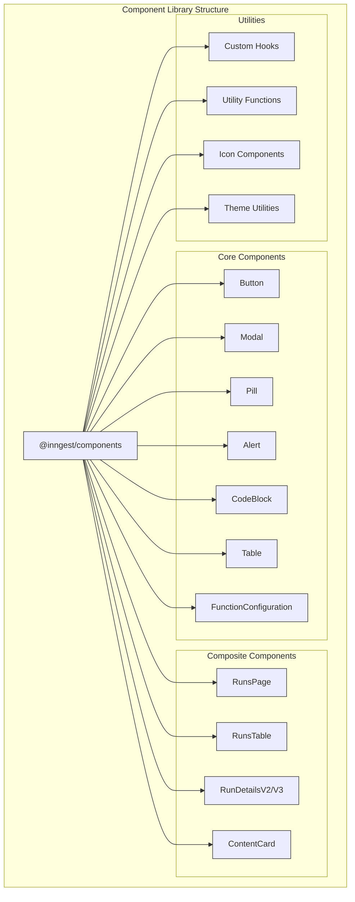

### Color System

The design system uses a token-based approach with semantic color names and intensity levels implemented through Tailwind CSS:

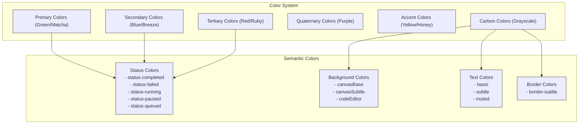

The color system uses a scale of intensity levels from subtle to intense (e.g., `primary-3xSubtle`, `primary-2xSubtle`, `primary-xSubtle`, `primary-subtle`, `primary-moderate`, `primary-intense`, etc.) to create a cohesive visual hierarchy. The system supports both light and dark modes through CSS variables.

Sources:
- [ui/packages/components/tailwind.config.ts:7-196](ui/packages/components/tailwind.config.ts:7-196)
- [ui/packages/components/src/CodeBlock/CodeBlock.tsx:260-410](ui/packages/components/src/CodeBlock/CodeBlock.tsx:260-410)
- [ui/packages/components/src/ContentCard/ContentCard.tsx:15-49](ui/packages/components/src/ContentCard/ContentCard.tsx:15-49)
- [ui/packages/components/package.json:17-58](ui/packages/components/package.json:17-58)

## Key Components

The UI is built using a component-based architecture with several key components that make up the dashboard experience.

### 1. Function Dashboard

The Function Dashboard is a central feature that provides comprehensive monitoring and visualization for individual functions.

```mermaid
graph TD
    subgraph "Function Dashboard Components"
        dashboard["FunctionDashboardPage"]
        timeRange["DashboardTimeRangeFilter"]
        runsChart["FunctionRunsChart"]
        throughputChart["FunctionThroughputChart"]
        stepsRunning["StepsRunningChart"]
        stepBacklog["StepBacklogChart"]
        sdkRequests["SDKRequestThroughputChart"]
        rateLimitChart["FunctionRunRateLimitChart"]
        failedRuns["LatestFailedFunctionRuns"]
        functionConfig["FunctionConfiguration"]
    end
    
    dashboard --> timeRange
    dashboard --> runsChart
    dashboard --> throughputChart
    dashboard --> stepsRunning
    dashboard --> stepBacklog
    dashboard --> sdkRequests
    dashboard --> rateLimitChart
    dashboard --> failedRuns
    dashboard --> functionConfig
    
    subgraph "Data Sources"
        functionQuery["useFunction"]
        usageQuery["useFunctionUsage"]
        metricsQueries["Metrics Queries"]
    end
    
    dashboard --> functionQuery
    dashboard --> usageQuery
    runsChart --> usageQuery
    throughputChart --> metricsQueries
    stepsRunning --> metricsQueries
    stepBacklog --> metricsQueries
    sdkRequests --> metricsQueries
    rateLimitChart --> metricsQueries
    
    classDef compnode stroke:#333,stroke-width:1px;
    class dashboard,timeRange,runsChart,throughputChart,stepsRunning,stepBacklog,sdkRequests,rateLimitChart,failedRuns,functionConfig,functionQuery,usageQuery,metricsQueries compnode;
```

Key features of the Function Dashboard:
- Comprehensive metrics visualization (runs volume, failure rate, throughput)
- Time range filtering with preset options
- Multiple chart types for different metrics (runs, throughput, backlog, etc.)
- Latest failed runs list for quick debugging
- Function configuration details sidebar

Sources:
- [ui/apps/dashboard/src/app/(organization-active)/(dashboard)/env/[environmentSlug]/functions/[slug]/(dashboard)/page.tsx:34-191](ui/apps/dashboard/src/app/(organization-active)/(dashboard)/env/[environmentSlug]/functions/[slug]/(dashboard)/page.tsx:34-191)
- [ui/apps/dashboard/src/queries/functions.ts:89-401](ui/apps/dashboard/src/queries/functions.ts:89-401)
- [ui/packages/components/src/FunctionConfiguration/FunctionConfiguration.tsx](ui/packages/components/src/FunctionConfiguration/FunctionConfiguration.tsx)

### 2. RunsPage Component

The `RunsPage` is a core component for visualizing and managing function runs. It provides a comprehensive interface for monitoring function executions.

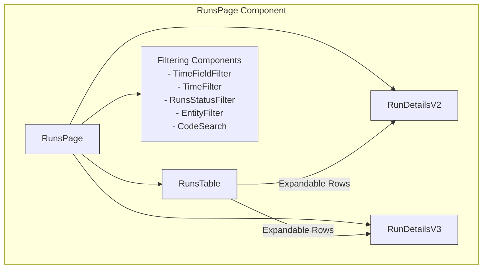

Key features of the RunsPage component:
- Table view of function runs with expandable rows
- Filtering by time range, status, app, function, and custom queries
- Detailed view of individual runs showing execution timeline
- Real-time updating with configurable polling

Sources:
- [ui/packages/components/src/RunsPage/RunsPage.tsx](ui/packages/components/src/RunsPage/RunsPage.tsx)
- [ui/packages/components/src/RunsPage/RunsTable.tsx](ui/packages/components/src/RunsPage/RunsTable.tsx)
- [ui/apps/dashboard/src/app/(organization-active)/(dashboard)/env/[environmentSlug]/functions/[slug]/runs/page.tsx](ui/apps/dashboard/src/app/(organization-active)/(dashboard)/env/[environmentSlug]/functions/[slug]/runs/page.tsx)

### 3. Function Layout and Navigation

The function-specific pages use a consistent layout with navigation components for moving between different sections of function information.

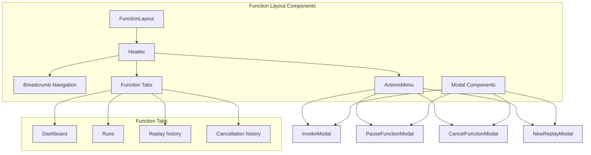

The function layout system includes:
- Header with breadcrumb navigation
- Tab-based navigation between function views (Dashboard, Runs, Replay history, etc.)
- Actions menu for function operations (Invoke, Pause, Cancel, Replay)
- Modal components for various actions
- Status indicators for function state (e.g., Paused)

Sources:
- [ui/apps/dashboard/src/app/(organization-active)/(dashboard)/env/[environmentSlug]/functions/[slug]/layout.tsx:36-161](ui/apps/dashboard/src/app/(organization-active)/(dashboard)/env/[environmentSlug]/functions/[slug]/layout.tsx:36-161)
- [ui/packages/components/src/Header/Header.tsx](ui/packages/components/src/Header/Header.tsx)
- [ui/packages/components/src/InvokeButton/index.tsx](ui/packages/components/src/InvokeButton/index.tsx)
- [ui/apps/dashboard/src/components/Functions/ActionMenu.tsx](ui/apps/dashboard/src/components/Functions/ActionMenu.tsx)

### 4. Apps Management

The Apps section provides management and visualization of applications connected to Inngest.

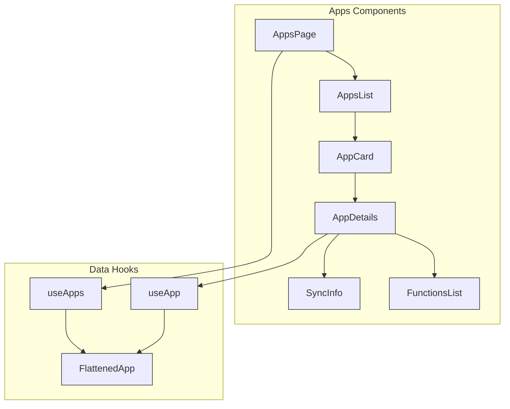

The Apps management includes:
- List view of all applications
- Detailed view of individual applications
- Sync information and status
- Functions associated with each application
- App metadata (framework, language, platform)

Sources:
- [ui/apps/dashboard/src/app/(organization-active)/(dashboard)/env/[environmentSlug]/apps/useApps.ts:65-123](ui/apps/dashboard/src/app/(organization-active)/(dashboard)/env/[environmentSlug]/apps/useApps.ts:65-123)
- [ui/apps/dashboard/src/app/(organization-active)/(dashboard)/env/[environmentSlug]/apps/[externalID]/useApp.ts:56-92](ui/apps/dashboard/src/app/(organization-active)/(dashboard)/env/[environmentSlug]/apps/[externalID]/useApp.ts:56-92)

### 5. Code and Data Visualization

The UI includes sophisticated components for visualizing code, JSON data, and other technical content.

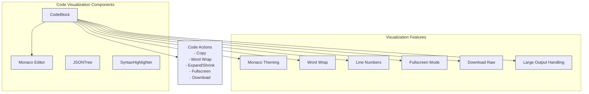

Key code visualization features:
- Monaco Editor integration for code display
- Syntax highlighting with theme support
- Word wrapping and line number options
- Fullscreen mode for detailed inspection
- Download option for large outputs
- Size limit handling to prevent browser crashes

Sources:
- [ui/packages/components/src/CodeBlock/CodeBlock.tsx:63-429](ui/packages/components/src/CodeBlock/CodeBlock.tsx:63-429)
- [ui/packages/components/src/icons/ExpandText.tsx:1-19](ui/packages/components/src/icons/ExpandText.tsx:1-19)
- [ui/packages/components/src/icons/ShrinkText.tsx:1-19](ui/packages/components/src/icons/ShrinkText.tsx:1-19)
- [ui/packages/components/src/utils/monaco.ts](ui/packages/components/src/utils/monaco.ts)

### 6. Data Visualization and Metrics

The UI includes sophisticated components for visualizing metrics, status, and other information.

```mermaid
graph TD
    subgraph "Metrics Visualization"
        runsChart["FunctionRunsChart"]
        throughputChart["FunctionThroughputChart"]
        stepsRunning["StepsRunningChart"]
        stepBacklog["StepBacklogChart"]
        sdkRequests["SDKRequestThroughputChart"]
        rateLimitChart["FunctionRunRateLimitChart"]
    end
    
    subgraph "Chart Libraries"
        recharts["Recharts"]
        echarts["ECharts"]
    end
    
    runsChart --> recharts
    throughputChart --> recharts
    stepsRunning --> recharts
    stepBacklog --> recharts
    sdkRequests --> recharts
    rateLimitChart --> recharts
    
    subgraph "Status Visualization"
        pill["Pill"]
        statusDot["StatusDot"]
        statusCell["StatusCell"]
    end
    
    pill --> pillContent["PillContent"]
    statusCell --> statusDot
    
    subgraph "Table Components"
        table["Table (TanStack)"]
        tableFilter["TableFilter"]
        cell["Cell Components"]
    end
    
    cell --> idCell["IDCell"]
    cell --> textCell["TextCell"]
    cell --> timeCell["TimeCell"]
    cell --> statusCell
    cell --> pillCell["PillCell"]
    cell --> numberCell["NumberCell"]
    
    classDef viznode stroke:#333,stroke-width:1px;
    class runsChart,throughputChart,stepsRunning,stepBacklog,sdkRequests,rateLimitChart,recharts,echarts,pill,statusDot,statusCell,table,tableFilter,cell,idCell,textCell,timeCell,pillCell,numberCell viznode;
```

These components provide consistent visualization for:
- Function metrics (runs, throughput, backlog, etc.)
- Status indicators (running, completed, failed, etc.)
- Time formatting and display
- Tabular data with sorting and filtering
- Advanced search capabilities

Sources:
- [ui/apps/dashboard/src/app/(organization-active)/(dashboard)/env/[environmentSlug]/functions/[slug]/(dashboard)/FunctionRunsChart.tsx](ui/apps/dashboard/src/app/(organization-active)/(dashboard)/env/[environmentSlug]/functions/[slug]/(dashboard)/FunctionRunsChart.tsx)
- [ui/packages/components/src/Pill/Pill.tsx](ui/packages/components/src/Pill/Pill.tsx)
- [ui/packages/components/src/Table/Table.tsx](ui/packages/components/src/Table/Table.tsx)
- [ui/packages/components/package.json:38-57](ui/packages/components/package.json:38-57)

## Data Management and State

### 1. GraphQL Data Layer

The dashboard implements a comprehensive GraphQL integration with auto-generated TypeScript types providing full type safety across the application. The data layer uses urql as the primary GraphQL client with TanStack Query for additional caching scenarios.

**GraphQL Integration Architecture**

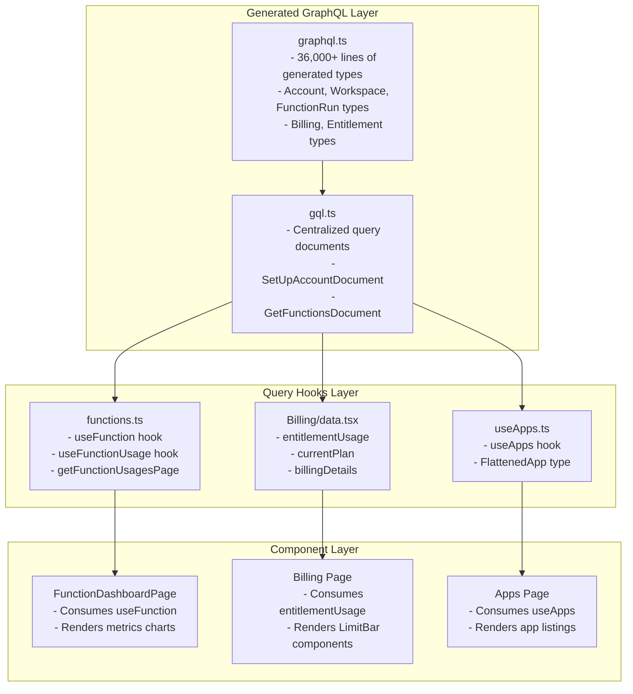

Key GraphQL features implemented:

| Component | Generated Types | Query Documents | Data Hooks |
|-----------|----------------|-----------------|-------------|
| Functions | `FunctionRun`, `Workflow`, `FunctionConfiguration` | `GetFunctionsDocument`, `GetFunctionDocument` | `useFunction`, `useFunctionUsage` |
| Billing | `Account`, `Entitlements`, `BillingPlan` | `EntitlementUsageDocument`, `GetCurrentPlanDocument` | `entitlementUsage`, `currentPlan` |
| Apps | `App`, `Deploy`, `FlattenedApp` | `AppsDocument`, `AppDocument` | `useApps`, `useApp` |

Sources:
- [ui/apps/dashboard/src/gql/graphql.ts:8-36]()
- [ui/apps/dashboard/src/gql/gql.ts:15-16]()
- [ui/apps/dashboard/src/queries/functions.ts:215-231]()
- [ui/apps/dashboard/src/components/Billing/data.tsx:109-125]()
- [ui/apps/dashboard/src/app/(organization-active)/(dashboard)/env/[environmentSlug]/apps/useApps.ts:66-135]()

### 2. URL-based State Management

The UI uses URL search parameters extensively for state management, allowing for bookmarkable and shareable views.

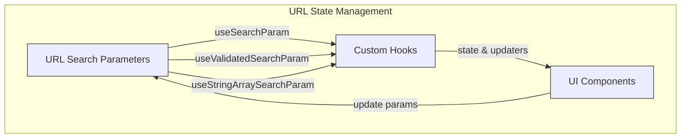

Key URL parameters include:
- `timeRange`: Dashboard time range selection (e.g., "24h", "7d")
- `timeField`: Which timestamp to use for filtering (queuedAt, startedAt, endedAt)
- `filterStatus`: Run status filters
- `filterApp`: App filters
- `filterFunction`: Function filters
- `last`: Relative time range
- `start`/`end`: Absolute time range
- `search`: Custom query string

Sources:
- [ui/apps/dashboard/src/app/(organization-active)/(dashboard)/env/[environmentSlug]/functions/[slug]/(dashboard)/page.tsx:41-43](ui/apps/dashboard/src/app/(organization-active)/(dashboard)/env/[environmentSlug]/functions/[slug]/(dashboard)/page.tsx:41-43)
- [ui/packages/components/src/hooks/useSearchParam.ts](ui/packages/components/src/hooks/useSearchParam.ts)
- [ui/packages/components/src/RunsPage/RunsPage.tsx](ui/packages/components/src/RunsPage/RunsPage.tsx)

### 3. Data Models and Types

The dashboard uses comprehensive TypeScript interfaces generated from the GraphQL schema to ensure type safety across all data operations.

**Core Data Models**

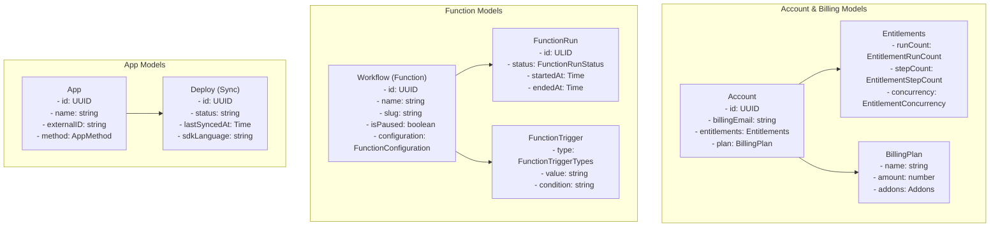

The data models provide:
- **Type-safe GraphQL operations** with over 1,000 generated TypeScript interfaces
- **Enum types** for status values (`FunctionRunStatus`, `AppMethod`, `FunctionTriggerTypes`)
- **Custom scalar types** (`ULID`, `UUID`, `Time`) for precise data handling
- **Nested object structures** for complex relationships like function configurations

Sources:
- [ui/apps/dashboard/src/gql/graphql.ts:49-73]()
- [ui/apps/dashboard/src/gql/graphql.ts:881-1007]()
- [ui/apps/dashboard/src/gql/graphql.ts:133-200]()
- [ui/apps/dashboard/src/queries/functions.ts:136-209]()

## Key UI Sections and Workflows

### 1. Function Management Workflow

The function management system provides comprehensive monitoring and control over serverless functions through a tabbed interface with action menus and modal dialogs.

**Function Management UI Flow**

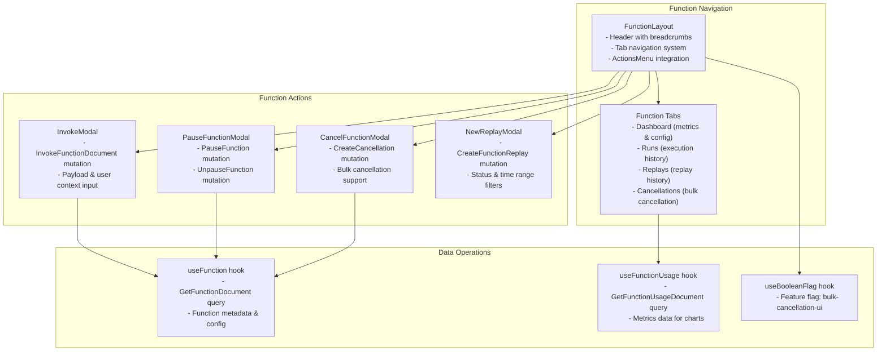

Key function management features:
- **Tabbed navigation** with dashboard, runs, replays, and cancellations views
- **Action menu** with invoke, pause, cancel, and replay operations
- **Feature flags** for conditional UI elements like bulk cancellation
- **Modal dialogs** for complex operations with confirmation workflows

Sources:
- [ui/apps/dashboard/src/app/(organization-active)/(dashboard)/env/[environmentSlug]/functions/[slug]/layout.tsx:36-161]()
- [ui/apps/dashboard/src/app/(organization-active)/(dashboard)/env/[environmentSlug]/functions/[slug]/layout.tsx:22-26]()
- [ui/apps/dashboard/src/app/(organization-active)/(dashboard)/env/[environmentSlug]/functions/[slug]/layout.tsx:140-156]()
- [ui/apps/dashboard/src/queries/functions.ts:215-231]()

### 2. Runs Visualization

The runs visualization UI is central to monitoring and debugging function executions.

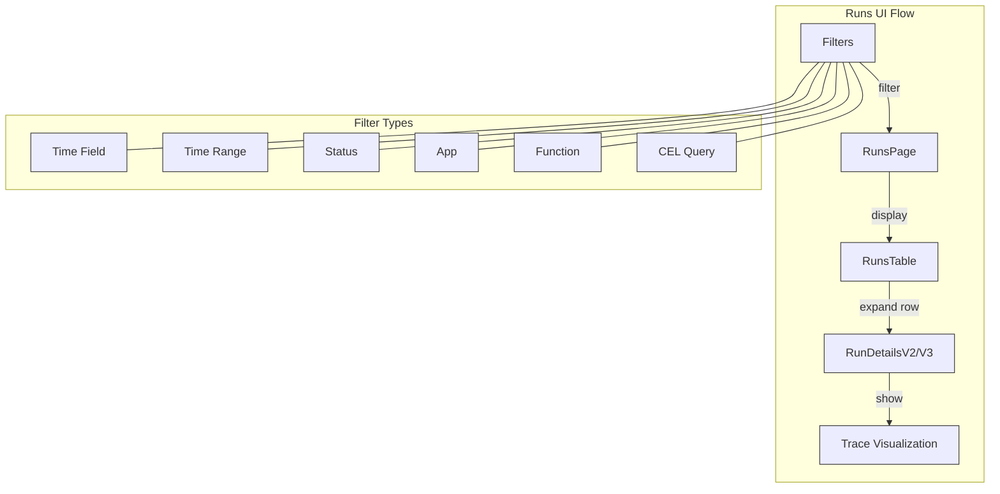

The runs section provides:
- Tabular view of function runs with filtering
- Expandable rows showing detailed execution information
- Timeline visualization of function execution
- Step-by-step execution details
- Advanced search with CEL query support

Sources:
- [ui/packages/components/src/RunsPage/RunsPage.tsx](ui/packages/components/src/RunsPage/RunsPage.tsx)
- [ui/packages/components/src/RunsPage/RunsTable.tsx](ui/packages/components/src/RunsPage/RunsTable.tsx)
- [ui/apps/dashboard/src/app/(organization-active)/(dashboard)/env/[environmentSlug]/functions/[slug]/runs/page.tsx](ui/apps/dashboard/src/app/(organization-active)/(dashboard)/env/[environmentSlug]/functions/[slug]/runs/page.tsx)

### 3. Apps Management Workflow

The apps management workflow allows users to view and manage applications connected to Inngest.

```mermaid
flowchart TD
    subgraph "Apps Management Workflow"
        appsList["Apps List"]
        appDetails["App Details"]
        syncInfo["Sync Information"]
        functionsList["App Functions"]
        syncAction["Resync App"]
    end
    
    appsList -->|"select app"| appDetails
    appDetails --> syncInfo
    appDetails --> functionsList
    appDetails -->|"action"| syncAction
    
    subgraph "App Data"
        metadata["App Metadata"]
        framework["Framework"]
        language["SDK Language"]
        platform["Platform"]
        version["SDK Version"]
        commit["Commit Information"]
    end
    
    appDetails --> metadata
    metadata --> framework
    metadata --> language
    metadata --> platform
    metadata --> version
    metadata --> commit
    
    classDef appflow stroke:#333,stroke-width:1px;
    class appsList,appDetails,syncInfo,functionsList,syncAction,metadata,framework,language,platform,version,commit appflow;
```

The apps management workflow provides:
- List view of all applications
- Detailed view of individual applications
- Sync information and status
- Functions associated with each application
- App metadata (framework, language, platform)
- Actions for resyncing applications

Sources:
- [ui/apps/dashboard/src/app/(organization-active)/(dashboard)/env/[environmentSlug]/apps/useApps.ts:65-123](ui/apps/dashboard/src/app/(organization-active)/(dashboard)/env/[environmentSlug]/apps/useApps.ts:65-123)
- [ui/apps/dashboard/src/app/(organization-active)/(dashboard)/env/[environmentSlug]/apps/[externalID]/useApp.ts:56-92](ui/apps/dashboard/src/app/(organization-active)/(dashboard)/env/[environmentSlug]/apps/[externalID]/useApp.ts:56-92)
- [ui/apps/dashboard/src/components/Onboarding/data.tsx:17-31](ui/apps/dashboard/src/components/Onboarding/data.tsx:17-31)

### 4. Billing and Account Management

The billing section provides comprehensive account management including plan selection, addon configuration, and usage monitoring through a self-service interface.

**Billing Management System**

```mermaid
flowchart TB
    subgraph "Billing Pages"
        BillingOverviewPage["Billing Overview Page
        - Current plan display
        - Usage limit bars
        - Next invoice information"]
        EntitlementListItem["EntitlementListItem
        - Individual addon management
        - Self-service controls"]
        LimitBar["LimitBar component
        - Usage visualization
        - Overage indicators"]
    end
    
    subgraph "Addon Management"
        EntitlementListItemSelfService["EntitlementListItemSelfService
        - Numeric addon controls
        - Pricing calculations"]
        AdvancedObservabilityModal["AdvancedObservabilityModal
        - Log retention addon
        - Metrics granularity/freshness"]
        SlackChannelModal["SlackChannelModal
        - Dedicated Slack channel addon
        - Enable/disable functionality"]
        CounterInput["CounterInput component
        - Numeric input with +/- controls
        - Validation & constraints"]
    end
    
    subgraph "Data Sources"
        entitlementUsage["entitlementUsage function
        - EntitlementUsageDocument query
        - Account addon status"]
        currentPlan["currentPlan function
        - GetCurrentPlanDocument query
        - Billing plan details"]
        UpdateAccountAddonQuantityDocument["UpdateAccountAddonQuantityDocument
        - Addon purchase mutations"]
    end
    
    BillingOverviewPage --> EntitlementListItem
    BillingOverviewPage --> LimitBar
    EntitlementListItem --> EntitlementListItemSelfService
    EntitlementListItemSelfService --> AdvancedObservabilityModal
    EntitlementListItemSelfService --> SlackChannelModal
    EntitlementListItemSelfService --> CounterInput
    
    BillingOverviewPage --> entitlementUsage
    BillingOverviewPage --> currentPlan
    EntitlementListItemSelfService --> UpdateAccountAddonQuantityDocument
```

The billing system includes:
- **Usage visualization** with `LimitBar` components showing runs, steps, and concurrency limits
- **Self-service addon management** for concurrency, users, advanced observability, and Slack channels
- **Real-time pricing calculations** with immediate payment processing
- **Plan comparison** and upgrade recommendations based on usage patterns

Sources:
- [ui/apps/dashboard/src/app/(organization-active)/(dashboard)/billing/(overview)/page.tsx:28-295]()
- [ui/apps/dashboard/src/components/Billing/data.tsx:109-125]()
- [ui/apps/dashboard/src/components/Billing/Addons/EntitlementListItemSelfService.tsx:25-205]()
- [ui/apps/dashboard/src/components/Billing/Addons/AdvancedObservabilityModal.tsx:19-190]()
- [ui/packages/components/src/Forms/CounterInput.tsx:18-114]()

## URL Routing System

The dashboard uses a consistent URL routing scheme for navigation between different sections.

```mermaid
flowchart LR
    subgraph "URL Structure"
        root["/"]
        env["/env/:environmentSlug"]
        apps["/env/:environmentSlug/apps"]
        app["/env/:environmentSlug/apps/:externalAppID"]
        functions["/env/:environmentSlug/functions"]
        function["/env/:environmentSlug/functions/:functionSlug"]
        functionDashboard["/env/:environmentSlug/functions/:functionSlug"]
        functionRuns["/env/:environmentSlug/functions/:functionSlug/runs"]
        functionReplay["/env/:environmentSlug/functions/:functionSlug/replay"]
        functionCancellations["/env/:environmentSlug/functions/:functionSlug/cancellations"]
        events["/env/:environmentSlug/events"]
        event["/env/:environmentSlug/events/:eventName"]
        runs["/env/:environmentSlug/runs"]
        run["/env/:environmentSlug/runs/:runID"]
        billing["/billing/:tab?"]
        settings["/settings/:section?"]
    end
    
    root -->|"select env"| env
    env -->|"apps"| apps
    env -->|"functions"| functions
    env -->|"events"| events
    env -->|"runs"| runs
    
    apps -->|"select app"| app
    functions -->|"select function"| function
    function -->|"dashboard"| functionDashboard
    function -->|"runs"| functionRuns
    function -->|"replay"| functionReplay
    function -->|"cancellations"| functionCancellations
    events -->|"select event"| event
    runs -->|"select run"| run
    
    root -->|"billing"| billing
    root -->|"settings"| settings
    
    classDef urlnode stroke:#333,stroke-width:1px;
    class root,env,apps,app,functions,function,functionDashboard,functionRuns,functionReplay,functionCancellations,events,event,runs,run,billing,settings urlnode;
```

The URL system uses a consistent pattern with:
- Environment-specific routes nested under `/env/:envSlug`
- Resource-specific routes organized by type (apps, functions, events, runs)
- Function-specific routes with tabs (dashboard, runs, replay, cancellations)
- Individual resource routes with unique identifiers
- Account-wide routes for billing and settings

Sources:
- [ui/apps/dashboard/src/app/(organization-active)/(dashboard)/env/[environmentSlug]/functions/[slug]/layout.tsx:115-156](ui/apps/dashboard/src/app/(organization-active)/(dashboard)/env/[environmentSlug]/functions/[slug]/layout.tsx:115-156)
- [ui/apps/dashboard/src/app/(organization-active)/(dashboard)/env/[environmentSlug]/functions/[slug]/(dashboard)/page.tsx:90-91](ui/apps/dashboard/src/app/(organization-active)/(dashboard)/env/[environmentSlug]/functions/[slug]/(dashboard)/page.tsx:90-91)

## Technology Stack

The dashboard is built on a modern web technology stack with emphasis on type safety, performance, and developer productivity through automated tooling and comprehensive testing.

**Core Technology Stack**

| Category | Technology | Version | Purpose |
|----------|------------|---------|---------|
| **Runtime** | Node.js | 22.16.0 | JavaScript runtime environment |
| **Package Manager** | pnpm | 8.15.8 | Workspace management and dependency resolution |
| **Framework** | Next.js | 14.x | React-based full-stack framework |
| **Language** | TypeScript | 5.x | Type-safe JavaScript development |
| **UI Library** | React | 18.x | Component-based UI framework |
| **Styling** | Tailwind CSS | 3.x | Utility-first CSS framework |

**Key Dependencies and Libraries**

```mermaid
graph TB
    subgraph "Core Framework"
        NextJS["Next.js 14
        - App Router
        - Server Components
        - API Routes"]
        React["React 18
        - Concurrent features
        - Suspense boundaries"]
        TypeScript["TypeScript 5.x
        - Strict type checking
        - Generated GraphQL types"]
    end
    
    subgraph "Data Layer" 
        urql["urql GraphQL Client
        - Caching & normalization
        - Type-safe operations"]
        TanStackQuery["@tanstack/react-query
        - Additional caching layer
        - Background updates"]
        GraphQLCodegen["@graphql-codegen
        - Type generation
        - Query documents"]
    end
    
    subgraph "UI Components"
        RemixIcon["@remixicon/react
        - Icon system"]
        TailwindCSS["Tailwind CSS
        - Design system
        - Component styling"]
        Sonner["sonner
        - Toast notifications"]
    end
    
    NextJS --> React
    NextJS --> TypeScript
    React --> urql
    React --> TanStackQuery
    urql --> GraphQLCodegen
    React --> RemixIcon
    React --> TailwindCSS
    React --> Sonner
```

Development and build tools:
- **Version Management**: Specified in `.tool-versions` for consistent development environments
- **Monorepo Structure**: pnpm workspaces for shared component libraries
- **Type Generation**: Automated GraphQL schema-to-TypeScript conversion
- **Code Quality**: ESLint, Prettier for consistent code formatting

Sources:
- [.tool-versions:7-8]()
- [ui/apps/dashboard/src/gql/graphql.ts:1-3]()
- [ui/apps/dashboard/src/app/(organization-active)/(dashboard)/env/[environmentSlug]/functions/[slug]/layout.tsx:8]()
- [ui/apps/dashboard/src/components/Billing/Addons/EntitlementListItemSelfService.tsx:8]()

## Summary

The Inngest Dashboard UI provides a comprehensive system for monitoring, visualizing, and managing functions, events, and applications. Built with modern web technologies and following best practices in component design, the UI delivers a consistent and intuitive experience for developers using the Inngest platform.

Key aspects of the UI architecture include:
- Component-based design with a shared component library
- Consistent design system with theming support
- URL-based state management for shareable views
- GraphQL integration for type-safe data fetching
- Advanced visualization components for monitoring function execution
- Quick search and navigation features for efficient workflows

The UI seamlessly integrates with the rest of the Inngest platform to provide a complete developer experience for working with event-driven functions.

# Dashboard Architecture and GraphQL API


This document describes the architecture of the Inngest Dashboard and its GraphQL API, which provides the user interface for monitoring and managing Inngest functions, events, runs, and other platform resources. The dashboard is a Next.js application that communicates with Inngest's backend services via GraphQL APIs.

## Overview

The Inngest Dashboard provides a web interface for monitoring and managing Inngest functions, events, runs, and platform resources. The system consists of two main UI applications and a GraphQL API backend that serves data to these frontends.

System Architecture Overview

```mermaid
flowchart TD
    subgraph "Frontend Applications"
        Dashboard["dashboard (Production UI)"]
        DevServerUI["dev-server-ui (Local Development)"]
    end
    
    subgraph "Shared UI Components"
        Components["@inngest/components"]
        TSConfig["@inngest/tsconfig"]
    end
    
    subgraph "GraphQL API Backend"
        CoreAPI["pkg/coreapi"]
        Generated["generated.go"]
        Resolvers["graph/resolvers"]
        Models["graph/models"]
        Schema["gql.schema.graphql"]
    end
    
    subgraph "Data Layer"
        CQRS["pkg/cqrs"]
        HistoryReader["pkg/history_reader"]
        Execution["pkg/execution"]
    end
    
    Dashboard --> Components
    DevServerUI --> Components
    
    Dashboard --> CoreAPI
    DevServerUI --> CoreAPI
    
    CoreAPI --> Generated
    CoreAPI --> Resolvers
    CoreAPI --> Models
    Schema --> Generated
    
    Resolvers --> CQRS
    Resolvers --> HistoryReader
    Resolvers --> Execution
```

Sources:
- [ui/apps/dashboard/src/gql/graphql.ts:1-8]()
- [ui/apps/dev-server-ui/src/store/generated.ts:1-3]()
- [pkg/coreapi/generated/generated.go:1-27]()
- [pkg/coreapi/gql.schema.graphql:1-31]()

## Architecture Overview

### File Structure

The dashboard follows a monorepo structure with the main dashboard application and shared component library organized as follows:

```mermaid
flowchart TD
    Root["ui/"]
    Apps["apps/"]
    Packages["packages/"]
    
    Dashboard["dashboard/"]
    DevServerUI["dev-server-ui/"]
    
    Components["components/"]
    TSConfig["tsconfig/"]
    
    Root --> Apps
    Root --> Packages
    
    Apps --> Dashboard
    Apps --> DevServerUI
    
    Packages --> Components
    Packages --> TSConfig
    
    Dashboard --> DashboardSrc["src/"]
    DashboardSrc --> AppDir["app/ (Next.js App Router)"]
    DashboardSrc --> DashboardComponents["components/"]
    DashboardSrc --> DashboardUtils["utils/"]
    DashboardSrc --> DashboardQueries["queries/"]
    DashboardSrc --> GQL["gql/ (Generated GraphQL Types)"]
    
    Components --> ComponentsSrc["src/"]
    ComponentsSrc --> UIComponents["UI Components"]
    ComponentsSrc --> Icons["Icons"]
    ComponentsSrc --> Hooks["Hooks"]
    ComponentsSrc --> Utils["Utilities"]
```

Sources:
- [ui/package.json:20-23](ui/package.json:20-23)
- [ui/apps/dashboard/package.json:29-73](ui/apps/dashboard/package.json:29-73)
- [ui/packages/components/package.json:3-9](ui/packages/components/package.json:3-9)

### Technology Stack

The dashboard applications are built using the following technologies:

| Category | Technologies |
|----------|-------------|
| Framework | Next.js (App Router) |
| UI Library | React 18 |
| Styling | TailwindCSS, CSS Variables |
| Data Fetching | GraphQL, urql, TanStack React Query |
| GraphQL Backend | gqlgen (Go), GraphQL schema |
| Component Libraries | Radix UI, @inngest/components |
| Authentication | Clerk |
| State Management | React Context, hooks |
| Charts & Visualization | Recharts |
| Code Editor | Monaco Editor |
| Build Tools | TypeScript, ESLint, Prettier |

GraphQL Type Generation Flow

```mermaid
flowchart LR
    Schema["pkg/coreapi/gql.schema.graphql"] --> GQLGen["gqlgen.yml"]
    GQLGen --> BackendTypes["pkg/coreapi/generated/generated.go"]
    GQLGen --> BackendModels["pkg/coreapi/graph/models/models_gen.go"]
    
    Schema --> Codegen["GraphQL Code Generator"]
    Codegen --> FrontendTypes["ui/apps/dashboard/src/gql/graphql.ts"]
    Codegen --> DevServerTypes["ui/apps/dev-server-ui/src/store/generated.ts"]
```

Sources:
- [ui/apps/dashboard/src/gql/graphql.ts:1-36]()
- [ui/apps/dev-server-ui/src/store/generated.ts:1-23]()
- [pkg/coreapi/generated/generated.go:31-38]()
- [pkg/coreapi/gqlgen.yml:1-20]()

## Dashboard Architecture

### Component Architecture

The dashboard is organized around a core layout with reusable components for common UI patterns. It uses Next.js App Router for routing and organization.

```mermaid
flowchart TD
    subgraph "Layout Structure"
        RootLayout["RootLayout"] --> ClerkProvider["ClerkProvider"]
        ClerkProvider --> AppRoot["AppRoot"]
        AppRoot --> SideBar["SideBar Component"]
        AppRoot --> MainContent["Main Content Area"]
        
        SideBar --> Logo["Logo Component"]
        SideBar --> Navigation["Navigation Component"]
        SideBar --> Profile["Profile Component"]
        SideBar --> QuickSearch["QuickSearch Component"]
        SideBar --> Help["Help Component"]
        
        Navigation --> Environments["Environment Selector"]
        Navigation --> KeysMenu["Keys Menu"]
        Navigation --> Monitor["Monitor Menu"]
        Navigation --> Manage["Manage Menu"]
        
        MainContent --> PageHeaders["Page Headers"]
        MainContent --> PageContent["Page Content"]
        MainContent --> BillingBanner["Billing Banner"]
        MainContent --> ArchivedBanner["Archived Resource Banner"]
    end
```

Sources:
- [ui/apps/dashboard/src/app/(organization-active)/(dashboard)/env/[environmentSlug]/functions/[slug]/layout.tsx:36-143](ui/apps/dashboard/src/app/(organization-active)/(dashboard)/env/[environmentSlug]/functions/[slug]/layout.tsx:36-143)
- [ui/apps/dashboard/src/app/(organization-active)/(dashboard)/env/[environmentSlug]/functions/[slug]/(dashboard)/page.tsx:34-60](ui/apps/dashboard/src/app/(organization-active)/(dashboard)/env/[environmentSlug]/functions/[slug]/(dashboard)/page.tsx:34-60)

### Key Components

#### 1. Function Dashboard Page

The Function Dashboard page is a key component that displays metrics and information about a specific function. It uses various charts and components to visualize function performance.

```typescript
// Function Dashboard Page Structure
FunctionDashboardPage
  ├── TimeRangeFilter (for selecting time period)
  ├── FunctionRunsChart (displays completed/failed/canceled runs)
  ├── FunctionThroughputChart (displays function throughput)
  ├── FunctionRateLimitChart (displays rate limit hits)
  ├── SDKRequestThroughputChart (displays SDK request metrics)
  ├── StepBacklogChart (displays step backlog)
  ├── StepsRunningChart (displays running steps)
  ├── LatestFailedFunctionRuns (displays recent failures)
  └── FunctionConfiguration (displays function configuration)
```

Sources:
- [ui/apps/dashboard/src/app/(organization-active)/(dashboard)/env/[environmentSlug]/functions/[slug]/(dashboard)/page.tsx:34-60](ui/apps/dashboard/src/app/(organization-active)/(dashboard)/env/[environmentSlug]/functions/[slug]/(dashboard)/page.tsx:34-60)

#### 2. Function Layout

The Function Layout component serves as the wrapper for function-specific pages, providing context and actions for the function.

```typescript
// Function Layout Component Structure
FunctionLayout
  ├── Header
  │   ├── Function Name
  │   ├── Function Status (Paused/Active)
  │   └── Actions Menu
  │       ├── Invoke Function
  │       ├── Pause/Unpause Function
  │       ├── Cancel Function Runs
  │       └── Create Replay
  ├── ArchivedAppBanner (if app is archived)
  ├── ArchivedFuncBanner (if function is archived)
  └── Page Content (children)
```

Sources:
- [ui/apps/dashboard/src/app/(organization-active)/(dashboard)/env/[environmentSlug]/functions/[slug]/layout.tsx:36-143](ui/apps/dashboard/src/app/(organization-active)/(dashboard)/env/[environmentSlug]/functions/[slug]/layout.tsx:36-143)

#### 3. CodeBlock Component

The CodeBlock component is a key UI element used throughout the dashboard for displaying code, JSON data, and other formatted content.

```mermaid
classDiagram
    class CodeBlock {
        +className?: string
        +header?: {title?: string, status?: string}
        +tab: {content: string, readOnly?: boolean, language?: string, handleChange?: function}
        +actions?: CodeBlockAction[]
        +minLines?: number
        +allowFullScreen?: boolean
        +resize?: boolean
        +alwaysFullHeight?: boolean
        +loading?: boolean
        +render()
    }
    
    class CodeBlockAction {
        +label: string
        +title?: string
        +icon?: ReactNode
        +onClick: function
        +disabled?: boolean
    }
    
    class Editor {
        +value: string
        +language: string
        +readOnly: boolean
        +onChange: function
        +onMount: function
        +theme: string
        +options: EditorOptions
    }
    
    CodeBlock --> CodeBlockAction: uses
    CodeBlock --> Editor: uses
```

Sources:
- [ui/packages/components/src/CodeBlock/CodeBlock.tsx:43-72](ui/packages/components/src/CodeBlock/CodeBlock.tsx:43-72)
- [ui/packages/components/src/CodeBlock/CodeBlock.tsx:35-41](ui/packages/components/src/CodeBlock/CodeBlock.tsx:35-41)

#### 4. Data Flow for Function Queries

The dashboard uses a combination of GraphQL and React Query to fetch and manage function data.

```mermaid
sequenceDiagram
    participant Component as "React Component"
    participant Hook as "useFunction Hook"
    participant GraphQL as "GraphQL Client"
    participant API as "GraphQL API"
    participant Resolver as "Function Resolver"
    participant CQRS as "CQRS Data Store"
    
    Component->>Hook: Call useFunction({functionSlug})
    Hook->>GraphQL: Execute GetFunction query
    GraphQL->>API: HTTP POST with GraphQL query
    API->>Resolver: Invoke resolver
    Resolver->>CQRS: Get function by slug
    CQRS->>Resolver: Return function data
    Resolver->>API: Return resolved data
    API->>GraphQL: Return GraphQL response
    GraphQL->>Hook: Update query result
    Hook->>Component: Return {data, error, fetching}
```

Sources:
- [ui/apps/dashboard/src/queries/functions.ts:89-117](ui/apps/dashboard/src/queries/functions.ts:89-117)
- [pkg/coreapi/graph/resolvers/function.go](pkg/coreapi/graph/resolvers/function.go)

### URL Structure and Routing

The dashboard uses Next.js App Router with a consistent URL pattern that reflects the hierarchical nature of the resources.

```mermaid
flowchart TD
    subgraph "URL Structure"
        Root["/"]
        EnvRoot["/env/{environmentSlug}"]
        
        Functions["/env/{environmentSlug}/functions"]
        Function["/env/{environmentSlug}/functions/{slug}"]
        FunctionDashboard["/env/{environmentSlug}/functions/{slug}/dashboard"]
        FunctionRuns["/env/{environmentSlug}/functions/{slug}/runs"]
        
        Apps["/env/{environmentSlug}/apps"]
        App["/env/{environmentSlug}/apps/{externalID}"]
        
        Events["/env/{environmentSlug}/events"]
        EventType["/env/{environmentSlug}/events/{name}"]
        
        Runs["/env/{environmentSlug}/runs"]
        Run["/env/{environmentSlug}/runs/{id}"]
        
        Keys["/env/{environmentSlug}/keys"]
        SigningKeys["/env/{environmentSlug}/signing-keys"]
        
        Root --> EnvRoot
        EnvRoot --> Functions
        EnvRoot --> Apps
        EnvRoot --> Events
        EnvRoot --> Runs
        EnvRoot --> Keys
        EnvRoot --> SigningKeys
        
        Functions --> Function
        Function --> FunctionDashboard
        Function --> FunctionRuns
        
        Apps --> App
        Events --> EventType
        Runs --> Run
    end
```

Sources:
- [ui/apps/dashboard/src/app/(organization-active)/(dashboard)/env/[environmentSlug]/functions/[slug]/(dashboard)/page.tsx](ui/apps/dashboard/src/app/(organization-active)/(dashboard)/env/[environmentSlug]/functions/[slug]/(dashboard)/page.tsx)
- [ui/apps/dashboard/src/app/(organization-active)/(dashboard)/env/[environmentSlug]/apps/[externalID]/useApp.ts](ui/apps/dashboard/src/app/(organization-active)/(dashboard)/env/[environmentSlug]/apps/[externalID]/useApp.ts)

#### Environment Context

The dashboard dynamically updates its context based on the selected environment. The environment slug becomes part of the URL pattern and influences the data displayed throughout the interface.

Environment types include:
- Production environment (`EnvironmentType.Production`)
- Test environments (`EnvironmentType.Test`)
- Branch environments (`EnvironmentType.BranchParent` and `EnvironmentType.BranchChild`)

```typescript
// Environment types from GraphQL schema
export enum EnvironmentType {
  BranchChild = 'BRANCH_CHILD',
  BranchParent = 'BRANCH_PARENT',
  Production = 'PRODUCTION',
  Test = 'TEST'
}
```

Sources:
- [ui/apps/dashboard/src/gql/graphql.ts:662-666](ui/apps/dashboard/src/gql/graphql.ts:662-666)
- [ui/apps/dashboard/src/app/(organization-active)/(dashboard)/env/[environmentSlug]/apps/useApps.ts:1-27](ui/apps/dashboard/src/app/(organization-active)/(dashboard)/env/[environmentSlug]/apps/useApps.ts:1-27)

## GraphQL API Architecture

The Inngest platform provides two GraphQL APIs: one for the production dashboard and one for the development server. Both use gqlgen to generate Go code from GraphQL schemas.

### Schema Definition and Code Generation

GraphQL Schema to Generated Code Flow

```mermaid
flowchart TD
    subgraph "Schema Definition"
        MainSchema["pkg/coreapi/gql.schema.graphql"]
        QuerySchema["pkg/coreapi/gql.query.graphql"]
        MutationSchema["pkg/coreapi/gql.mutation.graphql"]
        Config["pkg/coreapi/gqlgen.yml"]
    end
    
    subgraph "Generated Go Code"
        Generated["pkg/coreapi/generated/generated.go"]
        Models["pkg/coreapi/graph/models/models_gen.go"]
        ResolverInterfaces["ResolverRoot interface"]
    end
    
    subgraph "Implementation"
        ResolverImpl["pkg/coreapi/graph/resolvers/resolver.go"]
        QueryResolvers["Query resolvers"]
        MutationResolvers["Mutation resolvers"]
        TypeResolvers["Type resolvers"]
    end
    
    subgraph "Generated TypeScript"
        DashboardTypes["ui/apps/dashboard/src/gql/graphql.ts"]
        DevServerTypes["ui/apps/dev-server-ui/src/store/generated.ts"]
    end
    
    MainSchema --> Config
    QuerySchema --> Config
    MutationSchema --> Config
    Config --> Generated
    Config --> Models
    Generated --> ResolverInterfaces
    
    ResolverInterfaces --> ResolverImpl
    ResolverImpl --> QueryResolvers
    ResolverImpl --> MutationResolvers
    ResolverImpl --> TypeResolvers
    
    MainSchema --> DashboardTypes
    MainSchema --> DevServerTypes
```

### Core GraphQL Types

The GraphQL schema defines several key entity types that represent the Inngest platform's core concepts:

| Type | Description | Key Fields |
|------|-------------|------------|
| `Account` | User account with billing and entitlements | `id`, `plan`, `entitlements`, `paymentMethods` |
| `App` | Application registered with Inngest | `externalID`, `name`, `method`, `functions` |
| `Function`/`Workflow` | Function definition | `slug`, `name`, `triggers`, `configuration` |
| `FunctionRun`/`FunctionRunV2` | Function execution instance | `id`, `status`, `startedAt`, `endedAt`, `trace` |
| `Event`/`EventV2` | Event that triggers functions | `name`, `receivedAt`, `runs`, `raw` |
| `RunTraceSpan` | Execution trace span | `spanID`, `name`, `status`, `childrenSpans` |

Sources:
- [pkg/coreapi/gql.schema.graphql:1-31]()
- [pkg/coreapi/gql.query.graphql:1-21]()
- [ui/apps/dashboard/src/gql/graphql.ts:49-132]()
- [pkg/coreapi/graph/models/models_gen.go:17-24]()

### Key GraphQL Types

The GraphQL schema defines several key types that represent the core entities in the Inngest system:

| Type | Description |
|------|-------------|
| `App` | Represents an application registered with Inngest |
| `Function` | Represents a workflow function definition |
| `FunctionRun` | Represents a single execution of a function |
| `FunctionRunV2` | Enhanced version of function run with additional metadata |
| `Event` | Represents an event that triggered functions |
| `EventV2` | Enhanced version of event with additional metadata |
| `RunTraceSpan` | Represents a span in a function run trace |

Sources:
- [pkg/coreapi/gql.schema.graphql:152-172](pkg/coreapi/gql.schema.graphql:152-172)
- [pkg/coreapi/gql.schema.graphql:174-186](pkg/coreapi/gql.schema.graphql:174-186)
- [pkg/coreapi/graph/models/models_gen.go:17-23](pkg/coreapi/graph/models/models_gen.go:17-23)

### GraphQL Resolvers Implementation

The GraphQL API is implemented through resolvers that handle queries, mutations, and type resolution. The resolvers interact with various backend services to fetch and manipulate data.

Resolver Architecture and Dependencies

```mermaid
flowchart TD
    subgraph "Generated Interfaces"
        ResolverRoot["ResolverRoot interface"]
        QueryResolver["QueryResolver interface"]
        MutationResolver["MutationResolver interface"]
        TypeResolvers["Type-specific resolvers"]
    end
    
    subgraph "Resolver Implementation"
        Resolver["Resolver struct"]
        QueryImpl["queryResolver"]
        MutationImpl["mutationResolver"]
        FunctionRunImpl["functionRunResolver"]
        FunctionRunV2Impl["functionRunV2Resolver"]
        AppImpl["appResolver"]
        EventImpl["eventResolver"]
    end
    
    subgraph "Backend Dependencies"
        Data["cqrs.Manager (Data)"]
        HistoryReader["history_reader.Reader"]
        Executor["execution.Executor"]
        Runner["execution.Runner"]
        Queue["state.Manager (Queue)"]
        TraceReader["cqrs.TraceReader"]
    end
    
    ResolverRoot --> QueryResolver
    ResolverRoot --> MutationResolver
    ResolverRoot --> TypeResolvers
    
    Resolver --> QueryImpl
    Resolver --> MutationImpl
    Resolver --> FunctionRunImpl
    Resolver --> FunctionRunV2Impl
    Resolver --> AppImpl
    Resolver --> EventImpl
    
    QueryImpl --> Data
    MutationImpl --> Executor
    FunctionRunImpl --> HistoryReader
    FunctionRunImpl --> Runner
    FunctionRunImpl --> Queue
    FunctionRunV2Impl --> TraceReader
    AppImpl --> Data
    EventImpl --> Data
```

### Key Resolver Methods

The resolvers implement specific methods that correspond to GraphQL operations:

**Query Operations:**
- `Query.functions()` - List functions with filtering
- `Query.functionBySlug()` - Get function by slug
- `Query.runs()` - List function runs with filtering  
- `Query.events()` - List events
- `Query.apps()` - List applications

**Mutation Operations:**
- `Mutation.invokeFunction()` - Trigger function execution
- `Mutation.cancelRun()` - Cancel running function
- `Mutation.rerun()` - Re-execute function run
- `Mutation.pauseFunction()` - Pause/unpause function

**Type Resolvers:**
- `FunctionRun.history()` - Resolve execution history
- `FunctionRunV2.trace()` - Resolve execution trace
- `App.functions()` - Resolve app functions
- `Event.runs()` - Resolve triggered runs

Sources:
- [pkg/coreapi/generated/generated.go:46-61]()
- [pkg/coreapi/graph/resolvers/function_run.resolver.go:26-44]()
- [pkg/coreapi/graph/resolvers/function_run_v2.resolver.go:1-8]()
- [pkg/coreapi/graph/resolvers/runs_v2.go:23-28]()

### Example: Function Run Resolution

The `FunctionRun` and `FunctionRunV2` resolvers demonstrate how the GraphQL API resolves complex nested execution data:

Function Run Data Resolution Flow

```mermaid
sequenceDiagram
    participant Client
    participant GraphQL as "GraphQL API"
    participant FunctionRunResolver as "functionRunResolver"
    participant HistoryReader as "history_reader.Reader"
    participant StateManager as "state.Manager" 
    participant TraceReader as "cqrs.TraceReader"
    participant Queue as "execution.Queue"
    
    Client->>GraphQL: "Query { runs { history trace } }"
    GraphQL->>FunctionRunResolver: "History() method"
    
    FunctionRunResolver->>HistoryReader: "GetRunHistory(runID, opts)"
    HistoryReader->>FunctionRunResolver: "[]*history_reader.RunHistory"
    
    GraphQL->>FunctionRunResolver: "PendingSteps() method"
    FunctionRunResolver->>StateManager: "Metadata(runID)"
    StateManager->>FunctionRunResolver: "state metadata"
    FunctionRunResolver->>Queue: "OutstandingJobCount(workspaceID, workflowID, runID)"
    Queue->>FunctionRunResolver: "pending count"
    
    GraphQL->>FunctionRunResolver: "Trace() method"
    FunctionRunResolver->>TraceReader: "GetSpansByRunID(runID)"
    TraceReader->>FunctionRunResolver: "*RunTraceSpan"
    
    FunctionRunResolver->>GraphQL: "Complete resolved data"
    GraphQL->>Client: "GraphQL response with nested data"
```

### Function Run Mutation Example

The mutation resolvers handle function lifecycle operations:

```mermaid
sequenceDiagram
    participant Client
    participant MutationResolver as "mutationResolver"
    participant Executor as "execution.Executor"
    participant HistoryReader as "history_reader.Reader"
    participant StateManager as "state.Manager"
    
    Client->>MutationResolver: "cancelRun(runID)"
    MutationResolver->>HistoryReader: "GetFunctionRun(runID)"
    HistoryReader->>MutationResolver: "function run data"
    
    alt "run already cancelled"
        MutationResolver->>Client: "return existing run"
    else "run active"
        MutationResolver->>Executor: "Cancel(runID, CancelRequest{})"
        Executor->>StateManager: "Update run state"
        MutationResolver->>HistoryReader: "Poll for updated run status"
        MutationResolver->>Client: "return cancelled run"
    end
```

Sources:
- [pkg/coreapi/graph/resolvers/function_run.resolver.go:54-70]()
- [pkg/coreapi/graph/resolvers/function_run.resolver.go:188-260]()
- [pkg/coreapi/graph/resolvers/function_run.resolver.go:262-357]()
- [pkg/coreapi/graph/resolvers/function_run_v2.resolver.go:1-8]()

## Dashboard Data Fetching Architecture

The dashboard applications use multiple data fetching strategies depending on the use case: GraphQL with urql for real-time data, TanStack React Query for server state management, and generated TypeScript types for type safety.

Client-Side Data Architecture

```mermaid
flowchart TD
    subgraph "React Components"
        FunctionPage["Function Dashboard Page"]
        FunctionLayout["Function Layout"]
        AppsPage["Apps Page"]
        RunsPage["Runs Page"]
    end
    
    subgraph "Custom Hooks Layer"
        UseFunction["useFunction()"]
        UseFunctionUsage["useFunctionUsage()"]
        UseApps["useApps()"]
        UseGraphQLQuery["useGraphQLQuery()"]
    end
    
    subgraph "Data Clients"
        UrqlClient["urql Client"]
        ReactQuery["TanStack Query"]
    end
    
    subgraph "Generated Types"
        GraphQLTypes["ui/apps/dashboard/src/gql/graphql.ts"]
        GQLDocuments["ui/apps/dashboard/src/gql/gql.ts"]
    end
    
    subgraph "GraphQL API"
        CoreAPI["pkg/coreapi GraphQL server"]
    end
    
    FunctionPage --> UseFunction
    FunctionLayout --> UseFunction
    AppsPage --> UseApps
    RunsPage --> UseGraphQLQuery
    
    UseFunction --> UrqlClient
    UseFunctionUsage --> ReactQuery
    UseApps --> ReactQuery
    UseGraphQLQuery --> UrqlClient
    
    UrqlClient --> GraphQLTypes
    ReactQuery --> GraphQLTypes
    UrqlClient --> GQLDocuments
    
    UrqlClient --> CoreAPI
    ReactQuery --> CoreAPI
```

### Query Patterns and Custom Hooks

The dashboard implements several query patterns for different data fetching needs:

**Real-time Queries with urql:**
```typescript
// useFunction hook pattern
export const useFunction = ({ functionSlug }: UseFunctionParams) => {
  const environment = useEnvironment();
  const [result, refetch] = useQuery({
    query: GetFunctionDocument,
    variables: { environmentID: environment.id, slug: functionSlug }
  });
  return [{ ...result, fetching: result.fetching }, refetch];
};
```

**Server State with React Query:**
```typescript
// useFunctionsPage hook pattern  
export function useFunctionsPage({ archived, search, envID, page }) {
  const res = useGraphQLQuery({
    query: GetFunctionsDocument,
    variables: { archived, search, environmentID: envID, page, pageSize: 50 }
  });
  // Transform and return paginated data
}
```

**Generated GraphQL Operations:**
The dashboard uses over 100 generated GraphQL operations including:
- `GetFunctionQuery` - Function details and configuration
- `GetFunctionRunsMetricsQuery` - Function performance metrics  
- `GetAppsQuery` - Application list with sync status
- `InvokeFunctionMutation` - Trigger function execution
- `CancelRunMutation` - Cancel running functions

Sources:
- [ui/apps/dashboard/src/queries/functions.ts:215-231]()
- [ui/apps/dashboard/src/queries/functions.ts:87-133]()
- [ui/apps/dashboard/src/gql/gql.ts:15-104]()
- [ui/apps/dashboard/src/utils/useGraphQLQuery.ts]()

## URL Structure and Routing Patterns

The dashboard uses Next.js App Router with a hierarchical URL structure that reflects the organization of Inngest resources. All routes are scoped by environment to provide proper data isolation.

Dashboard Route Hierarchy

```mermaid
flowchart TD
    Root["/"]
    
    subgraph "Environment Scoped Routes"
        EnvRoot["/env/[environmentSlug]"]
        
        Functions["/functions"]
        FunctionDetail["/functions/[slug]"]
        FunctionDashboard["/functions/[slug]/(dashboard)"]
        FunctionRuns["/functions/[slug]/runs"]
        FunctionLogs["/functions/[slug]/logs"]
        FunctionConfiguration["/functions/[slug]/configuration"]
        
        Apps["/apps"]
        AppDetail["/apps/[externalID]"]
        
        Events["/events"]
        EventType["/events/[name]"]
        
        Runs["/runs"]
        RunDetail["/runs/[id]"]
        
        Keys["/keys"]
        SigningKeys["/signing-keys"]
        
        Settings["/settings"]
    end
    
    subgraph "Global Routes"
        Billing["/billing"]
        Support["/support"]
        Integrations["/integrations"]
    end
    
    Root --> EnvRoot
    EnvRoot --> Functions
    EnvRoot --> Apps  
    EnvRoot --> Events
    EnvRoot --> Runs
    EnvRoot --> Keys
    EnvRoot --> SigningKeys
    EnvRoot --> Settings
    
    Functions --> FunctionDetail
    FunctionDetail --> FunctionDashboard
    FunctionDetail --> FunctionRuns
    FunctionDetail --> FunctionLogs
    FunctionDetail --> FunctionConfiguration
    
    Apps --> AppDetail
    Events --> EventType
    Runs --> RunDetail
    
    Root --> Billing
    Root --> Support
    Root --> Integrations
```

### Environment Context and Dynamic Routing

The dashboard dynamically updates its context based on the environment slug in the URL. This affects data queries, navigation, and resource access throughout the application.

**Environment Types:**
- `PRODUCTION` - Production environment
- `TEST` - Test environment  
- `BRANCH_PARENT` - Branch parent environment
- `BRANCH_CHILD` - Branch child environment

**Route Parameters:**
- `[environmentSlug]` - Environment identifier
- `[slug]` - Function slug (URL-encoded)
- `[externalID]` - App external ID (URL-encoded)  
- `[id]` - Run ID (ULID format)
- `[name]` - Event type name (URL-encoded)

Sources:
- [ui/apps/dashboard/src/app/(organization-active)/(dashboard)/env/[environmentSlug]/functions/[slug]/layout.tsx:28-44]()
- [ui/apps/dashboard/src/app/(organization-active)/(dashboard)/env/[environmentSlug]/functions/[slug]/(dashboard)/page.tsx:28-37]()
- [ui/apps/dashboard/src/gql/graphql.ts:687-692]()
- [ui/apps/dashboard/src/utils/urls.ts]()

## Component Communication Patterns

The dashboard uses several patterns for component communication:

1. **Props Drilling**: For direct parent-to-child communication
2. **Context API**: For sharing state across component trees
3. **Server Components**: For handling server-side data fetching
4. **Client Components**: For interactive UI elements with client-side state

## Developer Experience

### Component Library

The dashboard is built on a shared component library (`@inngest/components`) that provides consistent UI elements across the Inngest platform. This library includes buttons, form controls, modals, navigation elements, and more.

Sources:
- [ui/packages/components/package.json]()

### Storybook Integration

Components are developed and tested in isolation using Storybook, which provides a development environment for UI components.

Sources:
- [ui/apps/dashboard/package.json]()
- [ui/packages/components/package.json]()

## Deployment and Build Process

The dashboard is built using the Next.js build system and deployed as a static application. It uses Vercel for hosting and continuous deployment.

Sources:
- [ui/apps/dashboard/package.json]()

## Conclusion

The Inngest Dashboard architecture follows modern web development practices with a focus on component reusability, clean separation of concerns, and a consistent user experience. The combination of Next.js, React, GraphQL, and a shared component library enables efficient development and maintenance of the platform's user interface.

# Function Runs Monitoring and Visualization


This document covers the frontend UI system responsible for monitoring, filtering, visualizing, and searching function execution runs in the Inngest platform. The system provides both tabular views of function runs with advanced filtering capabilities and detailed individual run inspection interfaces.

For information about the execution engine that generates the run data, see [Core Execution System](#2). For details about the GraphQL API and data layer that serves this information, see [Dashboard Architecture and GraphQL API](#5.1).

## Overview

The function runs monitoring system consists of reusable UI components that display function execution data across both development and production environments. The system supports real-time polling, infinite scroll pagination, advanced CEL-based search queries, and expandable run details.

## Architecture Overview

The monitoring system is built around a central `RunsPage` component that orchestrates data fetching, filtering, and display through several specialized sub-components.

### Component Hierarchy

```mermaid
graph TB
    DevPage["dev-server-ui/runs/page.tsx<br/>Development Environment"]
    DashPage["dashboard/Runs.tsx<br/>Production Environment"]
    
    RunsPage["RunsPage Component<br/>packages/components/RunsPage.tsx"]
    
    RunsTable["RunsTable<br/>Tabular Display"]
    CodeSearch["CodeSearch<br/>CEL Query Interface"]
    RunDetails["RunDetailsV3<br/>Individual Run Inspection"]
    Filters["Filter Components<br/>Time/Status/Entity Filters"]
    
    GraphQLQueries["GraphQL Queries<br/>GetRuns/CountRuns"]
    DevServerAPI["Dev Server API<br/>Local GraphQL"]
    
    DevPage --> RunsPage
    DashPage --> RunsPage
    
    RunsPage --> RunsTable
    RunsPage --> CodeSearch
    RunsPage --> Filters
    RunsTable --> RunDetails
    
    DashPage --> GraphQLQueries
    DevPage --> DevServerAPI
```

Sources: [ui/packages/components/src/RunsPage/RunsPage.tsx:48-86](), [ui/apps/dev-server-ui/src/app/(dashboard)/runs/page.tsx:38-205](), [ui/apps/dashboard/src/components/Runs/Runs.tsx:46-231]()

### Data Flow Architecture

```mermaid
sequenceDiagram
    participant User as "User Interface"
    participant RunsPage as "RunsPage Component"
    participant Filters as "Filter Components"
    participant Query as "GraphQL Query Layer"
    participant RunsTable as "RunsTable Component"
    participant RunDetails as "RunDetailsV3 Component"
    
    User->>Filters: "Apply Status/Time/CEL Filters"
    Filters->>RunsPage: "Update URL Search Params"
    RunsPage->>Query: "Execute GetRuns/CountRuns"
    Query-->>RunsPage: "Return Runs Data + Total Count"
    RunsPage->>RunsTable: "Pass Runs Data"
    RunsTable-->>User: "Display Table with Rows"
    
    User->>RunsTable: "Click Expand Row"
    RunsTable->>RunDetails: "Render Run Details"
    RunDetails->>Query: "Fetch Additional Run Data"
    RunDetails-->>User: "Show Detailed Run Information"
    
    User->>RunsTable: "Scroll to Bottom"
    RunsTable->>RunsPage: "Trigger Infinite Scroll"
    RunsPage->>Query: "Fetch Next Page"
    Query-->>RunsTable: "Append New Rows"
```

Sources: [ui/packages/components/src/RunsPage/RunsPage.tsx:152-226](), [ui/packages/components/src/RunsPage/RunsTable.tsx:140-172](), [ui/apps/dashboard/src/components/Runs/Runs.tsx:174-193]()

## Core Components

### RunsPage Component

The `RunsPage` component serves as the primary orchestrator, managing URL search parameters, filter state, and data pagination. It provides a standardized interface that works across both development and production environments.

Key responsibilities:
- **Filter Management**: Coordinates `TimeFilter`, `RunsStatusFilter`, and `EntityFilter` components
- **Search Integration**: Manages `CodeSearch` component for CEL-based queries  
- **Data Coordination**: Handles infinite scroll pagination and refresh operations
- **Column Visibility**: Manages table column visibility state via `useLocalStorage`

The component uses `useBatchedSearchParams` for efficient URL parameter updates and `useValidatedSearchParam` hooks for type-safe parameter handling.

Sources: [ui/packages/components/src/RunsPage/RunsPage.tsx:68-411]()

### RunsTable Component

The `RunsTable` component renders function run data using React Table (`@tanstack/react-table`) with expandable rows for detailed inspection.

```mermaid
graph LR
    RunsTable["RunsTable Component"]
    Columns["useScopedColumns<br/>Column Definitions"]
    ExpandedState["expandedRunIDs<br/>Manual Row Tracking"]
    ReactTable["useReactTable<br/>Table State Management"]
    LoadingSkeleton["Loading Skeleton<br/>Placeholder Rows"]
    
    RunsTable --> Columns
    RunsTable --> ExpandedState
    RunsTable --> ReactTable
    RunsTable --> LoadingSkeleton
    
    Columns --> StatusCell["StatusCell"]
    Columns --> IDCell["IDCell"]  
    Columns --> TimeCell["TimeCell"]
    Columns --> PillCell["PillCell"]
```

Key features:
- **Manual Expansion Tracking**: Uses `expandedRunIDs` state instead of React Table's built-in expansion to prevent polling-induced row shifts
- **Loading States**: Renders skeleton placeholders during data fetching
- **Scoped Columns**: Shows different columns based on `ViewScope` ('env' vs 'fn')
- **Sub-component Rendering**: Embeds `RunDetailsV3` component in expanded rows

Sources: [ui/packages/components/src/RunsPage/RunsTable.tsx:30-191](), [ui/packages/components/src/RunsPage/columns.tsx:189-200]()

### CodeSearch Component

The `CodeSearch` component provides a Monaco editor-based interface for writing CEL (Common Expression Language) queries to filter function runs.

```mermaid
graph TB
    CodeSearch["CodeSearch Component"]
    MonacoEditor["Monaco Editor<br/>CEL Language Support"]
    CompletionProvider["CompletionItemProvider<br/>Auto-completion"]
    EventPaths["EVENT_PATH_PRESETS<br/>Query Templates"]
    
    CodeSearch --> MonacoEditor
    MonacoEditor --> CompletionProvider
    CompletionProvider --> EventPaths
    
    EventPaths --> EventData["event.data.*"]
    EventPaths --> EventMeta["event.id, event.name, event.ts"]
    EventPaths --> OutputData["output, output.*"]
    
    subgraph "CEL Features"
        Operators["Operators: ==, !=, >, <, >=, <="]
        Functions["Functions: size, exists, all, has"]
        Types["Types: int, bool, string, double"]
    end
```

Key features:
- **CEL Language Support**: Custom Monaco language definition with syntax highlighting
- **Smart Auto-completion**: Context-aware suggestions for event paths and operators
- **Error Handling**: Integration with `parseCelSearchError` for query validation
- **Preset Support**: Different completion sets for 'runs' vs 'events' contexts

Sources: [ui/packages/components/src/CodeSearch/CodeSearch.tsx:100-369](), [ui/packages/components/src/utils/monaco.ts:240-275]()

## Run Details Visualization

Individual run inspection is handled by the `RunDetailsV3` component, which can be rendered both as an expandable table row and as a standalone page.

### Integration Points

```mermaid
graph LR
    RunsTable["RunsTable<br/>Expandable Rows"]
    StandalonePage["Standalone Run Page<br/>dev-server-ui/run/page.tsx"]
    
    RunDetailsV3["RunDetailsV3 Component<br/>Run Inspection Interface"]
    
    GetTrigger["useGetTrigger Hook<br/>Trigger Data Fetching"]
    PollingSystem["Polling System<br/>Real-time Updates"]
    TracesPreview["Traces Preview<br/>Feature Flag Controlled"]
    
    RunsTable --> RunDetailsV3
    StandalonePage --> RunDetailsV3
    
    RunDetailsV3 --> GetTrigger
    RunDetailsV3 --> PollingSystem
    RunDetailsV3 --> TracesPreview
```

The component supports:
- **Embedded Mode**: Rendered within `RunsTable` expanded rows with `standalone={false}`
- **Standalone Mode**: Full-page run inspection with `standalone={true}`
- **Feature Flags**: Traces preview enabled/disabled via boolean flags
- **Real-time Polling**: Configurable poll intervals for live run updates

Sources: [ui/packages/components/src/RunsPage/RunsTable.tsx:228-244](), [ui/apps/dev-server-ui/src/app/(dashboard)/run/page.tsx:23-33]()

## Data Layer Integration

### Environment-Specific Implementations

The monitoring system adapts to different environments through specialized wrapper components:

**Development Environment** (`dev-server-ui`):
- Uses local GraphQL client via `client.request()`
- Implements `useInfiniteQuery` from React Query
- Direct API calls to development server endpoints

**Production Environment** (`dashboard`):
- Uses urql GraphQL client with `useQuery` hooks
- Implements manual cursor-based pagination
- Integration with account features and environment context

### Query Structure

```mermaid
graph LR
    CommonVars["Common Query Variables<br/>timeField, status, celQuery"]
    
    GetRunsQuery["GetRuns Query<br/>Paginated Run Data"]
    CountRunsQuery["CountRuns Query<br/>Total Count"]
    AppFilterQuery["AppFilter Query<br/>Filter Options"]
    
    RunsData["Runs Data<br/>edges, pageInfo"]
    ParsedRuns["parseRunsData()<br/>Duration Calculation"]
    
    CommonVars --> GetRunsQuery
    CommonVars --> CountRunsQuery
    
    GetRunsQuery --> RunsData
    RunsData --> ParsedRuns
    ParsedRuns --> RunsPage["RunsPage Display"]
```

Query variables include:
- **Filtering**: `appIDs`, `status`, `timeField`, `celQuery`
- **Pagination**: `functionRunCursor` for cursor-based pagination
- **Time Range**: `startTime`, `endTime` for temporal filtering
- **Scoping**: `functionSlug` for function-specific views

Sources: [ui/apps/dashboard/src/components/Runs/queries.ts:3-89](), [ui/apps/dev-server-ui/src/app/(dashboard)/runs/page.tsx:67-98](), [ui/apps/dashboard/src/components/Runs/Runs.tsx:94-149]()

## Search and Filtering System

### Filter Architecture

The system provides multiple filtering mechanisms that work together through URL search parameter synchronization:

```mermaid
graph TB
    URLParams["URL Search Parameters<br/>Centralized State"]
    
    TimeFilter["TimeFilter<br/>Relative/Absolute Time"]
    StatusFilter["RunsStatusFilter<br/>Status Selection"]
    EntityFilter["EntityFilter<br/>App/Function Selection"]
    CELSearch["CodeSearch<br/>CEL Query Filter"]
    
    TimeFieldFilter["TimeFieldFilter<br/>queuedAt/startedAt/endedAt"]
    
    URLParams --> TimeFilter
    URLParams --> StatusFilter
    URLParams --> EntityFilter
    URLParams --> CELSearch
    URLParams --> TimeFieldFilter
    
    subgraph "Search Parameter Hooks"
        useSearchParam["useSearchParam"]
        useValidatedSearchParam["useValidatedSearchParam"]
        useStringArraySearchParam["useStringArraySearchParam"]
        useBatchedSearchParams["useBatchedSearchParams"]
    end
```

### CEL Query System

The Common Expression Language (CEL) search provides powerful filtering capabilities:

**Supported Query Patterns**:
- Event data filtering: `event.data.userId == "1234"`
- Output filtering: `output.count > 10`
- Metadata filtering: `event.name == "user.created"`
- Combined expressions: `event.data.status == "active" && output.success`

**Auto-completion Features**:
- Context-aware path suggestions (`event.data.`, `output.`)
- Operator suggestions based on field types
- Built-in function support (`size()`, `exists()`, `has()`)

Sources: [ui/packages/components/src/CodeSearch/CodeSearch.tsx:31-94](), [ui/packages/components/src/RunsPage/RunsPage.tsx:127-226]()

## Column Management System

### Scoped Column Display

The `useScopedColumns` hook adapts table columns based on viewing context:

```mermaid
graph LR
    ViewScope["ViewScope Type<br/>'env' | 'fn'"]
    
    EnvironmentView["Environment View<br/>Shows All Columns"]
    FunctionView["Function View<br/>Hides App/Function Columns"]
    
    AllColumns["All Column Definitions<br/>status, id, trigger, function, app, times"]
    FilteredColumns["Filtered Columns<br/>Removes Redundant Data"]
    
    ViewScope --> EnvironmentView
    ViewScope --> FunctionView
    
    EnvironmentView --> AllColumns
    FunctionView --> FilteredColumns
```

**Column Types**:
- **StatusCell**: Function run status with visual indicators
- **IDCell**: Truncated run identifiers with copy functionality
- **TimeCell**: Formatted timestamps with relative time display  
- **PillCell**: Event triggers and cron schedules
- **TextCell**: Function names, app names, durations
- **AICell**: Special indicator for AI-enabled functions

**Visibility Management**:
- Per-scope localStorage persistence via `useLocalStorage`
- Dynamic show/hide via `TableFilter` component
- Default visibility controlled by `defaultVisibleColumns` prop

Sources: [ui/packages/components/src/RunsPage/columns.tsx:34-200](), [ui/packages/components/src/RunsPage/RunsPage.tsx:91-116]()

# UI Architecture and Component System


This document covers the frontend monorepo architecture, shared component library, and theming system that powers Inngest's user interfaces. It details the structure of the workspace, component design patterns, and how the shared design system is consumed by multiple applications.

For information about the specific function monitoring interfaces, see [Function Runs Monitoring and Visualization](#5.2). For backend API integration patterns, see [Dashboard Architecture and GraphQL API](#5.1).

## Monorepo Structure and Workspace Organization

The UI codebase is organized as a pnpm workspace monorepo with a clear separation between applications and shared packages.

```mermaid
graph TB
    subgraph "ui/"
        subgraph "apps/"
            Dashboard["@inngest/dashboard<br/>Production Dashboard"]
            DevUI["@inngest/dev-server-ui<br/>Development Interface"]
        end
        
        subgraph "packages/"
            Components["@inngest/components<br/>Shared Component Library"]
            TSConfig["@inngest/tsconfig<br/>TypeScript Configurations"]
        end
        
        RootPkg["package.json<br/>Workspace Root"]
        PnpmLock["pnpm-lock.yaml<br/>Dependency Lock"]
    end
    
    Dashboard --> Components
    DevUI --> Components
    Dashboard --> TSConfig
    DevUI --> TSConfig
    Components --> TSConfig
    
    RootPkg --> Dashboard
    RootPkg --> DevUI
    RootPkg --> Components
```

**Workspace Configuration**

The workspace is defined at the root level with workspaces targeting `packages/*` and `apps/*` directories. Each application and package maintains its own `package.json` with workspace dependencies using the `workspace:*` protocol.

Sources: [ui/package.json:21-24](), [ui/apps/dashboard/package.json:32](), [ui/apps/dev-server-ui/package.json:27](), [ui/packages/components/package.json:1-84]()

## Component Library Architecture

The `@inngest/components` package serves as the central design system, providing reusable UI primitives and complex components to both applications.

```mermaid
graph TB
    subgraph "Component Library Structure"
        subgraph "Core Systems"
            DesignTokens["Design Tokens<br/>globals.css"]
            TailwindConfig["Tailwind Configuration<br/>tailwind.config.ts"]
            ThemeSystem["Theme System<br/>Light/Dark Mode"]
        end
        
        subgraph "UI Primitives"
            RadixComponents["Radix UI Primitives<br/>Tooltip, Dialog, etc."]
            BasicComponents["Basic Components<br/>Button, Pill, etc."]
        end
        
        subgraph "Complex Components"
            CodeBlock["CodeBlock<br/>Monaco Editor Integration"]
            DataDisplay["Data Display<br/>Tables, Charts"]
            Layout["Layout Components<br/>Navigation, Containers"]
        end
        
        subgraph "Utilities"
            ClassNames["cn() Utility<br/>Conditional Classes"]
            DateUtils["Date Utilities<br/>Formatting, Parsing"]
            MonacoUtils["Monaco Editor Utils<br/>Themes, Rules"]
        end
    end
    
    DesignTokens --> TailwindConfig
    TailwindConfig --> BasicComponents
    ThemeSystem --> BasicComponents
    RadixComponents --> BasicComponents
    BasicComponents --> CodeBlock
    BasicComponents --> DataDisplay
    ClassNames --> BasicComponents
    DateUtils --> DataDisplay
    MonacoUtils --> CodeBlock
```

**Design Token System**

The design system is built on a comprehensive token system defined in CSS custom properties. The token architecture supports multiple color palettes (Carbon, Matcha, Breeze, Ruby, Honey, Blush, Purplehaze, Citrus) with semantic naming conventions.

Sources: [ui/packages/components/src/AppRoot/globals.css:84-429](), [ui/packages/components/tailwind.config.ts:13-255]()

## Application-Specific Architectures

### Dashboard Application Structure

The production dashboard is a Next.js application with comprehensive state management and data fetching capabilities.

```mermaid
graph TB
    subgraph "Dashboard Application"
        subgraph "Framework Layer"
            NextJS["Next.js 14<br/>App Router"]
            TypeScript["TypeScript<br/>Type Safety"]
        end
        
        subgraph "State Management"
            TanstackQuery["@tanstack/react-query<br/>Server State"]
            URQL["urql<br/>GraphQL Client"]
            LocalState["React State<br/>Component State"]
        end
        
        subgraph "Authentication"
            Clerk["@clerk/nextjs<br/>Authentication"]
            SessionManagement["Session Management"]
        end
        
        subgraph "Data Layer"
            GraphQLAPI["GraphQL API<br/>Core Data"]
            LaunchDarkly["LaunchDarkly<br/>Feature Flags"]
            Sentry["Sentry<br/>Error Tracking"]
        end
        
        subgraph "UI Layer"
            ComponentLib["@inngest/components<br/>Shared Components"]
            CustomComponents["Custom Components<br/>Domain-specific"]
            Styling["Tailwind CSS<br/>Styling"]
        end
    end
    
    NextJS --> TypeScript
    NextJS --> TanstackQuery
    NextJS --> URQL
    NextJS --> Clerk
    
    URQL --> GraphQLAPI
    TanstackQuery --> GraphQLAPI
    Clerk --> SessionManagement
    
    ComponentLib --> CustomComponents
    Styling --> ComponentLib
    LaunchDarkly --> CustomComponents
    Sentry --> NextJS
```

**Key Dependencies and Integrations**

The dashboard integrates with multiple external services and libraries for comprehensive functionality including Stripe for payments, Recharts for data visualization, and Monaco Editor for code editing.

Sources: [ui/apps/dashboard/package.json:27-97](), [ui/apps/dashboard/tsconfig.json:1-31]()

### Development Server UI Structure

The dev server UI provides a streamlined development experience with real-time updates and simplified state management.

```mermaid
graph TB
    subgraph "Dev Server UI Application"
        subgraph "Framework Layer"
            NextJSDev["Next.js 14<br/>Development Mode"]
            ReduxToolkit["@reduxjs/toolkit<br/>State Management"]
        end
        
        subgraph "Code Generation"
            GraphQLCodegen["@graphql-codegen/cli<br/>Type Generation"]
            RTKQuery["RTK Query<br/>API Layer"]
        end
        
        subgraph "Development Tools"
            MonacoEditor["Monaco Editor<br/>Code Editing"]
            Nodemon["Nodemon<br/>File Watching"]
            HotReload["Hot Reload<br/>Development"]
        end
        
        subgraph "Shared Dependencies"
            SharedComponents["@inngest/components<br/>Component Library"]
            SharedTypes["@inngest/tsconfig<br/>Type Configs"]
        end
    end
    
    NextJSDev --> ReduxToolkit
    GraphQLCodegen --> RTKQuery
    RTKQuery --> ReduxToolkit
    
    MonacoEditor --> SharedComponents
    Nodemon --> HotReload
    
    SharedComponents --> SharedTypes
```

**Development Workflow Integration**

The dev server UI includes automated code generation with file watching capabilities, enabling real-time updates when GraphQL schemas change.

Sources: [ui/apps/dev-server-ui/package.json:13-22](), [ui/apps/dev-server-ui/tsconfig.json:1-26]()

## Component Design Patterns

### CodeBlock Component Architecture

The `CodeBlock` component exemplifies the sophisticated component patterns used throughout the system, integrating Monaco Editor with custom theming and advanced functionality.

```mermaid
graph LR
    subgraph "CodeBlock Component System"
        CodeBlockComponent["CodeBlock<br/>Main Component"]
        
        subgraph "Monaco Integration"
            MonacoEditor["Monaco Editor<br/>Core Editor"]
            ThemeSystem["Theme System<br/>Light/Dark Themes"]
            EditorConfig["Editor Configuration<br/>Options & Layout"]
        end
        
        subgraph "UI Controls"
            ActionButtons["Action Buttons<br/>Copy, Download, etc."]
            LayoutControls["Layout Controls<br/>Wrap, Expand, Fullscreen"]
            LoadingState["Loading State<br/>Progress Indicator"]
        end
        
        subgraph "State Management"
            EditorState["Editor State<br/>Content & Settings"]
            LocalStorage["Local Storage<br/>User Preferences"]
            ResizeHandler["Resize Handler<br/>Dynamic Layout"]
        end
    end
    
    CodeBlockComponent --> MonacoEditor
    CodeBlockComponent --> ActionButtons
    CodeBlockComponent --> LayoutControls
    
    MonacoEditor --> ThemeSystem
    MonacoEditor --> EditorConfig
    MonacoEditor --> EditorState
    
    LayoutControls --> LocalStorage
    ResizeHandler --> EditorState
    LoadingState --> CodeBlockComponent
```

**Advanced Component Features**

The CodeBlock component demonstrates several advanced patterns including dynamic height calculation, text truncation detection, fullscreen mode support, and theme-aware Monaco editor integration.

Sources: [ui/packages/components/src/CodeBlock/CodeBlock.tsx:1-449]()

### Theming and Design Token Implementation

The theming system provides comprehensive support for light and dark modes with semantic color tokens that adapt automatically.

```mermaid
graph TB
    subgraph "Theming System Architecture"
        subgraph "Color Palettes"
            Carbon["Carbon Colors<br/>Neutral Grays"]
            Matcha["Matcha Colors<br/>Primary Green"]
            Breeze["Breeze Colors<br/>Secondary Blue"]
            Ruby["Ruby Colors<br/>Error Red"]
            Honey["Honey Colors<br/>Warning Orange"]
            Others["Other Palettes<br/>Blush, Purple, Citrus"]
        end
        
        subgraph "Semantic Tokens"
            Background["Background Tokens<br/>Canvas, Surface, Modal"]
            Foreground["Foreground Tokens<br/>Text, Icons"]
            Border["Border Tokens<br/>Subtle, Muted, Contrast"]
            Status["Status Tokens<br/>Success, Error, Warning"]
        end
        
        subgraph "Component Tokens"
            Button["Button Tokens<br/>Primary, Danger variants"]
            Code["Code Tokens<br/>Syntax highlighting"]
            Interactive["Interactive Tokens<br/>Links, Active states"]
        end
        
        subgraph "Theme Modes"
            LightMode["Light Mode<br/>Default tokens"]
            DarkMode["Dark Mode<br/>Inverted tokens"]
        end
    end
    
    Carbon --> Background
    Matcha --> Status
    Breeze --> Interactive
    Ruby --> Status
    Honey --> Status
    
    Background --> Button
    Foreground --> Code
    Border --> Interactive
    Status --> Button
    
    Button --> LightMode
    Code --> LightMode
    Interactive --> LightMode
    
    Button --> DarkMode
    Code --> DarkMode
    Interactive --> DarkMode
```

**Theme Implementation Details**

The theme system uses CSS custom properties with RGB color values and alpha transparency support. The dark mode implementation inverts the semantic meaning of tokens while maintaining visual hierarchy.

Sources: [ui/packages/components/src/AppRoot/globals.css:183-428](), [ui/packages/components/tailwind.config.ts:13-255]()

## Build System and Development Workflow

### Package Management and Dependencies

The monorepo uses pnpm for efficient dependency management with comprehensive security overrides and peer dependency handling.

```mermaid
graph TB
    subgraph "Build System Architecture"
        subgraph "Package Management"
            PNPM["pnpm 8.15.8<br/>Package Manager"]
            Workspaces["Workspace Protocol<br/>Internal Dependencies"]
            Lockfile["pnpm-lock.yaml<br/>Dependency Lock"]
        end
        
        subgraph "Build Tools"
            NextBuild["Next.js Build<br/>Production Bundles"]
            TypeScript["TypeScript<br/>Type Checking"]
            PostCSS["PostCSS<br/>CSS Processing"]
            Tailwind["Tailwind CSS<br/>Style Generation"]
        end
        
        subgraph "Development Tools"
            Turbo["Turbo<br/>Build Orchestration"]
            ESLint["ESLint<br/>Code Linting"]
            Prettier["Prettier<br/>Code Formatting"]
            Husky["Husky<br/>Git Hooks"]
        end
        
        subgraph "CI/CD"
            GitHubActions["GitHub Actions<br/>ui.yml"]
            SecurityAudit["Security Audit<br/>pnpm audit"]
            TestSuite["Test Suite<br/>Vitest"]
        end
    end
    
    PNPM --> Workspaces
    PNPM --> Lockfile
    Workspaces --> NextBuild
    
    NextBuild --> TypeScript
    NextBuild --> PostCSS
    PostCSS --> Tailwind
    
    Turbo --> NextBuild
    ESLint --> TypeScript
    Prettier --> ESLint
    Husky --> Prettier
    
    GitHubActions --> SecurityAudit
    GitHubActions --> TestSuite
    SecurityAudit --> PNPM
```

**Security and Dependency Management**

The build system includes comprehensive security overrides for known vulnerabilities and strict dependency auditing in the CI pipeline.

Sources: [ui/package.json:27-85](), [ui/pnpm-lock.yaml:7-62](), [.github/workflows/ui.yml:1-36]()

## Integration Patterns with Backend Services

### Data Fetching and State Management Patterns

The applications use different patterns for state management based on their specific requirements and complexity needs.

| Application | State Management | Data Fetching | Use Case |
|-------------|------------------|---------------|----------|
| Dashboard | TanStack Query + URQL | GraphQL + REST | Complex production app with caching |
| Dev Server UI | Redux Toolkit + RTK Query | GraphQL | Development tool with real-time updates |
| Components | React State | N/A | Stateless component library |

**GraphQL Integration Patterns**

Both applications use GraphQL with code generation for type safety, but employ different client libraries optimized for their specific needs.

Sources: [ui/apps/dashboard/package.json:42-48](), [ui/apps/dev-server-ui/package.json:29-31](), [ui/apps/dev-server-ui/package.json:46-48]()

## Component Documentation and Development

The component library uses Storybook for documentation and development isolation, providing a comprehensive design system reference.

```mermaid
graph LR
    subgraph "Component Development Workflow"
        subgraph "Development"
            Storybook["Storybook<br/>Component Stories"]
            ComponentDev["Component Development<br/>Isolated Environment"]
            Testing["Testing<br/>Vitest + Testing Library"]
        end
        
        subgraph "Documentation"
            Stories["Component Stories<br/>Usage Examples"]
            Props["Props Documentation<br/>TypeScript Types"]
            Variants["Variant Examples<br/>Different States"]
        end
        
        subgraph "Quality Assurance"
            TypeChecking["Type Checking<br/>TypeScript"]
            Linting["ESLint<br/>Code Quality"]
            A11Y["Accessibility<br/>Storybook A11Y Addon"]
        end
    end
    
    ComponentDev --> Storybook
    Storybook --> Stories
    Stories --> Props
    Props --> Variants
    
    Testing --> TypeChecking
    TypeChecking --> Linting
    Linting --> A11Y
    
    A11Y --> ComponentDev
```

**Development Tools and Standards**

The component library maintains high quality standards through comprehensive tooling including accessibility testing, TypeScript strict mode, and automated formatting.

Sources: [ui/packages/components/package.json:59-81](), [ui/packages/components/tsconfig.json:1-16]()

# APIs and Backend Services


This document covers the backend API services that provide external interfaces for managing Inngest functions, environments, accounts, and other platform resources. The primary focus is on the v2 REST/gRPC API system that serves as the main external interface for the Inngest platform.

For information about the execution engine and function processing, see [Core Execution System](#2). For data persistence and CQRS patterns, see [CQRS and Data Layer](#6.2).

## API v2 Architecture Overview

The Inngest v2 API uses a dual-protocol approach with gRPC as the core service definition and HTTP REST endpoints generated via grpc-gateway. This architecture provides both high-performance gRPC access and web-friendly REST APIs from a single service implementation.

```mermaid
graph TB
    subgraph "Client Layer"
        RESTClient["REST Client<br/>(HTTP/JSON)"]
        GRPCClient["gRPC Client<br/>(Protocol Buffers)"]
        ConnectClient["Connect Client<br/>(ConnectRPC)"]
    end
    
    subgraph "API Gateway Layer"
        Gateway["grpc-gateway<br/>HTTP → gRPC Proxy"]
        ConnectHandler["Connect Handler<br/>apiv2connect"]
    end
    
    subgraph "Service Layer"
        V2Service["V2 Service<br/>pkg/api/v2/service.go"]
        BaseService["apiv2base.Base<br/>Middleware & Auth"]
    end
    
    subgraph "Protocol Definition"
        ProtoService["service.proto<br/>API Definition"]
        GeneratedCode["Generated gRPC Code<br/>service.pb.go"]
    end
    
    subgraph "Infrastructure"
        AuthMiddleware["Authentication<br/>Middleware"]
        AuthzMiddleware["Authorization<br/>Middleware"]
    end
    
    RESTClient --> Gateway
    GRPCClient --> V2Service
    ConnectClient --> ConnectHandler
    
    Gateway --> V2Service
    ConnectHandler --> V2Service
    
    V2Service --> BaseService
    BaseService --> AuthMiddleware
    BaseService --> AuthzMiddleware
    
    ProtoService --> GeneratedCode
    GeneratedCode --> V2Service
    
    style V2Service fill:#f9f9f9
    style ProtoService fill:#f9f9f9
    style Gateway fill:#f9f9f9
```

**Sources:** [pkg/api/v2/service.go:1-133](), [proto/api/v2/service.proto:1-1091](), [proto/gen/api/v2/apiv2connect/service.connect.go:1-351]()

## Service Implementation Architecture

The v2 API service implements a layered architecture with protocol buffer-based service definitions, middleware integration, and dual transport support (HTTP and gRPC).

```mermaid
graph TB
    subgraph "Transport Layer"
        HTTPHandler["NewHTTPHandler()<br/>HTTP REST Endpoints"]
        GRPCServer["NewGRPCServer()<br/>gRPC Server"]
    end
    
    subgraph "Service Core"
        ServiceStruct["Service struct<br/>UnimplementedV2Server"]
        ServiceOptions["ServiceOptions<br/>Provider Configuration"]
        HealthMethod["Health()<br/>Health Check Endpoint"]
    end
    
    subgraph "Middleware Stack"
        AuthnMW["AuthnMiddleware<br/>Authentication"]
        AuthzMW["AuthzMiddleware<br/>Authorization"]
        JSONValidation["JSONTypeValidationMiddleware<br/>Request Validation"]
    end
    
    subgraph "Providers"
        SigningKeysProvider["SigningKeysProvider<br/>Key Management"]
        EventKeysProvider["EventKeysProvider<br/>Event Key Access"]
    end
    
    subgraph "Generated Infrastructure"
        V2ServerInterface["V2Server interface<br/>Protocol Contract"]
        RegisterV2Server["RegisterV2Server()<br/>gRPC Registration"]
    end
    
    HTTPHandler --> ServiceStruct
    GRPCServer --> ServiceStruct
    
    ServiceStruct --> ServiceOptions
    ServiceOptions --> SigningKeysProvider
    ServiceOptions --> EventKeysProvider
    
    ServiceStruct --> HealthMethod
    ServiceStruct --> V2ServerInterface
    
    HTTPHandler --> AuthnMW
    HTTPHandler --> AuthzMW
    HTTPHandler --> JSONValidation
    
    GRPCServer --> AuthnMW
    GRPCServer --> AuthzMW
    
    V2ServerInterface --> RegisterV2Server
    
    style ServiceStruct fill:#f9f9f9
    style V2ServerInterface fill:#f9f9f9
    style ServiceOptions fill:#f9f9f9
```

**Sources:** [pkg/api/v2/service.go:16-36](), [pkg/api/v2/service.go:44-66](), [proto/gen/api/v2/service_grpc.pb.go:171-188]()

## Protocol Buffer Service Definition

The API surface is defined in Protocol Buffers, providing type-safe, language-agnostic service contracts. The service definition includes comprehensive HTTP REST mappings via Google API annotations.

### Core Service Definition

The `V2` service defines all available RPC methods with their HTTP REST bindings:

```mermaid
graph LR
    subgraph "Service Definition"
        V2Service["service V2"]
        HealthRPC["Health RPC<br/>GET /health"]
        CreateAccountRPC["CreatePartnerAccount RPC<br/>POST /partner/accounts"]
        FetchAccountRPC["FetchAccount RPC<br/>GET /account"]
        CreateEnvRPC["CreateEnv RPC<br/>POST /envs"]
        WebhookRPCs["Webhook RPCs<br/>POST,GET /env/webhooks"]
    end
    
    subgraph "Message Types"
        RequestTypes["*Request messages<br/>Input Parameters"]
        ResponseTypes["*Response messages<br/>Structured Outputs"]
        CommonTypes["Common Types<br/>Account, Env, Page, Error"]
    end
    
    subgraph "HTTP Mappings"
        GoogleAPIHttp["google.api.http annotations<br/>REST Endpoint Definitions"]
        OpenAPIV2["openapiv2 annotations<br/>Documentation Generation"]
    end
    
    V2Service --> HealthRPC
    V2Service --> CreateAccountRPC
    V2Service --> FetchAccountRPC
    V2Service --> CreateEnvRPC
    V2Service --> WebhookRPCs
    
    HealthRPC --> RequestTypes
    CreateAccountRPC --> RequestTypes
    FetchAccountRPC --> RequestTypes
    
    RequestTypes --> ResponseTypes
    ResponseTypes --> CommonTypes
    
    V2Service --> GoogleAPIHttp
    V2Service --> OpenAPIV2
    
    style V2Service fill:#f9f9f9
    style GoogleAPIHttp fill:#f9f9f9
```

**Sources:** [proto/api/v2/service.proto:34-821](), [proto/api/v2/service.proto:854-1091]()

### Message Structure Patterns

All API responses follow consistent envelope patterns with data, metadata, and optional pagination:

| Message Type | Purpose | Key Fields |
|--------------|---------|------------|
| `HealthResponse` | Health check result | `HealthData`, `ResponseMetadata` |
| `FetchAccountResponse` | Account details | `Account`, `ResponseMetadata` |
| `FetchAccountsResponse` | Account listing | `Account[]`, `ResponseMetadata`, `Page` |
| `ErrorResponse` | Error information | `Error[]` |
| `ResponseMetadata` | Response metadata | `fetchedAt`, `cachedUntil` |

**Sources:** [proto/api/v2/service.proto:194-244](), [proto/api/v2/service.proto:386-436]()

## HTTP/gRPC Gateway Integration

The system uses grpc-gateway to automatically generate HTTP REST endpoints from gRPC service definitions, providing seamless protocol translation.

### Gateway Configuration

```mermaid
graph TB
    subgraph "HTTP Request Processing"
        IncomingHTTP["HTTP Request<br/>/api/v2/*"]
        PathStripping["Path Stripping<br/>Remove /api/v2 prefix"]
        HeaderMapping["Header Mapping<br/>Forward x-* and authorization"]
    end
    
    subgraph "Middleware Pipeline"
        AuthnCheck["Authentication Check<br/>AuthnMiddleware"]
        AuthzCheck["Authorization Check<br/>AuthzMiddleware (selective)"]
        JSONValidation["JSON Validation<br/>JSONTypeValidationMiddleware"]
    end
    
    subgraph "Gateway Translation"
        GWMux["runtime.ServeMux<br/>grpc-gateway multiplexer"]
        CustomErrorHandler["CustomErrorHandler<br/>apiv2base error formatting"]
        RegisterHandlers["RegisterV2HandlerServer<br/>Route registration"]
    end
    
    subgraph "Service Execution"
        ServiceMethod["Service Method<br/>Go function call"]
        ResponseGeneration["Response Generation<br/>Protocol buffer → JSON"]
    end
    
    IncomingHTTP --> PathStripping
    PathStripping --> HeaderMapping
    HeaderMapping --> AuthnCheck
    
    AuthnCheck --> AuthzCheck
    AuthzCheck --> JSONValidation
    JSONValidation --> GWMux
    
    GWMux --> CustomErrorHandler
    GWMux --> RegisterHandlers
    RegisterHandlers --> ServiceMethod
    
    ServiceMethod --> ResponseGeneration
    ResponseGeneration --> GWMux
    
    style GWMux fill:#f9f9f9
    style RegisterHandlers fill:#f9f9f9
```

**Sources:** [pkg/api/v2/service.go:73-132](), [pkg/api/v2/service.go:92-94](), [proto/gen/api/v2/service.pb.gw.go:336-580]()

### Authorization Path Mapping

The system selectively applies authorization middleware based on endpoint requirements:

```mermaid
graph LR
    subgraph "Protected Endpoints"
        PartnerAccounts["CreatePartnerAccount<br/>FetchPartnerAccounts<br/>require_authz: true"]
    end
    
    subgraph "Public Endpoints"
        Health["Health<br/>No authorization"]
        FetchAccount["FetchAccount<br/>Authentication only"]
    end
    
    subgraph "Authorization Logic"
        AuthzPathMap["BuildAuthzPathMap()<br/>Path → Auth Requirements"]
        ConditionalMiddleware["Conditional Authorization<br/>Apply based on path"]
    end
    
    PartnerAccounts --> AuthzPathMap
    Health --> AuthzPathMap
    FetchAccount --> AuthzPathMap
    
    AuthzPathMap --> ConditionalMiddleware
    
    style AuthzPathMap fill:#f9f9f9
    style ConditionalMiddleware fill:#f9f9f9
```

**Sources:** [pkg/api/v2/service.go:92-94](), [pkg/api/v2/service.go:109-118](), [proto/api/v2/service.proto:81-83]()

## Service Provider System

The API service uses a provider pattern for external dependencies, enabling different implementations for development vs production environments.

### Provider Interfaces

```mermaid
graph TB
    subgraph "Provider Interfaces"
        SigningKeysProvider["SigningKeysProvider interface<br/>GetSigningKeys(ctx) []*SigningKey"]
        EventKeysProvider["EventKeysProvider interface<br/>Key management operations"]
    end
    
    subgraph "Implementation Types"
        DevSigningProvider["signingKeysProvider<br/>Development mode"]
        ProductionProviders["Production Providers<br/>(External implementations)"]
    end
    
    subgraph "Service Integration"
        ServiceOptions["ServiceOptions struct<br/>Provider configuration"]
        NewService["NewService(opts)<br/>Service instantiation"]
    end
    
    subgraph "API Methods"
        FetchSigningKeys["FetchAccountSigningKeys<br/>Provider → API response"]
        FetchEventKeys["FetchAccountEventKeys<br/>Provider → API response"]
    end
    
    SigningKeysProvider --> DevSigningProvider
    SigningKeysProvider --> ProductionProviders
    EventKeysProvider --> ProductionProviders
    
    DevSigningProvider --> ServiceOptions
    ProductionProviders --> ServiceOptions
    ServiceOptions --> NewService
    
    NewService --> FetchSigningKeys
    NewService --> FetchEventKeys
    
    SigningKeysProvider -.-> FetchSigningKeys
    EventKeysProvider -.-> FetchEventKeys
    
    style SigningKeysProvider fill:#f9f9f9
    style ServiceOptions fill:#f9f9f9
```

**Sources:** [pkg/api/v2/signing_keys_provider.go:11-33](), [pkg/api/v2/service.go:24-36]()

## Key API Endpoints

The v2 API provides several categories of endpoints for platform management:

### Health and System Endpoints

| Endpoint | Method | Purpose | Authentication |
|----------|--------|---------|----------------|
| `/health` | GET | System health check | None |
| `/account` | GET | Current account info | Required |

### Account Management Endpoints

| Endpoint | Method | Purpose | Authorization |
|----------|--------|---------|---------------|
| `/partner/accounts` | POST | Create partner account | Required |
| `/partner/accounts` | GET | List partner accounts | Required |
| `/envs` | POST | Create environment | Required |
| `/envs` | GET | List environments | Required |

### Key Management Endpoints

| Endpoint | Method | Purpose | Environment Header |
|----------|--------|---------|-------------------|
| `/keys/events` | GET | List event keys | Optional (defaults to production) |
| `/keys/signing` | GET | List signing keys | Optional (defaults to production) |

### Webhook Management Endpoints

| Endpoint | Method | Purpose | Environment Header |
|----------|--------|---------|-------------------|
| `/env/webhooks` | POST | Create webhook | Required |
| `/env/webhooks` | GET | List webhooks | Required |

**Sources:** [proto/api/v2/service.proto:35-71](), [proto/api/v2/service.proto:76-243](), [proto/api/v2/service.proto:461-820]()

## Response Format Standards

All API responses follow consistent envelope patterns with structured metadata:

### Standard Response Structure

```mermaid
graph LR
    subgraph "Response Envelope"
        DataField["data: T<br/>Actual response payload"]
        MetadataField["metadata: ResponseMetadata<br/>Response metadata"]
        PageField["page: Page<br/>Pagination info (optional)"]
    end
    
    subgraph "Metadata Contents"
        FetchedAt["fetchedAt: Timestamp<br/>Response generation time"]
        CachedUntil["cachedUntil: Timestamp<br/>Cache expiration (optional)"]
    end
    
    subgraph "Pagination Contents"
        Cursor["cursor: string<br/>Next page cursor"]
        HasMore["hasMore: boolean<br/>More results available"]
        Limit["limit: int32<br/>Page size"]
    end
    
    DataField --> MetadataField
    MetadataField --> PageField
    
    MetadataField --> FetchedAt
    MetadataField --> CachedUntil
    
    PageField --> Cursor
    PageField --> HasMore
    PageField --> Limit
    
    style DataField fill:#f9f9f9
    style MetadataField fill:#f9f9f9
    style PageField fill:#f9f9f9
```

**Sources:** [proto/api/v2/service.proto:849-852](), [proto/api/v2/service.proto:928-932]()

### Error Response Format

Error responses use a consistent array-based structure for multiple error reporting:

```mermaid
graph LR
    subgraph "Error Structure"
        ErrorsArray["errors: Error[]<br/>Array of error objects"]
    end
    
    subgraph "Error Object"
        ErrorCode["code: string<br/>Machine-readable identifier"]
        ErrorMessage["message: string<br/>Human-readable description"]
    end
    
    ErrorsArray --> ErrorCode
    ErrorsArray --> ErrorMessage
    
    style ErrorsArray fill:#f9f9f9
```

**Sources:** [proto/api/v2/service.proto:840-847](), [proto/api/v2/service.proto:290-340]()

## Testing and Integration

The v2 API includes comprehensive testing infrastructure covering unit tests, integration tests, and HTTP/gRPC compatibility testing.

### Test Architecture

```mermaid
graph TB
    subgraph "Unit Tests"
        ServiceTests["service_test.go<br/>Core service logic"]
        ProviderTests["signing_keys_test.go<br/>Provider implementations"]
        AdapterTests["adapters_test.go<br/>Middleware integration"]
    end
    
    subgraph "HTTP Tests"
        HTTPGatewayTests["http_test.go<br/>REST endpoint testing"]
        MiddlewareTests["Middleware testing<br/>Auth & validation"]
        ContentTypeTests["Content type validation<br/>JSON handling"]
    end
    
    subgraph "Integration Tests"
        GRPCIntegrationTests["integration_test.go<br/>End-to-end gRPC"]
        BufconnTesting["bufconn testing<br/>In-memory gRPC server"]
        ConcurrentTests["Concurrent request testing<br/>Performance validation"]
    end
    
    subgraph "Test Infrastructure"
        TestHelpers["Test helper functions<br/>Server setup utilities"]
        MockProviders["Mock provider implementations<br/>Development testing"]
    end
    
    ServiceTests --> TestHelpers
    HTTPGatewayTests --> TestHelpers
    GRPCIntegrationTests --> TestHelpers
    
    ProviderTests --> MockProviders
    AdapterTests --> MockProviders
    
    style ServiceTests fill:#f9f9f9
    style HTTPGatewayTests fill:#f9f9f9
    style GRPCIntegrationTests fill:#f9f9f9
```

**Sources:** [pkg/api/v2/service_test.go:1-223](), [pkg/api/v2/http_test.go:1-404](), [pkg/api/v2/integration_test.go:1-209](), [pkg/api/v2/adapters_test.go:1-196]()