This page covers the Connect Gateway system, which provides persistent WebSocket connections between Inngest executors and SDK workers for low-latency function execution. This is an alternative to the HTTP-based function execution model covered in [HTTP Driver and SDK Communication](#2.3).

The Connect Gateway enables real-time bidirectional communication, function lease management, and efficient routing of execution requests to connected worker SDKs through WebSocket connections.

## Architecture Overview

The Connect Gateway system consists of several key components working together to manage persistent connections and route function execution requests:

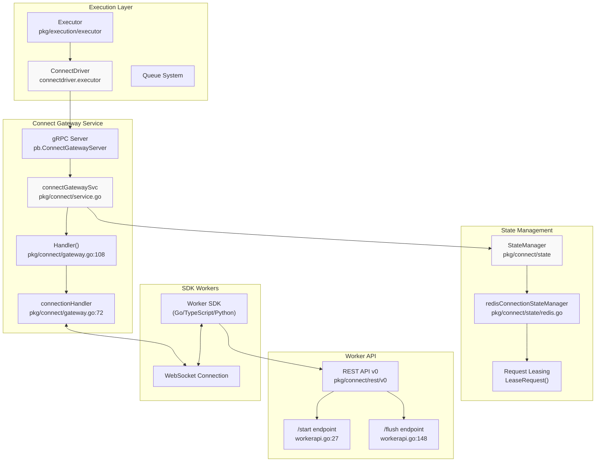

Sources: [pkg/connect/gateway.go:1-623](), [pkg/connect/service.go:65-108](), [pkg/execution/driver/connectdriver/connectdriver.go:33-44](), [pkg/connect/state/state.go:35-41]()

## Connection Establishment Flow

The Connect system uses a multi-step process to establish and maintain WebSocket connections between SDK workers and the gateway:

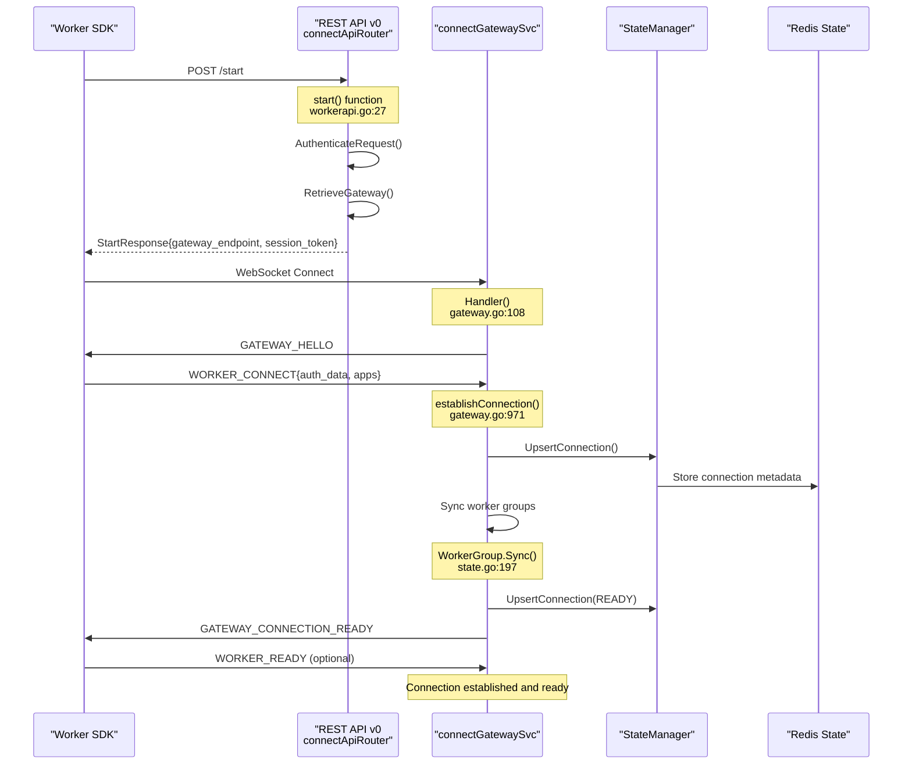

Sources: [pkg/connect/rest/v0/workerapi.go:27-146](), [pkg/connect/gateway.go:108-623](), [pkg/connect/gateway.go:971-1175](), [pkg/connect/state/state.go:197-373]()

## Message Types and Protocol

The Connect system uses Protocol Buffers to define message types for WebSocket communication:

### Gateway Message Types

| Message Type | Direction | Purpose |
|--------------|-----------|---------|
| `GATEWAY_HELLO` | Gateway → SDK | Initial greeting |
| `WORKER_CONNECT` | SDK → Gateway | Authentication and app registration |
| `GATEWAY_CONNECTION_READY` | Gateway → SDK | Connection established |
| `GATEWAY_EXECUTOR_REQUEST` | Gateway → SDK | Function execution request |
| `WORKER_REQUEST_ACK` | SDK → Gateway | Acknowledge request receipt |
| `WORKER_REPLY` | SDK → Gateway | Function execution response |
| `WORKER_HEARTBEAT` | SDK → Gateway | Keep-alive signal |
| `GATEWAY_HEARTBEAT` | Gateway → SDK | Heartbeat response |

Sources: [proto/connect/v1/connect.proto:8-24](), [proto/gen/connect/v1/connect.pb.go:25-43]()

## Function Execution Through Connect

When the executor needs to run a function, it routes the request through the Connect Gateway instead of making direct HTTP calls:

```mermaid
graph LR
    subgraph "Execution Flow"
        Executor["Executor"]
        ConnectDriver["ConnectDriver<br/>Execute()"]
        GRPCClient["gRPC Client<br/>ForwardRequest"]
    end
    
    subgraph "Gateway Routing"
        GatewayGRPC["Forward()<br/>rpc.go:11"]
        WSConnections["wsConnections<br/>sync.Map"]
        MessageChan["chan *GatewayExecutorRequestData"]
    end
    
    subgraph "WebSocket Delivery"
        ConnectionHandler["connectionHandler<br/>receiveRouterMessagesFromGRPC()"]
        WebSocket["WebSocket Connection"]
        SDK["Worker SDK"]
    end
    
    Executor --> ConnectDriver
    ConnectDriver --> GRPCClient
    GRPCClient --> GatewayGRPC
    
    GatewayGRPC --> WSConnections
    WSConnections --> MessageChan
    MessageChan --> ConnectionHandler
    ConnectionHandler --> WebSocket
    WebSocket --> SDK
    
    SDK --> WebSocket
    WebSocket --> ConnectionHandler
    ConnectionHandler --> GatewayGRPC
    
    style ConnectDriver fill:#f9f9f9
    style GatewayGRPC fill:#f9f9f9
```

Sources: [pkg/execution/driver/connectdriver/connectdriver.go:49-101](), [pkg/connect/rpc.go:11-35](), [pkg/connect/gateway.go:887-969]()

## State Management and Request Leasing

The Connect system uses Redis for managing connection state and implementing request leasing to prevent duplicate execution:

### Connection State Storage

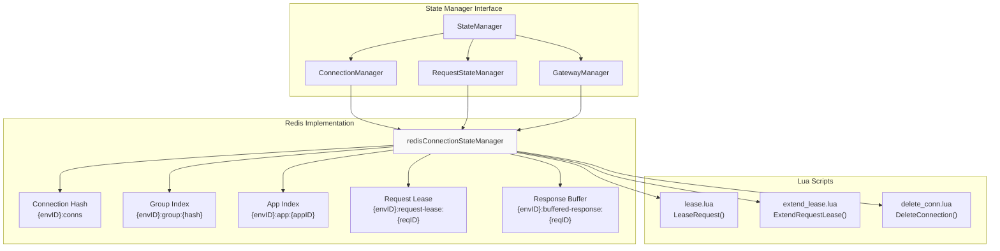

Sources: [pkg/connect/state/state.go:35-93](), [pkg/connect/state/redis.go:92-113](), [pkg/connect/state/request.go:46-89](), [pkg/connect/state/lua/lease.lua:1-32]()

## Request Leasing and Lease Extension

The Connect system implements request leasing to ensure only one worker processes a function execution at a time:

### Lease Management Flow

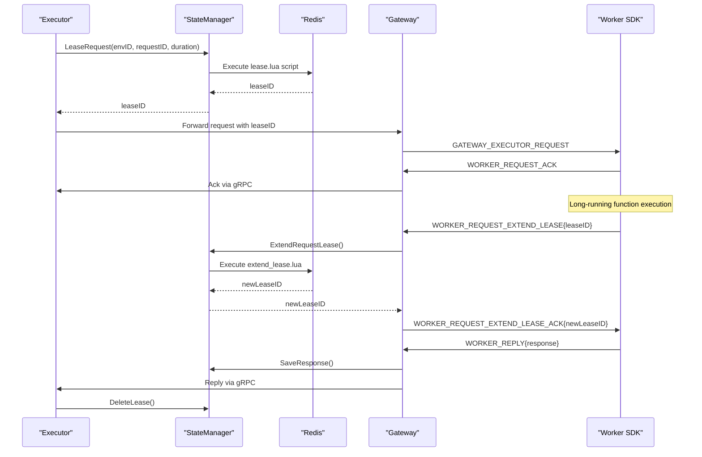

Sources: [pkg/connect/state/request.go:46-89](), [pkg/connect/state/request.go:93-140](), [pkg/connect/gateway.go:762-878]()

## Connection Lifecycle Management

The gateway manages WebSocket connection lifecycles with heartbeat monitoring and graceful shutdown:

### Connection States

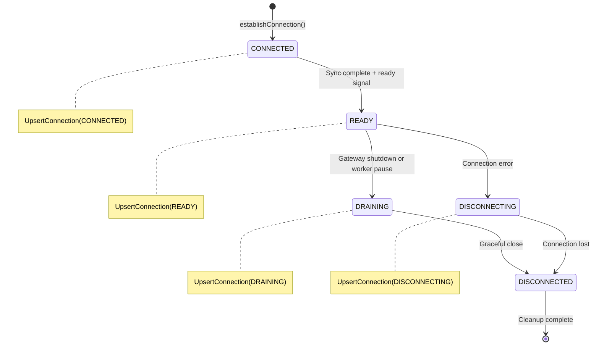

The gateway tracks connection status and implements heartbeat monitoring:

```go
// From pkg/connect/gateway.go:588-607
go func() {
    for {
        select {
        case <-runLoopCtx.Done():
            return
        case <-time.After(c.workerHeartbeatInterval):
        }

        if time.Since(ch.getLastHeartbeat()) > 
           time.Duration(c.consecutiveWorkerHeartbeatMissesBeforeConnectionClose)*
           c.workerHeartbeatInterval {
            setCloseReason(connectpb.WorkerDisconnectReason_CONSECUTIVE_HEARTBEATS_MISSED.String())
            cancelRunLoopContext()
            return
        }
    }
}()
```

Sources: [pkg/connect/gateway.go:238-301](), [pkg/connect/gateway.go:588-607](), [proto/gen/connect/v1/connect.pb.go:159-212]()

## Code Entity Mapping

### Key Service Components

| System Component | Code Entity | File Location |
|------------------|-------------|---------------|
| Gateway Service | `connectGatewaySvc` | [pkg/connect/service.go:65-108]() |
| Connection Handler | `connectionHandler` | [pkg/connect/gateway.go:72-84]() |
| State Manager | `redisConnectionStateManager` | [pkg/connect/state/redis.go:92-113]() |
| Connect Driver | `executor` (connectdriver) | [pkg/execution/driver/connectdriver/connectdriver.go:40-43]() |
| Worker API Router | `connectApiRouter` | [pkg/connect/rest/v0/v0.go:64-69]() |

### Protocol Message Types

| Protocol Message | Code Entity | File Location |
|------------------|-------------|---------------|
| Connection Request | `WorkerConnectRequestData` | [proto/gen/connect/v1/connect.pb.go:433-450]() |
| Execution Request | `GatewayExecutorRequestData` | [proto/gen/connect/v1/connect.pb.go:625-637]() |
| SDK Response | `SDKResponse` | [proto/gen/connect/v1/connect.pb.go:1247-1259]() |
| Gateway Message | `ConnectMessage` | [proto/gen/connect/v1/connect.pb.go:269-275]() |

### gRPC Service Definitions

| gRPC Service | Code Entity | File Location |
|--------------|-------------|---------------|
| Gateway Service | `ConnectGateway` | [proto/connect/v1/service.proto:9-12]() |
| Executor Service | `ConnectExecutor` | [proto/connect/v1/service.proto:31-35]() |
| Forward Request | `ForwardRequest` | [proto/gen/connect/v1/service.pb.go:25-31]() |
| Reply Request | `ReplyRequest` | [proto/gen/connect/v1/service.pb.go:201-205]() |

Sources: [pkg/connect/service.go:65-108](), [pkg/connect/gateway.go:72-84](), [pkg/execution/driver/connectdriver/connectdriver.go:40-43](), [proto/connect/v1/service.proto:9-35]()

# Function Definition and Configuration


This document covers how functions are defined, configured, and validated within the Inngest platform. It explains the CUE-based schema system that defines function structure, triggers, execution steps, and operational parameters, as well as the configuration parsing and validation pipeline that transforms these definitions into executable function metadata.

For information about how these function definitions are used during execution, see [Function Lifecycle and State Management](#3.2). For details about the development environment's function registration process, see [Development Server and Local Environment](#4.1).

## Function Definition Schema

Inngest uses CUE (Configure Unify Execute) as its configuration language to define function schemas. The core function definition is specified in the `#Function` schema, which provides a strongly-typed structure for declaring serverless functions with their triggers, execution steps, and operational constraints.

### Core Function Structure

The `#Function` schema defines the essential components of an Inngest function:

| Field | Type | Purpose |
|-------|------|---------|
| `id` | string | Unique identifier for the function |
| `name` | string | Human-readable function name |
| `concurrency` | uint (optional) | Maximum concurrent executions |
| `triggers` | array of `#Trigger` | Event or cron-based function triggers |
| `steps` | map of `#Step` | Individual execution steps in DAG format |
| `idempotency` | string (optional) | Idempotency key expression |
| `throttle` | object (optional) | Rate limiting configuration |
| `cancel` | array of `#Cancel` | Cancellation conditions |

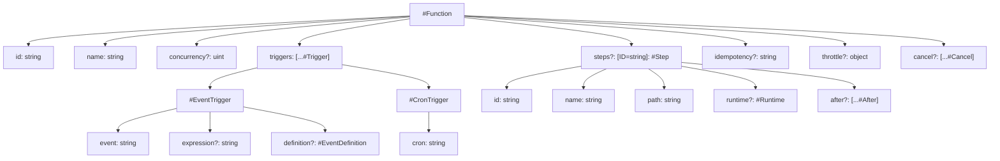

*Function Definition Schema Structure*

Sources: [pkg/cuedefs/v1/function.cue:3-27]()

### Trigger System

Functions are activated through triggers defined in the `#Trigger` union type, which supports both event-driven and time-based execution:

**Event Triggers (`#EventTrigger`):**
- `event`: String pattern matching event names
- `expression`: CEL-based conditional expressions for trigger filtering
- `definition`: Optional type definitions for event data validation

**Cron Triggers (`#CronTrigger`):**
- `cron`: Standard cron expression for scheduled execution

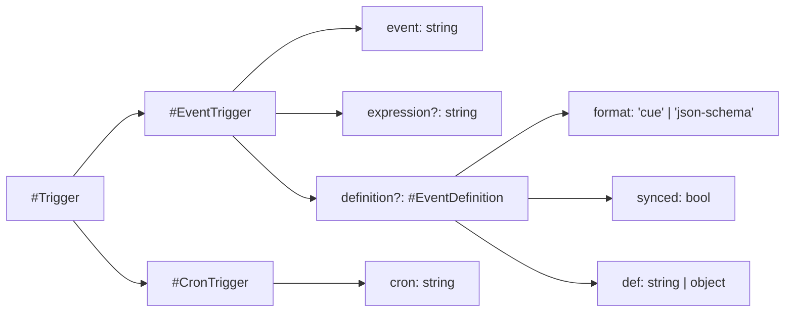

*Trigger Type System*

Sources: [pkg/cuedefs/v1/function.cue:29-52](), [pkg/cuedefs/v1/function.cue:54-65]()

### Step Execution Model

The `#Step` schema defines individual execution units within a function's DAG (Directed Acyclic Graph). Each step represents an atomic operation that can be scheduled, executed, and retried independently:

| Field | Type | Description |
|-------|------|-------------|
| `id` | string | Step identifier within function |
| `name` | string | Human-readable step name |
| `path` | string | File system path to step implementation |
| `runtime` | `#Runtime` | Execution environment specification |
| `after` | array of `#After` | Step dependency and timing configuration |
| `version` | object | Version constraints for step resolution |
| `retries` | object | Retry policy configuration |

The `#After` schema provides sophisticated step orchestration capabilities:

- **Conditional Execution**: `if` expressions determine whether a step should run
- **Delayed Execution**: `wait` parameter adds time-based delays
- **Async Events**: `async` configuration enables event-driven step continuation with TTL support

Sources: [pkg/cuedefs/v1/function.cue:68-98](), [pkg/cuedefs/v1/function.cue:100-121]()

## Configuration System Architecture

The configuration system transforms CUE-based function definitions into validated configuration objects that can be used by the Inngest runtime. This process involves file discovery, CUE compilation, schema validation, and Go struct deserialization.

### Configuration Loading Pipeline

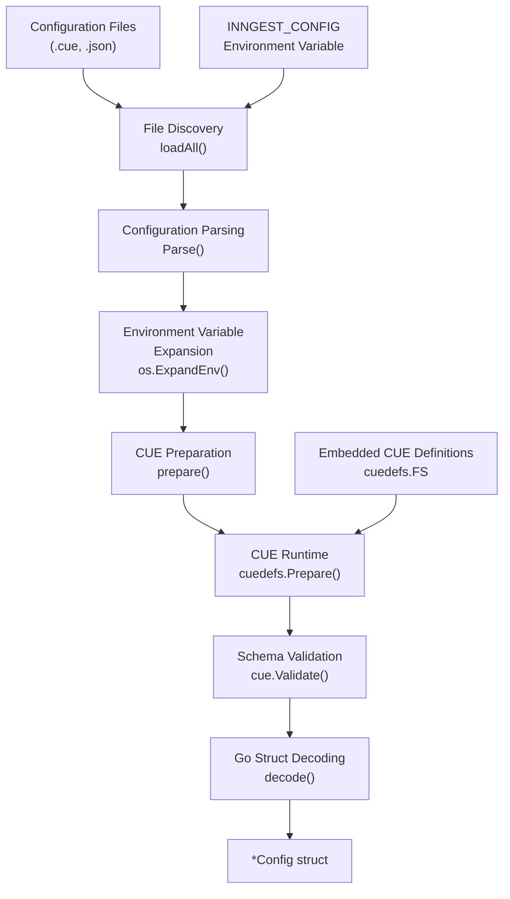

*Configuration Processing Pipeline*

The system searches for configuration files in predefined locations with fallback mechanisms:

1. **File Discovery**: Searches `./inngest` and `/etc/inngest` with `.cue` and `.json` extensions
2. **Environment Fallback**: Uses `INNGEST_CONFIG` environment variable if no files found
3. **Default Configuration**: Falls back to empty configuration if no sources available

Sources: [pkg/config/parse.go:42-76]()

### CUE Runtime Integration

The CUE integration system provides thread-safe schema validation and compilation. The `cuedefs` package embeds the CUE module definitions and provides runtime compilation services:

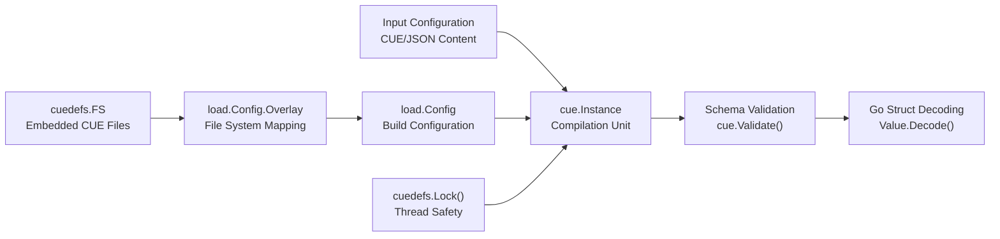

*CUE Runtime Architecture*

The system handles platform-specific file path resolution, including Windows-specific overlay mappings for CUE's file system requirements.

Sources: [pkg/cuedefs/cuedefs.go:49-127](), [pkg/config/parse.go:106-145]()

### Schema Validation Process

The validation process ensures that function definitions conform to the CUE schema before runtime execution:

1. **CUE Compilation**: Input files are compiled into CUE instances with embedded schema definitions
2. **Schema Validation**: `cue.Validate()` with `Final()` and `Concrete(true)` options ensures complete, concrete values
3. **Error Reporting**: CUE errors are formatted with `cueerrors.Print()` for detailed validation feedback
4. **Go Decoding**: Valid CUE values are decoded into Go structs using reflection-based mapping

The validation process rejects incomplete, abstract, or invalid configurations before they reach the execution engine.

Sources: [pkg/config/parse.go:119-145]()

## Configuration File Discovery and Resolution

The configuration system implements a hierarchical search strategy for locating function definitions across multiple file formats and locations.

### Search Path Resolution

| Priority | Location | Extensions |
|----------|----------|------------|
| 1 | `./inngest` | `.cue`, `.json` |
| 2 | `/etc/inngest` | `.cue`, `.json` |
| 3 | `INNGEST_CONFIG` environment variable | Raw content |
| 4 | Default empty configuration | `{}` |

The system processes each location in order, attempting both CUE and JSON file extensions before moving to the next location. Direct file paths (containing extensions) bypass the extension search process.

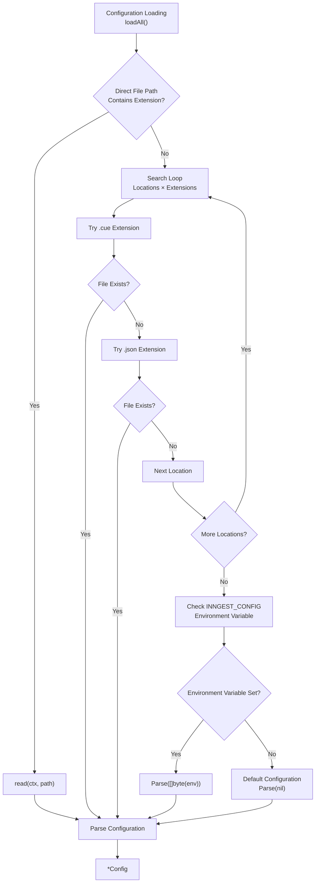

*Configuration File Discovery Process*

Sources: [pkg/config/parse.go:42-76](), [pkg/config/parse.go:22-30]()

## Runtime Function Definition Processing

The configuration system transforms validated CUE schemas into runtime-ready function definitions that can be consumed by the execution engine and development server.

### CUE to Go Struct Mapping

The `decode()` function performs the critical transformation from CUE values to Go structs:

1. **Root Value Extraction**: Locates the `config` field within the CUE instance
2. **Final Validation**: Ensures all values are concrete and complete using `cue.Final()` and `cue.Concrete(true)`
3. **Struct Decoding**: Uses CUE's reflection-based decoder to populate Go struct fields
4. **Error Handling**: Provides detailed error messages for validation and decoding failures

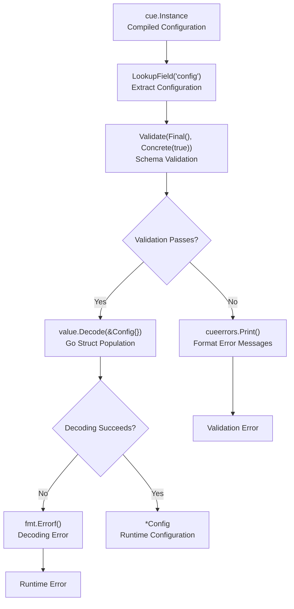

*CUE to Go Struct Conversion Process*

The system handles both direct JSON configurations (prefixed with `#Config` schema) and full CUE module definitions containing embedded configurations.

Sources: [pkg/config/parse.go:119-145]()

# Function Schema and CUE Configuration


This document covers how Inngest uses CUE (Configuration Unified Expression) language to define function schemas, triggers, steps, and operational parameters. It explains the schema structure defined in the v1 CUE definitions and how these configurations are parsed and validated at runtime.

For information about function execution and state management during runtime, see [Function Lifecycle and State Management](#3.2). For details on how functions are executed by the core engine, see [Core Execution System](#2).

## CUE-Based Function Definition System

Inngest uses CUE as its configuration language for defining serverless functions. CUE provides strong typing, validation, and schema enforcement while remaining human-readable and maintainable.

The core function schema is defined in [pkg/cuedefs/v1/function.cue:3-27]() as the `#Function` struct, which serves as the root configuration object for all Inngest functions.

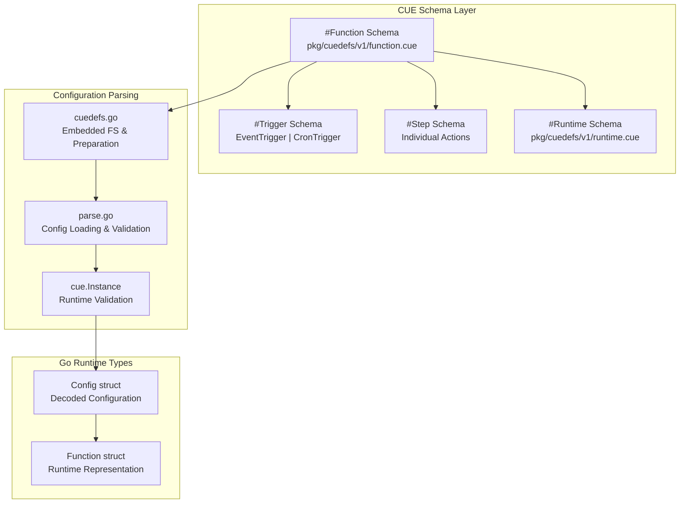

Sources: [pkg/cuedefs/v1/function.cue:1-132](), [pkg/config/parse.go:1-146](), [pkg/cuedefs/cuedefs.go:1-128]()

## Function Schema Structure

### Core Function Definition

The `#Function` schema defines the essential structure of an Inngest function:

| Field | Type | Purpose |
|-------|------|---------|
| `id` | `string` | Unique identifier for the function |
| `name` | `string` | Human-readable function name |
| `concurrency` | `uint` (optional) | Maximum concurrent executions |
| `triggers` | `[...#Trigger]` | Array of trigger conditions |
| `steps` | `[ID=string]: #Step` | Map of execution steps |

Additional operational controls include:

- **Idempotency**: [pkg/cuedefs/v1/function.cue:16]() - Custom idempotency key using event data
- **Throttling**: [pkg/cuedefs/v1/function.cue:20-24]() - Rate limiting with configurable count, period, and optional key
- **Cancellation**: [pkg/cuedefs/v1/function.cue:26]() - Event-based function cancellation

Sources: [pkg/cuedefs/v1/function.cue:3-27]()

### Trigger System

Functions are activated through triggers defined by the `#Trigger` union type [pkg/cuedefs/v1/function.cue:52]():

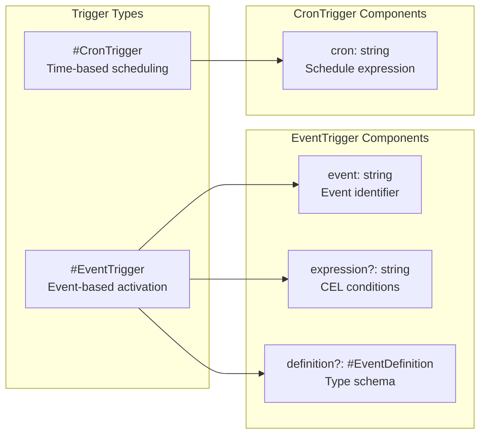

**Event Triggers** [pkg/cuedefs/v1/function.cue:29-46]():
- `event`: Event name that activates the function
- `expression`: Optional CEL expressions for conditional triggering (e.g., `"event.data.total >= 500"`)
- `definition`: Type definitions for events, supporting CUE or JSON Schema formats

**Cron Triggers** [pkg/cuedefs/v1/function.cue:48-50]():
- `cron`: Standard cron expression for scheduled execution

Sources: [pkg/cuedefs/v1/function.cue:29-52]()

### Step Definition and Execution Flow

Functions are composed of steps defined by the `#Step` schema [pkg/cuedefs/v1/function.cue:69-98]():

| Field | Type | Description |
|-------|------|-------------|
| `id` | `string` | Step identifier |
| `name` | `string` | Display name (optional) |
| `path` | `string` | Disk location for step code (optional) |
| `runtime` | `#Runtime` | Execution runtime configuration |
| `after` | `[...#After]` | Dependencies and sequencing |
| `version` | Object | Version constraints |
| `retries` | Object | Retry configuration |

**Step Dependencies** are managed through the `#After` construct [pkg/cuedefs/v1/function.cue:100-121]():

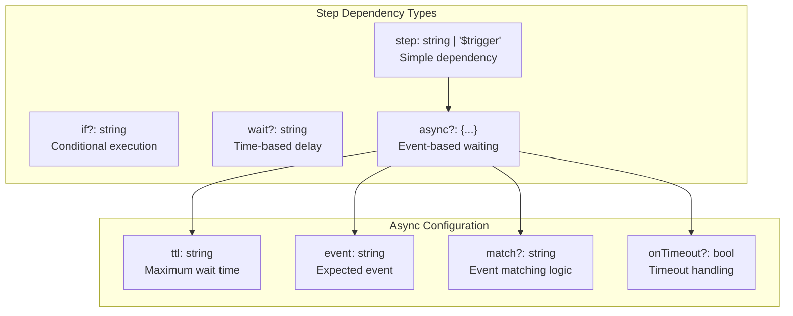

Sources: [pkg/cuedefs/v1/function.cue:69-121]()

## Configuration Parsing System

### CUE Definitions Management

The CUE definitions are managed through [pkg/cuedefs/cuedefs.go](), which provides:

- **Embedded Filesystem**: [pkg/cuedefs/cuedefs.go:24-25]() - CUE modules embedded at compile time
- **Thread Safety**: [pkg/cuedefs/cuedefs.go:40-47]() - Mutex protection for CUE operations
- **Instance Preparation**: [pkg/cuedefs/cuedefs.go:49-127]() - Runtime CUE instance creation with overlay support

### Configuration Loading Process

Configuration parsing follows this flow through [pkg/config/parse.go]():

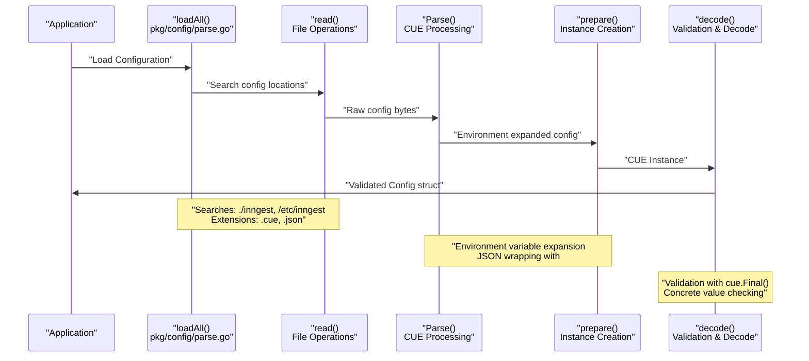

**Configuration Search**: [pkg/config/parse.go:22-30]()
- Default locations: `./inngest`, `/etc/inngest`
- Supported extensions: `.cue`, `.json`
- Environment variable fallback: `INNGEST_CONFIG`

**Validation Process**: [pkg/config/parse.go:133-137]()
- `cue.Final()`: Ensures complete definition
- `cue.Concrete(true)`: Validates all values are concrete
- Error reporting with detailed CUE error formatting

Sources: [pkg/config/parse.go:42-145](), [pkg/cuedefs/cuedefs.go:49-127]()

### Runtime Configuration

Function runtimes are defined through [pkg/cuedefs/v1/runtime.cue:3-8](), currently supporting:

**HTTP Runtime** [pkg/cuedefs/v1/runtime.cue:5-8]():
```cue
#RuntimeHTTP: {
    type: "http"
    url:  string
}
```

This runtime type enables functions to be executed via HTTP calls to external endpoints, supporting the SDK-based execution model described in [HTTP Driver and SDK Communication](#2.3).

Sources: [pkg/cuedefs/v1/runtime.cue:1-9]()

## Function Cancellation System

The cancellation system [pkg/cuedefs/v1/function.cue:123-131]() allows functions to be terminated based on external events:

| Field | Type | Purpose |
|-------|------|---------|
| `event` | `string` | Event name that triggers cancellation |
| `timeout` | `string` (optional) | Maximum runtime before cancellation eligibility |
| `if` | `string` (optional) | Conditional expression for cancellation logic |

This enables patterns like order cancellation workflows where a `order.cancelled` event can terminate a pending `order.processing` function.

Sources: [pkg/cuedefs/v1/function.cue:123-131]()

## Schema Validation and Type Safety

The CUE-based approach provides several advantages:

1. **Compile-time Validation**: Schema errors are caught during configuration parsing
2. **Type Safety**: Strong typing prevents runtime configuration errors
3. **Expression Support**: CEL integration for complex conditional logic
4. **Extensibility**: Schema evolution through CUE's constraint system

The validation process ensures that all function definitions conform to the schema before being registered with the execution engine, preventing malformed configurations from causing runtime failures.

Sources: [pkg/config/parse.go:133-145](), [pkg/cuedefs/cuedefs.go:1-128]()