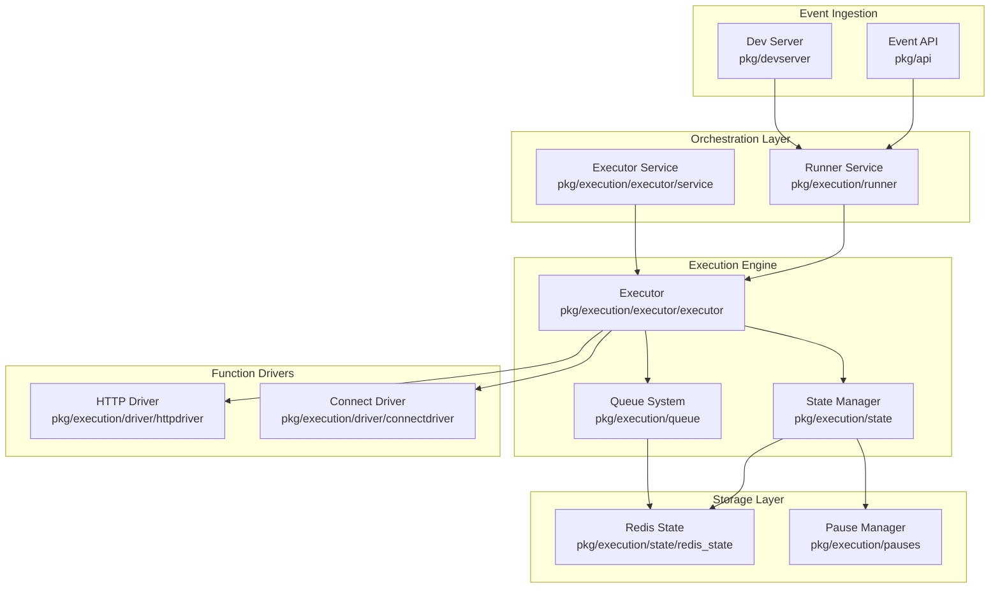
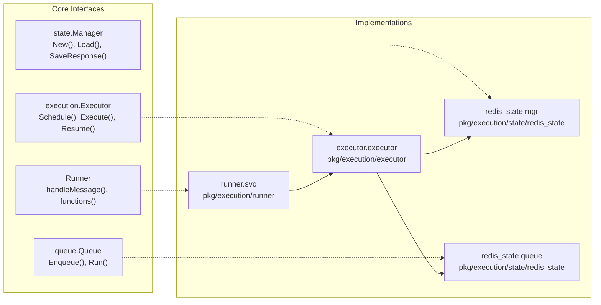
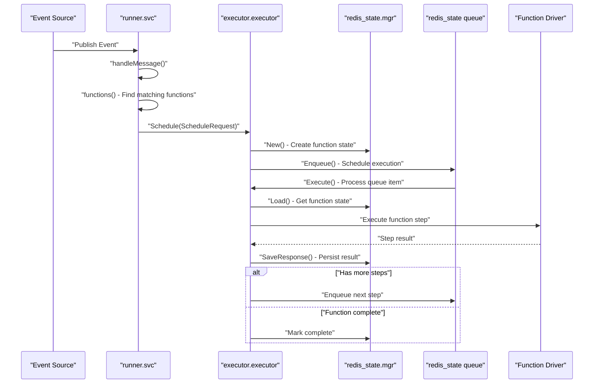
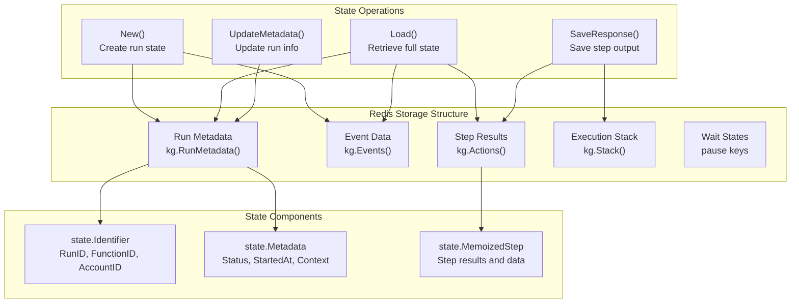
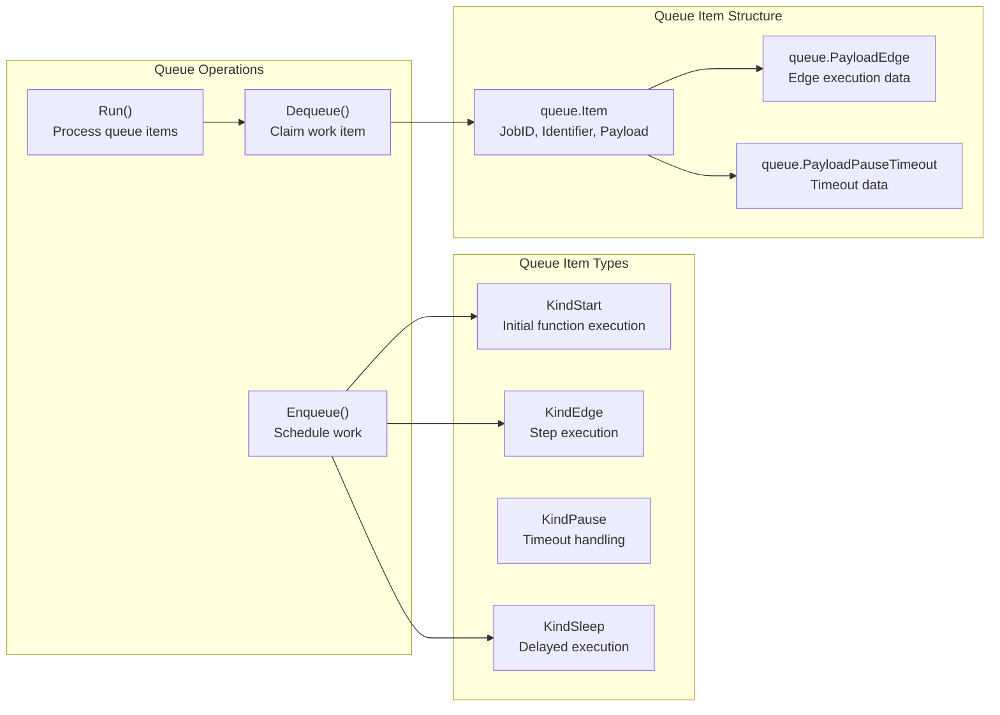
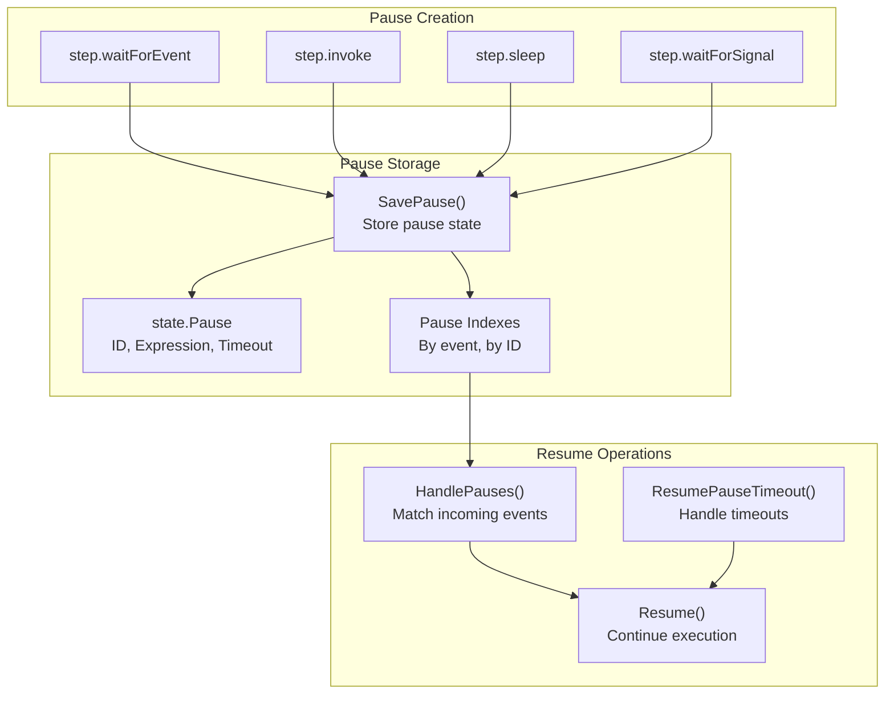

The Core Execution System is the heart of Inngest's serverless function platform, responsible for orchestrating the entire lifecycle of function execution from event ingestion to completion. This system manages the scheduling, execution, state persistence, and coordination of distributed function runs across multiple workers and runtime environments.

For information about the specific queue implementation and job distribution, see [Distributed Queue System](#2.1). For details about function step execution and driver communication, see [Executor and Function Execution](#2.2). For HTTP-based SDK communication, see [HTTP Driver and SDK Communication](#2.3). For WebSocket-based worker connections, see [Connect Gateway and WebSocket Workers](#2.4).

## System Architecture Overview

The core execution system consists of several interconnected components that work together to provide reliable, scalable function execution:

Sources: pkg/execution/executor/executor.go:1-115, pkg/execution/runner/runner.go:1-124, pkg/execution/executor/service.go:1-116, pkg/execution/state/state.go:1-53

## Key System Components

The execution system is built around several core interfaces and implementations that provide clear separation of concerns:

### Primary Execution Interfaces

| Component | Interface | Implementation | Purpose |
|-----------|-----------|----------------|---------|
| **Runner** | `Runner` | `runner.svc` | Event handling and function triggering |
| **Executor** | `execution.Executor` | `executor.executor` | Function step execution and orchestration |
| **State Manager** | `state.Manager` | `redis_state.mgr` | Function state persistence and retrieval |
| **Queue** | `queue.Queue` | `redis_state` implementation | Job scheduling and distribution |
| **Pause Manager** | `pauses.Manager` | Redis-backed implementation | Wait state management |

Sources: pkg/execution/execution.go:53-134, pkg/execution/state/state.go:322-376, pkg/execution/runner/runner.go:46-56, pkg/execution/executor/executor.go:80-115

## Function Execution Flow

The execution flow demonstrates how events trigger function execution through the coordinated interaction of system components:

Sources: pkg/execution/runner/runner.go:325-406, pkg/execution/executor/executor.go:520-903, pkg/execution/executor/executor.go:919-1170, pkg/execution/state/redis_state/redis_state.go:233-362

## State Management Architecture

The state management system provides durable storage for function execution data, including events, step results, and execution metadata:

Sources: pkg/execution/state/redis_state/redis_state.go:233-396, pkg/execution/state/state.go:61-102, pkg/execution/state/state.go:199-252, pkg/execution/state/state.go:814-857

## Queue and Work Distribution

The queue system manages the scheduling and distribution of function execution work across available workers:

Sources: pkg/execution/executor/service.go:235-280, pkg/execution/executor/executor.go:824-880, pkg/execution/state/redis_state/redis_state.go queue operations

## Pause and Resume Mechanism

The execution system supports pausing function execution for external events, timeouts, and manual intervention through a sophisticated pause management system:

Sources: pkg/execution/state/pause.go:1-52, pkg/execution/state/redis_state/lua/savePause.lua:1-79, pkg/execution/state/redis_state/lua/consumePause.lua:1-45, pkg/execution/executor/executor.go:2890-3020

The Core Execution System orchestrates these components to provide reliable, scalable function execution with support for complex workflows, error handling, retries, and stateful operations across distributed environments.