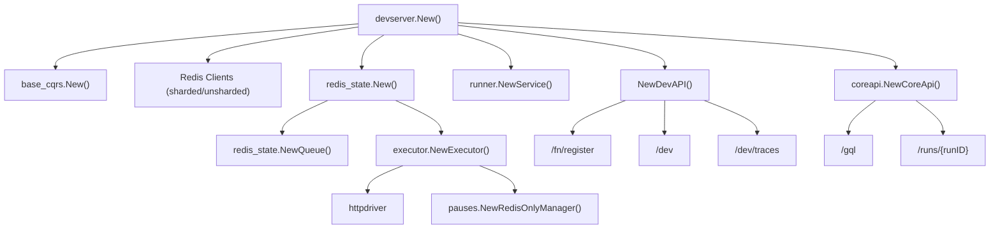
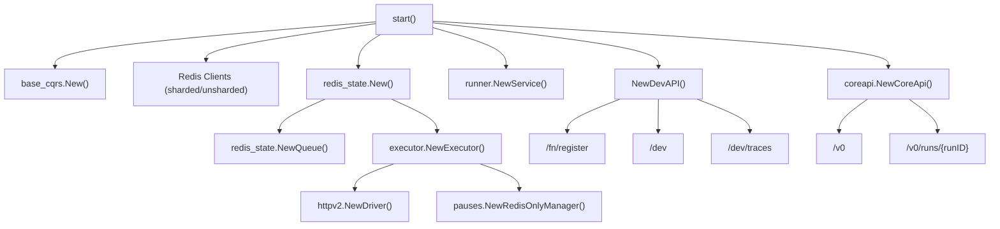
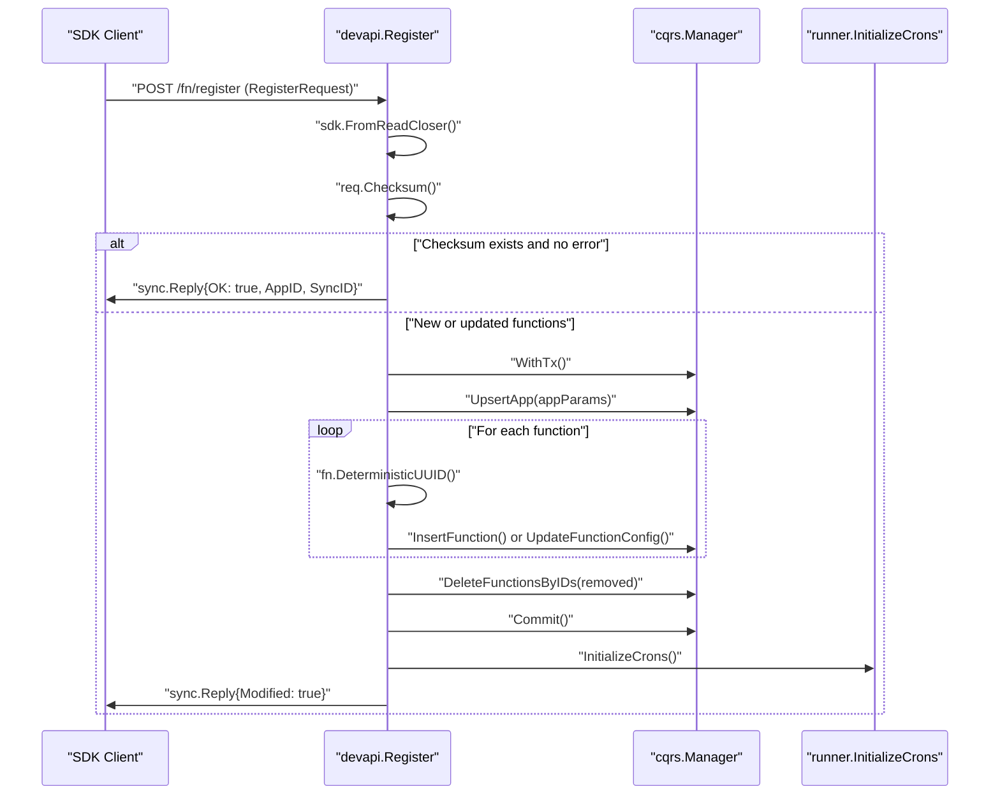
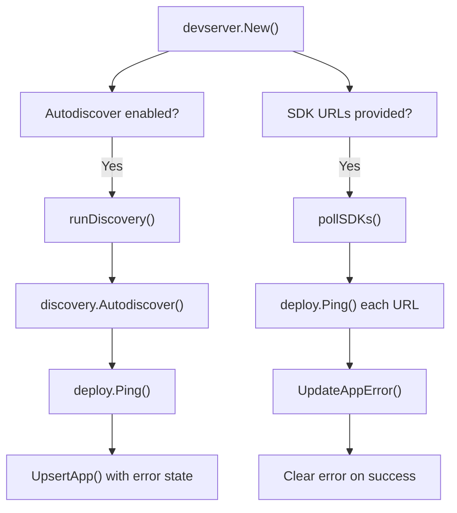
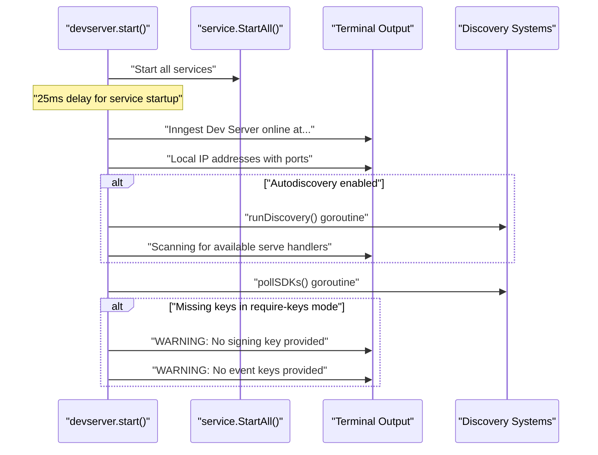
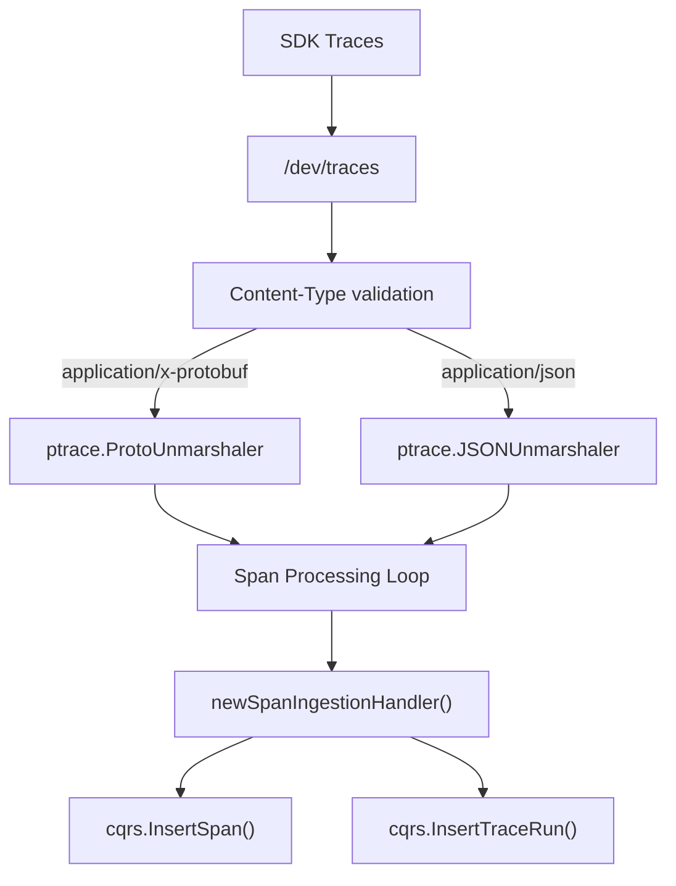
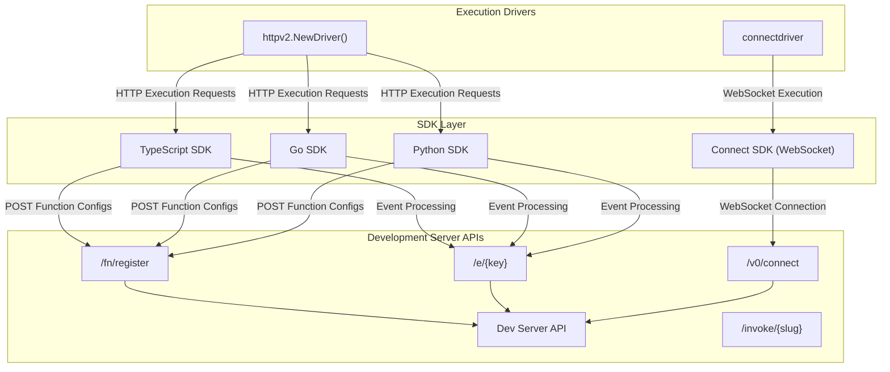

This page documents the tools and systems that support local development and testing of Inngest functions. The development experience is built around a local development server that provides a comprehensive environment for building, testing, and debugging Inngest functions.

For information about Function Definition and Configuration, see [Function Definition and Configuration](#3), and for SDK-specific details, see [HTTP Driver and SDK Communication](#2.3).

## Development Tools Overview

The Inngest development experience centers around the development server (`devserver`), which provides a complete local runtime environment that mirrors production behavior while offering additional development-specific features.

### Development Architecture


The development server configuration is controlled through `StartOpts`:

**Development Mode Configuration**:
- Uses in-memory SQLite and Redis for fast iteration
- Enables autodiscovery of local SDK servers
- Provides development-specific APIs and endpoints
- Includes comprehensive logging and debugging tools
- No authentication required for rapid development

**Self-hosted Mode Configuration**:
- Supports external Redis and PostgreSQL
- Requires signing key and event keys for security
- Can disable UI components
- Persistence options for production-like testing

Sources: [pkg/devserver/devserver.go:95-142](), [pkg/devserver/devserver.go:149-156]()

## Development Server Architecture

The development server orchestrates multiple services to provide a complete local development environment for Inngest functions.

### Core Component Integration


Sources: [pkg/devserver/devserver.go:162-625]()

### Service Composition

The `devserver` struct manages multiple service components:

```go
type devserver struct {
    Data     cqrs.Manager           // Function and run storage
    Runner   runner.Runner          // Execution orchestration  
    State    state.Manager          // Redis-based state
    Queue    queue.Queue            // Task queue management
    Executor execution.Executor     // Function execution engine
}
```

Key services initialized in [pkg/devserver/devserver.go:162-625]():
- **CQRS Manager**: SQLite/PostgreSQL for configuration storage via `base_cqrs.New()`
- **Redis State Manager**: In-memory or external Redis for queues and state via `redis_state.New()`
- **Queue System**: `redis_state.NewQueue()` with partition management and concurrency control
- **Executor**: `executor.NewExecutor()` with HTTP and Connect drivers for function execution
- **Runner**: `runner.NewService()` for cron and batch management

The development server also creates specialized components:
- **Express Aggregator**: `expragg.NewAggregator()` for expression evaluation
- **Realtime Broadcaster**: `realtime.NewInProcessBroadcaster()` for live updates  
- **Connection Manager**: `connstate.NewRedisConnectionStateManager()` for WebSocket connections
- **Debouncer and Batcher**: For advanced execution patterns

Sources: [pkg/devserver/service.go:76-105](), [pkg/devserver/devserver.go:266-462]()

### Development API Endpoints

The development server exposes multiple API surfaces through mounted routers to support comprehensive development workflows:

#### Dev API Endpoints (`NewDevAPI`)
| Endpoint | Method | Handler Function | Purpose |
|----------|--------|------------------|---------|
| `/dev` | GET | `devapi.Info` | Server status and registered functions |
| `/dev/traces` | POST | `devapi.OTLPTrace` | OpenTelemetry trace ingestion |
| `/fn/register` | POST | `devapi.Register` | SDK function registration |
| `/fn/remove` | DELETE | `devapi.RemoveApp` | Remove registered applications |
| `/fn/step-limit` | POST/DELETE | `devapi.SetStepLimit`/`RemoveStepLimit` | Function step execution limits |
| `/fn/state-size-limit` | POST/DELETE | `devapi.SetStateSizeLimit`/`RemoveStateSizeLimit` | Function state size limits |

#### Core API Endpoints (mounted at `/v0`)
| Endpoint | Method | Handler Function | Purpose |
|----------|--------|------------------|---------|
| `/v0` | Multiple | `core.Router` | GraphQL API for UI and data access |
| `/v0/connect` | WebSocket | Connect Gateway | WebSocket connections for SDK communication |

#### Event API (mounted at root)
| Endpoint | Method | Handler Function | Purpose |
|----------|--------|------------------|---------|
| `/e/{key}` | POST | `API.ReceiveEvent` | Event ingestion with key authentication |
| `/invoke/{slug}` | POST | `API.Invoke` | Direct function invocation |
| `/health` | GET | `API.HealthCheck` | Health check endpoint |

#### Additional Development Endpoints
| Endpoint | Method | Purpose |
|----------|--------|---------|
| `/api/v2` | Multiple | API v2 service handler |
| `/debug` | Multiple | Profiler endpoints (when enabled) |
| `/metrics` | GET | Prometheus-compatible metrics |
| `/test` | Multiple | Test API endpoints (when `testapi.ShouldEnable()`) |

Sources: [pkg/devserver/api.go:62-108](), [pkg/devserver/devserver.go:615-648](), [pkg/api/api.go:70-73]()

### SDK Function Registration System

The registration process handles SDK-to-server function synchronization with checksum-based deduplication and comprehensive error handling:

#### Registration Sequence


#### Registration Implementation Details

The `devapi.register()` function [pkg/devserver/api.go:235-392]() implements:

1. **Request Parsing**: Uses `sdk.FromReadCloser()` to parse the registration payload
2. **Checksum Validation**: Computes function checksum via `r.Checksum()` for deduplication  
3. **App Management**: Creates deterministic app UUID with `inngest.DeterministicAppUUID(r.URL)`
4. **Function Synchronization**: 
   - Inserts new functions with `tx.InsertFunction()`
   - Updates existing functions with `tx.UpdateFunctionConfig()`
   - Removes deleted functions with `tx.DeleteFunctionsByIDs()`
5. **Cron Initialization**: Calls `a.devserver.Runner.InitializeCrons()` for scheduled functions

The registration endpoint also includes comprehensive error handling - any errors during registration are stored in the app record for debugging purposes.

#### App and Function Management

The development server manages applications and functions using a deterministic UUID approach:

- Apps are identified by deterministic UUIDs generated from their URL
- Functions are upserted into the database with their full configuration
- Removed functions (not present in registration calls) are automatically deleted
- Apps can be explicitly removed via the `/fn/remove` endpoint
- All operations occur within database transactions to ensure consistency

Sources: [pkg/devserver/api.go:188-233](), [pkg/devserver/api.go:235-392](), [pkg/devserver/api.go:563-583]()

## Local Development Environment

The development server provides a comprehensive local environment that supports iterative development through automated discovery, polling, and real-time feedback.

### SDK Discovery and Connection Management

#### Discovery Architecture


The development server implements two discovery mechanisms in [pkg/devserver/service.go:260-278]() and [pkg/devserver/service.go:282-368]():

1. **Autodiscovery** (`runDiscovery`): Scans local network for Inngest SDK servers, automatically disabling when apps are found
2. **URL Polling** (`pollSDKs`): Regularly pings configured SDK URLs to trigger registration and maintain connectivity

Both mechanisms use `deploy.Ping()` to test connectivity and trigger SDK registration.

### Development-Focused Features

| Feature | Implementation | Purpose |
|---------|---------------|---------|
| **Auto-discovery** | `discovery.Autodiscover()` | Automatically find local SDK servers |
| **URL Polling** | `pollSDKs()` goroutine | Keep connections alive, trigger re-registration |
| **In-memory State** | `miniredis` + `redis_state` | Fast, ephemeral state for development |
| **Development UI** | Static file serving via embedded FS | Visual function management and monitoring |
| **Event Simulation** | `/e/{key}` and `/invoke/{slug}` endpoints | Direct event and function testing |
| **Function Tracing** | OpenTelemetry ingestion via `/dev/traces` | Comprehensive execution observability |
| **Live Updates** | `realtime.NewInProcessBroadcaster()` | Real-time UI updates during execution |

#### Development Server Startup Process

The server provides extensive logging and status information during initialization:



The startup process includes network interface discovery via `localIPs()` [pkg/devserver/service.go:699-715]() to show all accessible URLs for the development server.

Sources: [pkg/devserver/service.go:163-216](), [pkg/devserver/service.go:260-278](), [pkg/devserver/service.go:282-368]()

### OpenTelemetry Development Integration

The development server provides comprehensive observability through OTLP trace ingestion, enabling detailed debugging and performance analysis during development.

#### Trace Processing Pipeline


#### Trace Data Processing

The `devapi.OTLPTrace` handler [pkg/devserver/api.go:394-561]() processes traces through a comprehensive pipeline:

1. **Format Detection**: Supports both protobuf (`application/x-protobuf`) and JSON (`application/json`) OTLP formats
2. **Span Extraction**: Processes nested `ResourceSpans` -> `ScopeSpans` -> individual spans structure
3. **Attribute Parsing**: Converts OTLP attributes to JSON with custom `convertMap()` function
4. **Run Association**: Links spans to function runs via `consts.OtelAttrSDKRunID` attribute
5. **AI Detection**: Identifies AI-enabled functions via `consts.OtelSysFunctionHasAI` attribute
6. **Database Storage**: Persists spans and trace runs via CQRS methods for UI display

#### Development-Focused Trace Features

Each processed span includes comprehensive debugging information:
- **Execution Context**: `TraceID`, `SpanID`, `ParentSpanID` for request tracing
- **Timing Data**: Start timestamp, duration, and execution timing
- **Function Metadata**: Service name, scope name/version, resource attributes  
- **Error Information**: Status codes, status messages, and error events
- **Custom Events**: Nested span events with structured attributes
- **Trace Links**: Links between related traces across service boundaries

This enables developers to:
- Debug function execution flow and timing
- Identify performance bottlenecks in development
- Trace errors across function steps
- Monitor AI model integration and performance
- Understand cross-service communication patterns

Sources: [pkg/devserver/api.go:394-561](), [pkg/devserver/api.go:439-560]()

## SDK Integration and Testing Support

The development server provides comprehensive integration with various Inngest SDKs, supporting both development and testing workflows.

### SDK Communication Architecture



### Development Integration Features

The SDK integration supports comprehensive development workflows:

1. **Function Registration**: SDKs send function definitions via POST to `/fn/register` with checksum-based deduplication
2. **Event Processing**: SDKs receive events through the `/e/{key}` endpoint with authentication support
3. **Function Execution**: Development server executes functions via HTTP requests to SDK endpoints or WebSocket connections
4. **State Coordination**: Development server and SDKs coordinate function state and execution context
5. **Direct Invocation**: Functions can be invoked directly via `/invoke/{slug}` for testing
6. **Trace Integration**: SDKs send OpenTelemetry traces to `/dev/traces` for debugging

### Testing and Development Support

The development server provides specialized testing features:

| Feature | Implementation | Purpose |
|---------|---------------|---------|
| **Function Limits Testing** | `/fn/step-limit`, `/fn/state-size-limit` endpoints | Test execution constraints |
| **App Management** | `/fn/remove` endpoint | Clean up test applications |
| **Event Simulation** | `/e/{key}` with configurable keys | Simulate production event scenarios |
| **Direct Invocation** | `/invoke/{slug}` endpoint | Test individual functions |
| **Trace Debugging** | OTLP ingestion and storage | Debug execution flow and performance |
| **Authentication Testing** | Configurable signing keys and event keys | Test security configurations |

### SDK Registration Protocol

The registration process includes comprehensive metadata exchange:

- **SDK Information**: Language, version, framework detection
- **Function Definitions**: Complete function configurations with triggers and steps
- **App Metadata**: Application name, version, and URL
- **Checksum Validation**: Ensures registration efficiency and consistency
- **Error Handling**: Comprehensive error reporting back to SDKs

Sources: [pkg/devserver/api.go:188-233](), [pkg/devserver/api.go:235-392](), [pkg/api/api.go:140-310]()

## Development Configuration and Testing Controls

The development server provides extensive configuration options and testing controls designed to support comprehensive local development and debugging workflows.

### Development-Specific Testing Controls

#### Function Execution Limits
| Endpoint | Method | Purpose | Storage |
|----------|--------|---------|---------|
| `/fn/step-limit` | POST | Set per-function step limit | `devserver.stepLimitOverrides` |
| `/fn/step-limit` | DELETE | Remove step limit override | `map[string]int` |
| `/fn/state-size-limit` | POST | Set per-function state size limit | `devserver.stateSizeLimitOverrides` |
| `/fn/state-size-limit` | DELETE | Remove state size limit override | `map[string]int` |

Implementation allows developers to test execution constraints:

```go
func (a devapi) SetStepLimit(w http.ResponseWriter, r *http.Request) {
    functionId := r.FormValue("functionId")
    limitStr := r.FormValue("limit")
    limit, err := strconv.Atoi(limitStr)
    a.devserver.stepLimitOverrides[functionId] = limit
}
```

These overrides are integrated into the executor via `executor.WithStepLimits()` and `executor.WithStateSizeLimits()` configuration.

#### Feature Flags and Development Environment Variables

The development server supports extensive runtime configuration:

**Environment-Based Feature Flags**:
- `EXPERIMENTAL_KEY_QUEUES_ENABLE`: Enables experimental key-based queue partitioning
- `INNGEST_CONNECT_DISABLE_ENFORCE_LEASE_EXPIRY`: Disables WebSocket lease expiry enforcement
- `INNGEST_FEATURE_FLAGS`: Comma-separated key=value feature flag pairs for UI and behavior control
- `DEBUG`: Enables debug API endpoints at `/debug`

**Development Server Configuration**:
- `Autodiscover`: Automatic SDK discovery on local network
- `Poll`: Regular polling of configured SDK URLs
- `InMemory`: Use in-memory databases for fast iteration
- `NoUI`: Disable web UI for headless development
- `Tick`: Queue processing interval (default 150ms)
- `QueueWorkers`: Number of concurrent queue workers (default 100)

### Persistence and State Management Options

The development server supports flexible persistence configurations for different development scenarios:

#### Database Configuration Options
| Configuration | Development Mode | Production Mode | Purpose |
|---------------|------------------|-----------------|---------|
| **CQRS Store** | In-memory SQLite via `InMemory: true` | File-based SQLite or PostgreSQL | Function definitions, execution history |
| **Redis State** | `miniredis` in-memory | External Redis via `RedisURI` | Queue state, execution coordination |
| **Queue Snapshots** | Disabled | Optional via `PersistenceInterval` | State backup/restore for persistence |

#### Redis Configuration Management

The development server handles Redis connections through `connectToOrCreateRedis` [pkg/devserver/devserver.go:904-916]() and `createInmemoryRedis` [pkg/devserver/devserver.go:672-693]():

- **External Redis**: Parses connection URIs with authentication and Sentinel support
- **In-memory Redis**: Creates `miniredis` instances with time advancement for development
- **Connection Pooling**: Configures blocking pool size via `consts.RedisBlockingPoolSize`

#### Development Server Authentication

Authentication support for development and production-like testing:

```go
type StartOpts struct {
    SigningKey  *string   // JWT signing key for request authentication
    EventKeys   []string  // Keys for event ingestion authentication
    RequireKeys bool      // Enforce authentication requirements
}
```

The authentication is handled via `authn.SigningKeyMiddleware()` and supports:
- Optional authentication in development mode (`RequireKeys: false`)
- Full authentication enforcement for production-like testing
- Multiple event keys for testing different authentication scenarios

### Development Server Information Endpoint

The `/dev` endpoint provides comprehensive server status via `devapi.Info` [pkg/devserver/api.go:138-186]():

- Server version and configuration
- All registered functions with their configurations
- Feature flag status from environment variables
- Authentication status and warnings
- Service composition information

Sources: [pkg/devserver/api.go:585-631](), [pkg/devserver/devserver.go:286-333](), [pkg/devserver/devserver.go:904-916](), [pkg/devserver/api.go:138-186]()

## Conclusion

The Inngest CLI and development server provide a comprehensive developer experience for building, testing, and deploying Inngest functions. The local development environment closely mimics production behavior while providing additional tools for debugging and testing, making it easier to develop reliable event-driven applications.