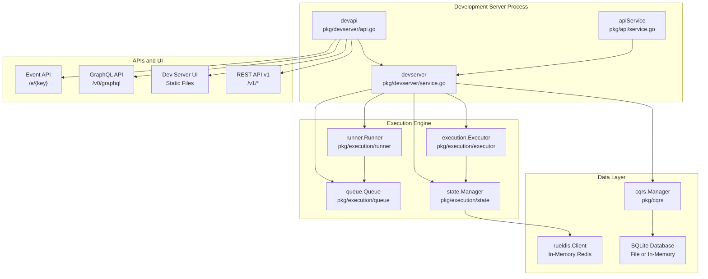
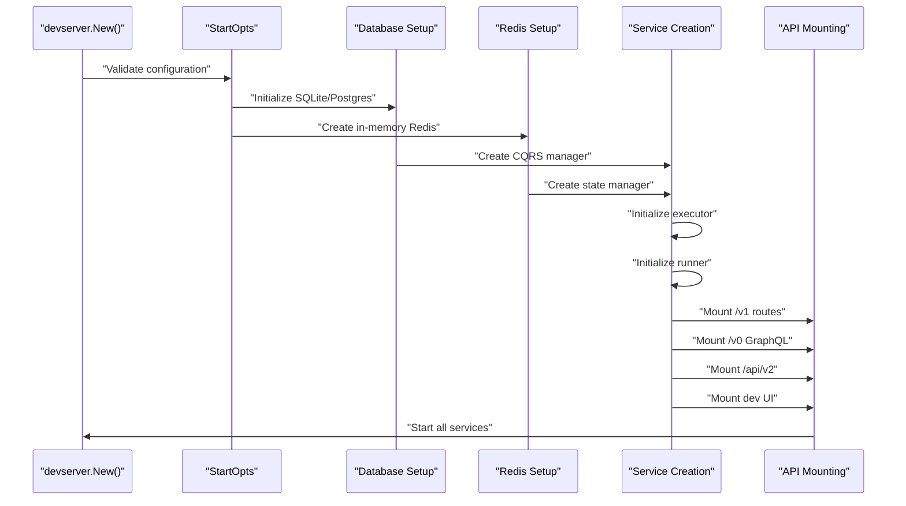
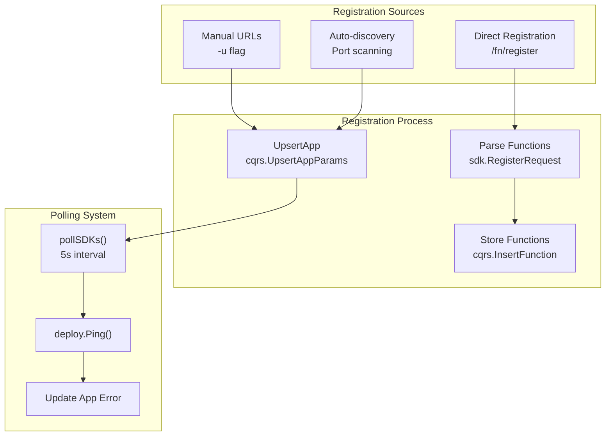
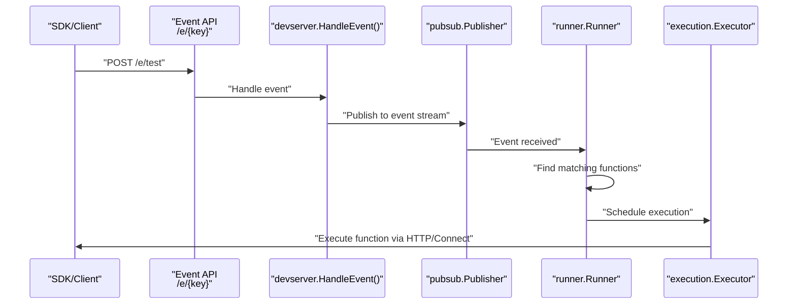
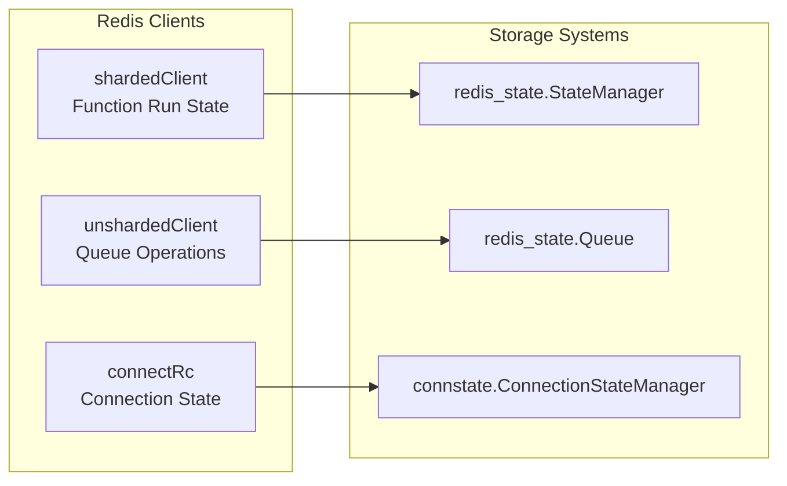
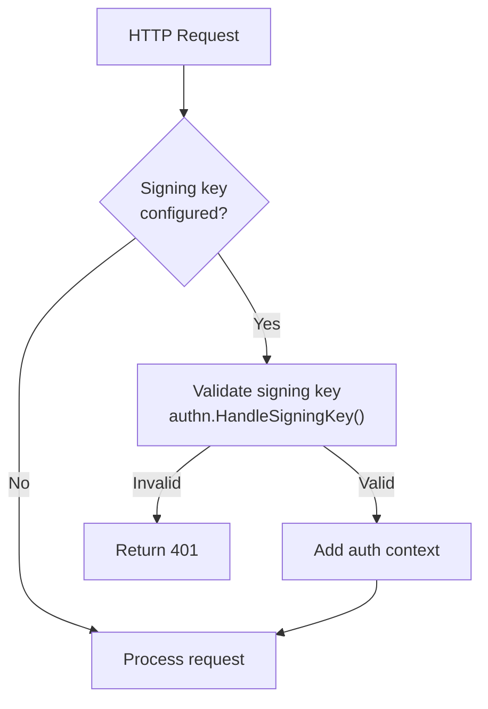

The development server provides a local environment that closely mirrors the production Inngest platform, enabling developers to test and debug serverless functions locally. It includes event ingestion, function execution, state management, and a web-based UI for monitoring and debugging.

For information about the production execution system architecture, see [Core Execution System](#2). For details about the UI components, see [User Interface and Dashboard](#5).

## Architecture Overview

The development server is implemented as a unified service that combines multiple production services into a single local instance, providing the full Inngest experience without external dependencies.

### Core Development Server Architecture



**Sources:** [pkg/devserver/devserver.go:149-670](), [pkg/devserver/service.go:41-68](), [pkg/devserver/api.go:51-109]()

### Service Startup and Configuration

The development server initialization follows a structured sequence that sets up all required components and services:



**Sources:** [pkg/devserver/devserver.go:162-670](), [pkg/devserver/service.go:149-161]()

## Core Services and Components

### DevServer Service Structure

The main `devserver` struct coordinates all development-specific functionality:

```go
type devserver struct {
    Opts StartOpts
    Data cqrs.Manager
    Runner runner.Runner
    State state.Manager
    Queue queue.Queue
    Executor execution.Executor
    Apiservice service.Service
    
    stepLimitOverrides map[string]int
    stateSizeLimitOverrides map[string]int
    handlers []SDKHandler
    handlerLock *sync.Mutex
}
```

| Component | Purpose | Configuration |
|-----------|---------|---------------|
| `StartOpts` | Server configuration including URLs, ports, keys | [pkg/devserver/devserver.go:95-142]() |
| `cqrs.Manager` | Database operations and function metadata | Uses SQLite by default |
| `runner.Runner` | Function scheduling and cron management | Integrated execution pipeline |
| `execution.Executor` | Step-by-step function execution | HTTP and Connect drivers |
| `state.Manager` | Function run state persistence | Redis-based storage |
| `queue.Queue` | Job queuing and processing | In-memory Redis queue |

**Sources:** [pkg/devserver/service.go:76-105](), [pkg/devserver/devserver.go:95-142]()

### API Endpoints and Routing

The development server exposes multiple API surfaces through a unified router:

| Mount Point | Purpose | Handler |
|-------------|---------|---------|
| `/` | Dev server UI and function registration | `devapi` router |
| `/v0` | GraphQL API and core operations | `coreapi.Router` |
| `/v1` | REST API for runs, events, functions | `apiv1` routes |
| `/api/v2` | Modern REST API | `apiv2.HTTPHandler` |
| `/e/{key}` | Event ingestion endpoint | Event API |
| `/debug` | Profiling and debugging tools | `middleware.Profiler()` |
| `/metrics` | Prometheus metrics | Metrics API |

**Sources:** [pkg/devserver/devserver.go:615-621](), [pkg/devserver/api.go:62-109]()

## Function Registration and Discovery

### SDK Registration Process

The development server supports both manual registration and automatic discovery of SDK endpoints:



**Sources:** [pkg/devserver/service.go:282-368](), [pkg/devserver/api.go:189-392]()

### Autodiscovery Mechanism

The autodiscovery system scans for local SDK servers and automatically registers them:

```go
// runDiscovery attempts to run autodiscovery while the dev server is running
func (d *devserver) runDiscovery(ctx context.Context) {
    pollInterval := time.Duration(d.Opts.PollInterval) * time.Second
    for d.Opts.Autodiscover {
        apps, err := d.Data.GetApps(ctx, consts.DevServerEnvID, nil)
        if err == nil && len(apps) > 0 {
            d.Opts.Autodiscover = false  // Disable after finding apps
        } else {
            _ = discovery.Autodiscover(ctx)
        }
        <-time.After(pollInterval)
    }
}
```

**Sources:** [pkg/devserver/service.go:260-278](), [pkg/devserver/service.go:350-365]()

## Event Processing and Execution

### Event Ingestion Flow

Events flow through the development server using the same pipeline as production:



**Sources:** [pkg/devserver/service.go:370-410](), [pkg/api/service.go:125-177]()

### Function Execution Drivers

The development server supports both HTTP and WebSocket-based function execution:

| Driver Type | Implementation | Use Case |
|-------------|----------------|----------|
| HTTP Driver | `httpv2.NewDriver()` | Traditional HTTP-based SDKs |
| Connect Driver | `connectgrpc.NewConnector()` | WebSocket-persistent connections |

The Connect Gateway runs on a separate port (default 8289) for WebSocket connections:

```go
connGateway := connect.NewConnectGatewayService(
    connect.WithConnectionStateManager(connectionManager),
    connect.WithGatewayAuthHandler(auth.NewJWTAuthHandler(consts.DevServerConnectJwtSecret)),
    connect.WithDev(),
    connect.WithGatewayPublicPort(opts.ConnectGatewayPort),
)
```

**Sources:** [pkg/devserver/devserver.go:384-397](), [pkg/devserver/devserver.go:572-582]()

## Storage and Data Management

### Database Configuration

The development server supports multiple database backends with automatic configuration:

| Database | Use Case | Configuration |
|----------|----------|---------------|
| SQLite | Default local development | File-based or in-memory |
| PostgreSQL | External database testing | Via `PostgresURI` |
| In-Memory | Ephemeral testing | `InMemory: true` |

```go
db, err := base_cqrs.New(base_cqrs.BaseCQRSOptions{
    InMemory:    opts.InMemory,
    PostgresURI: opts.PostgresURI,
    Directory:   opts.SQLiteDir,
})
```

**Sources:** [pkg/devserver/devserver.go:166-173]()

### Redis State Management

The development server uses Redis for queue management and state persistence:



**Sources:** [pkg/devserver/devserver.go:202-275](), [pkg/devserver/devserver.go:352-353]()

### Persistence and Snapshots

For single-node deployments, the development server can persist Redis state to the database:

```go
func (d *devserver) exportRedisSnapshot(ctx context.Context) error {
    snapshot := make(map[string]cqrs.SnapshotValue)
    
    // Export all Redis keys and values
    keys, err := rc.Do(ctx, rc.B().Keys().Pattern("*").Build()).AsStrSlice()
    // ... serialize data types (string, list, set, zset, hash)
    
    snapshotID, err = d.Data.InsertQueueSnapshot(ctx, cqrs.InsertQueueSnapshotParams{
        Snapshot: snapshot,
    })
}
```

**Sources:** [pkg/devserver/service.go:412-547](), [pkg/devserver/service.go:549-657]()

## Authentication and Security

### Signing Key Authentication

The development server supports optional signing key authentication that models production behavior:

```go
type StartOpts struct {
    SigningKey  *string  // Optional signing key for authentication
    EventKeys   []string // Keys for event ingestion authorization
    RequireKeys bool     // Whether keys are mandatory
}
```

When `RequireKeys` is true, the server validates:
- Signing keys for SDK registration and API access
- Event keys for event ingestion via `/e/{key}`

**Sources:** [pkg/devserver/devserver.go:108-119](), [pkg/authn/signing_key_strategy.go:31-53]()

### Authentication Middleware Flow



**Sources:** [pkg/authn/signing_key_strategy.go:31-53](), [pkg/authn/signing_key_strategy.go:55-75]()

## Development UI and Monitoring

### Static Asset Serving

The development server includes a built-in web UI served from embedded static files:

```go
func (a *devapi) addRoutes(AuthMiddleware func(http.Handler) http.Handler) {
    if !a.disableUI {
        staticFS, _ := fs.Sub(static, "static")
        a.Get("/images/*", http.FileServer(http.FS(staticFS)).ServeHTTP)
        a.Get("/assets/*", http.FileServer(http.FS(staticFS)).ServeHTTP)
        a.NotFound(a.UI)  // Catch-all for SPA routing
    }
}
```

**Sources:** [pkg/devserver/api.go:91-109]()

### Development-Specific APIs

The dev server provides additional endpoints for testing and debugging:

| Endpoint | Method | Purpose |
|----------|--------|---------|
| `/dev` | GET | Server info and function list |
| `/fn/register` | POST | Manual function registration |
| `/fn/remove` | DELETE | Remove registered app |
| `/fn/step-limit` | POST/DELETE | Override step limits for testing |
| `/fn/state-size-limit` | POST/DELETE | Override state size limits |
| `/dev/traces` | POST | OTLP trace ingestion |

**Sources:** [pkg/devserver/api.go:76-89](), [pkg/devserver/api.go:138-186]()

### Function Override Capabilities

The development server allows runtime overrides for testing edge cases:

```go
type devserver struct {
    stepLimitOverrides      map[string]int
    stateSizeLimitOverrides map[string]int
    
    // Applied in executor configuration
    executor.WithStepLimits(func(id sv2.ID) int {
        if override, hasOverride := stepLimitOverrides[id.FunctionID.String()]; hasOverride {
            return override
        }
        return consts.DefaultMaxStepLimit
    })
}
```

**Sources:** [pkg/devserver/devserver.go:441-456](), [pkg/devserver/api.go:585-631]()