## Purpose and Scope

This document covers Inngest's Redis-based distributed queue system, which is responsible for managing the execution order, concurrency, and reliability of function runs across the platform. The system handles job scheduling, partition-based load distribution, backlog management, and constraint enforcement.

For information about function execution logic, see [Executor and Function Execution](#2.2). For details about SDK communication patterns, see [HTTP Driver and SDK Communication](#2.3).

## Architecture Overview

The distributed queue system is built around a Redis-backed, partition-based architecture that provides ordered processing, concurrency control, and fairness guarantees across multiple tenants and functions.

### System Architecture

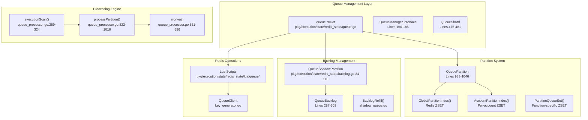

Sources: [pkg/execution/state/redis_state/queue.go:734-891](), [pkg/execution/state/redis_state/queue_processor.go:259-324](), [pkg/execution/state/redis_state/backlog.go:84-110]()

### Key Components

| Component | Purpose | Key File |
|-----------|---------|----------|
| `queue` struct | Main queue implementation and coordination | [queue.go:734-891]() |
| `QueuePartition` | Function-specific ordered queue | [queue.go:983-1046]() |  
| `QueueShadowPartition` | Manages backlogs for constrained items | [backlog.go:84-110]() |
| `QueueBacklog` | Holds items awaiting constraint resolution | [backlog.go:287-303]() |
| Lua Scripts | Atomic Redis operations | [lua/queue/]() |

Sources: [pkg/execution/state/redis_state/queue.go:734-891](), [pkg/execution/state/redis_state/backlog.go:84-110](), [pkg/execution/state/redis_state/lua/queue/]()

## Core Queue Operations

### Enqueue Process

The enqueue process places items into the appropriate partition and manages backlog assignment when constraints prevent immediate processing.

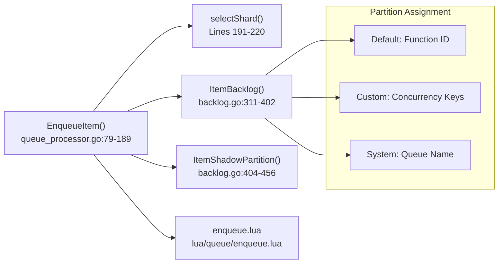

The `Enqueue` method in [queue_processor.go:79-189]() handles job placement by:

1. **Shard Selection**: Determines target Redis shard via `selectShard()` 
2. **Backlog Assignment**: Calls `ItemBacklog()` to determine backlog based on concurrency keys and throttle configuration
3. **Shadow Partition**: Uses `ItemShadowPartition()` to identify the shadow partition for backlog management
4. **Atomic Enqueue**: Executes [enqueue.lua]() for atomic Redis operations

Sources: [pkg/execution/state/redis_state/queue_processor.go:79-189](), [pkg/execution/state/redis_state/backlog.go:311-402](), [pkg/execution/state/redis_state/lua/queue/enqueue.lua]()

### Dequeue and Processing

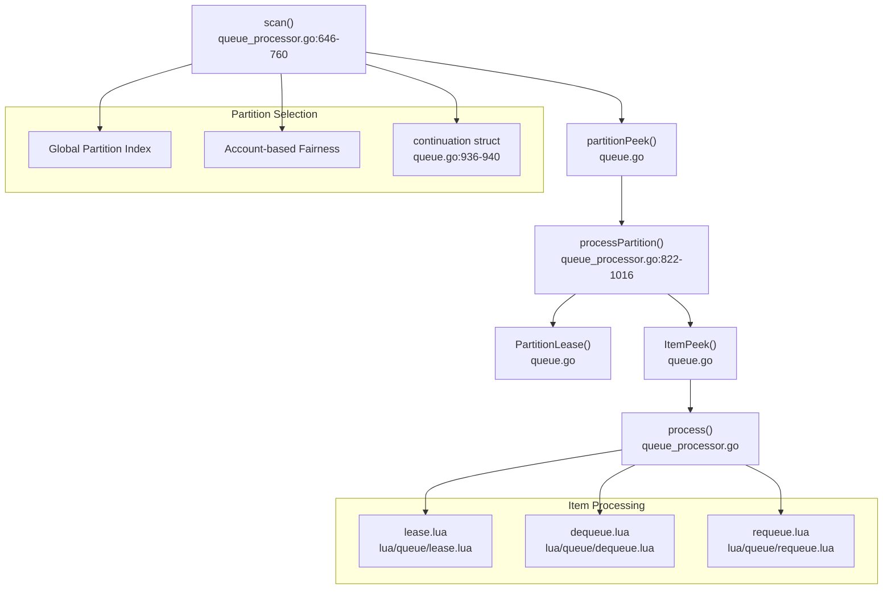

The processing flow operates through several stages:

1. **Partition Discovery**: `scan()` method discovers available partitions using global or account-specific indexes
2. **Partition Leasing**: `PartitionLease()` acquires exclusive access to a partition via [partitionLease.lua]()
3. **Item Leasing**: Individual items are leased using [lease.lua]() with concurrency and throttle checks
4. **Processing**: Items are passed to workers and either dequeued on success or requeued on failure

Sources: [pkg/execution/state/redis_state/queue_processor.go:646-760](), [pkg/execution/state/redis_state/queue_processor.go:822-1016](), [pkg/execution/state/redis_state/lua/queue/lease.lua]()

## Partition-Based Architecture

### Partition Types and Organization

The queue system uses multiple partition types to organize work and enforce ordering guarantees:

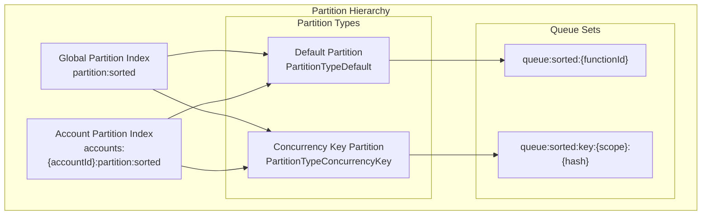

The `QueuePartition` struct [queue.go:983-1046]() represents individual partitions with these key fields:

- **ID**: Unique partition identifier (function ID for default, generated for custom)
- **PartitionType**: Integer value from `enums.PartitionType`
- **ConcurrencyScope**: Scope level for concurrency key partitions
- **FunctionID**: Associated function UUID
- **AccountID**: Owning account for fairness
- **LeaseID**: Current partition lease holder

Sources: [pkg/execution/state/redis_state/queue.go:983-1046](), [pkg/execution/state/redis_state/key_generator.go:182]()

### Partition Selection and Fairness

The system implements fairness through weighted partition selection:

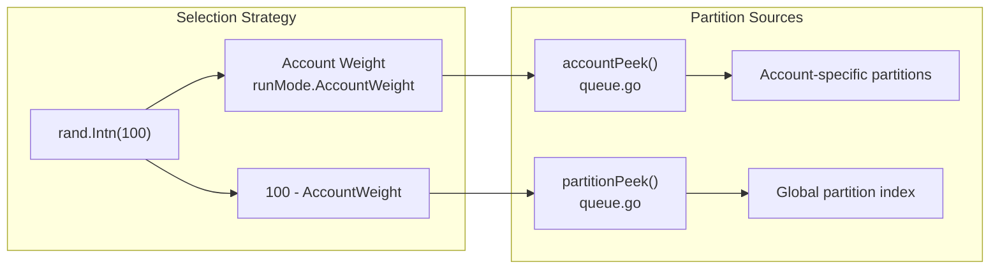

The selection logic in [queue_processor.go:662-666]() uses the `runMode.AccountWeight` to balance between:
- **Account-based processing**: Ensures fairness across tenants
- **Global processing**: Optimizes for overall throughput

Sources: [pkg/execution/state/redis_state/queue_processor.go:662-666](), [pkg/execution/state/redis_state/queue.go:893-932]()

## Backlog and Shadow Partition System

### Shadow Partition Architecture

Shadow partitions manage backlogs containing items that cannot be immediately processed due to constraints:

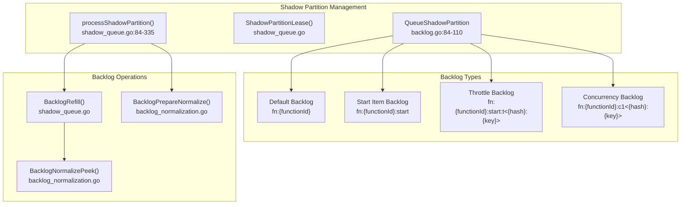

### Backlog Types and Structure

The `ItemBacklog()` method [backlog.go:311-402]() creates backlog identifiers based on item characteristics:

| Backlog Type | ID Pattern | Purpose |
|--------------|------------|---------|
| Default Function | `fn:{functionId}` | Standard function items |
| Start Items | `fn:{functionId}:start` | New function run starts |
| Throttled | `fn:{functionId}:start:t<{hash}:{key}>` | Rate-limited items |
| Concurrency Key | `fn:{functionId}:c{n}<{hash}:{key}>` | Custom concurrency constraints |

Sources: [pkg/execution/state/redis_state/backlog.go:311-402](), [pkg/execution/state/redis_state/backlog.go:334-400]()

### Backlog Refill Process

The backlog refill process moves items from backlogs to ready queues when constraints allow:

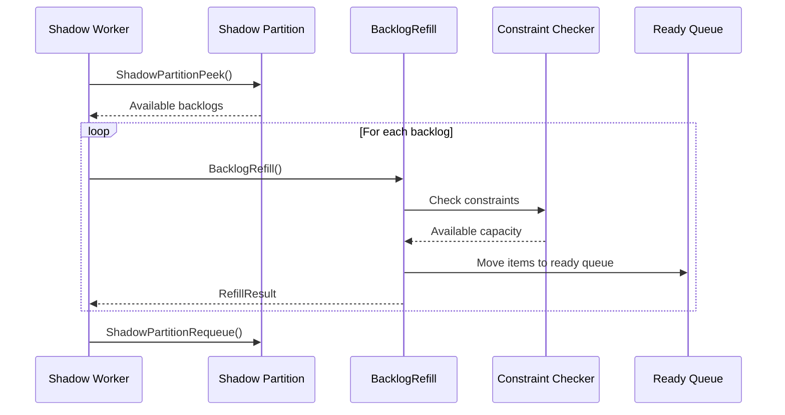

The `BacklogRefill()` operation [shadow_queue.go]() uses [backlogRefill.lua]() to atomically:
1. **Check Constraints**: Validate concurrency limits and throttle capacity
2. **Calculate Capacity**: Determine how many items can be refilled
3. **Move Items**: Transfer items from backlog to ready queue
4. **Update Metadata**: Adjust partition pointers and active sets

Sources: [pkg/execution/state/redis_state/shadow_queue.go:337-511](), [pkg/execution/state/redis_state/lua/queue/backlogRefill.lua]()

## Worker Processing Model

### Worker Architecture

The queue system uses a multi-threaded worker pool architecture with different worker types:

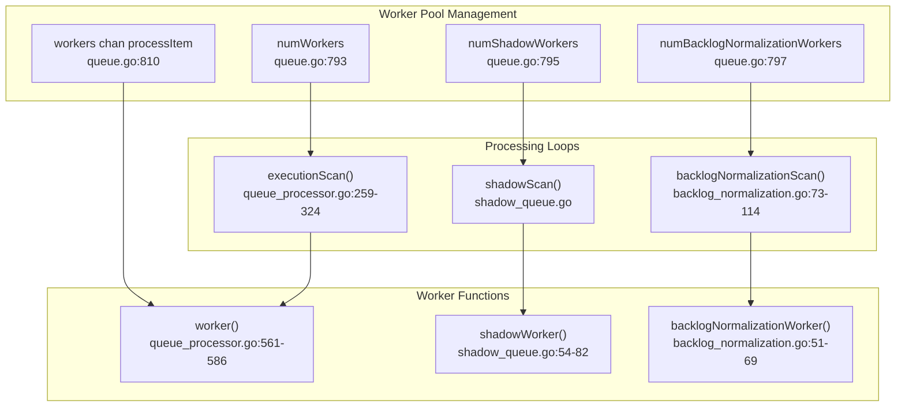

### Worker Coordination

The `Run()` method [queue_processor.go:222-257]() coordinates multiple processing goroutines:

1. **Execution Workers**: Process ready queue items via `executionScan()`
2. **Shadow Workers**: Manage backlog refill via `shadowScan()`
3. **Normalization Workers**: Handle backlog normalization via `backlogNormalizationScan()`
4. **Sequential Lease**: Single worker claims sequential processing rights
5. **Scavenger**: Recovers lost jobs periodically

Sources: [pkg/execution/state/redis_state/queue_processor.go:222-257](), [pkg/execution/state/redis_state/queue_processor.go:561-586](), [pkg/execution/state/redis_state/shadow_queue.go:54-82]()

### Continuation System

The continuation system optimizes sequential processing by allowing workers to continue processing the same partition:

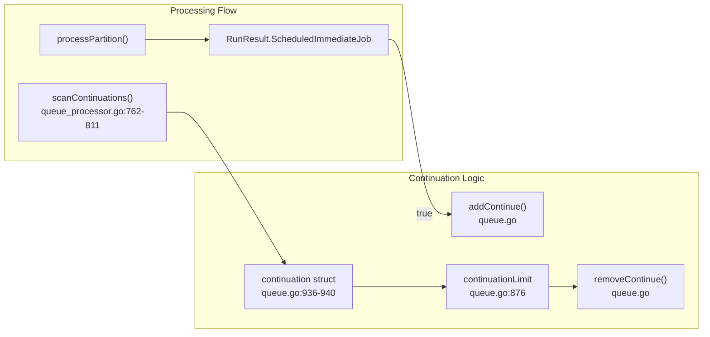

The continuation mechanism in [queue.go:936-940]() allows workers to:
- **Skip Partition Discovery**: Process known partitions immediately
- **Reduce Latency**: Minimize inter-step delays
- **Prevent Starvation**: Limit continuation count via `continuationLimit`

Sources: [pkg/execution/state/redis_state/queue.go:936-940](), [pkg/execution/state/redis_state/queue_processor.go:762-811]()

## Concurrency and Constraint Management

### Constraint Types and Hierarchy

The queue system enforces multiple constraint types to control resource usage and execution ordering:

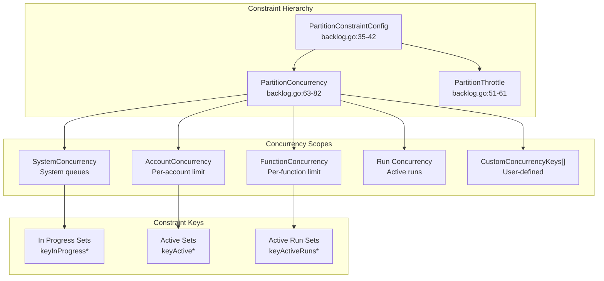

### Constraint Enforcement

Constraints are enforced at multiple points through Redis-based atomic operations:

| Constraint Type | Redis Key Pattern | Enforcement Point |
|-----------------|-------------------|-------------------|
| Account Concurrency | `{queue}:in-progress:account:{accountId}` | Item lease via [lease.lua:94-104]() |
| Function Concurrency | `{queue}:in-progress:p:{functionId}` | Item lease via [lease.lua:105-115]() |
| Custom Concurrency | `{queue}:in-progress:{scope}:{keyHash}` | Item lease via [lease.lua:116-136]() |
| Throttling | `{queue}:throttle:{keyHash}` | GCRA rate limiting in [lease.lua:97-103]() |

The `partitionConstraintConfigGetter` function [queue.go:654-663]() provides dynamic constraint configuration, while Lua scripts enforce these constraints atomically during item leasing.

Sources: [pkg/execution/state/redis_state/backlog.go:35-42](), [pkg/execution/state/redis_state/lua/queue/lease.lua:94-136](), [pkg/execution/state/redis_state/queue.go:654-663]()

### Backlog Constraint Resolution

When constraints prevent immediate processing, items are moved to backlogs for later refill:

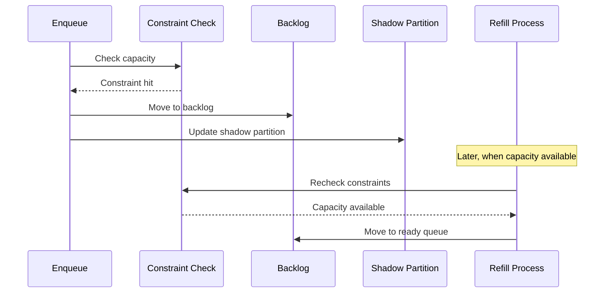

The constraint resolution process uses the `BacklogRefillResult` struct to communicate constraint status and retry timing, enabling efficient backlog processing without excessive polling.

Sources: [pkg/execution/state/redis_state/shadow_queue.go:337-511](), [pkg/execution/state/redis_state/backlog.go:461-510]()

# Executor and Function Execution


The executor is the core engine responsible for orchestrating function execution in Inngest. It coordinates the step-by-step execution of functions, manages state persistence, handles pauses and retries, and communicates with external SDKs to run user code.

This document covers the execution engine's internal architecture and operation. For information about the distributed queue system that feeds work to the executor, see [Distributed Queue System](#2.1). For details about SDK communication protocols, see [HTTP Driver and SDK Communication](#2.3) and [Connect Gateway and WebSocket Workers](#2.4).

## Executor Architecture

The executor system consists of several key components that work together to execute functions reliably:

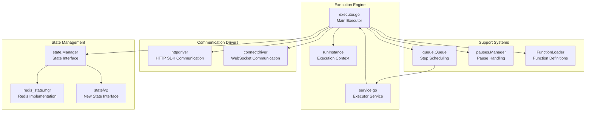

**Executor Components and Their Roles**

Sources: [pkg/execution/executor/executor.go:85-115](), [pkg/execution/executor/service.go:99-116](), [pkg/execution/execution.go:53-134]()

## Execution Interface

The executor implements a well-defined interface for function execution:

| Method | Purpose | Key Responsibilities |
|--------|---------|---------------------|
| `Schedule()` | Initialize new function runs | Create state, validate inputs, enqueue first step |
| `Execute()` | Run individual function steps | Load state, execute via drivers, save results |
| `Resume()` | Continue paused functions | Handle `waitForEvent` and timeout scenarios |
| `Cancel()` | Terminate function runs | Clean up state, prevent future execution |

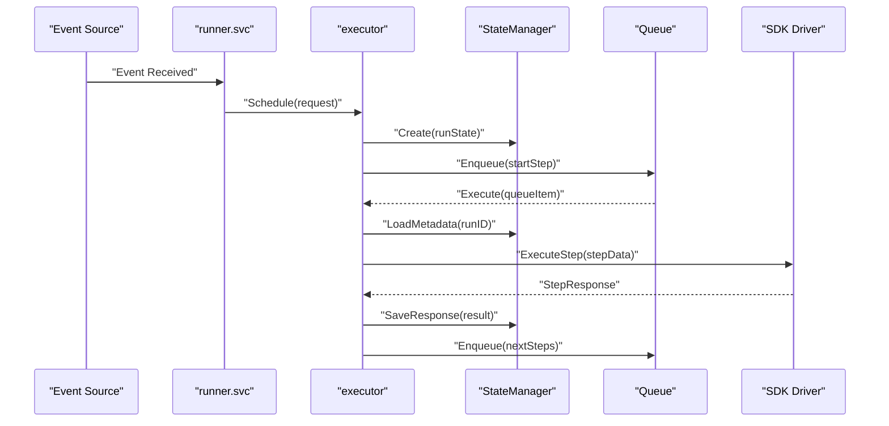

**Function Execution Flow**

Sources: [pkg/execution/execution.go:54-92](), [pkg/execution/executor/executor.go:520-903](), [pkg/execution/executor/executor.go:919-1327]()

## Executor Implementation

The executor maintains several key dependencies and handles complex execution scenarios:

### Core Dependencies

The executor requires several injected dependencies to operate:

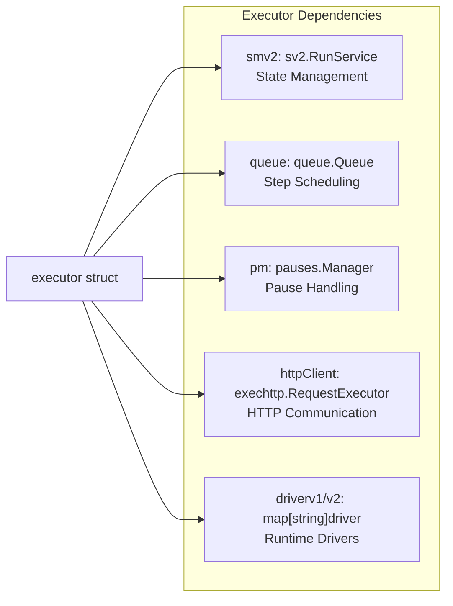

**Executor Dependencies**

Sources: [pkg/execution/executor/executor.go:345-391](), [pkg/execution/executor/executor.go:117-320]()

### Function Scheduling

When a function is triggered by an event, the `Schedule()` method handles initialization:

1. **Validation**: Verify required parameters and function configuration
2. **Idempotency**: Check for existing runs using idempotency keys
3. **State Creation**: Initialize function state with event data
4. **Queue Scheduling**: Enqueue the initial execution step

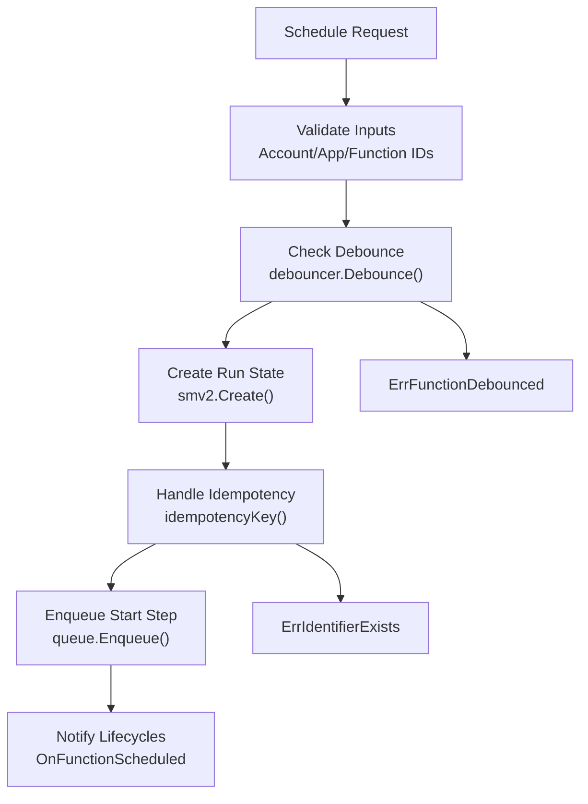

**Function Scheduling Flow**

Sources: [pkg/execution/executor/executor.go:520-903](), [pkg/execution/executor/executor.go:430-453]()

## Step Execution

The `Execute()` method handles individual step execution within a function run:

### Execution Context

Each step execution operates within a `runInstance` that encapsulates:

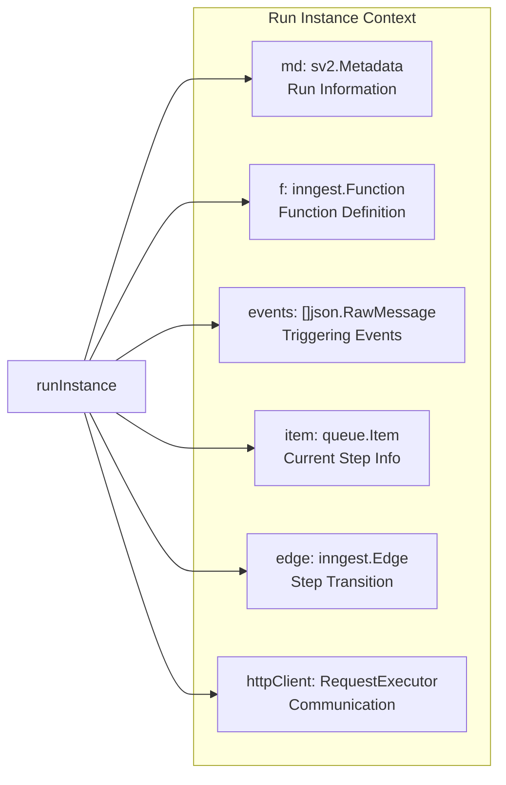

**Run Instance Components**

Sources: [pkg/execution/executor/executor.go:1114-1123](), [pkg/execution/executor/executor.go:919-1041]()

### Step Processing

The executor processes steps through a well-defined sequence:

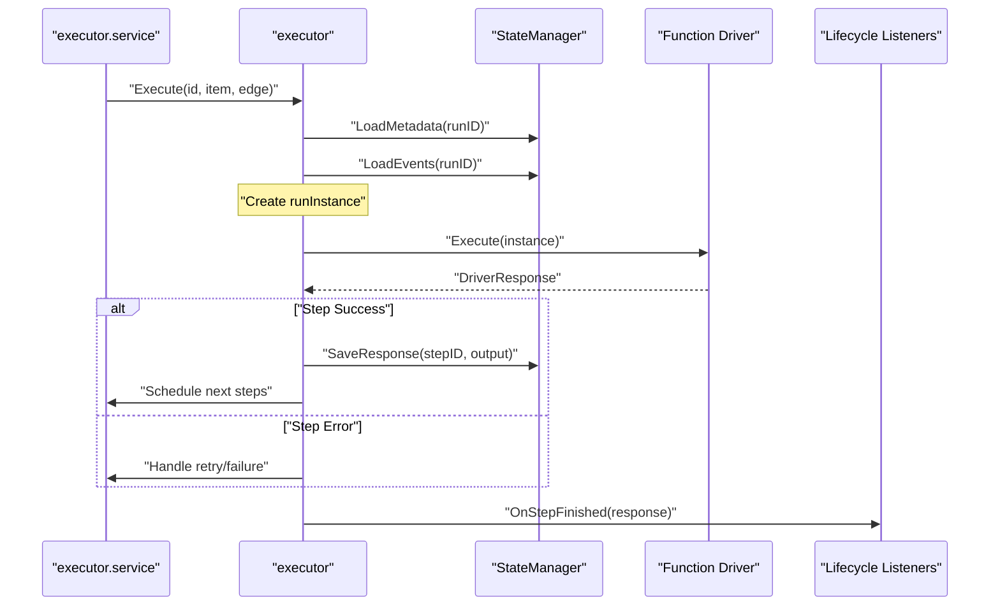

**Step Execution Sequence**

Sources: [pkg/execution/executor/executor.go:919-1327](), [pkg/execution/executor/service.go:290-338]()

## State Management Integration

The executor integrates closely with the state management system to persist execution progress:

### State Operations

| Operation | Purpose | Implementation |
|-----------|---------|----------------|
| `Create()` | Initialize new run state | Creates metadata, events, initial steps |
| `LoadMetadata()` | Get run information | Loads configuration and status |
| `LoadEvents()` | Get triggering events | Retrieves original event data |
| `SaveResponse()` | Persist step results | Stores output and updates stack |
| `Delete()` | Clean up completed runs | Removes all run data |

### State Validation

The executor includes validation logic to ensure runs can proceed:

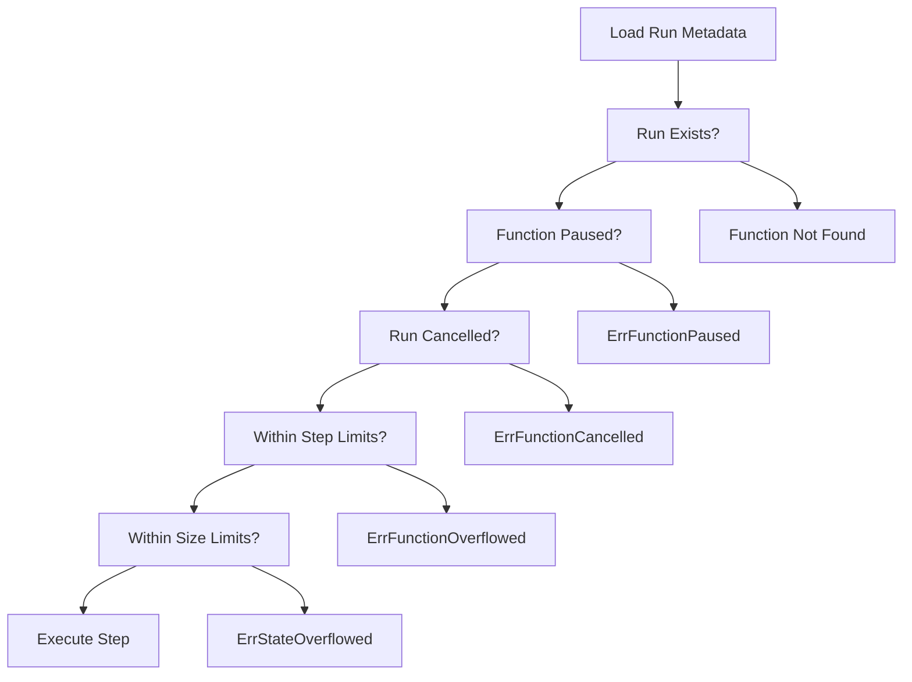

**Run Validation Flow**

Sources: [pkg/execution/executor/executor.go:1013-1041](), [pkg/execution/executor/validator.go]()

## Service Layer

The executor service provides the operational wrapper that processes queue items:

### Queue Item Processing

The service handles different types of queue items:

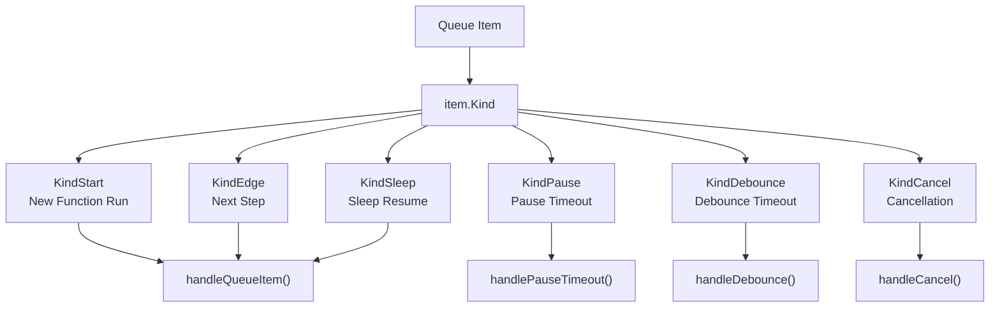

**Queue Item Processing**

Sources: [pkg/execution/executor/service.go:235-280](), [pkg/execution/executor/service.go:290-338]()

### Error Handling

The service implements sophisticated error handling for different execution scenarios:

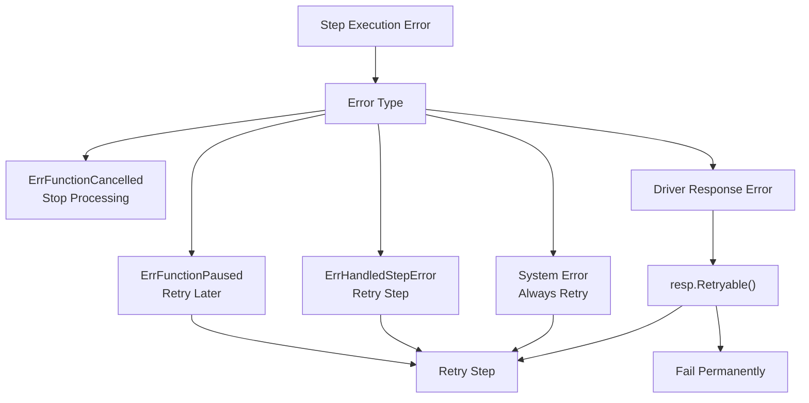

**Error Handling Logic**

Sources: [pkg/execution/executor/service.go:290-338](), [pkg/execution/executor/service.go:218-233]()

## Lifecycle Integration

The executor provides extensive lifecycle hooks for monitoring and observability:

### Lifecycle Events

```mermaid
sequenceDiagram
    participant Executor as "Executor"
    participant History as "History Listener"
    participant DevServer as "Dev Server Listener"
    participant Tracing as "Tracing System"
    
    Note over Executor: "Function Scheduled"
    Executor->>History: "OnFunctionScheduled(metadata, item)"
    Executor->>DevServer: "OnFunctionScheduled(metadata, item)"
    
    Note over Executor: "Function Started"  
    Executor->>History: "OnFunctionStarted(metadata, events)"
    Executor->>Tracing: "Update span status"
    
    Note over Executor: "Step Finished"
    Executor->>History: "OnStepFinished(response, error)"
    Executor->>Tracing: "Create step spans"
    
    Note over Executor: "Function Completed"
    Executor->>History: "OnFunctionFinished(response)"
    Executor->>DevServer: "Update function run status"
```

**Lifecycle Event Flow**

Sources: [pkg/execution/executor/executor.go:411-428](), [pkg/execution/history/lifecycle.go:26-449](), [pkg/devserver/lifecycle.go:15-57]()

The executor system provides the core orchestration for reliable, observable function execution in Inngest, handling the complex coordination between state management, SDK communication, and operational concerns like retries and lifecycle tracking.

# HTTP Driver and SDK Communication


The HTTP driver is Inngest's primary mechanism for communicating with external Software Development Kits (SDKs) to execute function steps. This system handles the request/response cycle between the Inngest execution engine and user-defined functions running in various SDK environments.

For information about WebSocket-based communication with SDKs, see [Connect Gateway and WebSocket Workers](#2.4). For details on the executor that coordinates function execution, see [Executor and Function Execution](#2.2).

## Overview and Architecture

The HTTP driver implements a request/response pattern where the Inngest executor makes HTTP requests to SDK endpoints to trigger step execution. The driver handles request marshaling, HTTP communication, response parsing, and error management.

### Core Components

```mermaid
graph TB
    Executor["executor.Execute()"] --> MarshalV1["driver.MarshalV1()"]
    MarshalV1 --> ExecuteDriverRequest["httpdriver.ExecuteDriverRequest()"]
    ExecuteDriverRequest --> HTTPClient["exechttp.RequestExecutor"]
    HTTPClient --> SDKEndpoint["SDK HTTP Endpoint"]
    SDKEndpoint --> HandleHttpResponse["httpdriver.HandleHttpResponse()"]
    HandleHttpResponse --> DriverResponse["state.DriverResponse"]
    DriverResponse --> Executor

    ExecuteDriverRequest --> Sign["httpdriver.Sign()"]
    Sign --> HTTPClient

    HandleHttpResponse --> ParseGenerator["httpdriver.ParseGenerator()"]
    HandleHttpResponse --> ParseStream["httpdriver.ParseStream()"]
    ParseGenerator --> DriverResponse
    ParseStream --> DriverResponse
```

Sources: [pkg/execution/driver/httpdriver/httpdriver.go:57-104](), [pkg/execution/driver/httpdriver/httpdriver.go:129-156](), [pkg/execution/driver/httpdriver/httpdriver.go:158-267]()

The `httpdriver.executor` struct is the main implementation that fulfills the `driver.DriverV1` interface. It contains an HTTP client and signing key configuration for secure communication with SDKs.

## Request Structure and Marshaling

### SDK Request Format

The HTTP driver constructs requests using the `SDKRequest` structure which contains all necessary context for function execution:

| Field | Type | Purpose |
|-------|------|---------|
| `Event` | `map[string]any` | Triggering event data |
| `Events` | `[]map[string]any` | All events for the function run |
| `Actions` | `map[string]any` | Previously executed step results |
| `Context` | `*SDKRequestContext` | Execution context and metadata |
| `Version` | `int` | Request format version |
| `UseAPI` | `bool` | Flag for request size optimization |

Sources: [pkg/execution/driver/request.go:10-22]()

### Request Context Details

The `SDKRequestContext` provides execution-specific metadata:

```mermaid
graph LR
    SDKRequestContext --> FunctionID["FunctionID: uuid.UUID"]
    SDKRequestContext --> RunID["RunID: ulid.ULID"]
    SDKRequestContext --> StepID["StepID: string"]
    SDKRequestContext --> Attempt["Attempt: int"]
    SDKRequestContext --> Stack["Stack: *FunctionStack"]
    SDKRequestContext --> UseAPI["UseAPI: bool"]
    Stack --> StackItems["Stack: []string"]
    Stack --> Current["Current: int"]
```

Sources: [pkg/execution/driver/request.go:24-61](), [pkg/execution/driver/request.go:63-66]()

## HTTP Communication Protocol

### Request Execution Flow

The `ExecuteDriverRequest` function orchestrates the complete HTTP request lifecycle:

```mermaid
sequenceDiagram
    participant Executor as "httpdriver.executor"
    participant Driver as "ExecuteDriverRequest"
    participant Client as "exechttp.RequestExecutor"
    participant SDK as "External SDK"

    Executor->>Driver: "Execute request with marshaled input"
    Driver->>Driver: "Add stepId query parameter"
    Driver->>Client: "do() - Make HTTP request"
    Client->>SDK: "POST with JSON payload + headers"
    SDK-->>Client: "HTTP Response (200/201/206)"
    Client-->>Driver: "Response + timing metrics"
    Driver->>Driver: "HandleHttpResponse()"
    Driver-->>Executor: "state.DriverResponse"
```

Sources: [pkg/execution/driver/httpdriver/httpdriver.go:129-156](), [pkg/execution/driver/httpdriver/httpdriver.go:269-428]()

### Request Headers and Security

The HTTP driver adds several headers for authentication and metadata:

- `X-Inngest-Signature`: HMAC signature for request authentication
- `X-Run-ID`: Unique identifier for the function run
- `Content-Type`: Always set to `application/json`
- `account-id`: Account identifier for feature flagging

The signing mechanism uses HMAC-SHA256 with a timestamp to prevent replay attacks:

```mermaid
graph LR
    SigningKey["Signing Key"] --> HMAC["HMAC-SHA256"]
    RequestBody["Request Body"] --> HMAC
    Timestamp["Unix Timestamp"] --> HMAC
    HMAC --> Signature["t={timestamp}&s={signature}"]
```

Sources: [pkg/execution/driver/httpdriver/util.go:21-38]()

## Response Handling and Processing

### Response Types

The HTTP driver handles three distinct response patterns based on HTTP status codes:

| Status Code | Response Type | Handler | Purpose |
|------------|---------------|---------|---------|
| 200 | Standard Response | `ParseResponse()` | Regular function execution result |
| 201 | Streaming Response | `ParseStream()` | Streamed function execution with embedded status |
| 206 | Generator Response | `ParseGenerator()` | SDK-based step functions with opcodes |

Sources: [pkg/execution/driver/httpdriver/httpdriver.go:162-200](), [pkg/execution/driver/httpdriver/httpdriver.go:372-391]()

### Generator Response Processing

Generator responses (status 206) contain opcodes that represent SDK operations:

```mermaid
graph TB
    GeneratorResponse["HTTP 206 Response"] --> ParseGenerator["ParseGenerator()"]
    ParseGenerator --> ValidateOpcodes["Validate Each Opcode"]
    ValidateOpcodes --> OpcodeStep["OpcodeStep"]
    ValidateOpcodes --> OpcodeSleep["OpcodeSleep"]
    ValidateOpcodes --> OpcodeWaitForEvent["OpcodeWaitForEvent"]
    ValidateOpcodes --> OpcodeStepError["OpcodeStepError"]
    OpcodeStep --> DriverResponse["state.DriverResponse"]
    OpcodeSleep --> DriverResponse
    OpcodeWaitForEvent --> DriverResponse
    OpcodeStepError --> DriverResponse
```

Sources: [pkg/execution/driver/httpdriver/parse.go:17-89](), [pkg/execution/state/opcode.go:23-47]()

### Error Handling and Retry Logic

The driver implements sophisticated retry logic based on HTTP status codes and SDK version compatibility:

```mermaid
flowchart TD
    HTTPResponse["HTTP Response"] --> CheckStatus{"Status Code?"}
    CheckStatus -->|"2xx"| CheckSDK{"Is SDK Response?"}
    CheckStatus -->|"4xx"| Check4xxRetry["ShouldRetry()"]
    CheckStatus -->|"5xx"| SetRetryable["Mark as Retryable"]
    
    CheckSDK -->|"Yes"| Success["Success Response"]
    CheckSDK -->|"No"| NotSDKError["ErrNotSDK"]
    
    Check4xxRetry --> CheckNoRetryHeader{"No-Retry Header?"}
    CheckNoRetryHeader -->|"true"| NoRetry["Mark NoRetry"]
    CheckNoRetryHeader -->|"false/missing"| CheckSDKVersion["Check SDK Version"]
    CheckSDKVersion --> VersionBasedRetry["Version-Based Retry Decision"]
```

Sources: [pkg/execution/driver/httpdriver/util.go:40-90](), [pkg/execution/driver/httpdriver/httpdriver.go:229-267]()

## Request Size Optimization

The HTTP driver implements request size optimization to handle large function state while respecting serverless platform limits:

### Size-Based Request Modification

When function state exceeds `consts.MaxSDKRequestBodySize`, the driver switches to an API-based approach:

```mermaid
graph TD
    MarshalRequest["Marshal SDKRequest"] --> CheckSize{"Size > MaxSDKRequestBodySize?"}
    CheckSize -->|"No"| IncludeState["Include Full State in Request"]
    CheckSize -->|"Yes"| EmptyState["Empty Events and Actions"]
    EmptyState --> SetUseAPI["Set UseAPI = true"]
    SetUseAPI --> ReMarshal["Re-marshal Smaller Request"]
    IncludeState --> FinalRequest["Final HTTP Request"]
    ReMarshal --> FinalRequest
```

Sources: [pkg/execution/driver/driver.go:194-218]()

## Integration with Execution System

The HTTP driver integrates with the broader execution system through well-defined interfaces:

### Driver Interface Implementation

The `httpdriver.executor` implements the `driver.DriverV1` interface:

```mermaid
classDiagram
    class DriverV1 {
        <<interface>>
        +Name() string
        +Execute(ctx, sl, md, item, edge, step, stackIndex, attempt) DriverResponse
    }
    
    class executor {
        -Client exechttp.RequestExecutor
        -localSigningKey []byte
        -requireLocalSigningKey bool
        +Name() string
        +Execute(ctx, sl, md, item, edge, step, stackIndex, attempt) DriverResponse
    }
    
    DriverV1 <|-- executor
```

Sources: [pkg/execution/driver/driver.go:62-82](), [pkg/execution/driver/httpdriver/httpdriver.go:45-104]()

### State Integration

The HTTP driver works closely with the state management system to provide execution context and store results:

```mermaid
graph LR
    StateLoader["sv2.StateLoader"] --> LoadEvents["LoadEvents()"]
    StateLoader --> LoadSteps["LoadSteps()"]
    LoadEvents --> SDKRequest["Build SDKRequest"]
    LoadSteps --> SDKRequest
    SDKRequest --> HTTPDriver["HTTP Driver"]
    HTTPDriver --> DriverResponse["state.DriverResponse"]
    DriverResponse --> StateManager["Update State"]
```

Sources: [pkg/execution/driver/driver.go:84-219](), [pkg/execution/state/driver_response.go:48-108]()

The HTTP driver serves as the critical bridge between Inngest's execution engine and external SDKs, providing robust communication, error handling, and state management capabilities that enable reliable serverless function execution across diverse runtime environments.