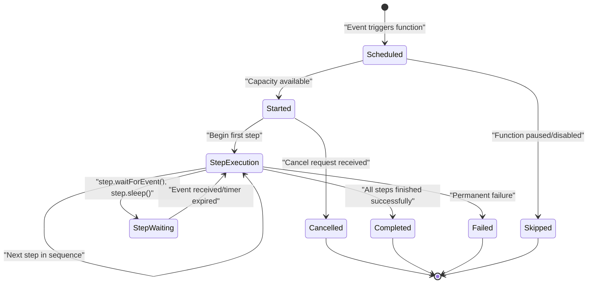
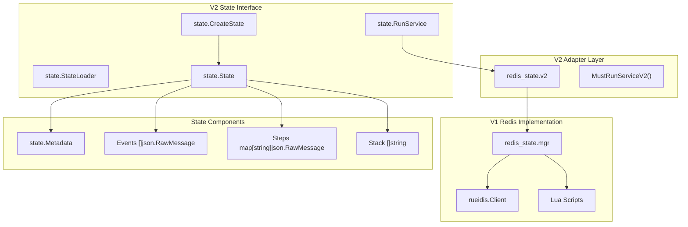
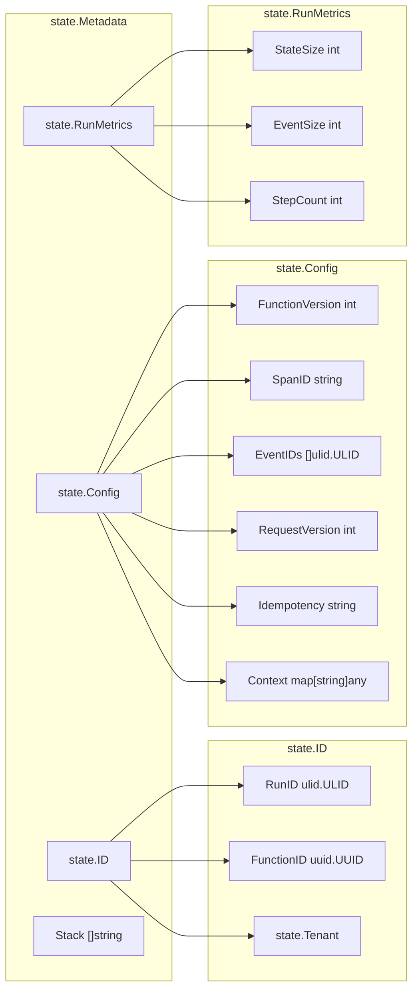
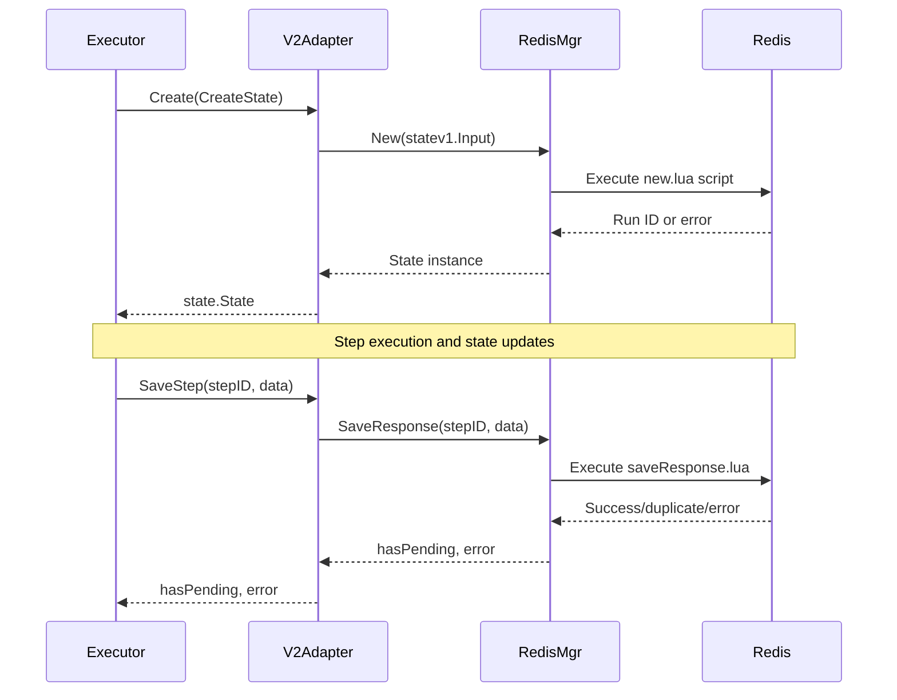
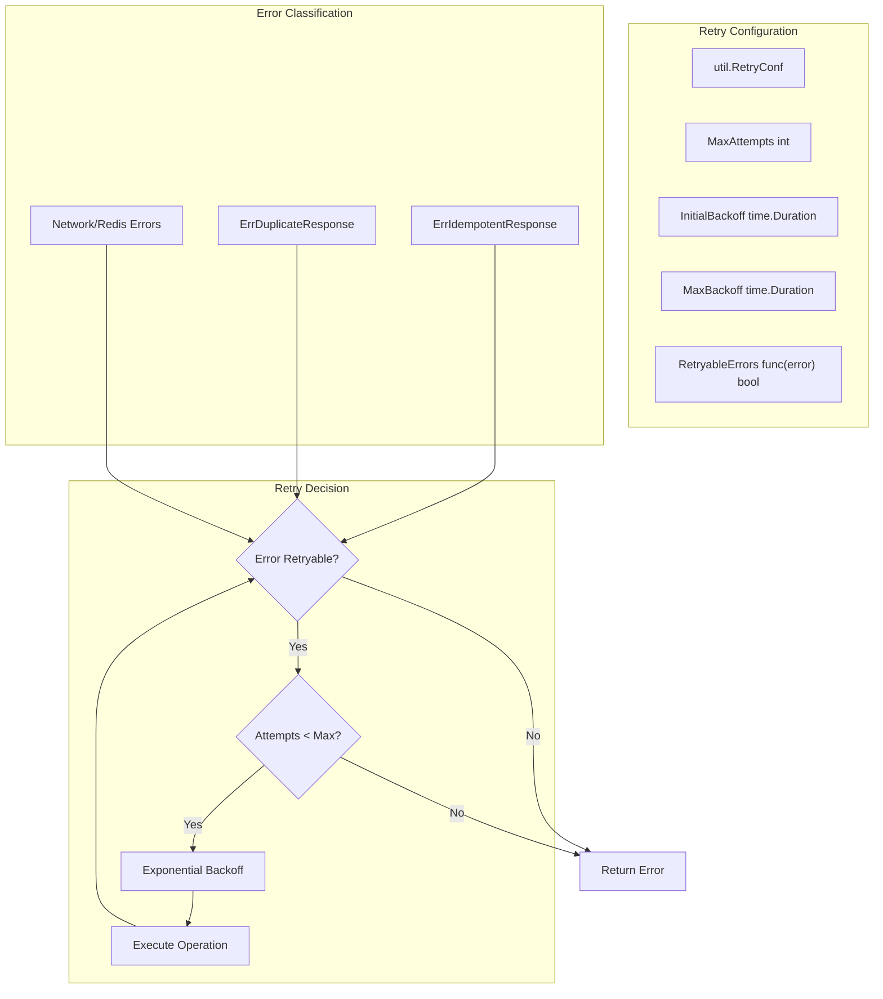
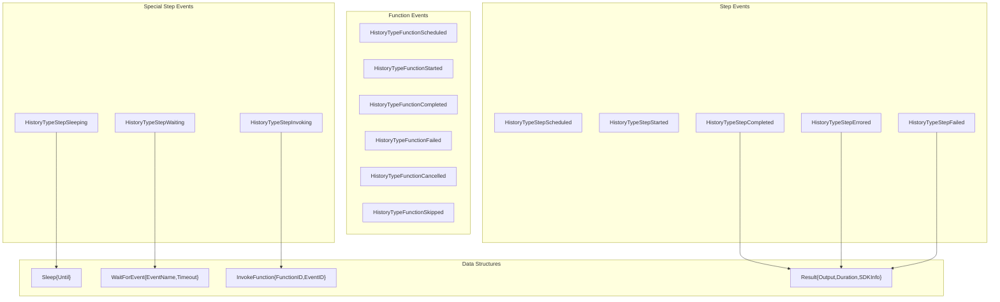
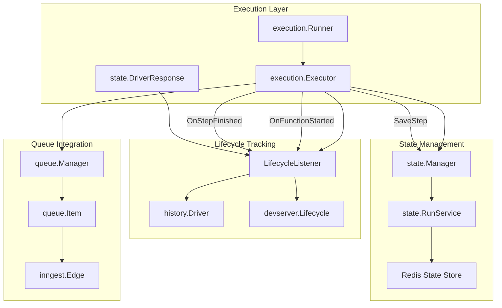

## Purpose and Scope

This document covers how Inngest manages function execution lifecycle and persistent state throughout a function's run. It details the event-driven lifecycle tracking system, the Redis-backed state persistence layer, and the history recording mechanisms that enable function execution monitoring and debugging.

For information about the queue system that schedules function execution, see [Distributed Queue System](#2.1). For details on how functions are defined and configured, see [Function Schema and CUE Configuration](#3.1).

## Function Lifecycle Overview

Functions in Inngest progress through a well-defined lifecycle with state changes tracked at both the function and individual step levels. The lifecycle system provides hooks for observability, history recording, and coordination between different system components.

### High-Level Lifecycle Flow

*Sources: [pkg/execution/lifecycle.go:29-202](), [pkg/execution/history/lifecycle.go:49-263]()*

## Lifecycle Event System

The lifecycle system is built around the `LifecycleListener` interface, which defines hooks for all major state transitions. Multiple listeners can be registered to handle different concerns like history recording, metrics collection, and debugging.

### Core Lifecycle Interface

The `LifecycleListener` interface defines callbacks for function and step lifecycle events:

```mermaid
graph TB
    LifecycleListener["LifecycleListener Interface"]
    
    subgraph "Function-Level Events"
        OnFunctionScheduled["OnFunctionScheduled()"]
        OnFunctionStarted["OnFunctionStarted()"] 
        OnFunctionFinished["OnFunctionFinished()"]
        OnFunctionCancelled["OnFunctionCancelled()"]
        OnFunctionSkipped["OnFunctionSkipped()"]
    end
    
    subgraph "Step-Level Events"
        OnStepScheduled["OnStepScheduled()"]
        OnStepStarted["OnStepStarted()"]
        OnStepFinished["OnStepFinished()"]
        OnStepGatewayRequestFinished["OnStepGatewayRequestFinished()"]
    end
    
    subgraph "Special Step Events"
        OnWaitForEvent["OnWaitForEvent()"]
        OnWaitForEventResumed["OnWaitForEventResumed()"]
        OnSleep["OnSleep()"]
        OnInvokeFunction["OnInvokeFunction()"]
        OnInvokeFunctionResumed["OnInvokeFunctionResumed()"]
    end
    
    LifecycleListener --> OnFunctionScheduled
    LifecycleListener --> OnFunctionStarted
    LifecycleListener --> OnFunctionFinished
    LifecycleListener --> OnFunctionCancelled
    LifecycleListener --> OnFunctionSkipped
    LifecycleListener --> OnStepScheduled
    LifecycleListener --> OnStepStarted
    LifecycleListener --> OnStepFinished
    LifecycleListener --> OnStepGatewayRequestFinished
    LifecycleListener --> OnWaitForEvent
    LifecycleListener --> OnWaitForEventResumed
    LifecycleListener --> OnSleep
    LifecycleListener --> OnInvokeFunction
    LifecycleListener --> OnInvokeFunctionResumed
```

*Sources: [pkg/execution/lifecycle.go:29-202]()*

### Lifecycle Event Flow

Each lifecycle event carries specific metadata about the function run and execution context:

| Event Type | Trigger Condition | Key Data |
|------------|------------------|----------|
| `OnFunctionScheduled` | Function queued for execution | `Metadata`, `queue.Item`, tracked events |
| `OnFunctionStarted` | Function begins execution | `Metadata`, `queue.Item`, latency metrics |
| `OnStepScheduled` | Step queued for execution | `Metadata`, `queue.Item`, step name |
| `OnStepStarted` | Step begins execution | `Metadata`, `inngest.Edge`, execution URL |
| `OnStepFinished` | Step completes or fails | `Metadata`, `state.DriverResponse`, execution error |
| `OnFunctionFinished` | Function completes or fails permanently | `Metadata`, final `state.DriverResponse` |

*Sources: [pkg/execution/lifecycle.go:33-202]()*

## State Storage Architecture

Function state is persisted using a two-tier architecture with both v1 (legacy) and v2 interfaces. The v2 interface provides a cleaner abstraction while maintaining backward compatibility through an adapter pattern.

### State Storage Components

*Sources: [pkg/execution/state/v2/interfaces.go:23-75](), [pkg/execution/state/redis_state/v2_adapter.go:18-40]()*

### State Metadata Structure

The state metadata contains comprehensive information about a function run:

*Sources: [pkg/execution/state/v2/state_metadata.go:88-144](), [pkg/execution/state/v2/state_metadata.go:482-507]()*

## State Operations

The state management system provides comprehensive CRUD operations for function runs, with built-in retry logic and error handling.

### Core State Operations

| Operation | Purpose | Return Values |
|-----------|---------|---------------|
| `Create()` | Initialize new function run state | `State`, `error` |
| `LoadState()` | Retrieve complete run state | `State`, `error` |  
| `LoadMetadata()` | Get run metadata only | `Metadata`, `error` |
| `LoadEvents()` | Get triggering events | `[]json.RawMessage`, `error` |
| `LoadSteps()` | Get all step outputs | `map[string]json.RawMessage`, `error` |
| `SaveStep()` | Store step output | `hasPending bool`, `error` |
| `UpdateMetadata()` | Update run configuration | `error` |
| `Delete()` | Remove all run data | `bool`, `error` |

*Sources: [pkg/execution/state/v2/interfaces.go:34-52]()*

### State Creation and Lifecycle

*Sources: [pkg/execution/state/redis_state/v2_adapter.go:59-161](), [pkg/execution/state/redis_state/lua/new.lua:1-58](), [pkg/execution/state/redis_state/lua/saveResponse.lua:1-48]()*

### Retry Logic and Error Handling

The v2 adapter includes sophisticated retry logic with configurable backoff and error classification:

*Sources: [pkg/execution/state/redis_state/v2_adapter.go:395-412](), [pkg/util/retry.go:76-142]()*

## History Tracking

The history system records all lifecycle events for observability, debugging, and auditing. History entries are written through pluggable drivers that can store data in different backends.

### History Data Model

The `History` struct captures comprehensive information about each lifecycle event:

| Field | Type | Purpose |
|-------|------|---------|
| `Type` | `string` | Event type (see `enums.HistoryType`) |
| `RunID` | `ulid.ULID` | Function run identifier |
| `FunctionID` | `uuid.UUID` | Function identifier |
| `StepName` | `*string` | Human-readable step name |
| `StepID` | `*string` | Step identifier for correlation |
| `Result` | `*Result` | Step output, timing, SDK info |
| `CreatedAt` | `time.Time` | Timestamp of event |
| `Attempt` | `int64` | Retry attempt number |
| `LatencyMS` | `*int64` | System latency metrics |

*Sources: [pkg/execution/history/history.go:18-54]()*

### History Event Types

The history system tracks different categories of events with specific data structures:

*Sources: [pkg/execution/history/lifecycle.go:70-91](), [pkg/execution/history/history.go:55-116]()*

## Integration with Execution System

The lifecycle and state management systems integrate closely with the core execution engine to provide a complete function execution platform.

### Component Integration Flow

*Sources: [pkg/execution/history/lifecycle.go:26-34](), [pkg/devserver/lifecycle.go:15-21](), [pkg/execution/state/redis_state/v2_adapter.go:18-56]()*

The state management and lifecycle systems work together to provide reliable function execution with comprehensive observability. State is persisted at each step to enable recovery from failures, while lifecycle events create an audit trail for debugging and monitoring function behavior.