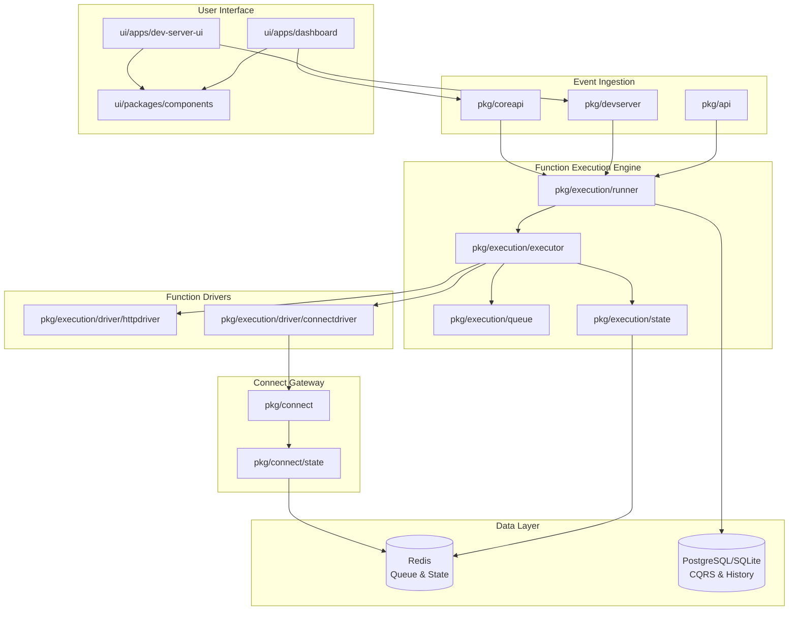
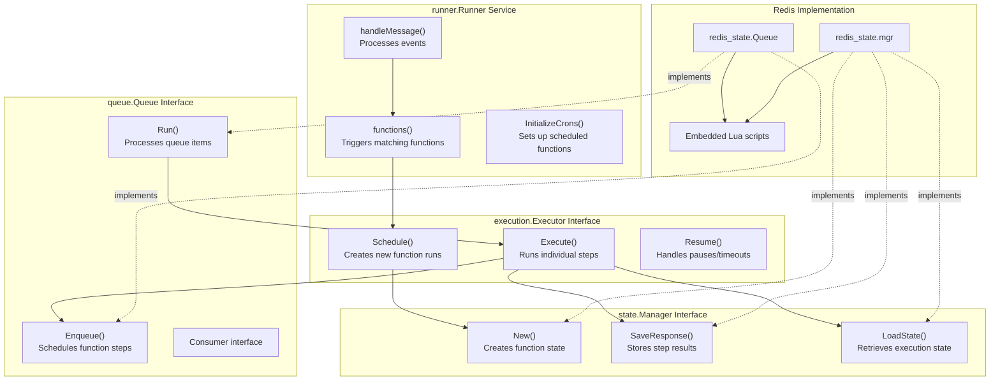
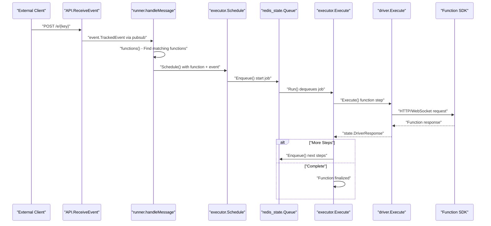
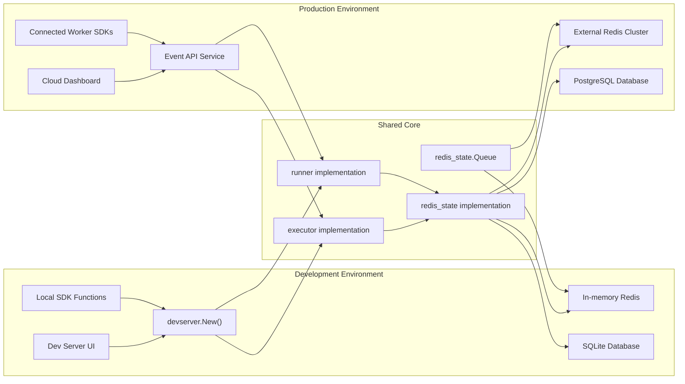

This document provides a high-level introduction to the Inngest serverless function platform architecture, covering the core execution system, development environment, APIs, and user interfaces. Inngest orchestrates event-driven functions with features like retries, batching, debouncing, pausing, and complex workflow management.

For detailed information about specific subsystems, see [Core Execution System](#2), [Function Definition and Configuration](#3), [Development Experience](#4), [User Interface and Dashboard](#5), [APIs and Backend Services](#6), and [SDK Integration](#7).

## System Architecture Overview

The Inngest platform consists of several interconnected systems that work together to provide a complete serverless function execution environment:

Sources: [pkg/devserver/devserver.go:149-576](), [pkg/execution/executor/executor.go:80-115](), [pkg/execution/runner/runner.go:118-124](), [pkg/api/api.go:47-75]()

## Core Component Architecture

The platform's core components map directly to specific code entities and follow clear separation of concerns:

Sources: [pkg/execution/execution.go:53-87](), [pkg/execution/executor/executor.go:345-391](), [pkg/execution/runner/runner.go:48-56](), [pkg/execution/state/state.go:1-52](), [pkg/execution/state/redis_state/redis_state.go:170-193]()

## Event Processing Flow

Events flow through the system following a predictable pattern from ingestion to function execution:

Sources: [pkg/api/api.go:140-199](), [pkg/execution/runner/runner.go:325-362](), [pkg/execution/executor/executor.go:520-903](), [pkg/execution/executor/service.go:235-339]()

## Development vs Production Architecture

The platform supports both development and production deployments with shared core components but different operational characteristics:

Sources: [pkg/devserver/devserver.go:162-244](), [pkg/devserver/service.go:41-68](), [pkg/execution/state/redis_state/redis_state.go:132-157]()

## Function Lifecycle Management

Functions in Inngest follow a well-defined lifecycle from registration through execution to completion:

| Phase | Component | Key Operations |
|-------|-----------|----------------|
| Registration | `devserver.Register()` | Parse function config, validate triggers, store in CQRS |
| Triggering | `runner.functions()` | Match events to functions, evaluate expressions |
| Scheduling | `executor.Schedule()` | Create run state, handle idempotency, enqueue start job |
| Execution | `executor.Execute()` | Load function, execute steps via drivers, manage state |
| State Management | `redis_state.mgr` | Persist step results, handle pauses, track completion |
| Monitoring | Dashboard UI | Display runs, metrics, traces, allow debugging |

Sources: [pkg/devserver/api.go:189-231](), [pkg/execution/runner/runner.go:495-580](), [pkg/execution/executor/executor.go:520-903](), [pkg/execution/state/redis_state/redis_state.go:233-362]()

## Key Configuration and Extensibility Points

The platform provides several key interfaces and configuration points for customization:

- **Drivers**: Implement `driver.DriverV1` or `driver.DriverV2` interfaces to support different execution environments
- **State Backends**: Implement `state.Manager` interface for alternative storage systems  
- **Queue Backends**: Implement `queue.Queue` interface for different queuing systems
- **Event Handlers**: Configure `EventHandler` functions for custom event processing
- **Middleware**: Add HTTP middleware through `chi.Router` mounting points
- **Feature Flags**: Control functionality through environment variables and config

The modular architecture allows components to be swapped or extended while maintaining compatibility with the core execution model.

Sources: [pkg/execution/driver/driver.go](), [pkg/execution/state/state.go:1-52](), [pkg/execution/queue/queue.go](), [pkg/api/api.go:27-45](), [pkg/config/registration/registration.go]()