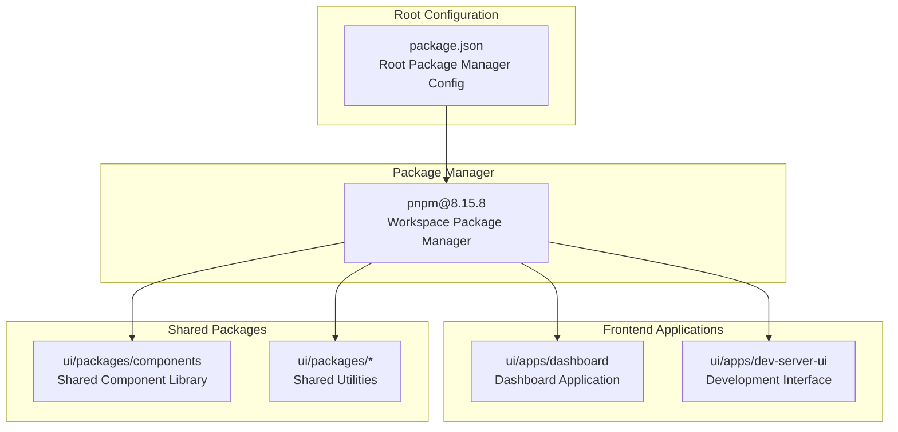
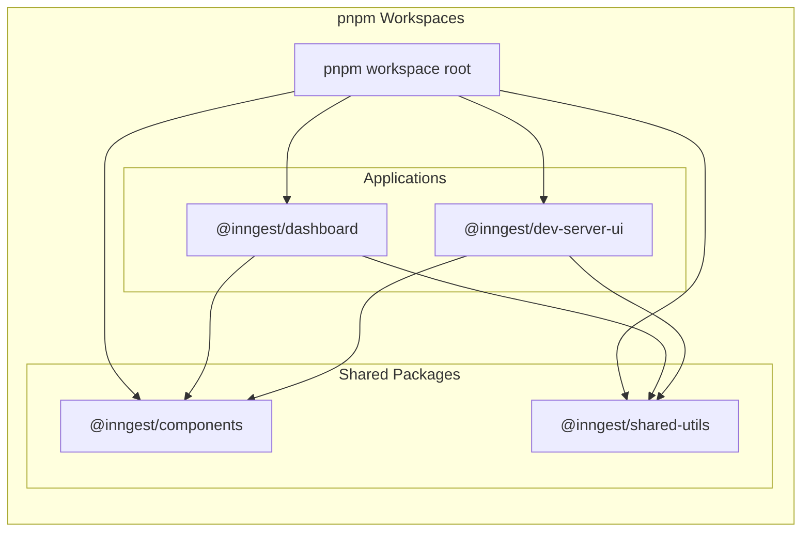
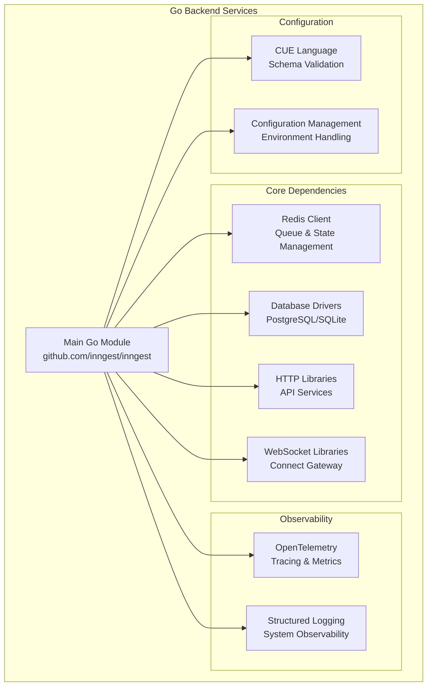
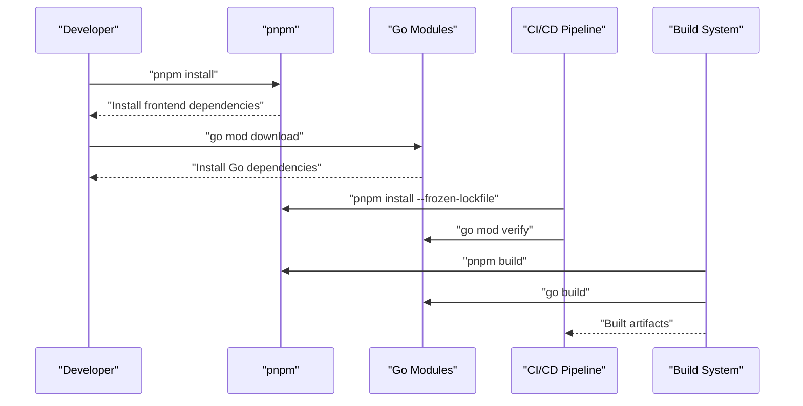

## Purpose and Scope

This document covers the package management and dependency structure across the Inngest codebase. It focuses on the configuration and tooling used to manage dependencies in both the frontend (JavaScript/TypeScript) and backend (Go) components of the platform.

For information about the build system and release processes, see [Build System and Release Process](#4.2). For details about the UI architecture and component organization, see [UI Architecture and Component System](#5.3).

## Package Management Overview

The Inngest codebase uses a hybrid package management approach, reflecting its multi-language architecture with Go backend services and TypeScript/JavaScript frontend applications.

### Root Package Configuration

The root package configuration specifies the primary package manager for the JavaScript/TypeScript ecosystem:

**Sources:** [package.json:1-3]()

The root configuration establishes `pnpm@8.15.8` as the package manager, indicating a monorepo structure optimized for workspace management and dependency deduplication.

## Frontend Package Management Structure

Based on the UI architecture, the frontend uses pnpm workspaces to manage multiple applications and shared packages:

**Sources:** [package.json:1-3]()

### PNPM Workspace Benefits

The use of pnpm provides several advantages for the Inngest monorepo structure:

| Feature | Benefit | Impact on Inngest |
|---------|---------|-------------------|
| Content-addressable storage | Disk space efficiency | Reduces storage overhead for multiple UI packages |
| Fast installs | Improved CI/CD performance | Faster build times for dashboard and dev server |
| Strict dependency resolution | Prevents phantom dependencies | More reliable builds across UI applications |
| Workspace support | Monorepo management | Efficient management of shared component library |

## Backend Dependency Management

The Go backend services use Go modules for dependency management:

**Sources:** [package.json:1-3]()

## Build System Integration

Package management integrates with the build system to support both development and production workflows:

**Sources:** [package.json:1-3]()

## Development Workflow

The package management setup supports efficient development workflows:

### Frontend Development
- **Workspace hoisting**: Shared dependencies are installed once at the workspace root
- **Hot reloading**: Development servers can watch for changes across packages  
- **Cross-package development**: Local linking between shared components and applications

### Backend Development  
- **Module caching**: Go modules are cached for faster builds
- **Version pinning**: Consistent dependency versions across environments
- **Vendor support**: Optional vendoring for air-gapped deployments

### Cross-Language Coordination
The build system coordinates between frontend and backend package management to ensure:
- Compatible build artifacts for embedded UI components
- Synchronized release versions across languages
- Consistent development environment setup

**Sources:** [package.json:1-3]()