This page covers Inngest's OpenTelemetry-based tracing and observability system, which provides detailed execution visibility for functions, steps, and lifecycle events. The system tracks function runs from scheduling through completion, capturing performance metrics, execution context, and detailed step-by-step execution traces.

For information about function execution mechanics, see [Executor and Function Execution](#2.2). For details about the dashboard UI that displays trace data, see [Function Runs Monitoring and Visualization](#5.2).

## System Architecture

Inngest's observability system is built on OpenTelemetry standards but includes custom implementations to work around SDK limitations for cross-boundary span reconstruction. The system captures traces for the complete function lifecycle and converts them into user-facing formats.

### Core Tracing Flow

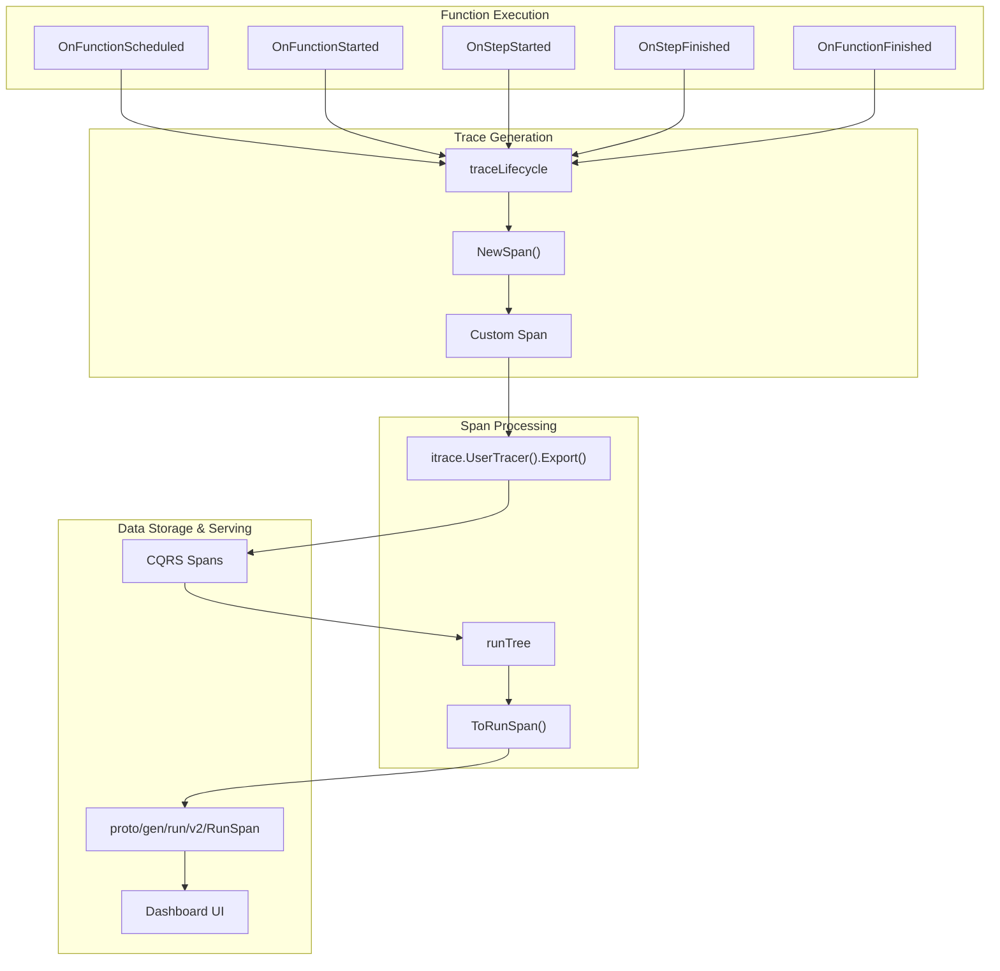

Sources: [pkg/run/trace_lifecycle.go:29-37](), [pkg/run/span.go:211-281](), [pkg/run/trace.go:28-139]()

### Span Scopes and Hierarchies

Inngest uses a hierarchical scope system to organize spans by their execution context:

| Scope | Purpose | Parent |
|-------|---------|--------|
| `trigger.inngest` | Function scheduling/triggering | Root |
| `function.app.env.inngest` | Function execution lifecycle | Trigger |
| `step.function.app.env.inngest` | Individual step operations | Function |
| `execution.function.app.env.inngest` | Step execution details | Step |
| `userland.inngest` | User code spans | Any |

Sources: [pkg/consts/otel.go:100-114]()

## Lifecycle Tracing

The `traceLifecycle` component implements `execution.LifecycleListener` to capture all function execution events and generate corresponding spans with rich metadata.

### Function Lifecycle Events

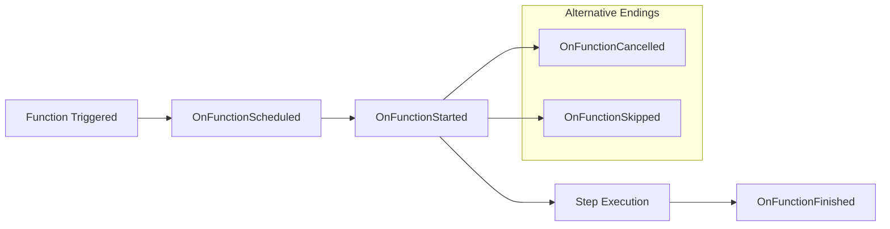

#### OnFunctionScheduled
Captures when a function is queued for execution:
- Creates trigger span with scope `trigger.inngest`
- Records event IDs, batch information, cron schedules
- Handles invoke correlation for function-to-function calls

Sources: [pkg/run/trace_lifecycle.go:45-162]()

#### OnFunctionStarted
Marks the beginning of function execution:
- Creates function span with scope `function.app.env.inngest`
- Extracts or generates span ID for execution tracking
- Records function metadata and runtime context

Sources: [pkg/run/trace_lifecycle.go:164-253]()

#### OnFunctionFinished
Completes function execution tracking:
- Updates function span with final status and output
- Handles success (200) vs error status codes
- Records function output and AI usage flags

Sources: [pkg/run/trace_lifecycle.go:255-350]()

### Step Execution Tracing

Individual steps within functions are tracked with detailed execution context:

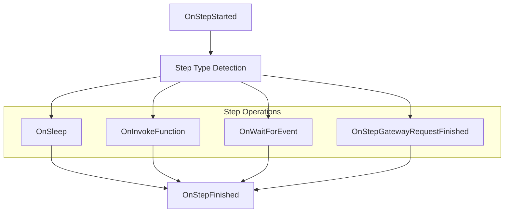

Sources: [pkg/run/trace_lifecycle.go:542-895]()

## Custom Span Implementation

Due to OpenTelemetry SDK limitations in reconstructing spans across execution boundaries, Inngest implements a custom span system that mimics the official OpenTelemetry data structures.

### Span Creation and Management

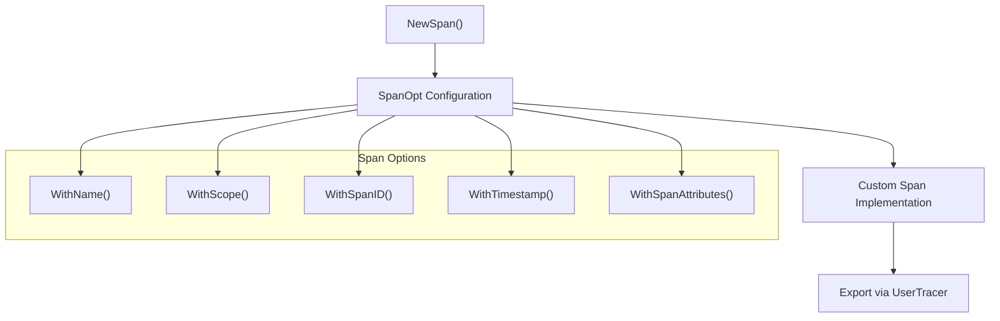

The custom `Span` struct embeds `tracesdk.ReadWriteSpan` and provides additional functionality for function and step data:

```go
type Span struct {
    tracesdk.ReadWriteSpan
    sync.Mutex
    // Core span data
    start    time.Time
    end      time.Time
    name     string
    attrs    []attribute.KeyValue
    status   tracesdk.Status
    // ... additional fields
}
```

Sources: [pkg/run/span.go:294-317](), [pkg/run/span.go:211-281]()

### Span Data Methods

The custom span provides specialized methods for setting execution data:

| Method | Purpose | Attribute Key |
|--------|---------|---------------|
| `SetFnOutput()` | Function return value | `sys.function.output` |
| `SetStepInput()` | Step input data | `sys.step.input` |
| `SetStepOutput()` | Step result data | `sys.step.output` |
| `SetAIRequestMetadata()` | AI gateway request | `sys.step.ai.req` |
| `SetAIResponseMetadata()` | AI gateway response | `sys.step.ai.res` |

Sources: [pkg/run/span.go:549-575](), [pkg/consts/otel.go:44-67]()

## Span Tree Construction

The `runTree` system processes raw spans into hierarchical structures for the UI, handling span grouping, retry attempts, and step relationships.

### Tree Building Process

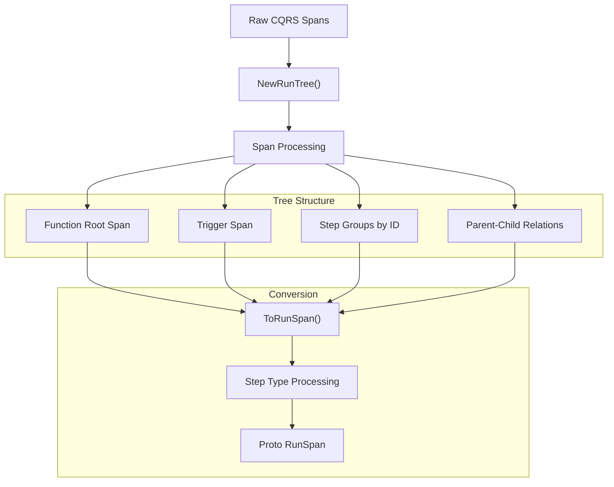

### Step Type Processing

The tree builder handles different step operations with specialized processing:

| Step Type | Opcode | Processing Method |
|-----------|---------|------------------|
| Function Steps | `OpcodeStepRun` | `processStepRunGroup()` |
| Sleep Operations | `OpcodeSleep` | `processSleepGroup()` |
| Event Waiting | `OpcodeWaitForEvent` | `processWaitForEventGroup()` |
| Function Invocation | `OpcodeInvokeFunction` | `processInvokeGroup()` |
| AI Gateway | `OpcodeAIGateway` | `processAIGatewayGroup()` |

Each processor handles retry attempts, status determination, and output capture specific to the operation type.

Sources: [pkg/run/trace.go:64-139](), [pkg/run/trace.go:203-331](), [pkg/run/trace.go:438-580]()

## OpenTelemetry Constants

Inngest maintains comprehensive constants for standardized tracing attributes and scopes to ensure consistency across the system.

### System Attributes

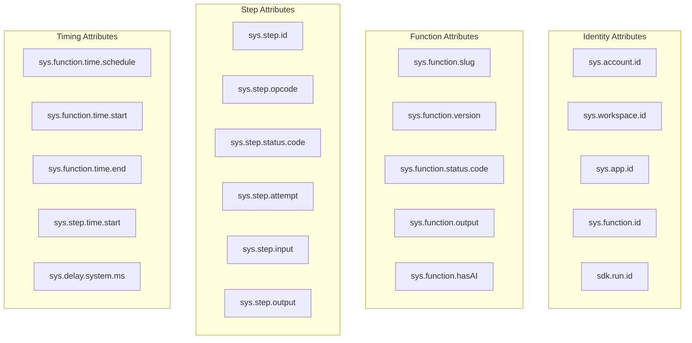

Sources: [pkg/consts/otel.go:18-94]()

### Trace Propagation

Inngest uses custom trace propagation for cross-function invocation and pause/resume operations:

| Constant | Usage |
|----------|-------|
| `OtelPropagationKey` | Trace context storage key |
| `OtelPropagationLinkKey` | Span linking for invocations |

Sources: [pkg/consts/otel.go:115-118]()

## Integration with Execution System

The tracing system integrates deeply with Inngest's execution engine through lifecycle listeners and span context propagation.

### Execution Flow Integration

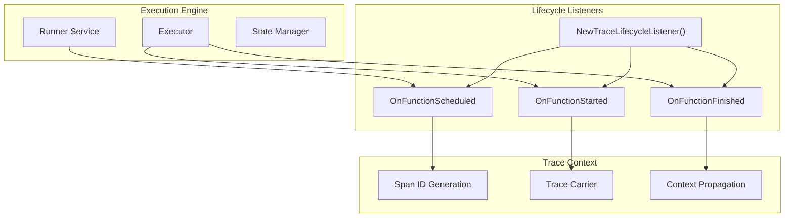

### Context Extraction

The trace lifecycle extracts execution context using the `extractTraceCtx()` method to ensure proper span hierarchy:

1. Loads trace context from function metadata
2. Extracts propagated trace IDs and span relationships
3. Reconstructs parent-child span relationships across execution boundaries

Sources: [pkg/run/trace_lifecycle.go:1105-1125](), [pkg/run/trace_lifecycle.go:171-172]()

## Data Export and Storage

Traced spans are exported through the OpenTelemetry pipeline and stored in the CQRS system for later retrieval and visualization.

### Export Pipeline

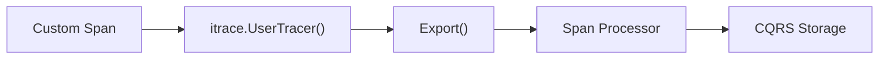

### Protobuf Conversion

Spans are converted to protobuf format for API consumption:

| Proto Type | Purpose |
|------------|---------|
| `RunSpan` | Complete span with metadata |
| `SpanStatus` | Execution status enumeration |
| `SpanStepOp` | Step operation type |
| `StepInfo` | Step-specific details |
| `UserlandSpan` | User code tracing data |

Sources: [proto/gen/run/v2/run.pb.go:166-384](), [proto/run/v2/run.proto:8-117]()

This comprehensive tracing system provides end-to-end visibility into function execution, enabling debugging, performance analysis, and execution monitoring across Inngest's distributed serverless platform.

# SDK Integration


This document covers how external Software Development Kits (SDKs) integrate with the Inngest platform, including function registration, execution patterns, and expression evaluation. It focuses on the technical mechanisms that enable SDKs to define, register, and execute serverless functions within the Inngest ecosystem.

For information about the specific execution drivers and communication protocols, see [HTTP Driver and SDK Communication](#2.3) and [Connect Gateway and WebSocket Workers](#2.4).

## Integration Architecture Overview

SDKs integrate with Inngest through two primary communication patterns: HTTP-based invocation and WebSocket-based Connect protocol. Both patterns support function registration, execution, and real-time communication between the Inngest platform and user-defined functions.

## SDK Integration Patterns

### HTTP-Based Integration

The HTTP integration pattern uses standard HTTP endpoints where Inngest acts as a client calling SDK-provided endpoints. SDKs expose a single HTTP handler that manages function registration and execution.

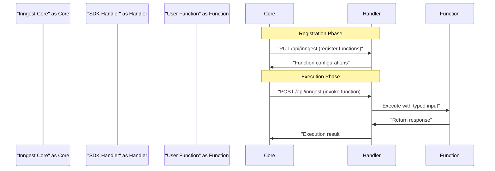

The `handler` struct in [vendor/github.com/inngest/inngestgo/handler.go:258-266]() manages this HTTP lifecycle through three main HTTP methods:

- `GET` requests return function introspection data
- `PUT` requests handle function registration  
- `POST` requests execute specific functions

Sources: [vendor/github.com/inngest/inngestgo/handler.go:323-398]()

### Connect WebSocket Integration

The Connect integration establishes persistent WebSocket connections for low-latency function execution. This pattern is optimized for high-throughput scenarios and reduces connection overhead.

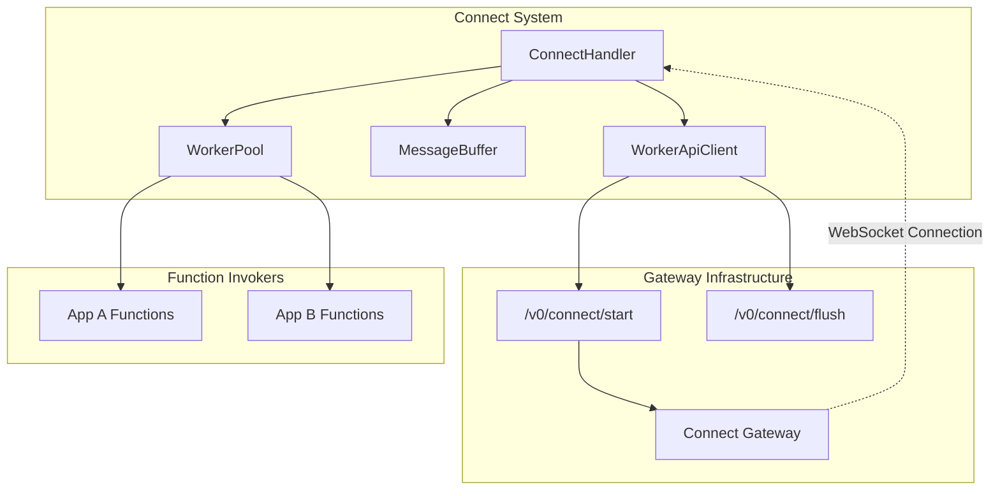

The Connect system is initialized through the `Connect` function in [vendor/github.com/inngest/inngestgo/connect.go:35-121](), which establishes authentication, configures connection parameters, and manages multiple applications within a single connection.

Sources: [vendor/github.com/inngest/inngestgo/connect.go:35-121](), [vendor/github.com/inngest/inngestgo/connect/handler.go:45-79]()

## Function Definition and Configuration

### SDK Function Structure

SDKs define functions using a generic type system that provides compile-time type safety for event handling. The core function type is defined as:

```
SDKFunction[T any] func(ctx context.Context, input Input[T]) (any, error)
```

This generic approach allows strongly-typed event handling while maintaining runtime flexibility. The `servableFunc` struct in [vendor/github.com/inngest/inngestgo/funcs.go:122-167]() wraps user-defined functions with metadata and configuration.

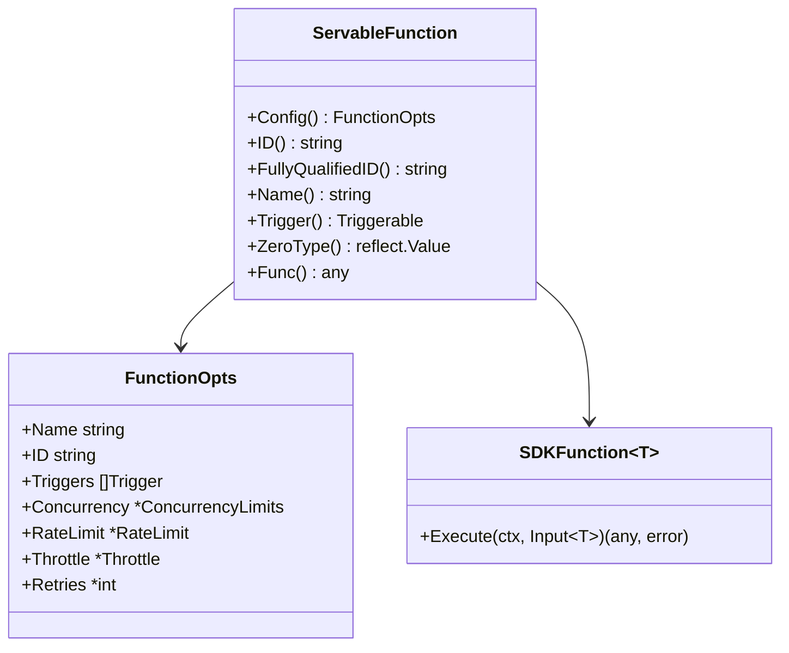

### Function Registration Process

Function registration converts SDK-defined functions into the platform's internal representation through the `SDKFunction.Function()` method in [pkg/sdk/function.go:68-131]().

The registration process involves:

1. **Configuration Validation**: Ensuring required fields like triggers and names are present
2. **Type Conversion**: Converting SDK-specific types to internal `inngest.Function` types  
3. **Step Configuration**: Mapping SDK execution endpoints to internal step definitions
4. **Constraint Application**: Applying retry limits, concurrency controls, and other operational constraints

Sources: [pkg/sdk/function.go:68-131](), [vendor/github.com/inngest/inngestgo/funcs.go:53-90]()

## Expression Evaluation System

The expression evaluation system enables SDKs to process complex event matching and conditional logic through a high-performance aggregation engine.

### Expression Parser Architecture

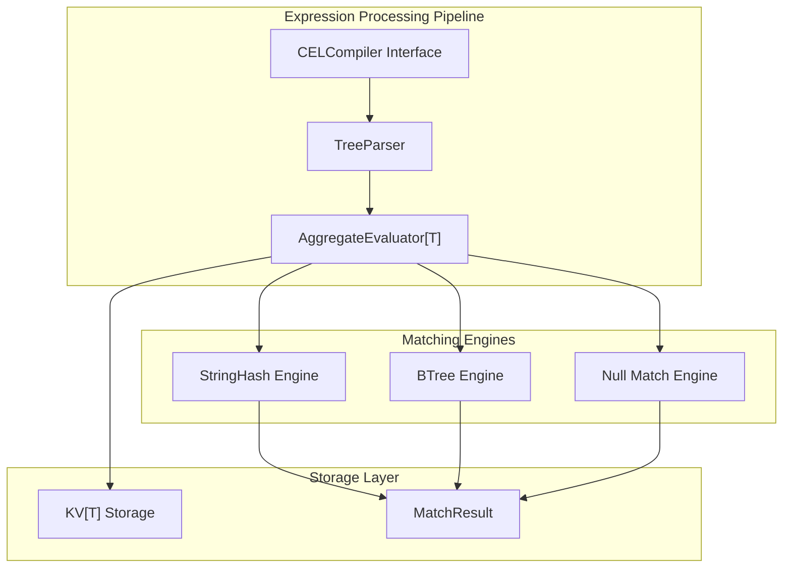

The `AggregateEvaluator` interface in [vendor/github.com/inngest/expr/expr.go:40-79]() provides the core evaluation capabilities:

- **Expression Addition**: Parses and categorizes expressions into fast/slow evaluation paths
- **Optimized Matching**: Uses specialized engines for different predicate types
- **Concurrent Evaluation**: Supports configurable concurrency for expression evaluation

### Expression Optimization Strategy

The system categorizes expressions into three performance tiers:

1. **Fast Expressions** (ratio = 1.0): Fully aggregatable using specialized engines
2. **Mixed Expressions** (ratio = 0.0-1.0): Partially aggregatable with fallback evaluation
3. **Slow Expressions** (ratio = 0.0): Require full evaluation for every event

This categorization is determined in [vendor/github.com/inngest/expr/expr.go:410-464]() during the `Add` method execution.

Sources: [vendor/github.com/inngest/expr/expr.go:96-157](), [vendor/github.com/inngest/expr/parser.go:59-121]()

## HTTP Driver Communication

### Request/Response Flow

SDKs communicate with Inngest through structured HTTP requests that carry execution context and step information. The `handler.invoke` method in [vendor/github.com/inngest/inngestgo/handler.go:356-373]() processes these requests.

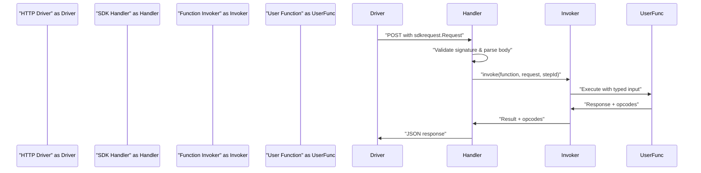

### Authentication and Security

HTTP requests are authenticated using HMAC signature validation implemented in the `ValidateRequestSignature` function. The system supports primary and fallback signing keys for seamless key rotation.

Request signature validation occurs in [vendor/github.com/inngest/inngestgo/handler.go:482-507]() for in-band synchronization and similar patterns throughout the codebase for other request types.

Sources: [vendor/github.com/inngest/inngestgo/handler.go:356-398](), [vendor/github.com/inngest/inngestgo/handler.go:448-586]()

## Connect Gateway System  

### Connection Management

The Connect system manages persistent WebSocket connections through a sophisticated lifecycle management system implemented in `connectHandler`.

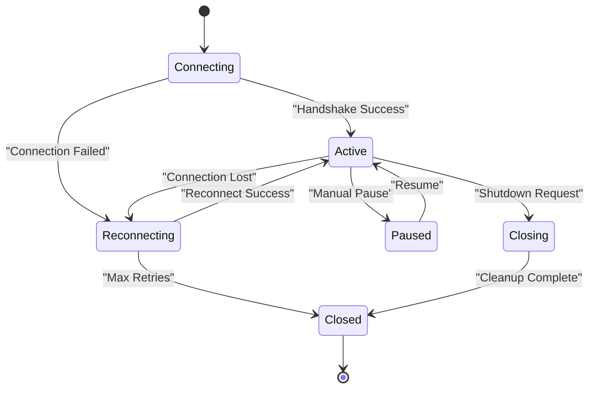

Connection states are managed through the `ConnectionState` type in [vendor/github.com/inngest/inngestgo/connect/handler.go:26-35](), with state transitions handled by the main connection loop.

### WebSocket Protocol

The Connect protocol uses Protocol Buffers for message serialization and implements a custom handshake sequence:

1. **Start Request**: SDK requests gateway endpoint via REST API
2. **WebSocket Establishment**: Connection to assigned gateway with subprotocol negotiation  
3. **Authentication Exchange**: Signing key verification and session establishment
4. **Configuration Sync**: Function definitions and capability advertisements
5. **Ready State**: Bidirectional message flow for execution requests

The handshake implementation is in [vendor/github.com/inngest/inngestgo/connect/handshake.go:41-119]() and involves multiple message exchanges for secure connection establishment.

### Function Invocation via Connect

Connect-based function invocation bypasses HTTP overhead by maintaining persistent connections. The `InvokeFunction` method in [vendor/github.com/inngest/inngestgo/connect.go:137-167]() provides the same interface as HTTP-based invocation but with lower latency.

Sources: [vendor/github.com/inngest/inngestgo/connect/handler.go:153-394](), [vendor/github.com/inngest/inngestgo/connect/connection.go:43-88](), [vendor/github.com/inngest/inngestgo/connect/handshake.go:41-119]()

# Go SDK and Runtime Integration


This document covers the Go SDK implementation and its runtime integration with the Inngest platform, including the expression evaluation engine, function definition system, and real-time WebSocket connectivity. The Go SDK provides developers with tools to create, register, and execute serverless functions that respond to events with sophisticated matching capabilities.

For information about the HTTP-based function execution and driver communication, see [HTTP Driver and SDK Communication](#2.3). For details on the Connect gateway and WebSocket workers, see [Connect Gateway and WebSocket Workers](#2.4).

## Architecture Overview

The Go SDK runtime integration consists of three primary systems: an expression evaluation engine for fast event matching, a function definition and execution framework, and a real-time Connect system for WebSocket-based communication.

### High-Level System Architecture

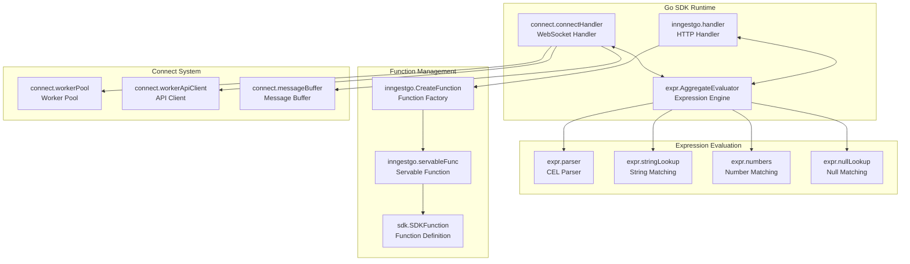

Sources: [vendor/github.com/inngest/expr/expr.go:40-79](), [vendor/github.com/inngest/inngestgo/handler.go:240-256](), [vendor/github.com/inngest/inngestgo/connect/handler.go:115-145]()

## Expression Evaluation Engine

The expression evaluation engine provides fast matching of incoming events against function triggers using Common Expression Language (CEL). It employs multiple specialized matching engines and caching strategies for optimal performance.

### Expression Engine Components

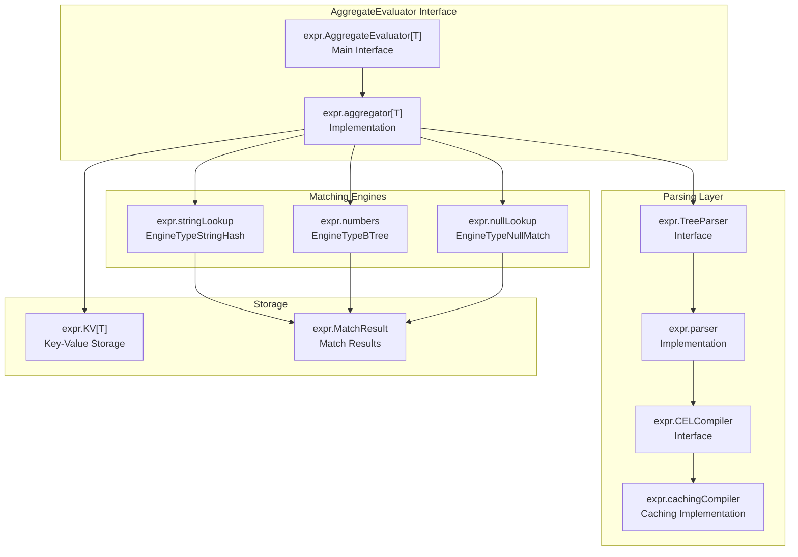

The `AggregateEvaluator` interface supports three types of expressions:
- **Fast expressions** (ratio = 1.0): Fully aggregatable using tree matching
- **Mixed expressions** (ratio = 0.0-1.0): Partially aggregatable with some slow components
- **Slow expressions** (ratio = 0.0): Must be evaluated individually for each event

Sources: [vendor/github.com/inngest/expr/expr.go:40-79](), [vendor/github.com/inngest/expr/parser.go:18-65](), [vendor/github.com/inngest/expr/engine.go:74-90]()

### Expression Matching Flow

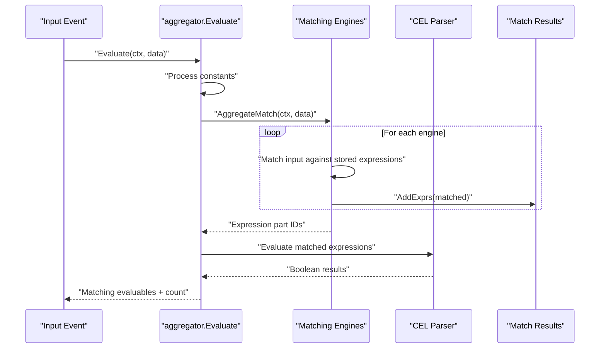

Sources: [vendor/github.com/inngest/expr/expr.go:220-341](), [vendor/github.com/inngest/expr/engine_stringmap.go:71-156]()

## Go SDK Core Components

The Go SDK provides a high-level interface for creating, registering, and serving Inngest functions through HTTP endpoints and WebSocket connections.

### SDK Handler Architecture

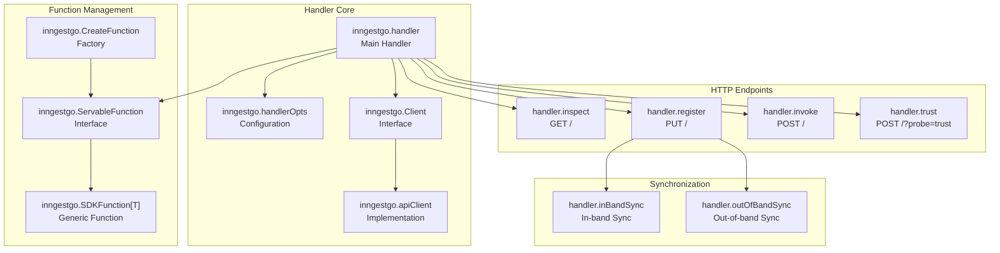

The handler supports multiple HTTP methods:
- **GET**: Function inspection and discovery
- **POST**: Function invocation and trust probes  
- **PUT**: Function registration with sync capabilities

Sources: [vendor/github.com/inngest/inngestgo/handler.go:323-398](), [vendor/github.com/inngest/inngestgo/funcs.go:53-90]()

### Function Creation and Lifecycle

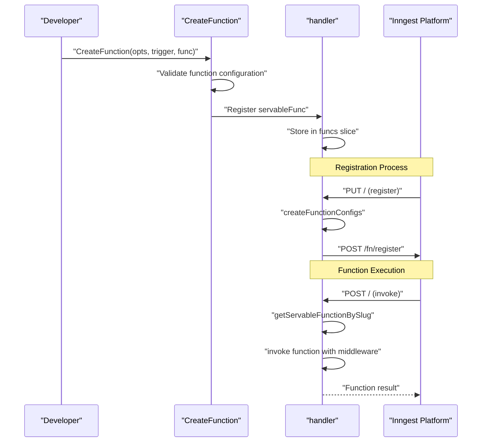

Sources: [vendor/github.com/inngest/inngestgo/funcs.go:53-90](), [vendor/github.com/inngest/inngestgo/handler.go:588-692]()

## Connect System for Real-Time Communication

The Connect system enables WebSocket-based communication between the Go SDK and Inngest platform, providing lower latency and persistent connections for function execution.

### Connect Handler Architecture

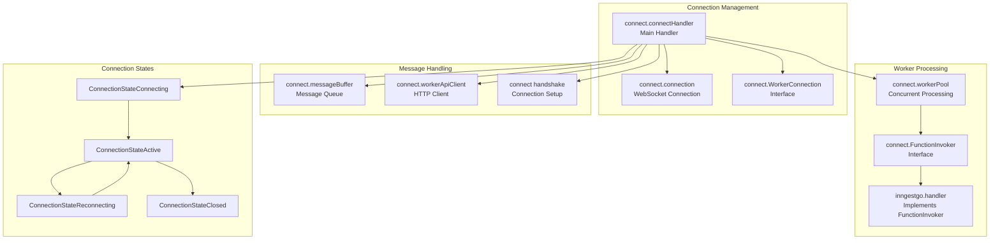

Sources: [vendor/github.com/inngest/inngestgo/connect/handler.go:115-145](), [vendor/github.com/inngest/inngestgo/connect/connection.go:99-106]()

### Connect Protocol Flow

```mermaid
sequenceDiagram
    participant SDK as "Go SDK"
    participant API as "Worker API"
    participant Gateway as "Gateway"
    participant Platform as "Inngest Platform"
    
    SDK->>API: "POST /v0/connect/start"
    API-->>SDK: "StartResponse{endpoint, sessionToken}"
    
    SDK->>Gateway: "WebSocket connection"
    Gateway->>SDK: "GATEWAY_HELLO"
    SDK->>Gateway: "WORKER_CONNECT{apps, capabilities}"
    Gateway->>SDK: "GATEWAY_CONNECTION_READY"
    
    Note over SDK, Gateway: Connection established
    
    loop Function execution
        Platform->>Gateway: "ExecutorRequest"
        Gateway->>SDK: "EXECUTOR_REQUEST_RECEIVED"
        SDK->>SDK: "Process in WorkerPool"
        SDK->>Gateway: "EXECUTOR_RESPONSE"
        Gateway->>Platform: "Response forwarded"
    end
    
    Note over SDK, Gateway: Heartbeat maintenance
    loop Heartbeat
        SDK->>Gateway: "WORKER_HEARTBEAT"
        Gateway->>SDK: "GATEWAY_HEARTBEAT"
    end
```

Sources: [vendor/github.com/inngest/inngestgo/connect/handshake.go:41-119](), [vendor/github.com/inngest/inngestgo/connect/workerapi.go:28-90]()

## Function Definition System

The SDK provides a type-safe way to define functions with strong typing for events and configuration options.

### Function Definition Components

| Component | Purpose | Key Methods |
|-----------|---------|-------------|
| `SDKFunction` | Core function definition with event type | Generic function signature `func(ctx, Input[T]) (any, error)` |
| `ServableFunction` | Interface for servable functions | `ID()`, `Name()`, `Trigger()`, `Config()` |
| `FunctionOpts` | Configuration options | Concurrency, retries, timeouts, cancellation |
| `sdk.SDKFunction` | Platform function representation | Conversion to `inngest.Function` |

### Function Configuration Mapping

```mermaid
graph LR
    subgraph "SDK Configuration"
        FuncOpts["inngestgo.FunctionOpts<br/>{Name, ID, Concurrency}"]
        Trigger["fn.Trigger<br/>{EventTrigger, CronTrigger}"]
        SDKFunc["SDKFunction[T]<br/>User Function"]
    end
    
    subgraph "Platform Configuration"  
        SDKFuncDef["sdk.SDKFunction<br/>{Triggers, Steps}"]
        InngestFunc["inngest.Function<br/>{Name, Slug, Triggers}"]
        SyncConfig["fn.SyncConfig<br/>Registration Config"]
    end
    
    FuncOpts --> SDKFuncDef
    Trigger --> SDKFuncDef
    SDKFunc --> SDKFuncDef
    
    SDKFuncDef --> InngestFunc
    InngestFunc --> SyncConfig
```

Sources: [pkg/sdk/function.go:68-131](), [vendor/github.com/inngest/inngestgo/funcs.go:53-90]()

## Runtime Integration Patterns

The Go SDK integrates with the Inngest runtime through multiple patterns depending on the deployment context and requirements.

### Integration Modes

| Mode | Transport | Use Case | Key Components |
|------|-----------|----------|----------------|
| HTTP | HTTP requests | Serverless, stateless | `handler.ServeHTTP`, HTTP drivers |
| Connect | WebSocket | Long-running, low-latency | `connect.Connect`, WebSocket gateway |
| Development | HTTP + polling | Local development | Dev server, hot reloading |

### Expression Integration

The expression system integrates with function triggers through the `expr` package:

```go
// Expression evaluation in practice
type FunctionTrigger struct {
    Event      string  // "user.signup"
    Expression *string // "event.data.plan == 'premium'"
}
```

The `AggregateEvaluator` processes these expressions using:
- **String matching**: Fast hash-based lookup for equality checks
- **Number matching**: B-tree for numeric comparisons (`>`, `<`, `>=`, `<=`)
- **Null matching**: Specialized handling for null/undefined values
- **Mixed evaluation**: Combination of fast matching + full CEL evaluation

Sources: [vendor/github.com/inngest/expr/expr.go:410-464](), [vendor/github.com/inngest/expr/engine_stringmap.go:14-25](), [vendor/github.com/inngest/expr/engine_number.go:14-25]()

### Performance Optimizations

The runtime employs several optimization strategies:

1. **Expression Caching**: `cachingCompiler` caches parsed CEL expressions
2. **Literal Lifting**: Extracts string literals for shared expression reuse  
3. **Aggregate Matching**: Batch processing of expressions using specialized engines
4. **Connection Pooling**: WebSocket connection reuse in Connect mode
5. **Worker Concurrency**: Configurable worker pools for parallel function execution

Sources: [vendor/github.com/inngest/expr/caching_compiler.go:16-62](), [vendor/github.com/inngest/inngestgo/connect/handler.go:66-67]()