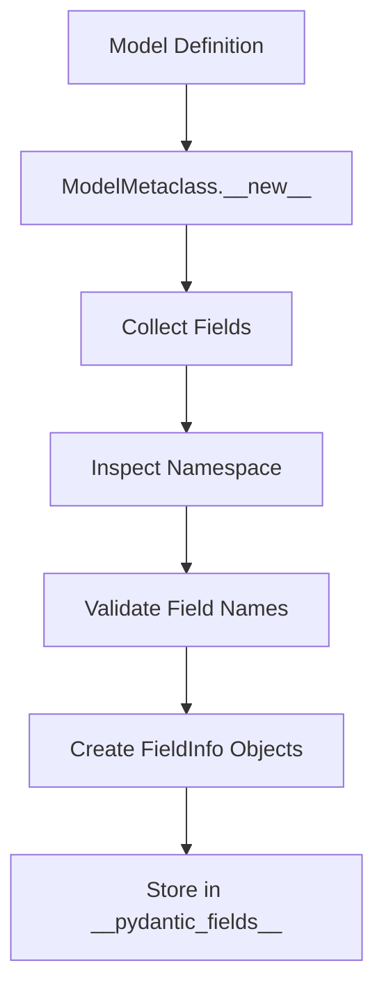
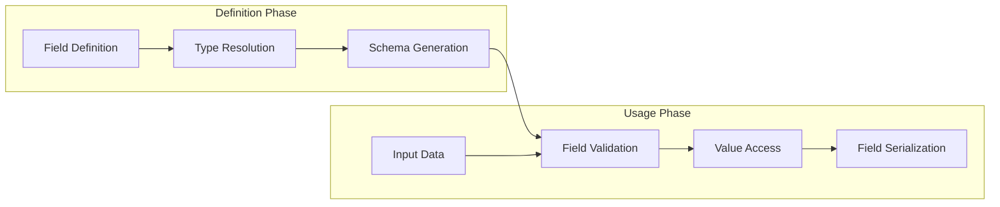
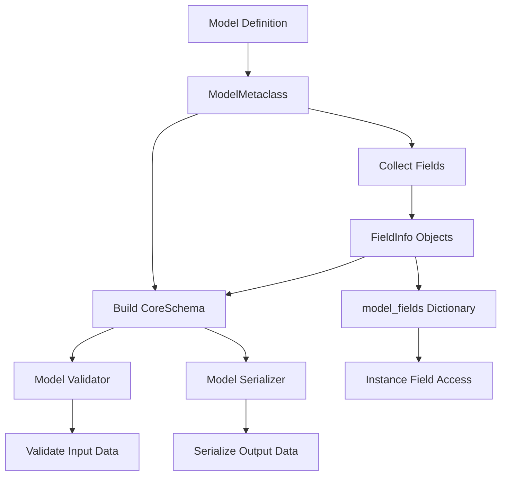
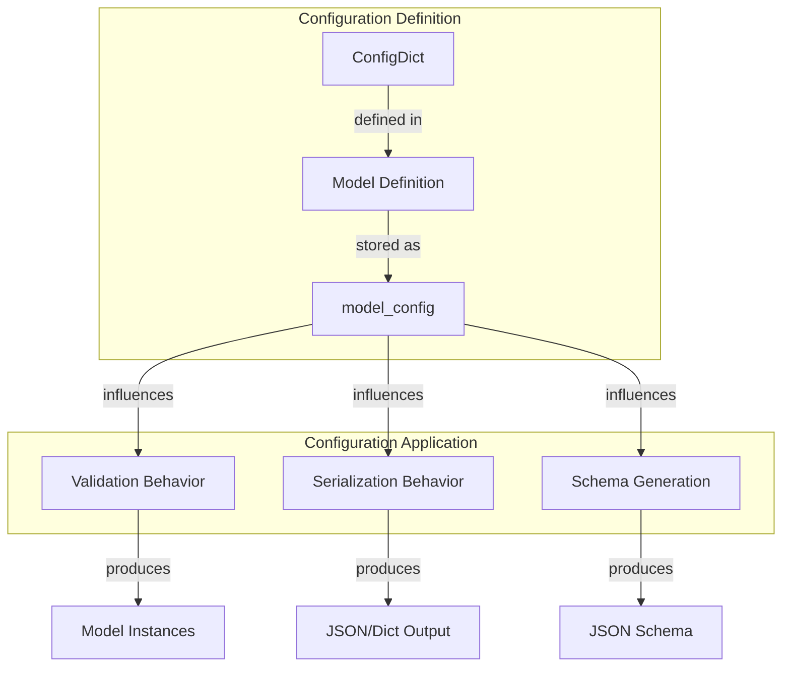
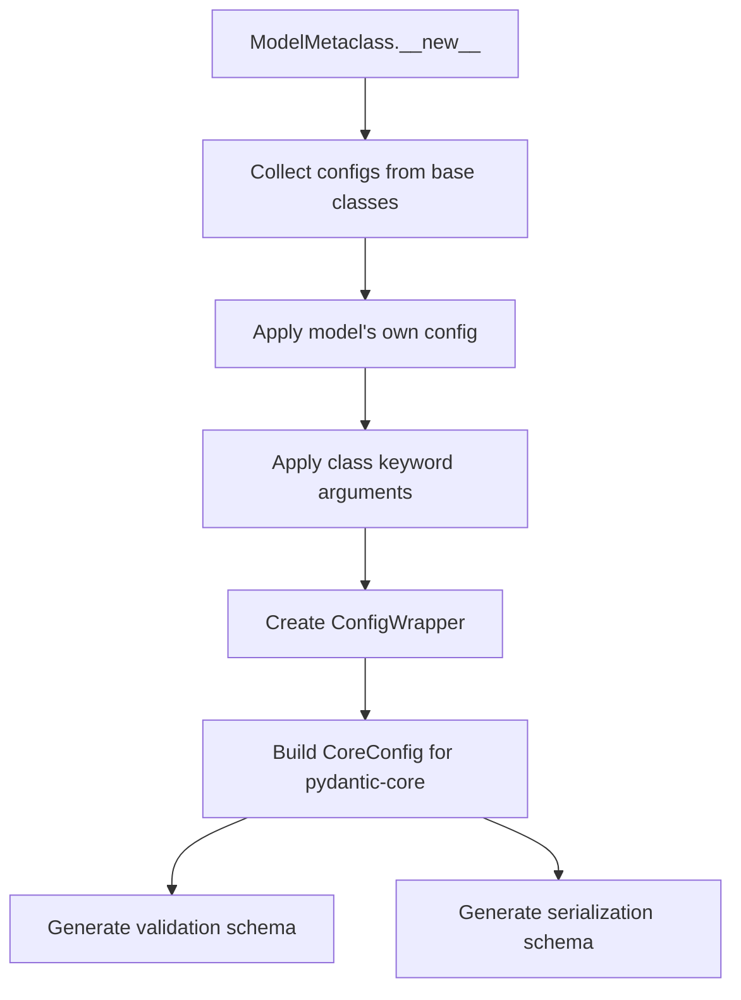
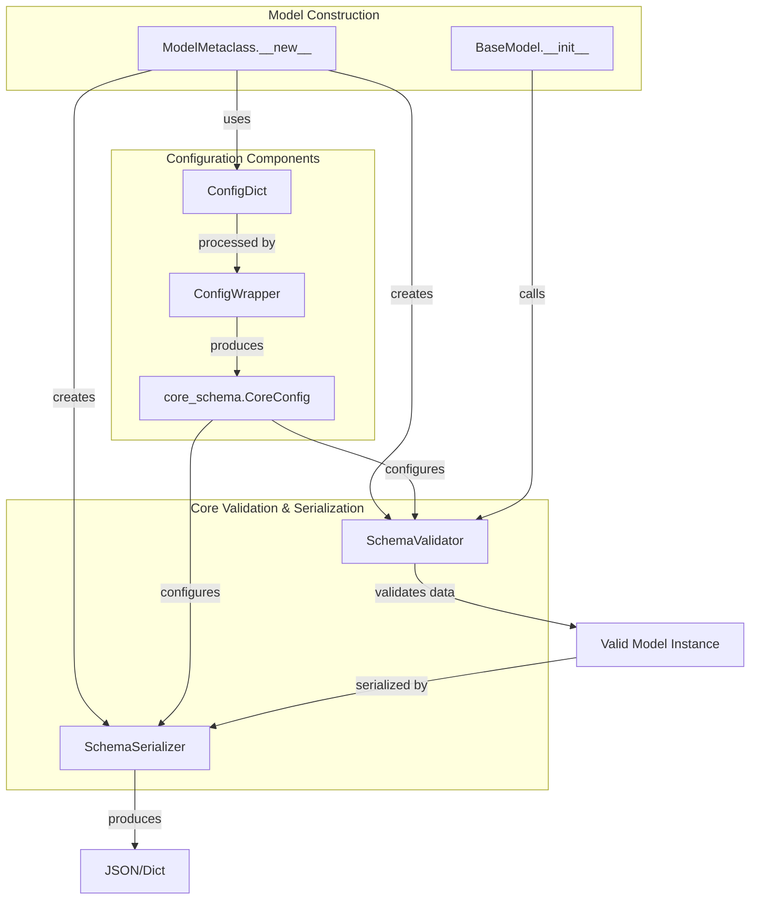

name_field = User.model_fields["name"]
print(name_field.description)  # "User's full name"
print(name_field.is_required())  # False
age_field = User.model_fields["age"]
print(age_field.is_required())  # True
```

Sources: [pydantic/main.py:266-286](). [tests/test_main.py:110-112]().

## Field Processing Flow

When a Pydantic model is defined, the fields go through a processing flow to collect and validate field definitions.



Sources: [pydantic/_internal/_model_construction.py:363-455](). [pydantic/_internal/_model_construction.py:221-224]().

### Field Collection Process

1. During model class creation, the `ModelMetaclass` processes class attributes
2. Type annotations from `__annotations__` are analyzed
3. Attributes with type annotations become model fields
4. `Field()` instances are processed to collect metadata
5. Other attributes without annotations are checked for possible field intent (with warnings)
6. Fields are stored in the class's `__pydantic_fields__` attribute

Sources: [pydantic/_internal/_model_construction.py:80-258](). [pydantic/fields.py:291-366]().

## Field Types and Validation

Pydantic supports a wide range of field types, each with appropriate validation:

| Type Category | Examples | Validation Behavior |
|---------------|----------|---------------------|
| Simple Types | `int`, `float`, `str`, `bool` | Type coercion and standard validation |
| Collection Types | `list`, `set`, `tuple`, `dict` | Item-by-item validation with inner type checking |
| Complex Types | `datetime`, `UUID`, custom classes | Type-specific validation logic |
| Union Types | `Union[str, int]`, `Optional[str]` | Try each type in sequence |
| Constrained Types | `conint`, `constr` | Apply additional constraints |
| Custom Types | User-defined classes | Validate using schema from `__get_pydantic_core_schema__` |

Fields can have validators defined at several levels:
- Standard type validation
- Constraints defined in `Field()`
- Model-level validators (see [Validators](#4.1))

Sources: [tests/test_edge_cases.py:62-176](). [tests/test_edge_cases.py:177-295]().

## Field Lifecycle

Fields in Pydantic go through a complete lifecycle from definition to usage:



Sources: [pydantic/main.py:243-261](). [pydantic/main.py:421-477]().

### Model Instantiation

During model instantiation, Pydantic:
1. Takes input data and matches it to field names or aliases
2. Validates each field's value against its expected type and constraints
3. Stores successfully validated values in the model instance

### Field Access

Once a model is instantiated, fields can be accessed as normal attributes:

```python
user = User(name="Alice", age=30)
print(user.name)  # "Alice"
```

### Serialization

When a model is serialized (e.g., via `model_dump()` or `model_dump_json()`), fields are:
1. Converted to their serialized form (based on field type and serializers)
2. Included/excluded based on field configuration and serialization options
3. Named according to serialization aliases if defined

Sources: [pydantic/main.py:421-533](). [tests/test_json.py:151-188]().

## Advanced Field Features

### Field Aliases

Aliases provide alternative names for fields, useful for mapping to external data formats:

```python
class User(BaseModel):
    user_id: int = Field(alias="id")
    full_name: str = Field(validation_alias="name", serialization_alias="userName")
```

- **alias**: Used for both validation and serialization
- **validation_alias**: Used only during validation (parsing input)
- **serialization_alias**: Used only during serialization (output)

Aliases can be simple strings or complex paths using dot notation (for nested data) or AliasPath objects.

Sources: [pydantic/fields.py:231-235](). [tests/test_main.py:499-506]().

### Default Values and Factories

Fields can have static default values or dynamic defaults via factory functions:

```python
import uuid
from datetime import datetime

class Item(BaseModel):
    id: str = Field(default_factory=lambda: str(uuid.uuid4()))
    created_at: datetime = Field(default_factory=datetime.now)
    tags: list[str] = Field(default_factory=list)
```

When a default factory is provided:
- It's called when a field value isn't provided
- It can optionally use already validated data if the factory accepts a parameter

Sources: [pydantic/fields.py:226-230](). [pydantic/fields.py:609-645]().

### Field Constraints

Fields can have various constraints applied directly in the `Field()` function:

```python
class Product(BaseModel):
    name: str = Field(min_length=1, max_length=100)
    price: float = Field(gt=0)
    count: int = Field(ge=0, le=1000)
    code: str = Field(pattern=r"^[A-Z]{2}-\d{4}$")
```

These constraints are stored in the field's metadata and applied during validation.

Sources: [pydantic/fields.py:191-207](). [tests/test_edge_cases.py:616-631]().

### Frozen Fields

Individual fields can be marked as immutable with `frozen=True`:

```python
class User(BaseModel):
    id: str = Field(frozen=True)
    name: str  # Can be modified
```

Attempts to modify a frozen field will raise a ValidationError.

Sources: [pydantic/fields.py:247](). [tests/test_main.py:591-611]().

### Private Attributes

Private attributes are defined using underscore-prefixed names and aren't included in validation or serialization processes:

```python
class User(BaseModel):
    name: str
    _secret: str = "internal"  # Private attribute
    _cache: dict = {}  # Another private attribute
```

For more control, the `PrivateAttr` class can be used:

```python
from pydantic import BaseModel, PrivateAttr

class User(BaseModel):
    name: str
    _secret: str = PrivateAttr(default="internal")
```

Sources: [tests/test_create_model.py:64-72](). [pydantic/fields.py:437-441]().

## Integration with Model System

The Field System integrates deeply with Pydantic's model system:



Sources: [pydantic/_internal/_model_construction.py:80-258](). [pydantic/main.py:243-405]().

### Fields and Validation

During validation:
1. Input data is matched to fields by name or aliases
2. Each field's value is validated against its type and constraints
3. Default values are applied for missing fields
4. Validated values are stored in the model instance

### Fields and Serialization

During serialization:
1. Field values are retrieved from the model instance
2. Values are converted according to their serialization rules
3. Fields are included/excluded based on configuration and options
4. Field names are mapped to aliases if specified

## Practical Examples

### Complete Example with Various Field Types

```python
from datetime import datetime
from typing import Optional, List
from uuid import UUID, uuid4
from pydantic import BaseModel, Field, EmailStr

class User(BaseModel):
    id: UUID = Field(default_factory=uuid4)
    username: str = Field(min_length=3, max_length=50)
    email: EmailStr
    full_name: Optional[str] = None
    created_at: datetime = Field(default_factory=datetime.now)
    is_active: bool = True
    score: float = Field(ge=0, le=100, default=0)
    tags: List[str] = Field(default_factory=list)
    metadata: dict = Field(default_factory=dict)
```

### Example with Aliases

```python
from pydantic import BaseModel, Field

class ApiResponse(BaseModel):
    user_id: int = Field(alias="userId")
    first_name: str = Field(alias="firstName")
    last_name: str = Field(alias="lastName")
    is_active: bool = Field(alias="isActive", default=True)
```

## Conclusion

The Field System is a fundamental part of Pydantic that enables type annotations to be transformed into powerful validation, documentation, and serialization tools. By leveraging the features of the Field System, you can create robust data models with precise validation rules and customized serialization behavior.

Key takeaways:
- Fields are defined using type annotations and the `Field()` function
- Each field has a corresponding `FieldInfo` object storing its metadata
- Fields support various validation constraints, aliases, and customization options
- The Field System integrates with Pydantic's validation and serialization processes

# Model Configuration


Model Configuration in Pydantic allows you to customize the behavior of your models, including validation rules, serialization formats, and schema generation. This page documents the configuration system and how specific settings affect model behavior.

## Overview

In Pydantic, model configuration is primarily managed through the `ConfigDict` class, which provides a centralized way to control various aspects of model behavior. Configuration options influence everything from how strictly types are validated to how extra fields are handled and how data is serialized.



Sources: [pydantic/config.py:36-1113]()

## Defining Configuration

There are multiple ways to specify configuration for models in Pydantic:

### Using `model_config`

The recommended and most common approach is to use the `model_config` class variable with `ConfigDict`:

```python
from pydantic import BaseModel, ConfigDict

class UserModel(BaseModel):
    model_config = ConfigDict(
        validate_assignment=True,
        frozen=True,
        extra='forbid'
    )
    
    name: str
    age: int
```

### Configuration Inheritance

When a model inherits from another model, its configuration is merged with the parent's configuration:

```python
class ParentModel(BaseModel):
    model_config = ConfigDict(frozen=True, extra='forbid')
    
class ChildModel(ParentModel):
    model_config = ConfigDict(validate_assignment=True)
    # Effective config: frozen=True, extra='forbid', validate_assignment=True
```

Sources: [tests/test_config.py:491-519]()

### Class Initialization Arguments

Some configuration options can also be specified as parameters to the class itself:

```python
class UserModel(BaseModel, frozen=True, validate_assignment=True):
    name: str
    age: int
```

Sources: [tests/test_config.py:110-126]()

### With `with_config` Decorator

For non-BaseModel types like TypedDict and dataclasses, you can use the `with_config` decorator:

```python
from typing_extensions import TypedDict
from pydantic import with_config, ConfigDict

@with_config(ConfigDict(str_to_lower=True))
class UserDict(TypedDict):
    name: str
```

Sources: [pydantic/config.py:1144-1210]()

## Configuration Processing Flow

When a model is created, its configuration is processed through several steps:



Sources: [pydantic/_internal/_config.py:94-228]()

## Major Configuration Options

Pydantic offers many configuration options that affect different aspects of model behavior.

### Validation Behavior

These options control how validation works:

| Option | Default | Description |
| ------ | ------- | ----------- |
| `strict` | `False` | Enforces strict type checking with no coercion |
| `validate_assignment` | `False` | Validates values when attributes are assigned after creation |
| `frozen` | `False` | Makes model instances immutable |
| `extra` | `'ignore'` | Controls how extra fields are handled: 'allow', 'ignore', or 'forbid' |
| `arbitrary_types_allowed` | `False` | Allows fields with arbitrary Python types |
| `revalidate_instances` | `'never'` | Controls when model instances are revalidated |

Sources: [pydantic/config.py:158-590]()

### Field and Alias Handling

These options control how fields and their aliases are used:

| Option | Default | Description |
| ------ | ------- | ----------- |
| `validate_by_alias` | `True` | Allow validation using field aliases |
| `validate_by_name` | `False` | Allow validation using field attribute names |
| `populate_by_name` | `False` | (Deprecated) Allow field population by both name and alias |
| `alias_generator` | `None` | Function to generate field aliases |
| `loc_by_alias` | `True` | Use alias instead of field name in error locations |

Sources: [pydantic/config.py:358-419](), [pydantic/config.py:1038-1112]()

### String Processing

These options control how string values are processed:

| Option | Default | Description |
| ------ | ------- | ----------- |
| `str_strip_whitespace` | `False` | Strip whitespace from strings |
| `str_to_lower` | `False` | Convert strings to lowercase |
| `str_to_upper` | `False` | Convert strings to uppercase |
| `str_min_length` | `0` | Minimum length for string validation |
| `str_max_length` | `None` | Maximum length for string validation |

Sources: [pydantic/config.py:48-61]()

### Serialization

These options control how models are serialized:

| Option | Default | Description |
| ------ | ------- | ----------- |
| `serialize_by_alias` | `False` | Serialize using field aliases |
| `use_enum_values` | `False` | Use enum values instead of enum members |
| `ser_json_bytes` | `'utf8'` | Encoding for bytes in JSON |
| `ser_json_timedelta` | `'iso8601'` | Format for timedeltas in JSON |
| `ser_json_inf_nan` | `'null'` | How to serialize infinity and NaN |

Sources: [pydantic/config.py:592-628](), [pydantic/config.py:1114-1138]()

### Performance Options

These options affect performance:

| Option | Default | Description |
| ------ | ------- | ----------- |
| `defer_build` | `False` | Defer building validators until first use |
| `cache_strings` | `True` | Cache strings to improve performance |
| `regex_engine` | `'rust-regex'` | Engine for regex validation |

Sources: [pydantic/config.py:775-837](), [pydantic/config.py:931-944](), [pydantic/config.py:1019-1037]()

## Config Integration with the Pydantic Core

The configuration system interacts with Pydantic's core components to control validation and serialization behavior:



Sources: [pydantic/_internal/_config.py:158-228]()

## Common Configuration Use Cases

### Handling Extra Fields

The `extra` option controls how Pydantic handles fields not declared in the model:

```python