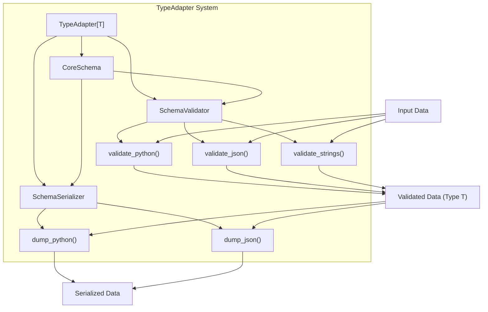

print(site.url.unicode_string())  # "https://例子.测试/"
```

Sources: [tests/test_networks.py:330-337]()

### Database DSN Customization

Each DSN type comes with pre-configured constraints for its respective database system:

- Allowed schemes specific to the database
- Default ports (e.g., 5432 for PostgreSQL, 6379 for Redis)
- Default hosts (often "localhost")
- Default paths where applicable (e.g., "/0" for Redis databases)

This makes it easier to handle database connection strings with minimal configuration.

Sources: [pydantic/networks.py:690-826]()

## Best Practices

1. **Choose the most specific type**: Use the most specific URL type for your use case (e.g., `HttpUrl` rather than `AnyUrl` for HTTP endpoints).

2. **Handle connection credentials securely**: For DSNs with credentials, consider using environment variables or secure storage.

3. **Default fallbacks**: Use `UrlConstraints` to provide sensible defaults for missing URL components.

4. **Validation at boundaries**: Validate network inputs at application boundaries to ensure they are properly formed.

5. **Consider the optional dependencies**: Install `email_validator` package when using email validation types.

# Type Adapter


TypeAdapter is a flexible component in Pydantic that allows you to apply validation and serialization to arbitrary Python types, not just Pydantic models. It bridges the gap between Python types and Pydantic's validation system, enabling you to use Pydantic's powerful data validation and conversion capabilities with standard Python types, dataclasses, TypedDict, and more.

For information about validating model fields, see [Field System](#2.2). For information about customizing validation through validators, see [Validators](#4.1).

## Core Concepts

TypeAdapter wraps a Python type with Pydantic's validation and serialization functionality. It creates a core schema for the type, and uses this schema to validate input data and serialize output data.



Sources: [pydantic/type_adapter.py:69-107](, [pydantic/type_adapter.py:167-170](

## Instantiating a TypeAdapter

You create a TypeAdapter by passing a type and optional configuration to the constructor. The type can be any Python type, including:

- Primitive types (int, float, str, etc.)
- Container types (list, dict, tuple, etc.)
- Pydantic models
- dataclasses
- TypedDict
- Generic types
- Custom types

```python
from pydantic import TypeAdapter