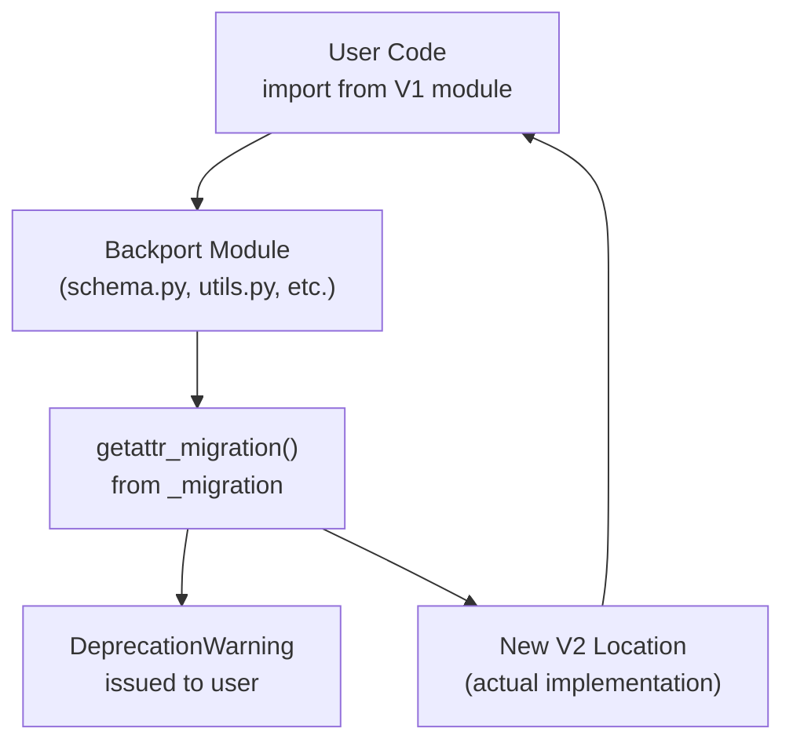
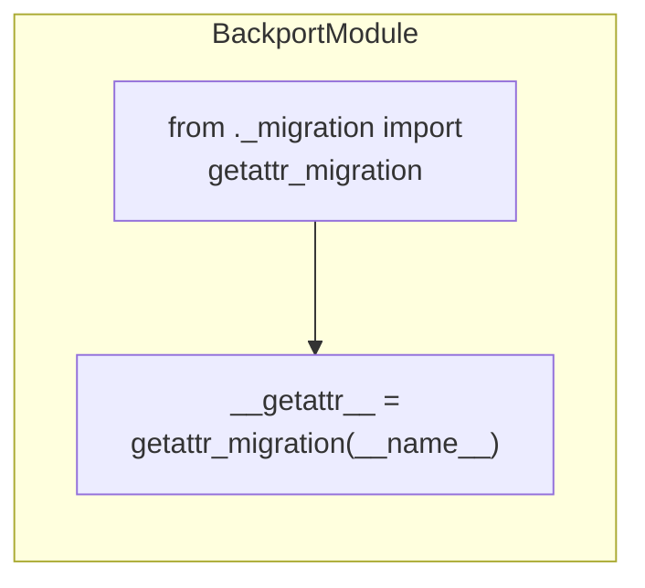

## Purpose and Scope

This document covers the V1 compatibility layer provided by Pydantic V2 through backported modules. These modules (`pydantic.schema`, `pydantic.utils`, `pydantic.typing`, `pydantic.env_settings`, and `pydantic.decorator`) serve as migration shims that redirect imports from their V1 locations to appropriate V2 equivalents while issuing deprecation warnings.

For information about broader migration strategies and API changes between V1 and V2, see [V1 to V2 Migration](#8.1).

---

## Overview

Pydantic V2 reorganized its internal structure significantly compared to V1. To ease the transition for users with existing codebases, several commonly-imported V1 modules were preserved as "backported modules" that use the `getattr_migration` mechanism to provide backwards compatibility.

**Sources:** [pydantic/schema.py:1-5](), [pydantic/utils.py:1-5](), [pydantic/typing.py:1-5]()

---

## Migration Architecture

The backported modules use a dynamic attribute resolution mechanism to intercept imports and redirect them to their new V2 locations.

### Import Resolution Flow



**How it Works:**

1. User imports from a V1 module location (e.g., `from pydantic.schema import schema_of`)
2. Python invokes `__getattr__` on the module
3. `getattr_migration` function intercepts the attribute lookup
4. A deprecation warning is issued
5. The attribute is resolved from its new V2 location and returned

**Sources:** [pydantic/schema.py:1-5](), [pydantic/utils.py:1-5]()

---

## Backported Module List

All backported modules follow the same pattern: they import `getattr_migration` and assign it as their module-level `__getattr__` function.

### Module Mapping

| V1 Module | Status | Common Use Cases in V1 |
|-----------|--------|------------------------|
| `pydantic.schema` | Backported | Schema generation utilities |
| `pydantic.utils` | Backported | General utility functions |
| `pydantic.typing` | Backported | Type annotation utilities |
| `pydantic.env_settings` | Backported | Environment-based settings (now separate library) |
| `pydantic.decorator` | Backported | Decorator utilities for validation |

**Sources:** [pydantic/schema.py:1](), [pydantic/utils.py:1](), [pydantic/typing.py:1](), [pydantic/env_settings.py:1](), [pydantic/decorator.py:1]()

---

## Implementation Pattern

Each backported module uses an identical implementation pattern:



### Code Structure

All five backported modules follow this template:

```python
"""The `<module_name>` module is a backport module from V1."""

from ._migration import getattr_migration

__getattr__ = getattr_migration(__name__)
```

**Key Components:**

- **Module docstring**: Identifies the module as a V1 backport
- **`getattr_migration` import**: Brings in the migration function from `pydantic._migration`
- **`__getattr__` assignment**: Python's special module-level attribute that is called when an attribute is not found through normal lookup

**Sources:** [pydantic/schema.py:1-5](), [pydantic/utils.py:1-5](), [pydantic/typing.py:1-5](), [pydantic/env_settings.py:1-5](), [pydantic/decorator.py:1-5]()

---

## Specific Backported Modules

### pydantic.schema

The `schema` module in V1 contained utilities for generating JSON schemas from Pydantic models. In V2, this functionality has been reorganized.

**File Location:** [pydantic/schema.py]()

**V1 Usage Example:**
```python
# V1 code that still works through backport
from pydantic.schema import schema_of
```

**Sources:** [pydantic/schema.py:1-5]()

---

### pydantic.utils

The `utils` module in V1 contained various utility functions. In V2, these utilities have been moved to internal modules or replaced with new implementations.

**File Location:** [pydantic/utils.py]()

**V1 Usage Example:**
```python