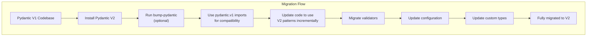
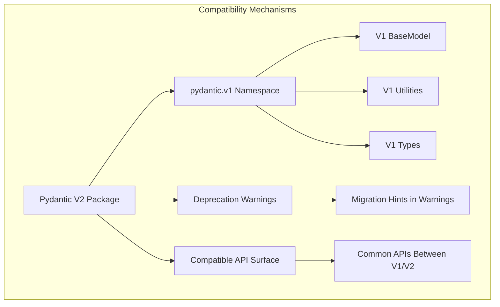

This document explains Pydantic's approach to backward compatibility and provides guidance for migrating from Pydantic V1 to V2. It covers compatibility mechanisms, migration tools, common migration patterns, and best practices for handling Pydantic version transitions smoothly. For information on specific deprecated features, see [Deprecated Features](#8.2).

## Overview

Pydantic V2 introduces significant architectural changes and improvements over V1, including performance enhancements, new features, and API refinements. While these changes introduced breaking changes, Pydantic provides several mechanisms to ease the transition between versions.



Sources: [docs/migration.md:1-78](docs/migration.md:1-78)

## Installations and Versions

### Installing Pydantic V2

Pydantic V2 is the current production release and can be installed with:

```bash
pip install -U pydantic
```

### Using Pydantic V1

If you need to use Pydantic V1 for any reason, you can install it with:

```bash
pip install "pydantic==1.*"
```

Alternatively, if you are using Pydantic V2 but need access to V1 features, you can use the `pydantic.v1` namespace:

```python
from pydantic.v1 import BaseModel
from pydantic.v1.utils import lenient_isinstance
```

Sources: [docs/migration.md:10-76](docs/migration.md:10-76)

## Compatibility Mechanisms

Pydantic implements several mechanisms to ensure backward compatibility:



Sources: [docs/migration.md:79-124](docs/migration.md:79-124), [tests/test_deprecated.py:35-111](tests/test_deprecated.py:35-111)

### Using the `pydantic.v1` Namespace

Starting from `pydantic>=1.10.17`, the `pydantic.v1` namespace can be used to access V1 functionality even when using V2. This allows for gradual migration:

```python
# V1 style import
from pydantic.fields import ModelField

# Compatible with both V1 and V2
try:
    from pydantic.v1.fields import ModelField
except ImportError:
    from pydantic.fields import ModelField
```

Sources: [docs/migration.md:78-124](docs/migration.md:78-124)

### Deprecation Warnings

Pydantic V2 issues deprecation warnings for features that have been renamed or removed. These warnings provide guidance on the recommended replacements:

```python