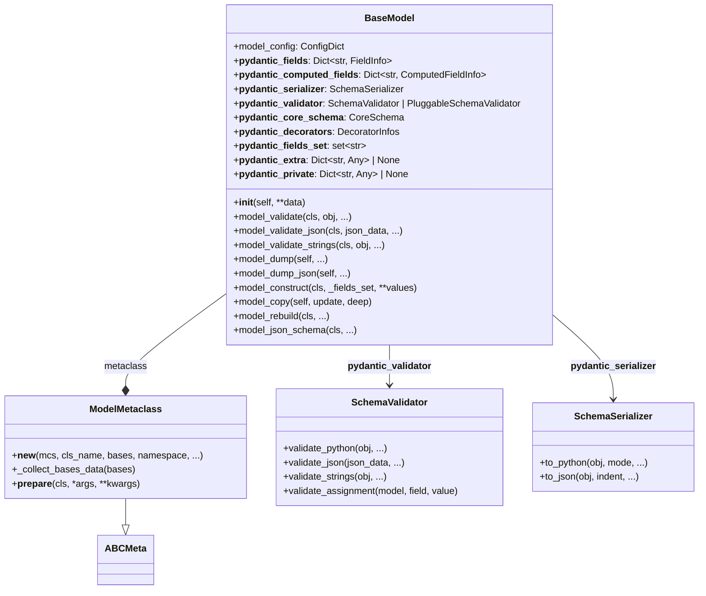
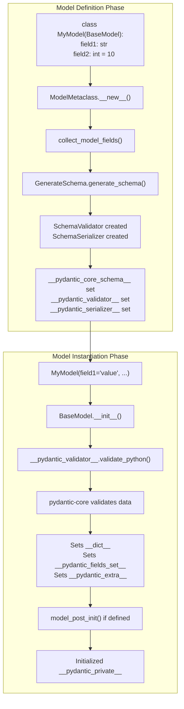
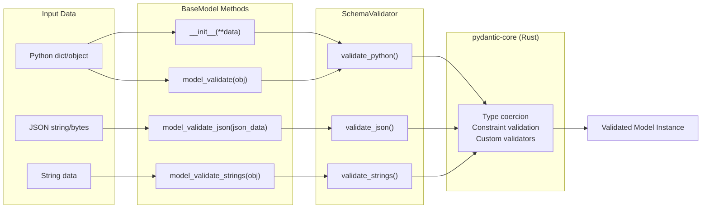
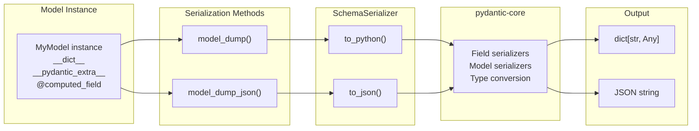

BaseModel is the cornerstone of Pydantic's data validation system. It provides a declarative way to define data models with type annotations, enabling automatic validation, serialization, and documentation of data structures. This page covers the core functionality, architecture, and usage patterns of the BaseModel class.

For information about model configuration options, see [Model Configuration](#2.3).
For details on how fields work within models, see [Field System](#2.2).

## Purpose and Functionality

BaseModel serves as the foundation for creating validated data models in Pydantic. Key functionality includes:

- Validation of input data against defined types
- Automatic type coercion where possible
- JSON serialization and deserialization
- Schema generation for documentation
- Data manipulation utilities
- Configuration customization

Models are defined by creating classes that inherit from BaseModel, with fields specified using Python type annotations.

Sources: [pydantic/main.py:121-152](https://github.com/pydantic/pydantic/blob/main/pydantic/main.py:121-152)

## BaseModel Architecture

**BaseModel Class Structure**



BaseModel is implemented with `ModelMetaclass` (defined in [pydantic/_internal/_model_construction.py:79]()) as its metaclass. During class definition, `ModelMetaclass.__new__` processes type annotations, collects field information from the class and its bases, generates core schemas, and creates the `SchemaValidator` and `SchemaSerializer` instances from pydantic-core.

Sources: 
- [pydantic/main.py:118-238]()
- [pydantic/_internal/_model_construction.py:79-276]()

## Model Lifecycle

**Model Definition and Instantiation Flow**



### Model Definition Phase

When a class inheriting from `BaseModel` is defined, `ModelMetaclass.__new__` is invoked:

1. **Field Collection** ([pydantic/_internal/_fields.py:collect_model_fields]()): Annotations are inspected and converted to `FieldInfo` objects stored in `__pydantic_fields__`
2. **Schema Generation** ([pydantic/_internal/_generate_schema.py:GenerateSchema.generate_schema]()): A `CoreSchema` is generated from field definitions and decorators
3. **Validator/Serializer Creation**: `SchemaValidator` and `SchemaSerializer` instances from pydantic-core are created from the core schema
4. **Class Attributes Set**: `__pydantic_validator__`, `__pydantic_serializer__`, and `__pydantic_core_schema__` are assigned to the class

### Model Instantiation Phase

When instantiating a model with `MyModel(**data)`:

1. **__init__ Entry** ([pydantic/main.py:240]()): `BaseModel.__init__` receives keyword arguments as `**data`
2. **Validation** ([pydantic/main.py:250]()): Calls `self.__pydantic_validator__.validate_python(data, self_instance=self)` 
3. **Rust Validation**: pydantic-core (Rust) validates and coerces data according to the core schema
4. **Instance Attributes**: The validated data is set on `__dict__`, `__pydantic_fields_set__` is populated with explicitly provided fields
5. **Post-Init** ([pydantic/main.py:369-370]()): If `__pydantic_post_init__` is set, `model_post_init(context)` is called
6. **Private Attributes** ([pydantic/_internal/_model_construction.py:354-369]()): `__pydantic_private__` is initialized with default values

Sources:
- [pydantic/main.py:240-260]()
- [pydantic/_internal/_model_construction.py:80-258]()
- [pydantic/_internal/_fields.py:collect_model_fields]()
- [pydantic/_internal/_generate_schema.py:GenerateSchema]()

## Core Instance Attributes

BaseModel instances maintain several internal attributes for validation and serialization:

### Class-Level Attributes

| Attribute | Type | Description |
|-----------|------|-------------|
| `__pydantic_fields__` | `Dict[str, FieldInfo]` | Field definitions (name → FieldInfo) |
| `__pydantic_computed_fields__` | `Dict[str, ComputedFieldInfo]` | Computed field definitions |
| `__pydantic_decorators__` | `DecoratorInfos` | Collected validator/serializer decorators |
| `__pydantic_validator__` | `SchemaValidator` | pydantic-core validator instance |
| `__pydantic_serializer__` | `SchemaSerializer` | pydantic-core serializer instance |
| `__pydantic_core_schema__` | `CoreSchema` | Generated core schema |
| `__pydantic_complete__` | `bool` | Whether model building is complete |
| `__pydantic_custom_init__` | `bool` | Whether `__init__` was overridden |
| `__pydantic_post_init__` | `str \| None` | Name of post-init method ('model_post_init' or None) |
| `__class_vars__` | `Set[str]` | Class variable names |
| `__private_attributes__` | `Dict[str, ModelPrivateAttr]` | Private attribute metadata |

### Instance-Level Attributes

| Attribute | Type | Description |
|-----------|------|-------------|
| `__dict__` | `Dict[str, Any]` | Regular field values |
| `__pydantic_fields_set__` | `Set[str]` | Fields explicitly set during initialization |
| `__pydantic_extra__` | `Dict[str, Any] \| None` | Extra fields (when `extra='allow'`) |
| `__pydantic_private__` | `Dict[str, Any] \| None` | Private attribute values |

### Properties

| Property | Returns | Description |
|----------|---------|-------------|
| `model_fields` | `Dict[str, FieldInfo]` | Alias for `__pydantic_fields__` (class method) |
| `model_computed_fields` | `Dict[str, ComputedFieldInfo]` | Alias for `__pydantic_computed_fields__` (class method) |
| `model_fields_set` | `Set[str]` | Fields explicitly set (instance property) |
| `model_extra` | `Dict[str, Any] \| None` | Extra fields dict (instance property) |

Sources:
- [pydantic/main.py:153-219]()
- [pydantic/main.py:262-302]()

## Validation Methods

**Validation Method Flow**



### __init__ (Primary Validation)

The primary validation method is model instantiation via `__init__`:

```python
model = MyModel(field1=value1, field2=value2)
```

**Implementation**: [pydantic/main.py:240-260]()
- Receives `**data` as keyword arguments
- Calls `self.__pydantic_validator__.validate_python(data, self_instance=self)`
- Returns the validated instance or raises `ValidationError`

### model_validate

Validates a Python object (typically a dict) and returns a model instance:

```python
model = MyModel.model_validate({'field1': 'value', 'field2': 123})
```

**Implementation**: [pydantic/main.py:652-699]()

**Parameters**:
- `obj`: The object to validate (dict, model instance, object with attributes)
- `strict`: Enforce strict type checking without coercion
- `extra`: Override model config for extra field handling ('ignore', 'allow', 'forbid')
- `from_attributes`: Extract data from object attributes instead of dict keys
- `context`: Additional context passed to validators
- `by_alias`: Use field aliases for input matching
- `by_name`: Use field names for input matching (cannot both be False with `by_alias`)

### model_validate_json

Validates JSON data directly without intermediate Python dict:

```python
model = MyModel.model_validate_json('{"field1": "value", "field2": 123}')
```

**Implementation**: [pydantic/main.py:701-743]()

**Parameters**: Same as `model_validate`, plus:
- `json_data`: String, bytes, or bytearray containing JSON

**Note**: Uses pydantic-core's native JSON parser for better performance than `json.loads()` + `model_validate()`

### model_validate_strings

Validates data where values are strings that need parsing:

```python
model = MyModel.model_validate_strings({'field1': 'value', 'field2': '123'})
```

**Implementation**: [pydantic/main.py:745-781]()

Useful for parsing query parameters or form data where all values are strings.

Sources:
- [pydantic/main.py:240-260]()
- [pydantic/main.py:652-781]()

## Serialization Methods

**Serialization Flow**



### model_dump

Serializes the model to a Python dictionary.

**Implementation**: [pydantic/main.py:418-474]()

```python
data = model.model_dump(
    mode='python',
    include={'field1', 'field2'},
    exclude_unset=True,
    by_alias=True
)
```

**Key Parameters**:

| Parameter | Type | Description |
|-----------|------|-------------|
| `mode` | `'python'` \| `'json'` | Output mode: Python objects or JSON-serializable types |
| `include` | `IncEx` | Fields to include (set, dict with nesting) |
| `exclude` | `IncEx` | Fields to exclude (set, dict with nesting) |
| `by_alias` | `bool` | Use field aliases as dict keys |
| `exclude_unset` | `bool` | Exclude fields not explicitly set during initialization |
| `exclude_defaults` | `bool` | Exclude fields with default values |
| `exclude_none` | `bool` | Exclude fields with `None` values |
| `round_trip` | `bool` | Enable round-trip serialization for special types |
| `warnings` | `bool \| str` | Handle serialization errors: `True`/`'warn'`, `False`/`'none'`, `'error'` |
| `serialize_as_any` | `bool` | Use duck-typing serialization |

**Calls**: `self.__pydantic_serializer__.to_python(self, **options)` [pydantic/main.py:460-474]()

### model_dump_json

Serializes the model directly to a JSON string using pydantic-core's native JSON serializer.

**Implementation**: [pydantic/main.py:476-534]()

```python
json_str = model.model_dump_json(
    indent=2,
    exclude_unset=True,
    by_alias=True
)
```

**Additional Parameters**:

| Parameter | Type | Description |
|-----------|------|-------------|
| `indent` | `int \| None` | JSON indentation (None = compact) |
| `ensure_ascii` | `bool` | Escape non-ASCII characters |

**Calls**: `self.__pydantic_serializer__.to_json(self, **options).decode()` [pydantic/main.py:519-534]()

**Performance**: More efficient than `json.dumps(model.model_dump())` because it serializes directly to JSON without intermediate Python dict.

Sources:
- [pydantic/main.py:418-534]()
- [tests/test_serialize.py]()

## Model Construction and Copying

### model_construct

Creates a model instance bypassing validation. Useful for trusted or pre-validated data.

**Implementation**: [pydantic/main.py:304-382]()

```python
model = MyModel.model_construct(
    _fields_set={'field1'},  # Optional: specify which fields were "set"
    field1=value1,
    field2=value2
)
```

**Behavior**:
1. Creates instance with `cls.__new__(cls)` (no `__init__`)
2. Processes field aliases (both `alias` and `validation_alias`)
3. Sets default values for missing fields via `field.get_default(call_default_factory=True)`
4. Directly sets `__dict__`, `__pydantic_fields_set__`, `__pydantic_extra__`
5. Calls `model_post_init(None)` if defined
6. Initializes `__pydantic_private__` with defaults

**Key Parameters**:
- `_fields_set`: Optional set of field names to mark as explicitly set. If `None`, uses all provided field names.
- `**values`: Field values and extra fields (if `extra='allow'`)

**Notes**:
- Respects `model_config.extra` setting for handling extra fields
- With `extra='allow'`, extra values go to `__pydantic_extra__`
- With `extra='ignore'` or `extra='forbid'`, extra values are ignored (no error in construct)
- Default factory functions are called
- Validators are NOT executed

Sources:
- [pydantic/main.py:304-382]()
- [tests/test_construction.py]()

### model_copy

Creates a shallow or deep copy of a model instance with optional updates.

**Implementation**: [pydantic/main.py:384-416]()

```python
new_model = model.model_copy(
    update={'field1': new_value},
    deep=True
)
```

**Parameters**:
- `update`: Dictionary of field updates to apply (not validated)
- `deep`: If `True`, performs deep copy; otherwise shallow copy

**Behavior**:
1. Calls `self.__deepcopy__()` or `self.__copy__()` based on `deep` parameter
2. If `update` provided:
   - For models with `extra='allow'`: Updates regular fields in `__dict__` and extra fields in `__pydantic_extra__`
   - Otherwise: Updates `__dict__` directly
3. Updates `__pydantic_fields_set__` with keys from `update`

**Warning**: The copied instance's `__dict__` is copied, which may include unexpected items like cached property values.

Sources:
- [pydantic/main.py:384-416]()
- [tests/test_edge_cases.py]()

## Schema Generation

BaseModel provides methods for generating JSON schemas:

```python
schema = MyModel.model_json_schema()
```

This can be used for:
- Documentation
- Integration with other tools
- Client-side validation
- Code generation

Sources:
- [pydantic/main.py:535-557](https://github.com/pydantic/pydantic/blob/main/pydantic/main.py:535-557)

## Field Access and Modification

### __setattr__ Behavior

BaseModel customizes `__setattr__` to support validation, frozen fields, and private attributes.

**Implementation**: [pydantic/main.py:815-908]()

**__setattr__ Routing Table** (`__pydantic_setattr_handlers__`):

```python
_SIMPLE_SETATTR_HANDLERS = {
    'model_field': _model_field_setattr_handler,              # Standard field
    'validate_assignment': lambda model, name, val: ...,       # With validate_assignment=True
    'private': _private_setattr_handler,                       # Private attributes (_field)
    'cached_property': lambda model, name, val: ...,           # Cached properties
    'extra_known': lambda model, name, val: ...,               # Extra fields (extra='allow')
}
```

**Flow**:
1. `__setattr__` looks up the attribute name in `__pydantic_setattr_handlers__`
2. Calls the appropriate handler function
3. For unknown attributes: checks if extra allowed, private attr, or raises error

### Field Assignment

**Without validate_assignment** (default):
```python
model.field1 = 'new value'