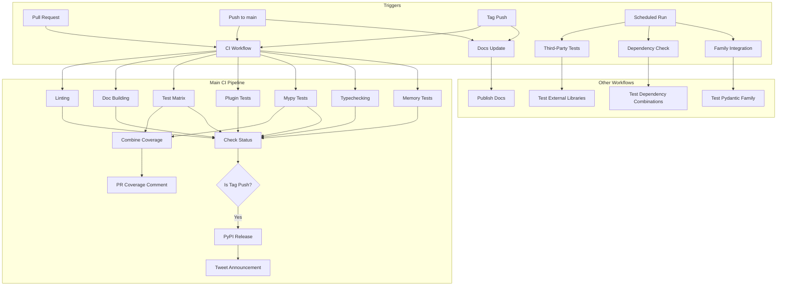
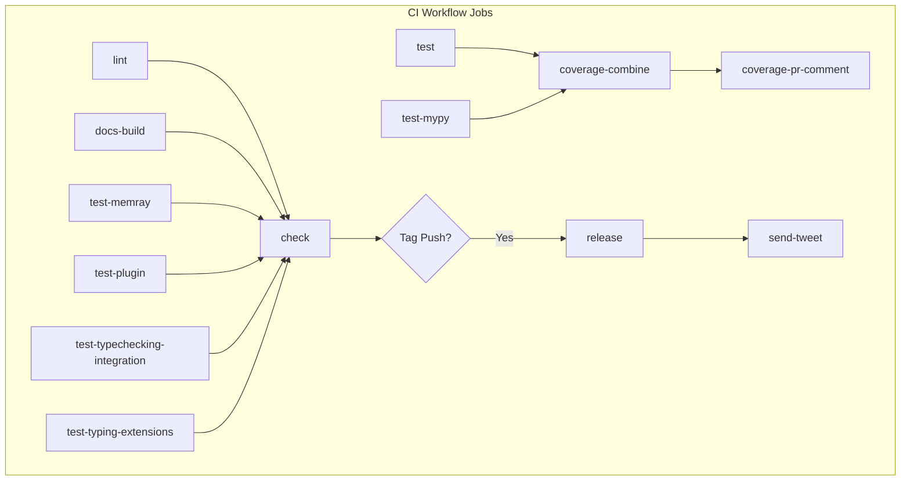
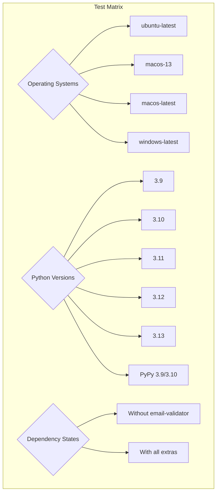
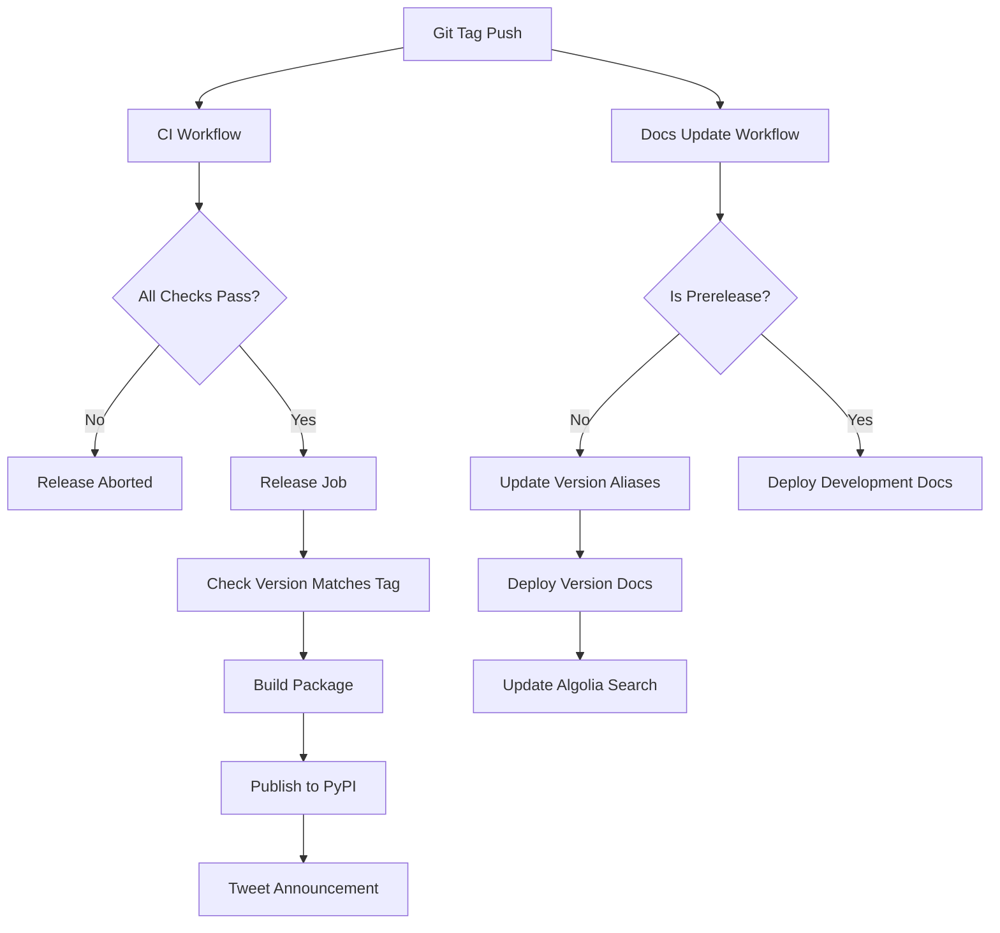

This document provides a detailed overview of the Continuous Integration and Continuous Deployment (CI/CD) pipeline used in the Pydantic project. It covers the GitHub Actions workflows, testing strategies, and release processes. For information about the testing framework and approach, see [Testing Framework](#7.1).

## Pipeline Overview

Pydantic employs a comprehensive CI/CD pipeline implemented with GitHub Actions to ensure code quality, maintain compatibility across different environments, and automate releases. The pipeline consists of multiple workflows that handle different aspects of the development lifecycle.

Sources: [.github/workflows/ci.yml:3-14](), [.github/workflows/docs-update.yml:3-12](), [.github/workflows/third-party.yml:11-20](), [.github/workflows/dependencies-check.yml:3-7](), [.github/workflows/integration.yml:3-6]()

## Main CI Workflow

The primary CI workflow is defined in `.github/workflows/ci.yml` and consists of multiple jobs that run in parallel to verify different aspects of the codebase.

### Triggering Events

The main CI workflow is triggered by the following events:
- Pushes to the `main` branch
- Any tag pushes (used for releases)
- Pull requests

### Jobs Structure

Sources: [.github/workflows/ci.yml:16-448]()

### Linting and Static Analysis

The `lint` job runs a series of checks on the codebase:
- Runs on multiple Python versions (3.9 through 3.13)
- Uses the pre-commit framework to run linters
- Checks code style, formatting, and other quality gates

Sources: [.github/workflows/ci.yml:17-40](), [.pre-commit-config.yaml:1-32]()

### Documentation Build

The `docs-build` job:
- Builds the documentation using MkDocs
- Ensures all documentation is valid and renders correctly
- Creates symbolic links for extra modules

Sources: [.github/workflows/ci.yml:42-66](), [build-docs.sh:1-26]()

## Test Matrix

The testing strategy employs a comprehensive matrix to ensure Pydantic works correctly across different environments:

The test job runs tests:
1. Without optional dependencies
2. With all extra dependencies installed
3. With different configurations on each platform

Sources: [.github/workflows/ci.yml:84-154](), [Makefile:64-67]()

### Memory Testing

The `test-memray` job uses the memray profiler to detect memory leaks and inefficient memory usage patterns.

Sources: [.github/workflows/ci.yml:68-82]()

### Type Checking

The CI includes dedicated jobs for mypy integration testing and type checking:
- `test-mypy`: Runs the mypy integration tests with different mypy versions
- `test-typechecking-integration`: Tests typechecking with both Mypy and Pyright

Sources: [.github/workflows/ci.yml:182-249](), [Makefile:41-62]()

### Coverage Tracking

The `coverage-combine` job:
- Collects coverage data from all test runs
- Combines them into a unified coverage report
- Creates both HTML and data files for analysis

For pull requests, the `coverage-pr-comment` job posts a comment with coverage information.

Sources: [.github/workflows/ci.yml:251-316](), [.github/workflows/upload-previews.yml:1-37]()

## Release Process

Pydantic uses a tag-based release process that is fully automated through the CI/CD pipeline:

The release process consists of the following steps:
1. A tag is pushed that matches the version in `pydantic/version.py`
2. The CI workflow runs all tests and checks
3. If successful, the `release` job builds and publishes the package to PyPI
4. The `send-tweet` job posts a release announcement on Twitter
5. The `docs-update` workflow updates the documentation site

Sources: [.github/workflows/ci.yml:365-448](), [.github/workflows/docs-update.yml:56-113]()

## Additional Workflows

### Third-Party Integration Tests

The `third-party.yml` workflow tests Pydantic with popular libraries that depend on it:

| Library | Description |
|---------|-------------|
| FastAPI | Web framework based on Pydantic models |
| SQLModel | ORM using Pydantic models |
| Beanie | MongoDB ODM |
| ODMantic | Alternative MongoDB ODM |
| Pandera | Data validation for pandas |
| OpenAPI Python Client | Client generator |
| Polar, BentoML, etc. | Other significant dependencies |

This workflow runs on a schedule and can be triggered manually to detect compatibility issues before they affect users.

Sources: [.github/workflows/third-party.yml:1-611]()

### Dependency Checking

The `dependencies-check.yml` workflow:
- Identifies first and last versions of dependencies
- Tests Pydantic with these versions across Python versions
- Ensures compatibility across the supported dependency range

Sources: [.github/workflows/dependencies-check.yml:1-54]()

### Performance Testing

The `codspeed.yml` workflow:
- Runs benchmarks to measure performance
- Reports results to CodSpeed
- Helps detect performance regressions

Sources: [.github/workflows/codspeed.yml:1-81]()

### Family Integration

The `integration.yml` workflow tests integration with other Pydantic family libraries:
- pydantic-settings
- pydantic-extra-types

Sources: [.github/workflows/integration.yml:1-26](), [tests/test_pydantic_extra_types.sh:1-15]()

## Development Workflow Integration

The CI/CD pipeline integrates with local development through several mechanisms:

### Makefile Commands

The Makefile provides commands that mirror CI checks:

| Command | Description |
|---------|-------------|
| `make test` | Runs the test suite |
| `make testcov` | Runs tests with coverage report |
| `make lint` | Runs linting checks |
| `make typecheck` | Runs type checking |
| `make format` | Auto-formats code |
| `make docs` | Builds documentation |
| `make all` | Runs the standard CI checks |

Sources: [Makefile:1-140]()

### Pre-commit Hooks

Pre-commit hooks run checks before code is committed:
- Prevent direct commits to main branch
- Check YAML/TOML syntax
- Fix file endings and whitespace
- Run linters and type checkers

Sources: [.pre-commit-config.yaml:1-32]()

## Project Specific Customizations

### Testing Environment Variables

Several environment variables control test behavior:
- `COLUMNS`: Set to 150 for consistent output formatting
- `UV_FROZEN`: Ensures dependency freezing with uv
- `FORCE_COLOR`: Enables colored test output
- `NUM_THREADS`: Controls parallel test execution

Sources: [.github/workflows/ci.yml:11-14](), [Makefile:3]()

### Dependency Management

The CI/CD pipeline uses `uv` for Python dependency management:
- Fast, deterministic package installation
- Supports lockfiles for reproducible environments
- Used consistently across all workflows

Sources: [.github/workflows/ci.yml:27-35](), [Makefile:14-17]()

## Continuous Documentation

Documentation is continuously built and published:
1. For every push to main, a development version is published
2. For releases, the documentation is updated with version aliases
3. The search index is updated for Algolia search integration

Sources: [.github/workflows/docs-update.yml:56-113]()

By following this comprehensive approach to CI/CD, Pydantic ensures high code quality, broad compatibility, and a smooth release process, all while maintaining excellent documentation.