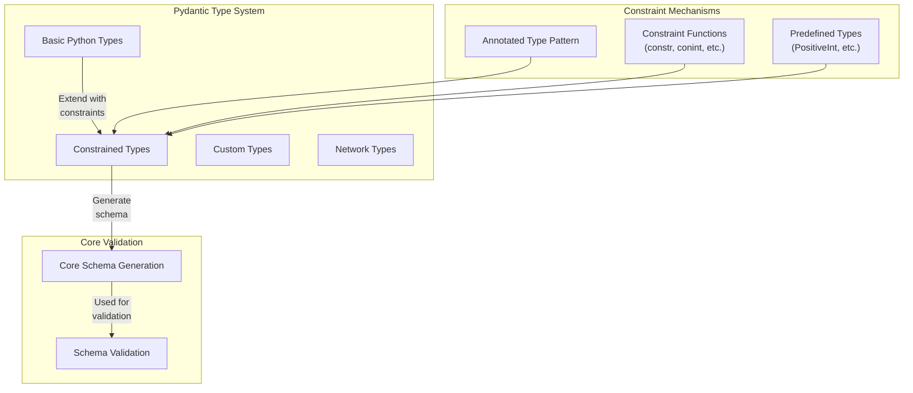
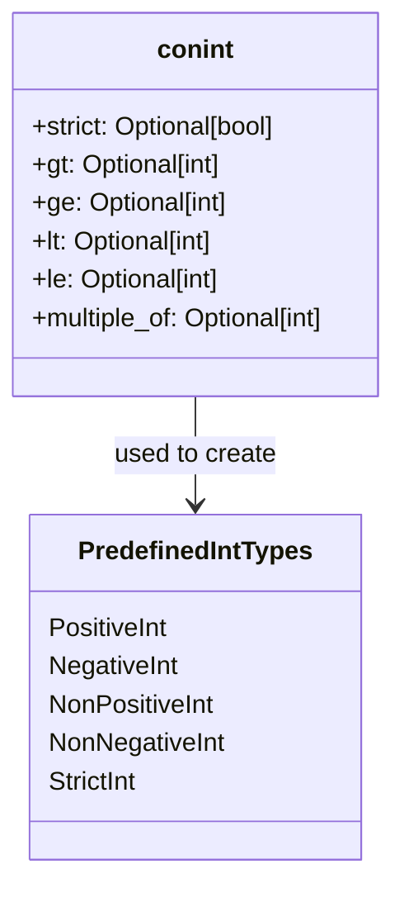
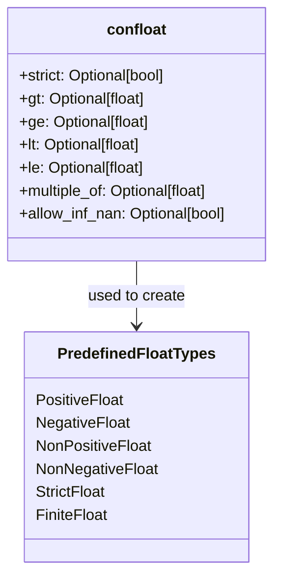
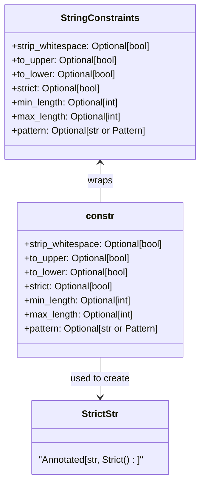

Constrained Types in Pydantic provide a way to define additional restrictions on basic Python types, such as strings, integers, floats, and collections. These types ensure that values not only match the expected type but also comply with specific constraints like minimum/maximum values, string patterns, or collection lengths.

This page explains the various constrained types available in Pydantic, how they are implemented, and how to use them effectively. For information about custom types and validators, see [Type System](#3).

## Constrained Types Overview

Constrained types are a key part of Pydantic's validation system. They extend basic Python types with additional validation requirements that are checked during model instantiation.



Sources: [pydantic/types.py:149-832](). [pydantic/types.py:836-904]().

The constrained types in Pydantic come in two forms:

1. **Constraint Functions**: Functions like `constr()`, `conint()` that return a constrained version of a type
2. **Predefined Constrained Types**: Ready-to-use types like `PositiveInt`, `StrictStr`, etc.

Since Pydantic v2, the recommended approach is to use Python's `Annotated` type with field constraints rather than the legacy constraint functions.

## Numeric Constrained Types

Pydantic provides constrained types for integers, floats, and decimals with various validation rules.

### Integer Constraints



Sources: [pydantic/types.py:151-235](). [pydantic/types.py:238-363]().

The `conint` function creates a constrained integer type with the following parameters:

- `strict`: When True, input must be an actual integer (not float or string)
- `gt`: Greater than (exclusive lower bound)
- `ge`: Greater than or equal (inclusive lower bound)
- `lt`: Less than (exclusive upper bound)
- `le`: Less than or equal (inclusive upper bound)
- `multiple_of`: Input must be a multiple of this value

Pydantic also provides several predefined integer constrained types:

| Type | Description | Implementation |
|------|-------------|----------------|
| `PositiveInt` | Integer > 0 | `Annotated[int, annotated_types.Gt(0)]` |
| `NegativeInt` | Integer < 0 | `Annotated[int, annotated_types.Lt(0)]` |
| `NonNegativeInt` | Integer ≥ 0 | `Annotated[int, annotated_types.Ge(0)]` |
| `NonPositiveInt` | Integer ≤ 0 | `Annotated[int, annotated_types.Le(0)]` |
| `StrictInt` | Integer validated in strict mode | `Annotated[int, Strict()]` |

### Float Constraints



Sources: [pydantic/types.py:411-497](). [pydantic/types.py:500-645]().

The `confloat` function creates a constrained float type with the same parameters as `conint`, plus:

- `allow_inf_nan`: When True, allows infinity and NaN values

Predefined float constrained types include:

| Type | Description | Implementation |
|------|-------------|----------------|
| `PositiveFloat` | Float > 0 | `Annotated[float, annotated_types.Gt(0)]` |
| `NegativeFloat` | Float < 0 | `Annotated[float, annotated_types.Lt(0)]` |
| `NonNegativeFloat` | Float ≥ 0 | `Annotated[float, annotated_types.Ge(0)]` |
| `NonPositiveFloat` | Float ≤ 0 | `Annotated[float, annotated_types.Le(0)]` |
| `StrictFloat` | Float validated in strict mode | `Annotated[float, Strict(True)]` |
| `FiniteFloat` | Float that must be finite | `Annotated[float, AllowInfNan(False)]` |

## String Constrained Types

Pydantic provides string constraints through the `constr` function and `StringConstraints` class.



Sources: [pydantic/types.py:693-829](). [pydantic/types.py:831-832]().

The `constr` function creates a constrained string type with the following parameters:

- `strip_whitespace`: When True, strips leading and trailing whitespace
- `to_upper`: When True, converts the string to uppercase
- `to_lower`: When True, converts the string to lowercase
- `strict`: When True, input must be an actual string
- `min_length`: Minimum string length
- `max_length`: Maximum string length
- `pattern`: Regex pattern that the string must match

In Pydantic v2, the recommended approach is to use `Annotated` with `StringConstraints` instead of `constr`:

```python