orm_user = UserDB(id=1, name="John", age=30)
user = UserModel.model_validate(orm_user)
```

These integrations showcase Pydantic's versatility and how it can be used as a validation layer in various Python applications and frameworks.

Sources: [tests/test_type_adapter.py:385-430](), [tests/test_validate_call.py:385-430]()

# Dataclass Support


## Purpose and Scope

This page documents Pydantic's enhanced dataclass functionality, which provides validation capabilities to Python dataclasses through the `@pydantic.dataclasses.dataclass` decorator. Pydantic dataclasses integrate seamlessly with the standard library `dataclasses` module while adding runtime validation, serialization, and schema generation.

For information about Pydantic's core model system, see [BaseModel](#2.1). For general field configuration, see [Field System](#2.2). For validation logic, see [Validators](#4.1).

## Decorator API and Core Types

### The `dataclass` Decorator

The `@pydantic.dataclasses.dataclass` decorator wraps standard Python dataclasses with Pydantic validation. It accepts all standard dataclass parameters plus Pydantic-specific configuration.

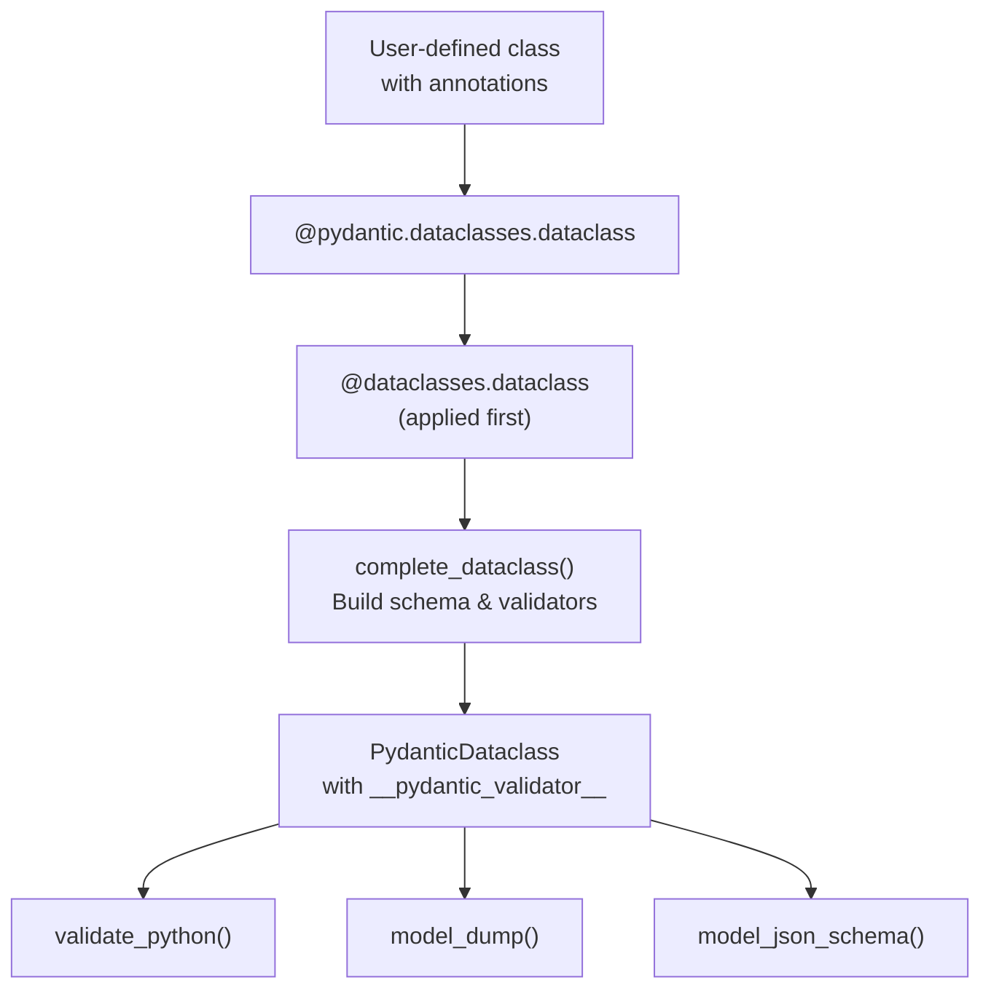

**Sources:** [pydantic/dataclasses.py:98-313]()

### Decorator Parameters

| Parameter | Type | Default | Description |
|-----------|------|---------|-------------|
| `init` | `Literal[False]` | `False` | Must be `False`; Pydantic provides custom `__init__` |
| `repr` | `bool` | `True` | Include field in `__repr__` |
| `eq` | `bool` | `True` | Generate `__eq__` method |
| `order` | `bool` | `False` | Generate comparison methods |
| `unsafe_hash` | `bool` | `False` | Generate `__hash__` method |
| `frozen` | `bool \| None` | `None` | Make dataclass immutable |
| `config` | `ConfigDict \| type \| None` | `None` | Pydantic configuration |
| `validate_on_init` | `bool \| None` | `None` | Deprecated; always validates |
| `kw_only` | `bool` | `False` | Require keyword-only arguments (Python 3.10+) |
| `slots` | `bool` | `False` | Use `__slots__` (Python 3.10+) |

**Sources:** [pydantic/dataclasses.py:29-96]()

### PydanticDataclass Protocol

Once decorated, a class gains the `PydanticDataclass` protocol attributes:

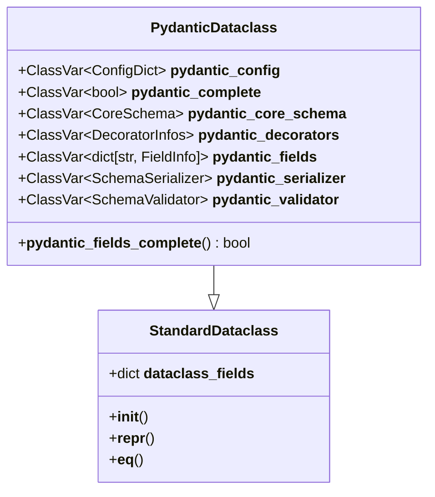

**Sources:** [pydantic/_internal/_dataclasses.py:40-63]()

## Dataclass Creation and Lifecycle

### Creation Flow

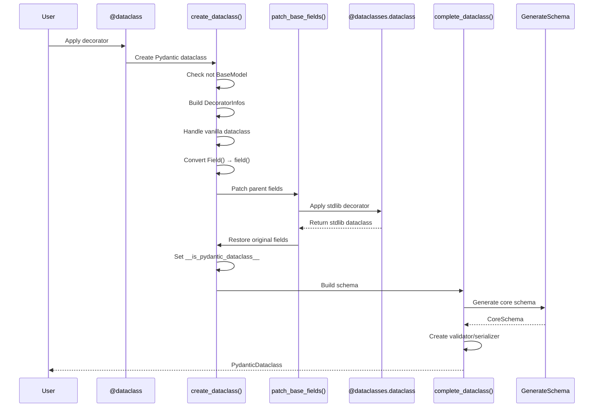

**Sources:** [pydantic/dataclasses.py:153-313](), [pydantic/_internal/_dataclasses.py:85-190]()

### The `create_dataclass` Function

The internal `create_dataclass` function orchestrates the transformation:

1. **Validation**: Ensures class is not already a `BaseModel` ([pydantic/dataclasses.py:164-168]())
2. **Configuration**: Merges decorator config with `__pydantic_config__` attribute ([pydantic/dataclasses.py:184-187]())
3. **Vanilla Handling**: Subclasses stdlib dataclasses to add validation ([pydantic/dataclasses.py:194-206]())
4. **Field Conversion**: Wraps `Field()` calls with `dataclasses.field()` ([pydantic/dataclasses.py:228-234]())
5. **Stdlib Application**: Applies `@dataclasses.dataclass` decorator ([pydantic/dataclasses.py:239-249]())
6. **Completion**: Builds schema and validators ([pydantic/dataclasses.py:310]())

**Sources:** [pydantic/dataclasses.py:153-313]()

### Field Patching System

The `patch_base_fields` context manager temporarily modifies parent dataclass fields:

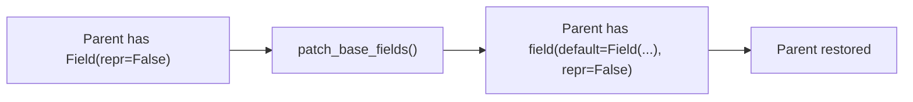

This ensures that `kw_only` and `repr` attributes from `Field()` are recognized by the stdlib `@dataclass` decorator during class construction.

**Sources:** [pydantic/_internal/_dataclasses.py:229-315]()

## Field Collection

### Dataclass Field Collection

Field collection for dataclasses differs from models because fields are already processed by stdlib:

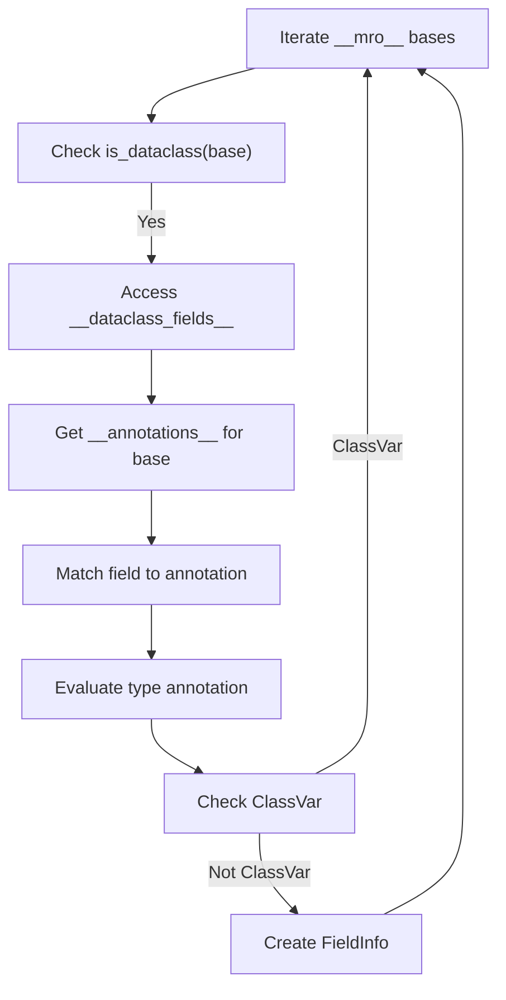

**Sources:** [pydantic/_internal/_fields.py:460-524]()

### Field Collection Process

The `collect_dataclass_fields` function:

1. Iterates through `__mro__` in reverse to respect inheritance
2. Accesses `__dataclass_fields__` from each base
3. Evaluates type annotations using namespace resolver
4. Filters out `ClassVar` annotations
5. Handles `InitVar` types specially
6. Creates `FieldInfo` instances from dataclass field metadata

**Sources:** [pydantic/_internal/_fields.py:460-524]()

### FieldInfo from Dataclass Field

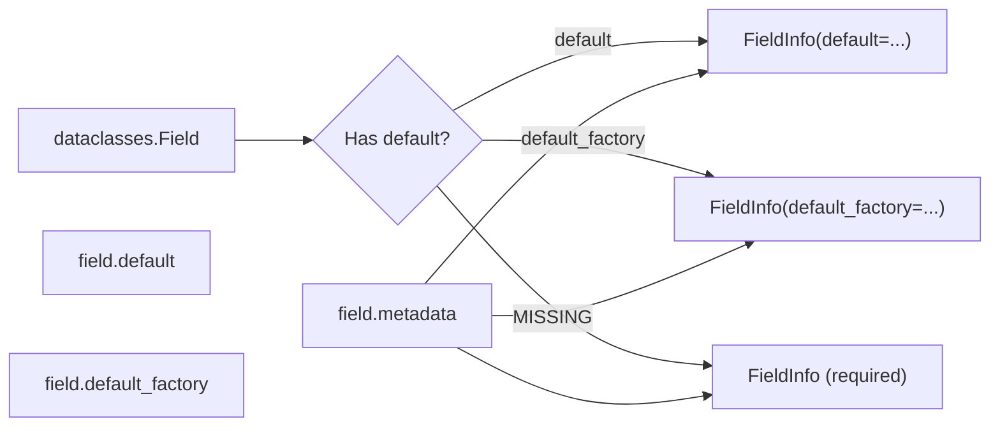

**Sources:** [pydantic/_internal/_fields.py:508-524]()

## Integration with Standard Library Dataclasses

### Converting Vanilla Dataclasses

Pydantic can enhance existing stdlib dataclasses:

```python
@dataclasses.dataclass
class VanillaDataclass:
    name: str
    age: int

# Enhance with validation
ValidatedDataclass = pydantic.dataclasses.dataclass(VanillaDataclass)
```

When converting, Pydantic:
1. Subclasses the original to avoid mutation
2. Preserves generics by including `Generic[*params]` in bases
3. Maintains original `__doc__` (if not default)
4. Forwards frozen/order/etc parameters

**Sources:** [pydantic/dataclasses.py:194-206](), [tests/test_dataclasses.py:807-840]()

### Inheritance from Vanilla Dataclasses

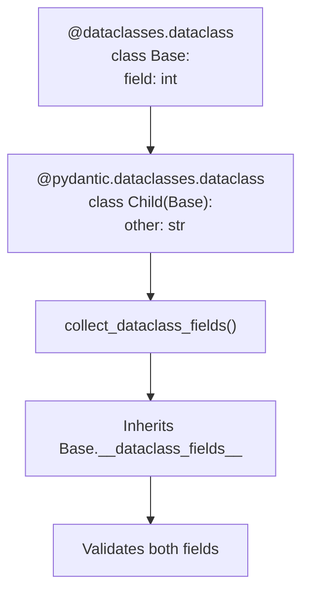

**Sources:** [tests/test_dataclasses.py:941-958](), [pydantic/_internal/_fields.py:488-499]()

### Field Compatibility

Both `dataclasses.field()` and `pydantic.Field()` work in Pydantic dataclasses:

| Feature | `dataclasses.field()` | `pydantic.Field()` |
|---------|----------------------|-------------------|
| `default` | ✓ | ✓ |
| `default_factory` | ✓ | ✓ |
| `init` | ✓ | ✓ |
| `repr` | ✓ | ✓ |
| `kw_only` | ✓ | ✓ |
| `metadata` | ✓ | ✓ |
| Validation constraints | ✗ | ✓ |
| Alias | ✗ | ✓ |
| JSON schema metadata | ✗ | ✓ |

**Sources:** [tests/test_dataclasses.py:573-591](), [pydantic/dataclasses.py:228-234]()

## Validation and Initialization

### Custom `__init__` Injection

Pydantic replaces the dataclass `__init__` with validation logic:

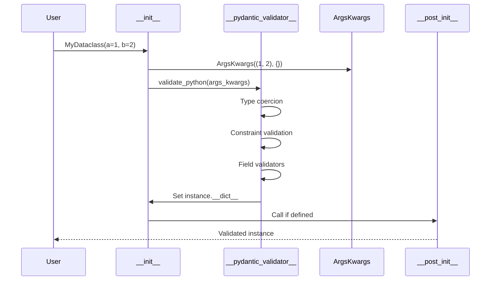

**Sources:** [pydantic/_internal/_dataclasses.py:118-122]()

### Validation Modes

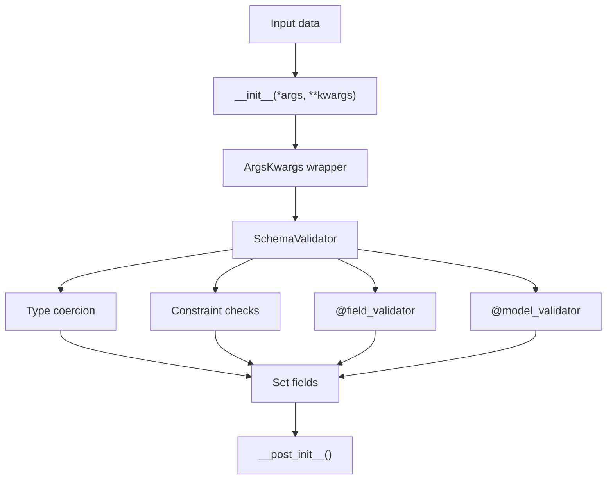

**Sources:** [pydantic/_internal/_dataclasses.py:118-122](), [tests/test_dataclasses.py:270-283]()

### Validate Assignment

With `validate_assignment=True`, field assignments are validated:

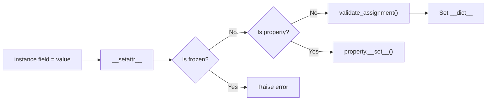

**Sources:** [pydantic/dataclasses.py:251-268](), [tests/test_dataclasses.py:120-130]()

## Dataclass Completion

### The `complete_dataclass` Function

This function builds the schema and creates validators/serializers:

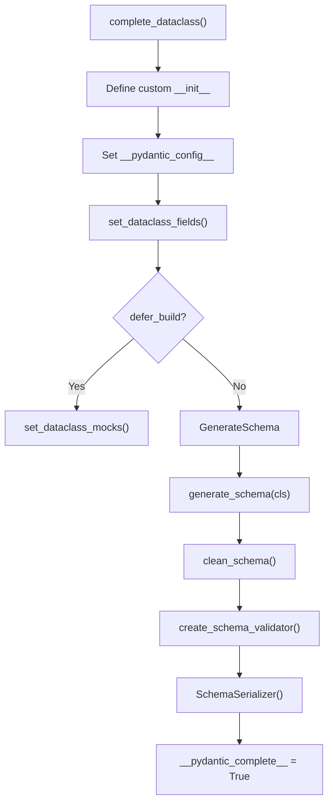

**Sources:** [pydantic/_internal/_dataclasses.py:85-190]()

### Deferred Building

When `defer_build=True` in config:
1. Mock validator/serializer are installed
2. Schema building is skipped
3. `__pydantic_complete__ = False`
4. First validation attempt triggers rebuild

**Sources:** [pydantic/_internal/_dataclasses.py:130-132]()

### Rebuilding Dataclasses

The `rebuild_dataclass` function handles forward reference resolution:

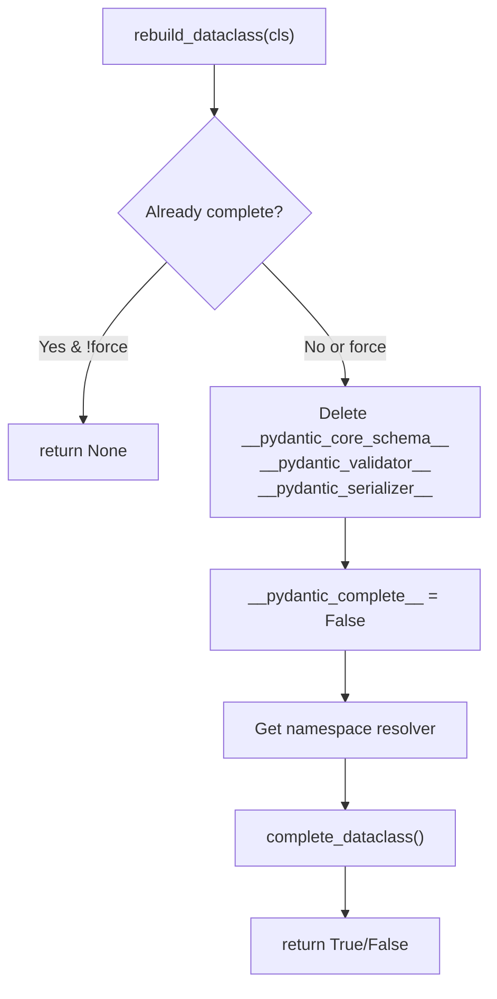

**Sources:** [pydantic/dataclasses.py:340-398]()

## Advanced Features

### InitVar Support

`InitVar` fields are passed to `__init__` but not stored:

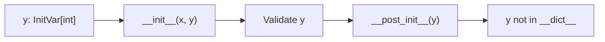

**Sources:** [tests/test_dataclasses.py:673-702]()

### `__post_init__` Hook

Called after validation completes:

1. All fields are validated and set
2. `__post_init__(*initvars)` is called
3. Can modify fields (unless frozen)
4. Can perform additional validation
5. `InitVar` parameters are passed as arguments

**Sources:** [tests/test_dataclasses.py:270-283](), [tests/test_dataclasses.py:380-396]()

### Frozen Dataclasses

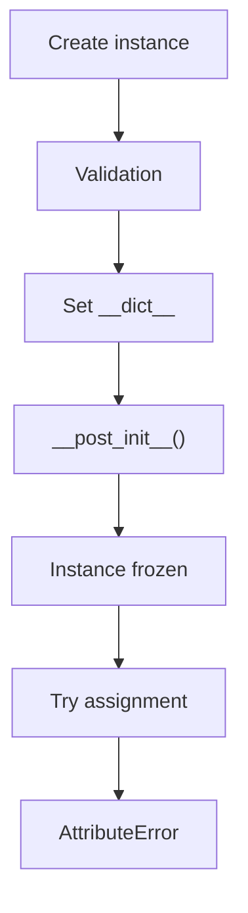

The `frozen` parameter can be set via decorator or config. Decorator takes priority.

**Sources:** [pydantic/dataclasses.py:209-220](), [tests/test_dataclasses.py:108-118]()

### Computed Fields

Computed fields work in dataclasses:

```python
@dataclasses.dataclass
class MyDataclass:
    x: int
    
    @computed_field
    @property
    def double_x(self) -> int:
        return 2 * self.x
```

- Not included in validation schema
- Included in serialization schema
- Appear in `model_dump()` output

**Sources:** [tests/test_dataclasses.py:1285-1328]()

## Schema Generation

### Core Schema Generation

Dataclasses use the `dataclass_schema` core schema type:

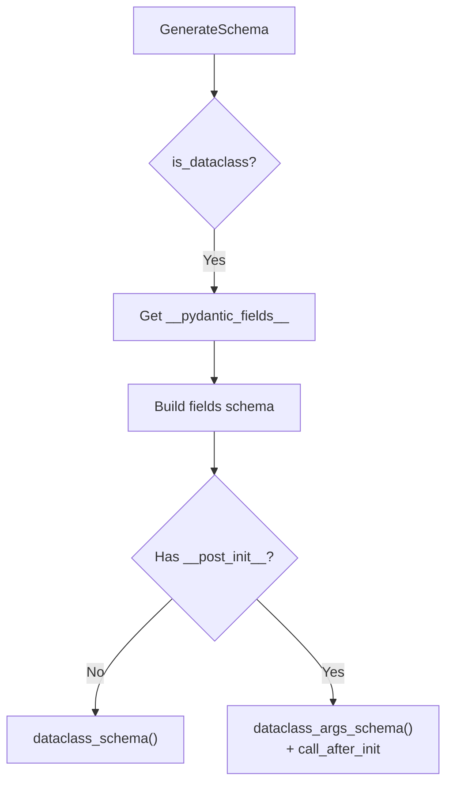

**Sources:** [pydantic/_internal/_generate_schema.py]() (referenced but not in provided files)

### JSON Schema Generation

JSON schemas for dataclasses:

| Mode | Schema Representation |
|------|----------------------|
| `validation` | Object with required fields |
| `serialization` | Object including computed fields |

Nested dataclasses become `$ref` definitions.

**Sources:** [tests/test_dataclasses.py:607-645](), [tests/test_dataclasses.py:648-670]()

## Utility Functions

### `is_pydantic_dataclass`

Type guard to check if a class is a Pydantic dataclass:

```python
def is_pydantic_dataclass(class_: type[Any], /) -> TypeGuard[type[PydanticDataclass]]:
    return '__is_pydantic_dataclass__' in class_.__dict__ and dataclasses.is_dataclass(class_)
```

Checks both the Pydantic marker and stdlib dataclass status.

**Sources:** [pydantic/dataclasses.py:401-413]()

### `is_stdlib_dataclass`

Internal function to identify stdlib-only dataclasses:

```python
def is_stdlib_dataclass(cls: type[Any], /) -> TypeIs[type[StandardDataclass]]:
    return '__dataclass_fields__' in cls.__dict__ and not hasattr(cls, '__pydantic_validator__')
```

Used during dataclass creation to detect vanilla dataclasses for subclassing.

**Sources:** [pydantic/_internal/_dataclasses.py:193-205]()

### `set_dataclass_mocks`

Installs placeholder validator/serializer when building is deferred:

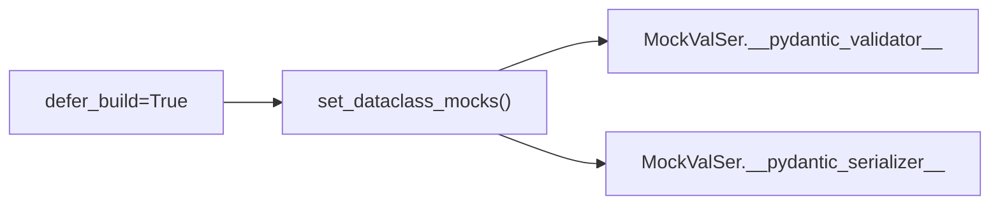

**Sources:** [pydantic/_internal/_dataclasses.py:131]()

## Configuration and ConfigDict

Dataclasses support the same `ConfigDict` as models:

| Config Option | Effect in Dataclasses |
|---------------|----------------------|
| `validate_assignment` | Enable validation on field assignment |
| `frozen` | Make dataclass immutable (alternative to decorator param) |
| `arbitrary_types_allowed` | Allow non-Pydantic types |
| `str_max_length` | String length validation |
| `extra` | Handling of extra attributes during assignment |
| `revalidate_instances` | Revalidate dataclass instances |

**Sources:** [tests/test_dataclasses.py:120-149](), [tests/test_dataclasses.py:515-540]()

### Config Priority

1. Decorator `config` parameter (highest)
2. Class `__pydantic_config__` attribute
3. Default Pydantic config (lowest)

Warnings are issued if both decorator and attribute are specified.

**Sources:** [pydantic/dataclasses.py:175-181]()

# Function Validation


## Overview

Function validation in Pydantic enables automatic validation of function arguments and return values using the `@validate_call` decorator. This system extends Pydantic's validation capabilities beyond models to regular Python functions, methods, and lambdas by transforming function signatures into validation schemas and wrapping function calls with validation logic.

For field-level validation within models, see [Validators](#4.1). For model-level validation, see [Model Configuration](#2.3).

**Sources:** [pydantic/validate_call_decorator.py:1-117]()

## Decorator Interface

The `@validate_call` decorator is the primary entry point for function validation. It can be applied either as a bare decorator or with configuration options:

```python
@validate_call
def foo(a: int, b: int):
    return a + b

@validate_call(config={'strict': True}, validate_return=True)
def bar(x: int) -> int:
    return x * 2
```

### Decorator Parameters

| Parameter | Type | Description |
|-----------|------|-------------|
| `func` | Callable or None | The function to validate (when used as bare decorator) |
| `config` | ConfigDict or None | Configuration dictionary for validation behavior |
| `validate_return` | bool | Whether to validate the function's return value (default: False) |

The decorator supports various callable types defined in `VALIDATE_CALL_SUPPORTED_TYPES`:
- Regular functions
- Methods (instance, class, static)
- Lambda functions
- `functools.partial` objects

**Sources:** [pydantic/validate_call_decorator.py:72-117](), [tests/test_validate_call.py:28-59]()

## Validation Flow Architecture

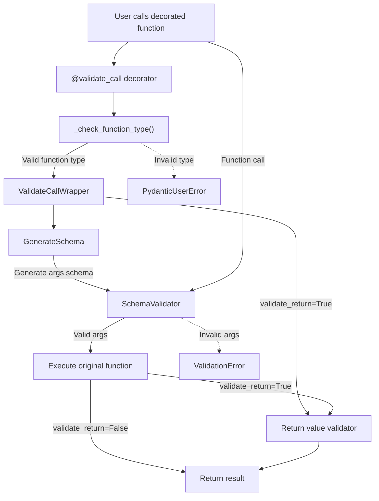

**Sources:** [pydantic/validate_call_decorator.py:24-70](), [pydantic/_internal/_validate_call.py:49-141]()

## ValidateCallWrapper Implementation

The `ValidateCallWrapper` class handles the core logic of function validation. It wraps the original function and intercepts all calls to perform validation.

### Core Components

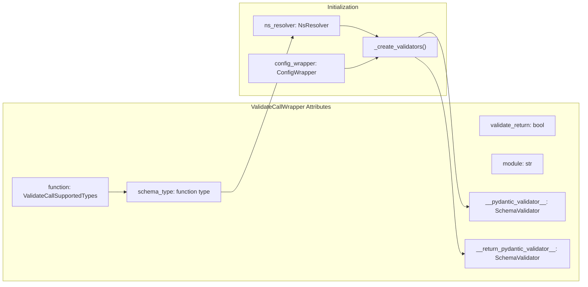

### Initialization Process

The wrapper is initialized in `__init__` with the following steps:

1. **Extract function metadata**: Store the function, extract its module and qualname
2. **Create namespace resolver**: Build `NsResolver` to handle forward references in type annotations
3. **Configure wrapper**: Create `ConfigWrapper` from provided config
4. **Conditional schema building**: If `defer_build` is not enabled, immediately create validators; otherwise defer until first call

**Sources:** [pydantic/_internal/_validate_call.py:65-90]()

### Validator Creation

The `_create_validators` method generates schemas and validators:

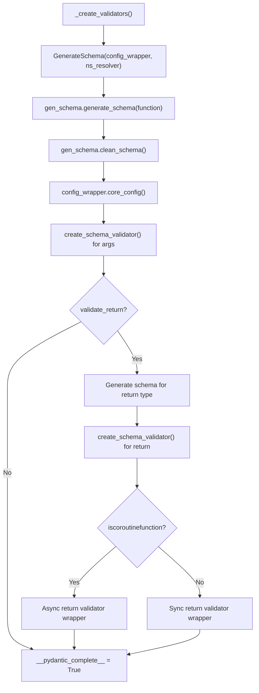

**Sources:** [pydantic/_internal/_validate_call.py:91-131]()

### Call Interception

When the wrapped function is called, the `__call__` method:

1. **Lazy validation setup**: If validators weren't created during initialization (deferred build), create them now
2. **Package arguments**: Wrap positional and keyword arguments in `ArgsKwargs` object
3. **Validate arguments**: Pass through `__pydantic_validator__` 
4. **Execute function**: Call the validated function with validated args
5. **Validate return** (optional): Pass return value through `__return_pydantic_validator__` if configured

**Sources:** [pydantic/_internal/_validate_call.py:132-141]()

## Function Schema Generation

Function signatures are transformed into pydantic-core schemas through the `GenerateSchema` class. This enables the same validation logic used for models to work with functions.

### Argument Types and Schema Mapping

| Argument Kind | Schema Type | Example |
|---------------|-------------|---------|
| Positional-only (`/`) | `arguments_schema` with positional parameters | `def f(a, /, b): ...` |
| Keyword-only (`*`) | `arguments_schema` with keyword parameters | `def f(*, a, b): ...` |
| Variable positional (`*args`) | `arguments_schema` with var_args_schema | `def f(*args): ...` |
| Variable keyword (`**kwargs`) | `arguments_schema` with var_kwargs_schema | `def f(**kwargs): ...` |
| Mixed | Combined `arguments_schema` | `def f(a, /, b, *args, c, **kwargs): ...` |

### Special Handling: TypedDict Unpacking

When using `Unpack[TypedDict]` for `**kwargs`, the decorator validates kwargs against the TypedDict schema:

```python
class TD(TypedDict):
    a: int
    b: str

@validate_call
def foo(**kwargs: Unpack[TD]):
    pass

foo(a=1, b='test')  # Valid
foo(a='invalid')     # ValidationError
```

The implementation checks for overlaps between regular parameters and TypedDict keys, raising `PydanticUserError` if positional-or-keyword parameters conflict with TypedDict keys.

**Sources:** [tests/test_validate_call.py:286-417]()

## Function Type Validation

The `_check_function_type` function validates that the decorated object is a supported callable type:

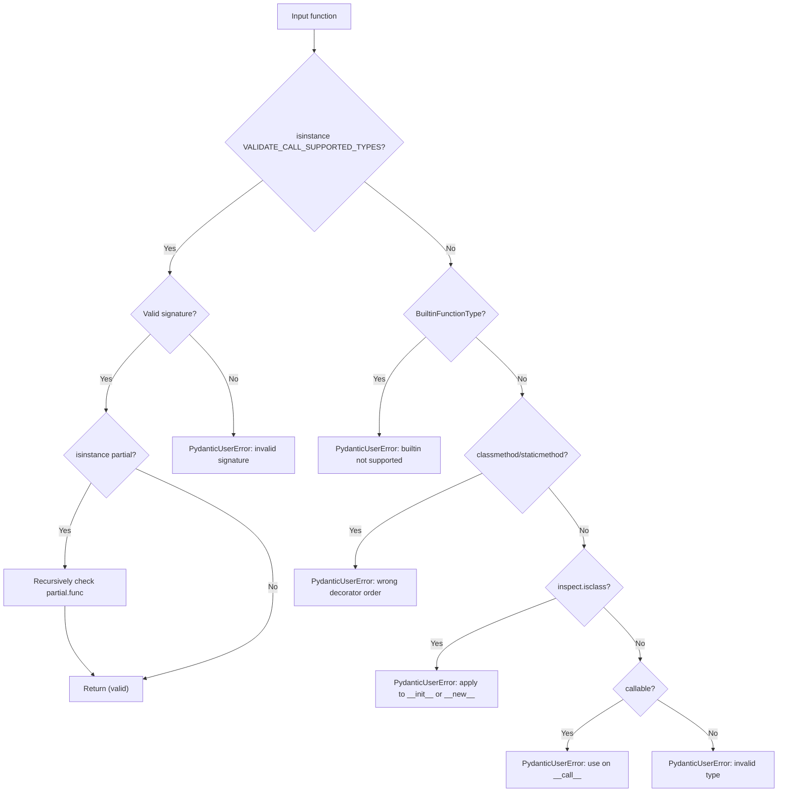

**Sources:** [pydantic/validate_call_decorator.py:24-70]()

## Advanced Features

### Return Value Validation

When `validate_return=True`, the decorator validates the function's return value against its return type annotation:

```python
@validate_call(validate_return=True)
def add(a: int, b: int) -> int:
    return a + b

add(1, 2)      # Returns 3
add(1, 1.5)    # ValidationError on return value
```

The implementation creates a separate validator for the return type and wraps the result in an appropriate handler (async or sync).

**Sources:** [pydantic/_internal/_validate_call.py:105-128]()

### Async Function Support

The wrapper detects coroutine functions using `inspect.iscoroutinefunction` and creates appropriate wrappers:

- For regular functions: Direct validation wrapper
- For async functions: Async wrapper that awaits the coroutine before/after validation

The `update_wrapper_attributes` function ensures the wrapper preserves the async nature of the original function.

**Sources:** [pydantic/_internal/_validate_call.py:28-46]()

### Configuration Options

All `ConfigDict` options are supported:

```python
@validate_call(config={
    'strict': True,              # Strict type checking
    'arbitrary_types_allowed': True,  # Allow arbitrary types
    'alias_generator': lambda x: x + '_alias'  # Generate aliases
})
def process(data: CustomType) -> int:
    return len(data)
```

**Sources:** [tests/test_validate_call.py:730-776]()

### Field-Level Annotations

Function parameters support Pydantic's `Field` and `Annotated` for additional validation:

```python
@validate_call
def compute(
    value: Annotated[int, Field(gt=0, lt=100)],
    name: Annotated[str, Field(min_length=1)]
) -> str:
    return f"{name}: {value}"
```

**Sources:** [tests/test_validate_call.py:419-436](), [tests/test_validate_call.py:778-796]()

## Integration with Plugin System

The `validate_call` decorator integrates with Pydantic's plugin system through the `create_schema_validator` function. When plugins are installed, they receive notifications about function validation:

```mermaid
graph LR
    ValidateCall["@validate_call"]
    CreateValidator["create_schema_validator()"]
    GetPlugins["get_plugins()"]
    SchemaTypePath["SchemaTypePath(module, qualname)"]
    
    PluggableValidator["PluggableSchemaValidator"]
    SchemaValidator["SchemaValidator"]
    
    Plugin1["Plugin.new_schema_validator()"]
    Plugin2["Plugin.new_schema_validator()"]
    
    ValidateCall --> CreateValidator
    CreateValidator --> GetPlugins
    CreateValidator --> SchemaTypePath
    GetPlugins -->|"plugins exist"| PluggableValidator
    GetPlugins -->|"no plugins"| SchemaValidator
    
    PluggableValidator --> Plugin1
    PluggableValidator --> Plugin2
```

Plugins receive:
- `schema_kind='validate_call'`
- `schema_type`: The original function
- `schema_type_path`: Module and qualname of the function

**Sources:** [pydantic/_internal/_validate_call.py:96-104](), [tests/test_plugins.py:410-447]()

## JSON Schema Generation

Functions decorated with `@validate_call` can generate JSON schemas through `TypeAdapter`:

```python
@validate_call
def process(a: int, b: int = None):
    return f'{a}, {b}'

schema = TypeAdapter(process).json_schema()
# Returns schema for function arguments
```

The schema generation handles:
- Positional-only arguments → array schema with `prefixItems`
- Keyword-only arguments → object schema with `properties`
- Mixed argument types → raises `PydanticInvalidForJsonSchema`
- Variable arguments (`*args`) → array schema with `items`
- Variable keyword arguments (`**kwargs`) → object schema with `additionalProperties`

**Sources:** [tests/test_validate_call.py:626-707]()

## Error Handling and Validation Errors

Validation errors from `@validate_call` decorated functions follow the same structure as model validation errors:

```python
@validate_call
def add(a: int, b: int):
    return a + b

try:
    add('x', 2)
except ValidationError as e:
    print(e.errors())
    # [{'type': 'int_parsing', 'loc': (0,), 'msg': '...', 'input': 'x'}]
```

Common error types:
- `missing_argument`: Required argument not provided
- `unexpected_positional_argument`: Too many positional args
- `unexpected_keyword_argument`: Unknown keyword arg
- `multiple_argument_values`: Argument provided both positionally and by keyword
- `missing_positional_only_argument`: Positional-only arg passed as keyword
- `missing_keyword_only_argument`: Keyword-only arg passed positionally

**Sources:** [tests/test_validate_call.py:152-201]()

## Wrapper Attribute Preservation

The `update_wrapper_attributes` function ensures the decorated function preserves key attributes:

```python
@validate_call
def foo_bar(a: int, b: int):
    """This is the foo_bar method."""
    return f'{a}, {b}'

assert foo_bar.__doc__ == 'This is the foo_bar method.'
assert foo_bar.__name__ == 'foo_bar'
assert foo_bar.__module__ == 'module_name'
assert foo_bar.__qualname__ == 'path.to.foo_bar'
assert callable(foo_bar.raw_function)  # Access to original function
```

For `partial` objects, special handling generates names like `partial(func_name)`.

**Sources:** [pydantic/_internal/_validate_call.py:18-46](), [tests/test_validate_call.py:28-53]()